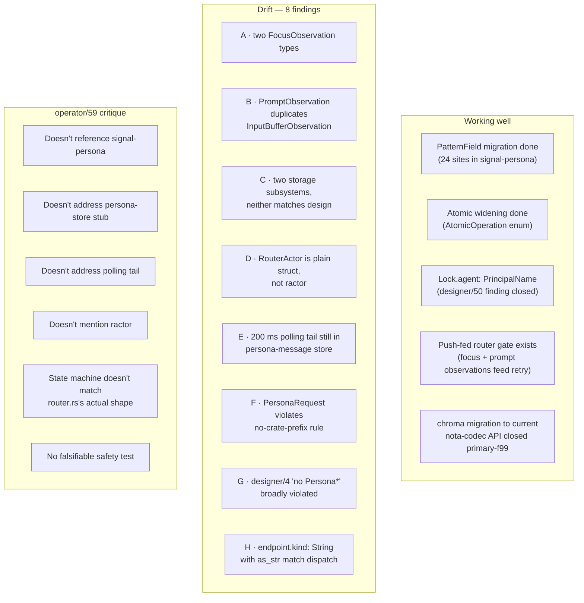
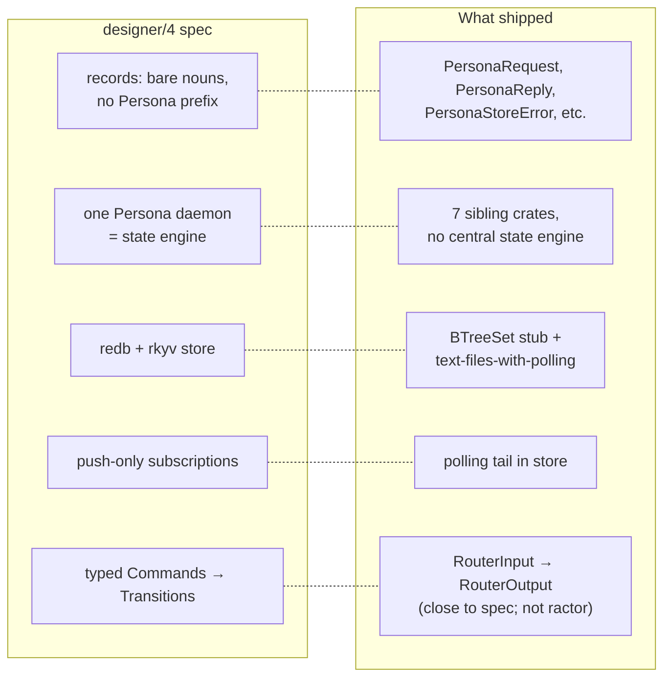
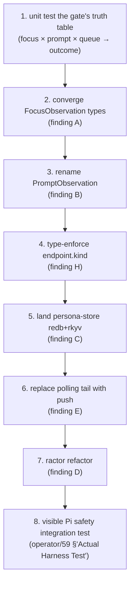

# 60 · Persona ecosystem audit + critique of operator/59

Status: deep audit of the persona-family code as of
2026-05-09, with a focused critique of
`reports/operator/59-safe-harness-delivery-implementation-vision.md`
and the in-flight router work it describes.

Author: Claude (designer)

The persona ecosystem — `signal-persona` (contract),
`persona-message` (CLI + first store), `persona-router`
(in-flight), `persona-system` (Niri focus source),
`persona-harness` (skeleton), `persona-wezterm` (PTY +
terminal adapter), `persona-store` (stub) — totals **5005 LoC
across 41 files**. The shape designer/4 prescribed, the
contract `signal-persona` defines, and what operator has
shipped or is shipping have **drifted from each other in
several specific places**. Operator/59 is a thoughtful
implementation vision, but it doesn't acknowledge the drift,
which means landing it as written would deepen the gap.

---

## 0 · TL;DR



| Outcome | Count |
|---|---:|
| Architectural drift findings | 8 |
| Critiques of operator/59 | 6 |
| What's working | 5 |
| Recommendation: rewrite operator/59 grounded in current state | 1 |

---

## 1 · What landed (state survey)

### 1.1 · Components that exist

| Crate | LoC | Status |
|---|---:|---|
| `signal-persona` | 916 | Contract; recent (rebased on sema verbs, PatternField shared) |
| `persona-message` | 1572 | First slice landed (operator/52); has its own store.rs + delivery.rs |
| `persona-router` | 457 | In-flight (operator's current claim) |
| `persona-system` | 740 | NiriFocusSource shipped (operator/54 vision implemented) |
| `persona-harness` | 88 | Skeleton only |
| `persona-wezterm` | 1053 | PTY + terminal capture; biggest |
| `persona-store` | 96 | **Stub** — BTreeSet&lt;String&gt;, no redb, no rkyv |
| `persona-orchestrate` | n/a | Skeleton only (last commit "scaffold persona-orchestrate") |

Total: **~5000 LoC** of persona-family Rust.

### 1.2 · Recent commit cadence

Operator's last 5 commits in persona-message:

```
fc0a55c add guarded pty message delivery
d165adb add pi niri focus harness test
2887b6e add message actor registration
8ea785d refer to signal-persona contract
29edbca document message boundary role
```

Operator is currently claiming `persona-router`, `persona-message`,
`persona-system`, `persona-wezterm` for *"implement router actor
event-driven delivery retry"* — which is the work operator/59
describes.

### 1.3 · Tests that exist

| Crate | Tests |
|---|---|
| `persona-router` | `tests/smoke.rs` — 4 tests, but reference *old* API (`MessageBody`, `MessageId`, `PersonaMessage`, `PendingDelivery`) that no longer exists in router.rs. **Tests are stale relative to current code.** |
| `persona-message` | `tests/{actual_harness, daemon, message, two_process}.rs` — actual_harness uses Codex+Claude live, real model calls |
| `persona-system` | not surveyed (likely fixture-driven for niri) |
| `signal-persona` | not surveyed |

The `persona-router` smoke test compiling under the in-flight
state is the first thing operator should verify before
landing.

---

## 2 · Designer/4 prescribed vs what shipped (drift map)



The parallel-crate split (designer/19) is a deliberate
deviation from designer/4's "one daemon" — that's fine and
documented. The other deviations aren't documented or
intended.

---

## 3 · Eight drift findings

### 3.1 · Finding A — two `FocusObservation` types

The contract crate `signal-persona` defines:

```rust
// signal-persona/src/observation.rs:14-18
pub struct FocusObservation {
    target: PrincipalName,
    focused: bool,
}
```

`persona-system` defines a different one (used by the
in-flight router):

```rust
// persona-system/src/event.rs (paraphrased — used at router.rs:138)
pub struct FocusObservation {
    pub target: SystemTarget,    // Niri window id
    pub focused: bool,
    pub generation: FocusGeneration,
}
```

The router (`persona-router/src/router.rs:10`) imports the
*persona-system* flavor, not the contract flavor:

```rust
use persona_system::{FocusObservation, SystemTarget};
```

**Why it's bad:** the contract crate is supposed to be the
single canonical wire vocabulary (per
`skills/contract-repo.md`). The router is now talking a
different dialect than what `signal-persona` specifies. If
another consumer (a remote subscriber, a future cross-machine
node) implements the contract version, it can't speak to this
router.

**Fix:** decide which type wins, then converge. Two options:

1. **The contract wins.** Move generation/SystemTarget into
   `signal-persona::FocusObservation`. The router consumes
   the contract type. persona-system maps Niri events to
   the contract.
2. **System owns the system-side type.** signal-persona
   keeps the wire-vocabulary version (PrincipalName); the
   router internally translates persona-system facts to
   contract observations before the gate. Persona-system's
   type stays a concrete fact about the OS layer.

Either is defensible; the current state — both definitions
in use, router preferring the system flavor — isn't.

### 3.2 · Finding B — `PromptObservation` duplicates `InputBufferObservation`

The contract crate has it:

```rust
// signal-persona/src/observation.rs:21-31
pub struct InputBufferObservation {
    target: PrincipalName,
    state: InputBufferState,
}
pub enum InputBufferState { Empty, Occupied, Unknown }
```

The router invents a local copy:

```rust
// persona-router/src/router.rs:251-255
pub struct PromptObservation {
    pub actor: ActorId,
    pub state: PromptFact,
}
pub enum PromptFact { Empty, Occupied, Unknown }
```

operator/59 also calls it `PromptObservation`/`PromptState`.
The contract crate's name (`InputBufferObservation`) is the
canonical vocabulary; operator/59 + router invented a new
name without retiring the old one.

**Fix:** rename router's local type to match the contract,
and use the contract's enum directly. `signal-persona` is
the source-of-truth.

### 3.3 · Finding C — two storage subsystems, neither matches the design

Designer/4 + skills/rust-discipline.md §"redb + rkyv" require
durable state to live in **redb tables of rkyv values**, one
file per component. What actually shipped:

**`persona-store`** (the crate intended for this):

```rust
// persona-store/src/store.rs:1-32 — entire file
pub struct PersonaStore {
    schema: SchemaGuard,
    committed: BTreeSet<String>,
}
```

A 32-line in-memory `BTreeSet<String>`. No redb. No rkyv.
No persistence. Stub.

**`persona-message`** (which has its OWN store):

```rust
// persona-message/src/store.rs:213-236 — text-file tail loop
loop {
    let text = std::fs::read_to_string(&path)?;
    // ... append matching lines to output ...
    thread::sleep(Duration::from_millis(200));
}
```

Text-files-on-disk, polled. The very anti-pattern designer/12
+ skills/push-not-pull.md were written to ban.

**Why it's bad:** two storage subsystems exist; neither is
the redb+rkyv shape; nothing the router could commit to has a
durable home; the polling loop is a `skills/push-not-pull.md`
violation that operator/52 explicitly flagged as
*"transitional"* and operator/59 ignores.

**Fix:** persona-store needs the actual redb+rkyv
implementation before persona-router can have meaningful
durable state. Persona-message's text-file store needs to
either go through persona-store (preferred) or be marked
explicitly as a debug path that doesn't survive the next
cleanup. The polling tail must be replaced with push delivery
(the store fires events; subscribers consume; no sleeps).

### 3.4 · Finding D — `RouterActor` is a plain struct, not a ractor actor

Designer/4 §5.5 names the router as "the reducer." Skills says
ractor is the default for "any component with state and a
message protocol" (`skills/rust-discipline.md` §"Actors").
The router has both: state (`actors`, `pending`, `gate`) and
a typed message protocol (`RouterInput`/`RouterOutput`).

What shipped (`persona-router/src/router.rs:106`):

```rust
pub struct RouterActor {
    actors: HashMap<ActorId, HarnessActor>,
    pending: Vec<Message>,
    gate: DeliveryGate,
}

impl RouterActor {
    pub fn apply(&mut self, input: RouterInput) -> Result<RouterOutput> { ... }
}
```

A plain struct with `apply(&mut self, ...)` — sync, single-threaded,
no actor framework. The `Daemon` wraps it in a UnixListener +
single-threaded loop.

operator/59 says *"every harness should be represented by an
actor. The actor owns its endpoint and its current
delivery-relevant facts"* — but doesn't name ractor. The
in-flight router doesn't use ractor either.

**Why it's bad (mostly):** a plain `apply(&mut self, ...)`
struct is simpler than ractor for the current single-process,
single-listener-loop scope. But operator/59's vision of
push-fed observations from multiple sources (Niri stream,
prompt recognizer, message store) into a router that fans
out to per-harness actors *is* the ractor case. Building
without ractor now means rewriting later.

**Fix:** either commit to ractor and refactor the router
before adding more inputs, or write a designer report
acknowledging the deviation and naming when ractor will
land. Pretending the design hasn't drifted from
skills/rust-discipline.md isn't an option.

### 3.5 · Finding E — 200 ms polling tail still in persona-message

`persona-message/src/store.rs:235`:

```rust
thread::sleep(Duration::from_millis(200));
```

Inside a tail loop that reads the message file every 200 ms.
operator/52 said this was transitional; it survived the
operator/52 commit; it survives all subsequent commits;
operator/59 doesn't address it.

The **intent** of designer/12 + skills/push-not-pull.md was to
make polling a design failure. The 200 ms loop is the exact
shape both documents disallow. Operator/59 talks about push
sources for focus and prompt observations but treats the
**store's tail** as out-of-scope — yet the store's tail is
exactly where push delivery into the router should originate.

**Fix:** replace the tail loop with an actor that fires
events when new messages append. The router subscribes; no
sleep anywhere. This is the load-bearing slice operator/59
should call out as prerequisite to "router-fed-by-push."

### 3.6 · Finding F — `PersonaRequest` etc. violate the no-crate-prefix rule

I just landed `skills/naming.md` §"Anti-pattern: prefixing
type names with the crate name" — yet:

| Type | Lives in | Should be |
|---|---|---|
| `PersonaRequest` | signal-persona | `Operation` (already aliased as `Request<Operation>` via signal_core) |
| `PersonaReply` | signal-persona | `Reply` |
| `PersonaStore` | persona-store | `Store` |
| `PersonaSignalError` | signal-persona | `Error` |
| `PersonaSystemError` | persona-system | `Error` |
| `PersonaRouterError` | persona-router | `Error` |
| `PersonaMessage` | persona-router (test) | `Message` |
| `NiriFocusSource` | persona-system | (debatable — Niri is descriptive of which backend, not the crate name) |

The crate path already disambiguates
(`signal_persona::Operation`, `persona_store::Store`,
`persona_router::Error`); the prefix is redundant ceremony
that I just landed a rule against.

**Fix:** mechanical rename pass across signal-persona +
persona-* crates. Not blocking; do as a sweep.

### 3.7 · Finding G — designer/4's broader naming convention

Designer/4 §5.3:
> Naming convention: bare nouns (no `Persona*` prefix; no
> `*Record` suffix — see my earlier audit).

This is a *stronger* rule than F (it's the naming convention
designer/4 set down two months ago, before the rule landed
as a workspace skill). The implementation shipped with the
prefix throughout. Either:

1. The rule was forgotten, and F's mechanical sweep fixes it.
2. The rule was deliberately dropped at some point; the
   designer/4 §5.3 paragraph should be edited to reflect
   that.

Recommend (1) — F's sweep IS this rule's enforcement. Update
designer/4 if the decision was actually a deliberate reversal,
which I don't think it was.

### 3.8 · Finding H — `endpoint.kind: String` with `as_str()` match dispatch

`persona-message/src/delivery.rs:74-79`:

```rust
match endpoint.kind.as_str() {
    "human" => Ok(DeliveryOutcome::unreachable()),
    "pty-socket" => self.deliver_to_pty_socket(endpoint, prompt),
    "wezterm-pane" => self.deliver_to_wezterm_pane(endpoint, prompt),
    _ => Ok(DeliveryOutcome::unreachable()),
}
```

`EndpointKind` is wrapped as `pub struct EndpointKind(String)`
(NotaTransparent newtype). The newtype is a label; the
*dispatch* is on the inner string via `as_str()` matching
literal strings. This is the exact pattern flagged in
`skills/rust-discipline.md` §"Don't hide typification in
strings" §"Wrong: dispatching on string prefix at runtime."

The fix is the closed enum:

```rust
pub enum EndpointKind {
    Human,
    PtySocket,
    WezTermPane,
}
```

Then dispatch is exhaustive at compile time; new variants
force a match-update everywhere; impossible to typo
`"pty_socket"` and silently fall into the `_ => unreachable`
branch.

**Why it's bad:** this is the unsafe-by-default fallback
pattern. The unreachable branch returns `unreachable` for
unknown kinds — silently routing nowhere instead of failing
loudly.

---

## 4 · Critique of operator/59 specifically

### 4.1 · What 59 does well

- **Names the safety property crisply.** *"Persona must never
  inject into the same input channel that the human is
  currently editing."* This is the load-bearing claim and 59
  states it in one sentence.
- **Conservative gating.** Unknown queues. Focus alone isn't
  enough. Both facts must be present and clean before
  injection. The diagram in §"The Invariant" is correct.
- **Push-driven facts.** The architecture treats focus and
  prompt as push-fed events into the router, not polled.
  Right intent.
- **Component ownership table is clean** (§"Component
  Ownership"). Names what each crate owns and doesn't.
- **Test control surface** (§"Test Control Surface"). The
  neutral-focus-target rule is genuinely thoughtful — many
  delivery tests would accidentally test the compositor's
  startup auto-focus instead of the router's gate.

### 4.2 · What 59 misses or gets wrong

#### C1 — Doesn't reference signal-persona contract

59 names `FocusObservation` and `PromptObservation` as if
inventing them. Both are already in `signal-persona`
(observation.rs:14, 21). 59's records duplicate the contract
crate's, and the implementation under §"Push Sources" §"Minimal
records" describes a wire form different from the contract.

The contract crate is the **canonical wire vocabulary**
(`skills/contract-repo.md`). A new design doc that
re-defines records the contract already names is the drift
this audit's Finding A and B chronicle.

**Fix in a rewrite of 59:** open with *"the contract names
the records; this report describes how the router consumes
them."* Then the records section becomes a translation table
from contract names to wire usage, not new vocabulary.

#### C2 — Doesn't address the persona-store stub

59's diagrams show `router → persona-store` but persona-store
today is a 32-line BTreeSet stub. The router has nowhere
durable to commit. 59 talks about "delivery state machine" and
"durable representation" without acknowledging that the
substrate doesn't exist.

**Fix:** 59 should name persona-store's current state and
either depend on it being built first, or explicitly write
the router's first slice to a different (named) substrate
that will be migrated when persona-store ships.

#### C3 — Doesn't address the polling tail

59 discusses push-not-pull for focus and prompt observations.
It's silent on the 200 ms tail loop in `persona-message/src/store.rs`
that already violates the principle. Building a push-fed
router on top of a polling-fed message store is a layering
inversion.

**Fix:** 59 should either name the message-store-tail
replacement as a prerequisite, or acknowledge that the
router's first slice will be fed by the polling store
(which would break the push-not-pull invariant 59 claims).

#### C4 — Doesn't mention ractor

skills/rust-discipline.md mandates ractor for any component
with state and a typed message protocol. 59 says "router
actor", "HarnessActor", "actor registry" — but the existing
RouterActor is a plain struct. 59 doesn't say whether the
"actor" terminology is conceptual or commits to ractor.

**Fix:** explicit decision. If ractor: name when the refactor
lands. If not: write a designer report justifying the
deviation (skills/rust-discipline.md frames ractor as default,
not mandate, but the rationale needs to be explicit).

#### C5 — State machine doesn't compose with current code

59's state machine (§"Delivery State Machine") has explicit
states: Accepted → Resolved → WaitingForFocus → WaitingForPrompt
→ Delivering → Delivered/Failed/Queued. The current
`persona-router/src/router.rs` has no such state machine —
it has a `pending: Vec<Message>` and a `retry_pending()`
loop that re-queues messages whose actors `blocks_delivery()`.

These are different shapes. 59 implies its state machine is
the next implementation; the current code implies what's
already shipping. The relationship between the two is
not stated.

**Fix:** 59 should either (a) state explicitly that the
existing `pending: Vec<Message>` retry-loop is being
replaced by the typed state machine, naming what changes,
or (b) describe the typed state machine as a future
refinement and leave the retry-loop pattern as the current
slice.

#### C6 — No falsifiable safety test

59's §"Actual Harness Test Vision" sketches the visible Pi
test in prose with a sequence diagram. No assertion. No
typed test record. No round-trip. Per `skills/contract-repo.md`
§"Examples-first round-trip discipline" and `skills/operator.md`
§"Land features bundled with their tests": the *first* thing
that should land is a falsifiable test that pins the safety
property.

The test described in 59 *requires* live LLM agents (Codex +
Claude) and a Niri compositor. It's an integration test, not
a falsifiable unit test of the gate logic.

**Fix:** the gate is a pure function of (focus state, prompt
state, current pending queue) → (deliveries, new queue). That
function has a falsifiable spec. operator/59 should propose
the unit test of the gate's truth table — what facts produce
what outcomes — *before* the visible Pi integration test.
Both have value; the unit test is the prerequisite.

#### C7 — `FocusSource` trait future-proofing without naming the present trade

59 §"Niri Integration" implies a `FocusSource` trait with
`NiriFocusSource`, `MacFocusSource`, `HyprlandFocusSource` as
implementations. Today, `persona-system::NiriFocusSource` is a
concrete struct, no trait. Adding the trait is a
non-trivial design decision (what's the trait's surface? how
do subscriptions compose? what's the error type?).

**Fix:** if a trait is wanted now, write its surface
explicitly. If it's "later," say so and don't sketch
imaginary implementations.

#### C8 — Three different "harness actor" definitions floating around

| Definition | Where | Fields |
|---|---|---|
| 59's `HarnessActor` | report sketch | endpoint, target, prompt, focus |
| router's `HarnessActor` | persona-router/router.rs:196 | actor (Actor), focus, prompt |
| signal-persona's `Harness` | observation.rs (as Slot&lt;Harness&gt;) | (different shape — name + lifecycle in HarnessObservation) |

Three names for a similar concept, three field sets. Either
they're different things (in which case name them
distinctly), or they're the same thing and one wins.

---

## 5 · Recommendations

### 5.1 · Short-term — the designer-shaped fixes

| # | Action | Effort | Why |
|---|---|---|---:|
| 1 | Rewrite operator/59 grounded in the current state — acknowledge findings A-D + the persona-store stub before describing the router shape | designer | 1-2 hr |
| 2 | Update designer/4 §5.3 if the no-Persona-prefix rule was deliberately reversed (probably not — flag for confirmation) | designer | 15 min |

### 5.2 · Operator-shaped fixes (in priority order)

| # | Action | Effort | Owner |
|---|---|---|---|
| 1 | Re-baseline `persona-router/tests/smoke.rs` against current router.rs API (uses old `MessageBody`/`PendingDelivery` names that don't exist). Tests don't compile under current code. | operator | 30 min |
| 2 | Decide finding A — converge on one `FocusObservation` type | operator + designer | 1 hr |
| 3 | Rename router's `PromptObservation` to `InputBufferObservation` (match contract) | operator | 30 min |
| 4 | Replace `endpoint.kind: String` match dispatch with closed `EndpointKind` enum (finding H) | operator | 1 hr |
| 5 | Build persona-store's actual redb+rkyv layer before adding more router state | operator | 4-8 hr |
| 6 | Replace persona-message's polling tail with push delivery | operator | 4-8 hr |
| 7 | Decide ractor (finding D) — refactor or write a deviation report | operator | 4-16 hr depending on direction |
| 8 | Rename pass: `PersonaRequest` → `Operation`, `PersonaStore` → `Store`, etc. (findings F + G) | operator | 1 hr |

### 5.3 · The right next slice

Operator/59 wants the next implementation to be *"a router-
owned safety gate with push-fed facts."* That's the right
goal. The wrong order is to land the gate on top of (i) the
contract-divergent `FocusObservation`, (ii) the polling
store, (iii) the stub persona-store, (iv) the missing
ractor.

The right order:



Items 1-4 are mechanical and can land in a few hours. Items
5-7 are weeks of work. Item 8 is the integration test
operator/59 describes — it should land *last*, after the
substrate is real.

---

## 6 · What was good

The persona ecosystem is mature in three real ways:

- **PatternField migration done.** 24 sites in signal-persona
  use the kernel's `PatternField<T>` (per designer/50 §2's
  finding); the hand-rolled `Any | Exact | Bind` pattern
  enums are gone.
- **Atomic widening done.** `AtomicOperation` is the typed
  enum over Record/Mutation/Retraction; designer/50 §3.2's
  finding closed.
- **Lock.agent typed.** `signal-persona::Lock.agent:
  PrincipalName` (not `String`); designer/50 §3.1's finding
  closed.

The contract crate `signal-persona` is *substantively close*
to designer/4's vocabulary. The drift this audit chronicles
is mostly between the contract and the implementation
crates, not within the contract.

Operator/59 is an *honest* design report — it names what's
known, what's missing, what facts the router needs. The
critique above is about gaps in scope, not about wrong
direction. The vision IS the right direction.

---

## 7 · See also

- `~/primary/reports/operator/59-safe-harness-delivery-implementation-vision.md`
  — the report under critique.
- `~/primary/reports/operator/52-naive-persona-messaging-implementation.md`
  — operator's first slice; named the polling tail as transitional.
- `~/primary/reports/operator/54-niri-focus-source-vision.md`
  — focus source design (shipped as persona-system).
- `~/primary/reports/designer/4-persona-messaging-design.md`
  — apex persona design; what the implementation should fulfill.
- `~/primary/reports/designer/12-no-polling-delivery-design.md`
  — no-polling principle that the persona-message tail violates.
- `~/primary/reports/designer/19-persona-parallel-development.md`
  — parallel-crate organisation.
- `~/primary/reports/designer/40-twelve-verbs-in-persona.md`
  — verb scaffold over signal-persona.
- `~/primary/reports/designer/50-operator-implementation-audit-45-46-47.md`
  — last-cycle audit; some findings still open here as
  follow-up items.
- `~/primary/skills/contract-repo.md` — the contract-crate
  discipline this audit measures against.
- `~/primary/skills/rust-discipline.md` §"redb + rkyv",
  §"Actors", §"Don't hide typification in strings" — the
  three workspace rules most violated.
- `~/primary/skills/push-not-pull.md` — the rule the polling
  tail violates.
- `~/primary/skills/naming.md` §"Anti-pattern: prefixing
  type names" — the rule findings F + G violate.

---

*End report.*
