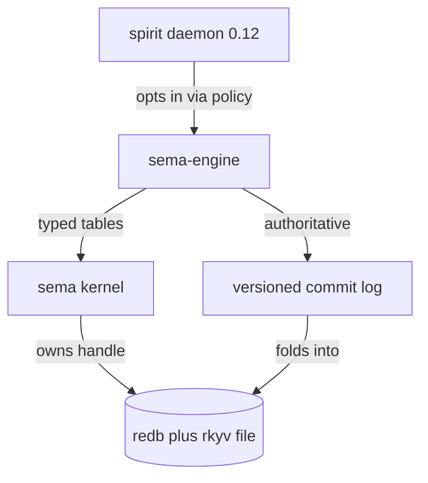
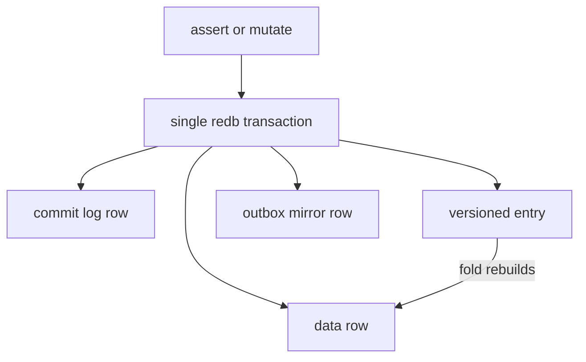

# 615 — SEMA version-control system + the Spirit pilot: independent Opus review

*Designer-lane review commissioned by the psyche: "go look at the system and the
pilot ... tell me what you think, look for flaws, look for good parts, look for
bad patterns ... give me some visuals." Produced by a 7-reader to per-subsystem
critique to adversarial-verify to synthesis workflow (26 agents; 10 confirmed
flaws survived refutation, 22 good patterns named, 1 claim refuted). This is the
independent Opus read; the system-designer lane is running its own audit in
parallel (reports/system-designer/102-sema-vc-audit/). Where the two converge —
and on the headline O(n)-per-write defect three of my readers converged
independently — confidence is higher.*

## Live-state confirmations (first-hand, 2026-06-13)

- `spirit Version` returns `(VersionReported 0.12.0)`; store `(Current (1235 0))`;
  `spirit-daemon.service` active. The v8 to v9 migration ran in production and the
  daemon is up — the earlier outage is resolved.
- `mirror.service` (system unit) is active on `0.0.0.0:7474` since 06:11, but its
  network counters read `IP: 0B in, 0B out` — **nothing has ever shipped to the
  mirror.** The off-host backup daemon is up and idle. This is the load-bearing
  risk in the server section below, confirmed at the network level.
- The `sema-engine-previous` pin to `ebee6e44` matches the engine generation that
  wrote the live v8 store, so the migration reads the old bytes faithfully — the
  migration is correct, not tautological.

This review **supersedes report 610** (the spirit-down incident diagnosis): the
incident is resolved, and the verified root cause is flaw #3 below (the every-boot
migration coupling plus the forward-skew detection wedge), not a non-idempotent
upgrade tool as 610 hypothesized. 610 is retired into this report.

## TL;DR

The SEMA version-control system is a three-layer native VC substrate for component databases: `sema` (a typed redb+rkyv storage kernel), `sema-engine` (a reusable database engine), and `spirit` (the live 0.12.0 pilot consumer, store generation `(Current (1235 0))`). The grand-design bet — that a blake3-hash-linked, payload-bearing **operation log is the authoritative source of truth and the redb tables are a rebuildable materialized view folded from it** — is genuinely sound and genuinely realized in code, not aspirational: the log carries full record bytes, `rebuild_from_log`/`checkpoint` re-derive every table purely by folding logged entries, the chain is verified by recomputation rather than by trusting stored digests, and every live write lands data + commit-log + versioned-entry + outbox + counters in one redb transaction. The single most important strength is the **family-identity model**: replay dispatches on `FamilyName + per-family blake3 schema hash`, deliberately ignoring the table coordinate, so table renames survive replay — and that headline claim is witnessed by a real test. The single most important risk is that **"state loss is unacceptable" is not yet true in deployment**: the authoritative log is one local file (`~/.local/state/spirit/spirit.sema`) with no off-host mirror wired into the running daemon, so a disk loss today destroys the corpus. The implementation is unusually faithful to a large recorded intent trail and unusually well-disciplined for an overnight build; the defects are concentrated in concurrency-safety, a per-write O(n) hot path, and the gap between the durability *promise* and the durability *deployment*.

## The architecture

Three layers, each with a clear job and a clean cut between them.

**`sema` — the storage kernel.** A single-file library (`sema/src/lib.rs`, 581 lines) over redb + rkyv. It opens a `.sema` database under an explicit `Schema`, guards both the rkyv binary format and a manual `SchemaVersion` at open, and exposes typed `Table<K, V>` storage inside closure-scoped read/write transactions. It is deliberately *not* a daemon, not the engine, and exposes no raw-byte or schema-less path. The kernel is genuinely minimal — no `Slot`, no slot-counter, no operation log, no reader-count — and `tests/no_legacy_surface.rs:14-40` actively enforces that engine concern did not leak down into it. "To state what signal-core is to the wire" is accurate: it is the typed substrate, nothing more.

**`sema-engine` — the database engine.** The one stateful noun is `Engine` (`sema-engine/src/engine.rs:68`): it holds the `sema::Sema` handle, the `Catalog` of registered families, subscriptions, and the optional `VersioningPolicy`, and every durable verb (`assert`/`mutate`/`retract`/`commit`/`checkpoint`/`rebuild_from_log`/`begin_import`) hangs off it. This is where the grand bet lives. `FamilyIdentity` (`versioning.rs:182`) is the load-bearing identity noun; `CanonicalView` (`fold.rs:126`) is the fold state that re-derives the redb tables from the log; `RowMaterializer` (`fold.rs:356`) is a one-shot capability that can write only its own row into its own family table.

**`spirit` — the pilot consumer.** `Store` (`spirit/src/store.rs:66`) maps generated SEMA roots onto engine operations over a `.sema` file, opting into the versioned log via a *schema-emitted* `VersioningPolicy` — `Store::open` (`store.rs:254`) does `.with_versioning(RecordFamily::versioning_policy())` and registers three tables through generated descriptors. Spirit holds no family name, hash, or policy by hand; that is the engine's intended win, and it holds.

The dependency edges are honest with one caveat covered below: spirit reaches the kernel only transitively, through the engine. The load-bearing relationship is the bottom-right edge — the log folds into the store, the store does not define the log.

The write path is the heart of the design. Every mutation puts the data row, the plain commit-log row, the versioned-log entry, its outbox mirror row, and the counter updates inside **one** `self.storage.write(|transaction| ...)` closure (`engine.rs:422-437`, `:783-810`), which maps to a single redb `begin_write`/`commit`. On crash, the log and the data cannot diverge — either all land or none do. Subscription deltas are delivered *after* the write returns (`engine.rs:438`), so there is no push-before-commit. The fold runs the other direction: `rebuild_from_log` loads the latest checkpoint's rows plus the log suffix, verifies the digest chain link-by-link, clears touched-but-dropped keys as tombstones, and re-materializes — logging nothing, so the rebuild cannot pollute the log it derives from.

## What's genuinely good

This is a strong build, and the good is structural, not cosmetic. Named generously:

**The architectural bet is real in code.** `VersionedCommitLogEntry` carries full record bytes (`versioning.rs:303` `VersionedPayload::Record{bytes}`), and `rebuild_from_log`/`checkpoint` recompute the materialized tables purely by folding logged entries (`fold.rs:147`, `engine.rs:1373-1417`). The redb tables truly are a rebuildable view of the log. This is the central claim and it holds.

**Family identity is the most beautiful part of the design.** `FamilyIdentity` (`versioning.rs:182`) separates the durable semantic identity (`FamilyName` + per-family `SchemaHash`) from the storage coordinate (`table_name`), and `shares_family` (`versioning.rs:212`) deliberately ignores the table coordinate — it is named, documented, and used consistently (replay at `engine.rs:1189`, catalog lookup at `catalog.rs:30`). `StoreSchemaHash::from_inventory` sorts the `(family, schema-hash)` pairs, domain-separates with a versioned tag, and length-prefixes every field via `EntryDigest::update_bytes` (`versioning.rs:287`) so no two inventories collide by concatenation ambiguity. The discipline is applied identically across three independent hashes (store schema, entry digest, view digest). This most fully earns the beauty criterion: the special case (rename) dissolves into the normal case (identity-keyed dispatch).

**Integrity is verified by recomputation, not by trust.** `CanonicalView::fold` (`fold.rs:156-171`) recomputes each `entry_digest` from the entry's own fields and rejects the fold (`VersionedChainBroken`) if either the previous-digest link OR the recomputed digest disagrees with what's stored. A tampered entry cannot ride a stored digest. `tamper.rs` (11 tests) is the strongest file in the system — forged log rows, doctored checkpoint metadata, flipped segment references, rewritten payloads that preserve the outer digest but get caught by the inner view digest — each asserting a precise typed rejection. This is defense in depth, well executed, and worth holding up as the model for the paths that *aren't* tested yet.

**Capability design closes the "no write authority escapes" invariant at the type level.** `RowMaterializer` (`fold.rs:356`) is minted only inside the engine's write transaction and can write only its own row into only its own family table (`check_table` at `:452` rejects a mismatched table). `ImportSession` (`import.rs:22`) holds `engine: &'engine mut Engine`, so while a restore is in flight, ordinary mutation handlers are *structurally* unable to interleave — the borrow checker enforces the exclusivity. These are the "find the owning noun, give it a one-shot capability" pattern done right.

**The typed-Error Carrier round-trip is a clever, correct solution to a real impedance mismatch.** The kernel's write closure must return `sema::Error` to trigger rollback, which would normally flatten an engine error into a stringy `Io`. Instead `into_storage` (`error.rs:205`) boxes the typed engine `Error` inside `sema::Error::Io(io::Error::other(Carrier(self)))`, and `From<sema::Error>` (`error.rs:218`) downcasts the `Carrier` back out — so a typed failure inside a storage closure both rolls the transaction back *and* resurfaces as the original typed variant. The two `expect()` calls are guarded by an `is::<Carrier>()` check immediately prior, so they cannot fire.

**House discipline is genuinely held.** Verified by AST-shaped grep: zero free functions across `sema-engine/src`; every verb is a method on a data-bearing noun; conversions use `impl From`; domain identifiers are newtypes (`FamilyName`, `SchemaHash`, `CommitSequence`, `VersionedStoreName`); `VersionedPayload` is a closed enum. Typed per-crate `Error` via thiserror everywhere, no anyhow at any edge. No hand-rolled parsers — the v7 domain remap round-trips through the NOTA codec (`production_migration.rs:799-803`).

**The kernel's transaction discipline.** `write`/`read` (`sema/src/lib.rs:568-580`) take a closure and own the txn lifetime: commit only on `Ok`, drop-rollback on `Err`. Callers cannot leak a txn or forget commit/rollback. The three-arm schema-version match (`lib.rs:534-550`) refuses to retro-stamp an existing unstamped file — `is_fresh_file` is captured *before* `Database::create` (`:489`), so a legacy file gets `LegacyFileLacksSchema`, not a silent stamp. Both witnessed.

**The migration's central doubt is genuinely fixed.** Report 97 named the crux: the old full-rewrite + `fs::rename` bypassed the logged path, making restore silently wrong. The current code routes referents, records, and the typed `Migration` marker each through `import_referent`/`import_record`/`record_migration`, all delegating to `self.database.assert(...)` (`store.rs:408,556,389`) — the same logged choke point ordinary writes use. The migration *is* the first complete replayable history the store has had, and the swap is hard-link-backup-then-single-rename (`production_migration.rs:1050-1052`), so the live path is never absent and the previous bytes survive every documented crash window. This is the most important thing the migration had to get right, and it does.

**No gold-plating, no needless back-compat.** No opt-in mode flags, no byte-stable-on-regeneration constraints; old layouts hard-fail with typed `StorageLayoutMismatch` (`engine.rs:88`) rather than carrying compat shims. Correct for pre-production.

## What's flawed

The confirmed flaws, ordered by corrected severity. Each survived adversarial refutation.

### 1. Every write does an O(n) full-scan-and-decode of the entire versioned log to read one 32-byte digest — HIGH

`latest_versioned_entry_digest` (`engine.rs:1997-2004`) calls `VERSIONED_COMMIT_LOG.iter(transaction)`, which (`sema/src/lib.rs:409-427`) eagerly materializes the *entire* table into a `Vec<(u64, VersionedCommitLogEntry)>` — rkyv-decoding every entry, **including its full record payload bytes** — and then takes `.next_back()` to read the last entry's 32-byte chain-head digest. This runs on every `assert`/`mutate`/`retract`/`commit` (via `versioned_entry` at `engine.rs:1971`). Total write cost over the life of the store is therefore O(n²). The live spirit store is already at sequence 1235, so each new write decodes all ~1235 payload-bearing entries to obtain a single hash. The engine already persists `LATEST_COMMIT_SEQUENCE_KEY` in `COUNTERS` and reads it with an O(1) point-get (`engine.rs:847`); the head digest could trivially live in the same place.

**Why it bites:** write latency is now a function of total history length, *forever*, for an append-only intent log — precisely the wrong asymptotic for the one system whose grand-design bet is "the log grows without bound and is authoritative." It is latent at 1235 entries (microseconds today) but it is a real regression against the crate's own `ARCHITECTURE.md` promise that suffix reads are range reads "not whole-log materialization." `ensure_versioned_log_complete` (`engine.rs:1664-1675`) does the same with two more full `.iter().len()` scans on every checkpoint and rebuild.

**Fix direction:** persist the latest entry digest in a `COUNTERS` slot updated inside the same write transaction (O(1) read), exactly as the commit-sequence counter already is. This subsumes the completeness-scan fix and dovetails with flaw #2.

### 2. Read-before-write across separate transactions: a single-writer TOCTOU the type system does not enforce — HIGH

`Engine` holds `storage: sema::Sema` with no mutex, and all mutators take `&self` (`engine.rs:68`, `:357`). The commit sequence (`next_commit_sequence`, `:1770`), the snapshot, the previous-entry digest (`:1997`), the duplicate-key existence check (`:389-400`), and the next record identifier (`:1793`) are each computed in their *own* `begin_read()` transaction **before** the write transaction opens. redb serializes the write commit itself, but two concurrent `&self` callers can each read `latest = N`, each compute sequence `N+1` and the same previous-digest, then the second `COUNTERS.insert` silently overwrites the first — producing **duplicate commit sequence numbers, a forked digest chain, or a duplicate assert that both pass the existence check.** The multi-op `commit` (`engine.rs:635-761`) widens this N-fold: it re-reads each key's pre-state in a separate read transaction per operation, then the write loop re-inserts with no re-validation.

**Why it bites:** this is corruption of the *authoritative* log — the one outcome the design explicitly calls unacceptable — and nothing in the engine makes concurrent misuse fail to compile or fail at runtime. The live pilot is safe only by *convention*: spirit's `Store` writes are serialized through a kameo actor mailbox (`spirit/src/engine.rs`). But `Store`'s own write methods take `&self` (`store.rs:594,600,604`), and the engine is published as "native version control as one reusable library." Any second consumer, or a future concurrent caller inside spirit, silently corrupts the log.

**Fix direction:** make single-writer structural, not conventional. Either take `&mut self` on every mutator (the borrow checker then forbids concurrent writes), or hold an internal write lock and compute sequence/digest/identifier/dup-check *inside* the same write transaction. Option B also dissolves flaw #1 (the predecessor scan moves onto the write txn) and the in-write dup-check the ARCHITECTURE already claims exists.

### 3. Every-boot migration couples migration failure to daemon liveness; detection knows only schema 1-9, so a forward-skewed store wedges boot — HIGH

`spirit-migrate-store` runs *unconditionally* in the `initializeState` ExecStartPre, under `set -eu`, before every `spirit-daemon` start (`spirit.nix:91-103,191`). `source_store_version` maps `found==9` → `Current`, `1..=8` → handled, and **anything else** → `UnknownSchemaVersion{found}` (`production_migration.rs:974-975`), which exits nonzero (`spirit-migrate-store.rs:8-13`). With `Restart=on-failure`, `RestartSec=2s`, `StartLimitBurst=5` (`spirit.nix:182-194`), a store whose generation the deployed binary cannot classify fails the unit, restart-storms five times, and lands in a hard `failed` state. A forward store with a newer *storage layout* also fails the previous engine's open and hits the catch-all `Err(error.into())` — same wedge.

**Why it bites:** this is the plausible shape of the overnight outage. The Fable-5 VC work advanced the store to a generation the deployed `spirit-migrate-store` could not classify, so detection wedged boot. The detection range is closed by construction; a store at any version higher than 9 is unrecoverable by this binary, and the failure is *total* (no daemon) rather than degraded. A migration tool that has never seen the on-disk generation should not be the thing that decides whether the daemon may run. (Note: an already-current v9 store is a cheap read-only probe no-op, so healthy boots are not wedged — the wedge is specific to mis-classified/forward stores.)

**Fix direction:** decouple migration from daemon liveness. A `found` strictly greater than the binary's known-current should be a recognized "already newer, do nothing, let the daemon try to open it" branch, not a hard error — OR make the ExecStartPre non-fatal for the unknown-newer case. A forward store is not this binary's job to migrate down.

### 4. Crash-safety swap is documented at length but has no crash-injection test — HIGH (risk)

The hard-link-plus-single-rename swap (`production_migration.rs:1050-1052`) is the riskiest line in the migration, and its module header (`:19-47`) describes three crash windows and an operator recovery for each. **None of these windows is simulated by a test.** The four migration tests (`:1731/1842/1900/1920`) all exercise the happy path or the clean second-run no-op; not one injects a crash between the backup link and the rename, nor re-runs after a stale `.schema-9-migrating-<pid>.sema` temporary is left behind. This swap runs on every boot against the real live store, and its failure mode is exactly the deploy/version-skew class of the outage that just occurred. The design appears correct (atomic same-fs rename + hard-link backup means the live path is never absent) — but it is asserted only by prose.

**Fix direction:** turn the prose recovery story into green tests: (a) leave a stale temporary and assert `run()` removes it and completes; (b) leave a backup hard link and assert a second run mints the next free suffix and still succeeds; (c) interrupt after the backup link but before the rename and assert the live path still opens as the previous store.

### 5. v1-v6 migration conversions have zero end-to-end coverage — HIGH (risk)

`seed_version_eight_store` (`:1666`) seeds only v8, and the only other end-to-end migration test seeds v7 (`:1920`). The conversion chain `from_v1`/`from_v2`/`from_v4`/`from_v5`/`from_v6` (`:1387-1420`) and their `into_new_entry` mappings carry distinct legacy rkyv shapes, and the mappings are non-trivial — v1 synthesizes `Importance::new(Magnitude::Minimum)` and maps the legacy magnitude into `Certainty`; v4/v5 silently *drop* the legacy weight field; all five route category strings through a fallible string-keyed `Domain::push_from_label` lookup that can silently drop or mismap a label. A wrong field mapping in any of these would silently mis-materialize records during a fold with nothing to catch it.

**Why it bites:** per house rules this is *not* a back-compat complaint — migrating old stores forward is the explicit job. The exposure is that the conversion code exists, runs on real data, and is unverified, in a system whose stated intent is that state loss is unacceptable. If any live or archived store predates v7, this is a latent loss-of-fidelity path.

**Fix direction:** add a seed helper per source generation that writes a representative store through `sema-engine-previous` at each of v1..v6 and asserts the migrated v9 store reproduces identifiers and fields, mirroring the v8 test. *Or* confirm with the psyche that no store older than v7 can exist on a live host and delete the v1-v6 readers as untested dead code.

### 6. The "exclusive DB interface / read-only by construction" invariant is a doc-comment, not a type-system proof — MEDIUM (design-impl-gap)

`INTENT.md` and `lib.rs:11` claim "the storage kernel hands out read access only," and `storage_reader`'s doc (`engine.rs:1151`) calls `StorageReader` "the architectural witness" that the commit log stays complete. But `StorageReader` wraps `&sema::Sema`, whose `write()` is fully `pub` (`sema/src/lib.rs:568`), and sema-engine re-exports the raw kernel table type as `StorageKernelTable` (`lib.rs:56-59`). `StorageReader` is read-only only *by omission of a write method* on a struct that borrows a handle whose `write()` is public. Nothing structurally stops a consumer from calling `sema::Sema::open_with_schema` on the same `.sema` path and writing — including the engine's own tables — with no log entry. Completeness holds only if every consumer voluntarily routes through `Engine`; the compiler does not enforce it. The Spirit fosp Correction ("sema-engine is the EXCLUSIVE interface — no component makes direct redb calls") is an honor-system constraint here. (Every real consumer does route through `Engine`, and triggering the gap requires deliberate misuse — hence medium, not high.)

**Fix direction:** either seal it (Engine owns `sema::Sema` privately and lends only `StorageReader`, never `&Sema`; stop re-exporting `StorageKernelTable`) and downgrade the language to "convention" — OR soften INTENT.md to stop claiming "no write affordance, complete by construction" when the affordance is one re-exported type away. The beautiful answer is the seal: the verb belongs to the noun, and the kernel write surface should not be reachable from a consumer at all.

### 7. Lesser-but-real items — MEDIUM/LOW

- **`SchemaHash::for_label` is a stringly back-door, live in production** (`versioning.rs:85`, used at `guardian_journal.rs:228`). The type meant to be a *content hash of a schema* has two unrelated construction modes — hash-of-generated-schema (the three core families) and hash-of-an-arbitrary-label (the guardian decisions family). A label typo silently mints a different family version with no schema behind it; the per-family schema-version guarantee does not hold for label-derived families. MEDIUM, bad-pattern.
- **The guardian decision journal is excluded from the "complete replayable history"** (`store.rs:442-447`). Decisions live in a separate hand-rolled `<stem>.guardian.v3.sema` with a hand-managed version suffix, written outside the logged path and not folded by migration — exactly the per-component durability journal that `VersioningPolicy` exists to abolish. On a journal-schema bump the old file is abandoned in place. MEDIUM, design-impl-gap (gated behind `agent-guardian`, open in task #402).
- **`RecordKey` round-trips a u64 identifier through a String** (`record.rs:54-95`): typed `RecordKeyKind` enum, but `value: String`, so an identifier with a typed home (`RecordIdentifier`) is stringized into the key, hashed as bytes, and re-parsed (which can silently fail to `None`). LOW, discipline smell.
- **`identified_counter_inventory` reconstructs typed counters by string-suffix-stripping** (`engine.rs:1648-1659`): round-trips a typed `(table, counter)` relationship through a delimiter-joined string and parses it back with `strip_suffix`. A table name containing the delimiter would mis-parse. LOW.
- **The rkyv-format guard is partly decorative** (`sema/src/lib.rs:119-159`): `DatabaseHeader::current` hardcodes single-variant enums and always-true bools, so a genuine Cargo.toml feature-set drift (drop `unaligned`) changes the on-disk layout but *not* the header bytes — the silent-rkyv-skew failure mode lore warns about is not caught; only a hand-corrupted header is. LOW/MEDIUM.
- **`STORAGE_LAYOUT=4` is exactly the layout-version accretion the no-back-compat rule warns against** (`engine.rs:42-51`). It is defensible as a hard-fail guard, but if the log is truly authoritative, a layout mismatch should trigger a rebuild from the log, not a hard-fail requiring an operator. This is also the deploy/version-skew class that took spirit down. LOW, worth a deliberate decision.

## Refuted / not-actually-problems

These claims did NOT survive verification — listed so the confirmed findings above are trustworthy and the psyche is not alarmed by false positives:

- **"There is NO mirror actor, NO transport, NO consumer of the outbox anywhere."** *Refuted.* A complete mirror component triad was built overnight: `mirror/src/shipper.rs:64-260` is a real `ComponentShipper` kameo actor that consumes the full outbox surface — `unshipped_outbox()`, `versioned_replay_from_sequence()`, `mirror_head()`, serializes entries into `EntryEnvelope` frames, ships them over a tailnet TCP transport (`LengthPrefixedCodec` over `TcpStream`), and records the server head via `acknowledge_mirror(head)`. `mirror/flake.nix` packages `mirror-daemon`. The reviewer's grep was scoped to the sema-engine crate and missed every consuming repo. The transport, actor, and consumer all exist as production code. **The narrower true residual:** the *deployed spirit pilot* is not yet wired to the shipper (spirit's `Cargo.toml` has no mirror dependency; no mirror-daemon systemd service in CriomOS-home) — an integration-staging gap, not the absence of the subsystem. This correction matters: it changes the server question from "nothing exists" to "the pieces exist but the pilot isn't plugged in."

No high-severity findings remain unverified — every confirmed flaw above was adversarially checked and held.

## Design-vs-intent fidelity

The shipped code is unusually faithful to a large, explicitly-recorded intent trail. Point by point:

- **iir4 (log-authoritative VC):** *Delivered.* The write-around-the-log escape hatch (`storage_kernel()`) that earlier reports flagged is gone; only the read-only `storage_reader()` remains. The fold/checkpoint/rebuild paths are real. The log is the truth.
- **Typed family identity (iir4):** *Delivered and elegant.* Witnessed end-to-end by `family_identity.rs:181` — a table rename replays into the freshly-registered table, and the store schema hash is identical across the rename.
- **x0ja (blake3 for all content addressing):** *Delivered.* blake3 everywhere, domain-separated with versioned tags, length-prefixed fields. No collisions by concatenation ambiguity.
- **Schema-emitted policy (the engine's reason to exist):** *Delivered.* `RecordFamily::versioning_policy()` is generated code on a data-bearing enum, consumed at `store.rs:255`; nobody hand-computes identity. The one crack is the guardian journal, which leaks the old per-component-journal pattern back in.
- **fosp (sema-engine is the EXCLUSIVE db interface):** *Over-claimed.* True by convention, not by the type system (flaw #6). Every real consumer obeys it, but the compiler does not enforce it.
- **29pb/j487 (atomic server-backed durability; state loss unacceptable):** *Promised, partially built, not yet deployed.* The outbox *row* lands transactionally (true), the mirror triad exists (refuted-claim correction above), but the running spirit daemon is not wired to it. See the next section.

Two specific doc-vs-code gaps worth fixing because they mislead a reader: `ARCHITECTURE.md:70-72` claims a duplicate-Assert check "runs inside `Engine::commit`" — it does not; the check lives only in the separate pre-write read transaction (`engine.rs:669-680`), the write loop blindly inserts. "Rolls back the whole bundle" is true, but the redb-level atomic dup-rejection the sentence implies is not provided. And `production_migration.rs:5-7` names the storage-layout gate as the thing that rejects pre-v9 stores, when in fact the kernel's `ensure_schema_version` fires first (`sema/lib.rs:495` precedes `engine.rs:80`). Both are honesty gaps in prose, not defects in logic.

## The server / backup question

**Plainly: there is no off-host backup of the authoritative log wired into the running system today.** The deployed reality (`spirit.nix:34`) is a single local file at `~/.local/state/spirit/spirit.sema`. A sweep of CriomOS-home for restic/borg/rclone/rsync/s3/backup near spirit found nothing. The only off-live-path bytes are the migration's `<stem>.schema-old-backup-N.sema` — a hard link, which is the **same inode on the same filesystem on the same host**: it protects against logical corruption or a bad migration, but not against disk loss.

The nuance that the refuted claim corrects: the mirror *machinery* now exists. `sema-engine`'s outbox API (`acknowledge_mirror`/`unshipped_outbox`/`store_durability`, the `MirrorHead`/`OutboxEntry`/`Durability` types) is fully unit-tested (`tests/outbox.rs`, 6 tests; `tamper.rs:619` proves `OutboxEntryMismatch` fork-detection), and a real `ComponentShipper` actor with a tailnet TCP transport was built overnight in the `mirror` repo. So the honest framing is: **built-and-tested as a library and as a daemon, but the spirit pilot is not yet plugged into it.** `acknowledge_mirror`/`unshipped_outbox`/`store_durability` have zero callers in spirit's own daemon/nexus/engine.

The verdict: if intent says state loss is unacceptable, then **the gap between "every versioned entry lands with a durable mirror" (the promise) and "one local file, no off-host copy in the running daemon" (the deployment) is the most important risk in the whole system.** It is also the cheapest to close in the interim — the `.sema` file is a self-contained rebuildable view, so a periodic `restic`/`rclone` push of that one file satisfies "no state loss" today while the proper shipper wiring lands. Do not soften the intent; close the gap.

## Verdict & recommended next moves

**My honest opinion as Opus reviewing this Fable-5 build:** this is genuinely good work. The grand-design bet is sound and realized, not vaporware; the family-identity model and the tamper-witness suite are beautiful in the precise sense this workspace means — special cases dissolving into the normal case, integrity verified by recomputation rather than trust, capabilities owning their write authority. The discipline (no free functions, typed errors, no anyhow, no hand-rolled parsers, schema-emitted policy) is held more consistently than most human-authored Rust I review. The flaws are real but concentrated and fixable: they cluster in concurrency-safety, one O(n) hot path, untested recovery paths, and the deploy-side durability gap — none of which corrupt the live store in its current single-writer, small-generation steady state. The Fable-5 model's blind spot was operational: it built a beautiful authoritative log and then deployed it as a single local file with an every-boot migration that can wedge the daemon. The architecture deserves to ship; the operational envelope around it needs three guard rails before it can be trusted with "state loss is unacceptable."

Highest-value next moves, ordered:

1. **Close the durability gap now (interim) and properly (next).** Bead-shaped: (a) add an off-host copy of `spirit.sema` to the deploy (periodic restic/rclone push of the one self-contained file) as an immediate safety net; (b) wire spirit's daemon to the existing `ComponentShipper`/`acknowledge_mirror` path so the mirror triad actually carries spirit's log. This is the #1 risk.
2. **Make single-writer structural in `sema-engine`** (flaw #2): move sequence/digest/identifier/dup-check inside the write transaction (or take `&mut self`). This is the latent corruption hazard on the authoritative log, and the fix subsumes #3 below.
3. **Cache the head digest in `COUNTERS`** (flaw #1): one durable slot updated inside the write transaction, read O(1) — kills the per-write full-log scan and the completeness-scan, and falls out of move #2 for free.
4. **Decouple migration from daemon liveness** (flaw #3): treat a forward/unknown store generation as "newer, not my job" instead of a hard ExecStartPre failure, so a future skew degrades rather than wedges boot. This is the likely cause of the overnight outage.
5. **Turn the crash-recovery prose into green tests** (flaw #4) and **add v1-v6 migration coverage or delete the readers** (flaw #5): the recovery story and the legacy conversions are exactly the paths whose failure is silent and whose stakes are state loss.
6. **Fix the two misleading docs and the `for_label` back-door** (flaws #6/#7): seal the kernel write surface or soften the "complete by construction" language; correct `ARCHITECTURE.md:70-72` and `production_migration.rs:5-7`; give `SchemaHash` a single schema-derived construction path so a label typo cannot mint a phantom family version.

Files cited throughout are under `/git/github.com/LiGoldragon/{sema,sema-engine,spirit,mirror,CriomOS-home}/`.
