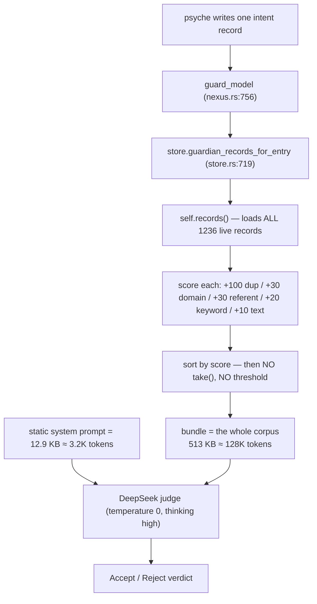
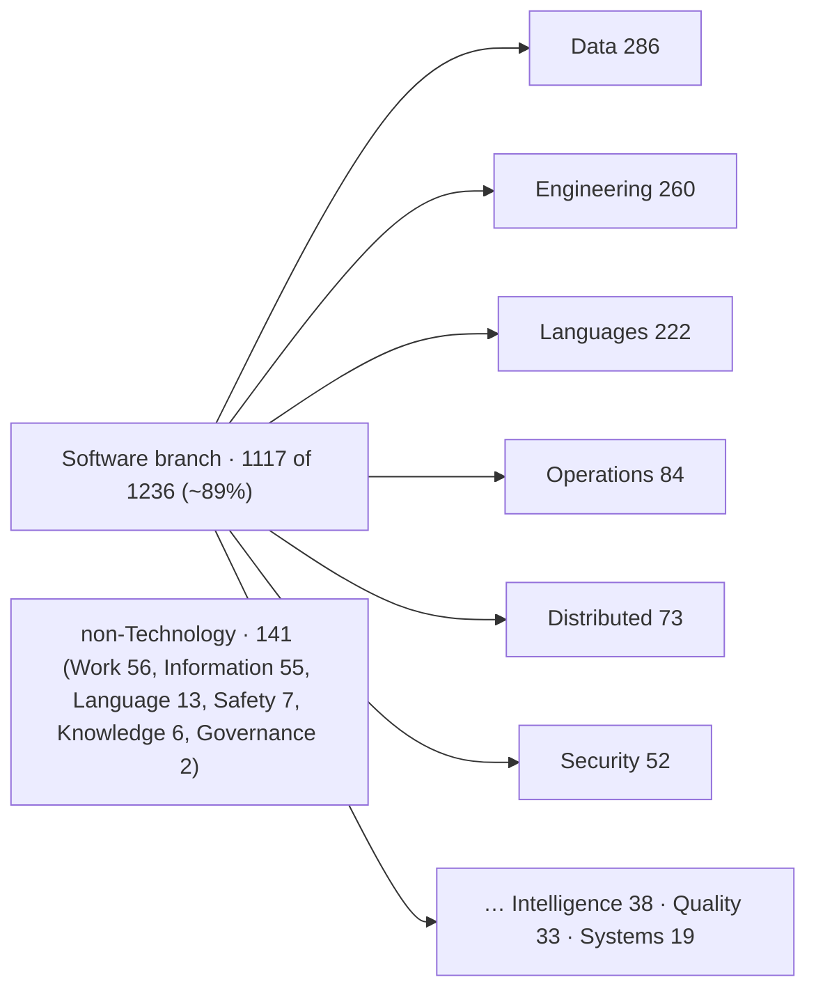
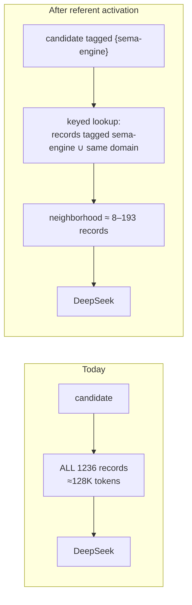

# 617 — Spirit guardian inputs, corpus agglomeration, and referent activation

*The psyche flagged that DeepSeek is receiving very large guardian inputs, that
the ~1300-record corpus feels un-agglomerated, that the `Reference` mechanism is
unused, that prompt caching is weak (lower priority), and that the operator found
the `NonIntent` rejection wording poor. This report diagnoses all five from the
deployed code and live store, and lands on the fix the psyche steered toward in
chat: relevance is a semantic judgment that belongs to the model, so the input is
shrunk by **agglomerating the corpus** and by **doing the relevance call once, at
write time, and storing it as a referent** — never by a deterministic cap.*

*Method: six-agent workflow (five parallel analysts + one adversarial verifier),
every load-bearing number re-measured against the live `spirit` daemon (0.12.0)
and re-read from `/git/github.com/LiGoldragon/spirit`. The verifier overturned
one proposed fix outright and corrected two merge clusters — those reversals are
folded in below, not buried.*

## The one mechanism behind "large inputs" and "too many records"

They are the same problem. On every intent write the guardian hands its DeepSeek
judge a bundle of existing records so it can check for duplicates and
contradictions — and that bundle is **the entire live corpus**, every time.

The relevance score (`store.rs:1513`) only **sorts** the bundle; it never filters
it. `belongs_in_guardian_context()` — the one eligibility test — is just "is this
record's certainty above the removal floor", which is true for all 1236 records.
There is no `.take(N)`, no score threshold anywhere in the path (verifier
confirmed by grep). So:

| Quantity | Measured value |
|---|---|
| Live records | 1236 (all privacy `Zero`, commit sequence 1238) |
| Bundle shipped per write | 513,276 bytes ≈ **128,300 tokens** |
| Static system prompt | 12,934 bytes ≈ 3,234 tokens |
| Dynamic : static ratio | **39.7 : 1** |
| All-in input per write | ≈ 528 KB ≈ **132K tokens** |
| Growth law | O(corpus) per write, **O(n²) cumulative** over the store's life |
| Guardian journal on disk (v3) | 1,601,536 bytes — stores the real bundle per decision |

Every record you add makes every *future* write bigger — the same O(n²) shape as
the sema-engine write-path defect from report 615, but in the guardian's prompt.
Because the input *is* the corpus, anything that shrinks the corpus shrinks every
DeepSeek call by the same fraction. That is the link between the two things the
psyche noticed.

## Why a cap is the wrong fix — and is mechanically unsafe

My first instinct (and the workflow's input-size agent, working from my brief) was
to cap the bundle: keep the top-scoring records, drop the rest. The psyche
rejected this — *"only an LLM can make a relevance call; there is no cap"* — and
the adversarial verifier proved the rejection is forced, not stylistic. In the
real corpus, almost every deterministic signal the cap would rank on is dead:

| Signal | Score | Live in this corpus? | Why |
|---|---|---|---|
| exact-duplicate | +100 | yes | exact domain + kind + description equality |
| shares_domain | +30 | yes | hierarchical subtree match |
| shares_referent | +30 | **dead** | 2 of 1236 records carry any referent |
| shares_keyword | +20 | **dead** | keywords come only from paired `*…*` spans; the whole corpus has 4 such spans |
| shares_text | +10 | weak | verbatim full-substring only — misses every paraphrase |

So the only surviving discriminators are exact-duplicate and shared-domain. A
contradiction that is **reworded** and lives in a **different domain** scores
**zero**. The guardian detects contradictions *only against the bundle it is
handed* (`checklist.md:10`), so a deterministic cap that drops score-0 records
would let a record negating a live psyche arrow sail through. The verifier
grounded this: the 120 records that mention "daemon" span 15+ domain leaves, so a
"daemons MAY parse NOTA config" candidate authored under `ConfigurationManagement`
shares no domain with the "daemons NEVER parse NOTA" constraint under
`SoftwareArchitecture` — a cap would hide exactly the collision the judge exists
to catch.

This is the precise content of the psyche's principle: **relevance between two
intents is semantic, so only a model can adjudicate it.** A keyword/domain score
cannot stand in for that judgment. The fix therefore cannot be "filter what the
model sees with a cheaper non-model heuristic." It has to either (a) make the
corpus small enough to show the model in full, or (b) make the relevance call with
a model *once, at write time,* and reuse the stored answer. Both below.

## Fix 1 — Agglomerate the corpus (agent proposes, psyche blesses)

The corpus is ~89% Technology/Software and piles near-restatements into a few head
leaves, because the schema/macro/architecture topics were captured iteratively
across many sessions as the design settled.

Densest head leaves: `DataModeling` 104, `SoftwareArchitecture` 87, `Macros` 49,
`SchemaEvolution` 44, `DomainSpecificLanguages` 43, `CodeGeneration` 40. Kinds
across the corpus: Decision 496, Principle 309, Correction 163, Clarification 152,
Constraint 116. In a 240-record head sample read in full, 93 records fall into 17
clusters that collapse to 32 replacements — a 25%-of-sample, 66%-within-cluster
collapse rate. Projected across the corpus (denser head, untouched long tail):

| Aggressiveness | Records eliminated | Live after | Reduction (and per-call input cut) |
|---|---|---|---|
| Conservative | ~182 | ~1054 | ~15% |
| Moderate | ~262 | ~974 | ~21% |
| Aggressive | ~338 | ~898 | ~27% |

The hard constraint: **only the psyche may supersede psyche intent**
(`skills/intent-maintenance.md`; AGENTS.md). So agglomeration is a *proposal*
pipeline, never an autonomous edit. The right mechanism is a tool/guardian-assisted
pass that clusters by leaf-domain + similarity and, per cluster, emits a
ready-to-confirm `Supersede` (the multi-target `RetiredIdentifiers` vector plus a
single proposed replacement `Entry`), showing the quoted source descriptions
beside the merged description for the psyche to approve, reject, or edit. The agent
fills the form; the psyche pulls the trigger.

Three pilot clusters as the proof-of-value batch (the verifier re-read each from
the store and **corrected two** — kept honest here):

- **Cluster C — clean merge.** Records `oxgh` and `5mbd` (the README struct-shape
  pair) both say [in the assembled macro-free schema, a struct is a key-value brace
  map: field name is the key, type reference is the value]. Genuine near-duplicate;
  retire both into one. *Verifier: safe.*
- **Cluster B — must be split.** `dnvs` + `oxy1` (the removal-candidate floor is a
  `Magnitude Zero` rung, not `Option None`) merge cleanly. But `d5v6` is a
  **distinct, richer arrow** — a universal `Magnitude` enum replacing per-component
  `Certainty` enums workspace-wide, with rkyv fixed-byte rationale — and merging it
  into a removal-floor decision would lose that intent. *Verifier correction: merge
  `dnvs`+`oxy1` only; keep `d5v6` separate.*
- **Cluster A — preserve the caveats.** The certainty-vs-importance cluster (7
  records: `t4uq`, `u62s`, `vbx6`, `g8ln`, `hp3r`, `kgvc`, `u2s9`) mostly collapses
  into one Principle [Spirit entries carry two orthogonal Magnitude axes — Certainty
  and Importance — never conflated; Weight is retired as a name], but `g8ln` carries
  a cross-reference and `hp3r`/`u2s9` carry migration-timing and low-certainty
  caveats that should survive as separate replacements. *Verifier: keep those split.*

## Fix 2 — Activate referents: the relevance call, made once and stored

This is the structural fix, and it is exactly the psyche's framing: *make the
relevance call once, at write time, and write the answer down — that written-down
answer is the referent.* When a record is born, a model decides what it is **about**
and tags it (e.g. a record that says "the storage kernel" with no literal token
still gets tagged `sema-engine` — the part only a model can do). That tag is stored
forever and never recomputed. Later, retrieving "records about `sema-engine`" is a
keyed lookup of a neighborhood a model already judged relevant — not a fresh model
call, and not a deterministic keyword score.

The machinery already exists and is simply switched off: the `Referents` field,
`RegisterReferent` with its own referent-guardian (which keeps the vocabulary clean
so `storage-kernel` and `sema-engine` do not fork), `AnyReferent` query matching (a
true retrieval key), and a `record_with_implied_referents` path on every write.
The design intent is explicit in the code — [a named instance (spirit, rkyv,
DeepSeek) is a referent, not a domain] (`guardian_prompt.rs:115`). Yet only **2 of
1236** records carry a referent.

The reason is a precise, fixable bug: the "implied referents" path
(`register_implied_referents`, `nexus.rs:862`) **auto-registers referents already
attached to an entry — it derives nothing from the description text.** With an
empty referent vector the loop is a no-op and the write proceeds untagged. The
name promises derivation it never does. So nothing self-populates, and the +30
referent signal has been dead since day one.

Activation, in three ordered moves:

1. **Register the recurring named instances** as referents via `RegisterReferent`
   (each gets a one-line justification; the referent-guardian judges
   `NonReferent`/`TooVague`/`Duplicate`). The corpus frequencies point straight at
   the initial set:

   | Referent | Corpus mentions | Aliases |
   |---|---|---|
   | spirit | 193 | |
   | nota | 189 | NOTA |
   | sema-engine | 148 / 8 | SEMA (where it means the engine) |
   | daemon | 120 | |
   | Nix | 51 | |
   | Logic | 50 | |
   | rkyv | 34 | |
   | mirror | 30 | |
   | orchestrate | 23 | |
   | guardian | 21 | |

   plus `beads`, `jj` (alias jujutsu), `DeepSeek`, `Gemini`, `Codex`, `Claude`,
   `Crayon`, `Pi-harness`. **Privacy note:** `Pi`/`psyche` name the human and are
   *not* referents — keep them out of the index.

2. **Tag the relevance at write time — with a model, per the psyche's principle.**
   Fix the mis-named path to actually populate referents. A deterministic
   alias-match (scan the description against registered names/aliases) is the cheap
   floor that catches literal mentions; the *semantic* taggings a paraphrase hides
   are where the model belongs — the implied-referent step done properly, or the
   guardian/DeepSeek call itself emitting the aboutness tags. This is the one place
   a model touch is warranted, and it happens once per record, not per future write.

3. **Scope the guardian bundle by referent ∪ domain** instead of whole-corpus
   (`store.rs:719`): the neighborhood is the union of records sharing a referent or
   domain with the candidate. A `sema-engine` candidate sees ~8 records, not 1236; a
   hot `spirit` candidate sees ~193, not 1236. A genuinely novel candidate sees few
   or none — which the prompt already declares acceptable (an empty bundle for a
   novel record is fine; that is *not* `RetrievalInsufficient`). No cap is involved:
   the neighborhood is small because it is *relevant*, not because it was truncated.

The honest residual: a contradiction whose only home is a referent/domain the
candidate is **not** tagged with can still be missed. That is a real
retrieval-quality problem — narrowed by the referent-guardian collapsing aliases,
by domain as a coarser second axis, by agglomeration shrinking the field, and, if
it matters, by a kind-aware contradiction pass. It is categorically milder than the
cap's failure, because the tag is *model-assigned* where the keyword score was not.

## Fix 3 — Caching (lower priority, mostly downstream of Fix 2)

DeepSeek already auto-caches leading prompt prefixes, and the daemon already emits
the byte-stable ~12.9 KB system prompt as `messages[0]` — so that prefix is
*probably already being cached for free*. Two findings:

- **Free measurement win, now.** The daemon throws away DeepSeek's cache telemetry:
  `ChatCompletionUsage` (`agent/src/provider.rs:449`) deserializes only
  `prompt_tokens`/`completion_tokens`, dropping `prompt_cache_hit_tokens` /
  `prompt_cache_miss_tokens`. Add those two fields (`#[serde(default)]`) and surface
  them to the journal. Zero design, turns the rest from guesswork into a measured
  baseline.
- **Verdict cache is real but gated.** A cache keyed on `digest(operation +
  candidate + bundle)` can skip the model call on an exact repeat (temperature 0
  makes the verdict deterministic) — this is the psyche's "same topic + same
  reference → serve from cache." But it only hits once the bundle is **stable**,
  which today it is not (it tracks the whole corpus and shifts on any unrelated
  write). So the verdict cache is downstream of Fix 2's referent-scoped bundle; do
  not build it before then or it mostly misses. Mix a guardian-prompt/version tag
  into the key so a prompt change can't serve stale verdicts.

## Fix 4 — Rewrite the `NonIntent` gloss (and three neighbors)

The operator was right. The current gloss (`guardian_prompt.rs:108`) — *"task
chatter, a status update, or a transient reaction — not durable intent that still
guides once the current task is erased"* — buries its only load-bearing test (the
durability test, which is the actual gate in `skills/intent-log.md:39`) behind a
vague three-item grab-bag, and carries none of the cross-reason disambiguation the
checklist already supplies. Exact replacement:

> fails the durability test — erase the current task and nothing of this would
> still guide: a status update, a question, or a passing reaction that states no
> want at all. A HEDGED want still wants and is durable (admit it low, or reject
> Overstated at Gate 7), so NonIntent is NOT a too-tentative quote; and it is NOT
> MissingTestimony, which is an absent quote, not an undurable one.

It leads with the operable test, demotes the examples to illustration, and draws
the two boundaries that actually collide (`Overstated` = a want over-claimed;
`MissingTestimony` = a want with no quote). The same agent supplied exact rewrites
for `UnclearPrivacy` (states a symptom, not a test), `ImportanceUnsupported` (omits
that Minimum/Low/Medium need no justification, so it over-fires on ordinary rungs),
and a minor `RetrievalInsufficient` parallelism tweak — all in the workflow output,
all `XS` edits to `admission_gloss()` since the catalogue renders from the enum.

## Recommended sequence

1. **Now, free:** capture DeepSeek cache telemetry (Fix 3a); ship the `NonIntent` +
   three-gloss rewrites (Fix 4). Both are `XS`–`S`, zero-risk, independent of
   everything else.
2. **Do not ship the bundle cap.** It is mechanically unsafe in this corpus
   (verifier: "Do NOT ship as specified").
3. **Referent activation (Fix 2)** is the real input fix: register the initial set,
   fix the implied-referent path to tag at write time, then scope the bundle by
   referent ∪ domain. This decouples input size from corpus size permanently.
4. **Agglomeration (Fix 2's complement):** stand up the agent-proposes/psyche-blesses
   merge pass; run the three pilot clusters (with the verifier's split) as the first
   batch.
5. **Verdict cache (Fix 3b):** only after the bundle is referent-scoped and stable.

## Open questions for the psyche

- **Where does the write-time relevance tag come from?** Deterministic alias-match
  (cheap, replayable, misses paraphrase) versus a model tagging pass (catches
  paraphrase, costs a call per record on the one-time backfill). My lean: model
  tagging for the backfill and for non-literal cases, alias-match as the always-on
  floor — which matches your principle that the aboutness call is the model's.
- **Agglomeration depth:** one merged record per cluster (max compaction) or a small
  replacement *set* that keeps a settled rule separate from a still-tentative caveat
  (Cluster A's `hp3r`/`u2s9`)? This sets the collapse rate.
- **Backfill mechanics:** tagging ~1236 existing records via `ChangeRecord` re-runs
  the guardian on each edit (expensive, could reject). Is a guardian-bypass
  admin/import path for pure referent-vector edits acceptable? (`import_referent`
  exists at `store.rs:406`; tagging needs an entry-edit path.)
