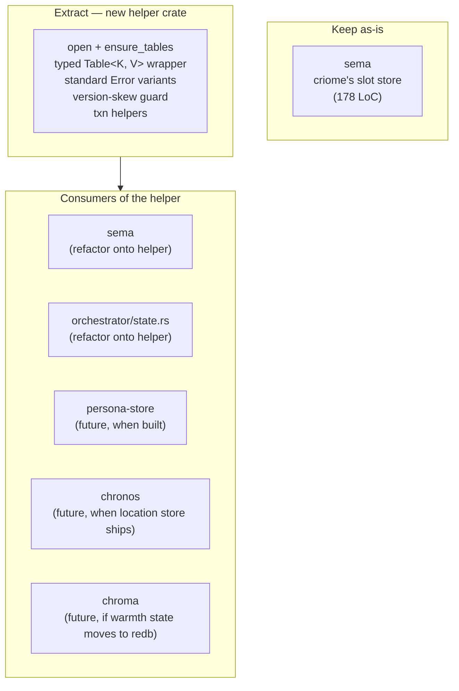
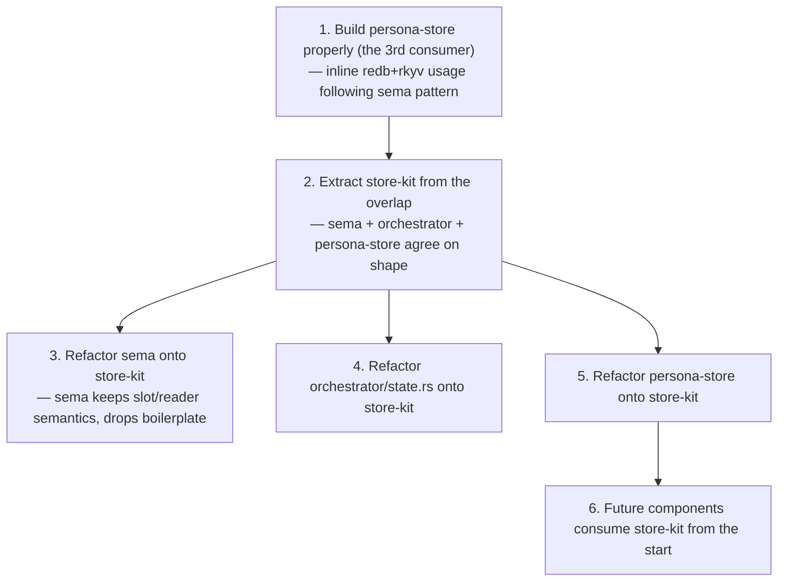

# 62 · Sema as a library — research

Status: research report on whether and how `sema` (criome's
record store) could become the workspace's shared
database-abstraction library, in response to the user's
question: *"how sema can be turned into a library that
abstracts our database logic (redb)."*

Author: Claude (designer)

---

## 0 · TL;DR

**Don't repurpose sema. Extract a small new helper crate.**

Sema today is *one component's record store*: criome's
slot-counter + bytes-by-slot persistence layer. Its API
(`Slot`, `store(&[u8]) → Slot`, `iter() → Vec<(Slot, Vec<u8>)>`,
plus criome-specific `reader_count`) is shaped for criome's
data model — append-only slot-allocated records — and doesn't
generalize to most other components' state shapes.

What *does* generalize is the **redb + rkyv plumbing**:
open-or-create database, ensure tables, txn-wrap-and-commit,
typed-table wrapper, standard error variants, version-skew
guard. That's a separate crate's worth of work.



| Question | Answer |
|---|---|
| Is sema today a general database abstraction? | No — it's criome's component store with criome-specific shape (slot-counter, reader-pool config) |
| Is there enough redb usage in the workspace to extract a shared crate? | **Right at the threshold** — 2 real consumers (sema + orchestrator), 1 stub (persona-store), 0-3 future. Skill says "wait for 2-3"; we're at 2. |
| Should sema *become* the shared crate? | No. Sema's purpose is criome's store; renaming + scope-broadening would break the "one capability per crate" rule. |
| What should be extracted? | A small helper crate (~250-500 LoC) for the cross-component boilerplate; sema and orchestrator both consume it. |
| When? | When persona-store is actually built (the third real consumer), per `skills/rust-discipline.md` §"When to lift to a shared crate." |

---

## 1 · Sema today

**Repository:** `/git/github.com/LiGoldragon/sema`
**Source:** 178 lines in `src/lib.rs` (single file).
**Status:** Working M0 core (per ARCHITECTURE.md).

Public surface:

| Symbol | Purpose |
|---|---|
| `Slot(u64)` | newtype for slot identity; matches `signal::Slot` semantics at type level |
| `Sema` | the database handle |
| `Sema::open(path) → Sema` | open-or-create; init slot counter to 0 on first open |
| `Sema::store(bytes) → Slot` | allocate next slot; persist bytes; return slot |
| `Sema::get(slot) → Option<Vec<u8>>` | read bytes at slot |
| `Sema::iter() → Vec<(Slot, Vec<u8>)>` | snapshot all records (eagerly collected) |
| `Sema::reader_count() → u32` | criome-specific: how many `Reader` actors to spawn |
| `Sema::set_reader_count(u32)` | criome-specific: persist read-pool size |
| `Error` | redb errors wrapped via thiserror |

Internal shape:

```
records: TableDefinition<u64, &[u8]>      — slot → rkyv-archived bytes
meta:    TableDefinition<&str, u64>       — counters (next_slot, reader_count)
```

**Boundaries** (per `sema/ARCHITECTURE.md`):

> Owned **exclusively by criome** — no other process opens
> this file.

> Owns: the redb file (one per criome instance), slot
> allocation, per-kind tables (M1+), change-log (M1+).

> Does not own: record types (signal), validator (criome),
> wire (signal), artifact bytes (arca).

Sema's intent (per `sema/skills.md`): *"Criome and sema are
meant to be eventually impossible to improve."* The on-disk
format is meant to be load-bearing — read cleanly forever.

**Sema is criome's store.** That's its purpose, and it's
designed to be that one thing very well. Repurposing it as
a generic database substrate breaks that purpose.

---

## 2 · Patterns already crystallizing across redb users

Two real consumers of redb in the workspace:

### 2.1 · `sema/src/lib.rs` (178 LoC)

The reference implementation. Patterns:

- `Database::create(path)` with parent-dir mkdir
- Constant `TableDefinition<K, V>` declarations at module top
- `let txn = db.begin_write()?; { table; ops; } txn.commit()?;`
- Meta-table for counters
- Wrapped errors via `#[from]` thiserror

### 2.2 · `orchestrator/src/state.rs` (119 LoC)

Independent implementation of the same patterns. Notable
differences from sema:

- Explicit `if path.exists() { Database::open } else { Database::create }` (sema uses `Database::create` which does both)
- Explicit `ensure_tables()` method that touches each table in a write txn
- Carries `path: PathBuf` alongside the `Database` (sema doesn't keep the path)
- Maps redb errors via a custom `Error::state` constructor (not `#[from]`)
- Stores rkyv-archived `CascadeDispatchRecord` values (sema stores raw `&[u8]`)

### 2.3 · The shared shape

Both consumers reinvent:

```rust
// open-or-create
let database = if path.exists() {
    Database::open(&path)?
} else {
    Database::create(&path)?
};

// ensure tables exist before any read tries
let txn = database.begin_write()?;
{
    txn.open_table(TABLE_A)?;
    txn.open_table(TABLE_B)?;
}
txn.commit()?;

// the canonical txn dance
let txn = database.begin_write()?;
{
    let mut table = txn.open_table(TABLE)?;
    table.insert(key, value)?;
}
txn.commit()?;

// error wrapping
#[derive(Error)] enum Error {
    #[error("redb database: {0}")] Database(#[from] redb::DatabaseError),
    #[error("redb storage: {0}")]  Storage(#[from] redb::StorageError),
    // ... 4-5 more wrapped variants ...
}
```

### 2.4 · What the workspace's other "should-use-redb" components have

Per the audit in `reports/designer/60-persona-audit-and-critique-of-59.md`
§3.3 (finding C): persona-store is a 32-line `BTreeSet<String>`
stub; persona-message has its own text-files-with-polling
store. Both *should* be redb+rkyv per
`skills/rust-discipline.md` §"redb + rkyv".

`chronos` and `persona` declare `redb` as a Cargo dep but
don't actually `use` it — only mention it in comments. Their
state is in-memory or stubbed.

`chroma` keeps warmth state in `XDG_STATE_HOME/chroma/` files
— could move to redb but doesn't today.

**Real crystallized usage: 2** (sema + orchestrator).
**Stub or planned usage: 3-5** (persona-store, persona-message,
persona-router, chronos, chroma).

`skills/rust-discipline.md` §"When to lift to a shared crate"
says: *"the shared shape becomes obvious after 2–3 components
have crystallized their patterns. Don't pre-abstract."*

We're at 2 crystallized. The third (persona-store, when
actually built) tips the threshold.

---

## 3 · Three options for "abstract our database logic"

### 3.1 · Option A — Sema becomes the multi-component store

One `sema` file holds all components' state. Each component
gets a sub-tree of tables. Sema provides the database
handle + the typed-table convention.

| Pros | Cons |
|---|---|
| One file, one transactional substrate | Violates `skills/rust-discipline.md` §"One redb file per component" |
| redb's transactions handle cross-component consistency | Couples lifecycles — opening criome opens persona's state |
| | Sema's stated boundary is *"exclusively owned by criome"* — directly contradicts |
| | Sema's slot semantics force every consumer into slot-keyed records |

**Verdict: no.** This conflicts with every workspace boundary
rule.

### 3.2 · Option B — Sema becomes a library + per-component redb files

Sema gets repurposed: instead of being criome's store, it
becomes the helper library every component consumes. Each
component still owns its own redb file, but uses sema's API
to manage it.

| Pros | Cons |
|---|---|
| Reuses an existing crate | Sema's API is shaped for slot-allocated bytes; not all components fit |
| | Renames/refactors sema heavily; criome's "exclusively owned by criome" boundary breaks |
| | Sema's "one redb file per criome instance" identity bleeds into every consumer |
| | Per `skills/micro-components.md`: the crate's capability becomes "two things" — the criome store *and* the shared helper. One capability per crate is violated |

**Verdict: no.** Sema's concrete purpose (criome's store)
gets diluted by stretching it to be the universal helper.
The two purposes aren't the same capability.

### 3.3 · Option C — Extract a new small helper crate

A new workspace-level helper crate that owns the cross-component
plumbing. Sema, orchestrator, persona-store, future stores
all consume it. Each component still owns its own redb file
and its own data model; they share the boilerplate.

| Pros | Cons |
|---|---|
| Sema stays sema (criome's store) — purpose preserved | New crate to maintain |
| One capability per crate (the helper does plumbing; sema does criome's records) | |
| Components keep their own data models (sema's slot-counter, persona-store's harness records, orchestrator's cursor + dispatch) | |
| The helper crystallizes from real use (skill's "wait for 2-3 patterns" rule) | |
| Aligns with `skills/contract-repo.md` §"Kernel extraction trigger" — extract when 2+ consumers share kernel | |

**Verdict: yes.** This is the right shape.

---

## 4 · What the helper crate should contain

Distilled from the sema + orchestrator overlap:

### 4.1 · Public surface (suggested)

```rust
// open-or-create with parent-dir mkdir + ensure_tables in one call
pub struct Store { database: Database, path: PathBuf }

impl Store {
    pub fn open(path: impl Into<PathBuf>, schema: &Schema) -> Result<Self>;
    pub fn path(&self) -> &Path;
    pub fn read<R>(&self, f: impl FnOnce(ReadTxn) -> Result<R>) -> Result<R>;
    pub fn write<R>(&self, f: impl FnOnce(WriteTxn) -> Result<R>) -> Result<R>;
}

// the table-of-rkyv-values pattern
pub struct Table<K, V: Archive> { definition: TableDefinition<K, &[u8]>, _value: PhantomData<V> }

impl<K, V> Table<K, V> {
    pub const fn new(name: &'static str) -> Self;
    pub fn get(&self, txn: &ReadTxn, key: K) -> Result<Option<V>>;
    pub fn insert(&self, txn: &WriteTxn, key: K, value: &V) -> Result<()>;
    pub fn iter(&self, txn: &ReadTxn) -> Result<impl Iterator<Item = Result<(K, V)>>>;
}

// the schema definition: which tables exist + version-skew guard
pub struct Schema {
    pub tables: &'static [&'static str],
    pub schema_version: SchemaVersion,
}

// the standard error type (callers wrap via #[from])
#[derive(thiserror::Error, Debug)]
pub enum Error {
    Database(#[from] redb::DatabaseError),
    Storage(#[from] redb::StorageError),
    Transaction(#[from] redb::TransactionError),
    Table(#[from] redb::TableError),
    Commit(#[from] redb::CommitError),
    Rkyv(rkyv::rancor::Error),
    SchemaVersionMismatch { expected: SchemaVersion, found: SchemaVersion },
    Io(#[from] std::io::Error),
}
```

### 4.2 · The version-skew guard

`skills/rust-discipline.md` §"Schema discipline" requires a
known-slot record carrying `(schema_version, wire_version)`,
checked at boot, hard-fail on mismatch. The helper should
own this — declare a `meta` table internally, write the
component's schema version on first open, hard-fail
mismatched opens.

This is the load-bearing safety property. Currently neither
sema nor orchestrator implements it (both should).

### 4.3 · What it should NOT contain

- **Slot allocation.** That's sema's specific shape; not all
  components want monotonic slots.
- **Per-kind tables / change-log.** Criome's specific
  pattern; persona-store wouldn't use it.
- **Reader-pool config.** Criome-specific, doesn't generalize.
- **Component-specific record types.** Each consumer defines
  its own; the helper is type-generic.
- **Migration runners.** A separate concern; would belong
  in either sema or orchestrator-specific code.
- **Backups / replication.** Not in scope for the workspace's
  current needs.

### 4.4 · Naming

Per `skills/naming.md` §"Anti-pattern: prefixing type names":
not `RedbHelper`, `WorkspaceStore`, `LiGoldragonRedb`.

Candidates (ordered by my preference):

1. **`store-kit`** — names the capability (a kit for stores).
   Crate-relative type names: `store_kit::Store`,
   `store_kit::Table`, `store_kit::Error`.
2. **`redb-rkyv`** — names the two technologies it wraps.
3. **`persistent`** — abstract; less specific.

I'd go with **`store-kit`** (1). The capability is "kit for
building component stores"; the name says that without
naming the underlying technologies.

---

## 5 · What sema does today that wouldn't move

Sema-specific surface (stays in sema):

| Symbol | Why it stays |
|---|---|
| `Slot(u64)` | Criome's record identity; matches `signal::Slot`; not generic |
| `Sema::store(&[u8]) → Slot` | Slot allocation is criome's pattern; persona-router's queue or chronos's location cache don't want this |
| `Sema::iter() → Vec<(Slot, Vec<u8>)>` | M0 scan-all-records pattern criome's reader actors use |
| `Sema::reader_count` / `set_reader_count` | Criome-specific config |
| Future: per-kind tables, change-log, SlotBinding, bitemporal | All criome-shaped |

What WOULD move from sema to store-kit:

| Symbol | Becomes |
|---|---|
| `Sema::open` (the open-create-ensure-tables boilerplate) | `Store::open` in store-kit |
| `Error::Database`/`Storage`/`Transaction`/`Table`/`Commit` | `store_kit::Error` (sema's `Error` adds `MissingSlotCounter` on top) |
| The `META` table + `next_slot` counter pattern | Stays sema; uses store-kit's helpers |
| The txn-write-commit dance | Replaced by `store.write(|txn| { ... })` |

After the refactor, sema's `lib.rs` would shrink from 178
LoC to maybe 80-100 LoC — the criome-specific parts only.
Orchestrator's `state.rs` would shrink from 119 to maybe
60-70 LoC.

---

## 6 · Migration path



Step 1 is the precondition. Building persona-store inline
forces the third pattern to crystallize, which makes the
shared shape visible (per the skill's rule). Pre-extracting
before persona-store exists risks designing the helper for
two patterns that don't represent the workspace's full
needs.

**Estimated effort:**

- Step 1 (persona-store proper): operator, ~1-2 days
- Step 2 (extract store-kit): designer review + operator,
  ~half-day
- Steps 3-5 (refactor consumers onto helper): operator, ~half-
  day total

---

## 7 · Why not extract today

Three reasons to wait:

1. **Two consumers isn't enough.** Sema and orchestrator are
   structurally similar but small differences (sema uses
   `Database::create` which is open-or-create; orchestrator
   does explicit existence check) might be wrong in different
   ways. A third consumer reveals which pattern is right.
2. **Persona-store's needs aren't fully visible yet.** It's a
   stub. Building it first surfaces the actual data model
   (which records, which keys, which queries). Extracting
   the helper before knowing that risks designing for what
   sema and orchestrator already do, missing what
   persona-store needs.
3. **The skill's own rule is explicit.** "Don't pre-abstract.
   The shared shape becomes obvious after 2-3 components
   have crystallized their patterns. The sema → criome path
   followed exactly this growth."

**The right immediate work** is operator/60's recommendation
§5.2 item 5: build persona-store's redb+rkyv layer properly,
inline. When it ships, the extraction becomes mechanical.

---

## 8 · Summary recommendation

| Question | Recommendation |
|---|---|
| Should sema become the workspace's database library? | **No.** Sema is criome's store; that's its capability. |
| Should we extract a shared helper crate? | **Yes, eventually.** Wait for persona-store to be built (the third consumer). |
| Suggested name? | **`store-kit`** (cross-component plumbing, no crate-name prefix on types per the just-landed rule). |
| What goes in the helper? | open + ensure_tables + typed Table&lt;K, V: Archive&gt; wrapper + standard Error + version-skew guard. ~250-500 LoC. |
| What stays per-component? | Data model, key types, slot allocation (sema-specific), per-kind tables, change-log (criome-specific). |
| When? | After persona-store ships its real redb+rkyv implementation (per operator/60 §5.2 item 5). |
| Who owns the proposal? | Designer report (this one) + operator implementation when the time comes. |

---

## 9 · See also

- `~/git/github.com/LiGoldragon/sema/src/lib.rs` — the
  reference implementation (178 LoC).
- `~/git/github.com/LiGoldragon/sema/ARCHITECTURE.md` —
  sema's role/boundaries.
- `~/git/github.com/LiGoldragon/sema/skills.md` — sema's
  intent ("eventually impossible to improve").
- `~/git/github.com/LiGoldragon/orchestrator/src/state.rs`
  — the second crystallized redb usage (119 LoC).
- `~/primary/skills/rust-discipline.md` §"redb + rkyv"
  §"When to lift to a shared crate" — the rule this report
  follows.
- `~/primary/skills/contract-repo.md` §"Kernel extraction
  trigger" — the parallel pattern for wire contracts.
- `~/primary/skills/micro-components.md` — the
  one-capability-per-crate rule that argues against
  repurposing sema.
- `~/primary/skills/naming.md` §"Anti-pattern: prefixing
  type names with the crate name" — naming `store_kit::Store`
  not `StoreKitStore`.
- `~/primary/reports/designer/60-persona-audit-and-critique-of-59.md`
  §3.3 — the persona-store-stub finding that names the third
  consumer this proposal waits for.

---

*End report.*
