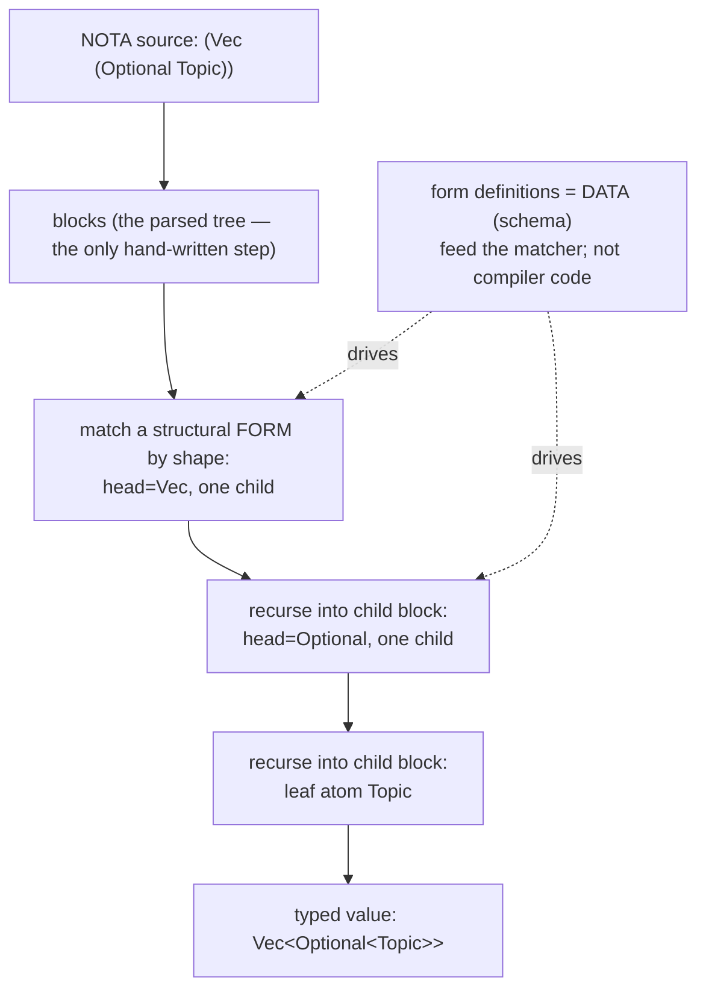

# Structural Forms — the grammar is a type, matched by shape, all the way down

A broad framing of the concept this thread has been circling, and a name for it.
This is the flagship concept doc; the thesis mechanics live in `626`
(language-as-data) and the concrete bricks in `103` / `625`.

## The one-sentence concept

**You never needed a parser to get elegant syntax — the file is already a typed
tree of nodes, and each node matches its sub-blocks *by shape*, recursively. The
grammar *is* a type; the type *is* the parser; and because the node-types are
data, the language is open.**

## Naming — the ask, and a recommendation

"Macro" is *true* (this is macro-programming in the deep sense) but the word has
been worn smooth — it now means "text substitution" or "scary compiler thing" to
most readers, and it hides the structural insight. We want a name that puts
*structure-is-the-type* in front.

Recommendation, with the field:

| Name | Why | Flavor |
|---|---|---|
| **Structural Forms** (lead) | a "form" is a constructor / special-form (the macro DNA, pre-worn), "structural" names the match-by-shape mechanism. *Structural-form programming*, as a paradigm word, parallels object-oriented. | clean, accurate, quietly edged |
| **Shape Grammar** | the grammar *is* a set of shapes you match recursively; borrows aptly from generative design (rules over shapes). Punchier. | evocative |
| **Block Calculus** | NOTA's unit is the block; a formal system of recursive structural block-matching, built from a tiny primitive set. | formal-system edge |
| **Typed Shapes** / **Structural Schema** | plainest, most literal. | descriptive |

I'd take **Structural Forms** as the paradigm name and **Shape Grammar** as the
punchier alias when the *grammar-is-data* angle is the point. I can also coin a
single word in the NOTA / SEMA / Spirit house style if you'd rather have a proper
noun — say the word. The rest of this doc uses *structural form* as the working
term; renaming is a search-and-replace.

## The aski arc — the instinct was right, the method was the trap

This is what aski was reaching for: an elegant, legible syntax for expressing
*things you design*. The reach was correct. The trap was **method** — building
ever-more-convoluted *parsing logic* to coax the file into the shape you had in
mind, treating the syntax as a string to be parsed into meaning.

The realization that dissolves the trap: **you don't parse a structure into a
type — the structure already is one.** A NOTA file is a tree of blocks. A
structural form is a typed node that *recognizes* a block by its shape — its head,
its child count, its delimiter — and decodes the children by recursively asking
the same question of each. There is no parser to hand-write. The elegant syntax
isn't *produced* by parsing logic; it *is* the shape of the typed nodes you
declared. Declare the nodes (as data) and the syntax — and its reader — falls out.

That is the whole inversion: aski tried to write the bridge from text to meaning;
structural forms make the text *be* the typed meaning, with a recursive shape
match standing in for the entire parser.

## What a structural form is

A structural form is a typed constructor that:

1. **matches a block by shape** — "a parenthesised block whose head is the atom
   `Vec` and which has one more child" — not by re-lexing characters;
2. **binds and recursively decodes its children**, each child itself a structural
   form (or a leaf), so the match descends the whole tree;
3. **is itself data** — the form's definition (its head, arity, child kinds) is a
   value in the schema, not Rust baked into a compiler.

So a language is a *set of structural forms*. Rust's `struct`, `enum`, `fn`,
`impl`, generics are all structural forms of this kind — Rust just keeps that set
frozen and **poorly saved**, smeared across the compiler implementation instead of
expressed as inspectable data. Structural forms keep the set as clean typed data,
so the set is open.

## Why it matters (the broad case)

- **Open / infinitely extensible.** Adding a language construct is adding a *form
  definition* (data), not changing a compiler. New syntax is new data.
- **Typed, so still safe.** Every form is a typed value validated against the
  schema. Extensibility doesn't cost the type system — the schema + the recursive
  structural decode + the binary form *are* the type system. Open and checked at
  once. This is what separates it from "a pile of macros."
- **Self-describing, to a tiny seed.** The form vocabulary can itself be described
  as forms (`103`). "Infinitely extensible" honestly means *extensible down to a
  small frozen seed* — the NOTA block parser plus one hand-written derive.
  Everything above the seed is data; the rigor is keeping the seed small.
- **The most legible substrate for a human and an LLM.** A model reads and writes
  `(Vec (Optional Topic))` or a form definition far more reliably than a
  proc-macro's token surgery. When the language's own constructs are uniform data,
  the model operates at the *meta* level — it reads and writes the grammar, not
  only programs in it. (Per Spirit `7c71`.)

## How it differs from the things it rhymes with

- **vs. macros (Lisp/Rust):** those extend syntax but freeze the *expander* and
  core forms in the implementation. Here the form set — down to *how a node
  decodes* — is data. The openness goes one level deeper.
- **vs. parsers:** a parser is hand-written logic from text to structure.
  Structural forms replace that logic with a recursive *shape match* driven by
  data definitions. The "convoluted parsing" disappears.
- **vs. homoiconicity:** Lisp's code-is-data is the seed of this, but Lisp still
  freezes the reader and special forms. Structural forms push code-is-data up
  through the *grammar's own type vocabulary*.

## What is real vs. designed (honesty)

- **Real, today (verified, `624`):** NOTA parses to blocks; structural-macro
  nodes already match blocks by shape and recursively decode; macro *definitions*
  already live as NOTA data and execute (`schema-next`'s declarative macros). The
  mechanism exists.
- **In flight:** the macro-table *types* become schema-emitted (operator slice,
  bead `primary-bojw` / spec `625`); the *form vocabulary itself* becomes data
  (`103`).
- **Designed, open:** how far to push the uniform substrate (records, wire
  contracts, forms, daemon config are already one schema-NOTA-rkyv substrate); the
  output/template model now that kinds are themselves forms.

## Related framings already settled

- A schema file is the **typed signature of a component** — its input types →
  output types, with a namespace of type definitions and imports. The schema is
  the function's *type*; the running component is its *implementation*. (This is
  the *correct* schema↔engine bridge — a typing relation, not a structural
  identity; see the retraction in `626`.)
- Everything is data, including a form itself — a value of a typed struct (Spirit
  `2zed`). A programming language is a set of structural forms, made open and
  legible by being data (Spirit `7c71`).
