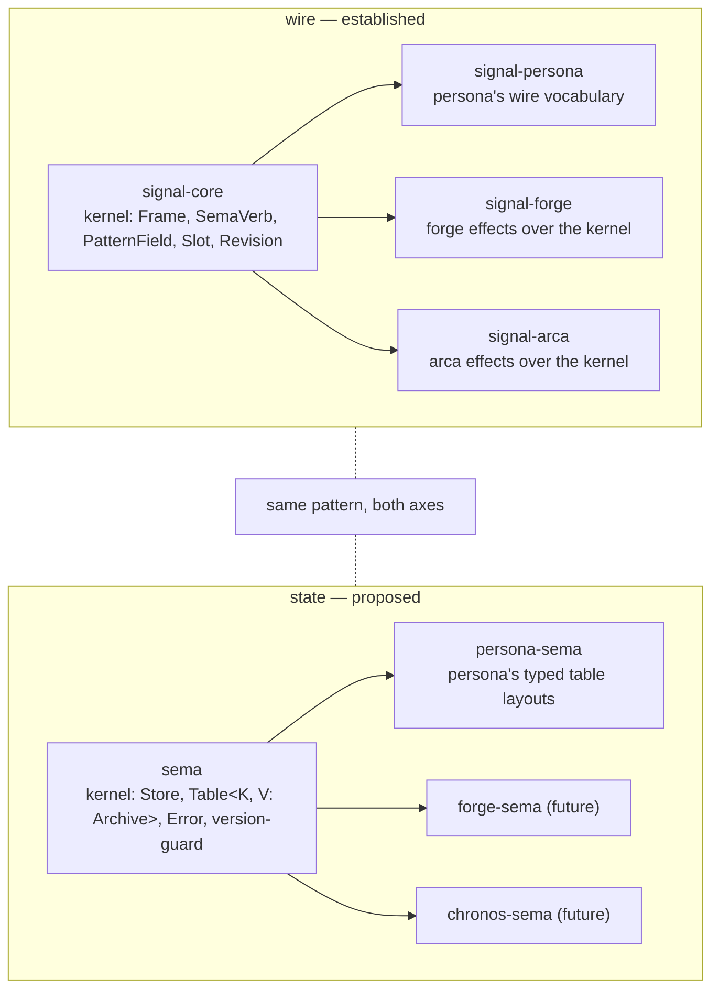
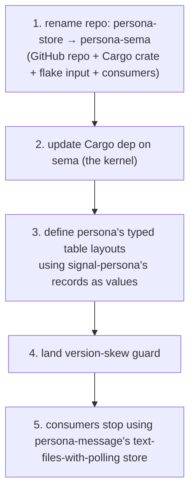

# 63 · Sema as the workspace database library

Status: design decision per user 2026-05-09 — *"Should sema
become the workspace's database library? yes. persona-store
should be persona-sema."*
Supersedes: `reports/designer/62-sema-as-library-research.md`
(deleted in same commit).
Author: Claude (designer)

The user redirected after reading designer/62: sema IS the
workspace's typed database substrate; the layering follows
the **same pattern as signal-family** (kernel + per-ecosystem
layered crate). My option-C recommendation in 62 (extract a
neutrally-named helper) missed the load-bearing point —
sema is to state what signal is to wire.

---

## 0 · TL;DR



| Decision | Value |
|---|---|
| Sema becomes the workspace's database kernel | yes |
| `persona-store` renames to `persona-sema` | yes |
| Sema's "exclusively owned by criome" boundary | drops |
| Sema's slot-counter + reader-pool patterns | move (see §4) |
| Naming convention going forward | `<consumer>-sema` mirrors `<consumer>-signal` |

---

## 1 · The redirect

Designer/62 surveyed the patterns and recommended a
neutrally-named helper crate (`store-kit`) extracted later.
That recommendation:

- **Misnamed the answer.** Calling the kernel `store-kit`
  hides its role. `sema` is already the right name for the
  workspace's typed-storage substrate; renaming it to
  *avoid* repurposing was the wrong instinct.
- **Misread the boundary.** I treated *"sema is exclusively
  owned by criome"* (per `sema/ARCHITECTURE.md`) as a hard
  constraint. The user's intent always was for sema to be
  general; the exclusive-criome boundary was an artifact
  of sema being the *only* sema-flavored store so far.
- **Missed the mirror.** The signal-family naming pattern
  (`signal-core` kernel + `signal-<consumer>` layered
  crate) is the *same* pattern at the storage layer. Once
  named, the answer reads itself.

The signal-family pattern is documented in
`skills/contract-repo.md` §"Naming a contract repo":

> When the contract is **layered atop `signal`** — re-uses
> signal's `Frame`, handshake, and auth, adds per-verb payloads
> for a narrower audience — the canonical name is
> **`signal-<consumer>`**

The same rule applies to sema-flavored stores. Each
consumer's typed-storage layer is named `<consumer>-sema`.

---

## 2 · The mirror

| Wire layer | State layer |
|---|---|
| `signal-core` — Frame envelope, SemaVerb, PatternField, Slot, Revision, ProtocolVersion | `sema` — Store handle, Table&lt;K, V: Archive&gt;, Error, version-skew guard |
| `signal-persona` — Persona's typed Request/Reply vocabulary, per-record types | `persona-sema` — Persona's typed table layouts (Harness, Message, Lock, Delivery, etc.) |
| `signal-forge` — forge effects, layered atop signal | `forge-sema` (future) — forge's persistent state, layered atop sema |
| `signal-arca` — arca effects, layered atop signal | (arca's content-addressed object store may itself be the sema-equivalent for that layer; TBD) |

The structural rule is identical: **kernel + per-consumer
typed layer**. New consumers join the family without
renaming or re-architecting the kernel.

---

## 3 · What sema keeps; what generalizes

After the kernel-extraction, sema's surface looks like:

| Symbol | Stays / generalizes |
|---|---|
| `Store::open(path)` (currently `Sema::open`) | **Generalized.** The open-or-create + parent mkdir + ensure_tables boilerplate. |
| `Table<K, V: Archive>` | **New.** Typed wrapper that hides rkyv encode/decode at table boundary. |
| `store.read(|txn| ...)`, `store.write(|txn| ...)` | **New.** Closure-scoped txn helpers. |
| `Error` (5 redb variants + rkyv + io) | **Generalized.** Same shape as today's `sema::Error` minus criome-specific variants. |
| Version-skew guard (`SchemaVersion` table check at open) | **New.** Mandated by `skills/rust-discipline.md` §"Schema discipline"; neither sema nor orchestrator has it today. |

Renamed root type: **`Sema` → `Store`** (or `Database`,
or `Sema` itself if we want the type to be named after the
crate). The cleanest is probably:

```rust
pub struct Sema { database: Database, path: PathBuf }
```

Per `skills/naming.md` §"Anti-pattern: prefixing type names":
the type can be `Sema` since it isn't prefixed by the crate
name (`sema::Sema`); the same way we have `signal::Frame`
not `signal::SignalFrame`. But the conventional `sema::Store`
or `sema::Database` reads better as English at call sites
(`Sema::open` vs `Store::open`). I'd lean `sema::Sema` for
self-naming consistency with the crate purpose, but defer
to operator's call when the rename lands.

---

## 4 · The criome-specific bits — where they go

Today sema carries criome-specific machinery:

| Symbol | Goes |
|---|---|
| `Slot(u64)` newtype | **Stays in sema as a utility** — slot-as-monotonic-id is genuinely general (any append-only store wants it). Sema exports it; consumers use it or don't. |
| `Sema::store(&[u8]) → Slot` (slot allocation + insert) | **Stays in sema as a utility** — same justification. |
| `Sema::iter() → Vec<(Slot, Vec<u8>)>` | **Stays in sema as a utility** — generic scan-all-records. |
| `Sema::reader_count` / `set_reader_count` | **Moves to criome.** Criome-specific config; the workspace database library has no opinion about read-pool sizing. |

So sema's surface grows (Store/Table/Error/version-guard
become first-class) and shrinks (reader-pool moves to
criome). Net change is small in LoC, large in *role*.

---

## 5 · `persona-sema` (renamed from `persona-store`)

Today `persona-store` is a 32-line BTreeSet stub. (Earlier
audit 60 named this finding; that report retired in the
2026-05-09 cleanup; the current inventory lives in
`designer/68` §9.) The rename happens in the same operator
slice that builds it properly:



`persona-sema` would own:

- The redb schema for persona (which tables exist, what
  keys, what value types).
- The `Schema` constant declaring the table list +
  schema version.
- Convenience methods atop `Sema::open` for persona-specific
  opens (e.g. canonical path discovery, default schema
  registration).
- Migration helpers (when needed).

`persona-sema` would NOT own:

- The record types themselves — those live in
  `signal-persona` (`Message`, `Lock`, `Harness`,
  `Delivery`, etc.).
- The verbs / commands — those are wire-shaped and live in
  `signal-persona`.
- The actor logic — that's `persona-router`, `persona-system`,
  etc.

The split mirrors signal exactly: signal-persona owns the
wire vocabulary (records + Request/Reply enums). persona-sema
owns the storage layout for those same records.

---

## 6 · Migration order

| Step | What | Owner | Effort |
|---|---|---|---:|
| 1 | Designer report 63 (this) — supersedes 62 | designer | done |
| 2 | Update `sema/ARCHITECTURE.md` to drop "exclusively owned by criome" + describe the new kernel role | designer | 30 min |
| 3 | Update `sema/skills.md` to reflect new scope | designer | 15 min |
| 4 | Refactor sema: extract Store + Table&lt;K, V&gt; + version-guard as the kernel surface; keep Slot + slot-counter + iter as utilities; move reader-count to criome | operator | 1 day |
| 5 | Refactor criome: own reader-count locally; verify nothing breaks | operator | 2 hr |
| 6 | Refactor orchestrator/state.rs onto sema | operator | 2 hr |
| 7 | Rename repo `persona-store` → `persona-sema` (+ flake-input updates in every consumer) | operator + system-specialist | 1 hr |
| 8 | Build persona-sema's actual redb+rkyv layer | operator | 1-2 days |
| 9 | persona-message migrates off text-files-with-polling, onto persona-sema | operator | 1-2 days |

Steps 2-3 are designer-shaped and small. I can land them in
this session if you want.

Steps 4-9 are operator's lane, multi-day, sequential.

---

## 7 · Implications for designer/4 and existing reports

Designer/4 (the apex Persona design) §5.2 says:

> Persona daemon as state engine

The state-engine framing was always meant to project onto
typed tables; designer/4 didn't name the storage substrate.
The decision lands cleanly on top — Persona's state engine
*is* persona-sema's tables, manipulated by persona-router's
reducer.

No edits to designer/4 needed. The skill `skills/rust-discipline.md`
§"redb + rkyv" §"When to lift to a shared crate" should be
updated to point at the sema-family pattern instead of the
generic "extract a helper crate" framing. Small edit.

---

## 8 · Naming check against the just-landed rules

`skills/naming.md` §"Anti-pattern: prefixing type names with
the crate name" says the crate IS the namespace. So:

- `persona_sema::PersonaSema` → wrong (crate-name prefix)
- `persona_sema::Store` → fine
- `persona_sema::Schema` → fine
- `persona_sema::Sema` → debatable; "Sema" is the kind of
  thing the crate is, not a prefix. Allowed if we treat
  "Sema" as descriptive (like `signal::Frame`).

`sema::Sema` is the same shape as `signal::Frame` — the
type self-names with the crate's central concept. Both are
fine.

---

## 9 · Supersession

Designer/62 is deleted in the same commit that lands this
report (per `skills/reporting.md` §"Supersession deletes
the older report"). Substance preserved in 63's analysis:

- 62 §1 (sema today) → carried forward into 63's mirror table
- 62 §2 (orchestrator's parallel implementation) → still
  relevant; orchestrator is the second consumer that
  helped reveal the kernel shape
- 62 §4 (what the helper should contain) → carried forward
  into 63 §3 with the renamed-back-to-sema framing
- 62's "wait for 3 consumers" rule → softer here. The
  user has decided sema is the kernel; persona-sema
  *is* the third consumer, scheduled. The extraction
  doesn't wait for crystallization; the design decision
  precedes the third use.

The "don't pre-abstract" rule still applies to *new* helpers
this audit didn't anticipate. Sema-as-kernel is now an
explicit design commitment, not a pre-abstraction.

---

## 10 · See also

- `~/git/github.com/LiGoldragon/sema/` — the kernel-to-be.
- `~/git/github.com/LiGoldragon/persona-store/` — to be
  renamed `persona-sema`.
- `~/primary/skills/contract-repo.md` §"Naming a contract
  repo" — the signal-family naming convention this report
  mirrors.
- `~/primary/skills/rust-discipline.md` §"redb + rkyv"
  §"When to lift to a shared crate" — needs update to point
  at the sema-family pattern.
- `~/primary/reports/designer/4-persona-messaging-design.md`
  — apex design; persona-sema's tables are the storage end
  of designer/4's state engine.
- `~/primary/reports/designer/68-architecture-amalgamation-and-review-plan.md`
  §4 + §9 — current state of the sema-family + open beads.

---

*End report. Designer/62 deleted in the same commit.*
