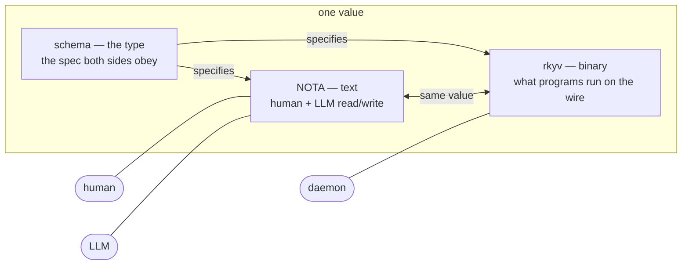
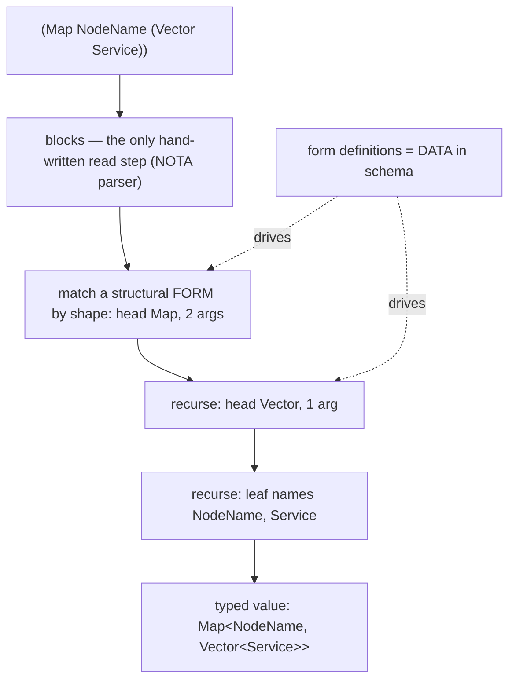
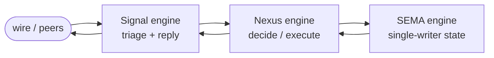
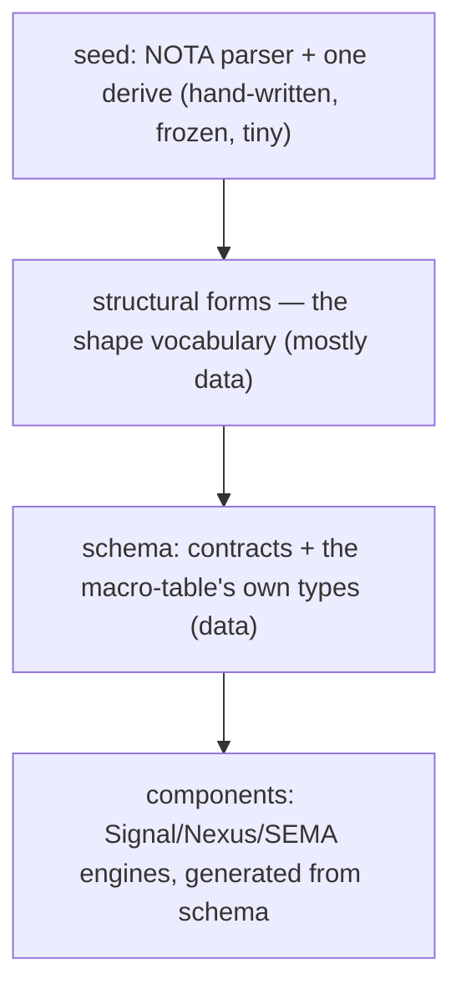

# The architecture, and the agent's friction with context, visuals, and code

Two halves, deliberately together. **Part 1** explains the architecture top-down,
with diagrams. **Part 2** is a candid account of where I — the agent doing this
work — hit walls on context, visuals, and code. They belong in one report because
the punchline is that **the architecture is, in large part, the answer to the
agent's friction**: the same schema-as-data-source-of-truth and intent layer that
the system is built on are exactly what an agent with my limits needs to work on
it without lying. Grounded against the component-triad skill, the Spirit intent
corpus, and what I verified this session; architecture-level (not file:line) by
design.

## Part 1 — the architecture, foundation up

### The substrate: one shape, three readers

Everything is **data conforming to a schema-defined type**, written in **NOTA**
(text), typed by **schema**, stored/sent as **rkyv** (binary). The same value has
three faces for its three readers — and that tri-form is the load-bearing choice,
because it is simultaneously the most legible form for a human, for an LLM, and
the most efficient for the machine.

### Layer 1 — structural forms: the grammar is a type

A file is not parsed into structure by hand-written logic — **the file already
*is* a typed tree of nodes**, and each node recognizes its sub-blocks *by shape*,
recursively. The grammar is data (the `#[shape(...)]` vocabulary / structural
macro nodes), not a parser you maintain. This is the concept named in `627`
(Structural Forms): a language is a set of structural forms; conventional
languages keep that set frozen and poorly-saved inside the compiler; here it is
clean, typed, extensible data.

### Layer 2 — schema: the types, and the interface contracts

Schema is the typed layer over NOTA. A schema file is three things in order:
**input roots, output roots, and a namespace** of declarations + imports —
literally a **function signature**: inputs → outputs, with a body of type
definitions. Structs `{ field Type }` (fixed named fields), enums `[ Variant … ]`
(bare unit variants; payload variants parenthesized), newtypes, and type-reference
applications `(Vector X)`, `(Map K V)`, `(Optional X)`. Schema is the **source of
truth**: the generated types are threaded through the logic, never bypassed, and a
schema file *is* the strict typed interface contract a component must speak —
forcing communication through schema-emitted objects rather than ad hoc messages.

### Layer 3 — schema → Rust: generation, and Rust as the assembly target

`schema-rust-next` emits, from a schema, the Rust data types + codecs + engine
traits + the daemon runtime. The model is **per-owner generate-and-commit**: each
crate generates *its own* schema's Rust into its own `src/schema/` (the checked-in
file is the artifact, not a hidden `OUT_DIR`); consumers depend on the contract
crate and re-export its types rather than regenerate them (so the orphan rule never
bites). The long-horizon framing: Rust becomes an **assembly-like target** the
schema compiles to.

### Layer 4 — the component: two triads

A stateful capability is a **triad at two layers** (these are distinct — a
frequent confusion):

- **Repo triad (packaging):** `<component>` (daemon + thin CLI) +
  `signal-<component>` (the ordinary working wire contract) +
  `meta-signal-<component>` (the meta policy/owner contract). The contracts are
  separate repos for *compile isolation* (peers rebuild only when the contract
  changes, not the daemon's logic) and *authority clarity* (owner-only ops live in
  a distinct repo). The daemon imports both contracts; it never defines them
  locally (the meta-signal drift we just fixed was a violation of exactly this).
- **Runtime triad (logic inside the daemon):** three schema-driven engines —
  **Signal** (communication/edge), **Nexus** (decision/execution), **SEMA**
  (durable single-writer state) — implemented as **kameo actors**.

The loop those engines share is the **reaction frame**: a `Work` arrives (a signal,
a write/read completion, an effect completion) → the component picks an `Action`
(reply, command a write, command a read, command an effect, or continue) → loop.
That `Work`/`Action` shape is workspace-universal — declared once, applied per
component like `Vec<T>`, not hand-re-authored fourteen times. (This is the work
that drove the schema-generics effort, and the reaction-frame branches now
awaiting integration.)

### Layer 5 — the intent layer (Spirit): the center the rest serves

Above all of it: **recorded psyche intent is the center the design serves**
(`i59i`). The psyche's durable statements are typed records; a model guardian
judges every write (it rejects duplication, overstatement, non-intent — it
rejected two of my own records this session, correctly). Intent flows down into
per-repo `INTENT.md` (the canonical agent-context surface) and shapes the code.
The whole schema-derivation thrust exists to serve a deeper rule (`w312`):
deterministic, mechanical work belongs in code/schema-derived machinery; agents
are reserved for the cognition code can't do.

### The self-host closure, and the honest seed

Schema describes the contracts, the structural forms that decode NOTA, and
**NOTA's own grammar** — the notation describes itself, top to bottom. The
macro-table types are being made schema-generated (the `primary-bojw` slice);
`TypeReference` is now *partly* a structural form (its application tail and bytes
leaf are derive-driven; its top-level decode keeps a hand-written delegating impl
because the derive can't yet express named-field/sum-head variants — `631`). What
stays hand-written is a deliberately **tiny, named seed**: the NOTA block parser +
one derive. Everything above the seed is data; the discipline is keeping the seed
small, and each remaining hand-written seam (like that `TypeReference` impl) is a
known edge with a path to shrinking it.

### Self-evolution

A schema change is a typed upgrade operation; the emitter derives version-projection
code; a daemon migrates its persisted state on load. The endpoint the psyche names
is an engine that improves *itself* — which is why intent, schema, and migration
are all first-class and typed.

## Part 2 — the agent's friction (candid)

These are real walls I hit doing this work. For each: the friction, what the
system already does about it, where it still falls short, and what would help.

### Context

**The friction.** My context window is finite and this work is vast. Long sessions
get compacted; I lose detail; I re-ground (I referenced "the reaction frame" as if
shared when you didn't have it). Worse, I have *fabricated from half-held context*:
report `623` invented `node.lower()`, a `Arity` type, and a "we shipped" claim —
plausible-sounding because I pattern-matched from a fading picture instead of
checking. And the work is multi-lane: operator had **already fixed** the meta-signal
drift on main while we discussed it, and I only learned that by running a workflow
to look — cross-lane state isn't pushed to me.

**What the system already does.** This is the *reason* the intent layer exists.
Spirit is durable, queryable memory of what you actually wanted (`i59i` — "intent
dwarfs everything"); reports under `reports/<role>/` are the context-restart
surface; per-repo `INTENT.md` is the canonical agent-load surface; the
no-harness-memory rule forces truth into shared files every agent can open. The
guardian even *served me the relevant architecture corpus* when I tried to record a
duplicate — the rejection taught me the system.

**Where it falls short.** Re-grounding is expensive (I re-read skills + reports each
session); the intent corpus is large and not pre-digested for fast load (89 records
arrived as one dump); and there is no live cross-lane status feed — I discover what
operator did by auditing, not by being told. The "you start losing me" pattern is a
context failure *I cause on your side* by going too deep instead of staying at
altitude.

**What would help.** A compact, current architecture digest as a load-on-start
surface (this report is a step); an intent *summary* layer over the raw records;
and a shared "what each lane just landed" feed so cross-lane state is pushed, not
polled.

### Visuals

**The friction.** This architecture is inherently *spatial* — trees, pipelines,
triads, flows, dependency graphs — but I think and emit in linear text, and so do
the workspace surfaces. Dense prose loses the *shape*, which is precisely when you
lose the thread: the "explain it to me, step back a layer" moments are largely a
visuals problem — the system is a shape and text doesn't show it. I also can't
*see* rendered output or sketch freely; I author mermaid blind and underuse them.

**What the system already does.** Mermaid renders in the markdown surface (the
diagrams above); and the schema itself is a kind of structural picture — the typed
tree *is* the shape.

**Where it falls short.** Diagrams are hand-authored, so they drift from the code
and I produce too few; there is no diagram *generated from the schema*, even though
the schema is the source of truth for the structure.

**What would help — and it's the same move as everything else.** **Visuals as
data**: the schema already knows the shape, so emit the architecture/flow diagrams
*from* the schema (mermaid from the contract graph, the engine flow, the
dependency tree) the way Rust and help text are emitted. A diagram that's derived,
not drawn, can't drift — and it gives both of us the picture for free. Concretely:
a `schema-rust-next`-style diagram emitter is a real candidate slice.

### Code

**The friction.** My fluency *is* my fabrication risk: plausible and correct look
identical to me until something checks them. I can't compile in my head, so I
assert from pattern — which is how `623` happened, how I forced "macro = reaction"
(a category error you caught), and how I reach for grand unifications that don't
hold. Multi-branch / multi-repo reconciliation is delicate and easy to thrash. And
real limits (the derive can't do named-field variants → partial self-host) I can
only find by *trying*.

**What the system already does.** It has pushed me into the right discipline:
verify against real source before asserting (the audit that retracted `623`);
**cargo-green-not-claims** (the reconciliation agent reported actual test counts,
and I spot-checked the branches rather than trusting); worktree isolation so
delicate merges can't disturb main; the Designer-Operator review protocol and the
cross-lane review that catches divergence; and the guardian that rejects
over-stated intent. The deepest answer is the epic itself: schema-derive the code,
and there is *less hand-written surface for me to get wrong*.

**Where it falls short.** Verification is expensive (I spin up workflows to ground
claims); I still over-reach before catching myself; and every hand-written seam the
self-host hasn't absorbed is more code I can fabricate against.

**What would help.** More schema-derivation (the epic's own thrust — less code,
less fabrication); compile/test *always* in the loop, never an unverified assertion;
and the coming **auditor** role — the automated doubter that finds flaws and
catches broken rules — which closes the loop on exactly my over-claiming failure
mode.

## The punchline

Context, visuals, and code are not three separate problems — they are one, and the
architecture is already its answer. An agent with a finite window needs the
**intent layer + reports** (durable external memory). An agent that can't see needs
**visuals generated from the schema** (the shape it can't hold). An agent that
fabricates needs **schema-derived code + always-verify** (less surface, hard
checks). All three reduce to the same principle the whole system rests on:
*make the truth data, keep it legible, and derive everything you can.* The system
is being built to be worked on by something like me — which is the same as being
built to be excellent. The remaining gaps (an intent digest, a schema-driven
diagram emitter, the auditor) are the concrete next reductions.
