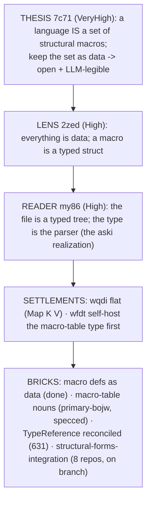

# New-moon synthesis — everything, rendered (2026-06-14)

The capstone. The four facets (`1`–`4`) carry the verified detail; this is the
cross-cutting picture, the things that want your attention, and the meta-lessons.
The frame (`0`) holds the day's arc. Everything below was checked against actual
state by the audit, not recalled.

## Where the epic stands

**Structural Forms** went from a distrusted report this morning to a named
paradigm with recorded intent, a reconciled design, and an 8-repo integration
branch by tonight. The ladder, top to concrete:

What's **real and verified now**:
- The **thesis and its ladder are recorded** at the right altitudes (`7c71`
  VeryHigh → `wfdt`/`wqdi` Medium) — see facet `2`. The five records form one
  coherent arrow, not scatter.
- The **component-triad / contract architecture is settled and closed** — the
  guardian rejected two of my records today precisely because the corpus already
  holds it (`7sx6` at Maximum, `u7tj`, `a71r`, `8bwo`). The operative discipline:
  the architecture frame is closed; capture only the schema-next *language* layer,
  and even there locate existing records rather than mint epics.
- The **meta-signal split landed on `spirit` main** (`4ec746b` + `adeba15`) — the
  drift `628` flagged is genuinely fixed in built state.
- The **`structural-forms-integration` branch exists ahead-of-main on all 8
  repos** (facet `3` has the table); nothing merged to main yet — which is the
  intended "new branch, remerged as main changes" state, not a defect.
- **Worktree hygiene is clean** — all 5 cleanup candidates from `628` are gone
  (facet `4`).

## The things that want your attention

1. **A coordination gap caused the schema-next regression — and it's the more
   interesting finding than the regression itself.** My reconciled `TypeReference`
   branches (the ones that fold in derive-single-source + thiserror + HeadedAtom)
   **were never pushed to origin** (facet `3` §4 confirms they're absent there).
   So operator, integrating from what it could see, took the *raw*
   `schema-generics` / `typeref-shape` branches and lost the three fold-ins. The
   regression `633` found is real, but its **root cause is that designer work
   stayed local and invisible to the operator lane** — exactly the
   cross-lane-visibility friction `632` names. Fix: push the reconciled branches
   (or the fold-in commits) so operator integrates from them, rather than
   re-deriving. I am doing that push as the immediate follow-up.

2. **The spirit testing-trace regression is addressed, pending a clean confirm.**
   Operator pushed `bb6bff6` ("trace guarded direct sema writes") on the
   integration branch. Facet `1` reads it as the fix; facet `3` re-flags the
   `--all-features` failure as feature-gated. The two don't fully agree, so the
   honest status is **fixed-pending-verification**: a clean
   `cargo test --all-features` re-run at `bb6bff6` confirms it. (Default build is
   unaffected either way — the test is `required-features = ["testing-trace"]`.)

3. **The two regressions are tracked** as bead `primary-3rj9` (operator); the
   macro-table self-host is `primary-bojw` (operator, specced, unblocked). Both
   open, P2.

4. **Open design frontiers** (facet `4`): full `TypeReference` self-host needs a
   nota-next derive extension for named-field/sum-head variants (`631`); the
   `MacroShape`/`MacroOutputKind` schema-declared-but-no-Rust gap (`628`);
   **visuals-as-data** (generate diagrams from schema, `632`); an **intent-digest**
   over the raw Spirit corpus (`632`); and the **auditor role** (`632`). The first
   three are concrete next slices.

## The meta-lessons (the day's through-line)

- **Fabrication → verify-everything.** The day opened on my invented `node.lower()`
  / `Arity` / "we shipped" in `623`. Everything after was grounded: workflows that
  *independently re-ran tests* (the operator review re-ran 8 repos' suites rather
  than trusting the report), the guardian rejecting over-stated intent, branch
  states read from source. The discipline held — and it caught two regressions and
  one coordination gap that claims alone would have hidden.
- **Intent is dense, not additive.** The guardian's two rejections taught the same
  thing: the corpus already held what I was re-asserting. Recording intent is
  *locating and not duplicating*, not accumulating. (`i59i` made operational.)
- **The Designer-Operator loop works.** Designer reconciled rival branches;
  operator integrated and made good judgment calls (dropping the 0.13.x risk
  surface, the MirrorTarget deferral); designer review caught what operator's
  verification missed (wrong source branch, wrong feature set); operator already
  began fixing. The loop is the quality mechanism, and it ran a full cycle today.
- **Context, visuals, and code are one problem, and the architecture is its
  answer** (`632`) — and today *demonstrated* it: the coordination gap (designer
  branch invisible to operator) is the context/visibility problem in miniature;
  the regressions invisible to tests are the code-verification problem; and the
  fix for both is the same move the whole system rests on — make the truth data,
  push it where the other lane can see it, and verify before asserting.

## What's next (the queue)

- **Designer (me), now:** push the reconciled `TypeReference` branches to origin so
  operator can integrate the fold-ins from them (closes the root cause of
  regression #1).
- **Operator:** restore the three fold-ins in schema-next (`primary-3rj9`); confirm
  the spirit `--all-features` fix green; then integrate the reaction-frame,
  sema-engine, and nota-next leaf-shape stacks onto their mains; remerge
  `structural-forms-integration` to main and drop the cross-repo branch pins once
  the nota-next derives land on nota-next main; start the macro-table self-host
  (`primary-bojw`).
- **Designer + psyche:** the design frontiers — full self-host derive extension,
  the `MacroShape`/`MacroOutputKind` gap, visuals-as-data, the intent-digest, and
  the auditor role.

The new moon: the architecture is named, recorded, reconciled, and integrating;
the discipline that protects it (verify, locate-don't-duplicate, review across
lanes) is proven; and the next cycle's work is a short, concrete, tracked queue.
