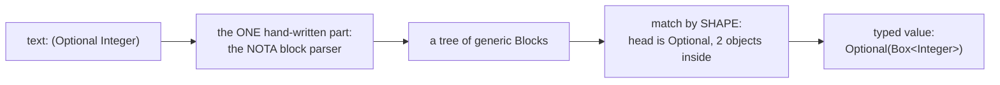
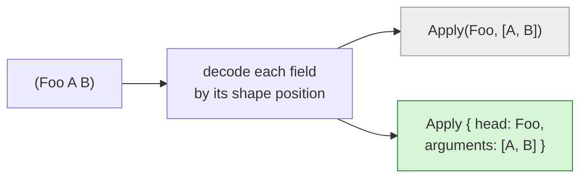
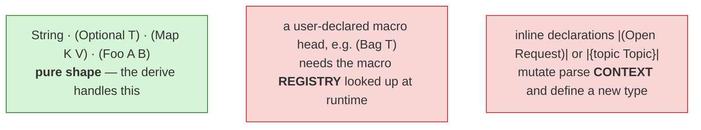
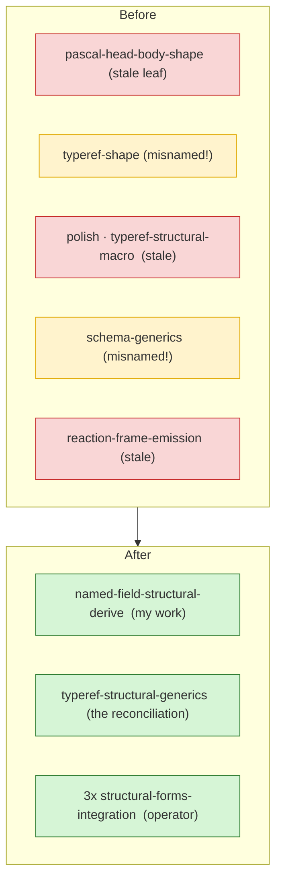
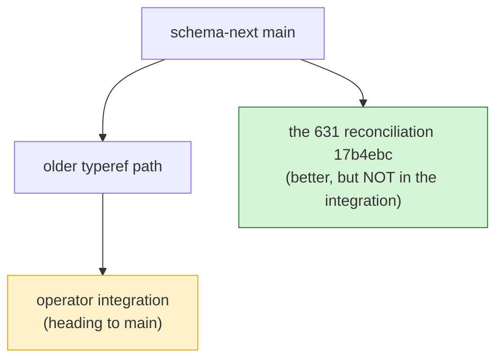

# Structural forms, explained — what I built, and where the derive's reach ends

A plain walk-through of the whole session, with pictures and small code. No prior
report needed to follow it. The deep version is `635`; this is the map.

## The one idea

A programming language is just a **set of shapes**. `if`, a function call, a
type — each is a shape the compiler knows how to recognise. Normally that set of
shapes is *frozen inside the compiler*. Our bet: keep the set as **data**, so it
is open (anyone can add a shape) and an LLM can read it.

So a file is never "parsed" by hand-written logic. It is already a **typed tree**,
and each node recognises its children **by shape**, recursively.



The only hand-written reader is the tiny block parser at the start. Everything
after it is shape-matching driven by data.

## The shape vocabulary

A node is an `enum`. Each variant carries a `#[shape(...)]` tag saying what NOTA
it matches. These seven shapes are the whole vocabulary today:

| Shape tag | Matches | Example NOTA |
|---|---|---|
| `pascal_atom` | a PascalCase word | `Topic` |
| `keyword = "X"` | one exact word | `String` |
| `head = "H", arity = N` | `(H a …)` with a fixed count | `(Optional T)` |
| `head = "H", atom` | `(H 32)` — head plus one number | `(Bytes 32)` |
| `head = "H", body` | `(H a b c …)` — any count | `(Variants A B C)` |
| `pascal_head, arity = N` | `(Foo a …)` captured head, fixed count | `(Pair A B)` |
| `pascal_head, body` | `(Foo a b c …)` captured head, any count | `(Foo A B)` |

Reading a real node (schema-next's type-reference grammar), lightly trimmed:

```rust
enum DerivedTypeReference {
    #[shape(keyword = "Bytes")]      Bytes,                       // the word Bytes
    #[shape(head = "Bytes", atom)]   FixedBytes(u64),             // (Bytes 32)
    #[shape(head = "Vector", arity = 2)] Vector(Box<Self>),       // (Vector T)
    #[shape(head = "Map", arity = 3)]    Map(Box<Self>, Box<Self>), // (Map K V)
    #[shape(pascal_atom)]            Plain(TypeName),             // Topic
}
```

The derive turns each tag into: a matcher, a decoder, and an encoder. You write
the *shapes*; the machine writes the parsing.

## What I built: named fields

The derive could already build a variant from **positional** fields:

```rust
#[shape(pascal_head, body)]
Apply(TypeName, Vec<TypeReference>)        //  worked
```

…but it **rejected** the same variant with **named** fields:

```rust
#[shape(pascal_head, body)]
Apply { head: TypeName, arguments: Vec<TypeReference> }   //  ERROR before this session
```

That was an arbitrary gap — the field names changed nothing about the *shape*.
Now both work. The change is small: capture the field names, and when they exist,
emit a braced `Variant { field: … }` instead of a tuple. Decoding is identical.



It is tested green (71 nota-next tests pass) and pushed to origin on
`next/named-field-structural-derive`. This is exactly the extension report `631`
asked for.

## The finding: where the derive's reach ends

Here is the honest twist, and the real value of the session. Report `631` said:
add named-field support and `TypeReference` will fully **self-host** (decode
itself entirely through the derive, no hand-written code). I implemented the
extension — and then reading the actual code showed `631` was wrong about *why*
the hand-written code exists.

`TypeReference` decoding does three things, and only the **first** is pure shape:



A derive only sees one block's shape. It has **no registry** to consult and **no
context** to mutate. So the hand-written part of `TypeReference` isn't a failure
to shrink — it is the real **border between *shape* and *meaning***. Shape is
data; meaning (which macro is this? does this declare a type?) is semantics that
must stay in code.

The proof, from the source:

```rust
// TypeReference's hand-written decode delegates here — note the registry + context:
fn from_block_with_registry(block, registry: &MacroRegistry, context: &mut MacroContext)
// inline |( )| even DECLARES a type as a side effect:
context.remember_inline_declaration(Declaration::private(/* a brand-new type */));
```

And the same lesson holds for the other hand-written nodes — none of them is
blocked by the named-field gap I just closed:

| Node | Hand-written because… | A derive could host it? |
|---|---|---|
| `TypeReference` | macro registry + context side effects | **No** — permanent border |
| `SchemaMacro` | it is a **struct**, derive is **enum-only** | Not yet — needs struct support |
| `MacroPattern` | struct + delegates to a sigil parser | Not yet |
| `MacroTemplateObject` | parses `$name` / `$*name` **sigils** | No — that is a mini-parser |

So the capability I shipped is correct and was the literal ask, but it has **no
consumer in the code today**. The genuinely useful next step is different:
**struct-level** support (the derive is enum-only), whose first real consumer is
`SchemaMacro` — a plain 4-field struct currently decoded by hand:

```rust
struct SchemaMacro { macro_name, macro_position, macro_pattern, macro_template }
//  reads a 4-object body, each field decoded by its type — pure shape, just a struct
```

That is the kind of thing the derive *should* absorb, and the honest correction
to `631`'s map.

## The worktree reset

You asked me to reuse the redesign worktrees and archive the stale ones. Before,
they were a tangle — single-leaf experiments left over, and two reuse folders
named after the *wrong* branch. After:



Four stale worktrees archived, two renamed so the folder name finally matches
the branch inside it. Nothing lost — the archived branches still live on origin.

## One thing to fix: a split brain

While resetting I confirmed a problem worth your eye. The schema-next
reconciliation (`17b4ebc`, the good `TypeReference` cleanup) and the operator's
integration branch have **diverged** — the integration was built from the *older*
path and never absorbed the reconciliation:



This is the same "designer work didn't reach the integration" gap from the
new-moon report. It needs one decision before this lands on main: rebase the good
branch onto the integration, or re-integrate from it.

## What it all means

- The structural-forms machine works, and it now reads named fields.
- The important result is a **clearer map**: the derive's job is *shape*; the
  hand-written nodes guard *meaning* (registry, context, sigils, struct shape).
  That border is real, and `631` had drawn it in the wrong place.
- The next real slice is **struct-level derive support** (consumer:
  `SchemaMacro`), not more of the named-field/registry chase.
- One decision is yours/operator's: the split-brain schema-next branch.
