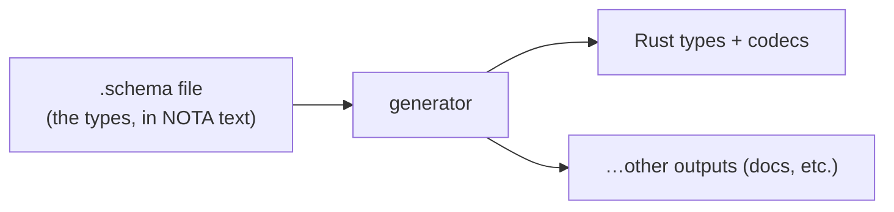
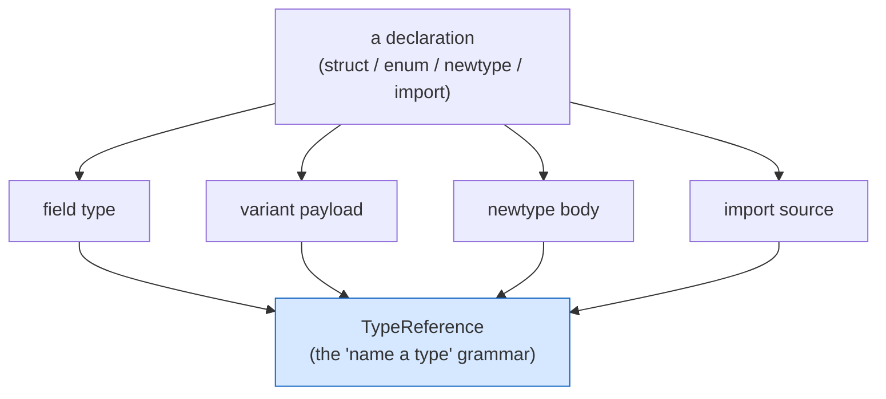
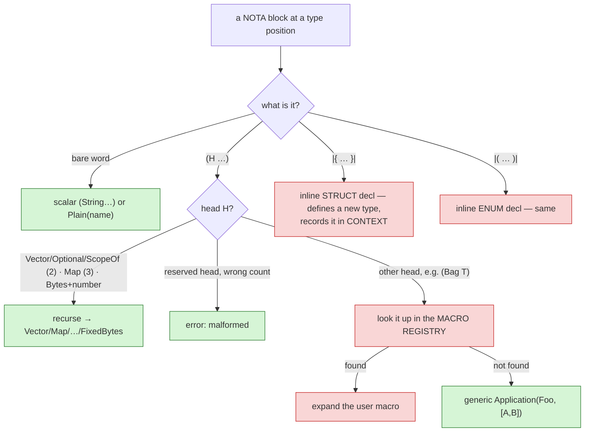
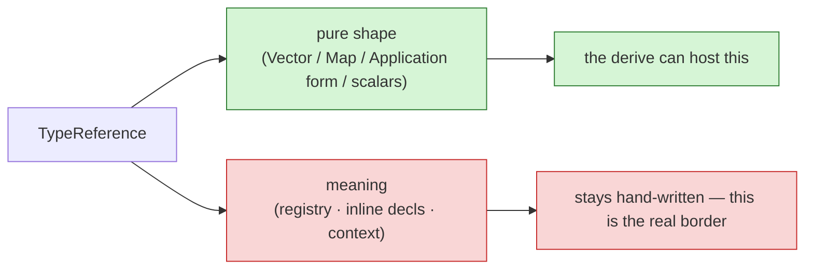

# From schema to type reference, from the ground up — and what "named fields" was about

You asked: *what am I even looking at? Support for what? Explain TypeReference in
depth.* This builds the whole thing from zero. The "named fields" change is the
very last paragraph — by the time you reach it, it should be obvious where it
fits. (Companion to `636`, which assumed too much.)

## Layer 0 — why any of this exists

Our components talk to each other in **typed messages**. Rather than hand-write
those types in Rust, we describe them once in a **schema** file, and *generate*
the Rust (types, encoders, decoders) from it. The schema is the single source of
truth for "what shapes of data exist."



So everything below is about that first box — and one specific piece of it.

## Layer 1 — what a schema actually looks like

Here is a real one, `spirit-min.schema` (the intent-log component, trimmed):

```
{
  Topic            String
  Topics           (Vector Topic)
  Description      String
  RecordIdentifier Integer
  Entry            { Topics * Kind * Description * Magnitude * }
  RecordSet        (Vector Entry)
  Kind             [Decision Principle Correction Clarification Constraint]
  Magnitude        [Minimum VeryLow Low Medium High VeryHigh Maximum]
}
```

Read it as a list of **named type declarations**: `Name <definition>`. A `{…}`
definition is a **struct** (record), a `[…]` is an **enum** (a choice of
variants). Now look at the right-hand sides:

- `String`, `Integer` — built-in scalar types.
- `(Vector Topic)` — a list of `Topic`.
- `(Vector Entry)` — a list of `Entry`.
- `Topic` (inside `Topics`) — a reference to the declared `Topic` type.

**Every one of those right-hand-side types is a "type reference."** That is the
thing we are talking about: the little language for *naming a type* wherever a
type is expected. (The `*` is a shorthand: "the type with the same name as this
field" — so `Topics *` is a field named `topics` of type `Topics`.)

## Layer 2 — where type references appear

A type reference is never top-level; it always sits *inside* a declaration. The
clearest proof is `root.schema` — the schema that describes schemas themselves:

```
FieldDeclaration   { Name * reference TypeReference }     ;; a struct field = a name + a type
NewtypeDeclaration { Name * reference TypeReference }     ;; a newtype wraps one type
Payload            [Unit (Carries TypeReference)]         ;; an enum variant may carry one type
ImportDeclaration  { Name * source TypeReference }        ;; an import names its source type
```

So `TypeReference` is the node that fills the **"a type goes here"** slot — in a
field, a newtype body, a variant payload, or an import. Four places, one grammar.



## Layer 3 — the TypeReference grammar, in depth

`TypeReference` is a single enum. Every way you can name a type is one of its
variants. Here is the full set, with the NOTA you'd write and what it means:

| Variant | NOTA you write | Meaning |
|---|---|---|
| `String` `Integer` `Boolean` `Path` `Bytes` | `String` | a built-in scalar (a bare word) |
| `FixedBytes(u64)` | `(Bytes 32)` | a fixed-width byte array of N bytes |
| `Plain(Name)` | `Topic` | a reference to a **declared** type by name |
| `Vector(Box<TypeReference>)` | `(Vector T)` | a list of `T` |
| `Optional(Box<TypeReference>)` | `(Optional T)` | maybe-present `T` |
| `ScopeOf(Box<TypeReference>)` | `(ScopeOf T)` | the typed scope language for `T` |
| `Map(Box, Box)` | `(Map K V)` | a key→value map (flat: head, then two args) |
| `Application { head, arguments }` | `(Foo A B)` | a generic application / user-defined type macro |

Two things make this a real grammar, not a flat list:

**It is recursive.** The inner positions are themselves type references, so they
nest to any depth:

```
(Map NodeName (Vector (Optional Service)))
   │     │         │        │
   │     │         │        └ Optional( Plain(Service) )
   │     │         └ Vector( … )
   │     └ Plain(NodeName)                 ← the key
   └ Map( key , value )                    ← the whole thing
```

**The head is dynamic** (`Application`). Anything that is *not* a built-in head
(`Vector`, `Optional`, `ScopeOf`, `Map`, `Bytes`) but looks like `(SomeName …)`
is a generic application — e.g. a user-declared type macro `(Bag Topic)`. The
`head` field is `ApplicationHead`, which is `Local(Name)` at first and gets
rewritten to `Imported(...)` later once we know the name came from another file.

## Layer 4 — how text becomes a TypeReference (the important part)

This is the heart, and it is where the later "self-host" finding comes from.
Given one already-parsed NOTA block, decoding a `TypeReference` dispatches like
this:



The **green** branches are pure *shape*: you can decide them from the block's
form alone. The **red** branches are *meaning*: they need things a shape cannot
provide —

- a **registry** of which user macros are declared (`(Bag T)` only means
  something if `Bag` was declared), and
- a mutable **context**, because an inline `|{ topic Topic }|` doesn't just read
  a value — it *declares a new struct type* as a side effect and remembers it.

In code, the hand-written decoder carries exactly those two things:

```rust
fn from_block_with_registry(block, registry: &MacroRegistry, context: &mut MacroContext)
// …and an inline declaration mutates context:
context.remember_inline_declaration(/* a brand-new type defined right here */);
```

Hold onto that: **most of a TypeReference's decode is meaning, not shape.**

## Layer 5 — the derive, and finally "named fields"

Now the part you were reading. The **derive** (`StructuralMacroNode`) is the
machine that, given a `#[shape(...)]`-tagged enum, writes the matcher + decoder +
encoder for you — but only for the **green, pure-shape** part above. You declare
the shapes; it writes the parsing:

```rust
enum DerivedTypeReference {
    #[shape(keyword = "Bytes")]          Bytes,
    #[shape(head = "Vector", arity = 2)] Vector(Box<Self>),
    #[shape(head = "Map",    arity = 3)] Map(Box<Self>, Box<Self>),
    #[shape(pascal_head, body)]          Apply(Name, Vec<Self>),  // (Foo A B)
}
```

The derive could build a variant from **positional** fields like
`Apply(Name, Vec<Self>)` — but it **rejected** the identical variant written with
**named** fields:

```rust
#[shape(pascal_head, body)]
Apply { head: Name, arguments: Vec<Self> }   //  ← was a hard error
```

The field *names* change nothing about the shape, so the rejection was an
arbitrary gap. **"Support for named fields" = teaching that machine to accept
struct-style variants** (`Apply { head, arguments }`), emitting a braced
constructor instead of a tuple. That is the whole change. It is tested and
pushed. ("Support for what?" → support, *in the shape-deriving machine*, for
enum variants whose fields have names.)

### Why it mattered less than report 631 thought

`631` reasoned: `TypeReference::Application` is written `{ head, arguments }`
(named), the derive can't do named fields, so *fix that and TypeReference
self-hosts* (decodes entirely through the derive, no hand-written code). But
Layer 4 shows the catch: **the derive only does the green branches.** The whole
red half of `TypeReference` — registry lookup, inline declarations, context
mutation — can never be a derive, because a derive sees only shape. So the
hand-written decoder isn't leftover scaffolding to delete; it *is* the
registry-and-meaning logic, and it stays.



So named-field support is a correct, real capability (and exactly what `631`
asked for), but it has **no consumer yet**: the one node it was meant for
(`TypeReference`) stays hand-written for the meaning reasons above. The next
genuinely useful step is unrelated to named fields — it's letting the derive
handle **structs** (not just enums), whose first real consumer is `SchemaMacro`,
a plain 4-field struct still decoded by hand.

## The whole picture in one line

A schema is named type declarations → each names types via the **TypeReference**
grammar → decoding a TypeReference is *part shape, part meaning* → the **derive**
automates the shape part (and now accepts named fields) → the meaning part
(registry, inline declarations) stays hand-written, and always will. That border
— shape vs meaning — is the real result of the session.
