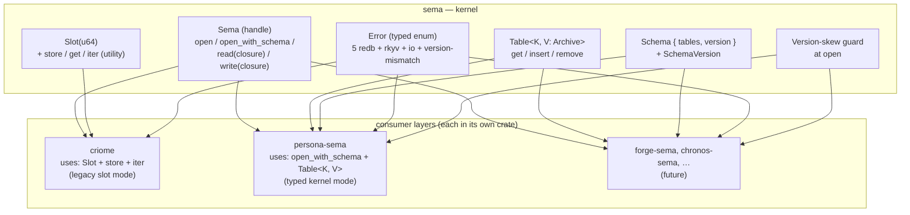
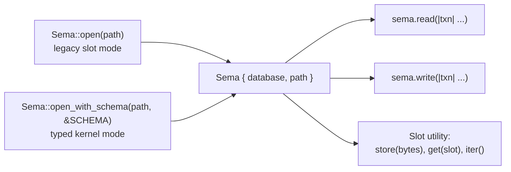
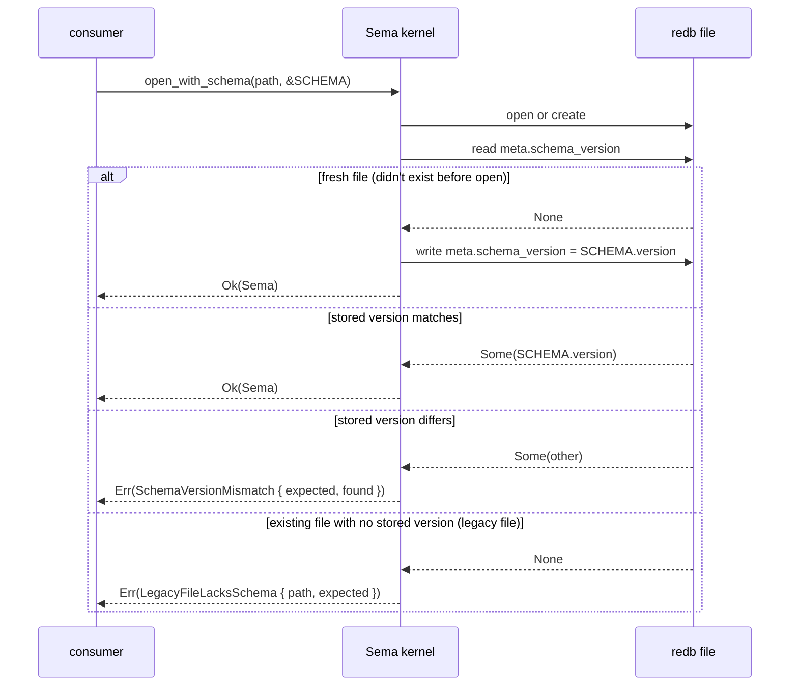
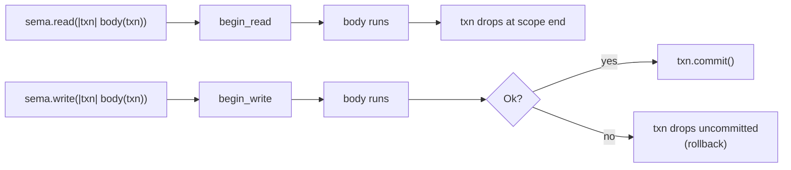
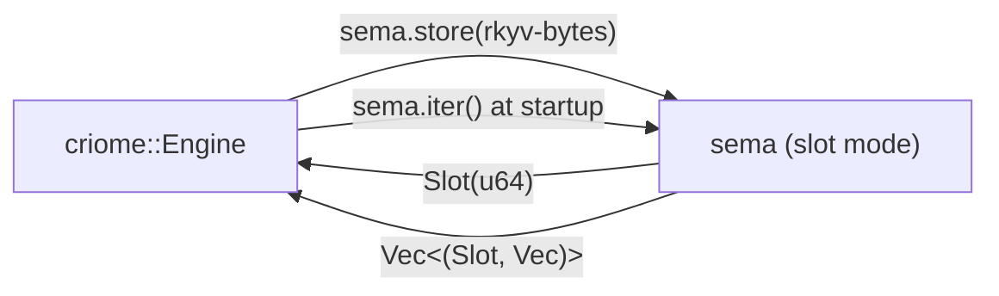
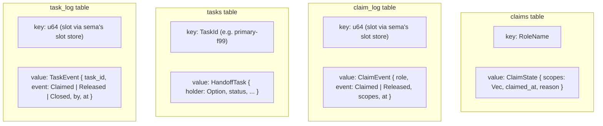
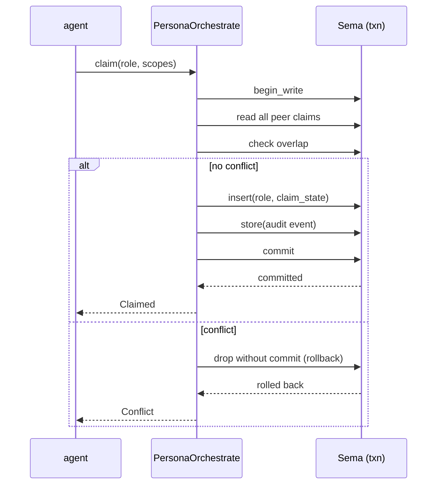
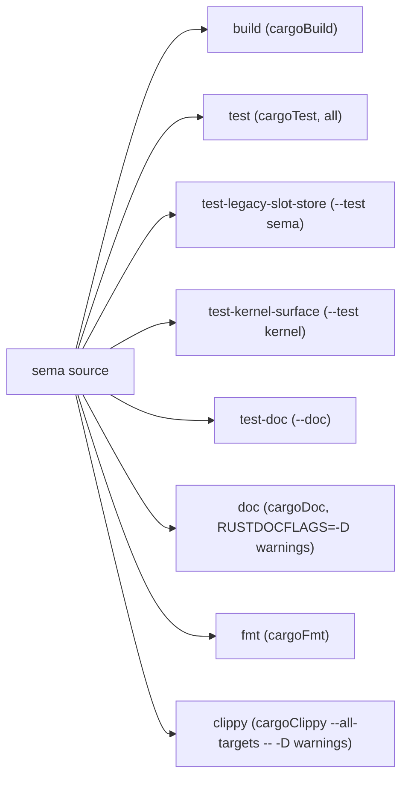
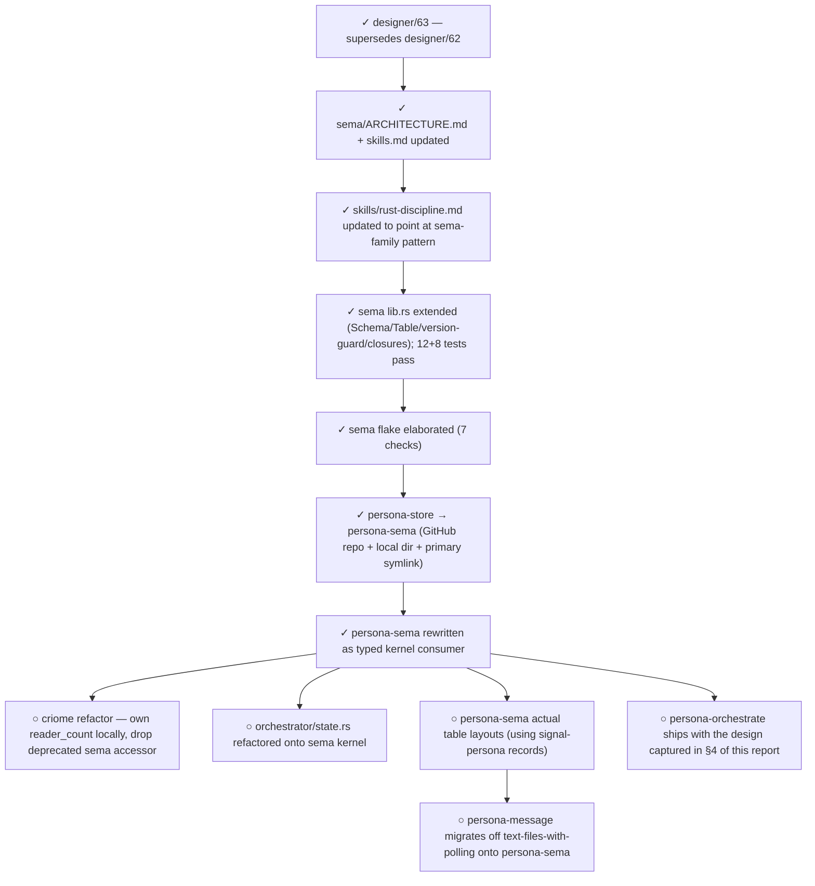

# 64 · Sema architecture

Status: comprehensive architecture report for the
sema-family — kernel + per-consumer typed-storage layers.
Builds on `reports/designer/63-sema-as-workspace-database-library.md`.

This report captures the architecture in a single place,
with diagrams + worked example code for three consumers:
**criome** (legacy slot store, present), **persona-sema**
(typed kernel mode, just landed), and **persona-orchestrate**
(future — design captured here so the eventual implementation
flows from this document).

Author: Claude (designer)

---

## 0 · TL;DR



| | sema | persona-sema | persona-orchestrate (future) |
|---|---|---|---|
| Mode | kernel | typed (consumes kernel) | typed (consumes kernel) |
| Records' Rust types | n/a (generic) | from `signal-persona` | persona-orchestrate's own (PersonaRole, ClaimScope, ClaimState, HandoffTask) |
| Key shape | u64 (Slot) — utility | typed per table | typed per table |
| Mode signature | `Sema::open(path)` | `PersonaSema::open(path)` | `PersonaOrchestrate::open(path)` |

**Status of the kernel:**
- Schema/Table/version-guard surface landed.
- 12 legacy slot-store tests + 8 kernel-surface tests = 20 tests pass.
- 7 nix-driven checks pass: `build`, `test`, `test-legacy-slot-store`, `test-kernel-surface`, `test-doc`, `doc` (rustdoc warnings as errors), `fmt`, `clippy`.

---

## 1 · The kernel — `sema`

Purpose: provide every workspace component the same typed,
version-guarded redb+rkyv plumbing so consumers focus on
their data model, not the storage boilerplate.

### 1.1 · The `Sema` handle



Both modes share one handle; consumers can mix legacy slot
storage with typed tables in the same database file. The
mode is a property of the *open call*, not the handle.

### 1.2 · `Schema` + `SchemaVersion` — the open contract

```rust
pub struct Schema {
    pub version: SchemaVersion,
}

pub struct SchemaVersion(u32);
impl SchemaVersion {
    pub const fn new(value: u32) -> Self;
    pub const fn value(self) -> u32;
}
```

The schema declares only the version. **Tables aren't
declared here.** Per redb's model, a table is uniquely
identified by `(name, key_type, value_type)`; a list of
names doesn't carry the type information and would
prematurely commit tables to a single key type at open. The
consumer's typed `Table<K, V>` constants are the actual
schema; tables get created lazily on first
`Table::get`/`insert` with the consumer's K and V.

Schemas are **static** so they can be declared at module
top:

```rust
const SCHEMA: Schema = Schema {
    version: SchemaVersion::new(1),
};
```

The kernel writes the schema version on first open and
**hard-fails** on mismatch:



The mismatch is intentional friction — schema changes are
coordinated upgrades, not silent migrations.

### 1.3 · `Table<K, V: Archive>` — typed table wrapper

The wrapper hides rkyv encode/decode at the table boundary.
Consumers see typed Rust values in and out:

```rust
use rkyv::{Archive, Deserialize, Serialize};
use sema::Table;

#[derive(Archive, Serialize, Deserialize, Debug, Clone, PartialEq)]
struct Message {
    id: String,
    body: String,
}

const MESSAGES: Table<&str, Message> = Table::new("messages");

// ... later, with a Sema handle ...
sema.write(|txn| {
    MESSAGES.insert(txn, "m-abc", &Message {
        id: "m-abc".into(),
        body: "hello".into(),
    })
})?;

let read_back = sema.read(|txn| MESSAGES.get(txn, "m-abc"))?;
```

Bound chain (the magic that makes rkyv archive types fit):

```rust
impl<K, V> Table<K, V>
where
    K: redb::Key + 'static,
    V: Archive + for<'a> Serialize<...>,
    V::Archived: Deserialize<V, ...> + for<'b> CheckBytes<...>,
```

The `K: redb::Key` lets you use any redb-supported key type
(strings, u64, byte slices, tuples). The `V: Archive` chain
is the canonical rkyv 0.8 API surface.

### 1.4 · Closure-scoped txn helpers



Behavior:
- **Read:** the txn drops at scope end; no commit.
- **Write:** the txn commits if the closure returns `Ok`;
  drops uncommitted (rollback) if the closure returns `Err`.

Tested in `sema/tests/kernel.rs::write_closure_rolls_back_on_error`.

### 1.5 · `Error` — the typed enum

```rust
pub enum Error {
    Database(#[from] redb::DatabaseError),
    Storage(#[from] redb::StorageError),
    Transaction(#[from] redb::TransactionError),
    Table(#[from] redb::TableError),
    Commit(#[from] redb::CommitError),
    Io(#[from] std::io::Error),
    Rkyv(rancor::Error),
    SchemaVersionMismatch { expected: SchemaVersion, found: SchemaVersion },
    MissingSlotCounter,    // legacy slot-store sentinel
}
```

Consumer crates wrap this via `#[from]`:

```rust
#[derive(Debug, thiserror::Error)]
pub enum Error {
    #[error("sema kernel: {0}")]
    Kernel(#[from] sema::Error),
    // ... consumer-specific variants ...
}
```

### 1.6 · `Slot` + slot store — utility for append-only stores

Kept from sema's M0 history because slot-as-monotonic-id
is genuinely useful for any append-only store (criome's
records, but also any `Vec<T>`-shaped sequence with
restart-safe identity).

```rust
let slot = sema.store(b"some bytes")?;     // Slot::from(0u64)
let slot = sema.store(b"more bytes")?;     // Slot::from(1u64)
let bytes = sema.get(slot)?;               // Some(b"more bytes".to_vec())
let all: Vec<(Slot, Vec<u8>)> = sema.iter()?;
```

Coexists with typed tables — a consumer can use both in the
same file:

```rust
let store = Sema::open_with_schema(&path, &SCHEMA)?;
store.store(b"raw bytes")?;                    // legacy slot
store.write(|txn| TABLE.insert(txn, "k", &v))?; // typed
```

(See `sema/tests/kernel.rs::legacy_slot_store_coexists_with_typed_tables`.)

---

## 2 · Worked example A — criome (legacy slot mode)

`criome` is the original consumer; it predates the typed
kernel. Its data model is append-only slot-allocated rkyv
records (criome assigns slots; criome's own typed validators
decode bytes). The kernel's legacy slot surface preserves
this exactly:



```rust
// criome/src/daemon.rs (paraphrased — actual code is similar)
let sema = Arc::new(Sema::open(&path)?);
let snapshot = sema.iter()?;
for (slot, bytes) in snapshot {
    let record = decode_record(&bytes)?;     // criome's typed decode
    engine.populate(slot, record);
}
```

Criome continues to use the legacy mode; no migration to the
typed kernel is required (or planned).

---

## 3 · Worked example B — persona-sema (typed kernel mode, just landed)

`persona-sema` is the **second consumer**, just landed (commit
`363d5fa9`). It mirrors the signal-family naming:

```
signal-core             sema
  └─ signal-persona       └─ persona-sema  ← just landed
```

### 3.1 · `persona-sema` schema

```rust
// persona-sema/src/schema.rs
use sema::{Schema, SchemaVersion};

pub const SCHEMA_VERSION: SchemaVersion = SchemaVersion(1);

pub const SCHEMA: Schema = Schema {
    tables: &[
        "messages",
        "locks",
        "harnesses",
        "deliveries",
        "authorizations",
        "bindings",
    ],
    version: SCHEMA_VERSION,
};
```

The table list mirrors `signal-persona`'s record taxonomy
(Message, Lock, Harness, Delivery, Authorization, Binding).
Each table will hold the typed `signal_persona::<Record>` as
its value once the actual table layouts land in follow-up
work.

### 3.2 · Open contract

```rust
// persona-sema/src/store.rs
pub struct PersonaSema {
    sema: Sema,
}

impl PersonaSema {
    pub fn open(path: impl AsRef<Path>) -> Result<Self> {
        let sema = Sema::open_with_schema(path.as_ref(), &SCHEMA)?;
        Ok(Self { sema })
    }

    pub fn sema(&self) -> &Sema {
        &self.sema
    }
}
```

Consumers use `PersonaSema::open(path)`, then go through
`store.sema()` for typed table operations:

```rust
let store = PersonaSema::open("/var/lib/persona/state.redb")?;
store.sema().write(|txn| {
    MESSAGES.insert(txn, "m-abc", &message)
})?;
```

### 3.3 · Boundaries

| Layer | Owns |
|---|---|
| `signal-persona` (wire) | The Rust record types (Message, Lock, Harness, Delivery, Authorization, Binding); the typed Request/Reply wire enums |
| `persona-sema` (storage) | The Schema, the table layouts, the open conventions; uses signal-persona's records as values |
| `persona-router`, `persona-system`, etc. | The runtime — actors that consume + mutate the records via persona-sema |

---

## 4 · Worked example C — persona-orchestrate (future, designed here)

`persona-orchestrate` is the typed successor to
`tools/orchestrate` (the bash script extended for `[task-id]`
locks in commit `b3491e74`). When it grows beyond its current
in-memory stub, it will need durable storage. The design
captured here is what that storage layer should look like.

### 4.1 · Why persona-orchestrate needs sema

Today (`/git/github.com/LiGoldragon/persona-orchestrate/src/`):
- `PersonaRole` — in-memory String wrapper.
- `ClaimScope` — in-memory String wrapper.
- `ClaimState` — `{ role, scopes: Vec<ClaimScope> }` in memory.

The bash `tools/orchestrate` writes plain-text lock files
(`<role>.lock`). The typed successor needs:

- **Restart safety.** A daemon-shaped orchestrator that
  outlives sessions; locks survive restart.
- **Atomic claim+overlap-check.** The current bash flow
  writes the lock first, then checks for overlap, then
  rolls back if conflict (race-prone). Typed transactions
  fix this.
- **Audit trail.** A claim/release history so post-hoc
  analysis ("who held this scope when") is possible.
- **Coordination across machines** (eventually, via
  signal-network). Today: local file. Tomorrow: a record
  type that travels.

### 4.2 · Schema design

```rust
// persona-orchestrate/src/schema.rs (proposed)
use sema::{Schema, SchemaVersion};

pub const SCHEMA_VERSION: SchemaVersion = SchemaVersion(1);

pub const SCHEMA: Schema = Schema {
    tables: &[
        "claims",       // role → ClaimState (one row per role)
        "claim_log",    // (event_id) → ClaimEvent (audit history)
        "tasks",        // (task_id) → HandoffTask
        "task_log",     // (event_id) → TaskEvent
    ],
    version: SCHEMA_VERSION,
};
```

### 4.3 · Table layouts



The audit logs (`claim_log`, `task_log`) use sema's slot
store as the auto-incrementing key — append-only, restart
safe, totally ordered.

### 4.4 · Operations

The audit log is a typed table keyed by a monotonic
sequence (kept in the kernel's `META` slot counter
indirectly, or in a dedicated counter row inside this
crate). The role list is **the data**, not a hard-coded
constant — `claim()` iterates the existing rows in the
`claims` table.

```rust
// persona-orchestrate/src/store.rs (proposed)
use sema::{Sema, Table};
use signal_persona::{ClaimState, RoleName, Scope};

const CLAIMS: Table<&str, ClaimState> = Table::new("claims");
const TASKS: Table<&str, HandoffTask> = Table::new("tasks");
const CLAIM_LOG: Table<u64, ClaimEvent> = Table::new("claim_log");
const TASK_LOG: Table<u64, TaskEvent> = Table::new("task_log");

// A small helper to allocate the next audit-log key inside
// an existing write txn (the kernel doesn't support
// nested begin_write).
fn next_log_key(txn: &WriteTransaction, last_key_table: &Table<&str, u64>) -> Result<u64> {
    let next = last_key_table.get(txn, "claim_log")?.unwrap_or(0) + 1;
    last_key_table.insert(txn, "claim_log", &next)?;
    Ok(next)
}

pub struct PersonaOrchestrate {
    sema: Sema,
}

impl PersonaOrchestrate {
    pub fn open(path: impl AsRef<Path>) -> Result<Self> {
        let sema = Sema::open_with_schema(path.as_ref(), &SCHEMA)?;
        Ok(Self { sema })
    }

    /// Atomic claim: write the role's claim AND check
    /// overlap against every other role's row in the same
    /// txn. The role list is data: we iterate the table,
    /// don't enumerate constants.
    pub fn claim(
        &self,
        role: RoleName,
        scopes: Vec<Scope>,
        reason: String,
    ) -> Result<ClaimOutcome> {
        self.sema.write(|txn| {
            // Iterate every existing claim row; check overlap.
            // (Pseudocode — Table::iter is the API gap noted
            // in audit 66 §3 Issue J.)
            for (peer_name, peer_state) in CLAIMS.iter(txn)? {
                if peer_name == role.as_str() { continue; }
                for scope in &scopes {
                    if peer_state.overlaps(scope) {
                        return Ok(ClaimOutcome::Conflict {
                            with: peer_name.into(),
                            scope: scope.clone(),
                        });
                    }
                }
            }
            let new_state = ClaimState::new(role.clone(), scopes.clone(), reason.clone());
            CLAIMS.insert(txn, role.as_str(), &new_state)?;
            // Audit log entry — typed table inside the same txn.
            // No nested begin_write; the audit-log key is a
            // typed monotone counter inside persona-orchestrate.
            let log_key = next_log_key(txn, &LOG_COUNTER)?;
            CLAIM_LOG.insert(txn, log_key, &ClaimEvent::Claimed {
                role: role.clone(),
                scopes,
                reason,
                at: now(),
            })?;
            Ok(ClaimOutcome::Claimed)
        })
    }

    pub fn release(&self, role: RoleName) -> Result<()> {
        self.sema.write(|txn| {
            CLAIMS.remove(txn, role.as_str())?;
            let log_key = next_log_key(txn, &LOG_COUNTER)?;
            CLAIM_LOG.insert(txn, log_key, &ClaimEvent::Released {
                role: role.clone(),
                at: now(),
            })?;
            Ok(())
        })
    }

    pub fn current(&self, role: RoleName) -> Result<Option<ClaimState>> {
        self.sema.read(|txn| CLAIMS.get(txn, role.as_str()))
    }

    /// Take a tracked task ID atomically.
    pub fn take_task(&self, task: TaskId, holder: RoleName) -> Result<TaskOutcome> {
        self.sema.write(|txn| {
            if let Some(existing) = TASKS.get(txn, task.as_str())? {
                if let Some(other_holder) = existing.holder {
                    return Ok(TaskOutcome::AlreadyHeld { by: other_holder });
                }
            }
            let new_state = HandoffTask::held_by(holder.clone());
            TASKS.insert(txn, task.as_str(), &new_state)?;
            Ok(TaskOutcome::Taken)
        })
    }
}
```

**Audit-log fix detail:** the original sketch in this
report's first version called `self.sema.store(...)` from
inside an outer `sema.write(|txn| ...)` closure. That's a
nested `begin_write` and won't compile/run (per audit 66
Issue B). The corrected version above uses a typed
`CLAIM_LOG: Table<u64, ClaimEvent>` plus an explicit counter
table — both inside the same outer write txn. No nesting.

**Role-list fix detail:** the original sketch hard-coded
`OTHER_ROLES`. The corrected version iterates `CLAIMS` —
the role list is data, not config (per audit 66 Issue J).
This requires `Table::iter` to land in the kernel (audit
66 §5.2 item 6).

### 4.5 · The atomicity win

The bash `tools/orchestrate` does:

1. Write lock file (mutates state).
2. Read all peer lock files.
3. Check overlap.
4. If conflict, rewrite the lock file empty.

This is a TOCTOU race — between steps 2 and 4 a peer agent
could observe the half-claim. The typed sema transaction
collapses the race:



No race. The peer agents see either the new claim or no
claim, never a half-state.

### 4.6 · `tools/orchestrate` doesn't go away on landing

When `persona-orchestrate` ships, the bash `tools/orchestrate`
becomes a thin client to it (or wraps the daemon's CLI).
The lock files become projections from the typed truth, not
the truth itself. Per `skills/rust-discipline.md` §"NOTA —
the human-facing projection": humans still see lock files;
the daemon owns the typed records.

---

## 5 · Test surface

### 5.1 · sema kernel tests

| File | Tests | What |
|---|---:|---|
| `sema/tests/sema.rs` | 12 | Legacy slot store: monotone allocation, persistence, get/iter, reader_count (deprecated) |
| `sema/tests/kernel.rs` | 8 | Kernel surface: open_with_schema, version-skew guard hard-fails, typed Table&lt;K, V&gt; round-trip, write closure rolls back on Err, legacy + typed coexist, parent dirs created |

### 5.2 · sema nix-driven checks



7 nix-driven checks, all passing. `nix flake check` is the
canonical pre-commit gate.

### 5.3 · persona-sema tests + checks

| File | Tests | What |
|---|---:|---|
| `persona-sema/tests/open.rs` | 4 | open creates db, reopen with matching schema, nested-path parents, sema handle exposes kernel helpers |

Same 7-check flake structure as sema.

---

## 6 · Status of the migration (per designer/63 §6)



Steps marked `○` are operator-shaped follow-up work.

---

## 7 · Concrete next steps

| # | Action | Owner | Notes |
|---|---|---|---:|
| 1 | Update criome's `reader_count` lookup to be local (not via deprecated `sema::Sema::reader_count`) | operator | small; the sema accessor stays for now, just unused |
| 2 | Refactor `orchestrator/state.rs` onto the sema kernel (replace bespoke open + ensure_tables boilerplate) | operator | replaces ~40 LoC of plumbing |
| 3 | Define persona-sema's actual table layouts using `signal-persona`'s record types | operator | deepest work; defines the persistence shape for Persona |
| 4 | persona-message stops using its text-files-with-polling store; switches to persona-sema | operator | unblocks the persona-router push delivery in operator/59 |
| 5 | When persona-orchestrate is ready to grow, implement the design in §4 of this report | operator | design captured; implementation flows from it |

---

## 8 · See also

- `~/git/github.com/LiGoldragon/sema` — the kernel.
- `~/git/github.com/LiGoldragon/persona-sema` — the
  second consumer (typed kernel mode).
- `~/git/github.com/LiGoldragon/persona-orchestrate` — the
  third consumer (designed in §4; not yet implemented).
- `~/git/github.com/LiGoldragon/criome` — the first
  consumer (legacy slot mode).
- `~/git/github.com/LiGoldragon/orchestrator` — pending
  refactor onto sema kernel.
- `~/primary/reports/designer/63-sema-as-workspace-database-library.md`
  — the design decision that drove this report.
- `~/primary/skills/rust-discipline.md` §"redb + rkyv"
  §"The sema-family pattern" — the workspace-skill rule.
- `~/primary/skills/contract-repo.md` §"Naming a contract
  repo" — the signal-family naming convention this
  mirrors.
- `~/primary/protocols/orchestration.md` — the
  current bash orchestrate's protocol; the typed
  successor in §4 will project the same shape from
  durable storage.

---

*End report.*
