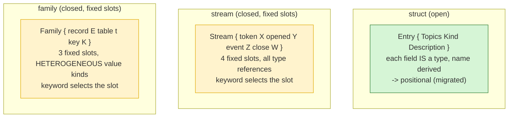

# Streams and families are not structs — the positionalization question, examined

You asked me to get into whether streams and families should be positionalized
like structs. Getting into the code **corrected my earlier framing**: I called it
"a clean follow-on to positionalize." It is not. A *family* especially is not a
struct-of-type-fields — it is a **closed typed record** whose slots hold values
of three different *kinds*. The keyword form is the correct representation for
it, not a migration gap. Here is the full picture, grounded in the code.

## Three kinds of declaration

The schema language has three declaration shapes, and only the first is an open
struct:



A struct's fields are arbitrary and each is a *type* (so the name derives from
the type — the positional rule). A stream's and family's "fields" are a **fixed,
closed set of named slots** chosen by a literal keyword; the keyword is a *slot
selector*, not a derivable field name.

## What a family actually is (code + a live schema)

From the deployed `spirit` `sema.schema`:

```
RecordsFamily (Family { record StoredRecord table records key Domain })
```

The three slots hold three **different kinds** of value:

| Slot | Value here | Kind | A type reference? |
|---|---|---|---|
| `record` | `StoredRecord` | a declared **type** | yes |
| `table`  | `records` | a `TableName(String)` **literal** | **no** |
| `key`    | `Domain` | a `FamilyKey` **enum** variant (`[Domain Identified]`) | **no** |

The reader is a closed keyword switch, not a generic field walker
(`source.rs`, lightly trimmed):

```rust
fn insert(&mut self, field: SourceAtom, value: &Block) -> Result<(), SchemaError> {
    match field.0 {
        "record" => self.record = Some(SourceAtom::from_block(value)?.into_name()),
        "table"  => self.table  = Some(TableName::new(SourceAtom::from_block(value)?.0)),
        "key"    => self.key    = Some(FamilyKey::from_structural_block(value)?),
        other    => return Err(SchemaError::ExpectedSyntaxDeclaration { found: ... }),
    }
}
```

So the `name.Type` differentiator **cannot express a family**:
- `table.records` would mean "a field `table` of type `records`" — but `records`
  is a lowercase table-name literal, not a type (and our new reject would refuse
  it as retired syntax).
- `key.Domain` would mean "type `Domain`" — but `Domain` is a `FamilyKey` enum
  variant, not a declared type.

A family is a **heterogeneous typed record**. The keyword form is the right and
only clean representation. Positionalizing it as type-fields is a category error.

## What a stream is (code)

```
RecordStream (Stream { token SubscriptionToken opened SubscriptionReceipt
                       event RuntimeEvent close SubscriptionToken })
```

Four fixed slots, all type references, closed keyword switch:

```rust
match field.0 {
    "token" => self.token = Some(reference),
    "opened" => self.opened = Some(reference),
    "event" => self.event = Some(reference),
    "close" => self.close = Some(reference),
    other => return Err(...),
}
```

A stream is closer to a struct (all four slots *are* references), and it is the
exact dimensional case from `639`: **`token` and `close` are the same type
(`SubscriptionToken`) in distinct roles.** The current grammar tells them apart
by the literal keyword.

## The reframe: open struct vs closed typed record

The `639` rule — field-name = type-name, no two same-type fields — governs
**structs**: open records where every field *is* a type. Streams and families are
a different construct: **closed typed records** with a fixed, known slot set,
each slot holding a role-specific value (a type, a literal, or an enum). The
keyword is the role; the value is whatever the role needs.

So the apparent inconsistency — structs positional, streams/families keyword — is
a **correct distinction between two constructs**, not an unfinished migration.
This is the dimensional principle's own logic: a closed, heterogeneous record is
not an open type-field struct, and forcing it into the struct grammar loses
information (a family's literal/enum slots have no type to name them by).

## If we wanted streams to look like structs — the three options

Streams are the only borderline case (all-references). For the record:

| Option | Stream form | For | Against |
|---|---|---|---|
| **A. keyword (current)** | `{ token SubscriptionToken … close SubscriptionToken }` | one family with families; readable role labels | not "positional" like structs |
| **B. positional + differentiator** | `{ token.SubscriptionToken … close.SubscriptionToken }` | looks like a struct; reuses the `key.Type` form | families *can't* follow (heterogeneous), so full consistency is still unreachable; pure cosmetic on streams |
| **C. full dimensional** | distinct `OpenToken`/`CloseToken` newtypes, then bare `{ OpenToken … CloseToken }` | most faithful to `639` (roles become types) | real newtype ceremony for a symmetric 2-of-a-kind; the wheaviest change |

## Correcting my earlier framing, and the recommendation

My chat said positionalizing streams/families was "a clean follow-on." The code
shows it is not clean and not uniform: **families cannot be positionalized as
type-fields at all**, so chasing one consistent positional surface across all
three constructs is unreachable. The honest model is that there are **two
constructs**: open structs (positional, migrated) and closed typed records
(streams, families — keyword form, correct as-is).

Recommendation:
- **Families: keep the keyword form. It is correct, not a gap.** No work.
- **Streams: keep the keyword form too** (they belong with families as closed
  records) — my lean. Option B is available if you specifically want streams to
  *read* like structs, but it buys only cosmetics and doesn't generalize to
  families. Option C (distinct token/close types) is the dimensional purist's
  move — defensible, but optional ceremony for a 2-of-a-kind.

Net: there is **no positionalization follow-on owed here**. The structural-forms
epic's struct migration is complete and correct; streams and families are a
recognized second shape, not a loose end. (Spirit recording of `639`/`640`
remains parked while the daemon redeploys.)
