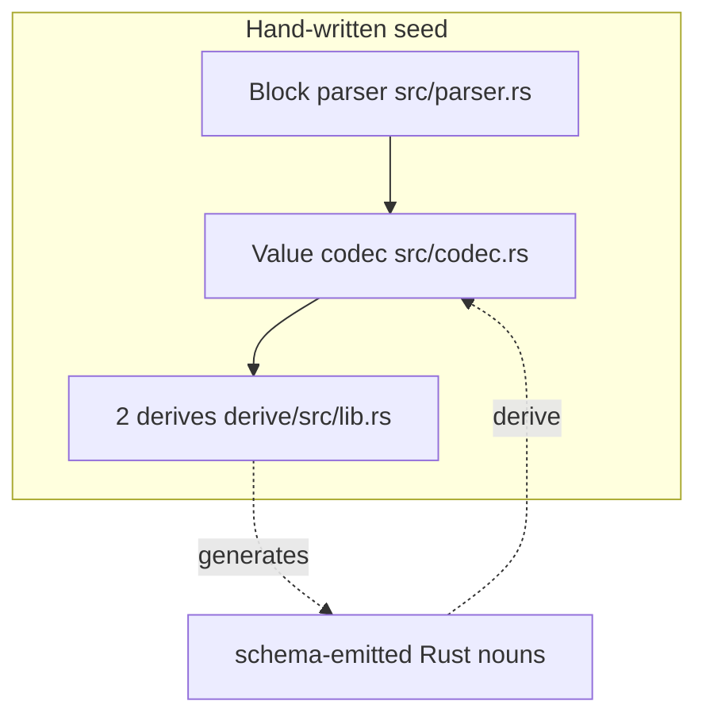
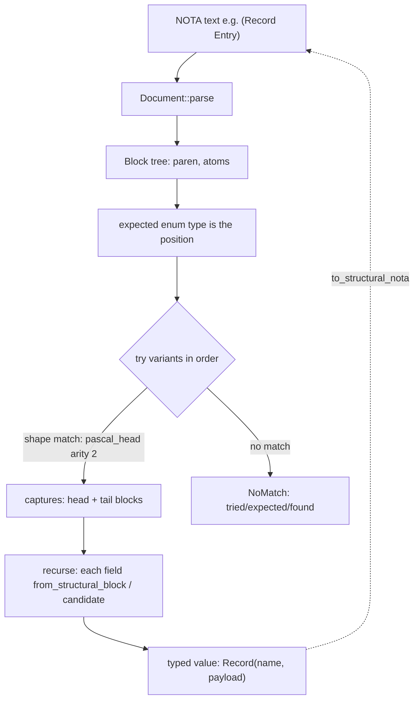

# Layer 1 — NOTA text format + the `StructuralMacroNode` derive

The seed of "a language is data." Repo: `nota-next`
(`/git/github.com/LiGoldragon/nota-next`).

This layer is the hand-authored recursion floor of the whole Spirit
schema-derived stack. It knows delimiters, spans, atoms, and block nesting —
and nothing about schemas, types, declarations, or macros. Everything above it
(schema-next, the generated Spirit nouns) is generated; this floor is where the
hand-writing stops. The crate's own self-summary names the boundary precisely:
"This crate is the hand-authored recursion floor for the schema-derived
stack" (`src/lib.rs:1-7`, VERIFIED).

## The NOTA text format

NOTA text is parsed into a `Document` (an ordered list of root `Block`s) by a
single recursive-descent parser. A `Block` is one of three things
(`src/parser.rs:56-65`, VERIFIED):

| Block kind | Surface forms | Meaning |
|---|---|---|
| `Delimited` | `( )`, `[ ]`, `{ }`, `(| |)`, `{| |}` | recursive object containers |
| `PipeText` | `[| ... |]` | string-safe text leaf, not recursive |
| `Atom` | `Record`, `42`, `pkg:mod:Type`, `-1.5` | indivisible token |

Concrete grammar facts, all VERIFIED from the parser:

- **Atoms** are maximal runs of non-whitespace, non-delimiter characters,
  ended also by a `;;` comment start or a pipe-close sequence
  (`src/parser.rs:781-802`). They are classified post-hoc — not by sigil — into
  `IntegerCandidate` / `DecimalCandidate` / `SymbolCandidate` / `TextCandidate`
  (`src/parser.rs:579-594`). Case is a *query*, not a parse decision:
  `qualifies_as_pascal_case_symbol` = symbol candidate whose first char is
  ASCII uppercase and contains no `-` (`src/parser.rs:546-554`); camel is
  lowercase-leading; kebab contains `-` (`src/parser.rs:556-568`). A scoped
  name like `pkg:mod:Type` is just an atom — `:` and `/` are bare-legal symbol
  characters, never structural.
- **Delimited blocks**: `(` opens a parenthesis, `[` a square bracket, `{` a
  brace. Each closes on its matching char; a stray closer is
  `UnexpectedClose`, an unterminated opener is `UnclosedDelimiter`
  (`src/parser.rs:720-749`). The recursive pipe forms `(|...|)` and `{|...|}`
  are recognized by a two-char lookahead (`( ` then `|`) and close on `|)` /
  `|}` (`src/parser.rs:672-718`). Square gives **vectors**; brace gives
  **maps** (key/value pairs); the pipe-recursive forms exist to give schema
  layers *distinct structural shapes* for enum-like vs struct-like declarations
  without inventing new syntax (INTENT.md:19-27, VERIFIED).
- **Bracket strings**: `[text with spaces]` is just a square block whose atoms
  the codec rejoins with a space; `[|raw text|]` is `PipeText`, the
  string-safe form. Pipe text uses backslash escapes — `\|]` carries a literal
  close marker, `\\` a literal backslash — and is the *only* escape mechanism
  in the format (`src/parser.rs:751-779`, VERIFIED).
- **Comments**: `;;` to end of line, skipped wherever spacing is skipped; a
  single `;` is ordinary atom text (`src/parser.rs:811-832`, VERIFIED).
- **The no-quotation-marks rule** is structural, not stylistic: the parser
  treats `"` like any other bare character (it is *not* in the delimiter set
  `( ) [ ] { }` — `src/parser.rs:898-901`), and on the encode side the format
  function structurally *cannot emit* `"` — it produces a bare atom, an inline
  `[...]`, or a `[|...|]` and nothing else (`src/codec.rs:465-479`, VERIFIED).
- **Positional records, not labeled**: there are no `(key value)` keyword
  pairs. A record is its head atom followed by fields in declared order; the
  derive reads field *N* from child slot *N* by position (see below). This is
  the workspace-wide NOTA rule made concrete in the parser/codec.

## The hand-written SEED vs everything generated

The irreducible hand-written core of the entire stack is small and lives
entirely in this crate:

1. **The block parser** (`src/parser.rs`, ~900 lines) — the only thing that
   turns bytes into structure. One `Parser` struct, recursive descent,
   byte/line/column cursor for diagnostics. Nothing above it re-parses text.
2. **The value codec** (`src/codec.rs`) — `NotaDecode` / `NotaEncode` and the
   body-stream traits, plus hand impls for the primitive and collection shapes
   (`String`, ints, `bool`, `Vec`→square, `BTreeMap`→brace, `Option`→
   `None`/`(Some v)`, `Box<T>`→transparent) (`src/codec.rs:611-976`, VERIFIED).
3. **The two derives** (`derive/src/lib.rs`) — `NotaDecode`/`NotaEncode` for
   ordinary nouns, and `StructuralMacroNode` for the typed-macro enums. These
   are the bridge: above this point, schema-emitted Rust *derives* its codec
   instead of hand-writing it (INTENT.md:67-69; ARCHITECTURE.md:27-44,
   VERIFIED).

Everything else — schema type vocabulary, declaration meaning, what a
parenthesis "means" — is owned by higher layers. The crate's stated boundary:
"This crate does not know what a schema type, field, declaration, enum, macro,
or import means" (ARCHITECTURE.md:98-102, VERIFIED).



## `BlockShape` / `AtomCase`: the runtime grammar primitives

`BlockShape` is the ergonomic per-variant grammar vocabulary; it lowers to a
lower-level `Pattern` of `PatternElement`s that actually match a block sequence.
`AtomCase` is the case predicate an atom shape carries.

```rust
// src/macros.rs:194-199  (VERIFIED)
pub enum BlockShape {
    Any(Option<CaptureName>),
    Atom(AtomShape),         // case + optional sigil + capture
    Delimited(DelimitedShape), // delimiter + object_count + recursive children
    Literal(String),         // exact bare-atom text
}
// src/macros.rs:709-714
pub enum AtomCase { Symbol, PascalCase, CamelCase, KebabCase }
```

Matching is grammar-as-parser: a `Pattern` walks its elements against a
`&[&Block]` slice, each element either consuming one block or (for `Rest`)
capturing the tail (`src/macros.rs:326-350`). `AtomShape::matches_atom`
defers to the *same* `qualifies_as_*` predicates the parser exposes
(`src/macros.rs:680-695` → `AtomCase::matches`, `src/macros.rs:716-725`). The
grammar IS the parser, and the chosen variant IS the decoded type — there is no
separate parse tree to walk. A delimited shape can carry a recursive child
`Pattern`, so a headed parenthesis like `(Head ...)` is expressed as
`Literal("Head")` + `Rest("arguments")` inside a parenthesis shape
(`src/macros.rs:238-262`, VERIFIED).

Captured material is one of `Block` / `Blocks` / `Body` — and crucially a
delimited capture exposes the matched block's inner `NotaBody`, *not* the
wrapper delimiter, so the next semantic step always receives body contents
(`src/macros.rs:856-862`; ARCHITECTURE.md:68-71, VERIFIED).

## The `StructuralMacroNode` derive: the shape vocabulary

`#[derive(StructuralMacroNode)]` works on an **enum** only. Each variant carries
a `#[shape(...)]` attribute; the derive emits (a) the ordered
`StructuralVariant` list, (b) a *direct* recursive decode arm per variant, and
(c) a reverse encode arm — turning the enum type itself into the grammar
specification. The shape vocabulary is exactly seven cases
(`StructuralVariantShape`, `derive/src/lib.rs:928-936`, VERIFIED):

| Shape attr | NOTA it matches | Fields | Direct match condition (`derive/src/lib.rs:1156-1197`) |
|---|---|---|---|
| `pascal_atom` | bare PascalCase atom `Entry` | 1 | `qualifies_as_pascal_case_symbol()` |
| `keyword = "opens"` | bare literal atom `opens` | 0 | `demote_to_string() == Some("opens")` |
| `head = "Vec", arity = N` | `(Vec a b…)` literal head, N objects | N−1 | paren ∧ count==N ∧ child0==head |
| `head = "Bytes", atom` | `(Bytes hex)` literal head, leaf via `FromStr` | 1 | paren ∧ count==2 ∧ child0==head |
| `head = "Variants", body` | `(Variants …)` literal head, any tail | 1 | paren ∧ child0==head |
| `pascal_head, arity = N` | `(Record A B)` PascalCase head, N objects | N | paren ∧ count==N ∧ child0 is Pascal |
| `pascal_head, body` | `(SomeHead …)` PascalCase head, any tail | 2 | paren ∧ child0 is Pascal |

Field-count is validated against the shape at derive time
(`derive/src/lib.rs:1056-1073`, VERIFIED), so a mismatch is a compile error.

Decode and encode are mirror images:

- **`pascal_atom`** decodes its one field by handing the whole atom block back
  to the field type's own `from_structural_block` — so the leaf is itself a
  structural node, recursively (`derive/src/lib.rs:1207`). Encode just
  re-emits the field (`:1256-1259`).
- **`keyword`** carries no fields and matches a bare literal; an inner marker
  atom can therefore *be its own* recursively-decoded structural node,
  discriminating sibling forms with zero variant-name string comparison in
  hand code (INTENT.md:108-117). The test `DerivedRelationKeyword`
  (`opens`/`belongs`) is decoded as the 3rd slot of a `pascal_head, arity = 4`
  `Streaming` variant — a node nested inside a node (`tests/macro_nodes.rs:
  612-633`, VERIFIED).
- **`head + arity` / `pascal_head + arity`** decode each tail object by position
  into the matching field type, recursively (`derive/src/lib.rs:889-907,
  1218-1250`). `pascal_head` additionally decodes child0 as a typed head field.
- **`head + atom`** is the one leaf escape: the single child atom is decoded via
  `FromStr`, not `from_structural_block` — for primitives like a hex
  `ByteSequence` (`derive/src/lib.rs:866-887`).
- **`body` shapes** (`head + body`, `pascal_head + body`) hand the headed tail
  (objects after child0) as a *multi-block candidate* to the field type's
  `from_structural_candidate`. So `(Variants Alpha Beta Gamma)` decodes into a
  `Vec<DerivedTypeName>` through the blanket `Vec` node impl
  (`src/macros.rs:1338-1368`), and `(Record a b c d)` decodes through the
  payload type's own ordered body read (ARCHITECTURE.md:38-44;
  `tests/macro_nodes.rs:696-716`, VERIFIED).

Two structural blanket impls make recursion compositional: `Box<Inner>`
forwards transparently (`src/macros.rs:1310-1333`) and `Vec<Item>` reads a
candidate's whole block sequence as ordered items
(`src/macros.rs:1338-1368`, VERIFIED).

**Reachability validation, not first-wins-silently.** A `StructuralVariantSet`
tries variants in declaration order (`src/macros.rs:469-490`) but rejects
*silent* conflicts at construction: a general `pascal_head` parenthesis variant
that would make a later same-arity literal-headed variant unreachable is a
`Conflict` error (`src/macros.rs:492-506`, `ParenthesizedHeadShape::
silently_shadows`, `src/macros.rs:900-921`, VERIFIED). This is the one place
the grammar enforces that an authored ordering is *honest*.

Named-field struct variants are explicitly **not** supported by the structural
derive — variants must carry unnamed fields (`derive/src/lib.rs:760-766`). The
positional, type-prominent body shape *is* the named-field replacement: a
struct's fields are the body objects in declared order, read by the codec
derive's `from_body_objects` (`derive/src/lib.rs:199-231`). The `#[nota(name =
"...")]` field attribute lets a known-root field receive a name from the root
shape while still living in a positional slot (`derive/src/lib.rs:337-345`,
`NotaNamedBodyFieldDecode`).

## End-to-end pipeline: NOTA text → typed value



The defining inversion (INTENT.md:88-94, VERIFIED): **the expected type decides
the parse.** There is no global parser registry and no consumer-managed
dispatch table. A caller asks the codec for a known enum type; that enum tries
its ordered structural variants; only after a structural match is selected are
the captures decoded into domain data; and the same type encodes back to the
structural NOTA surface — so schema sugar stays *specialized NOTA* rather than a
one-way lowering language. The low-level `MacroRegistry` / `MacroMatch` remain
only as an exploration and diagnostics surface, no longer the typed-node hook
(`src/macros.rs:990-1085`; ARCHITECTURE.md:87-96, VERIFIED).
