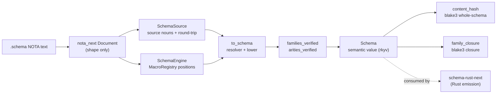
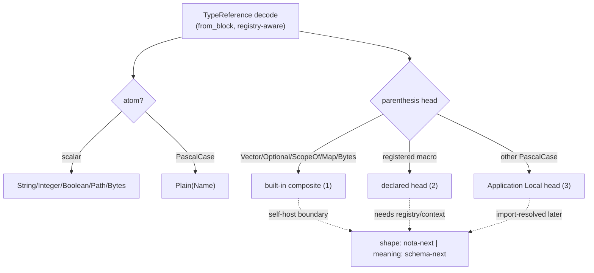

# Layer 2 — Schema Type Model + Source Codec (`schema-next`)

Repo: `/git/github.com/LiGoldragon/schema-next`. This layer is the typed
semantic schema data model plus the source codec that lowers NOTA `.schema`
text into it. Per its INTENT (`INTENT.md:3-4`) the crate is "the schema macro
engine and typed semantic schema data model for the schema-derived stack" and
crucially **"does not emit Rust source code"** — Rust emission lives one layer
up, in `schema-rust-next`. The whole crate's job is text-to-typed-value plus a
content identity over that value.

## What the model IS

The semantic model is a single archivable Rust value, `Schema`
(`schema.rs:368-379`), holding nine typed sections: a `SchemaIdentity`
(component name + authored version string), declared `imports`,
`resolved_imports`, an `input` `Root`, an `output` `Root`, a `Vec<Declaration>`
namespace, plus `streams`, `families`, and `relations`. The two roots are
heterogeneous product positions, not a homogeneous vector (`ARCHITECTURE.md:430-433`).

| Type | What it is | Where |
|---|---|---|
| `Schema` | The whole semantic value; rkyv-archivable, no text/store wrapper | `schema.rs:368` |
| `SchemaIdentity` | Component name + hand-authored version string | `engine.rs:27` |
| `Root` | A sum: `Enum(EnumDeclaration)` (the `[Variant …]` body) or `Application(Box<RootApplication>)` (the `(Head Arg …)` typed-sum form) | `schema.rs:269-280` |
| `Declaration` | Visibility-tagged: `visibility` + `name` + `parameters` + `TypeDeclaration` | `schema.rs:821-826` |
| `TypeDeclaration` | `Struct \| Enum \| Newtype` | `schema.rs:892` |
| `TypeReference` | The reference-position grammar leaf/composite (see below) | `schema.rs:1443` |
| `Name` | Newtype over `String`; colon-segmented; PascalCase / symbol classification | `schema.rs:14-15` |
| `StreamDeclaration` / `FamilyDeclaration` | Schema metadata, excluded from the namespace type vector | `schema.rs:1171`, `:1276` |

`Name` is the identity-bearing primitive (`schema.rs:14-70`). It carries
colon-namespaced segments (`namespace_segments`, `local_part`), derives Rust
field names by snake-casing the local part (`field_name`, `:37-52`), and
gates the generic-application form via `qualifies_as_pascal_case` (`:62-69`).
Names emit through their own NOTA codec — a symbol-safe name is written bare
(`Entry`, `schema:spirit:Entry`), only non-symbol names fall back to bracket
string text (`NotaEncode for Name`, `:78-86`).

`TypeReference` (`schema.rs:1443-1463`) is the closed reference grammar:
reserved scalar leaves `String | Integer | Boolean | Path | Bytes`,
`FixedBytes(u64)`, the declared-name leaf `Plain(Name)`, the composites
`Vector | Optional | ScopeOf | Map` (each a single canonical head spelling —
the old `Vec` / `Option` / `Scope` / `KeyValue` aliases no longer parse,
`:1426-1428`), and the open `Application { head: ApplicationHead, arguments }`
form for any other PascalCase head. The reserved scalars cannot be redeclared
or shadowed (`is_reserved_scalar_name`, `:1688`; rejected in
`lower_key_value_declarations`, `engine.rs:819-823`).

## The source codec: NOTA text -> typed `Schema`

There are two layered codecs, and understanding their division is the key to
this layer.

`SchemaSource` (`source.rs:21-27`) is the **authored-source** typed value:
imports, input/output roots, namespace, relations — read out of a parsed
`nota_next::Document` (`from_document`, `:35-100`) into source-language nouns
(`SourceImports`, `SourceRootEnum`, `SourceNamespace`, `SourceDeclarationValue`,
`SourceStructBody`, `SourceEnumBody`, `SourceVariantSignature`, `SourceReference`).
It round-trips: `to_schema_text` (`:130-141`) writes one canonical `.schema`
projection back out, and `SchemaSourceArtifact` (`source.rs:192-235`) owns both
the `.schema` text file IO and the rkyv archive boundary for the source value.
Source text is a *projection of a typed object*, not a string handed to later
stages (`ARCHITECTURE.md:38-48`).

`SchemaSource::to_schema` (`source.rs:161-188`) lowers the source value into
the semantic `Schema`: it builds a `SourceTypeResolver`, lowers the namespace,
pushes the public inline declarations the root headers introduce, collects
streams and families, lowers the two roots, then runs `families_verified()` and
`arities_verified()` before the `Schema` is returned. The `SchemaEngine`
(`engine.rs:294-510`) is the alternative entry that lowers straight from a
`Document` through a `MacroRegistry` of position-aware handlers — both paths
end in the same `Schema::new(...).families_verified().arities_verified()`
(`engine.rs:430-443`, `source.rs:175-188`).

### Positional struct bodies, families, streams

Struct bodies are positional NOTA brace maps of field-name -> reference pairs
(`SourceStructBody::from_block`, `source.rs:1222-1234`). A field value is one
of three shapes (`SourceFieldValue`, `:1433-1437`): `Derived` (the bare `*`,
field name derived from an already-declared type, `:1441-1443`), a
`Reference`, or an inline `Declaration`. A body lowering to exactly one field
collapses to `Newtype`, two-or-more stays `Struct`
(`to_declaration_group_with_visibility`, `:1275-1280`; same rule in
`MacroExpansionStructBody::lower_type`, `declarative.rs:1710-1721`). Inline
PascalCase field declarations lower as private module-local helpers; root-inline
fields are exported public (`ARCHITECTURE.md:337-342`).

Families and streams are **keyword readers** inside the namespace map, not
namespace types. A stream is `StreamName (Stream { token … opened … event …
close … })` and a family is `FamilyName (Family { record … table … key
Domain|Identified })` (`SourceStreamBody`/`SourceFamilyBody`,
`source.rs:930-1000`, `:1078-1136`). Their fields are read by keyword
(`SourceStreamFields::insert`, `:1036-1053`; `SourceFamilyFields::insert`,
`:1169-1183`), `FamilyKey` decodes as a structural keyword node
(`schema.rs:1252-1257`), and both lower onto `Schema::streams()` /
`Schema::families()`, excluded from the type namespace. In the engine path a
`NamespaceMetadataProbe`/`MetadataDefinitionProbe` (`engine.rs:885-941`)
diverts these `(Stream …)` / `(Family …)` entries away from type lowering.
`families_verified` (`schema.rs:477-496`) then confirms each family's record
resolves to a namespace type, a root enum, or an import.

### Generics

A declaration head may be parameterized: `(Name Param …)` decodes through the
same `#[shape(pascal_head, body)]` seam as the application form
(`DeclarationHead::from_block` / `from_parameterized`, `schema.rs:1382-1415`),
lifting each tail item as a binder `Name`. The binders attach to the finished
`Declaration` (`with_parameters`, `:852`). `arities_verified`
(`schema.rs:552-630`) walks every reference and, when an `Application` head
resolves to a declared parameterized type, requires exact arity
(`GenericArityMismatch` otherwise) — at lowering time, not deferred to the
emitter (decision O8).

## TypeReference: one codec, two faces, and the self-host boundary

`TypeReference` carries two distinct NOTA projections, and the difference is
load-bearing:

- A **canonical machine codec** (`NotaDecode`/`NotaEncode`, `schema.rs:1495-1586`):
  fully self-describing, e.g. `(Plain Topic)`, `(Application (Foo (A B)))` —
  the unambiguous archive/wire form.
- A **source-grammar projection** (`StructuralMacroNode::to_structural_nota` /
  `from_structural_block`, `:1597-1667`): the human form — a bare PascalCase
  atom for a leaf (`Topic`), a headed parenthesis for composites
  (`(Vector Topic)`, `(Foo A B)`).

The source-side decode (`from_block` / `from_parenthesis_objects`,
`:1795-1961`) is where the **self-host boundary** lives. Decode is
**registry/context-aware**: dispatch ORDER is the grammar's disambiguation and
is *deliberately not compiler-checked* (the broad application form structurally
overlaps every PascalCase head), so the ordering is stated in code and pinned
by tests (`:1889-1904`):

1. canonical built-in heads `(Vector T)` / `(Optional T)` / `(ScopeOf T)` /
   `(Map K V)` / `(Bytes N)` — direct fast path,
2. a **declared head** — a registered user `TypeReference` macro — consulted
   against the `MacroRegistry` next, winning over the broad form,
3. the broad application form `(Foo A B …)` via the `ApplicationNode`
   structural seam — the fallback (`from_macro_or_application`, `:1971-1982`).

This is the permanent shape-vs-meaning boundary: nota-next decides *shape*
(what delimiters/atoms a block is); schema-next decides *meaning* at a position
(which head is a built-in, which is a registered macro, which is a plain
application) — and that meaning needs the registry/context, so a top-level
decode cannot be a pure context-free function. At decode time the head is
always `ApplicationHead::Local(Name)`; import resolution later rewrites it to
`Imported` once the closure walk proves the name is an import
(`schema.rs:1294-1328`, walk at `identity.rs:401-407`).

## The IDENTITY hash — the correctness anchor

Per Spirit `wrjl` (Decision) the schema is content-addressable: its hash is its
identity, and any edit changes the address, which is the version
(`INTENT.md:97-107`). `identity.rs` computes this over the **semantic value's
canonical rkyv bytes, never `.schema` text** — so formatting-only source edits
(whitespace, comments) leave the address unmoved (`identity.rs:51-55`,
`:176-179`). This is semantic losslessness: a syntax change that preserves
meaning is hash-stable.

Two domains, each domain-separated by its own blake3 `derive_key` context
string (`HashDomain::context`, `identity.rs:42-49`) so the two kinds can never
collide (Spirit `x0ja`, one cryptographic basis: blake3, `INTENT.md:109-114`):

- `Schema::content_hash` (`identity.rs:162-165`) — blake3 over the whole
  schema's rkyv bytes. Covers the *full* value including `SchemaIdentity` and
  resolved imports, so it is **not** a pure-structure address.
- `FamilyClosure::content_hash` (`identity.rs:151-155`) — blake3 over the rkyv
  bytes of the transitive declaration closure of one named family
  (`Schema::family_closure`, `:171-173`). The `ClosureWalk` (`:180-450`) gathers
  the root declaration plus everything reachable *from* it (struct fields,
  variant payloads, newtype/alias targets, collection inners, stream relations),
  each group sorted canonically by name so closure bytes don't depend on walk
  order. Imports contribute only their stable identity, not the dependency's
  declarations. Family hashes ARE pure-structure addresses.

Coverage boundary worth noting (`identity.rs:9-19`): relation declarations
point *at* declarations rather than being reachable *from* them, so a relation
edit moves only the whole-schema hash, never a family hash. The family hash is
what the version-control / migration layer (consumed downstream) reads to detect
schema-address mismatches and derive migrations (Spirit `wrjl`,
`INTENT.md:116-129`).

## Pipeline

## Notable

- The crate is the schema *brain* but emits no Rust — Rust emission is
  `schema-rust-next` (`INTENT.md:3-4`). The downstream consumer of the identity
  hash is the version-control / migration layer.
- Two `TypeReference` projections (canonical machine codec vs source-grammar
  structural projection) are intentional and distinct (`schema.rs:1588-1596`).
- Parenthesis dispatch order is grammar disambiguation that the compiler cannot
  check; it is pinned only by tests (`schema.rs:1889-1904`). That is a real
  fragility surface.
- The hash `derive_key` context strings are date-stamped literals
  (`"schema-next 2026-06-12 …"`, `identity.rs:45-46`); editing those strings
  silently re-addresses every schema, so they are effectively a frozen
  constant.
- The whole-schema hash is NOT pure structure (it folds in `SchemaIdentity` +
  resolved imports); only family-closure hashes are pure-structure addresses
  (`identity.rs:14-19`, `ARCHITECTURE.md:176-183`).
- Asschema is fully retired — no `.asschema` text/rkyv, no `AsschemaArtifact`,
  no schema store in this crate (`INTENT.md:73-80`, `ARCHITECTURE.md:142-151`).
- An open self-host tension: per Spirit `v0n6`, the surviving hand-parsing
  sites (the schema-next macro library) are design violations to fix, not
  acceptable code; everything reading NOTA-shaped structure above the raw parser
  should go through typed structural macro nodes (`INTENT.md:88-95`).
