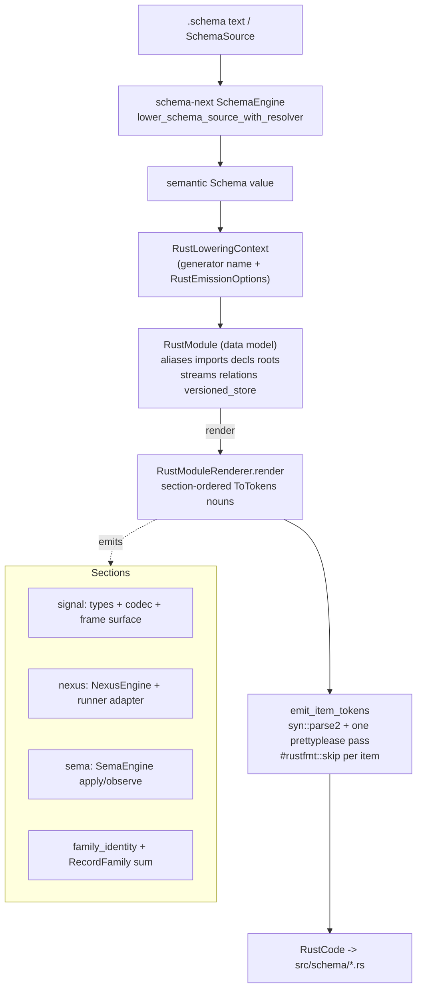
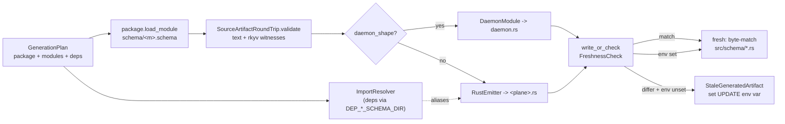

# Layer 3 — Rust emission + the build driver (`schema-rust-next`)

This layer turns the typed semantic `Schema` value (Layer 2, `schema-next`)
into **source-visible Rust** under each component's `src/schema/`, and owns the
shared build-driver orchestrator that every triad `build.rs` runs. It is the
seam where the schema engine stops being abstract data and becomes the concrete
Rust types, codecs, engine traits, and daemon skeleton the runtime layers
implement against.

Repo: `/git/github.com/LiGoldragon/schema-rust-next` (version 0.5.3, edition
2024). Three source files: `src/lib.rs` (6818 lines, the emitter),
`src/build.rs` (716 lines, the driver), `src/daemon_emit.rs` (2202 lines, the
`triad_main!` daemon emitter), plus `src/migration.rs` (upgrade modules).

## What the psyche wants it to be

Per `INTENT.md`: Rust emission is a **separate step from macros** — schema
generates Rust *first*, into the consumer's source tree, not hidden in
`OUT_DIR` or behind compiler-macro expansion. Generated interfaces are
reviewable, committed, and freshness-checked. Schema-generated objects are the
Rust nouns that **carry behavior** (Signal/Nexus/SEMA roots become enums;
engines implement generated traits with one method per reaction variant). The
emitter does not define schema semantics — `schema-next` owns that, and
`schema-rust-next` must not be depended on by it, which is exactly why the
lowering trait lives here and is implemented *for* `schema_next::Schema`
(`INTENT.md:87-94`).

## How a Schema becomes Rust: the lowering + render pipeline

Two trait facades drive emission, both implemented for upstream types so the
schema object owns its own lowering:

| Trait | Implemented for | Entry method | File:line |
|---|---|---|---|
| `RustSchemaLowering` | `schema_next::Schema` | `lower_to_rust_file/code/module` | `lib.rs:121` |
| `RustSchemaSourceLowering` | `schema_next::SchemaSource` | `lower_to_rust_file/module` | `lib.rs:158` |
| `LowerToRust<Target>` | every schema subobject | `lower_to_rust(&context)` | `lib.rs:212` |

The source path (`SchemaSource::lower_to_rust_module`, `lib.rs:173`) asks
`SchemaEngine::lower_schema_source_with_resolver` to produce the semantic
`Schema`, then defers to the semantic path. The semantic path builds a
`RustLoweringContext` (`lib.rs:186`, carrying only generator name + emission
options — the contextual switches, never duplicated into nouns) and recursively
asks each schema subobject to project itself into a **Rust-model noun**:
`Declaration → RustDeclaration` (`lib.rs:981`),
`TypeDeclaration → {RustStruct, RustEnum, RustNewtype}` (`lib.rs:1004`),
`EnumVariant → RustEnumVariant`, etc. The result is `RustModule` (`lib.rs:216`)
— a pure data model (scalar aliases, imports, declarations, root enums, applied
roots, streams, relations, versioned store, support metadata) that holds **no
rendered text**.

`RustModule::render` (`lib.rs:280`) is the deterministic section pipeline. It
constructs a `RustModuleRenderer` (`lib.rs:4608`), notes map-key and private
type names, writes the one literal text line (`// @generated by …`, the only
string the renderer emits because `prettyplease` drops non-doc comments), then
walks sections in fixed order: scalar aliases → bytes/fixed-bytes scalars →
imports → NOTA support → declarations → root enums → applied roots → newtype
inherent impls → enum variant constructors → enum payload `From` impls → NOTA
root-enum support → domain-scope relation support → **record-family support** →
short headers → **signal-frame codec + transport** → runtime support
(plane routes, trace, mail events, plane namespaces, plane projections, runtime
role-trait impls, schema-plane trait support, upgrade support). Each section is
a data-bearing `ToTokens` noun routed through `emit_item_tokens`
(`lib.rs:4903`), which `syn::parse2`s the tokens and runs one `prettyplease`
pass, prepending `#[rustfmt::skip]` to each top-level item
(`RustfmtSkippedItems`, `lib.rs:34`). **No `format!`/`self.line` Rust source is
built anywhere** — the string-emitter migration is complete (VERIFIED:
`lib.rs:284` is the sole `writer.line(...)` and it writes only the header
comment).

### Emission targets select which planes/sections emit

`RustEmissionTarget` (`lib.rs:495`) is the policy knob, paired with
`NotaSurface` inside `RustEmissionOptions` (`lib.rs:431`). The target maps to a
`RuntimePlaneSet` (`lib.rs:533`) and two predicates — `emits_wire_frame`
(`lib.rs:526`) and `emits_runtime_support`:

| Target | Planes | Wire frame codec | Used by |
|---|---|---|---|
| `DeclarationModule` | none | no | `signal-spirit`'s `domain` module |
| `WireContract` | none | **yes** (the wire IS the framing) | `signal-*` / `meta-signal-*` `lib` |
| `SignalRuntime` | signal only | yes | daemon-local `signal` module |
| `NexusRuntime` | nexus only | no (internal plane) | daemon `nexus.schema` |
| `SemaRuntime` | sema only | no | daemon `sema.schema` |
| `ComponentRuntime` | all three | yes | unsplit bootstrap schemas |

`Plane` (`lib.rs:636`) owns *only* plane-intrinsic names (module `signal`,
wrapper `Signal`, engine trait `SignalEngine`, trace enum `SignalObjectName`,
aliases `Input/Output`, `Work/Action`, `WriteInput/.../ReadOutput`). Target
selection and schema-presence checks deliberately stay off `Plane`
(`ARCHITECTURE.md:51-56`).

### Types, derives, NOTA, rkyv, engine traits

Every emitted data type gets a uniform derive block from
`RustRenderContext::derive_attributes_with_nota` (`lib.rs:1326`): always
`rkyv::Archive/Serialize/Deserialize`, `Clone`, `Debug`, `PartialEq`, `Eq`;
conditionally `Copy` (unit-only enums), `PartialOrd/Ord` plus a matching
`#[rkyv(derive(...))]` when the type is used as a `BTreeMap` key (decided by
`CollectionScan`, `lib.rs:4369`). NOTA codecs are **opt-in per target**: under
`NotaSurface::FeatureGated { feature }` the derive is wrapped in
`#[cfg_attr(feature = …, derive(nota_next::NotaDecode, nota_next::NotaEncode))]`
(`lib.rs:1333`); `Disabled` strips all `nota_next` references so a binary-only
daemon carries no `nota-next` in its dependency closure (`INTENT.md:130-136`).
Collections lower predictably: `(Vec T) → Vec<T>`, `(Map K V) →
std::collections::BTreeMap<K, V>` (fully qualified, ordered for deterministic
rkyv/NOTA), `(Optional T) → Option<T>` (`lib.rs:6730`).

Behavior lives on generated traits, async at the engine boundary:
- `NexusEngine` (`NexusEngineTraitTokens`, `lib.rs:2508`): `execute` returns a
  `Future`; when an exhaustive runner shape is present, generated SEMA/effect
  hooks (`apply_sema_write`, `observe_sema_read`, `run_effect`) are awaitable
  and `execute` drives `triad_runtime::Runner::drive(...).await` via a
  `NexusRunnerAdapter` (`lib.rs:2602-2609`). Trace hooks bracket exactly one
  entered/decided pair.
- `SemaEngine` (`SemaEngineTraitTokens`, `lib.rs:2663`): write and read halves
  emit independently — `apply`/`apply_inner` only when a write pair exists,
  `observe`/`observe_inner` only when a read pair exists — so a read-only SEMA
  schema still gets `observe`.

### The wire request/reply surface (WireContract / SignalRuntime)

`SignalFrameTransportSupportTokens` (`lib.rs:2042`) emits the universal
signal-frame surface the whole ecosystem speaks: `impl RequestPayload for
Input`, `SignalOperationHeads` (the `HEADS` route-name table), `LogVariant`,
the `Frame`/`FrameBody` aliases, `Request`, `ReplyEnvelope`, `RequestBuilder`,
plus `Input::into_frame` and `Output::into_reply_frame`. Streaming is the
semantic-stream extension: only when `Schema::streams()` is non-empty *and* the
stream event type matches `Output.Event` does `Frame` become
`signal_frame::StreamingFrame<Input, Output, Event>` and the event payload gain
`into_subscription_frame` (`lib.rs:2063-2074`, `INTENT.md:20-26`). A bare
`Output.Event` name is not enough — this reads schema-next stream metadata, not
names.

## The family-identity emission (typed SchemaHash consts)

When a schema declares record families, lowering builds a `RustVersionedStore`
(`lib.rs:853`): store name = the schema identity's component name; one
`RustRecordFamily` per declaration. Each family's identity is computed **at
generation time** as `*self.family_closure(record).content_hash().as_bytes()` —
the blake3 hash of the family record's schema closure (`lib.rs:880-887`;
`family_closure`/`content_hash` are upstream `schema-next` API, INFERRED to be
the closure-walk + rkyv-archive-hash). Emission produces three nouns:

1. `FamilyIdentityModuleTokens` (`lib.rs:4236`) — a `family_identity` module
   with one `pub const <SCREAMING>: [u8; 32] = [...]` per family, on the
   `short_header` constant-module precedent.
2. `RecordFamilyError` (`lib.rs:5227`) — typed `UnknownFamily` /
   `SchemaHashMismatch` / `RecordDecode`; **never a fallback**.
3. `RecordFamilyEnumTokens` (`lib.rs:4272`) — the closed `RecordFamily` sum,
   one variant per family carrying the record type, with `STORE_NAME`,
   `versioning_policy()`, a snake_case per-family descriptor constructor
   returning `sema_engine::TableDescriptor<R>` (Domain key) or
   `IdentifiedTableDescriptor<R>` (Identified key), and
   `decode(&FamilyIdentity, &[u8])` that dispatches on family name, rejects
   schema-hash drift (`identity.schema_hash() != generated` → typed error,
   `lib.rs:4317`), and rkyv-decodes the payload.

Because the 32-byte constants are part of the committed generated artifact, any
schema edit that moves a family closure makes the regenerated file differ from
the checked-in one and **fails the freshness gate** until regeneration — no new
machinery needed (`INTENT.md:146-168`, `ARCHITECTURE.md:266-288`). Generated
paths reference the real `sema_engine` crate, so declaring families adds
`sema-engine` to the consumer's dependencies. (VERIFIED end-to-end across
`lib.rs:872-948`, `4246-4365`, `5221-5254`.)

## The build driver: load → lower → emit → freshness-check

`build.rs` is the shared orchestrator. A component declares a `GenerationPlan`
(`build.rs:16`) naming the `SchemaPackage` (root, crate name, version), a list
of `ModuleEmission`s (each selecting a target and optional daemon shape), and
`DependencySchema` entries. `GenerationDriver::generate` (`build.rs:320`) folds
the dependencies into an `ImportResolver` (`build.rs:101`) and, per module,
builds a `GeneratedModule::from_emission` (`build.rs:516`):

1. `package.load_module(...)` reads `schema/<module>.schema`.
2. `source.to_schema_source()` decodes typed schema source.
3. `SourceArtifactRoundTrip::validate` (`build.rs:576`) — the source artifact's
   `.schema` text projection is re-parsed and the rkyv archive is round-tripped
   as **internal codec witnesses**; mismatch is a typed `BuildError`. (Note:
   the source artifact is *not* a generated output; the driver writes/checks
   only the Rust file — `INTENT.md:76-78`, `ARCHITECTURE.md:237-243`.)
4. If the emission carries a `NexusDaemonShape`, the schema is lowered with the
   resolver and `DaemonModule` emits `src/schema/daemon.rs`; otherwise
   `RustEmitter::emit_file_from_schema_source` emits the plane module.

`GeneratedPackage::write_or_check` (`build.rs:479`) runs the freshness gate.
`FreshnessCheck::from_environment` (`build.rs:671`) reads the component-specific
update env var (e.g. `SPIRIT_UPDATE_SCHEMA_ARTIFACTS`); if set, the file is
written, otherwise `GeneratedArtifact::matches_existing` compares byte-for-byte
against the working tree and a mismatch is `BuildError::StaleGeneratedArtifact`
naming the env var to set (`build.rs:618-630`).

### Cross-crate imports + the Cargo schema seam

`CargoSchemaMetadata` (`build.rs:262`) owns both sides. A contract crate calls
`emit_schema_directory` to print `cargo::metadata=schema-dir=…/schema`
(`build.rs:274`); a consumer reads `DEP_<LINKS>_SCHEMA_DIR`
(`schema_directory_variable`, `build.rs:287`; links name uppercased with `-`→`_`)
via `DependencySchema::from_cargo_metadata` (`build.rs:227`) and registers it on
the `ImportResolver`. The emitter then writes `pub use crate::schema::… as …`
aliases rather than re-declaring imported types (`ARCHITECTURE.md:256-261`).
`ContractCrateBuild` (`build.rs:338`) is the canned `signal-*`/`meta-signal-*`
driver: `WireContract` target on `lib`, freshness-check `src/schema/lib.rs`,
publish `schema/`.

Concrete consumer (VERIFIED, `spirit/build.rs`): the spirit triad runs
`GenerationPlan::new("spirit", "0.3.0")` with `signal-spirit` +
`meta-signal-spirit` dependency schemas, `ModuleEmission::nexus_runtime()`,
`sema_runtime()`, and `daemon_module("nexus", daemon_shape())` —
`signal-spirit/build.rs` uses `declaration_module("domain")` +
`wire_contract_module("signal")`; `meta-signal-spirit/build.rs` imports
`signal-spirit`'s schema dir and emits `wire_contract_module("meta-signal")`.

## Daemon-shape emission (`NexusDaemonShape → daemon.rs`)

`daemon_emit.rs` is the `triad_main!` emitter (designer report 542): OFF by
default, ON only when a `ModuleEmission::daemon_module` carries a
`NexusDaemonShape` (`daemon_emit.rs:43`). The shape carries what is *not*
derivable from the wire contract: the OS `process_name`, the
`WorkingListenerTier` (local `crate::schema::<module>`, a dependency path like
`signal_cloud::schema::lib`, or the `component_decoded()` relation-adapter
escape hatch), and optional `MetaListenerTier` / `UpgradeListenerTier` (each
with an owner-only `SocketModeBits`, e.g. `0o600`) and `TcpListenerTier`.

`DaemonModuleBody` (`daemon_emit.rs:330`) composes nine `ToTokens` sections:
imports, the `ComponentDaemon` hook trait (the "1488" escape hatches the
component hand-writes), `DaemonCommand` argv parsing, the `ListenerTier`
identity enum (emitted only for multi-listener shapes, `daemon_emit.rs:841`),
the `DaemonBinder`, the working transport, subscription support, the
`GeneratedDaemonRuntime`, `DaemonError`, and the `ExitReport`-based
`DaemonEntry`. Listener selection is async task-backed (`INTENT.md:28-47`):
- Working-only → `AsyncSingleListenerDaemon<GeneratedDaemonRuntime<Self>>` over
  `AsyncConnectionRuntime` (`daemon_emit.rs:931`, `1555`).
- Working + meta/upgrade → `AsyncMultiListenerDaemon<…>` over
  `AsyncMultiConnectionRuntime` with the generated `ListenerTier` enum
  (`daemon_emit.rs:921`, `1534`); meta/upgrade sockets are pushed with
  `with_socket_mode(SocketMode::new(0o…))` (`daemon_emit.rs:944`, `961`).
- An optional TCP ingress wraps the local daemon in a generated
  `GeneratedSingle/MultiAndTcpDaemon` pair (`daemon_emit.rs:1036`).

`GeneratedDaemonRuntime::handle_connection` IS the async
decode→execute→encode spine (`daemon_emit.rs:1587-1606`); the engine is owned
behind a kameo `EngineActor` so every request crosses a mailbox
(`daemon_emit.rs:1479-1484`), except the `component_decoded` tier which keeps
the engine shared behind `&self` and hands the raw `AcceptedConnection` to a
component hook. The retired synchronous `{Single,Multi}ListenerDaemon` and raw
`UnixStream` daemon surfaces are gone (`INTENT.md:33-36`). The meta and upgrade
branches remain `AcceptedConnection` escape hatches until the shape names a
meta/upgrade contract path (`ARCHITECTURE.md:96-100`).

## Notable / tensions / self-host boundaries

- **Direction of dependency is inverted on purpose.** `schema-next` (semantics)
  must not depend on `schema-rust-next` (Rust emission), so the lowering trait
  lives here and is implemented *for* upstream types. The recursive
  `LowerToRust<Target>` projection means schema meaning is never reassembled in
  a central adapter (`INTENT.md:87-94`).
- **The generated artifact IS the version surface.** Family schema hashes are
  pinned constants in committed source, so the ordinary byte-for-byte freshness
  gate doubles as a schema-drift detector with zero extra machinery — a sharp,
  economical design (`INTENT.md:146-168`).
- **Source round-trip is a witness, not an output.** The driver validates the
  `.schema` text + rkyv archive round-trip but never writes them; only the Rust
  file is the checked artifact. This is a deliberate narrowing from an older
  intermediate-schema-artifact API that was removed (`INTENT.md:76-78`).
- **The meta/upgrade tiers are explicitly transitional.** They are typed
  `AcceptedConnection` escape hatches and the architecture says they "should
  lower to the same typed frame spine as working traffic" once the shape
  carries a contract path — a self-host boundary still open
  (`ARCHITECTURE.md:96-100`).
- **`component_decoded` is the relation-adapter migration seam** — the daemon
  still owns argv, binding, admission, peer credentials, lifecycle, exit; only
  per-connection frame decode is component-owned (`daemon_emit.rs:154-162`).
- **Token-first end to end.** Both `lib.rs` and `daemon_emit.rs` build Rust as
  `proc_macro2` tokens and fail at emission time (`syn::parse2().expect(...)`)
  rather than in the consumer build; the only literal text is the `// @generated`
  header `prettyplease` would otherwise drop.

VERIFIED unless marked INFERRED. The two INFERRED points are the internals of
upstream `schema_next` (`family_closure`/`content_hash`, the `SchemaEngine`
lowering) and the `triad_runtime` listener/runner internals — both belong to
adjacent layers.
