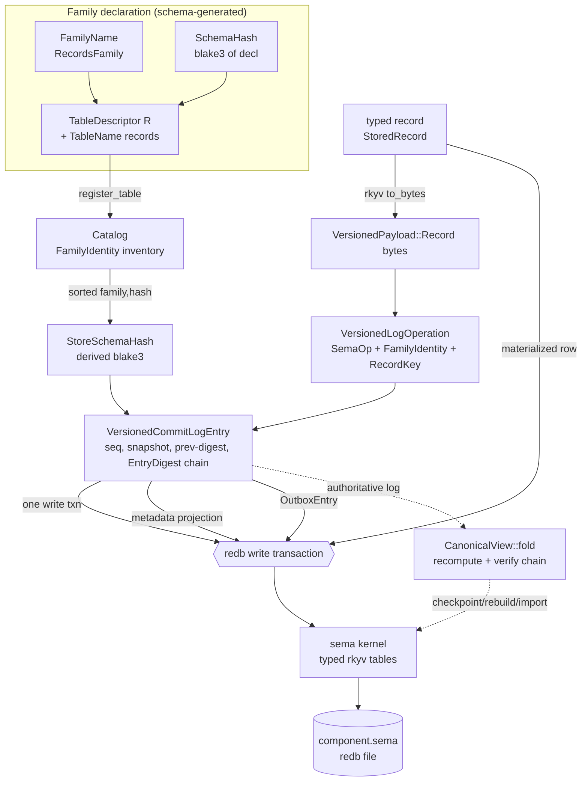

# Layer 4 — The State Engine + Versioned Families (the SEMA-plane substrate)

Repos: `sema-engine` (the database engine, primary), `signal-sema` (its
classification wire contract), over the `sema` storage kernel (redb + rkyv).
Source root: `/git/github.com/LiGoldragon/<repo>`.

## What this layer IS

`sema-engine` is the **exclusive database-operation boundary** for every
state-bearing component. It is the substrate of the SEMA plane: the place where
durable typed records actually live. Per Spirit `fosp` (Correction), quoted in
`sema-engine/INTENT.md:7-9`: *"Sema-engine is the exclusive interface to the
database. No component daemon may make direct redb calls."* Daemons own actors,
sockets, authorization, domain validation, and schema-root dispatch; all durable
database work goes through `Engine`.

The deeper design decision (Spirit `iir4`, `INTENT.md:11-13`): **the versioned
operation log is the authoritative source of truth; the redb table store is a
rebuildable materialized view folded from the log.** Every durable write goes
through logged choke points, and the storage kernel hands components only a
read-only `StorageReader` (no write affordance), so the commit log stays
complete by construction.

Three-crate stack:

| Crate | Role | Backend dep |
|---|---|---|
| `sema` (kernel) | Opens redb files, validates format/schema, reads/writes typed rkyv tables behind the `.sema` file type | `redb = "4"` (VERIFIED, `sema/Cargo.toml:11`) |
| `sema-engine` | Reusable database engine: families, write/read execution, commit log, versioned log, checkpoint/import/rebuild/outbox | `sema`, `rkyv 0.8`, `blake3`, `signal-sema`, `signal-frame` (VERIFIED `sema-engine/Cargo.toml:16-22`) |
| `signal-sema` | Layer-3 classification vocabulary: the six payloadless `SemaOperation` words (`Assert/Mutate/Retract/Match/Subscribe/Validate`) every log operation tags | pure library (`signal-sema/INTENT.md:20-34`) |

`sema-engine` is **library-only**: no daemon binary, no socket, no actor runtime,
no NOTA parser, no tokio, no Kameo (VERIFIED `ARCHITECTURE.md:16-21`,
`INTENT.md:90-94`).

## Backend (VERIFIED)

- **redb** is the on-disk B-tree store, hidden inside the `sema` kernel; `.sema`
  is the component-facing file type and redb is "an implementation detail of the
  storage kernel" (`INTENT.md:86-88`).
- **rkyv 0.8** is the bytes face of every record: tables are `sema::Table<Key,
  RecordValue>` where `RecordValue` is rkyv-archivable (`table.rs:138-157`); the
  `EngineStoredValue` trait bundles the rkyv `Archive + Serialize + Deserialize +
  CheckBytes` bounds (`record.rs:153-179`).
- **blake3** for all content addressing (Spirit `x0ja` Constraint): per-family
  `SchemaHash`, derived `StoreSchemaHash`, `EntryDigest` chain, `ViewDigest`,
  segment/checkpoint digests.

## Versioned families — FamilyIdentity = FamilyName + SchemaHash

A record family is identified by **semantic identity that survives table
renames**, not by its storage coordinate. `FamilyIdentity`
(`versioning.rs:182-221`) carries three fields:

- `FamilyName` — the schema declaration name (`versioning.rs:42`), the stable
  semantic identity.
- `SchemaHash` — a 32-byte blake3 hash of one family's schema declaration
  (`versioning.rs:78`), the **per-family schema version**. `for_label` hashes a
  label; schema generation produces it from `.schema` source.
- `table_name` — only the *current* storage coordinate.

The replay dispatch relation is `FamilyIdentity::shares_family` — equal
`FamilyName` and equal `SchemaHash`, **table coordinate deliberately ignored**
(`versioning.rs:212-214`). So a table rename keeps store identity stable; a
schema change flips the `SchemaHash` and is detectable as drift.

Registration declares this identity. `Engine::register_table` /
`register_identified_table` persist a `TableRegistration` (just the
`FamilyIdentity`) into the engine catalog (`engine.rs:124-162`, `catalog.rs`).
The guard `family_registration_state` (`engine.rs:1769-1795`) enforces two typed
rejections:

- **`FamilyIdentityMismatch`** — same table name, different identity (drift on a
  bound table).
- **`FamilyAlreadyBound`** — the same family version already lives at another
  table (no two table coordinates for one family version).

The **store-level** schema hash is *derived, never hand-supplied*: `StoreSchemaHash`
is a domain-separated blake3 over the **sorted (family, schema hash) inventory**
of the catalog, table names excluded (`versioning.rs:127-155`,
`from_inventory`). A rename keeps it stable; any family's schema-hash change
moves it. This is what pins the whole store's schema version into every
versioned log entry.

### Descriptor → table descriptor → rkyv → DB

Two descriptor flavors (`table.rs:38-106`):

| Descriptor | Key shape | Identity source |
|---|---|---|
| `TableDescriptor<R>` | domain key (author-supplied `String`) | `EngineRecord::record_key` or explicit `KeyedAssertion`/`KeyedMutation` for imported types |
| `IdentifiedTableDescriptor<R>` | engine-minted numeric `RecordIdentifier` | engine allocates + persists a durable counter |

`RecordKey` is a typed sum (`record.rs:46-113`): `Domain(String)` vs
`Identifier(RecordIdentifier)`. The enum *is* the discrimination — no string
parse recovers the kind; the digest folds a kind tag (`Domain`=1, `Identifier`=2)
so a domain key `"1"` and identifier `1` never collapse even when their text
matches (`record.rs:109-112`; tests at `record.rs:231-262` lock that an
identifier hashes its *decimal-string* bytes, not raw `u64` LE).

## The versioned log entry — the authoritative bytes

When a component opts in with a `VersioningPolicy` (`with_versioning`,
`engine.rs` open path), every write lands a `VersionedCommitLogEntry`
(`versioning.rs:402-474`) in the **same redb write transaction** as the data row,
the metadata `CommitLogEntry`, and the mirror `OutboxEntry`. The entry carries:

- `store_name`, derived `StoreSchemaHash`, `CommitSequence`, `SnapshotIdentifier`;
- `previous_entry_digest` + its own `EntryDigest` (the hash chain);
- `NonEmpty<VersionedLogOperation>`.

Each `VersionedLogOperation` (`versioning.rs:341-400`) carries a `SemaOperation`
class, the full `FamilyIdentity`, an optional `RecordKey`, and a
`VersionedPayload` — either `Record { bytes: Vec<u8> }` (the rkyv bytes of the
typed record that landed) or `Tombstone` for retracts (`versioning.rs:302-339`,
payload encoded at `engine.rs:2044-2050`). **Replay dispatches on (family, schema
hash); the table name is only the current coordinate** (`versioning.rs:373-376`).

`EntryDigest::from_entry_fields` (`versioning.rs:257-285`) recomputes the entry
hash from all fields with a domain-separation prefix
(`sema-engine-versioned-commit-log-entry-v2`). The chain head is cached in a
dedicated `CHAIN_HEAD` redb slot for O(1) predecessor reads (storage layout 5,
`commit_log.rs:28-37`, `engine.rs:44-57`) — but **integrity never trusts the
cached head**: the fold recomputes every digest and verifies link-by-link from
genesis (`engine.rs:2053-2060`, `fold.rs` `CanonicalView::fold`).

## The fold surface — checkpoint / import / rebuild / outbox

These realize `iir4` end to end. The fold (`fold.rs`) produces the **canonical
view**: per-key last-write state in sorted `(FamilyName, SchemaHash, RecordKey)`
order, deliberately excluding the table coordinate (`fold.rs:101-120` `ViewKey`,
`fold.rs:67-100` `ViewRow`).

- **Checkpoint** (`checkpoint.rs`, `ARCHITECTURE.md:337-376`): a *digest verifies*
  a state, a *segment restores* one. `Engine::checkpoint()` folds the log into the
  canonical view and persists `CheckpointMetadata` (sequence, store name, derived
  `StoreSchemaHash`, the `FamilyInventory`, covered `CommitSequenceRange`, covered
  head digest, `ViewDigest`, previous-checkpoint digest, segment refs, own digest)
  plus content-addressed `CheckpointSegment` rows chunked at a 1 MiB soft budget
  (`checkpoint.rs:16-22`). **Checkpointing logs no versioned entry and advances no
  sequence** — the log already contains everything; logging the fold would make
  history describe itself (`ARCHITECTURE.md:358-363`).
- **Import** (`import.rs`, `ARCHITECTURE.md:378-416`): `Engine::begin_import()`
  mints an `ImportSession` — the *only* path to the restore surface, fresh store
  only, exclusively borrowing the engine so mutation handlers structurally cannot
  interleave. It ingests one verified `Checkpoint` plus a log suffix and applies
  everything in one transaction: catalog + identified counters restore verbatim,
  suffix entries insert verbatim (preserving sequences/digests/tombstones, each
  getting its outbox row), and the folded view materializes through
  `RowMaterializer` — never through assert/mutate, so no double-logging.
- **Rebuild** (`fold.rs`, `ARCHITECTURE.md:418-451`): `rebuild_from_log(directory)`
  re-derives the materialized tables from checkpoint + suffix in one transaction
  (tombstone touched keys, then write final rows). The fold *is* the definition of
  the view. Because every write went through the choke points, the touched-key
  clear is a full clear by construction.
- **Mirror outbox** (`outbox.rs`, `ARCHITECTURE.md:453-481`): every versioned
  entry lands a durable `OutboxEntry` (sequence + digest) beside it, so the
  unshipped suffix is complete by construction (this forced storage layout 3). The
  typed mirror API is library-only — `unshipped_outbox()`,
  `acknowledge_mirror(MirrorHead)` (idempotent, with typed `MirrorHeadForked` /
  `MirrorHeadUnknown`), and a `Durability` level per entry/store: `LocalCommitted`
  / `QueuedForMirror` / `ServerCommitted` (`outbox.rs:106-119`). Transport and the
  mirror actor stay outside the crate.

A component supplies a `FamilyDirectory` — its typed knowledge of which Rust
record type materializes each family. The engine drives the fold and owns the
transaction; the directory only picks the type and calls
`RowMaterializer::apply` (`ARCHITECTURE.md:412-416`).

## How Spirit's SEMA plane uses sema-engine (VERIFIED)

Spirit's intent store (`spirit/src/store/mod.rs`) is a textbook consumer. It opens
a **versioned** engine and registers three **domain-keyed** families
(`store/mod.rs:249-254`, `363-372`):

```
EngineOpen::new(path, SPIRIT_SCHEMA_VERSION)
    .with_versioning(RecordFamily::versioning_policy())   // store name "spirit:sema"
database.register_table(RecordFamily::records_family())     // StoredRecord
database.register_table(RecordFamily::referents_family())   // StoredReferent
database.register_table(RecordFamily::migrations_family())  // Migration
```

The descriptors are **schema-generated** (`spirit/src/schema/sema.rs:1024-1050`):
store name `"spirit:sema"`, families `RecordsFamily`/`ReferentsFamily`/
`MigrationsFamily`, each with a generated `SchemaHash` constant
(`family_identity::RECORDS_FAMILY` etc., `sema.rs:967`). Drift detection is
explicit: `RecordFamily::decode` rechecks the generated `SchemaHash` against the
stored `FamilyIdentity` and returns `SchemaHashMismatch` on drift
(`sema.rs:1051-1106`).

Intent records persist as `StoredRecord` = `RecordIdentifier` + `Entry`, keyed by
the record identifier string via `EngineRecord::record_key`
(`store/mod.rs:1138-1162`). `StoredReferent` is keyed by its referent name
(`store/mod.rs:1211-1215`). On restore, `StoreFamilyDirectory`
(`store/family_directory.rs`) dispatches each canonical-view row to the right
typed table **purely on the per-family schema hash** — no family name is ever
hand-typed (`family_directory.rs:37-52`). So Spirit's intent log (Decisions,
Principles, Corrections, Constraints) is exactly the versioned, hash-chained,
checkpoint-restorable SEMA substrate this engine provides.

## Internal pipeline



## Notable / sharp facts

- **Log is truth, tables are a view.** Spirit `iir4`: the redb store is a
  rebuildable materialized view folded from the versioned log. Rebuild and import
  materialize through `RowMaterializer`, bypassing assert/mutate, so no
  double-logging and no re-minted sequences.
- **Identity survives renames; schema changes are drift.** `FamilyIdentity`
  ignores the table coordinate for dispatch (`shares_family`); the derived
  `StoreSchemaHash` and the `ViewDigest` both exclude table names. A schema-decl
  change flips the per-family blake3 `SchemaHash`, caught at registration
  (`FamilyIdentityMismatch`) and at decode (`SchemaHashMismatch` in the consumer).
- **Integrity never trusts the cache.** The O(1) `CHAIN_HEAD` slot (layout 5) is a
  write-path optimization only; the fold recomputes every entry digest and verifies
  the chain link-by-link from genesis — a tampered entry cannot ride a stored
  digest. The layout-4→5 upgrade refolds those derived slots in place at open.
- **One transaction, four artifacts.** A single versioned write commits the data
  row, the metadata `CommitLogEntry`, the `VersionedCommitLogEntry`, and the mirror
  `OutboxEntry` atomically — so "state loss is unacceptable" (`29pb`) holds by
  construction; the unshipped suffix is always complete.
- **Read-only handoff during migration.** Components with unmigrated local tables
  get `StorageReader` (no write affordance), forcing all durable writes through the
  logged choke points — the only way to write is to lift the table into a family.
- **Tension / self-host boundary.** The mirror *actor*, transport, and server are
  deliberately outside this library crate; the engine provides only the typed
  outbox/ack surface and `Durability` levels. Handover raw payloads are stored in a
  *separate* container outside the typed tables, keeping the typed-DB invariant
  intact (`ARCHITECTURE.md:505-528`).
- **Concurrency caveat.** `Engine` is a single-owner handle; a `write_lock` mutex
  serializes its own read-compute-write so two `&self` callers cannot fork the
  digest chain, but components must still own each `Engine` from one actor
  (`ARCHITECTURE.md:24-28`, `engine.rs:74-85`).
- `RecordKey` is a typed sum, not a stringly key: the enum is the discrimination,
  and the digest folds a kind tag so domain key `"1"` and identifier `1` stay
  distinct.
