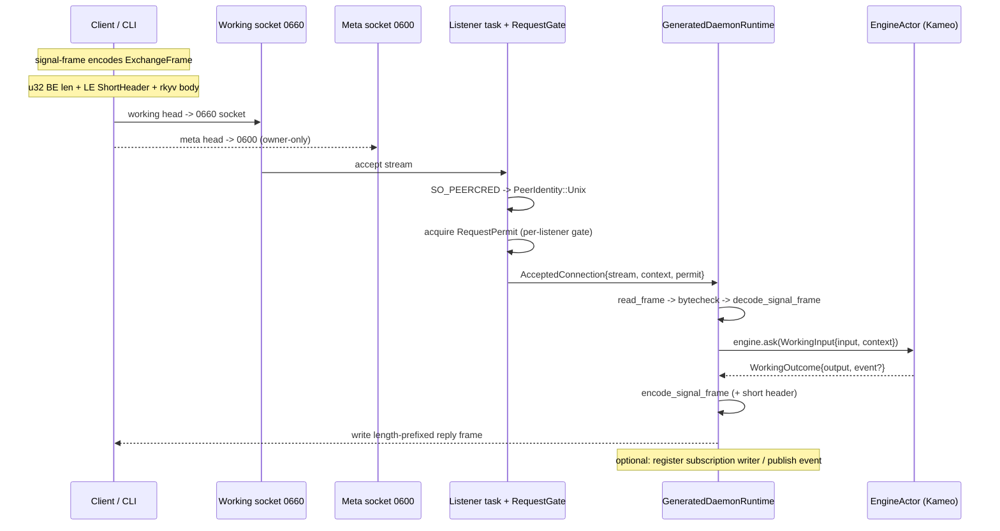
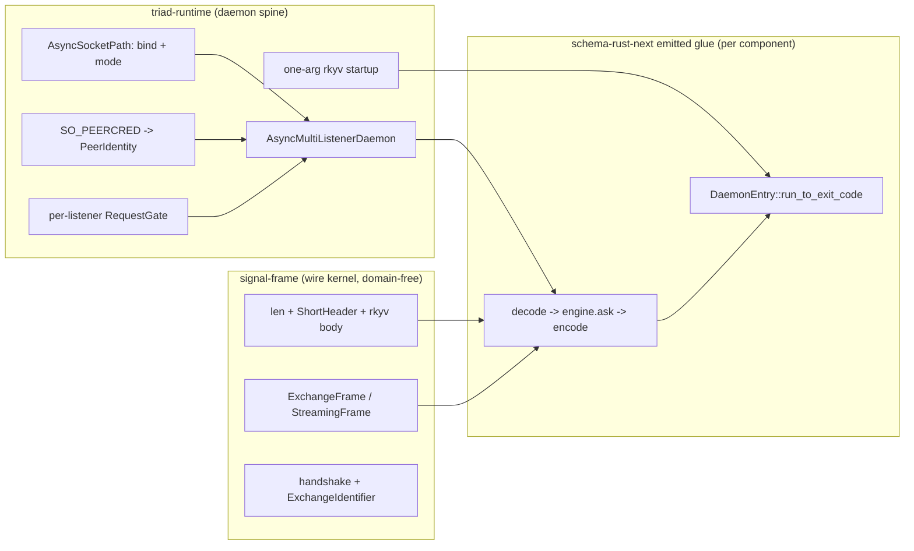

# Layer 5 — Wire Framing + the Daemon Runtime Spine

*How any triad daemon is built and runs. Repos: `signal-frame` (the
Rust-to-Rust wire kernel), `triad-runtime` (the reusable daemon spine).
Read: both `INTENT.md`/`ARCHITECTURE.md` plus key source; cross-checked
against `spirit`'s emitted daemon module to ground the composition.*

## Role in one paragraph

Layer 5 is the substrate every schema-derived component daemon stands on.
`signal-frame` owns the **domain-free wire kernel**: the length-prefixed
rkyv envelope, the 8-byte short header read without deserializing, the
typed request/reply/event frame bodies, async-correlation identifiers, and
(under an opt-in `nota-text` feature) the thin-CLI client that injects
caller context and routes heads to the working vs meta socket.
`triad-runtime` owns the **daemon spine**: Tokio/Kameo listener shells that
bind one or more Unix (or TCP) sockets, apply per-socket file modes, read
kernel-vouched `SO_PEERCRED` identity, admit each connection through a
per-listener `RequestGate`, and hand a typed `AcceptedConnection` to a
component runtime. Neither crate parses NOTA in its default build, neither
owns domain records, and neither emits the per-component glue — that glue is
emitted by `schema-rust-next` into each component's `src/schema/daemon.rs`
and uses these two crates' reusable nouns.

## signal-frame — the wire envelope

### The length-prefixed shape

The on-wire shape is fixed and tiny (VERIFIED, `frame.rs:12-14`,
`204-213`):

```text
u32 big-endian body length  ->  little-endian ShortHeader (8 bytes)  ->  archived frame body (rkyv)
```

- The length prefix is **exactly 4 bytes, big-endian** (`frame.rs:165-174`).
  Decode rejects a prefix shorter than 4 bytes (`FrameError::ShortLengthPrefix`)
  and any length that does not match the actual payload length
  (`FrameError::LengthMismatch`, `frame.rs:176-189`).
- The `ShortHeader` is a `u64` newtype serialized **little-endian**
  (`frame.rs:20`, `35-41`) — deliberately LE to match the workspace rkyv
  pin, while the length prefix stays BE. A reader can lift bytes `4..12`
  with `short_header_from_length_prefixed` *without* deserializing the body
  (`frame.rs:191-202`), so a daemon can classify a frame by its byte-0 root
  verb cheaply. `Frame::new` defaults the header to `empty()` (zero); a
  projection-aware producer uses `with_short_header` (`frame.rs:99-108`).
- Encoding is rkyv `to_bytes` over the body, prefixed with the LE header,
  then length-prefixed (`encode_frame_archive` `frame.rs:204-213`,
  `encode_length_prefixed` `frame.rs:229-231`).
- **Every incoming archive is bytechecked before deserialization** — the
  decode bounds require `CheckBytes` on each payload's `Archived` form
  (`frame.rs:254-259`, `282-290`); a failure surfaces as
  `FrameError::ArchiveDeserialize` (`frame.rs:263-267`). This is the
  invariant that lets a daemon accept an untrusted socket's bytes safely.

### The two frame bodies — illegal states unrepresentable

There are two frame types, split by channel shape (VERIFIED,
`frame.rs:47-96`):

| Frame | Body variants | Used by |
|---|---|---|
| `ExchangeFrame<Req, Reply>` | `HandshakeRequest`, `HandshakeReply`, `Request{exchange,request}`, `Reply{exchange,reply}` | non-streaming channels |
| `StreamingFrame<Req, Reply, Event>` | the four above **plus** `SubscriptionEvent{event_identifier, token, event}` | channels that push events |

The split is load-bearing: a non-streaming channel has no uninhabited event
arm to discharge in its match, and the schema honestly reflects which
channels emit pushed events. The `event` payload is a **distinct type
parameter** from the reply payload, so an event accidentally appearing in a
reply position (or vice-versa) does not type-check (`frame.rs:61-64`).

`Reply<ReplyPayload>` is itself a typed sum — `Accepted { outcome,
per_operation }` vs `Rejected { reason }` — with per-operation `SubReply`
results aligned positionally to the originating request's operation index
(ARCHITECTURE §1, §4). Engine failures cross the wire as **accepted
batch-abort replies**, not frame rejections; the component-private executor
error never crosses the frame boundary (`BatchErrorClassification`,
ARCHITECTURE §1 lines 95-98).

### Handshake + correlation

`HandshakeRequest` carries a `ProtocolVersion`; `HandshakeReply` is
`Accepted(version)` / `Rejected(IncompatibleVersion{local,peer})`
(VERIFIED `version.rs:38-69`). `ProtocolVersion::accepts` is same-major /
minor-greater-or-equal (`version.rs:31-33`); the current kernel pin is
`0.1.0` (`version.rs:36`). Async request/reply matching rides on the
frame-layer `ExchangeIdentifier` (session epoch + lane + monotonic
`LaneSequence`) negotiated at handshake — **payloads never carry transport
identifiers** (ARCHITECTURE §3-4). Subscription events ride the acceptor's
outbound lane as `SubscriptionEvent` carrying a `StreamEventIdentifier`
(same wire shape, distinct type) and a `SubscriptionTokenInner` routing key.

### Provenance: advisory `Caller`, not authority

`signal-frame` carries an optional `Caller` (parent `ProcessIdentifier`,
`ExecutablePath`, `ProcessStartTime` from `getppid()` + `/proc`) inside
`Request` (ARCHITECTURE §1 lines 84-87). This is an **audit/debug witness,
not an authority proof** — the crate explicitly does *not* own
authentication or socket-peer policy (ARCHITECTURE §2 lines 149-153). Real
origin comes from the socket layer in `triad-runtime` (below). The thin CLI
injects `Caller::from_kernel()` at the frame boundary
(`command_line.rs:618`, `625`); decoded-NOTA and programmatic requests
default it to `None` (ARCHITECTURE §4).

### The default/`nota-text` boundary

The default crate is the **binary kernel only** — a production daemon
depends on `signal-frame` without compiling a NOTA parser (INTENT lines
11-14). Text projection (`SingleArgument`, `CommandLineRouteTable`,
`CommandLineSockets`, `signal_cli!`) lives behind the `nota-text` feature
(ARCHITECTURE §1 lines 127-136). The CLI route table maps each request head
to exactly one of `Working` / `Meta`, erroring on a head claimed by both or
neither (`command_line.rs:186-200`); it then opens that socket, writes a
length-prefixed frame, and reads the reply (`command_line.rs:614-686`). The
`signal_channel!` macro follows the same boundary — binary frame types
always emitted, NOTA derives gated under the consumer's `nota-text`.

## triad-runtime — the daemon spine

### The one-binary-rkyv-startup discipline

Component binaries take **exactly one argument** through `ComponentCommand`
(ARCHITECTURE §"Argument Runtime"). A daemon calls `signal_file_argument()`:
inline NOTA text and `.nota` paths are **rejected before** any decode — only
an existing non-`.nota` signal-encoded (rkyv) file is accepted (INTENT lines
78-85). The daemon never parses NOTA, configuration included; deploy/bootstrap
tools encode typed data into binary before the daemon sees it. In the emitted
spine this is `DaemonCommand::configuration` → `ComponentArgument::SignalFile`
accepted, `InlineNota`/`NotaFile` rejected (VERIFIED
`spirit/src/schema/daemon.rs:161-171`).

### Trust boundary: `SO_PEERCRED` and the 0660/0600 socket modes

The runtime reads the kernel-vouched peer identity itself, in safe Rust
(VERIFIED `process.rs:51-70`): `UnixCredentials::from_stream` /
`from_tokio_stream` call rustix's `socket_peercred` (which performs
`getsockopt(SO_PEERCRED)` internally), so `triad-runtime` keeps
`unsafe_code = "forbid"`. The result is a closed two-variant `PeerIdentity`
(`process.rs:97-103`): `Unix(UnixCredentials)` (uid/gid/pid the OS vouches
for, unforgeable by any payload field) or `Tcp(SocketAddr)` (remote address
only). No accessor pretends a TCP peer has Unix credentials — both
`unix_credentials()` and `tcp_address()` return `Option`
(`process.rs:108-122`). The sum is closed on purpose: **ssh-forwarded
sockets are rejected** as a transport shape, so there is no third
"forwarded" identity (`process.rs:94-96`, INTENT lines 158-168).

Socket file modes are applied uniformly by the listener shell, not
hand-rolled per component (VERIFIED `async_runtime.rs:1042-1077`): `bind`
prepares the path (create parent dir, remove stale socket), binds the Tokio
listener, then `apply_socket_mode` runs `set_permissions(from_mode(bits))`
only when a mode is set. `SocketMode` is a `u32`-bits newtype
(`daemon.rs:163-171`). The intended trust boundary is **0660 on the working
socket** (owner+group callable) **vs 0600 on the meta socket** (owner-only),
so security-sensitive / policy-editing calls require owner identity.

Sharp fact (VERIFIED, a real divergence): in `spirit`'s emitted binder the
**meta socket is hardcoded to `0o600`** (`spirit/src/schema/daemon.rs:230`),
but the **working socket is left at its umask-derived default** — the binder
only applies `configuration.socket_mode()` if the component returns `Some`
(`daemon.rs:218-221`), and `BindingSurface::socket_mode` defaults to `None`
(`process.rs:209-211`). So "0660 working / 0600 meta" is the *intent and
capability* of the runtime; in the current spirit emission the meta side is
enforced to 0600 while the working side is umask-defaulted unless the
component opts in. The runtime exposes both `socket_mode()` and
`meta_socket_mode()` precisely so a private daemon can ask for explicit modes
(ARCHITECTURE §"Async Runtime" lines 70-74).

### Per-listener admission (no cross-tier starvation)

Each bound listener owns its **own** `RequestGate` (VERIFIED
`async_runtime.rs:557`, `615`). A `RequestGate` is a data-bearing Kameo
actor wrapping a `RequestPermitPool` (a Tokio semaphore); on
`AcquireRequestPermit` it accepts the message, bumps a counter, and
**delegates the actual wait through `Context::spawn`** so the gate mailbox
stays available for status/shutdown while permits are exhausted
(`async_runtime.rs:499-511`, INTENT lines 21-25, ARCHITECTURE §"Async
Runtime"). Because the gate is per-listener, a slow or
concurrency-capped working request **cannot block meta admission** — the
deliberate fix for the old "one concern blocks another" bug
(ARCHITECTURE lines 76-82). `RequestConcurrencyLimit` defaults to `one()`,
preserving single-request behavior for components that have not audited
parallel access (`process.rs:216-218`, `async_runtime.rs:255-271`).

### The listener shells

| Shell | Sockets | Gate | Connection type | Notes |
|---|---|---|---|---|
| `AsyncSingleListenerDaemon` | one Unix | one | `AcceptedConnection` | working-only daemon |
| `AsyncMultiListenerDaemon` | many Unix (working+meta) | one per listener | `AcceptedConnection` + `Listener` id | one accept task per listener, JoinSet |
| `TcpListenerDaemon` (`tcp.rs`) | one TCP | one | `AcceptedConnection<TcpStream>` | cross-host (tailnet bind); no mode, no stale-path |
| `MultiListenerDaemon` (legacy, `daemon.rs`) | many Unix, polled | n/a | synchronous | migration-only; new work targets async |

An `AcceptedConnection<Stream>` is a typed value carrying the Tokio stream,
the `ConnectionContext` (peer identity), and the held `RequestPermit`
(`async_runtime.rs:64-68`, `331-355`). The multi-listener shell spawns one
Tokio task per listener via `JoinSet`; a request-level error is logged per
listener and does **not** stop the accept loops, while a listener-task
failure aborts all and is fatal (`async_runtime.rs:700-741`, `961-972`).
Socket files are removed on drop of the bound listener (`AsyncSocketFile`
`Drop`, `async_runtime.rs:1086-1090`), so supervised components release
their ingress paths after shutdown.

### How the generated engine is dispatched per request

The reusable shells stop at "here is a typed `AcceptedConnection` plus its
listener identity." The **per-component glue** (emitted by `schema-rust-next`
into `src/schema/daemon.rs`, NOT owned by `triad-runtime`) supplies the
decode → execute → encode body. In `spirit` (VERIFIED):

- `GeneratedDaemonRuntime` implements `AsyncMultiConnectionRuntime`; its
  `handle_connection` matches `ListenerTier::Working`/`Meta` and routes
  (`daemon.rs:614-623`).
- `handle_working_connection` is the spine (`daemon.rs:533-557`): build a
  `WorkingTransport` (split the stream into reader+writer halves), read one
  length-prefixed frame, `Input::decode_signal_frame`, `engine.ask(...)`
  into the `EngineActor` (the engine state lives behind a Kameo mailbox),
  `encode_signal_frame` the output, write it back, and optionally register a
  subscription writer or publish a pushed event.
- The engine is reached only through a Kameo `ask`, so the slow decision is
  an awaited actor message, never synchronous work hidden in the listener
  (INTENT lines 20-25). The recursive Nexus decision loop itself runs inside
  the engine via `triad-runtime`'s `Runner` (Layer 4 territory).
- `DaemonEntry::run_to_exit_code()` is the `fn main` tail: `ExitReport::new(
  PROCESS_NAME).from_result(DaemonCommand::from_environment().run())`
  (`daemon.rs:663-667`); `DaemonCommand::run` builds a Tokio runtime and
  `block_on`s `bind(config)?.run()` (`daemon.rs:172-181`). `ExitReport`
  maps `Ok` → success, `Err` → `"<name>: <error>"` on stderr + failure
  (`process.rs:274-285`).

## How they compose — a request's full life





## Notable facts, tensions, and self-host boundaries

- **Two endiannesses by design.** Length prefix is big-endian `u32`; the
  short header is little-endian `u64` (to match the workspace rkyv pin).
  `frame.rs:12-14`, `35-41`.
- **The short header is peekable.** Bytes `4..12` give the root verb without
  deserializing — a daemon classifies/dispatches on one byte read
  (`short_header_from_length_prefixed`, `frame.rs:200-202`).
- **Provenance is split across the two crates.** `signal-frame::Caller` is
  advisory/forgeable; the *authoritative* origin is the socket layer's
  `SO_PEERCRED`. A component "mints an origin" (owner / non-owner /
  internal / remote) from the typed `PeerIdentity`, never from payload
  fields (`process.rs:125-132`).
- **`unsafe_code = "forbid"` survives a syscall.** Peer creds are read via
  rustix's safe `socket_peercred`; std's `UnixStream::peer_cred` is still
  unstable, which is the stated reason (`process.rs:16-25`).
- **Real divergence flag:** intent says "0660 working / 0600 meta," but the
  spirit emission enforces only meta `0o600` and leaves the working socket
  umask-derived unless the component opts into `socket_mode()`
  (`spirit/.../daemon.rs:218-221`, `230`; `process.rs:209-211`). The
  runtime *can* apply a working mode; the current emitter does not pass one.
  Worth confirming with the psyche whether 0660-on-working should be the
  emitted default.
- **Ownership line is exact and honored.** `triad-runtime` supplies the
  reusable listener/gate/frame/exit nouns; `schema-rust-next` emits the
  `decode → execute → encode` spine and `DaemonEntry` into each component —
  `triad-runtime` does *not* emit that module (INTENT lines 109-115,
  confirmed by it living in `spirit/src/schema/daemon.rs`).
- **SSH-forwarded sockets are an explicit non-shape.** Cross-host transport
  is a tailnet-bound TCP listener reusing the same length-prefixed codec;
  the closed `PeerIdentity` sum has no "forwarded" arm (INTENT lines
  158-168, `process.rs:94-96`).
- **Engine waits never block the listener.** The engine is a Kameo actor
  reached by `ask`; long waits (storage, child processes, admission) are
  delegated through actor-aware tasks, keeping mailboxes responsive
  (INTENT lines 20-25; `RequestGate` delegates its wait via `Context::spawn`,
  `async_runtime.rs:499-511`).
- **Legacy synchronous `MultiListenerDaemon` is migration-only;** new
  schema-emitted work targets the async shells (ARCHITECTURE §"Daemon
  Runtime" lines 207-224).

## Depends-on (verified)

- `signal-frame` depends on `rkyv` (Archive/Serialize/Deserialize +
  bytecheck) and `thiserror`; `nota-text` feature pulls `nota-next` and the
  `signal-frame-macros` sibling. No daemon-runtime, no SEMA, no domain
  records (INTENT, ARCHITECTURE §2).
- `triad-runtime` depends on `kameo` + `tokio` (async actor substrate),
  `rustix` (safe `SO_PEERCRED`), `thiserror`, and `signal-frame` (it
  publishes `signal_frame::StreamingFrame` subscription events via
  `streaming.rs`). It does not depend on any component contract crate.
