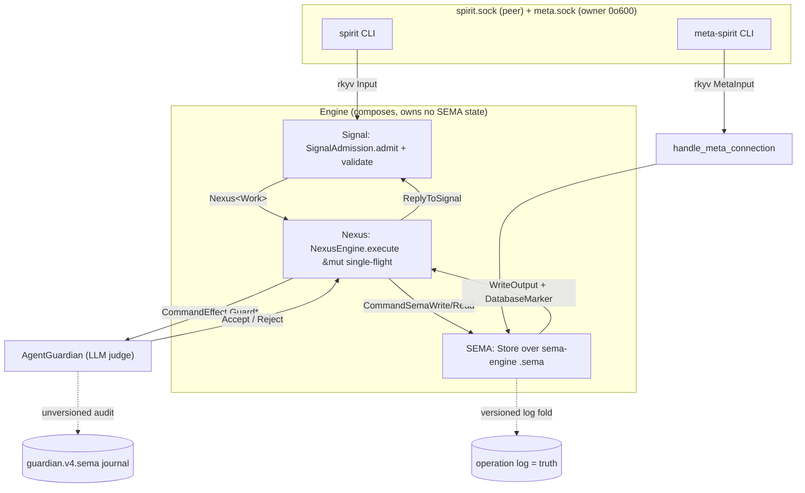
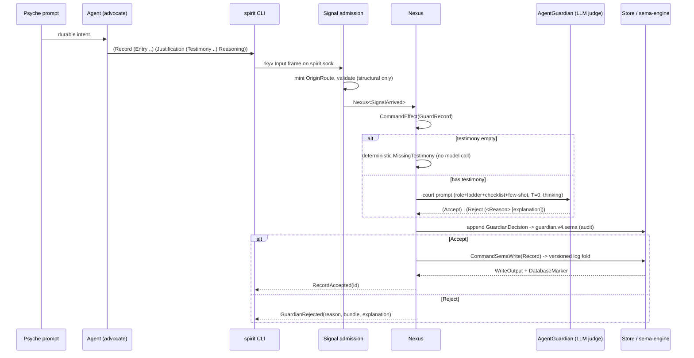

# Layer 6 — The Spirit Application: Three Planes, the Guardian, the Record Model

*Repos: `spirit` (the daemon crate + thin CLIs), `signal-spirit` (ordinary
peer-callable wire contract), `meta-signal-spirit` (owner-only meta policy
contract). All paths below are absolute under
`/git/github.com/LiGoldragon/<repo>`. Claims are VERIFIED from source unless
marked INFERRED.*

## What Spirit is

`spirit` is the running proof that a schema can mint a real CLI+daemon interface,
and it is the **copyable triad exemplar** for the next component stack
(`spirit/INTENT.md:1`). It is the only place in the ecosystem where the whole
generated-schema substrate (Layers 1-5) bears the weight of a production
intent store: it records the durable intent of the psyche, gates every write by
an LLM judge, and persists through a versioned-log SEMA store. The repo is one
daemon crate by design, but its two *external* wire contracts live in sibling
crates so rebuild and policy boundaries are crate-enforced
(`spirit/ARCHITECTURE.md:8-17`):

| Crate | Role | Channel |
|---|---|---|
| `signal-spirit` | ordinary peer-callable contract + `SpiritDaemonConfiguration` | working socket |
| `meta-signal-spirit` | owner-only lifecycle/config contract (`Configure`, `Import`) | meta socket |
| `spirit` | daemon runtime + crate-local `nexus.schema`/`sema.schema` + the two CLIs | both |

One channel = one contract crate; the daemon legitimately holds *multiple*
internal plane schemas (`signal-spirit/INTENT.md:34-37`).

## The three planes

Spirit instantiates the universal Signal / Nexus / SEMA triad as three concrete
runtime objects, each typed by its own schema plane. The INTENT names them
exactly: `SignalAdmission` (admission), `Nexus` (mail keeper + translator, owns
store + ledger), `Store` (durable SEMA over `sema-engine`); `Engine` composes
them and owns no SEMA state (`spirit/INTENT.md:34`, `spirit/ARCHITECTURE.md:91-94`).

### Signal — the wire surface on `spirit.sock`

Defined by `signal-spirit/schema/signal.schema`. The input root enum
(`signal.schema:44`) is the entire peer-callable vocabulary:

```
State Record Propose Clarify Supersede Retire Observe PublicRecords
PrivateRecords Lookup Count Remove ChangeCertainty BumpImportance ChangeRecord
RegisterReferent LookupStash CollectRemovalCandidates Tap Untap
(SubscribeIntent ... opens IntentEventStream) Version Marker
```

Output roots (`signal.schema:45`) are terse receipts — `RecordAccepted` carries
only a `RecordIdentifier`, never an echo of submitted content
(`signal-spirit/INTENT.md:43-44`). `SignalAdmission::admit` mints the origin
route, validates the generated `Input`, and produces `SignalAccepted`; an
invalid input becomes `Output::Rejected(SignalRejection(ValidationError))` where
`ValidationError` is itself schema-generated, not a hand-rolled enum
(`spirit/src/engine.rs:566-585`, `signal.schema:154`). The `ValidationError` set
is deliberately structural-only (empty domain, empty description, empty query
field, stash-handle-not-found) — *semantic* judgement is the guardian's job, not
admission's.

### Nexus — the internal feature / decision plane

Defined by `spirit/schema/nexus.schema` (daemon-local; imports signal nouns from
`signal-spirit`, `nexus.schema:1-45`). Nexus is both the runner payload keeper
**and the internal feature catalog**: per intent record `gvaz`, any computation,
filter, conditional write, or effect must appear as a Nexus verb/object *before*
Rust implements it (`spirit/ARCHITECTURE.md:283-287`). The plane has three root
streams:

- `NexusWork` — the fact stream Nexus decides from: `SignalArrived`,
  `SemaWriteCompleted`, `SemaReadCompleted`, `EffectCompleted` (`nexus.schema:46,66`).
- `NexusAction` — the command stream Nexus emits: `CommandSemaWrite`,
  `CommandSemaRead`, `ReplyToSignal`, `CommandEffect`, `Continue`
  (`nexus.schema:47,67`).
- `NexusEffectCommand` / `NexusEffectResult` — the effect pair carrying the
  visible internal features: `ClassifyState`, the four `*WithImpliedReferents`
  stages, `GuardRecord`/`GuardRemove`/`GuardChangeRecord`/`GuardReferentRegistration`,
  `OpenIntentSubscription`, `CollectRemovalCandidates`, `OpenObserverTap`
  (`nexus.schema:69-109`).

`NexusEngine::execute(&mut Nexus, ...)` is the single-flight guard: the `&mut`
borrow makes concurrent execution on one Nexus impossible (`spirit/ARCHITECTURE.md:305-309`).
The guardian verdict types `GuardianVerdict [Accept (Reject)]` and
`ReferentGuardianVerdict` live on this plane (`nexus.schema:112-115`), because
they are internal decisions, not wire vocabulary.

### SEMA — the durable intent store

Defined by `spirit/schema/sema.schema`. Split write/read roots
(`WriteInput`/`WriteOutput`, `ReadInput`/`ReadOutput`, `sema.schema:23-24`).
`Store` maps these onto `sema-engine` keyed-record ops over a `*.sema` file
(`spirit/INTENT.md:157`). The store is **a fold of its versioned log** (record
`iir4`, Decision/High): the operation log is authoritative truth; the redb store
is a rebuildable materialized view (`spirit/INTENT.md:159-172`). Three families
are schema-declared with content-hash identities — `RecordsFamily`,
`ReferentsFamily`, `MigrationsFamily` (`sema.schema:53-61`). The marker is
`DatabaseMarker (CommitSequence, StateDigest)` where the digest is a real blake3
content hash, empty store digesting to zero (`spirit/ARCHITECTURE.md:536-541`).



## The guardian — what makes intent capture trustworthy

Every working-socket write that changes the live corpus is gated by an LLM judge
(`AgentGuardian`, feature `agent-guardian`) that renders one strictly-binary
verdict per candidate (`spirit/ARCHITECTURE.md:411-415`). The design is a **court
of law**, stated verbatim in the prompt builder doc-comment and `role.md`: the
submitting agent is the advocate, the typed `Justification` is the argued case,
the verbatim `Testimony` is the evidence, the claimed `Certainty` is the burden
of proof the evidence must clear, and the guardian is the judge
(`spirit/src/guardian_prompt.rs:4-8`, `spirit/src/guardian-prompts/role.md:1`).
The verdict is binary — admit or remand — and **the judge never edits a
magnitude or admits-at-a-corrected-value** (record `woku`); a reject names one
fault so the advocate re-pleads. Under-admitting is recoverable; a corrupted
intent layer is not.

### What makes it trustworthy (three structural guarantees, not hope)

1. **The grammar is rendered from the enum, so the prompt cannot drift from the
   wire type.** `reason_catalogue()` renders each reason atom via `NotaEncode`
   (`to_nota()`), and `nota_verdict_discipline()` renders live `Accept`/`Reject`
   example values from the actual `GuardianVerdict` type
   (`spirit/src/guardian_prompt.rs:244-287`). `admission_gloss` is an **exhaustive
   match** — a new `GuardianRejectionReason` variant will not compile until it is
   glossed (`spirit/src/guardian_prompt.rs:84-154`). Record `4jgt`.

2. **Empty testimony is a deterministic structural reject** — `AgentGuardian::guard`
   short-circuits `MissingTestimony` *before* the model call when
   `GuardianOperation::testimony_is_empty()` (`spirit/src/guardian.rs:119-137`,
   `spirit/src/guardian_journal.rs:109-121`). The model only judges semantic
   cases (fabrication, warrant, the certainty burden).

3. **The prompt prose lives in standalone files, embedded at compile time.** Each
   section is a `src/guardian-prompts/*.md` (`role`, `record-shape`,
   `justification-shape`, `burden-ladder`, `checklist`, `few-shot`, `referent`),
   spliced by `include_str!` with the two enum-rendered parts injected
   (`spirit/src/guardian_prompt.rs:376-393`). A regression test fails if any
   section is empty or mis-wired (`spirit/src/guardian_prompt.rs:446-461`).

The judge runs at **temperature 0**, `ThinkingMode::Enabled`,
`ReasoningEffort::High`, `OutputMode::Nota`, with **two format-correction retries**
(`GUARDIAN_FORMAT_RETRIES = 2`) before failing closed — each retry feeds back the
malformed text plus the parse error (`spirit/src/guardian_prompt.rs:289-307`,
`spirit/src/guardian.rs:33,166-189`).

### Two guardians

- **Record guardian** — judges intent writes (`Record`, `Propose`, `Clarify`,
  `Supersede`, `Retire`, `Remove`, `ChangeRecord`, `CollectRemovalCandidates`,
  the `GuardianOperation` enum `spirit/src/guardian_journal.rs:33-43`) through a
  directed **9-gate checklist** run in order, stop at first failure
  (`spirit/src/guardian-prompts/checklist.md`): retrieval sufficiency → target
  soundness → testimony present/authentic → destructive-op psyche authorization →
  warrant (relevance) → arrow shape → classification → magnitude burden (the
  signature gate) → cross-record collision.
- **Referent guardian** — judges whether one referent registration may enter the
  namespace; a referent is a concrete nameable particular, not a verb/concept
  (`spirit/src/guardian-prompts/referent.md`). Per record `bwxn`, a **settled**
  registration (name + aliases already resolving to one referent) bypasses the
  guardian entirely — `settled_referent_registration_receipt` returns the
  existing receipt with no model call and no store mutation
  (`spirit/src/nexus.rs:793-798`, `spirit/INTENT.md:103-109`).

### Typed rejection reasons (closed sets)

Record guardian `GuardianRejectionReason` (`signal.schema:234`) — 15 model-emittable
reasons plus 3 `Harness*` reasons the **daemon** sets on transport failure and
the model is forbidden to name (`MODEL_REASONS` is exactly 15,
`spirit/src/guardian_prompt.rs:62-78`). The `Harness*` mapping
(`HarnessTimedOut`/`HarnessUnavailable`/`HarnessMalformed`) is keyed off the
socket/frame error kind in `AgentGuardianError::guardian_rejection_reason`
(`spirit/src/guardian.rs:282-298`).

| Group | Reasons |
|---|---|
| Evidence | `MissingTestimony` `TestimonyFabricated` `InsufficientWarrant` |
| Magnitude burden | `Overstated` `ImportanceUnsupported` |
| Shape/classification | `NonIntent` `Compound` `UnclearDomain` `UnclearPrivacy` |
| Cross-record | `Duplicate` `Contradiction` |
| Mutation safety | `ClarifyTramples` `ClarifyLosesMeaning` `SupersedeTargetMissing` |
| Retrieval | `RetrievalInsufficient` |
| Daemon-set (excluded from model) | `HarnessUnavailable` `HarnessMalformed` `HarnessTimedOut` |

Referent guardian `ReferentGuardianRejectionReason` (`signal.schema:236`):
`Duplicate Ambiguous TooVague AliasCollision NonReferent UnclearJustification`
+ the same three `Harness*`.

### The decision journal (audit, not intent)

`GuardianDecision` is deliberately kept **out of the versioned intent log**: the
guardian's verdicts are *about* intent, not intent itself
(`spirit/ARCHITECTURE.md:461-470`). It writes to a separate, unversioned,
schema-versioned SEMA store `spirit.guardian.v4.sema`
(`GUARDIAN_JOURNAL_SCHEMA_VERSION = 4`, `spirit/src/guardian_journal.rs:26`). This
journal is the **one sanctioned place a family identity is hand-labeled**
(`SchemaHash::for_label("spirit:guardian-journal:v4")`,
`spirit/src/guardian_journal.rs:31,228`) rather than schema-derived — a non-schema
audit family legitimately needs a label, and schema-declaring `GuardianDecision`
would fold LLM verdict types onto the schema plane. Every verdict — accept and
reject, including `Harness*` auto-rejects when guardian is required but absent —
is appended (`spirit/src/nexus.rs:756-777`).



## The record model

The `Entry` is seven positional fields (`signal.schema:216`,
`spirit/src/guardian-prompts/record-shape.md:1`):
`{ Domains, Kind, Description, Certainty, Importance, Privacy, Referents }`.

- **Kind** — closed: `Decision Principle Correction Clarification Constraint`
  (`signal.schema:242`).
- **Certainty / Importance / Privacy** — all the same 8-rung `Magnitude` ladder
  `[Zero Minimum VeryLow Low Medium High VeryHigh Maximum]` (`signal.schema:243`),
  but **three orthogonal directional axes** (`spirit/INTENT.md:97-101`).
  Certainty `Zero` = confidence withdrawn / removal candidate (not deletion);
  Importance drives retrieval order; Privacy `Zero` = public, higher narrows
  audience. Certainty must never be overloaded onto importance.
- **Justification** — `{ Testimony, Reasoning }` (`signal.schema:139`). Testimony
  is `(Vec VerbatimQuote)`, each `VerbatimQuote { QuoteText, antecedent (Optional) }`
  (`signal.schema:134-137`). A bare affirmation ("yes", "do it") is meaningless —
  rejected — without its antecedent (`spirit/src/guardian-prompts/justification-shape.md:2`).
  `RecordRequest { Entry, Justification }` (`signal.schema:140`) — the claim is
  the Entry; the testimony is *evidence for* it, never a second intent.
- **Query** — one noun drives `Observe`, `Count`, and `SubscribeIntent`
  (`signal.schema:239`): `DomainMatch` (`Any`/`Partial`/`Full`), `KeywordMatch`,
  `TextMatch`, `ReferentSelection`, optional `Kind`, and three magnitude
  selections (`PrivacySelection`, `CertaintySelection`, `ImportanceSelection`,
  each `Any`/`Exact`/`AtMost`/`AtLeast`). `Lookup` bypasses filters by exact key.

### The Domain taxonomy (closed, recursive)

`signal-spirit/schema/domain.schema` declares a closed recursive-enum taxonomy:
24 top-level domains (Health, Food, Home, Finance, Work, Craft, Knowledge, …
Information, Technology), most with a flat leaf list, but `Technology` recurses
into `Hardware`/`Software`, and `Software` into 12 optional leaf groups
(`Programming`, `Systems`, `Distributed`, `Data`, `Intelligence`, `Security`,
`Quality`, `Operations`, `Observability`, `Surfaces`, `Engineering`,
`domain.schema:5-63`). A domain is a **universal subject**; a named particular
(`spirit`, `rkyv`, `DeepSeek`) is a Referent, not a Domain — mis-classifying one
is the `UnclearDomain` reject (`spirit/src/guardian-prompts/record-shape.md:1,4`,
checklist gate 6). The schema even carries a domain `Equivalence`
(`[(Information Database) (Technology Software Data)]`, `domain.schema:65-67`).

## The binaries, bootstrap, and socket origin

Three runtime binaries plus two text-edge helpers (`spirit/src/bin/`):

| Binary | Role |
|---|---|
| `spirit` | ordinary CLI: one NOTA arg → rkyv Input on `$SPIRIT_SOCKET` (default `/tmp/spirit.sock`) → prints NOTA Output (`spirit/src/bin/spirit.rs:34-52`) |
| `meta-spirit` | owner-only CLI: speaks `Configure`/`Import` on `$SPIRIT_META_SOCKET` — the privileged sibling (`spirit/src/bin/meta-spirit.rs:15-38`) |
| `spirit-daemon` | one-line `main`: `SpiritDaemon::run_to_exit_code()` (`spirit/src/bin/spirit-daemon.rs:1-5`) |
| `spirit-write-configuration` | text-edge: NOTA `ConfigurationWriteRequest` → binary rkyv config file for launch tooling |
| `spirit-migrate-store` | the one logged-fold migration entry point (copy-everything binaries retired) |

**Binary-only daemon startup.** The daemon's single argument is a path to a
binary rkyv `SpiritDaemonConfiguration` from `signal-spirit`
(`spirit/INTENT.md:192`). `Configuration::from_binary_path` reads bytes and
`from_rkyv_bytes` decodes — there is **no NOTA path into the daemon**
(`spirit/src/config.rs:97-106`). The config carries `socket_path`,
`meta_socket_path` (Optional in type, but `None` is rejected with
`MissingMetaSocket` — record `pb1g`), `database_path`, optional
`trace_socket_path`, and optional `guardian_agent_configuration`
(`signal.schema:162-168`, `spirit/src/config.rs:56-68`). `Configuration` wraps
the contract value so it can implement `triad_runtime::BindingSurface` without
moving runtime behavior into the contract crate (`spirit/src/config.rs:119-135`).

**The guardian is wired at `build_runtime`**: if the config carries a
`guardian_agent_configuration`, `engine.set_guardian(AgentGuardian::new(..))`;
otherwise `engine.require_guardian()` — so an unconfigured guardian fails *closed*
(`HarnessUnavailable` auto-reject) rather than open
(`spirit/src/daemon.rs:125-134`, `spirit/src/nexus.rs:744-770`).

**Two sockets, two contracts, two tiers.** The daemon binds a working listener
and a required meta listener through `triad_runtime::AsyncMultiListenerDaemon`,
tagging each accepted connection with `ListenerTier` (`Working`/`Meta`) so the
runtime decodes the correct wire contract; `handle_meta_connection` decodes
`MetaInput` and dispatches `Configure`→`Engine::configure` /
`Import`→`Engine::import` (`spirit/src/daemon.rs:151-176`,
`spirit/ARCHITECTURE.md:218-226`). The **guardian-bypassing `Import` exists only
here** on the owner-only meta socket; the working signal stays fully gated
(`spirit/ARCHITECTURE.md:204-210`).

**SO_PEERCRED / origin.** Owner-only authority currently rests on the **meta
socket file mode (`0o600`, via `SocketMode`) and listener tier**, not on uid
matching. Accepted-connection peer credentials *are* available in
`ConnectionContext` (`spirit/src/daemon.rs:142`), but Spirit's current origin
route is **internal and monotonic** — `OriginRoute(Integer)` minted by
`issue_origin_route` from a counter (`spirit/src/engine.rs:26,300,569`), not
uid-derived (`spirit/ARCHITECTURE.md:222-225`). The binary socket also rejects
NOTA structurally: `tests/socket_negative.rs` proves length-prefixed NOTA bytes
are refused by `Input::decode_signal_frame` (`spirit/ARCHITECTURE.md:238-242`).

## Notable tensions and boundaries

- **The guardian sits beside, not inside, the intent corpus.** "Intent is intent —
  the guardian is a function that keeps intent clean, not a source of it." Its
  journal is the only hand-labeled (non-schema-derived) family identity in the
  whole store (`spirit/ARCHITECTURE.md:461-470`, `spirit/src/guardian_journal.rs:31`).
- **Fail-closed is explicit and journaled.** A required-but-absent guardian
  auto-rejects with `HarnessUnavailable` AND writes that auto-reject to the
  audit journal (`spirit/src/nexus.rs:744-770`) — the absence is recorded, not
  silent.
- **Self-host boundary:** the few-shot examples are themselves drawn from this
  workspace's own intent ("daemons never parse NOTA config", "the guardian should
  be one model or two") — Spirit's guardian is trained on contrastive pairs
  grounded in the very design decisions that built it
  (`spirit/src/guardian-prompts/few-shot.md`).
- **Magnitude is reused but never conflated.** The same 8-rung ladder backs
  certainty, importance, AND privacy; the burden-ladder prompt and INTENT both
  hammer that these are orthogonal and the judge must read certainty's modal
  strength off the *quote*, never the agent's prose (record `so3b`,
  `spirit/src/guardian-prompts/burden-ladder.md`).
- **INFERRED:** the guardian's LLM target is reached over a Unix socket speaking
  the `signal-agent` contract (`AgentInput::call(Prompt)` →
  `AgentOutput::Completed(CompletionText)`, `spirit/src/guardian.rs:219-247`); the
  provider/model are config-supplied strings (the deploy default is DeepSeek
  thinking per `ARCHITECTURE.md:438-440`), so the judge model is swappable
  without touching Spirit.
