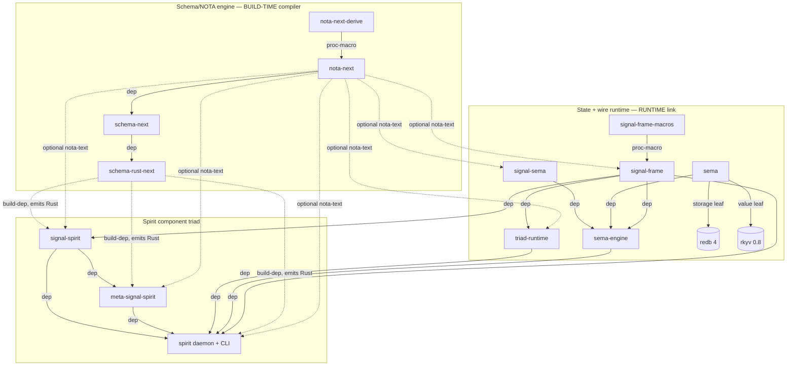
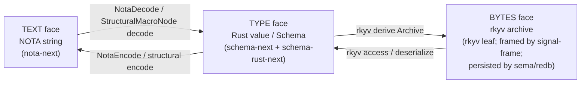
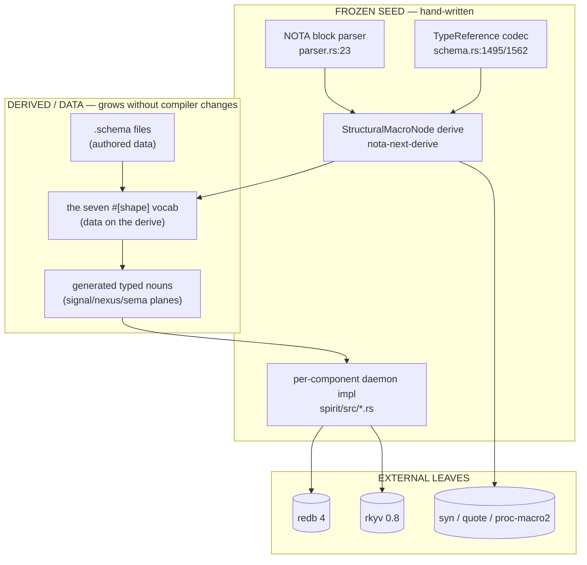
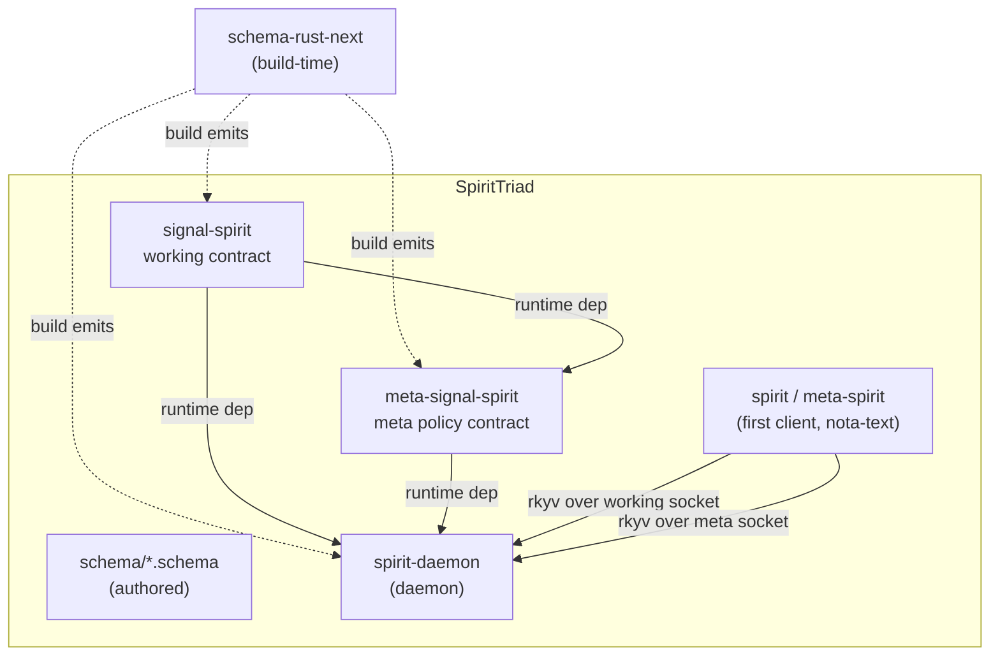

# Layer 7 — Cartography: the dependency DAG, the three faces, the seed/self-host boundary, the component triad

*Cross-cutting map of the Spirit engine ecosystem. Every edge in this report is
read directly from a `Cargo.toml` under `/git/github.com/LiGoldragon/<repo>`;
every mechanism claim cites file:line. VERIFIED means read from source in this
session; INFERRED means reasoned from verified facts plus workspace intent.*

## The shape of the stack in one breath

Ten crates form two halves joined at one seam. The **schema/NOTA engine** half
(`nota-next` → `schema-next` → `schema-rust-next`) is a *build-time* compiler: it
turns authored `.schema` text into checked-in Rust. The **state+wire runtime**
half (`signal-frame`, `signal-sema`, `sema-engine`, `triad-runtime`, and the
`sema`/`redb` leaves) is *runtime*: it carries typed binary frames over Unix
sockets and folds them into a durable log. `spirit` (+ `signal-spirit` +
`meta-signal-spirit`) is the exemplar component that consumes both halves — the
engine through `[build-dependencies]`, the runtime through `[dependencies]`.

The pivot is `schema-rust-next`: it appears in **`[build-dependencies]` only**
(spirit:84, signal-spirit:33, meta-signal-spirit:29). The schema compiler runs in
`build.rs`, emits Rust, and then vanishes — no component binary links it. That is
the structural expression of "recompiling is cheap" (workspace INTENT §"Recompiling
is cheap"): vocabulary lives in compiled schema, grown by recompile, not runtime
config.

## The VERIFIED full dependency DAG

Edges are labelled by the `Cargo.toml` table they were read from. `[dependencies]`
= runtime link (solid). `[build-dependencies]` = build-time only (dashed).
`optional = true` / behind a feature = dotted. `[dev-dependencies]` are noted in
the table but kept out of the runtime/build DAG (they don't ship).

| From | To | Table | Kind | Note |
|---|---|---|---|---|
| nota-next | nota-next-derive | `[dependencies]` (path) | build of derive macro | the one derive |
| nota-next | rkyv 0.8 | `[dependencies]` | runtime | leaf |
| nota-next-derive | proc-macro2 / quote / syn | `[dependencies]` | proc-macro | seed derive impl |
| schema-next | nota-next | `[dependencies]` | runtime | structural codec |
| schema-next | blake3 | `[dependencies]` | runtime | content-hash identity |
| schema-next | rkyv 0.8 | `[dependencies]` | runtime | `Schema` rkyv image |
| schema-rust-next | schema-next | `[dependencies]` | runtime (of the codegen lib) | reads typed `Schema` |
| schema-rust-next | quote / proc-macro2 / syn / prettyplease | `[dependencies]` | token emission | not string codegen |
| schema-rust-next | nota-next / rkyv / sema-engine / signal-frame / triad-runtime | `[dev-dependencies]` | test-only | fixtures `include!` generated src |
| signal-frame | signal-frame-macros | `[dependencies]` (path) | proc-macro | `signal_channel!` |
| signal-frame | rkyv / paste / thiserror | `[dependencies]` | runtime | envelope mechanics |
| signal-frame | nota-next | `[dependencies]`, `optional` | runtime, feature `nota-text` | edge projection |
| signal-sema | rkyv / thiserror | `[dependencies]` | runtime | payloadless op labels |
| signal-sema | nota-next | `[dependencies]`, `optional` | feature `nota-text` | edge projection |
| sema | redb 4 | `[dependencies]` | runtime | **storage leaf** |
| sema | rkyv 0.8 | `[dependencies]` | runtime | value leaf |
| sema-engine | sema | `[dependencies]` | runtime | kernel handle |
| sema-engine | signal-sema | `[dependencies]`, `default-features=false` | runtime | op vocabulary |
| sema-engine | signal-frame | `[dependencies]`, `default-features=false` | runtime | frame types |
| sema-engine | blake3 / rkyv | `[dependencies]` | runtime | family/log identity |
| triad-runtime | signal-frame | `[dependencies]` | runtime | rkyv frame transport |
| triad-runtime | kameo 0.20 | `[dependencies]` | runtime | actor runtime |
| triad-runtime | tokio / rustix | `[dependencies]` | runtime | async + Unix socket |
| triad-runtime | nota-next | `[dependencies]`, `optional` | feature `nota-text` | mirrors emitted gate |
| signal-spirit | signal-frame | `[dependencies]`, `default-features=false` | runtime | frame substrate |
| signal-spirit | version-projection | `[dependencies]`, `default-features=false` | runtime | adjacent-version policy |
| signal-spirit | nota-next | `[dependencies]`, `optional` | feature `nota-text` | CLI text face |
| signal-spirit | schema-rust-next | **`[build-dependencies]`** | **build-time** | generates contract Rust |
| meta-signal-spirit | signal-spirit | `[dependencies]`, `default-features=false` | runtime | shares ordinary nouns |
| meta-signal-spirit | signal-frame | `[dependencies]`, `default-features=false` | runtime | frame substrate |
| meta-signal-spirit | nota-next | `[dependencies]`, `optional` | feature `nota-text` | meta CLI text face |
| meta-signal-spirit | schema-rust-next | **`[build-dependencies]`** | **build-time** | generates meta contract Rust |
| spirit | sema-engine | `[dependencies]` | runtime | durable store |
| spirit | signal-frame | `[dependencies]` | runtime | frame substrate |
| spirit | triad-runtime | `[dependencies]` | runtime | runner/listener |
| spirit | signal-spirit | `[dependencies]` | runtime | ordinary contract |
| spirit | meta-signal-spirit | `[dependencies]` | runtime | meta contract |
| spirit | nota-next | `[dependencies]`, `optional` | feature `nota-text` | CLI binaries only |
| spirit | signal-agent | `[dependencies]`, `optional` | feature `agent-guardian` | guardian calls |
| spirit | sema-engine-previous / sema-engine-layout3 | `[dependencies]`, `optional`, **rev-pinned** | feature `production-migration` | old engine generations for migration fold |
| spirit | schema-rust-next | **`[build-dependencies]`** | **build-time** | generates nexus/sema/daemon Rust |

Solid = runtime link, dashed = build-time only, dotted = optional/feature. Note
the engine subgraph (top) connects to the triad subgraph **only** through the
three dashed `schema-rust-next` build edges and the optional `nota-text` edges —
proof the compiler does not ship in any binary.

### rkyv / redb leaves and the optional/feature edges

- **rkyv 0.8** is the universal byte serializer: every crate in the stack
  declares it with the identical feature set (`std`, `bytecheck`,
  `little_endian`, `pointer_width_32`, `unaligned`) — e.g. nota-next:17,
  schema-next:18, sema:12, sema-engine:17, signal-frame:26, triad-runtime:19,
  spirit:63. Identical features matter: rkyv archives are only interchangeable
  across crates when layout features agree. (VERIFIED.)
- **redb 4** appears in exactly one crate: `sema` (sema/Cargo.toml:11). It is the
  irreducible storage leaf; `sema-engine` reaches it only through `sema`
  (sema-engine:18). No other crate in the stack touches redb. (VERIFIED.)
- **`nota-text` is the recurring optional edge.** signal-frame:24, signal-sema:20,
  triad-runtime:22, signal-spirit:27, meta-signal-spirit:24, and spirit:62 all
  declare `nota-next` as `optional = true`, gated behind a `nota-text` feature
  whose default is **off** (signal-frame:19-20, signal-sema:16-17,
  triad-runtime:14-15, signal-spirit:18-19, spirit:50-51). spirit's `nota-text`
  fans the feature into its dependencies: `["dep:nota-next",
  "signal-spirit/nota-text", "meta-signal-spirit/nota-text"]` (spirit:51). This
  is the third face being made optional — see below.
- **Other feature edges on spirit:** `agent-guardian` pulls optional
  `signal-agent` (spirit:52, :76); `production-migration` pulls two **rev-pinned**
  past generations of `sema-engine` (`sema-engine-previous` @ `ebee6e4`,
  `sema-engine-layout3` @ `dbe2942`; spirit:53, :68-74) so the migration fold can
  read stores the current engine refuses to open. These are the only rev-pins in
  the stack; everything else floats `branch = "main"`. (VERIFIED.)

## The three faces

The stack's deepest idea — "a language is data" (INTENT §"A language is data") —
is that **one value wears three faces** and round-trips losslessly between them.
The same datum is simultaneously a NOTA text string, a typed Rust value, and an
rkyv byte archive. Each face is owned by a definite crate, and the conversions
are typed, not stringly.

| Face | What it is | Owning crate | Produced by / converted by |
|---|---|---|---|
| **Text (NOTA)** | bare-atom / bracket / pipe NOTA string | `nota-next` | `NotaEncode`/`NotaDecode` traits + the block `Parser` (nota-next/src/parser.rs:23 `Document::parse`); structural matching in `macros.rs` |
| **Type (schema)** | a Rust type whose *shape is the grammar* | `schema-next` (the typed `Schema` model) emitted into concrete component Rust by `schema-rust-next` | `#[derive(StructuralMacroNode)]` (decode/encode) for shape; `LowerToRust` token emission for the concrete Rust type |
| **Bytes (rkyv)** | length-prefixed canonical rkyv archive | `rkyv` 0.8 (leaf), framed by `signal-frame`, persisted by `sema`/`sema-engine` | `#[derive]`d rkyv `Archive`; framed in transit, folded to redb at rest |

The crucial property: **text↔type is bidirectional** (an *in/out codec*, not a
one-way parser — spirit INTENT §"Rust data types are generated", schema-next
INTENT §"Authored schema is its own typed value"). The structural macro node
derive emits *both* a decoder and an encoder, so `.schema` sugar and other NOTA
dialects stay "specialized NOTA rather than one-way lowering languages"
(nota-next INTENT, lines 91-94). And **type↔bytes is the rkyv derive**: the type
face is what gets `#[derive(Archive)]`d into the byte face. So the three faces
form a triangle, all edges bidirectional, all typed.

Where each face lives in motion: the **text face is the CLI edge only** (the
`spirit`/`meta-spirit` binaries require `nota-text`; spirit:18, :32), the **byte
face is the process boundary** (daemon ↔ CLI over the rkyv Unix socket; spirit
INTENT line 17 — the daemon binary must not link `nota-next`, asserted by a
`cargo tree` test), and the **type face is everywhere** (every component is built
out of generated typed nouns). (VERIFIED from Cargo manifests + INTENT.)

## The seed / self-host boundary — where the stack bottoms out

"Extensibility stays typed and safe down to a small frozen seed — the NOTA parser
and one derive" (INTENT §"A language is data"; structural-forms.md line 21). The
seed is the irreducibly hand-written core; everything above it is data or derived.
Verified seed inventory:

| Seed element | Where | Why irreducible |
|---|---|---|
| NOTA block parser | `nota-next/src/parser.rs` (902 lines; `Document::parse` at :23) | turns raw bytes into delimiter-balanced blocks + spans — the bottom of text; nothing below to derive it from |
| The **one derive** | `nota-next-derive` (proc-macro crate; derive/Cargo.toml:12 `proc-macro = true`) | `#[derive(StructuralMacroNode)]` is the bootstrap that lets every *other* shape be data; the derive itself is hand-written `quote!`/`syn` |
| `TypeReference` top-level codec | `schema-next/src/schema.rs:1495` (`impl NotaDecode`), :1562 (`impl NotaEncode`) | registry- and context-aware meaning resolution — a permanent shape↔meaning border, not a seed to shrink (structural-forms.md lines 88-96) |
| Each component's daemon impl | `spirit/src/daemon.rs`, `nexus.rs`, `engine.rs`, `store/`, etc. | the hand-written runtime behavior the generated nouns are dispatched into; small, but real |

The `TypeReference` codec is the sharpest part of the boundary. It is *not* fully
hand-rolled — it delegates to three structural-macro seams and stays thin:

- the built-in head fast path (scalars `String`/`Integer`/`Boolean`/`Path`,
  `Vector`/`Map`/`Optional` — schema-next INTENT lines 17-34);
- the `#[shape(pascal_head, body)]` `ApplicationNode` seam for generic
  application `(Name Param …)` (schema.rs:1337-1341), reused even by
  `DeclarationHead::from_parameterized` (schema.rs:1395-1397);
- the `#[shape(head = "Bytes", atom)]` `FixedBytesNode` / `HeadedAtom` seam for
  `(Bytes N)` (schema.rs:1345-1349).

So even the meaning border is *built out of* the derived shape vocabulary; the
hand-written part is only the registry/context dispatch. (VERIFIED.)

**Where it bottoms out:** text bottoms at `nota-next/src/parser.rs` (block
grammar); shape bottoms at `nota-next-derive` (the one proc-macro); meaning
bottoms at the per-consumer top-level codec like `TypeReference` in schema-next;
storage bottoms at `redb 4` inside `sema`; serialization bottoms at `rkyv 0.8`.
Three of those five are external crates (redb, rkyv, and the proc-macro toolchain
syn/quote); the genuinely *Spirit-authored* irreducible seed is just the NOTA
block parser, the one derive, and each component's small daemon impl.

## The component-triad model

Per AGENTS.md §"Component triad", a component is three repos: `<component>`
(daemon + bundled thin CLI), `signal-<component>` (working contract), and
`meta-signal-<component>` (meta policy contract). **The CLI is the daemon's first
client, not a fourth triad leg.** Verified for spirit and confirmed by the same
manifest pattern across the active-repositories map:

| Component | Daemon repo | Working contract | Meta contract | CLI (first client) |
|---|---|---|---|---|
| **spirit** | `spirit` (bins: `spirit-daemon`, spirit:26) | `signal-spirit` | `meta-signal-spirit` | `spirit` + `meta-spirit` bins (spirit:16-32, require `nota-text`) |
| introspect | `introspect` | `signal-introspect` | `meta-signal-introspect` | bundled CLI (per active-repos) |
| message | `message` (+ `message-daemon`) | `signal-message` | `meta-signal-message` | `message` CLI |
| router | `router` | `signal-router` | `meta-signal-router` | bundled CLI |
| mind | `mind` | `signal-mind` | `meta-signal-mind` | bundled CLI |
| terminal | `terminal` | `signal-terminal` | `meta-signal-terminal` | bundled CLI |
| repository-ledger | `repository-ledger` | `signal-repository-ledger` | `meta-signal-repository-ledger` | bundled CLI |

The triad's wiring (VERIFIED for spirit): the two contract crates each take
`schema-rust-next` as a **build-dependency** (signal-spirit:33,
meta-signal-spirit:29) and emit their Rust from `schema/signal.schema` +
`schema/domain.schema`; `meta-signal-spirit` *runtime-depends on* `signal-spirit`
(meta-signal-spirit:23) so the meta contract shares the ordinary nouns rather than
re-declaring them. The daemon (`spirit`) runtime-depends on **both** contracts
(spirit:77-78) plus the runtime trio (`sema-engine`, `signal-frame`,
`triad-runtime`; spirit:66, :75, :81), and build-depends on `schema-rust-next`
(spirit:84) to generate its daemon-local `nexus`/`sema`/daemon Rust. The `links`
keys (`links = "signal-spirit"`, signal-spirit:10; `links =
"meta-signal-spirit"`, meta-signal-spirit:10) declare the native build artifacts
so Cargo enforces single-version linkage.

The two-socket shape is intent-backed: every component "needs a meta slot because
configuration and policy authority must not live on the ordinary working signal"
(spirit INTENT line 194, Spirit `pb1g`). The daemon serves a working listener and
a *required* meta listener; `None` meta socket is rejected with `MissingMetaSocket`
(spirit INTENT lines 197-201). The daemon takes exactly one argument — a binary
rkyv `SpiritDaemonConfiguration` — and never parses NOTA (spirit INTENT line 192;
AGENTS.md §"Component processes take exactly one argument").

## Notable, sharp facts

1. **The compiler never ships.** `schema-rust-next` is build-dep-only in all three
   spirit crates (spirit:84, signal-spirit:33, meta-signal-spirit:29). The schema
   engine half and the runtime half are joined *only* at build time + the optional
   text face — verifiable from the manifests alone.
2. **One redb in the whole stack.** Only `sema` links redb (sema:11); `sema-engine`
   reaches it transitively. There is no shared storage daemon — each component owns
   its own redb (INTENT §"Current Truth Pins: State").
3. **The text face is structurally removable.** `nota-text` defaults off in 6
   crates; the daemon binary is tested to *not* contain `nota-next` while the CLI
   must (spirit INTENT line 17). The "language is data" stack can run with its
   language face compiled out.
4. **rkyv feature parity is load-bearing and uniform.** All 10 crates pin the exact
   same rkyv feature set; a divergence would silently break archive interchange.
5. **The seed is smaller than it looks.** Of five "bottom" points, three are
   external crates (redb, rkyv, syn/quote). The genuinely hand-written Spirit seed
   is the ~902-line NOTA parser, one proc-macro derive, the per-consumer
   `TypeReference`-style top-level codec, and each daemon's small impl — and even
   the `TypeReference` codec is mostly *derived* shape seams (schema.rs:1337-1349),
   with hand-writing confined to meaning/registry dispatch.
6. **Migration carries rev-pinned ghosts.** spirit is the only crate that rev-pins
   dependencies — two frozen past `sema-engine` generations (spirit:68-74) behind
   `production-migration` — because the log-fold migration must read stores the
   current engine refuses to open (spirit INTENT lines 174-190, Spirit `t0tu`).
7. **`schema-next` emits no Rust.** It owns the typed `Schema` model and the
   content-hash identity (blake3, schema-next:16); Rust emission is exclusively
   `schema-rust-next` via `quote!`/`prettyplease` token output, not string codegen
   (schema-rust-next:16-20).

*Scope note (INFERRED for non-spirit triads): the triad table's working/meta/CLI
columns for introspect, message, router, mind, terminal, repository-ledger are
read from the active-repositories map, not from each manifest in this session; the
spirit row is fully VERIFIED from manifests.*
