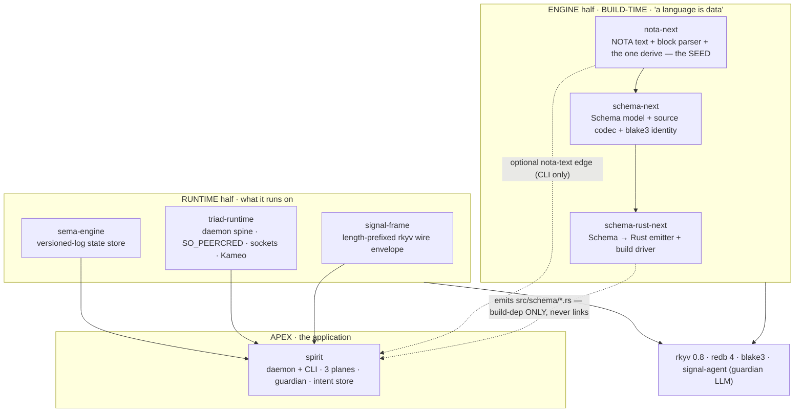
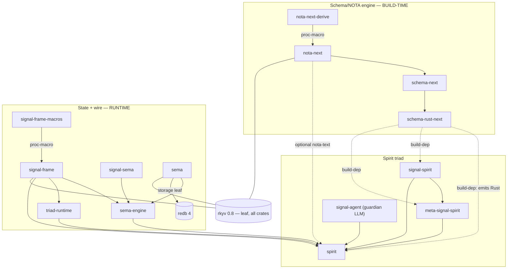
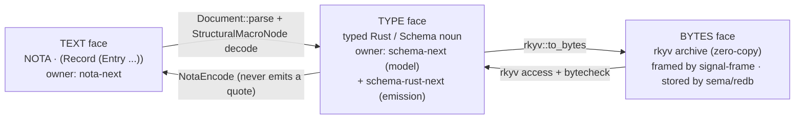
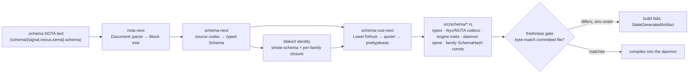
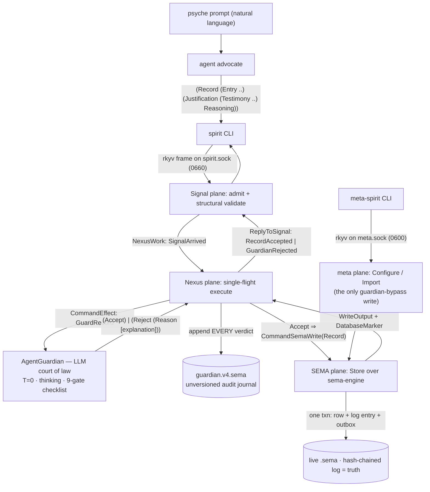
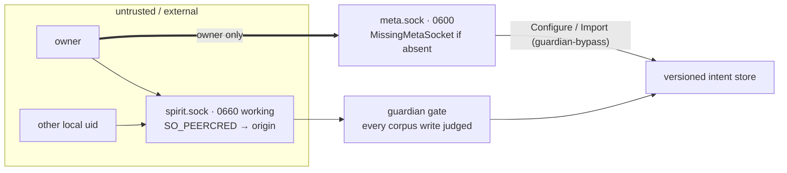
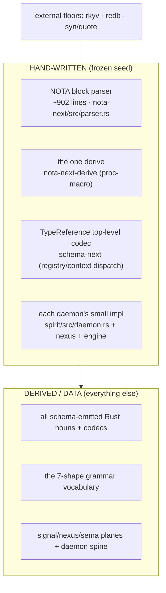

# 651.8 — Synthesis: the Spirit engine, woven

The seven layer reports (`1`–`7`) dissect each part; this file re-assembles them into
one picture with the master multi-layer visuals. The thesis the stack proves:
**Spirit is not written, it is *grown*** — a tiny hand-authored seed (a NOTA parser +
one derive) lets a language describe itself as data, a compiler turns that data into
the Rust of a daemon, and the daemon runs on a versioned-log state engine whose
truth is a hash chain. "Analyse Spirit" = analyse that pipeline.

## The two halves and the apex

Spirit sits at the top of two independent halves that meet at exactly two points —
**build time** (the engine emits Spirit's Rust) and one optional **text edge**
(`nota-text`). Everything else is runtime.

| # | Layer | Crate(s) | Face it owns | One load-bearing fact |
|---|---|---|---|---|
| 1 | Text + derive seed | `nota-next` | **text** | The expected *type* IS the parse position — no global parser registry; the codec cannot emit a `"`. |
| 2 | Schema model + codec | `schema-next` | **type** | blake3 identity is over canonical rkyv of the *parsed model*, never the text → semantic losslessness. |
| 3 | Rust emission + build | `schema-rust-next` | **generator** | Token-first (`quote!`+`prettyplease`); the committed `*.rs` *is* the version-control surface. |
| 4 | State engine + families | `sema-engine`, `sema`, `signal-sema` | **state/bytes** | The hash-chained log is truth; redb tables are a rebuildable view (Spirit `iir4`). |
| 5 | Wire + daemon spine | `signal-frame`, `triad-runtime` | **wire** | Authority = SO_PEERCRED + socket mode, never payload; one rkyv-arg startup. |
| 6 | The application | `spirit` (+ `signal-spirit`, `meta-signal-spirit`) | **apex** | Every corpus write is judged by an LLM **court of law**; verdict strictly binary. |
| 7 | Cartography | (cross-cutting) | **map** | The schema compiler is build-dep-only — it *structurally never ships* in any binary. |

## Verified dependency DAG (build-time dotted, runtime solid)

The pivot the cartography pins: **`schema-rust-next` is build-dependency-only in all
three spirit crates.** The engine half and the runtime half join *only* at build time
(plus the optional text edge), so the schema compiler never links into a shipped
binary. `redb` is linked by exactly one crate (`sema`); every component owns its own
store. `rkyv 0.8` is a leaf under all ten crates with an *identical* feature set —
load-bearing, because rkyv archives only interchange when layout features agree.

## The three faces — one value, three representations

A Spirit value (a record, a frame, a stored row) exists in three forms, each owned by
a different crate, losslessly convertible:

The text face is **structurally removable**: `nota-text` is off by default in six
crates, and Spirit's *daemon* binary is tested to not contain `nota-next` while the
*CLI* must. A "language is data" stack that can compile its own language face out —
text is an edge projection, rkyv is the universal interior.

## Build time — how Spirit is generated

The committed `src/schema/*.rs` *is* the version-control surface: each family's
schema hash is a pinned `blake3` constant in checked-in source, so the ordinary
byte-for-byte freshness check **doubles as a schema-drift detector** with zero extra
machinery. (This session's positional-syntax cascade — report `648` — is exactly an
exercise of this: the migration was proven semantically lossless because every
regenerated artifact came out byte-identical.)

## Runtime — a record's lifecycle (psyche intent → durable bytes)

Two things make this trustworthy *structurally*, not by hope: (1) the closed
rejection-reason set and the verdict grammar are **rendered from the Rust enum via
`NotaEncode`**, so the guardian prompt cannot drift from the wire type the daemon
parses; (2) empty testimony is a deterministic reject *before the model is called*,
and an absent-but-required guardian **fails closed** and journals the auto-reject.
The verdict is strictly binary — the judge never edits a magnitude — because
under-admitting is recoverable but a corrupted intent layer is not.

## Trust depth — the process boundary

Authority rests on **socket file mode + SO_PEERCRED**, never on payload fields. The
one guardian-bypassing write path (`Import`) exists *only* behind the owner-only 0600
meta socket; the working signal stays fully gated.

## The self-host seed — where the stack bottoms out

Even the one place that *looks* like it must be hand-written — `TypeReference`, the
shape↔meaning border — is **mostly derived**: it delegates to `#[shape(pascal_head,
body)]` and `#[shape(head=Bytes, atom)]` seams, and hand-writing is confined to the
registry/context *meaning* dispatch that a pure context-free function cannot model.
The Spirit-authored irreducible core is small: a ~900-line parser, one derive, a
thin per-component codec/daemon impl. That smallness is the whole point of "a
language is data."

## Cross-cutting truths

- **Identity is the spine.** blake3 over canonical rkyv appears at two levels —
  schema-next's per-family closure hash (the migration address) and sema-engine's
  hash-chained `EntryDigest` log (the integrity chain). Versioning, drift-detection,
  and semantic-losslessness all ride one mechanism.
- **The type is the parser, the schema is the program.** A consumer decodes by asking
  a *known type* to try its ordered structural variants; grammar lives in the type,
  not a central parser. Schema sugar is specialised NOTA that round-trips, not a
  one-way lowering.
- **rkyv is the interior, NOTA is the edge.** Every interior hop (wire, storage) is
  rkyv bytes; text exists only at the human/CLI boundary and can be compiled out.
- **Spirit is the exemplar.** It is the one component that exercises both halves and
  fully instantiates the triad (`spirit` + `signal-spirit` + `meta-signal-spirit`,
  CLI as first client). It is the template the next component stack copies.

## Attention flags surfaced by the deep-read

These are real findings worth the psyche/operator eye (each detailed in its layer):

1. **Working-socket mode divergence (`5`).** Intent says 0660 working / 0600 meta,
   but Spirit's *emitted* binder hardcodes only meta `0o600` and leaves the working
   socket umask-derived (the runtime *can* apply a mode; the emitter passes none).
   Worth confirming 0660-on-working should be the emitted default.
2. **TypeReference dispatch-order fragility (`2`).** The parenthesis-reference
   disambiguation (built-in head → registered macro → `Application` fallback) is
   deliberately *not* compiler-checked (the broad application form overlaps every
   PascalCase head) and is pinned only by tests. A real fragility surface.
3. **Open self-host violations (`2`, `3`).** schema-next's own macro library still
   hand-parses above the structural floor (declared a violation to fix, Spirit
   `v0n6`); the daemon meta/upgrade tiers remain typed escape hatches until the shape
   carries a meta/upgrade contract path.
4. **Guardian over-training (`6`).** The guardian's few-shot examples are drawn from
   this workspace's own design decisions — the judge is trained on the very intent
   that built it. Powerful, but a coupling to watch.

## Map of this meta-report

`0` frame · `1` nota-next (text/seed) · `2` schema-next (model/codec) · `3`
schema-rust-next (emission) · `4` sema-engine (state) · `5` signal-frame +
triad-runtime (wire/spine) · `6` spirit (application) · `7` cartography · **`8` this
synthesis**.
