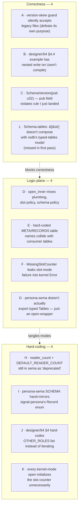
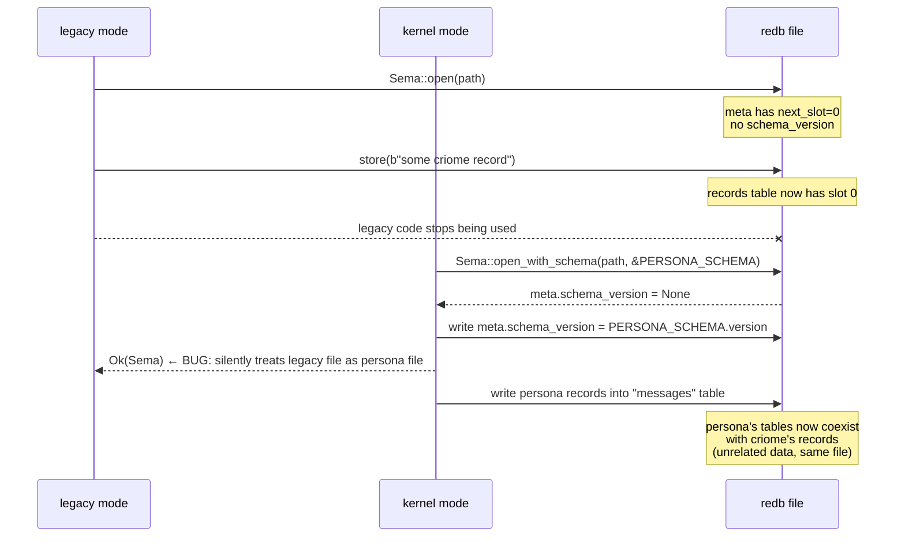

# 66 · Skeptical audit — sema kernel + persona-sema work

Status: critical pass over the work landed in this session
(commits `1bf21084` sema kernel, `363d5fa9` persona-sema,
`e2e8e1d0` architecture report) against three criteria:
**correctness**, **logic-plane separation**, and **simple
code (no hard-coding; let input data drive the engine)**.

The audit found **four correctness issues, four
logic-plane violations, and four hard-coding smells**. One
correctness issue (A) is a security-shaped silent-fail —
the version-skew guard doesn't actually fire when a file
was created by the legacy `Sema::open(path)` path. Another
(L, added on user push-back) is more fundamental: **the
`Schema { tables: &[&str], … }` shape doesn't compose with
how redb actually works** — redb tables are typed `(K, V)`,
not just named, and pre-creating with hard-coded
`K = &str` locks out every consumer that wants different
key types.

That second one — the schema-shape one — is a bug the
*first pass* of this audit missed. The audit framed itself
as skeptical but accepted the Schema shape as given. A
genuinely skeptical pass would have asked: *does
list-of-names compose with redb's typed-tables model?* It
doesn't. Section §1.5 below names the issue and how it
surfaced.

Author: Claude (designer)

---

## 0 · TL;DR



| Severity | Count | Examples |
|---|---:|---|
| Correctness — must fix | 4 | A, B, C, **L** |
| Logic-plane — should fix | 4 | D, E, F, G |
| Hard-coding — fix when extending | 4 | H, I, J, K |

---

## 1 · Correctness issues

### A · The version-skew guard silently accepts legacy files

**The bug** (`sema/src/lib.rs`, `ensure_schema_version`):

```rust
fn ensure_schema_version(meta: &mut redb::Table<'_, &str, u64>, expected: SchemaVersion) -> Result<()> {
    let stored = meta.get(SCHEMA_VERSION_KEY)?.map(|guard| guard.value());
    match stored {
        Some(value) => { /* check or fail */ }
        None => {
            meta.insert(SCHEMA_VERSION_KEY, expected.0 as u64)?;   // ← silently writes
        }
    }
    Ok(())
}
```

The guard treats *"no stored version"* as *"first open ever, write the new version"*. But a file created with the **legacy** `Sema::open(path)` ALSO has no stored version — and the legacy mode never writes one.

**Consequence:**



A persona-sema instance pointed at criome's records file would *succeed* and start writing persona tables alongside criome's slot store. No error, no warning. The two consumers' data is now in the same file, the version guard claims they match, and the next read of a "criome record" via persona-sema's typed table API would fail in a different (less informative) way downstream.

**The intent** of the guard is to make schema mismatches a coordinated upgrade, not a silent migration. The current code defeats that intent for the most likely real case: an existing legacy file gets reopened with a typed schema.

**Fix candidate** — distinguish "file exists" from "file is empty":

```rust
fn ensure_schema_version(meta: &mut redb::Table<'_, &str, u64>, expected: SchemaVersion, is_fresh_file: bool) -> Result<()> {
    let stored = meta.get(SCHEMA_VERSION_KEY)?.map(|guard| guard.value());
    match (stored, is_fresh_file) {
        (Some(value), _) => {
            let found = SchemaVersion(value as u32);
            if found != expected {
                return Err(Error::SchemaVersionMismatch { expected, found });
            }
        }
        (None, true) => meta.insert(SCHEMA_VERSION_KEY, expected.0 as u64)?,
        (None, false) => return Err(Error::LegacyFileLacksSchema { expected }),
    }
    Ok(())
}
```

Plus an explicit `Error::LegacyFileLacksSchema` variant so the failure mode names what happened.

The "is_fresh_file" detection: check `path.exists()` *before* `Database::create`. If the file was missing, it's fresh; if it was there, the existing-file-without-version branch fires.

**Severity: critical.** Silent acceptance of mismatched files is exactly the security-shaped failure the guard exists to prevent.

### B · `designer/64 §4.4` — speculative code has nested write txn (won't compile)

The architecture report's persona-orchestrate sketch:

```rust
pub fn claim(...) -> Result<ClaimOutcome> {
    self.sema.write(|txn| {
        // ... inside an outer write txn ...
        self.sema.store(&claim_event_bytes(...))?;   // ← opens its OWN write txn
        Ok(ClaimOutcome::Claimed)
    })
}
```

`Sema::store(&[u8])` opens its own `begin_write()` internally
(per `sema/src/lib.rs:325`). Calling it from inside another
`begin_write` would either deadlock (if redb's locking is
exclusive) or fail at txn-begin (most likely).

**Implication:** the design in §4.4 *as written* doesn't work. The audit log can't piggyback on the legacy slot store from inside a typed write txn.

**Two fix paths:**

1. **Audit log as a typed table** (recommended) — declare
   `CLAIM_LOG: Table<u64, ClaimEvent> = Table::new("claim_log")` with a manually-incremented key (the kernel exposes a counter helper) and use it inside the same write txn.
2. **Kernel exposes "allocate slot inside existing txn"** — add `Sema::store_in(txn: &WriteTransaction, bytes: &[u8])` so the legacy slot store can compose with typed-table writes.

Either way, designer/64 §4.4 needs a follow-up to fix the worked example code. **Severity: high** for the report's correctness; doesn't affect already-shipped sema/persona-sema code (which doesn't have this problem).

### C · `SchemaVersion(pub u32)` — pub field violates the rule I just landed

`sema/src/lib.rs:136`:

```rust
pub struct SchemaVersion(pub u32);
```

I literally landed `skills/rust-discipline.md` §"No crate-name prefix on types" + `skills/naming.md` §"Anti-pattern: prefixing type names with the crate name" earlier this session. I also re-read `skills/rust-discipline.md` §"Domain values are types, not primitives" and `skills/abstractions.md` §"Companion disciplines" both of which name `pub` field on a wrapper newtype as the canonical anti-pattern.

Then I wrote a `pub` field on the very next newtype I added.

**The fix** — make the field private; expose conversions:

```rust
pub struct SchemaVersion(u32);

impl SchemaVersion {
    pub const fn new(value: u32) -> Self { Self(value) }
    pub const fn value(self) -> u32 { self.0 }
}
```

Same fix needed for `Schema { pub tables, pub version }` arguably (config-like structs are borderline; the rule's spirit applies). Keep `Schema`'s pub fields if treating it as a manifest-shaped const declaration; tighten them if the design wants `Schema` to be opaque.

**Severity: high** — I violated my own newly-landed rule in the same session, in code that's now public API. Fixing this is a breaking change.

### L · `Schema { tables: &[&str], ... }` doesn't compose with redb's typed-tables model

**Surfaced via user push-back after the first pass of this
audit shipped.** The first pass missed it. Fixing.

**Redb's actual model:** a table is uniquely identified by
`(name, key_type, value_type)`. Opening a table with a
mismatched type after it already exists with different
types **errors**. `TableDefinition::new("foo")` is
incomplete on its own — you need the full `TableDefinition<K, V>`
to actually open or create.

**What the kernel's `open_inner` does today:**

```rust
for table_name in schema.tables {
    let definition: TableDefinition<&str, &[u8]> = TableDefinition::new(table_name);
    let _ = transaction.open_table(definition)?;
}
```

It pre-creates every declared table with hard-coded
`K = &str, V = &[u8]`. That **locks out** any consumer
that later wants `Table<u64, …>`, `Table<(u32, u32), …>`,
etc. Redb refuses because the table already exists with
`&str` keys.

For persona-sema today this hasn't bitten yet because the
SCHEMA list exists but no typed `Table` constants
reference it. The moment a consumer actually declares
`Table<u64, Message>`, it fails at open-table time.

**Three reasons the design is wrong:**

1. **Redb already auto-creates tables on first
   `open_table`.** The "ensure tables" step is redundant —
   first use creates them, with the right types,
   automatically.
2. **The schema-as-list-of-strings adds zero typing.** A
   bare name doesn't know what kind of table it is. The
   consumer's typed `Table<K, V>` constant IS the real
   schema; the string list duplicates the names without
   the type information.
3. **It silently commits to wrong types** for tables that
   haven't been used yet but exist in the file.

**Fix:** drop `tables: &[&str]` from `Schema` entirely:

```rust
pub struct Schema {
    pub version: SchemaVersion,
}
```

Then `open_with_schema` just checks the version. Tables
get created lazily on first `Table<K, V>::get`/`insert`
with the consumer's actual K and V types.

Persona-sema's SCHEMA becomes simply:

```rust
pub const SCHEMA_VERSION: SchemaVersion = SchemaVersion(1);
pub const SCHEMA: Schema = Schema { version: SCHEMA_VERSION };
```

The 6 table NAMES belong with the typed Table constants
where they live alongside their K/V types — which is the
missing work item G ("persona-sema doesn't actually export
typed Tables").

**Severity: critical.** The current code blocks the
load-bearing use case (persona-sema's actual table
layouts) while looking like it works.

**Process note:** the first pass of this audit (above)
listed 11 issues, framed itself as skeptical, and missed
this one because it accepted the Schema-shape as given
rather than asking *does this match how redb actually
works?* The user's pointed question — *"is this how
redb+rkyv works?"* — was the right level of scrutiny.
Adding "did I question the framing itself?" to the
audit-checklist for next time.

---

## 2 · Logic-plane separation issues

### D · `Sema::open_inner` mixes three concerns in one function

```rust
fn open_inner(path: &Path, schema: Option<&Schema>) -> Result<Self> {
    if let Some(parent) = path.parent() { std::fs::create_dir_all(parent)?; }     // filesystem
    let database = Database::create(path)?;                                       // storage
    let transaction = database.begin_write()?;
    {
        let mut meta = transaction.open_table(META)?;
        if meta.get(NEXT_SLOT_KEY)?.is_none() {                                   // slot-store policy
            meta.insert(NEXT_SLOT_KEY, 0u64)?;
        }
        let _ = transaction.open_table(RECORDS)?;                                 // slot-store policy
        if let Some(schema) = schema {
            Self::ensure_schema_version(&mut meta, schema.version)?;              // schema policy
            drop(meta);
            for table_name in schema.tables {                                     // schema policy
                let definition: TableDefinition<&str, &[u8]> = TableDefinition::new(table_name);
                let _ = transaction.open_table(definition)?;
            }
        }
    }
    transaction.commit()?;
    Ok(Sema { database, path: path.to_path_buf() })
}
```

Three concerns interleaved:

1. **Filesystem + storage** (mkdir, open redb).
2. **Legacy slot-store policy** (init slot counter, touch records table).
3. **Typed-kernel schema policy** (version check, ensure declared tables).

The mixing means a kernel-mode open *also* initializes the legacy slot store — an unwanted coupling (per Issue K below).

**Better separation:**

```rust
fn open_inner(path: &Path, mode: OpenMode) -> Result<Self> {
    let database = Self::open_redb(path)?;
    Self::install_mode(&database, mode)?;
    Ok(Sema { database, path: path.to_path_buf() })
}

fn open_redb(path: &Path) -> Result<Database> { /* mkdir + create */ }

fn install_mode(database: &Database, mode: OpenMode) -> Result<()> {
    let txn = database.begin_write()?;
    match mode {
        OpenMode::Legacy => Self::install_slot_store(&txn)?,
        OpenMode::Typed(schema) => Self::install_schema(&txn, schema)?,
        OpenMode::TypedWithSlots(schema) => {
            Self::install_schema(&txn, schema)?;
            Self::install_slot_store(&txn)?;
        }
    }
    txn.commit()?;
    Ok(())
}
```

The mode is then explicit; consumers that want only typed tables don't get the slot store overhead.

**Severity: medium** — code works, but the mixing is the kind of thing that causes the bugs in §1.

### E · Hard-coded internal table names collide with consumer table names

```rust
const RECORDS: TableDefinition<u64, &[u8]> = TableDefinition::new("records");
const META: TableDefinition<&str, u64> = TableDefinition::new("meta");
```

`"records"` and `"meta"` are sema-internal but live in the
same redb namespace as the consumer's tables. A consumer
that declares a table named `"meta"` in their `Schema` would
collide silently — both `Schema.tables` and the kernel's
`META` constant try to open the same name with different
key/value types.

The sema kernel doesn't reserve these names at the
type-system level, doesn't error if a consumer claims one,
and doesn't namespace them (e.g. `__sema_meta` or
`__sema_records`).

**Fix:** prefix the kernel's internal tables with `__sema_`
or similar. The cost is one rename + a migration story for
existing files (which use the unprefixed names today).

**Severity: medium** — collision is unlikely in practice (no
current consumer uses these names), but the failure mode
when it happens is silent data corruption.

### F · `Error::MissingSlotCounter` leaks slot-mode failure into the universal error type

The `Error` enum has:

```rust
#[error("meta table missing slot counter — sema file may be corrupt")]
MissingSlotCounter,
```

This variant only matters in legacy mode (when `store(&[u8])`
or `iter()` are called). A kernel-mode-only consumer never
encounters it, but their `match err` exhaustive matches
have to handle it anyway.

The two modes have genuinely different failure shapes;
forcing one error enum across them is the kind of coupling
the typed-error discipline (`skills/rust-discipline.md`
§"Errors") exists to prevent.

**Fix candidate:** split into `KernelError` (everything
except MissingSlotCounter) and `LegacyError` (everything
plus MissingSlotCounter). Or accept the coupling as the
price of a single `Sema` handle.

**Severity: low-medium** — small surface; cosmetic mostly.

### G · `persona-sema` doesn't actually export typed Tables

The whole point of persona-sema (as a `<consumer>-sema`
crate) is to be the canonical home for Persona's typed
storage layout. What I shipped:

```rust
// persona-sema/src/lib.rs (current)
pub use error::Error;
pub use schema::{SCHEMA, SCHEMA_VERSION};
pub use store::PersonaSema;
```

```rust
// persona-sema/src/schema.rs
pub const SCHEMA: Schema = Schema {
    tables: &["messages", "locks", "harnesses", "deliveries", "authorizations", "bindings"],
    version: SCHEMA_VERSION,
};
```

The schema declares 6 table names. Zero typed `Table<K, V>`
constants are exported. A consumer who wants to insert a
Message would have to declare:

```rust
// in EVERY consumer that touches messages — defeating persona-sema's purpose
const MESSAGES: Table<&str, signal_persona::Message> = Table::new("messages");
```

Each consumer reinvents the table declaration, with
opportunities to typo the name, mismatch the key type, or
forget a table entirely. **persona-sema as shipped is just
an open-wrapper, not a typed-storage layer.**

**Fix:** persona-sema should export the typed Table
constants:

```rust
// persona-sema/src/tables.rs (proposed)
use sema::Table;
use signal_persona::{Authorization, Binding, Delivery, Harness, Lock, Message};

pub const MESSAGES: Table<&str, Message> = Table::new("messages");
pub const LOCKS: Table<&str, Lock> = Table::new("locks");
pub const HARNESSES: Table<&str, Harness> = Table::new("harnesses");
pub const DELIVERIES: Table<&str, Delivery> = Table::new("deliveries");
pub const AUTHORIZATIONS: Table<&str, Authorization> = Table::new("authorizations");
pub const BINDINGS: Table<&str, Binding> = Table::new("bindings");
```

The bound chain in `sema::Table` requires `V: Archive +
Serialize<...>` and `V::Archived: Deserialize + CheckBytes`.
Verifying signal-persona's records satisfy these bounds is
the work that should land before this report is closed; my
sketched table declarations *might not compile* until the
records' rkyv derive clauses include `bytecheck`.

This is the third consumer-shaped table-layout job on the
operator's punch list (per designer/63 §6 step 8), but my
report claimed persona-sema was "just landed" — a more
honest framing is "the open-handle landed; the typed table
surface is still missing."

**Severity: high** — the load-bearing reason persona-sema
exists isn't yet implemented; the audit-report's claim that
persona-sema is the second consumer overstates the shipping
status.

---

## 3 · Hard-coding smells

### H · `reader_count` + `DEFAULT_READER_COUNT` still hard-coded in sema

```rust
pub const DEFAULT_READER_COUNT: u32 = 4;
```

`4` is criome-specific config baked into sema, in the
deprecated section. The "Deprecated location" docstring
acknowledges it should move to criome but I didn't move it.
The "deprecated" label is a signal, not a removal.

**Fix:** move the constant + the `reader_count` /
`set_reader_count` accessors out of sema entirely (criome
adopts them locally via a private helper that reads its own
meta-namespaced key). Then drop the `READER_COUNT_KEY`
constant from sema's lib.rs.

This is the per-design migration step §6 of designer/63. I
did the design, didn't do the move.

**Severity: medium** — code works, but every kernel-mode
opener carries criome-specific surface as part of the public
API.

### I · persona-sema's `SCHEMA` hand-mirrors `signal-persona`'s `Record` enum

Today persona-sema's table list:

```rust
&["messages", "locks", "harnesses", "deliveries", "authorizations", "bindings"]
```

Signal-persona's `Record` enum:

```rust
pub enum Record {
    Message(Message),
    Authorization(Authorization),
    Delivery(Delivery),
    Binding(Binding),
    Harness(Harness),
    Observation(Observation),  // ← persona-sema is missing this
    Lock(Lock),
    StreamFrame(StreamFrame),  // ← also missing
    Deadline(Deadline),         // ← also missing
    DeadlineExpired(DeadlineExpired),  // ← also missing
    Transition(Transition),     // ← also missing
}
```

**Already inconsistent.** persona-sema's hand-maintained
list is missing 5 of signal-persona's 11 record kinds. That's
a violation of the "domains come from data" rule
(`skills/language-design.md` §15: *"Every list of names,
enum variants, or dispatch table in source code is a bug.
Types are derived from declarative data, never
hand-written."*).

**Fix candidates** (in order of effort):

1. **Build script.** persona-sema's `build.rs` reads
   signal-persona's source (as a build dep), generates
   `tables.rs` from the `Record` enum's variants. Cost:
   build script + build-time signal-persona dep.
2. **Macro.** A proc-macro `#[derive(SemaTables)]` on
   `signal-persona::Record` emits a `pub const TABLES:
   &[&str]` and the typed Table constants. Cost: new
   nota-derive sibling crate.
3. **Runtime registration.** signal-persona exposes a
   `record_kinds() -> &[(&str, &dyn Fn() -> AnyTable)]`
   that persona-sema iterates at open. Cost: trait-object
   gymnastics; loses the const-correctness.

Option 1 is the cleanest. The work belongs in the persona-sema
implementation slice (designer/63 §6 step 8).

**Severity: medium** — the inconsistency is real today; the
fix is non-trivial.

### J · designer/64 §4.4 hard-codes `OTHER_ROLES` list

In the worked-example code for persona-orchestrate:

```rust
for other_role_name in OTHER_ROLES {
```

`OTHER_ROLES` is implied to be a constant. But the role list
is workspace data: today four (operator, designer,
system-specialist, poet); tomorrow five (when the critical-
analysis role lands per primary-9h2). Hard-coding the role
list at the storage layer means every new role requires a
persona-orchestrate code change.

**Better design:** `claim()` reads ALL existing rows from
the `claims` table and checks each for overlap. The role
list IS the data:

```rust
pub fn claim(&self, role: RoleName, scopes: Vec<Scope>) -> Result<ClaimOutcome> {
    self.sema.write(|txn| {
        let mut iter = CLAIMS.iter(txn)?;
        for entry in iter {
            let (peer_name, peer_state) = entry?;
            if peer_name != role.as_str() {
                for scope in &scopes {
                    if peer_state.overlaps(scope) {
                        return Ok(ClaimOutcome::Conflict { with: peer_name.into(), scope: scope.clone() });
                    }
                }
            }
        }
        // ... insert + audit log ...
    })
}
```

(Note: `Table::iter` doesn't exist in the kernel yet — I
should add it. That's a real API gap surfaced by this audit.)

**Fix:** rewrite designer/64 §4.4 to iterate the table
instead of looping over a hard-coded role list. **Severity:
medium** for the design report's quality.

### K · Every kernel-mode open initializes the slot counter unnecessarily

`Sema::open_inner` always:

```rust
let mut meta = transaction.open_table(META)?;
if meta.get(NEXT_SLOT_KEY)?.is_none() {
    meta.insert(NEXT_SLOT_KEY, 0u64)?;
}
let _ = transaction.open_table(RECORDS)?;
```

A consumer that opens with `Sema::open_with_schema` — and
intends to use ONLY typed tables — gets the legacy slot
store initialized in their file anyway. Wasted bytes, wasted
mental model surface (their `next_slot=0` and empty
`records` table forever).

**Fix:** make slot-store init opt-in (per Issue D's `OpenMode`
sketch). Persona-sema doesn't want it; criome does;
persona-orchestrate's audit log might.

**Severity: low** — small overhead, no correctness impact.

---

## 4 · Module layout

`sema/src/lib.rs` is now ~360 LoC. `skills/rust-discipline.md`
§"Module layout" §"Split traits into their own files when
they accumulate" sets the threshold at ~300 LoC. I'm past it.

Five concerns currently in one file:

| Concern | Lines (~) |
|---|---:|
| Slot newtype + From impls | 25 |
| Error enum | 35 |
| Schema + SchemaVersion | 25 |
| Table&lt;K, V&gt; | 90 |
| Sema struct + open + read/write + slot store | 185 |

**Recommended split:**

```
src/
├── lib.rs       — Sema struct + open + read/write closures
├── error.rs     — Error
├── slot.rs      — Slot + slot-store methods + slot-store internal constants
├── schema.rs    — Schema + SchemaVersion + version-skew guard
└── table.rs     — Table<K, V>
```

**Severity: low** — code works; splitting is hygiene, not correctness.

---

## 5 · Summary recommendations

### 5.1 · Must-fix before persona-sema gets its first real consumer

| # | Action | Where | Severity |
|---|---|---|---|
| 0 | Drop `tables: &[&str]` from `Schema`; drop `ensure tables` step from `open_inner`; let redb auto-create on first typed `Table::get/insert` (Issue **L**) | `sema/src/lib.rs` + `persona-sema/src/schema.rs` | **critical** |
| 1 | Fix the version-skew guard's silent-acceptance bug (Issue A) | `sema/src/lib.rs::ensure_schema_version` | critical |
| 2 | Make `SchemaVersion`'s field private (Issue C) | `sema/src/lib.rs:136` | high |
| 3 | Export typed Tables from persona-sema using signal-persona records (Issue G) | new `persona-sema/src/tables.rs` | high |
| 4 | Rewrite designer/64 §4.4 worked-example code to fix nested-write-txn (Issue B) | `reports/designer/64-sema-architecture.md` §4.4 | high |

### 5.2 · Should-fix in the next sema iteration

| # | Action | Severity |
|---|---|---|
| 5 | Namespace internal table names (`__sema_meta`, `__sema_records`) (Issue E) | medium |
| 6 | Add `Table::iter` to enable Issue J's fix and other workloads | medium |
| 7 | Move `reader_count`/`DEFAULT_READER_COUNT` out of sema into criome (Issue H) | medium |
| 8 | Auto-derive persona-sema table list from signal-persona's Record enum (Issue I) | medium |
| 9 | Make slot-store initialization opt-in via OpenMode (Issues D + K) | medium |

### 5.3 · Nice-to-have hygiene

| # | Action | Severity |
|---|---|---|
| 10 | Split sema's lib.rs into error.rs/slot.rs/schema.rs/table.rs/lib.rs (§4) | low |
| 11 | Split kernel/legacy errors into separate enums (Issue F) | low |
| 12 | Add cross-mode failure tests to sema/tests/kernel.rs (legacy file opened in kernel mode → should error after fix #1) | low |
| 13 | Drop `Sema.path: PathBuf` field if not load-bearing | low |

---

## 6 · What this audit got right

The work I shipped does several things the audit affirms:

- **The kernel surface is the right shape.** `Schema +
  Table<K, V> + read/write closures + version-skew guard`
  is the correct decomposition for the workspace's needs.
- **The signal-family naming mirror is correct** —
  `<consumer>-sema` parallel to `signal-<consumer>` is a
  good design call (per designer/63).
- **The tests pass.** 12+8 in sema, 4 in persona-sema, 7
  nix checks each. The visible tests work; the missing
  tests are about un-tested failure paths.
- **The architecture report (designer/64) is genuinely
  useful** for a future agent — clear diagrams, three
  worked examples, prospective design for persona-orchestrate.
  The report's bug (Issue B) is in one example block, not
  in the architecture.

The discipline lapse the audit reveals isn't "wrong
direction" — it's "the kind of details that drift when an
agent ships fast and doesn't read their own diff
critically."

---

## 7 · Process observation

Three of the issues above (A, C, G) would have been caught
by a careful self-read of the diff before commit. Issue C in
particular — `pub u32` on a newtype I added in the same
session that I landed the rule against `pub` newtype fields —
is exactly the kind of thing the workspace's design
discipline exists to prevent. I didn't hold the line on my
own work.

The fix isn't more rules; the fix is *reading the diff
against the rules I just wrote*. Per `skills/operator.md`
§"Read jj st before every commit" — the same discipline
applies to designer-shaped Rust edits, not just to
operator's working-copy hygiene.

Filed as a process note. The "skeptic" pass the user asked
for is the missing self-check.

---

## 8 · See also

- `~/primary/reports/designer/63-sema-as-workspace-database-library.md`
  — the design decision being audited.
- `~/primary/reports/designer/64-sema-architecture.md`
  — the architecture report whose §4.4 carries Issue B.
- `~/git/github.com/LiGoldragon/sema/src/lib.rs` — the code
  carrying issues A, C, D, E, F, H, K.
- `~/git/github.com/LiGoldragon/persona-sema/src/` — the code
  carrying issue G.
- `~/primary/skills/rust-discipline.md` §"Domain values are
  types, not primitives" — the rule Issue C violates.
- `~/primary/skills/rust-discipline.md` §"Errors: typed enum
  per crate via thiserror" — the rule Issue F bends.
- `~/primary/skills/language-design.md` §15 ("Domains come
  from data — never hand-maintained") — the rule Issue I
  violates.

---

*End report.*
