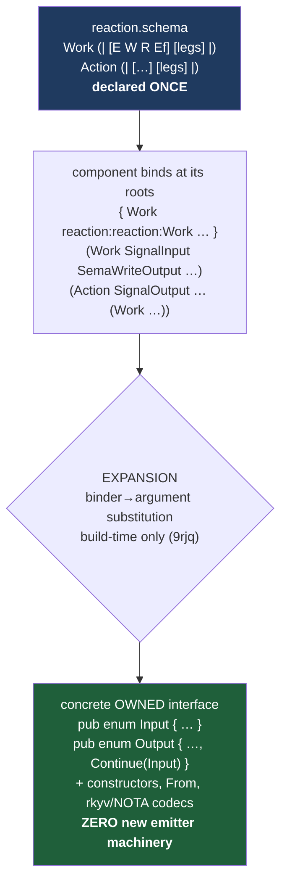
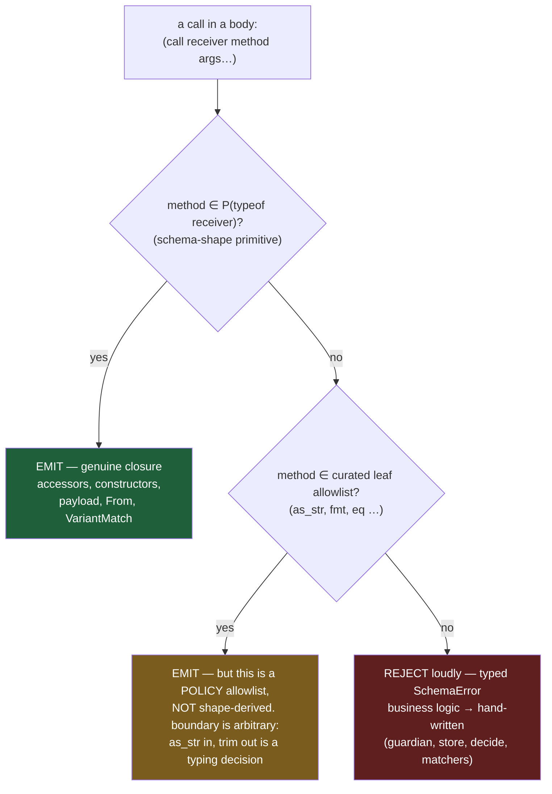

# 662 — The schema-language → component-codegen arc, in full: visuals and code

A visual capstone of the whole thread: from *"make the schema represent generics/traits so the
compiler generates component code instead of hand-wiring newtypes"* to a running, tested
artifact where generics, traits/impls, and **composed method bodies** all generate real Rust.
Every code block below is copied from the live prototype worktrees (`reaction-expand`); every
test count was re-run. Companion detail: meta-reports `659` (design agglomeration), `660`
(whole-vision demo), `661` (composition).

## 1. The thesis

A programming language **is** a set of structural macros kept as data (Spirit `7c71`/`2zed`):
every construct — `if`, a struct, generics, a trait impl, a method body — is a *shape* a tiny
generic interpreter recognizes, round-tripping through NOTA text and rkyv bytes. The compiler's
own definition is increasingly data; only a tiny seed stays hand-written. The arc below is that
thesis made concrete for the two constructs the codebase was missing — **generics** and
**traits/impls** — and then for the method bodies themselves.

## 2. The construct vocabulary — the bracket is the kind

A type's kind is explicit on its declaration form, never inferred from position (Spirit `3742`).
The closed six-delimiter set (Spirit `j9du`) carries every construct:

| Base | Means | Pipe family | Means | Spirit |
|---|---|---|---|---|
| `( … )` | application / record | `[\| … \|]` | string (bracket-safe) | `3qjw` |
| `[ … ]` | enum / vector / params | `(\| … \|)` | **generic declaration** | `hh3z` |
| `{ … }` | struct / map / namespace | `{\| … \|}` | **trait / impl** | `bpyu` |

```
Name { … }       = struct          Name (| [P…] body |) = generic decl (inner []/{} → enum/struct)
Name [ … ]       = enum            {| [P…]? Trait Target [body]? |} = impl (optional ends, sugar)
Name <ref>       = newtype         (Head Arg…)          = generic USE (name-resolved, like Vector)
```

## 3. The pipeline — declare once, bind per component, expand



Expansion, **not** generic-alias (Spirit `656`/`657`): the expanded enum has empty parameters,
so the existing concrete-enum emitters supply everything and the parameterized-decl suppression
guards never fire. Each component owns a concrete interface; genericity is a schema-authoring
convenience, never stamped into a component's output.

## 4. The whole component, authored in pipe-delimiter syntax (660)

The two frames, declared once (`reaction.schema`):

```nota
{
  Work (| [Event WriteDone ReadDone EffectDone]
    [(SignalArrived Event) (SemaWriteCompleted WriteDone) (SemaReadCompleted ReadDone) (EffectCompleted EffectDone)] |)
  Action (| [Reply Write Read Effect Continuation]
    [(ReplyToSignal Reply) (CommandSemaWrite Write) (CommandSemaRead Read) (CommandEffect Effect) (Continue Continuation)] |)
}
```

A component binds + expands them, declares payloads of every kind, a **marker impl**, and a
**code-is-data Deref** (`ledger.schema`, abridged):

```nota
{ Work reaction:reaction:Work   Action reaction:reaction:Action }
(Work SignalInput SemaWriteOutput SemaReadOutput EffectOutcome)
(Action SignalOutput SemaWriteSet SemaReadInput EffectCommand (Work SignalInput SemaWriteOutput SemaReadOutput EffectOutcome))
{
  LedgerEntry { statement Statement sequence Integer }   ;; struct
  EntryHandle Statement                                  ;; newtype
  SemaWriteSet [(Record) (Remove)]                       ;; enum
  …
  EntryHandleIsAuditable {| Auditable EntryHandle |}                                   ;; marker impl
  EntryHandleDeref       {| Deref EntryHandle [ (deref (reference (field self payload))) ] |}  ;; code-is-data
}
```

The generated Rust (real emitter output):

```rust
pub enum Input  { SignalArrived(SignalInput), SemaWriteCompleted(SemaWriteOutput),
                  SemaReadCompleted(SemaReadOutput), EffectCompleted(EffectOutcome) }
pub enum Output { ReplyToSignal(SignalOutput), CommandSemaWrite(SemaWriteSet),
                  CommandSemaRead(SemaReadInput), CommandEffect(EffectCommand), Continue(Input) }
// + Input::signal_arrived(…), From<SignalInput> for Input, From<Input> for Output, rkyv+nota codecs

pub struct LedgerEntry { pub statement: Statement, pub sequence: Integer }
pub struct EntryHandle(Statement);
pub enum SemaWriteSet { Record(Record), Remove(Remove) }

impl Auditable for EntryHandle {}                       // from {| Auditable EntryHandle |}

impl std::ops::Deref for EntryHandle {                  // from {| Deref EntryHandle [ … ] |}
    type Target = Statement;
    fn deref(&self) -> &Self::Target { &self.0 }
}
```

## 5. Code-is-data: the interpreter (the heart of it)

The `Deref` body above is not hand-written and not a template — it is projected from a data
expression tree. The interpreter, verbatim from `reaction-expand/src/schema.rs`:

```rust
pub enum Expression {
    SelfReceiver,                                       // self
    Field(Box<Expression>, Name),                       // <base>.<field>  (payload → tuple .0)
    Reference(Box<Expression>),                         // &<inner>
    MethodCall(Box<Expression>, Name, Vec<Expression>), // <receiver>.<method>(<args>…)   ← 661
}

impl Expression {
    pub fn to_rust(&self) -> Result<String, SchemaError> {
        Ok(match self {
            Self::SelfReceiver => "self".to_owned(),
            Self::Field(base, field) => {
                let field_text = if field.as_str() == "payload" { "0".to_owned() }
                                  else { field.field_name() };
                format!("{}.{}", base.to_rust()?, field_text)
            }
            Self::Reference(inner) => format!("&{}", inner.to_rust()?),
            Self::MethodCall(receiver, method, arguments) => {
                let primitive = ComposablePrimitive::resolve(method).ok_or_else(|| {
                    SchemaError::UnresolvedComposition {
                        method: method.as_str().to_owned(),
                        receiver: receiver.to_schema_summary(),
                    }
                })?;
                let rendered = arguments.iter().map(Expression::to_rust)
                    .collect::<Result<Vec<_>, _>>()?;
                format!("{}.{}({})", receiver.to_rust()?, primitive.rust_call_name(), rendered.join(", "))
            }
        })
    }
}
```

So `(reference (field self payload))` → `&self.0`. That is the whole language thesis at the
smallest scale: a method body is a data object read by one tiny interpreter, not text-with-sigils.

## 6. Composition (661) — bodies built by calling implied primitives

Today's step: each schema shape *implies* a primitive method vocabulary (accessors, constructors,
`payload`, `From`, variant re-wraps), and a body can **compose calls to them, addressed by object
type**. The `MethodCall` node (above) plus a **closed primitive alphabet**:

```rust
pub enum ComposablePrimitive { Payload, IntoPayload, AsStr }   // the closed alphabet (this slice)

impl ComposablePrimitive {
    fn resolve(method: &Name) -> Option<Self> {
        match method.as_str() {
            "payload" => Some(Self::Payload),
            "into_payload" => Some(Self::IntoPayload),
            "as_str" => Some(Self::AsStr),
            _ => None,                                  // → UnresolvedComposition: business logic
        }
    }
}
```

A real component method, `ConfigurationPath::as_str`, authored **as data** in the schema:

```nota
ConfigurationPathAsStr {| Composed ConfigurationPath [ (as_str (call (call self payload) as_str)) ] |}
```

Generated by the real emitter — **byte-identical** to the hand-written version:

```rust
impl ConfigurationPath {
    pub fn as_str(&self) -> &str {
        self.payload().as_str()
    }
}
```

A depth-2 composition: outer `as_str` over receiver `self.payload()` (inner `payload` over
`self`). And the boundary is enforced as a **typed error**, not a panic and not silent: a body
calling `keywords` (real business logic) → `SchemaError::UnresolvedComposition`.

## 7. The closure — and the crucial two-vocabulary finding

The adversarial verification (4 skeptics) found that the headline idea leaks at exactly one seam,
and pinned it precisely. There are **two vocabularies**:



- **Vocabulary A — `P(T)`, pure schema primitives** — genuinely closed, finite, shape-derivable,
  terminating. No `+`, no `if`, no IO is reachable. The plane.rs From legs, the 24-arm
  `from_input`, the cross-namespace re-wraps live here. **The thesis holds in full.**
- **Vocabulary B — std "leaf" methods** (`as_str`, `trim`, `==`) — NOT shape-derived. `as_str`
  (admitted) and `trim` (rejected) are structurally identical bodies; the boundary is a
  human-maintained list. A curated allowlist, not a structural closure — must be named as such.

This is the correction the workflow forced, and it is the most valuable result of the day.

## 8. The census — does it delete meaningful hand-wiring?

Measured against the *real* components (the one adversarial claim that **survived** refutation):

| Category | Where | Count | Vocabulary |
|---|---|---|---|
| `Deref` impls (`self.payload()`) | spirit/engine.rs + signal-spirit | ~24 | A (or newtype template) |
| `Display`/`PartialEq`/`Ord` one-liners | signal-spirit/lib.rs | ~25 | A / template |
| cross-namespace conversions (`Self::new(x.payload())`) | spirit/plane.rs | 8 | A (needs ownership-aware) |
| enum-tag projection (`from_input`) | signal-spirit/lib.rs | 24 arms | A (needs VariantMatch) |
| parallel-variant re-wraps | reaction.rs, nexus.rs | several | A |
| **business logic — stays hand-written** | decide/guard/store/validate/matchers | majority of *code* | — none |

Verdict: deletes a recurring, copy-pasted tax that scales with component count; leaves every
genuine decision hand-written. Real win, not a revolution — and the boundary lands exactly at the
first `guard_*`/`store.*`/cross-product call.

## 9. The adversarial scorecard

| Core claim | Verdict | Consequence |
|---|---|---|
| Deletes **meaningful** hand-wiring | **SURVIVED** (high) | the win is real (§8) |
| Not an **arbitrary expression compiler** | refuted (high) | → the two-vocabulary split (§7) |
| **Deterministic** resolution by type | refuted (high) | std autoderef leaks → schema-level name-lookup only; rustc resolves the rest |
| **Compiles correct** beyond proven slice | refuted (high) | borrow/move + variant-discard → two correctness gates |

"Refuted" here is the method working: the thesis was bounded honestly, not broken.

## 10. Operator's independent audit converges

Operator audited `661` (operator report `394`) and verified locally: `composition_demo` 7/7,
`reaction` tests pass. Independent agreement on the two-vocabulary split, and the **same**
recommendation I leaned to: **pure schema primitives first; no broad std-leaf allowlist yet;
use newtype trait-templates for `Deref`/`Display`/`PartialEq`/`Ord`; reserve composition for
schema-native work (payload/field projection, enum constructors, total `VariantMatch`, re-wrap
conversions).** Operator's named merge blocker: the surrounding impl-emission unsupported cases
still `panic!`/`assert!` (generic headers, bad Deref targets, unsupported method-bearing impls) —
prototype-grade, not main-grade. That is the typed-errors hardening slice.

## 11. Proven green (re-run, not trusted)

```
cargo test --test composition_demo   (schema-rust-next/reaction-expand)  →  7 passed; 0 failed
cargo test --test pipe_delimiter_demo (the 660 whole-vision demo)         →  10 passed; 0 failed
cargo test  (schema-next, all bins)                                       →  171 passed; 0 failed
cargo test  (schema-rust-next, all)                                       →  105 passed; 0 failed
cargo clippy --all-targets  (both repos)                                  →  exit 0, no warnings
```

## 12. The arc, report by report

| Report | What | State |
|---|---|---|
| `654` | generics/traits-as-data review; the explicit-kind principle | design |
| `655` | the pipe-delimiter family; deprecated-cluster Spirit cleanup | design + Spirit |
| `656` | expansion-not-alias codegen | **proven green** |
| `657` | concrete-owned-interface vs persisted-generic | design |
| `658` | reactive-component operator spec | spec |
| `659/*` | meta-report: all constraints + e2e goals + synthesis | design |
| `660` | whole-vision demo: generics + traits/impls + code-is-data | **proven green** |
| `661/*` | implied-method composition: catalog + census + design + prototype + adversarial | **proven green** |
| `662` | this visual capstone | — |

## 13. Landing slices (operator owns code-repo main)

1. `MethodCall` + closed alphabet + typed boundary — **done in prototype**; land it.
2. Newtype-emitter trait templates (`Display`/`PartialEq`/`Ord`) — deletes the biggest census
   category **without** a std allowlist. Cheapest big win.
3. `VariantMatch` (total, with payload-discard) + ownership-aware projection — the
   variant-isomorphism class (the largest *composition* opportunity). Gated on two correctness fixes.
4. Parameter binders + `Self::new` associated calls.
5. Then generic impl headers (the standing `d3r2` open piece).
6. Throughout — replace the prototype's `panic!`/`assert!` with typed `SchemaError` (operator's
   named merge blocker).

## 14. The intent state

`d3r2` (Decision, Low) is Clarified: the generatable-body set is *the closure under composition
over shape-implied primitives, each call addressed by its receiver object type, not a fixed
list.* Manifested into the schema-next architecture file (`next/pipe-delimiter-design`). Certainty
stays Low — a candidate to raise once slices 1-2 land on main.

## The line, in one sentence

Make the schema express every construct as data — generics, traits/impls, and method bodies
alike — declare the universal frames once and expand them into concrete owned interfaces; let
bodies compose the shape-implied primitives over a closed schema-shape closure with a loud typed
edge; and keep every genuine decision hand-written on the generated nouns.
