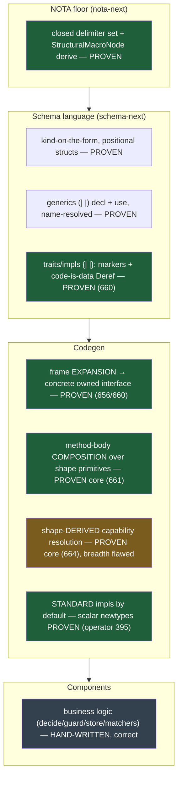

# 665 — State of the schema-language → component-codegen arc: the whole situation

A consolidated recap of where everything stands. The deep code-level visuals are in `662` (the
visual capstone); this report is the **situation**: the journey, what is now true, the two
parallel branches, the honest status, and the decisions waiting on you.

## Where this started — the problem

Components (Spirit, the triad) were **hand-wired with newtypes and boilerplate**: every
component re-spelled the same `Input`/`Output` enums, the same `Deref`/`From`/accessor/`Display`
impls, the same per-leg wrappers — thousands of lines that are pure consequence of shape. The
goal: make the **schema language represent generics and traits/impls so the compiler GENERATES
that code**, leaving only genuine behavior hand-written.

## The thesis, one paragraph

A language **is** a set of structural macros kept as data (`7c71`/`2zed`). Every construct — a
struct, generics, a trait impl, a method body — is a *shape* a tiny interpreter recognizes,
round-tripping through NOTA text and rkyv. The compiler's own definition becomes increasingly
data; only a tiny seed stays hand-written. The arc applied this to the two missing constructs —
**generics** and **traits/impls** — and then to **method bodies** themselves.

## The journey — phases (reports 654 → 665)

| Phase | Reports | What landed | State |
|---|---|---|---|
| **Represent the constructs** | 654, 655 | generics/traits-as-data review; the six-delimiter family (`( ) [ ] { }` + `[\| \|] (\| \|) {\| \|}`); kind explicit on the form | design + Spirit |
| **Generate from frames** | 656, 657, 658 | EXPANSION (not generic-alias): bind universal `Work`/`Action` frames per component → expand to concrete owned enums via existing emitters | **656 proven green** |
| **Agglomerate** | 659/* | meta-report: all constraints + e2e goals + synthesis | design |
| **Whole-vision demo** | 660 | a complex component fully in pipe-syntax → real Rust: generics + marker impls + a code-is-data `Deref` | **proven green** |
| **Composition** | 661/* | method bodies compose shape-implied primitives; the two-vocabulary finding (pure-schema closure vs std-leaf allowlist) | **proven green** |
| **Capstone** | 662 | the visual showcase of the arc | — |
| **Standard impls + capability resolution** | 663 (nota-designer), 664, operator 394/395 | the research, the default policy, two parallel proposal branches | mixed (below) |
| **This recap** | 665 | the whole situation | — |

## What is true now — the layered state

The big conceptual result of the recent phase: the line between *generated* and *hand-written*
is a **closure over shape-derived capabilities** — "the schema shape proves the body." A body
that composes only shape-implied calls is data; the first call that resolves to no shape
capability is business logic and stays hand-written. Two corollaries the adversarial passes
forced:
- The **closure is genuine only for pure-schema primitives**; std methods (`as_str`, `trim`) are
  a curated allowlist with an arbitrary boundary, not a structural closure (`661`).
- The **standard impls a shape guarantees** (newtype `payload`/`From`, struct accessors, enum
  constructors) can be *generated by default*; the conditional ones (scalar `Display`/`PartialEq`)
  are shape-gated; `Deref` and ordering are *opinions* (opt-in). The four-bucket policy is in
  `nota-designer/663`.

## The two parallel branches (the current situation)

The parallel-lane model: designer and operator each built a proposal branch independently; they
**converged on one principle from opposite ends** and are complementary.

| | Operator — `operator/standard-newtype-impls` (`f265aad6`) | Designer — `next/schema-capability-resolution` (`3709fc15`) |
|---|---|---|
| Face | **emitter** — which standard impls to stamp | **resolver** — which composed calls a receiver may resolve |
| Repo | schema-rust-next (pushed) | schema-next (pushed); schema-rust-next side local (cross-patched) |
| Does | scalar-newtype `Display`/`AsRef<str>`/`PartialEq<scalar>`/`PartialOrd<u64>`, opt-in | shape-derived resolution (newtype/struct/enum), typed rejections, struct impls |
| Proven | green, safe, scoped to scalars — **mergeable as-is** | shape-derived resolution **adversarially confirmed** (the core ask) |
| Flaws | none known | struct-default `new`-collision; typeof placeholder; residual panics — **needs fixes before merge** |

Together they are the pure-schema-capability layer: operator owns the safe scalar *emission*;
the designer branch owns the *resolution* (the composition side operator deferred).

## Honest status matrix

| Capability | Status |
|---|---|
| Delimiter family, generics decl/use, frame expansion | **proven green, on main-track epic branches** |
| Whole-component demo (generics + marker impls + code-is-data Deref) | **proven green** (prototype worktree) |
| Method-body composition (composed body → byte-identical Rust + typed boundary) | **proven green** (prototype) |
| Shape-derived capability resolution (`payload` resolves on newtype, rejects on struct) | **proven core** (designer branch) |
| Scalar-newtype standard impls by default | **proven green, mergeable** (operator branch) |
| Struct standard impls by default | **flawed** (`new`-field collision) — drop or guard |
| typeof chaining off a variant constructor | **flawed** (placeholder returns wrong type) — fix |
| Residual emitter `panic!`/`assert!` (generic headers, missing-deref, method-bearing) | **prototype-grade** — the typed-errors merge blocker |
| `VariantMatch` (variant-rewrap class), ownership-aware projection, generic impl headers | **designed, not built** |

Nothing is on production main; code-repo main is untouched (operator's lane). Everything proven
lives on epic/feature/prototype branches.

## The decisions waiting on you

1. **`Deref`: default or opt-in marker?** Of ~207 real newtypes, **189 wrap another schema type
   and only ~24 carry a hand `Deref`** — ~88% deliberately do not deref. The data says `Deref` is
   per-newtype *intent* (opt-in `*deref` marker), which would **refine `d3r2`'s "Deref by
   default" wording**. Recommendation: marker. (Held; not yet captured — your call.)
2. **Flip `with_standard_newtype_impls()` default-ON**, regenerate spirit/signal-spirit, delete
   redundant hand scalar impls in the same slice?
3. **Nested-newtype transitive scalar** — auto-derive through `Statement(StatementText(String))`,
   or keep depth-2 wrappers opaque?
4. **`as_str`** — recommendation is *zero* named std-leaf methods (`AsRef<str>` + `Display` cover
   it); confirm.

## Path forward (operator owns code-repo main)

1. Land operator's scalar-newtype standard impls (mergeable; default-ON flip is decision 2).
2. Land the designer resolver core with fixes: drop struct-default-by-default or add a
   collision guard; `VariantConstructor` carries its owning enum; `to_rust`'s `Field` arm
   consults the resolver; residual panics → typed `SchemaError`.
3. Add `VariantMatch` (total, payload-discard) for the variant-rewrap class.
4. Then generic impl headers (the standing `d3r2` open piece).

## The intent record

`d3r2` (Decision, Low certainty) holds the codegen direction, Clarified twice: first to the
*composition closure over shape-implied primitives*, then to *shape-derived capability
resolution + standard impls by default + pure-schema-first*. Its certainty is a candidate to
raise once a slice lands on main. Its one clause to refine is the `Deref`-by-default wording
(decision 1). Companion settled records: `3742` (kind on the form), `hh3z` (generics),
`bpyu` (traits/impls), `5hjv` (hand-written boundary), `zjmc` (declare-once frames).

## Bottom line, one paragraph

The vision works and is proven on real code: a complex component's generics, trait impls, and
even method bodies generate real Rust from schema; the boundary between generated and
hand-written is a clean shape-derived closure. The recent phase moved from a shallow name-list to
**genuine shape-derived capability resolution** (proven) and **standard impls generated by
default** (proven for scalar newtypes), across two complementary branches. What remains is
disciplined hardening — fix the two breadth flaws, convert residual panics to typed errors, add
`VariantMatch` — and four design decisions that are yours to make, the `Deref`-by-default-vs-marker
one being the consequential one. None of it is on production main yet; that is operator's
integration lane.
