# 666 — We have what we need: the generated code, shown, and the port plan

The scope question is settled. A grounded re-check (3-agent workflow) plus operator `397` confirm:
**we already have what we need to generate the engine, and the method-composition path was beyond
the need.** This report shows the actual code — schema in, Rust out, copied verbatim from the
live fixtures and proven green — then lays out the finish-and-port plan. Intent: `d3r2` re-scoped
(composition demoted to a future tool); the forward decision recorded as Spirit `t5wx`.

## The verdict, grounded

> `haveWhatWeNeed = true`. `compositionWasRequired = false`. 11 capabilities covered-proven, 1
> covered-but-unintegrated (the standard-impl default flip), **zero real gaps.**

The engine's generation needs are a **closed set**. The one thing the `{| Composed |}` method-body
DSL uniquely added — arbitrary inherent bodies like `as_str` → `self.payload().as_str()` — was
already covered by the scalar-newtype standard impls, *and* it cannot express the one body that
matters (`decide`), which is correctly hand-written. So it solved an already-solved problem. Parked.

## The code, real — schema in, Rust out

Every block below is verbatim from the live fixtures (paths cited), regenerated by the emitter and
proven by green tests (`composition_demo` 9/9, `pipe_delimiter_demo` 10/10, full suite 107/0,
clippy clean; operator's standard-impls per report `395`).

### Newtype — `Name Inner` → tuple struct + the standard accessor set

Schema (`ledger.schema:19`):

```
EntryHandle Statement
```

Generated (`pipe_demo_ledger_generated.rs`):

```rust
pub struct EntryHandle(Statement);

impl EntryHandle {
    pub fn new(payload: Statement) -> Self { Self(payload) }
    pub fn payload(&self) -> &Statement { &self.0 }
    pub fn into_payload(self) -> Statement { self.0 }
}
impl From<Statement> for EntryHandle {
    fn from(payload: Statement) -> Self { Self::new(payload) }
}
```

(Structs and enums work the same way: `LedgerEntry { statement Statement sequence Integer }` →
`pub struct` with field accessors + `new`; `SemaWriteSet [(Record)(Remove)]` → `pub enum` with
snake_case constructors and `From<Variant>` lifts.)

### Generics + expansion — declare frames once, bind in two lines, get a full concrete interface

Declared once (`reaction.schema`):

```
Work (| [Event WriteDone ReadDone EffectDone]
  [(SignalArrived Event) (SemaWriteCompleted WriteDone) (SemaReadCompleted ReadDone) (EffectCompleted EffectDone)] |)
Action (| [Reply Write Read Effect Continuation]
  [(ReplyToSignal Reply) (CommandSemaWrite Write) (CommandSemaRead Read) (CommandEffect Effect) (Continue Continuation)] |)
```

A component binds them (`ledger.schema` — the whole binding is these two lines):

```
{ Work reaction:reaction:Work   Action reaction:reaction:Action }
(Work SignalInput SemaWriteOutput SemaReadOutput EffectOutcome)
(Action SignalOutput SemaWriteSet SemaReadInput EffectCommand (Work SignalInput SemaWriteOutput SemaReadOutput EffectOutcome))
```

Generated (`pipe_demo_ledger_generated.rs:123`) — a concrete owned interface, no generics left:

```rust
pub enum Input {
    SignalArrived(SignalInput),
    SemaWriteCompleted(SemaWriteOutput),
    SemaReadCompleted(SemaReadOutput),
    EffectCompleted(EffectOutcome),
}
pub enum Output {
    ReplyToSignal(SignalOutput),
    CommandSemaWrite(SemaWriteSet),
    CommandSemaRead(SemaReadInput),
    CommandEffect(EffectCommand),
    Continue(Input),
}
// + Input::signal_arrived(…) constructors, From<SignalInput> for Input,
//   From<Input> for Output, and the rkyv + NOTA codecs — all generated.
```

This is the headline: **two lines of binding replace a hand-spelled `Input`/`Output` interface and
all its conversions.**

### Traits/impls — the relationship is the point (markers), plus the one mechanical body (Deref)

Schema (`ledger.schema:33,35`):

```
EntryHandleIsAuditable {| Auditable EntryHandle |}
EntryHandleDeref       {| Deref EntryHandle [ (deref (reference (field self payload))) ] |}
```

Generated:

```rust
impl Auditable for EntryHandle {}                       // the role/marker relationship, as data

impl std::ops::Deref for EntryHandle {                  // the one mechanical body, shape-proven
    type Target = Statement;
    fn deref(&self) -> &Self::Target { &self.0 }
}
```

The marker is the whole point of traits-in-schema: it lets hand-written engine code accept a
generated noun through a typed bound (`impl signal_frame::RequestPayload for Input {}` is the real
one in the engine). The `Deref` body travels as the data tree `(reference (field self payload))` —
the *only* method body that needs to be data, because the newtype shape proves it.

### Standard impls — the scalar newtype conveniences, generated (the "better Rust")

Schema (operator branch `f265aad6`, `standard-newtype-impls.schema`):

```
NameText String
FilePath Path
Count    Integer
Enabled  Boolean
WrappedName NameText
```

Generated for `NameText` (`standard_newtype_impls_generated.rs`):

```rust
impl std::fmt::Display for NameText {
    fn fmt(&self, f: &mut std::fmt::Formatter<'_>) -> std::fmt::Result { self.payload().fmt(f) }
}
impl AsRef<str> for NameText {
    fn as_ref(&self) -> &str { self.payload().as_str() }
}
impl PartialEq<&str> for NameText {
    fn eq(&self, other: &&str) -> bool { self.payload() == other }
}
// Count (Integer) gets PartialEq<u64> + PartialOrd<u64>; Enabled gets PartialEq<bool>.
// WrappedName (newtype over a schema type) gets NONE of these — only new/payload/into_payload/From.
```

These are the ~25 hand-written one-liners per component that now generate from the shape — and the
scoping (`WrappedName` gets none) is the safe boundary: scalar-backed only.

## The line: generated vs hand-written

```mermaid
flowchart LR
    subgraph GEN["GENERATED from schema (closed set, proven)"]
        direction TB
        A["Input/Output via frame expansion"]
        B["payload structs / newtypes / enums + standard impls"]
        C["role + marker trait impls (relationships as data)"]
        D["shape-computed role constants (HEADS, log_variant)"]
        E["method-bearing trait SURFACE only (decide signature)"]
        F["actor wiring, plane carriers, wire framing"]
        G["opt-in mechanical Deref"]
    end
    subgraph HAND["HAND-WRITTEN (irreducible, correct)"]
        direction TB
        H["NexusEngine::decide / step_decide — domain policy"]
        I["Input::validate — per-variant business rules"]
        J["store / guardian / query / actor behavior"]
    end
    GEN -.->|generated nouns accepted via typed bounds| HAND
    style GEN fill:#1f5f3a,color:#fff
    style HAND fill:#33414f,color:#fff
```



The method-bearing framework traits (`NexusEngine`, `ComponentDaemon`) emit their **surface** only —
the `decide` *signature* is generated; its *body* is hand-written. That is exactly the boundary
`5hjv` always intended.

## The finish-and-port plan

Per Spirit `t5wx` and operator `397`'s landing order. Code-repo main is operator's lane; designer
prepares/validates.

**Finish (integration, capability-complete already):**
1. Flip `with_standard_newtype_impls()` to **default-on** (the scalar tier is built + proven, just gated).
2. Integrate the proven pieces onto schema-rust-next/schema-next main: frame expansion, standard
   impls, marker/role impls, opt-in mechanical `Deref`.
3. Convert the residual emitter `panic!`/`assert!` (generic headers, missing-deref, method-bearing)
   to typed `SchemaError` — the one merge-blocker operator named.
4. Add `VariantMatch` for the enum-rewrap class (the 24-arm `from_input`, the `plane.rs` re-wraps).

**Port (the migration — the payoff):**
5. Regenerate each component's schema modules through the emitter and swap them into the engine,
   deleting the hand-wired boilerplate. Order by leverage: **signal-spirit** (most scalar newtypes +
   `PartialEq`/`Display` deletions) → **spirit** (`nexus`/`sema`/`daemon` modules; adopt the
   generated `Input`/`Output` + the generated runner-driven `execute`) → **meta-signal-spirit** →
   the **triad** consumers.
6. Validate each port **wire-identical**: the regenerated types must round-trip the same rkyv bytes
   and NOTA text as today (the codecs are part of the generated set), and the suite stays green.

What stays hand-written, untouched: `decide`/`step_decide`, `validate`, store/guardian/query/actor
behavior.

## Intent state

- `d3r2` (Decision, Low) re-scoped: the narrow engine-codegen set is the main track; broad
  method-composition / capability-resolution is a proven **future tool**, not required now.
- `t5wx` (Decision, High) recorded: finish the narrow stack and port all components to
  schema-generated interface code; abstract engine bodies stay hand-written.

## Bottom line

The language work is done — the schema generates the engine's entire structural surface, shown
above in real code, proven green. The method-composition deep-dive was a genuine but unnecessary
detour; it's parked as a future tool. The next phase is **integration and porting**, not more
language design: flip the default, integrate the proven stack, add `VariantMatch`, then migrate the
components one by one, validated wire-identical. That is operator's lane to drive; I'll prepare and
validate the slices.
