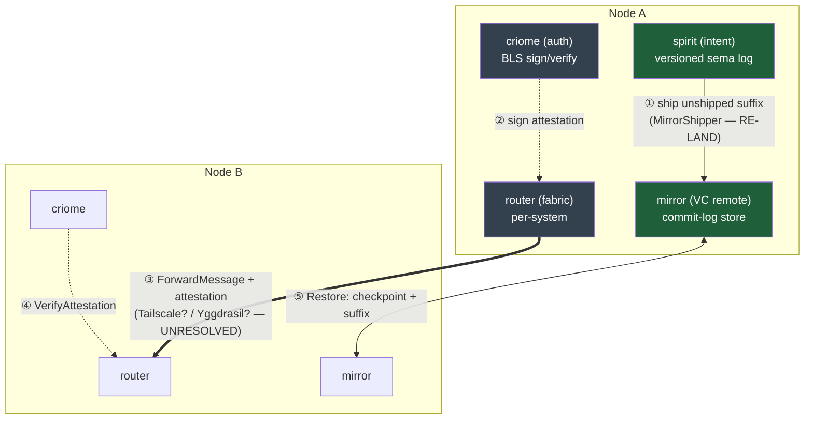
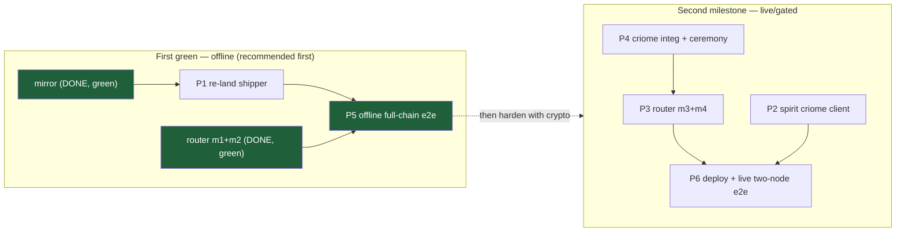

# 668 — First e2e production (spirit→vcs→criome→router→mirror): grounded overview

The psyche asked, opening a new phase: *"let's start finalizing our first e2e production; spirit with
vcs authenticated by criome and routed through router with updates then fetched by the mirror. SD was
already working on something, but I need many parts developed here, so many designers. you should get
an overview of what I want to build and see what you understand, what isn't clear, and what needs to
be implemented/decided."*

This is the overview: what the chain **is** (grounded against real code, not just SD's reports),
**what's actually built vs decided vs unbuilt**, **what isn't clear**, **what needs deciding**, and a
proposed **many-designer decomposition**. The milestone is recorded as Spirit `d6he` (the e2e chain as
our first production deployment goal).

## Method — and why it caught stale claims

System-designer reports 112–120 (all 2026-06-16) describe this domain, but they are point-in-time
snapshots and some are already stale. So I ran a 6-reader workflow (`e2e-production-overview`), one
reader per leg + the intent ledger, each grounding every claim by reading the **actual repos and
running daemons** and flagging report claims it could not confirm. The corrections below are the
payoff of reading code instead of trusting the reports (mine included).

### What the grounding corrected

| Stale claim (source) | Ground truth (code/daemon) |
|---|---|
| "spirit-daemon DOWN / `9cop` edit-path broken v9-vs-v10" (117, 119 §5; my own chat) | spirit is **healthy**: live 0.13.0, schema-10/layout-5 store, `Marker` = commit 1319, 4h46m uptime; `Clarify`/`Supersede`/`Retire` wired (`nexus.rs:441-486`) and the full v7–v10 migration matrix is implemented+tested (`production_migration.rs`). `4bw6` resolved; `9cop` not reproducible (a fresh `Record` and 12 `Lookup`s succeeded). Behaviorally un-exercised, but no evidence it's still broken. |
| "router has zero network surface" (119 §2) | True **for main only**. Branch `router-network-transport`: milestone-1 contract is **green+pushed** (signal-router, 17 tests); milestone-2 — the full networked daemon (`TailnetForwardIngress`, `RouterPeerDelivery`, `RemoteRouterRegistry`, `ApplyForwardedMessage`, eager `on_start` TCP bind, offline verifier) — is **implemented with a passing two-router loopback e2e**. The §5 resolution decision is already taken: option (A), `RegisterActor.home`. |
| "spirit→mirror shipper does not exist / unbuilt from scratch" (119 §2) | A **complete, tested** gated `MirrorShipper` (`src/shipper.rs`, `tests/mirror_shipper.rs`, real `mirror` dep behind an off-by-default feature) was built on branches `store-decomposition`/`vc-followups`, then **dropped from main** by the structural-forms merge (`d2cf86f`). Leg-1 is a **re-land + pin reconcile**, not from-scratch. |
| mirror "object VC / moves blake3 objects / fetch object bytes" (117, 119) | The mirror is a **payload-blind commit-log mirror** keyed `<store>/<sequence>`; blake3 digests are chain-validation coordinates only (it computes no hash, stores no content-addressed object). "Fetch" = whole-bundle `Restore` (checkpoint + suffix), not object-by-ref. The green tailnet-TCP e2e (`end_to_end_arc.rs`) runs over **loopback**, single-host. |
| criome "auth-only, pushed, 33 tests" (118, 119 §1) | Real BLS + admission gate are wired+green **on the local `criome-auth-pilot` worktree (not pushed)**; 35 test fns (report said 33). criome **main still ships the placeholder**. signal-criome `criome-admission-gate` **is pushed**, tip `4b27b93` (one ahead of the `783cc2fa` lock pin). |

## What the chain is (grounded)

The first e2e is **cross-node replication of authenticated, version-controlled intent**. spirit on
node A records intent into a versioned sema-engine commit log; a shipper drains its unshipped suffix
to the **mirror** (the per-system version-control remote, which keeps its own versioned store and
serves `Restore` = checkpoint+suffix); criome BLS-attests the update under a cluster-root-admitted
identity; the per-system **router** forwards router→router across the network (the attestation
replacing the `SO_PEERCRED` the kernel can't supply over a network hop); node B's mirror ingests/
restores. It is the first time spirit + mirror + criome + router + the cluster-root trust + a real
network transport run together end-to-end across machines.

A crucial grounded reframe: **"vcs" here is the mirror as spirit's version-control remote** (spirit's
sema commit log, mirrored entry-by-entry, restored via checkpoint+suffix) — *not* the workspace's
git/Gitolite VCS + `repository-ledger`, which is a separate subsystem not in SD's design for this
chain. The code supports the mirror reading strongly (spirit's `versioned_log`/`checkpoint`/`import`
is exactly the object model a mirror VC-controls). **This is the #1 thing to confirm** — see below.

## Grounded status by leg

| Leg | Built & on main | Built & green on branch | Decided, not built | Deployed? |
|---|---|---|---|---|
| **spirit** | intent daemon (0.13.0, healthy); versioned store (`versioned_log`/`checkpoint`/`import`); edit-paths; v9→v10 migration; `spirit-render`→`spirit.nota` | `MirrorShipper` (on `store-decomposition`/`vc-followups`) | re-land shipper to main; criome-auth client (`5zur`); ConnectionContext is ignored (`_connection`) | **yes** (systemd user, Unix-only) |
| **mirror** | full commit-log VC daemon; Append/PublishCheckpoint/Restore/ObserveHeads; crash-self-heal; hand-wired TCP ingress | tailnet-TCP ship+restore e2e (loopback) | authenticated ingest (`5osd`); per-system topology; retention enforcement | **yes** (systemd system svc, TCP `0.0.0.0:7474`, but only where `PersonaDevelopment` fires = ouranos, **not** prometheus) |
| **criome** | placeholder signature; ungated `register()` | real BLS + admission gate wired (`criome-auth-pilot`, local, ~35 tests); signal-criome admission contract (pushed) | provisioning ceremony tooling; production key custody; meta-signal runtime | **no — deployed nowhere** |
| **router** | Unix-only; **zero** network surface | **m1 contract (pushed, green) + m2 networked daemon + passing 2-router loopback e2e** | m3 (real criome attestation + replay window); m4 (live tailnet) | **no — daemon deployed nowhere** |
| **e2e bed** | — | mirror's loopback e2e is the proven template | offline full-chain harness; live two-node bed | per-agent microVM sandbox is **aspirational** (no code); `mkVmTest` infra only on an unmerged branch |

## What isn't clear (genuine ambiguities)

1. **"vcs" = the mirror, or git/Gitolite?** Grounded reading: the mirror is spirit's VC remote. Confirm it isn't the `repository-ledger`/Gitolite path.
2. **The object-shipping unit.** "version-control its objects" = ship the **sema commit-log suffix + checkpoint** (the `MirrorShipper`'s model), or the **`spirit.nota` render artifact** (the `ebev` public-intent substrate)? The reports conflate them; the code has both. The VC leg is the commit log; `spirit.nota` is orthogonal.
3. **Transport interface contradiction.** Deployed `mirror.nix` binds **Tailscale** (`0.0.0.0:7474`, firewall on `tailscale0`); design docs (116/119/120) assume **Yggdrasil 200::/7**. These give different bind addresses for the router's milestone-4 plan. Which is the real two-node transport?
4. **"Networking through the router" scope.** The offline m2 loopback (real TCP frames, two RouterRuntimes, green) already *is* networking through the router. Do you want (a) the **offline full-chain e2e green** first (fastest — most pieces exist), or (b) a **live cross-node tailnet** forward (needs criome+router deployed to two nodes + the interface resolved)? The "don't worry about key encryption for now" directive points to (a).
5. **criome-auth gate scope** (`5zur`): per-operation attestation on the **working** signal (Record/Clarify/…), or **meta-only**? Both are candidate gate points; `5zur` doesn't say.
6. **Live two-node bed gap.** mirror deploys on ouranos but not prometheus (no `PersonaDevelopment`); criome and the router daemon are deployed nowhere. A live bed needs deploy work that doesn't exist yet.

## Decisions for the psyche (consolidated)

- **D1 — Confirm "vcs" = mirror-as-VC-remote** (not git/Gitolite). Gates the whole interpretation.
- **D2 — First-e2e bed: offline full-chain (recommended) vs live tailnet.** Offline is far faster to green: router m1+m2 are done, mirror's pattern is proven, a tested shipper exists. Live needs deploy + criome + the interface decision.
- **D3 — Scope of the first e2e re: crypto.** Per "no key encryption for now," run the first e2e with the **offline accept-fixed verifier** (no live BLS/criome on the path), and treat real attestation (router m3) + live tailnet (m4) as the second milestone.
- **D4 — criome sequencing:** continue here (provisioning ceremony + key custody) **or** hand to operator for main integration now (crypto+gate are done+tested; `kr40`). Needed only for the *live/gated* track, not the offline first e2e.
- **D5 — Ratify router §5 option (A)** (`RegisterActor.home`) — the code already committed to it; confirm before it merges to main, or redirect to (C).
- **D6 — Transport interface** (Tailscale vs Yggdrasil) for the live bed.
- **D7 — `spirit.nota` substrate (`ebev`)** and the AGENTS.md/intent-skills rewrite — adopt now or stage; orthogonal to the e2e but pending.

## The many-designer decomposition

The grounded picture makes the **offline first e2e much closer than the reports imply**: the critical
path to a first green is essentially **re-land the shipper (P1) + wire the full-chain offline harness
(P5)**. The crypto/live track (P2/P3-m3/P4/P6) parallelizes but is *not* needed for the first green.

| Part | What | Lane | Depends on | Status |
|---|---|---|---|---|
| **P1** | Re-land + reconcile spirit→mirror `MirrorShipper` onto spirit main (pins: mirror/triad-runtime/sema-engine shared-engine seam) | designer (spirit) | mirror main | tested shipper exists on branch; needs re-land |
| **P2** | spirit-side criome-auth client (`5zur`): CriomeAuthority, `EntryDigest`, thread ConnectionContext | designer (spirit/criome) | signal-criome admission (pushed) | **deferred** for offline first e2e |
| **P3** | router transport m3 (real criome attestation + replay/freshness window) + m4 (live tailnet) | system/cloud-designer | criome deployed; D6 | m1+m2 done; m3/m4 unbuilt |
| **P4** | criome main integration (operator) + provisioning ceremony tooling (cluster-root signs member keys) | operator + system-designer | D4 | gate done on branch; ceremony has no tooling |
| **P5** | **the first e2e itself** — offline in-process full-chain harness (spirit→ship→mirror→router-forward→mirror restore), modeled on `end_to_end_arc.rs` | designer (me) | P1 | unbuilt; pattern proven |
| **P6** | deploy criome + router daemons to the cluster; resolve Tailscale/Yggdrasil; give prometheus mirror capability or pick a 2nd node | system/cloud-operator | D2(b), D6 | nothing deployed |

**Recommended first slice:** P1 + P5 — a green offline full-chain e2e proving the data path
(spirit records → ships → mirror stores → router forwards → mirror restores identical records), with
the offline accept-fixed verifier standing in for criome. That is the smallest thing that makes the
whole chain *true at once*, and most of it already exists. The crypto/live track (P2–P4, P6) then
hardens it under the cluster-root trust, in parallel across the other designer lanes.

## Intent state

- **Recorded:** `d6he` (Decision, High) — [the first end-to-end production milestone is the
  spirit → vcs → criome → router → mirror chain … finalize this full chain as the first real
  multi-component e2e production deployment, with many designer lanes developing the parts in
  parallel]. Referents: spirit, criome, router, mirror.
- **Owed gap-check:** the psyche's 2026-06-16 directive *"lets not worry about key encryption for
  now. we need networking through the router"* (cited in report 120) does not appear in Spirit per the
  intent-reader. It was addressed to system-designer (their capture), and it shapes D3 — flagging so
  SD confirms it's captured rather than me recording another lane's directive.
- **Edit caveat:** if a `Clarify`/`Supersede` *does* fail on the deployed store, that's the `9cop`
  surface; current evidence says edits work, but it's behaviorally un-exercised.

## Bottom line

The chain is more built than the reports suggest. The mirror is a green commit-log VC; the router's
networked forwarding is implemented and passing an offline e2e; a tested spirit→mirror shipper exists
and just needs re-landing; criome's crypto+gate are done on a branch. The first **offline** full-chain
e2e is a short hop (P1 + P5). The **live** e2e is a larger, real lift (criome deploy + provisioning
ceremony + router m3/m4 + the Tailscale/Yggdrasil decision + a two-node bed that doesn't exist yet).
The decisions above (especially D1–D3) set which of those two we're finalizing first.
