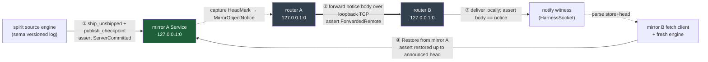

# 669/2 — The OFFLINE full-chain e2e harness (spirit → mirror A → router → mirror B), design

P5 of the 669 fan-out (frame: `669/0`). This blueprints the first offline full-chain e2e that makes
the whole replication path *true at once*: spirit records intent → ships its versioned commit-log
suffix to mirror A → an object-accepted notification crosses the router (A→B) → mirror B fetches and
restores identical records. Crypto is stubbed (the router's offline accept-fixed verifier), per D3.

The design is grounded against three real green patterns, not the reports:

- `/git/github.com/LiGoldragon/mirror/tests/end_to_end_arc.rs` — the ship → `ServerCommitted` →
  `Restore` (checkpoint + suffix) → identical-records loopback, over real TCP frames against a running
  `Service`. This is the spine of both mirror legs.
- `~/wt/github.com/LiGoldragon/router/router-network-transport/tests/end_to_end_remote_forward.rs` —
  two in-process `RouterRuntime`s, OS-assigned loopback ports, `AcceptFixedTestIdentity` offline
  verifier, A submits → resolves remote route → forwards over loopback TCP → B verifies off-mailbox →
  delivers to a local witness → A's trace reads `ForwardedRemote`.
- `/git/github.com/LiGoldragon/mirror/src/shipper.rs` — the production `ComponentShipper`
  (`ship_unshipped`, `publish_latest_checkpoint`, `envelope_for_entry`, `MirrorTailnetClient`).

## The key design problem, decided

Spirit `5osd` (Correction, the per-system mirror topology) is explicit:

> The per-system router carries the object-accepted notification; the mirror keeps its proven
> tailnet-TCP fetch transport.

So the *production* shape is: ship lands on mirror A → router carries an **object-accepted notify**
A→B → mirror B reacts to the notify by **fetching over its own transport**. Report 668 found, and I
re-confirmed against code, that **no such notify message exists** and the two transports are genuinely
disjoint:

- **The mirror contract has no notify.** `signal-mirror::Input` is exactly
  `Append | PublishCheckpoint | Restore | ObserveHeads`
  (`/git/github.com/LiGoldragon/signal-mirror/src/schema/lib.rs:284`); `Output` is
  `Appended | AppendRejected | CheckpointPublished | PublishRejected | Restored | RestoreRejected |
  HeadsObserved | MirrorFaulted`. There is no `MirrorObjectNotify`, no push, no head-changed event.
  All replication is **pull**: a peer calls `Restore`/`ObserveHeads`.
- **The router cannot deliver "to a mirror."** Router delivery endpoints are
  `EndpointKind::{Human, HarnessSocket, PtySocket}` only
  (`router-network-transport/src/message.rs:145`); the forwarded payload is a chat-shaped
  `Message { from, to, body: String, attachments }` (`message.rs:162`) and local delivery writes that
  `body` string to a Unix socket (`harness_delivery.rs`). There is no mirror endpoint kind and no
  delivery path that speaks the mirror's `Restore` exchange. The router moves *messages*; the mirror
  moves *commit-log objects*. They share no message, no actor, no endpoint today.

### Recommendation: option (b) for the first green — two joined legs, no new contract

**Prove the chain as two real legs joined in one harness, with the router carrying an
object-accepted *notification message* (chat-shaped `body`), not a new mirror contract noun.** This is
the smallest honest first green and it is faithful to `5osd`'s *division of labor* (router carries the
notify; mirror keeps its own fetch transport) without forging a contract the system doesn't yet have.

Concretely the harness runs:

1. **Leg 1 (spirit→ship→mirror A).** `ComponentShipper.ship_unshipped()` against a running mirror-A
   `Service`; assert `Durability::ServerCommitted` and an `AppendReceipt` head. Then
   `publish_latest_checkpoint()`. This is `end_to_end_arc.rs`, verbatim pattern.
2. **Leg 2 (router A→router B notify).** Router A forwards an **object-accepted notification** — a
   `signal-message` submission whose `body` is the NOTA-encoded coordinate of what landed
   (store name + the confirmed `HeadMark`: sequence + digest) — to a target whose home is router B.
   Router B verifies the offline attestation off-mailbox and delivers to a **local notify witness**
   (a `HarnessSocket`, exactly as `end_to_end_remote_forward.rs` does). Assert A's trace reads
   `RouterTraceStep::ForwardedRemote` and the witness received the coordinate body.
3. **Leg 3 (mirror B fetch + restore).** The harness, *acting on the witnessed notify* (it parses the
   store + head out of the delivered body), drives mirror B to pull from mirror A and restore. Because
   no live mirror↔mirror server-to-server fetch exists yet (the mirror's `Restore` is client-pull),
   the honest first green models mirror B's "own fetch transport" as a `MirrorTailnetClient` against
   mirror A's address — `Input::Restore` → `Output::Restored(bundle)` → import into a fresh
   component engine via `begin_import`/`ingest_checkpoint`/`ingest_suffix`/`commit`. Assert the
   restored store reads records **identical** to spirit's source, and the commit cursors match.

The seam that the notify carries (the head coordinate) is what makes leg 2 → leg 3 a real causal
chain rather than two unrelated tests: **mirror B fetches *the head that the notify announced*, and
asserts it restored exactly up to that head.** That is the e2e claim — an update recorded on A is,
via a router-carried notification, visible on B.

Why not option (a) (compose a real router-carried `MirrorObjectNotify` + a mirror-B-fetches-on-notify
flow) for the *first* green: it forces three unbuilt pieces at once — a new mirror contract noun, a
new router endpoint kind (a `Mirror`/`Notify` endpoint whose delivery speaks `Restore`), and a
mirror-side reactor actor that consumes a router delivery and triggers a fetch. Each is a legitimate
*second-milestone* lift (it is exactly the production shape `5osd` wants), but bundling them into the
first green violates "smallest honest first green" and risks a long red. Option (b) proves the same
data path is true end to end **using only contracts that are already green**, and it surfaces the
exact shape the notify must eventually carry (store + head coordinate), de-risking option (a).

The minimal new contract noun that option (b) needs is **none in a shipped crate** — the notify body
is a test-local NOTA string. The *one* small new type, and it lives in the harness, is a
`MirrorObjectNotice { store, head }` payload that gets NOTA-encoded into the message body and parsed
back out on the witness side. This is the seed of the future `signal-mirror`/`signal-router`
`MirrorObjectNotify`; landing it as a harness type first lets the second milestone promote a
*proven* shape into the contracts.

## Harness file plan

One integration test file, on a spirit feature branch (the chain's entry point is spirit; the test
exercises spirit's shipper + both mirror daemons + both routers).

| Item | Value |
|---|---|
| **Path** | `~/wt/github.com/LiGoldragon/spirit/<crate>/tests/end_to_end_offline_full_chain.rs` (final crate chosen by P1 — wherever P1 lands the re-landed shipper integration; if P1 keeps the shipper as a `mirror`-dep behind a feature, the test sits in that crate behind the same feature) |
| **Test fn** | `intent_recorded_on_node_a_ships_notifies_over_router_and_restores_identically_on_node_b` |
| **Flavor** | `#[tokio::test(flavor = "multi_thread", worker_threads = 4)]` (the router e2e requires multi-thread; the witness threads block) |
| **Feature gate** | same off-by-default feature P1 uses to pull the real `mirror` dep (the shipper leg needs `ComponentShipper`, `Service`, `MirrorTailnetClient`) |

### In-process actors / daemons (all loopback, OS-assigned ports)

| Actor / daemon | Crate | Bind | Role |
|---|---|---|---|
| **spirit source engine** | `sema-engine` (`ComponentEngine`) | none (local file in tempdir) | records intent; owns the versioned commit log + outbox |
| **mirror A `Service`** | `mirror` | `127.0.0.1:0` → read back via `ServiceLink.tcp_bound_address()` | the VC remote that leg-1 ships into and leg-3 fetches from |
| **`ComponentShipper`** | `mirror` | client to mirror A | drains spirit's unshipped suffix; publishes checkpoint |
| **router A `RouterRuntime`** | `router-network-transport` | `127.0.0.1:0` → `ReadRouterTailnetAddress` | submits the notify, resolves the remote route, forwards over TCP |
| **router B `RouterRuntime`** | `router-network-transport` | `127.0.0.1:0` | verifies the attestation off-mailbox, delivers the notify locally |
| **notify witness** | harness-local `UnixListener` | tempdir `.sock` | router B's local `HarnessSocket` target; captures the delivered notify body |
| **mirror B restore client + fresh engine** | `mirror` + `sema-engine` | client to mirror A | the "own fetch transport"; restores into a fresh store |

The mirror needs **one** `Service` (mirror A) because, in the offline first green, mirror B's fetch is
a pull against mirror A; a second running mirror `Service` is unnecessary for the data claim and would
only add a second store with nothing in it. (Option (a)'s second milestone runs two `Service`s — B
ingests via its own `Append` path; that is where a real mirror↔mirror transport gets built.)
Both routers bind a listener so the actor-tree shape is uniform, matching the proven router e2e.

### Setup sequence (grounded in the two proven tests)

1. `ComponentFixture` populates the spirit source: asserts/mutates a few `Thought`-style records, a
   mid-history `checkpoint()`, then post-checkpoint asserts + a retraction (same shape as
   `end_to_end_arc.rs::populate`). The domain record is a stand-in for a spirit intent `Entry`; the
   mirror is payload-blind, so any `EngineRecord` proves the path.
2. `running_mirror()` spawns mirror A; register the component store on the meta surface
   (`meta_signal_mirror::Input::RegisterStore`).
3. `RouterRuntime::start_networked(None, offline_listening("127.0.0.1:0", router-b-id))` →
   register the **notify target** on B as a local `HarnessSocket` actor pointing at the witness, and
   `GrantChannel::direct_message(owner → notify-target, Persistent)` so B's channel-auth admits it.
4. `RouterRuntime::start_networked(...)` for router A; `InstallRemotePeer { router-b-id, B address }`
   and `InstallRemoteRoute { recipient: notify-target, home: router-b-id }`.

## The exact assertions

Leg 1 — ship to mirror A (mirror's proven append path):

- Pre-ship: `source.store_durability()? == Durability::QueuedForMirror`.
- `shipper.ship_unshipped().await?` returns `ShipOutcome::Shipped { head }`.
- `shipper.engine().store_durability()? == Durability::ServerCommitted`.
- `shipper.engine().durability_of(head.commit_sequence())? == Durability::ServerCommitted`.
- `shipper.engine().unshipped_outbox()?.is_empty()` (cursor covers the outbox).
- `shipper.publish_latest_checkpoint().await?` returns a `CheckpointReceipt` with the expected
  `sequence` / `covered_end`.
- Capture `notice = MirrorObjectNotice { store, head }` from the confirmed `head` (this is what the
  notify will carry).

Leg 2 — router A→B notify (router's proven forward path):

- Submit on router A a `signal-message` `SubmitStamped` whose `MessageBody` is `notice.to_nota()`,
  recipient = the notify-target, origin `External(Owner)`; capture the accepted `MessageSlot`.
- The witness receives a delivery: `witnessed.harness == notify-target`, `witnessed.sender == owner`
  (router A stamps the External(Owner) origin, and that authoritative sender rides the forward),
  `witnessed.body == notice.to_nota()`.
- Parse `MirrorObjectNotice::from_nota(witnessed.body)` and assert it equals the `notice` from leg 1
  — i.e. **the head announced over the router is exactly the head mirror A confirmed.**
- Router A trace contains `RouterTraceStep::ForwardedRemote`.
- The typed observation surface (`ApplyRouterObservation` → `MessageTrace`) reports
  `RouterDeliveryStatus::ForwardedRemote` for the submitted slot.
- (Optional, mirrors the proven test's bare-client leg) a direct `forward_directly`-style TCP client
  to router B's ingress decodes `SignalRouterOutput::ForwardAccepted`.

Leg 3 — mirror B fetch + restore, *driven by the witnessed notice*:

- Using `parsed_notice.store`, a `MirrorTailnetClient::new(mirror_a_address)` issues
  `Input::Restore(RestoreQuery::new(store))` → `Output::Restored(bundle)`.
- `bundle.suffix.len()` equals the post-checkpoint entry count (e.g. 2: the new assert + the
  tombstone — same as `end_to_end_arc.rs`).
- Import into a fresh `ComponentEngine` via `begin_import` / `ingest_checkpoint` / `ingest_suffix` /
  `commit(&Families)`.
- **The causal seam:** `target.current_commit_sequence()? == parsed_notice.head.sequence` — mirror B
  restored *exactly up to the head the router announced*.
- `target.match_records(QueryPlan::all(thoughts))` equals the source records, and equals the expected
  literal vector (e.g. `[alpha=revised, gamma=third]`).
- `shipper.engine().current_commit_sequence()? == target.current_commit_sequence()?` (same digest
  chain continues on B).
- Teardown: `stop_gracefully()` + `wait_for_shutdown()` on both routers (proven router-e2e teardown).

## What it depends on from P1 (the re-landed shipper)

The harness is **blocked on P1** for the spirit-side ship leg; it cannot go green until P1 lands:

- `ComponentShipper`, `MirrorTailnetClient`, `ShipOutcome`, `PublishLatestCheckpoint` available to a
  spirit test (the re-landed `mirror`-dep seam, behind P1's feature). P1's `tests/mirror_shipper.rs`
  green is the precondition.
- The spirit↔sema-engine versioned-store seam P1 reconciles: `unshipped_outbox`,
  `versioned_replay_from_sequence`, `acknowledge_mirror`, `mirror_head`, `store_durability`,
  `durability_of`, `latest_checkpoint`, `begin_import`/`ImportSession`. These are the engine methods
  the proven `end_to_end_arc.rs` uses; P1's pin reconcile must keep them.
- Pin alignment across `mirror`, `triad-runtime`, `sema-engine`, `signal-mirror` so spirit can depend
  on the `mirror` crate and the same `triad-runtime` `LengthPrefixedCodec` the router uses (both legs
  must agree on the framing crate version, or the test won't link).

A cross-crate pin caveat worth flagging to operator at integration: the router e2e pins
`signal-router` at branch `router-network-transport` and the mirror legs pull `mirror` (which pins its
own `triad-runtime`/`sema-engine`). The harness links **all of them in one test binary**, so the
`triad-runtime` versions must unify. If they don't, the offline e2e is blocked on a pin reconcile
that spans P1's spirit branch *and* the router branch — an operator integration task, not a harness
bug. This is the single most likely real blocker and should be checked before writing the test body.

## The minimal new contract noun

For the first green: **none in any shipped crate.** The only new type is harness-local:

```
MirrorObjectNotice { store: <store name>, head: { sequence, digest } }
```

— NOTA-encoded into the router message `body`, parsed back on the witness side. It reuses
`signal-mirror`'s `HeadMark` shape (sequence + 32-byte digest) so promoting it later is mechanical.

For the **second milestone** (option (a), the production shape `5osd` mandates), the promotion path
is: lift `MirrorObjectNotice` into a real `MirrorObjectNotify` carried by `signal-router` (or a new
`signal-mirror` notify the router relays), add a router `EndpointKind::Mirror` (or a notify endpoint)
whose delivery hands the notice to a **mirror-side reactor actor**, and have that reactor call the
mirror's own fetch transport (`Restore`/`ObserveHeads`) — replacing the harness's hand-driven leg 3
with a real on-notify fetch, and replacing the single-mirror pull with a two-`Service`
mirror-A↔mirror-B fetch. The first green proves every byte of that path except the auto-trigger and
the second mirror's ingest; it leaves a precise, de-risked shape for the second milestone to build.

## One-glance chain



## Bottom line

The first green is option (b): two real legs joined by a router-carried notice, no new shipped
contract. Leg 1 is `end_to_end_arc.rs`; leg 2 is `end_to_end_remote_forward.rs`; leg 3 is the
restore half of `end_to_end_arc.rs` — each already green in isolation. The harness's only invention
is the `MirrorObjectNotice { store, head }` seam that makes the legs causal and seeds the future
`MirrorObjectNotify`. It is blocked only on P1 (the re-landed shipper) and on a one-time
`triad-runtime` pin unification across the spirit and router branches — both operator-integration
items, not design gaps. The production shape `5osd` wants (router *triggers* the mirror's own fetch)
is the explicit second milestone, and this first green hands it a proven payload shape.
