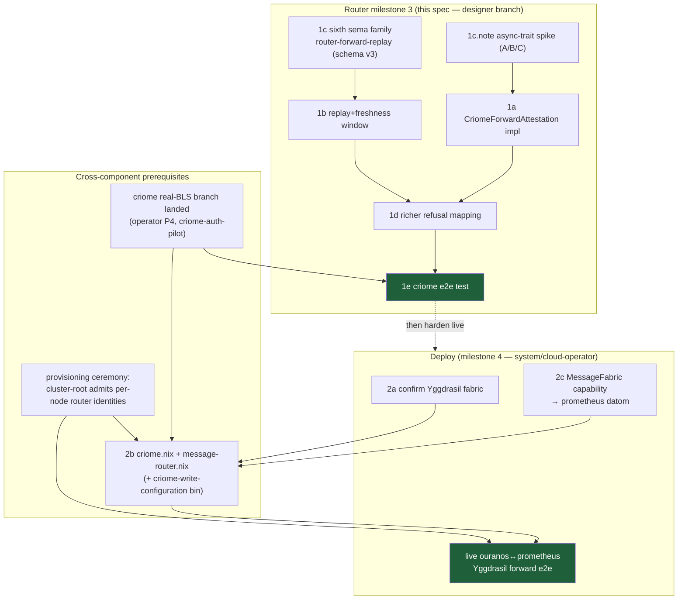

# 669-4 — Router milestone-3 (real criome attestation + replay/freshness window) + the deploy/interface plan

This is the spec for the **live/gated track** of the first e2e: replacing the offline accept-fixed
verifier with a real criome client, adding the router-owned replay/freshness defense (the sixth
`router.sema` table family), enriching the m2 refusal collapse — and then the concrete deploy plan
(transport resolution, where criome + the message-router daemon go, how prometheus earns the missing
capability). It is grounded against the actual m2 code on
`~/wt/github.com/LiGoldragon/router/router-network-transport`, the `signal-criome` and `signal-router`
contracts, the deployed CriomOS NixOS modules, and `goldragon/datom.nota` — not against the prose
reports, which are stale on several points corrected below.

This is **design, not landed code.** The m3 build runs on a designer feature branch under
`~/wt/github.com/LiGoldragon/router/`; operator integrates to main. `branch = null`.

## 0 — What m2 actually left (ground truth)

m2 is real and the seams are exactly where report 120 §4 said they'd be. Reading the code corrected
three things the prompt and reports imply but the source contradicts:

| Claim | Ground truth (file:line) |
|---|---|
| "`criome_socket_path` needs adding to config" | **Already present.** `RouterDaemonConfiguration.criome_socket_path: Option<WirePath>` (signal-router branch `router-network-transport`, `schema/lib.rs:425`); projected to `Option<PathBuf>` with a dedicated accessor `Configuration::criome_socket_path()` (`config.rs:110`). m3 *consumes* it; it does not add it. |
| "RouterForwardRefusalReason needs ReplayDetected/ClockSkew variants" | **Already present.** The closed enum has all seven variants incl. `ReplayDetected`, `ClockSkew` (`schema/lib.rs:395-403`). The contract is complete; **no `signal-router` change is needed for m3.** What's missing is *logic that populates them* — entirely router-daemon-side. |
| "the m2 verifier collapses to RecipientUnknown" | Two distinct collapses in `router.rs` `TailnetForwardIngress`: (a) `decode_forward_request` maps a non-`ForwardMessage` frame to `RecipientUnknown` (`:368`) — should be a frame-shape refusal, not a recipient one; (b) `handle_forward` maps **both** `ApplyForwardedMessage` runtime errors **and** the `RouterApplyOutcome` error arm to `RecipientUnknown` (`:399`, `:403`). Both are the m2 placeholder the richer mapping (§3) replaces. |

The verifier seam itself is clean: `ForwardAttestationVerifier` trait (`forward_attestation.rs:28`)
with `attest`/`verify`; `AcceptFixedTestIdentity` is the offline impl; `RouterNetworkConfiguration`
holds `Arc<dyn ForwardAttestationVerifier>` and threads it to both `TailnetForwardIngress` (inbound
verify) and `RouterPeerDelivery` (outbound attest, `router.rs:1088`). **m3 is a new impl of this trait
plus replay state — it does not touch routing, transport, or the trait signature.** That is exactly
the m2 promise (`forward_attestation.rs:11-14`) kept.

One real signature gap to note up front: the trait's `verify` is **synchronous and infallible-of-IO**
(`fn verify(&self, …) -> Result<RemoteRouterIdentity, RouterForwardRefusalReason>`). A criome client
must do an **async** Unix round-trip. So m3 changes the trait to `async fn verify` (and `async fn
attest`), or — cleaner — introduces a sibling async trait. This is a real, load-bearing change; see §1c.

## 1 — Router m3 spec

### 1a — The criome verifier: `CriomeForwardAttestation`

A new data-bearing type in `router/src/forward_attestation.rs` (or a new
`src/criome_attestation.rs`) implementing the verifier seam by delegating to the **local** criome
daemon over `criome_socket_path`. The router never holds keys or verifies BLS itself — *criome signs /
router transports* (`wckt`). Two directions:

**Outbound (`attest`)** — the sending router asks its local criome to `Sign` an attestation over the
exact `ForwardedMessagePayload` digest, with this router's cluster-root-admitted `router_identity` as
the signer. criome returns a `SignReceipt { attestation: Attestation, issued_at }`
(`signal-criome/schema/lib.rs:661`). The router projects criome's rich `Attestation` down to the wire
`RouterPeerAttestation { signer, scheme, public_key, signature, content_digest, issued_at, nonce }`
(`signal-router/schema/lib.rs:330`). **The two attestation types are deliberately different shapes**
(criome's carries `ContentReference{digest,purpose,schema_version}`, `SignatureEnvelope`, `AuditContext`,
`expires_at`; the router wire form is flattened). The projection is the one real impedance point — see
the mapping table in §1d.

**Inbound (`verify`)** — the receiving router reconstructs a criome `VerifyRequest { attestation,
content }` from the inbound `RouterPeerAttestation` + the recomputed payload digest, asks criome
`VerifyAttestation` (`signal-criome` `Input::VerifyAttestation`, `:721`), and reads back a
`VerificationResult { decision, identity, expires_at }` (`:669`). Mapping:

- `decision == Valid` ⇒ `Ok(verified_origin)` — the returned `Option<Identity>` is the authoritative
  origin, projected to `RemoteRouterIdentity` (criome's `Identity::Cluster|Host(PrincipalName)` →
  `RemoteRouterIdentity`). The router stamps **this**, never the wire-claimed `signer`.
- `InvalidSignature | UnknownSigner | Revoked` ⇒ `Err(AttestationInvalid)`.
- `Expired` ⇒ `Err(ClockSkew)` (criome already enforces `expires_at`; reuse its verdict for the
  freshness axis rather than duplicating it). **Note:** criome's own `ReplayAttempted`
  (`VerificationDecision::ReplayAttempted`, `:180`) is criome's *authorization-flow* nonce tracking,
  **not** forward-replay — report 120 §3 flagged this. The router must NOT rely on it for forward
  replay; the router owns its own window (§1b). If criome ever returns `ReplayAttempted` on a verify,
  map it to `AttestationInvalid` (defensive; it shouldn't happen on the verify path).

### 1b — The router-owned replay + freshness window (the core new logic)

criome's `VerifyRequest` is **stateless w.r.t. the router's forward stream** (report 120 §3,
critique-confirmed). So a *valid* attestation is trivially replayable until the router itself keeps a
seen-set. This is router-owned and lands **with** real attestation (not later), exactly as 120 §4c
specified. Two independent checks, run **off-mailbox in the ingress task** before the criome call (a
replayed or stale frame should never even reach criome — fail fast, and never block the single-writer
mailbox on a duplicate):

1. **Freshness / clock-skew.** Reject if `now - issued_at` exceeds a configured tolerance (and reject
   future-dated frames beyond a small allowance). The skew window must be wide enough for loosely-synced
   nodes (NTP gives sub-second; pick **±300 s** to start, configurable) and bounded enough that the
   replay table stays small. Failure ⇒ `ClockSkew`. **This must run before the replay-table insert** so
   stale frames don't pollute the window.
2. **Replay.** A bounded seen-`(signer, ReplayNonce)` set. The freshness window makes it bounded: any
   nonce older than the skew tolerance can be evicted, because a frame that old is already rejected by
   check (1). So the window is "all `(signer, nonce)` seen within the last `2 × tolerance`." First sight
   ⇒ insert + proceed; second sight ⇒ `ReplayDetected`.

The window lives behind a small actor or a guarded structure owned by `RouterRuntime` (single-writer
discipline: the *insert* is a mutation, so it goes through the runtime, or through a dedicated child
actor `ForwardReplayWindow` sibling to `RemoteRouterRegistry`). The **read-check** (is this nonce
already seen?) can be done against an in-memory index in the ingress task for the fast reject; the
**authoritative insert** that survives restart goes through the sema table (§1c). Concretely: ingress
checks the in-memory index → if seen, `ReplayDetected` immediately; if unseen, hand to the runtime which
re-checks-and-inserts atomically (the in-memory index is an optimization, the table+actor is the source
of truth, avoiding a TOCTOU race between two concurrent forwards bearing the same nonce).

### 1c — The sixth `router.sema` table family (survives restart)

Today `RouterTables` (`router/src/tables.rs`) registers **five** families: `router-channel`,
`router-adjudication-pending`, `router-message`, `router-delivery-attempt`, `router-delivery-result`
(`tables.rs:30-34`). m3 adds the **sixth**: `router-forward-replay`.

```
const FORWARD_REPLAY: TableName = TableName::new("forward_replay");
const FORWARD_REPLAY_FAMILY: &str = "router-forward-replay";
```

Stored record (a new `StoredForwardReplayEntry` with the existing `EngineRecord` pattern — note the
crate spells these `Stored*`, all full English words, no abbreviation):

```rust
#[derive(Archive, RkyvSerialize, RkyvDeserialize, Debug, Clone, PartialEq, Eq)]
pub struct StoredForwardReplayEntry {
    pub signer: String,        // RemoteRouterIdentity payload
    pub nonce: String,         // ReplayNonce payload
    pub issued_at: i64,        // TimestampNanos — drives eviction
}
impl EngineRecord for StoredForwardReplayEntry {
    fn record_key(&self) -> RecordKey { RecordKey::new(format!("{}:{}", self.signer, self.nonce)) }
}
```

The composite `signer:nonce` key gives idempotent insert (a re-asserted duplicate hits the existing-key
`mutate` path in `put_record`, `tables.rs:283`) and the natural uniqueness the replay check needs.
`issued_at` drives bounded eviction: on a periodic sweep (or lazily, on each insert past a threshold),
retract entries older than `2 × skew_tolerance`. **Bump `ROUTER_SCHEMA_VERSION` from 2 to 3**
(`tables.rs:24`) — the family-set changed; pre-production, so a clean break, no migration. New
`RouterTables` methods: `record_seen_forward(signer, nonce, issued_at) -> RouterResult<bool>` (returns
`false` if already present = replay) and `evict_stale_forward(before: i64)`.

This is what "window survives a simulated restart" means in the 120 §6 milestone-3 acceptance: after a
runtime restart that reloads `RouterTables`, a replayed frame whose `(signer,nonce)` was persisted is
still `ReplayDetected`. The in-memory index (§1b) is rebuilt from the table on `on_start`.

### 1c.note — the async-trait change (load-bearing, flagged honestly)

The m2 `ForwardAttestationVerifier::verify` is **sync** (`forward_attestation.rs:44`). A criome client
is **async** (Unix socket round-trip). Three options, ranked:

- **(A) make the trait async** — `async fn verify`/`async fn attest`. Clean; the offline impl just
  becomes trivially async; the call sites in `TailnetForwardIngress::handle_forward` and
  `RouterPeerDelivery` are already `async` (`router.rs:377`). Recommended. Cost: `Arc<dyn ...>` over an
  async-fn-in-trait needs the `async_trait`-style or native AFIT dyn handling — native dyn-AFIT is the
  current toolchain's sharp edge; may need a boxed-future trait method or the `trait-variant` crate.
  Verify the toolchain (`rust-toolchain.toml`) supports `dyn` async traits before committing.
- **(B) keep `verify` sync, do the criome round-trip in the ingress task and pass the
  `VerificationResult` into a sync verify** — the ingress task owns the async; `verify` becomes a pure
  mapping over an already-fetched result. This keeps the trait sync and isolates async to the daemon.
  Slightly muddier seam (the trait no longer "owns" the verification) but no AFIT risk. **Pragmatic
  fallback if (A) fights the toolchain.**
- **(C) a separate async trait** `AsyncForwardAttestationVerifier` for the criome path, leaving the
  offline sync trait alone — two traits, more surface. Reject unless (A) is infeasible.

This is the one genuinely uncertain implementation risk in m3; everything else is mechanical. Flagging
it as the first thing to spike.

### 1d — The richer refusal mapping (replaces the m2 collapse)

Replace the two `RecipientUnknown` collapses with reasons that carry information. The ordering matters
(cheapest/most-specific reject first, criome last):

| Inbound condition | m2 today | m3 refusal | Where |
|---|---|---|---|
| Frame is not `Input::ForwardMessage` | `RecipientUnknown` | (frame-shape error — see note) | `decode_forward_request:368` |
| `now - issued_at` outside skew tolerance | (no logic) | `ClockSkew` | new, ingress, **before** criome |
| `(signer, nonce)` already seen | (no logic) | `ReplayDetected` | new, ingress, **before** criome |
| criome `decision != Valid` | n/a | `AttestationInvalid` (or `ClockSkew` for `Expired`) | criome verify |
| `verified_origin` not an admitted peer in `RemoteRouterRegistry` | n/a | `UnknownPeer` | post-verify, pre-apply |
| Recipient actor not local & no remote route | `RecipientUnknown` | `RecipientUnknown` (correct here) | `ApplyForwardedMessage` |
| Channel-auth fails on the local delivery | (folded) | `ChannelUnauthorized` | `apply_stamped_message_submission` |
| Loop guard: arrived-via-forward, would re-resolve remote | (no logic — `ForwardMarker` exists, unused) | `AlreadyForwarded` | `ApplyForwardedMessage`, on `ForwardMarker::Forwarded` |
| `ApplyForwardedMessage` actor-call error (mailbox dead etc.) | `RecipientUnknown` | **propagate as a daemon error / typed internal refusal**, not `RecipientUnknown` | `handle_forward:403` |

Two notes:
- **Frame-shape:** a non-forward frame on the network tier isn't a recipient problem. `ChannelKind`-style
  there's no `MalformedFrame` variant in the closed `RouterForwardRefusalReason`. Two honest choices:
  add `MalformedForward` to the enum (a **signal-router contract change**, the only one m3 would need —
  small, but it breaks the m2-clean "no contract change" property), **or** treat a decode failure as a
  connection-level error (drop the connection, log) rather than a refusal reply, since a peer that can't
  frame correctly can't read a refusal reason meaningfully anyway. **Recommend the connection-level
  drop** — it keeps the contract frozen and matches how mirror handles malformed tailnet frames.
- **`AlreadyForwarded`:** `ForwardMarker` is in the contract and the payload (`RouterForwardRequest.forwarded`)
  but **no code reads it** today. m3 wires it: `ApplyForwardedMessage` refuses `AlreadyForwarded` if a
  forwarded-marked message would resolve to *another* remote route (the first-class loop guard from 120
  §4). This keys on the marker, not on origin (the criome origin is a `Host`/`Cluster` identity, so an
  "origin == Network" guard would never fire — 120 §3 correction).

### 1e — m3 acceptance (matches report 120 §6 milestone-3)

A `router/tests/end_to_end_remote_forward_criome.rs` (modeled on the existing m2
`end_to_end_remote_forward.rs` + mirror's `end_to_end_arc.rs`), running **two in-process
`RouterRuntime`s + a real criome client over a temp Unix socket with test cluster-root keys**:

1. Admitted-identity forward routes and delivers locally; trace = `ForwardedRemote`; reply `ForwardAccepted`.
2. Unadmitted signer ⇒ `AttestationInvalid` (criome `UnknownSigner`).
3. Tampered payload (digest mismatch) ⇒ `AttestationInvalid`.
4. A **replayed** frame (resend the identical accepted frame) ⇒ `ReplayDetected`.
5. A frame with `issued_at` outside tolerance ⇒ `ClockSkew`.
6. **Restart survival:** drop + reopen `RouterTables`, replay a frame whose `(signer,nonce)` predates
   the restart ⇒ still `ReplayDetected`.
7. A forwarded-marked frame that would re-resolve remote ⇒ `AlreadyForwarded`.

This needs a criome daemon reachable on a Unix socket in-test. The criome `criome-auth-pilot` branch
(real BLS + admission gate, ~35 tests, **not pushed** per report 668) is the dependency; m3's test
harness either spins criome in-process or against a temp-socket daemon. **This is a cross-component
blocker**: m3's green requires criome's real-BLS branch landed/pinnable (operator's P4). Until then m3
can be *built and unit-tested with a mock criome client*, but the e2e acceptance is gated on criome.

## 2 — The deploy plan

Nothing on the live track is deployed today: criome is deployed **nowhere**, the message-router daemon
is deployed **nowhere**, and the two candidate nodes are asymmetric. Three sub-problems.

### 2a — RESOLVE the live bind: Tailscale vs Yggdrasil → **Yggdrasil**

The contradiction is real and grounded: `mirror.nix` binds **Tailscale** (`0.0.0.0:7474`, firewall on
`tailscale0`, `wants tailscaled.service`), while every design doc (116/119/120) assumes **Yggdrasil
200::/7**. Resolving against *what CriomOS actually deploys*:

| | Yggdrasil | Tailscale |
|---|---|---|
| Deployed where | **Cluster-wide**, network-level: `modules/nixos/network/yggdrasil.nix`, `wantedBy multi-user.target`, interface `yggTun`, on every node | Gated on `TailnetClient` service; `network/tailscale.nix` — and the module itself says *"Phase 1 scaffolding only: enrollment remains manual"* |
| Addressing | Stable per-node `200::/7` derived from the node's public key — **re-home-stable**, exactly the "addresses re-home, identity does not" model the router's `RemoteRouterIdentity → TailnetAddress` split wants | `100.64/10` CGNAT, assigned by the coordination server, manual enrollment |
| Name resolution | **`/etc/hosts` already maps `<node>.criome → its Yggdrasil address`** for every node (`network/default.nix:56-57`, `yggdrasilHost`). Stable hostnames exist today. | No equivalent stable-hostname wiring found |
| Both nodes have it | ouranos `201:6de1:5500:7cac:…` / prometheus `200:ca41:6b12:fba:…` are in `datom.nota` (`:46`, `:85`) — **both Yggdrasil addresses are already assigned** | Both have `TailnetClient`, so both *could* bind Tailscale, but addresses aren't in datom |

**Recommendation: bind the message-router daemon to the node's Yggdrasil address.** It is the
cluster-canonical fabric (deployed everywhere, key-derived stable addresses, already name-resolvable via
`/etc/hosts`), and it matches the router contract's identity/address split. The `tailnet_listen_address`
field name is a misnomer for Yggdrasil but the *type* (`TailnetAddress { value String }`, a bracketed
IPv6 literal + port) fits Yggdrasil literally — `[201:6de1:5500:7cac:2db9:759e:42d2:fb1d]:7475`. No
contract change; just bind to `yggTun`'s address instead of `tailscale0`'s.

**The mirror is the outlier, and m4 should reconcile it toward Yggdrasil too** so the whole e2e runs on
one fabric. That's a small `mirror.nix` change (bind the Yggdrasil address, firewall on `yggTun`) — but
it's a deploy change to a **live, deployed** service, so it's the one place the "no backward compat" rule
meets a real running daemon; do it deliberately, on its own change, with the e2e bed to confirm.
Tailscale stays the human-admin overlay (SSH, manual ops); Yggdrasil is the daemon fabric. Naming
cleanup (the `tailnet_*` fields → `fabric_*` or `yggdrasil_*`) is optional polish, pre-production, and
can ride m4.

Open decision for the psyche: confirm **Yggdrasil as the daemon fabric** (recommended) vs keep mirror's
Tailscale choice and bind the router to Tailscale to match. The grounded evidence strongly favors
Yggdrasil; flagging because it also implies a mirror reconcile.

### 2b — Deploy criome + the message-router daemon to the two nodes (neither deployed today)

**criome has no NixOS module at all** (searched all of CriomOS — `modules/nixos/router/` is the
*network-gateway* router for WiFi/Yggdrasil/nftables, an unrelated namesake, **not** the message-router).
criome ships `criome-daemon` and `criome` (CLI) binaries but **no `criome-write-configuration` bin**
(unlike mirror's `mirror-write-configuration`), and `criome-daemon` reads
`CriomeDaemonCommand::from_environment()` — confirm whether it takes the rkyv config path as its one
process argument (the one-argument rule) or an env var; if env, that needs reconciling to the
"exactly one argument, pre-generated rkyv" daemon discipline before deploy.

Two new NixOS modules, both modeled on `mirror.nix` (the proven template):

- **`modules/nixos/criome.nix`** — systemd system service, dedicated `criome` user, Unix socket
  `/run/criome/working.sock` (+ meta socket), store `/var/lib/criome/criome.sema`, gated on a new
  service capability (e.g. `CriomeAuthority` or reuse `PersonaDevelopment`). Needs an `ExecStartPre`
  that encodes the typed `CriomeDaemonConfiguration { socket_path, store_path }` NOTA → rkyv — which
  means **building `criome-write-configuration` first** (a small operator/criome task, mirrors
  `mirror-write-configuration`). Plus **key custody**: criome needs its BLS keys + the cluster-root
  admission set; that's the provisioning ceremony (P4), a real prerequisite, not deploy boilerplate.
- **`modules/nixos/message-router.nix`** (name it `message-router` to disambiguate from the
  gateway-`router` module) — systemd system service, dedicated user, Unix sockets for working + meta +
  supervision, store `/var/lib/message-router/router.sema`, **and** the Yggdrasil TCP bind
  (`tailnet_listen_address = [<ygg-addr>]:7475`, firewall on `yggTun`). `criome_socket_path` points at
  criome's `/run/criome/working.sock` (colocated — the router asks its *local* criome). `ExecStartPre`
  encodes `RouterDaemonConfiguration` (incl. `router_identity`, the per-node cluster-root-admitted
  identity, and the `RegisterRemoteRouter` peer manifest for the *other* node) NOTA → rkyv via the
  router's existing `router-write-configuration` bin (confirmed present: `src/bin/router_write_configuration.rs`).

Both daemons colocate on **each** of the two nodes (criome is asked locally by the router on both the
sign and verify sides). So: criome + message-router on ouranos, criome + message-router on prometheus,
cross-pointing `RegisterRemoteRouter` manifests (A's manifest lists B's identity→ygg-address and vice
versa), each criome holding its node's key + the shared cluster-root admission set.

### 2c — How prometheus earns the missing capability

Grounded asymmetry from `datom.nota`: **ouranos** has `[(TailnetClient) (TailnetController) (NixBuilder None)
(PersonaDevelopment [(GitoliteServer)])]` (`:58`); **prometheus** has `[(TailnetClient) (NixBuilder (Some 6))
(NixCache)]` (`:97`) — **no `PersonaDevelopment`**. The mirror deploys only where
`TailnetClient && PersonaDevelopment` both fire (`mirror.nix:14-15`), so mirror is on ouranos, **not**
prometheus. A two-node e2e needs the second node to carry the daemons.

The right fix depends on whether the daemons *should* gate on `PersonaDevelopment` at all. They
shouldn't be conceptually coupled to persona-development (criome is cluster auth; the message-router is
the fabric). So two clean paths, recommend the first:

- **(Recommended) Give the new modules their own capability gate, not `PersonaDevelopment`.** Add a
  service variant — e.g. `MessageFabric` (or reuse/extend `TailnetClient`, which both nodes already have)
  — and gate `criome.nix` + `message-router.nix` on it. Add the variant to prometheus's `datom.nota`
  services vector. This is the honest modeling: the fabric is its own concern, both nodes opt in, and
  it doesn't drag GitoliteServer/persona-dev onto prometheus. The mirror's coupling to
  `PersonaDevelopment` is itself questionable and is a separate cleanup. **This is the cleanest two-node
  bed.**
- **(Alternative) Add `PersonaDevelopment` to prometheus.** Simplest datom edit (one service added to
  `:97`), gets mirror *and* the daemons there for free if they all gate the same way — but it deploys
  GitoliteServer + the whole persona-dev surface onto a node whose role is `LargeAiRouter`/NixCache,
  which is conceptual pollution. Reject unless you specifically want prometheus to be a persona-dev node.
- **(Avoid) Pick a different second node.** A third node with `PersonaDevelopment` would need to *exist*
  with it — none does cleanly besides ouranos; and the prompt names ouranos↔prometheus as the bed.

So: **prometheus stays `LargeAiRouter`; add a `MessageFabric` (or equivalent) capability to both nodes;
gate criome + message-router on it.** That earns prometheus the daemons without making it a persona-dev
node, and keeps the mirror's (separate) gating decision untouched for now.

## 3 — Sequencing + dependencies



m3's **buildable-in-isolation** core is the sixth sema family + the window + the refusal mapping + a
**mock** criome client — all router-internal, no contract change, no external dep. The **green
acceptance** (1e) and the deploy track both gate on criome's real-BLS branch + the provisioning
ceremony, which are operator/system-designer work (P4 in report 668's decomposition), not designer-owned.

## 4 — Blockers (honest, not faked-green)

- **criome real BLS not landed/pushed.** m3's e2e acceptance needs a criome daemon that really
  signs/verifies; the real impl is on the unpushed `criome-auth-pilot` worktree. m3 can build + unit-test
  against a mock criome client, but cannot claim a green criome e2e until that branch is pinnable.
- **async-trait toolchain risk (1c.note).** Replacing the sync verifier seam with an async criome client
  needs `dyn` async-trait support; native dyn-AFIT is the toolchain's sharp edge. Must spike option (A)
  vs the (B) fallback before the bulk of m3.
- **Provisioning ceremony has no tooling.** Live deploy needs the cluster-root to admit each node's
  `router_identity`; no ceremony tooling exists (report 668 P4). The live forward cannot authenticate
  without it.
- **`criome-write-configuration` bin missing.** criome has no config-encoder binary (mirror has one);
  the criome NixOS module's `ExecStartPre` needs it. Small operator/criome task, but a hard prerequisite
  for the criome deploy.
- **`criome-daemon` argument shape unconfirmed.** It reads `from_environment()`; confirm it satisfies
  the one-pre-generated-rkyv-argument daemon rule (or reconcile it) before deploy.
- **Nothing built or run by me here.** This is a spec + plan; `branch = null`. No build was attempted, so
  no build status is claimed.

## 5 — Decisions surfaced for the psyche

- **D-transport:** confirm **Yggdrasil** as the daemon fabric for the live router bind (recommended,
  grounded in what CriomOS deploys) — which also implies reconciling the mirror's Tailscale bind toward
  Yggdrasil on m4.
- **D-capability:** confirm a **new `MessageFabric`-style capability** gating criome + message-router on
  both nodes (recommended) vs adding `PersonaDevelopment` to prometheus.
- **D-async-seam:** ratify making `ForwardAttestationVerifier` async (A) with the sync-mapping fallback
  (B) if the toolchain fights it.
- **D-frame-shape:** ratify dropping malformed network frames at the connection level (keeps the
  signal-router contract frozen) vs adding a `MalformedForward` refusal variant.
