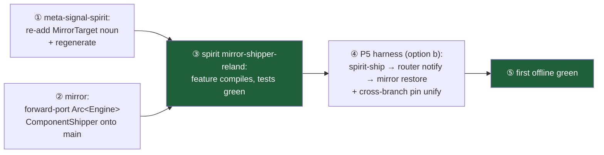

# 669 — Synthesis: the offline first-e2e path, sharpened by building it

Four designer slices ran in parallel (frame: `0-frame-and-method.md`): one BUILD (P1, re-land the
shipper) and three DESIGN (P5 harness, criome integration+ceremony, router m3+deploy). The build
slice is the valuable one — attempting the re-land turned the abstract "re-land + pin reconcile" into
a precise, deeper critical path.

## The headline: the offline green is a short path, but not spirit-only

Re-landing the dropped `MirrorShipper` onto spirit revealed it depends on **two upstream fixes** that
must land first. P1 honestly stopped at the wall rather than hand-rolling around it:

- **Default spirit build is GREEN** on branch `mirror-shipper-reland` (commit `4acce197`, local) with
  the reconciled pins — the production daemon path compiles; the shipper is re-landed gated
  off-by-default (`src/shipper.rs`, `tests/mirror_shipper.rs`, `Store::engine_handle()` shared-Arc
  seam, the `mirror-shipper` Cargo feature).
- **The `mirror-shipper` feature does NOT compile**, blocked by two real upstream gaps:
  1. **meta-signal-spirit dropped the `MirrorTarget` schema noun.** Current `ConfigureRequest` has no
     `mirror_target`; `MirrorTarget`/`MirrorAddress` are gone. The shipper's `configure()` needs
     them. Re-adding by hand in spirit would violate schema-emitted-nouns — the fix is a
     **meta-signal-spirit contract change + regenerate**.
  2. **The only `mirror::ComponentShipper` that takes a shared `Arc<Engine>` is on `mirror`'s
     `arc-shipper` branch, which no longer compiles** — it pins nota-next 0.4.0 while current
     signal-mirror is on 0.5.0. mirror *main* regressed `ComponentShipper` to take `Engine` by value,
     which a store holding `Arc<Engine>` cannot satisfy (`sema_engine::Engine` is intentionally not
     `Clone`). The fix is **forward-port the `Arc<Engine>` shipper onto mirror main's 0.5.0 base**.

### Corrected critical path to the offline green

①②③ are designer-lane (feature branches); ④ also needs an operator-ish **cross-branch pin unify**
(the harness links the `mirror` dep and signal-router's `router-network-transport` branch in one test
binary, so their triad-runtime/sema-engine/signal-mirror versions must agree).

## P5 — the harness design (option b chosen)

Grounded against code: the mirror contract is pull-only (`Append`/`PublishCheckpoint`/`Restore`/
`ObserveHeads`, **no notify**) and the router delivers only chat-shaped `Message` bodies to
`Human`/`HarnessSocket`/`PtySocket` (**no mirror endpoint**). So the two transports are genuinely
disjoint, confirming 668. The chosen first green is **option (b)**: prove the chain as two real legs
joined by a **router-carried object-accepted notice** (a harness-local `MirrorObjectNotice { store,
head }`, reusing signal-mirror's `HeadMark` shape, no new shipped contract), with mirror B fetching
**exactly the head the router announced** as the causal seam. Assertions: `Durability::ServerCommitted`
after ship, `ForwardedRemote` trace on the router hop, witnessed body == notice, and mirror B's
restored records identical up to the announced head. Spirit `5osd`'s production shape (router triggers
the mirror's *own* fetch, `EndpointKind::Mirror`) is the explicit **second milestone**, with a stated
promotion path.

## Live/gated track — fully designed, build-ready

- **criome integration** (`669/3`): a strict operator main-integration checklist (land signal-criome
  `criome-admission-gate` → main; repin criome — which also clears the `783cc2fa`-vs-`4b27b93` lock
  skew; advance criome main to the auth-pilot stack; `nix flake check`). The cluster-root **provisioning
  ceremony**: cluster-root is a distinct `MasterKey` secret operator-custodied off the nodes (0600);
  only its public key travels. Recommended **Option A** — a one-shot offline criome CLI
  `AdmitRegistration` that signs the `RegistrationStatement` (over meta `Configure`, which must never
  hold the secret, or an external authority, which re-opens circularity). First live e2e runs **gated**;
  the self-admit hatch is scoped to a node's own `Host` self-registration. The one missing piece for a
  gated live e2e: **no code signs a `RegistrationStatement` outside tests** — the `AdmitRegistration`
  command is it. Deferred per "no key encryption for now."
- **router m3 + deploy** (`669/4`): m3 = a `CriomeForwardAttestation` impl of the existing verifier
  seam delegating to the local criome daemon, a router-owned seen-`(signer, ReplayNonce)` window +
  `issued_at` skew run off-mailbox, a sixth `router.sema` family (`router-forward-replay`, schema
  2→3, restart-surviving), and richer refusal mapping. Two grounded corrections: `criome_socket_path`
  and the `ReplayDetected`/`ClockSkew` variants **already exist** (m3 adds only logic, no contract
  change); and the m2 verifier trait is **sync** while a criome client must be **async** — a real
  load-bearing change (async-trait/dyn-AFIT risk) to spike first. **Deploy resolves Tailscale-vs-
  Yggdrasil decisively toward Yggdrasil** (cluster-wide deployed, key-derived stable addresses,
  `/etc/hosts`-resolvable, both nodes carry `200::/7` addresses; the deployed mirror's Tailscale bind
  is the outlier to reconcile at m4). Needs two new NixOS modules — `criome.nix` + `message-router.nix`
  (modeled on `mirror.nix`; criome has **no** module today, and `modules/nixos/router/` is the
  unrelated WiFi gateway) — and a new **`MessageFabric` capability** gating both daemons on both nodes
  (over dragging `PersonaDevelopment` onto prometheus).

## Decisions and handoffs

| # | Item | Owner | Default / recommendation |
|---|---|---|---|
| H1 | Re-add `MirrorTarget` to the **meta-signal-spirit** contract + regenerate | designer | proceed (in-lane) |
| H2 | Forward-port the `Arc<Engine>` `ComponentShipper` onto **mirror main** (not refresh arc-shipper) | designer | proceed — main is the green/deployed lineage |
| H3 | Wire P5 harness as **option (b)** for the first green | designer | proceed; option (a)/`5osd` is milestone two |
| H4 | The **cross-branch pin unify** (mirror + signal-router branches in one binary) | operator | flag — operator owns main + rebase |
| H5 | criome **Part 1** main-integration (removes the placeholder) — land now or hold | operator | can land independently now |
| H6 | **Yggdrasil** as the live daemon fabric (mirror.nix Tailscale reconcile at m4) | psyche/system | recommended, grounded; confirm for the live track |
| H7 | `AdmitRegistration` ceremony CLI + key-custody track | deferred | per "no key encryption for now"; pull forward when the live mesh needs trust |

## Bottom line

The offline first green is real and close, but the honest path is **two upstream unblocks
(meta-signal-spirit `MirrorTarget`; mirror `Arc<Engine>` forward-port) → spirit feature compiles →
the option-(b) harness**, with one operator cross-branch pin unify. The live/gated track is now fully
designed and build-ready (criome integration checklist + Option-A ceremony; router m3 + Yggdrasil +
two NixOS modules + a `MessageFabric` capability). Nothing was faked: P1 stopped at the real wall and
named it. The natural next designer round is H1 + H2 (the two unblocks), then H3 (the harness).
