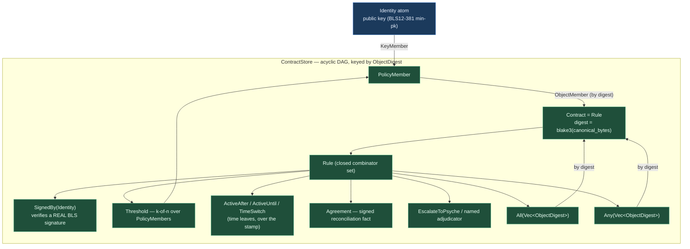
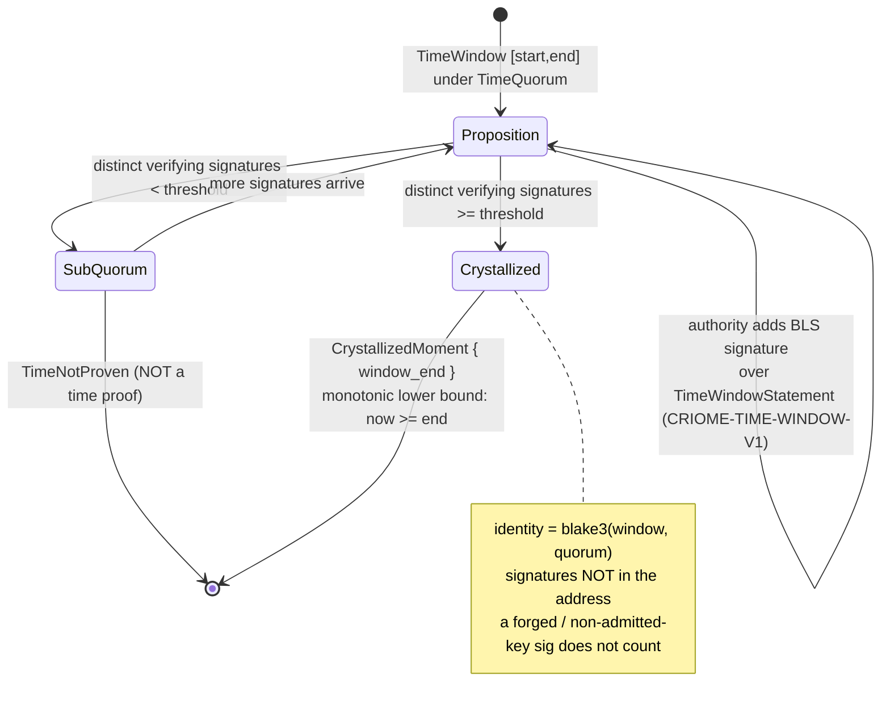
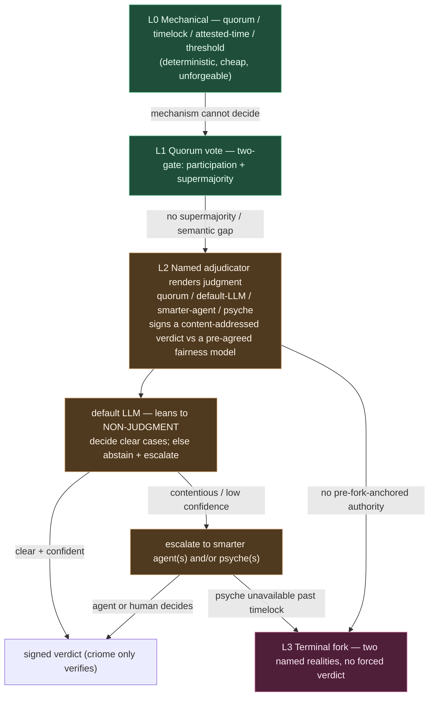
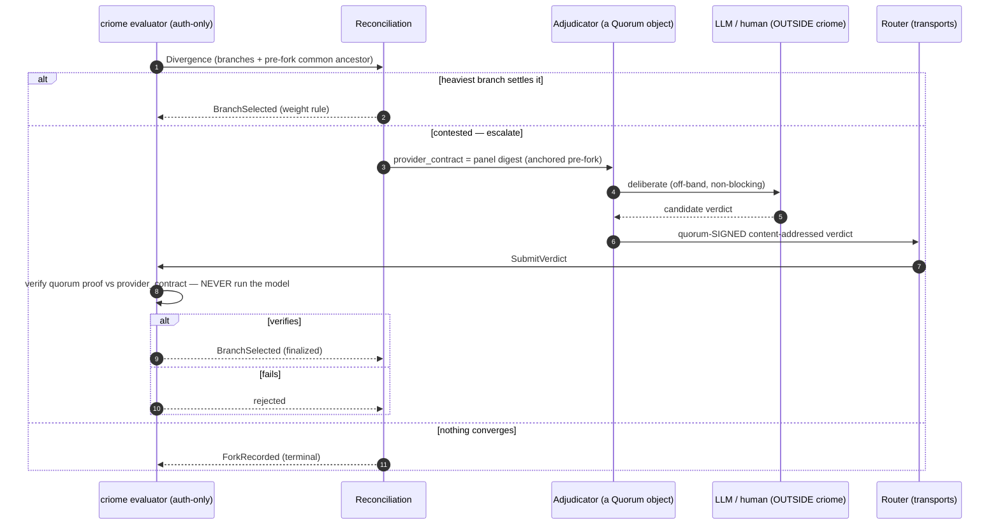

# 674.15 — criome internal policy language: implementation architecture & the binding-constraint catalog

*The capstone of the 674 arc. It stands on its own as the definitive document of
criome's internal policy language: the fixed vision and boundary, the exhaustive
catalog of binding constraints (each cited to its Spirit record or AGENTS rule),
the implementation architecture mapped onto the triad, the real code and verbatim
proof from the two prototypes (G1/G2 content-addressed + real BLS, and G3/G4 the
attested-clock stamped envelope), an honest proven/designed/deferred scorecard, and
the integration path. It synthesizes reports 674.5, 674.9, 674.10, 674.11, 674.13,
and 674.14 — read those for the per-rung detail; this file is the whole.*

## 1. Frame & vision — what criome's internal language is, and the fixed boundary

Per Spirit `vhs2` (Decision): [criome's internal language is a limited typed policy
language over public-key identity atoms - NOT a general-purpose virtual machine -
drawing its limited-operation discipline from the constrained VMs of Ethereum,
Tezos, and Solana ... signature quorums of k-of-n form and thresholds that increase
or decrease over elapsed time ... explicit divergence-reconciliation objects for
when two networks split ... conflict resolution mediated by an LLM-oracle call to a
provider which itself resolves through one of those identity contracts].

The language exists for one telos: **rendering verifiable judgments about
identity**. Identity disputes — who is the rightful controller after key loss, which
fork is legitimate, was an action within the spirit of an agreement — are *semantic*,
and no cryptographic primitive can decide a semantic question (674.9). So the
language is the scaffolding that gives a *fair judgment* force, never the judge
itself.

The lines that do not move:

- A **limited** typed policy language, never a VM (`vhs2`). The proof it stayed
  inside that line is the **absence of a gas meter**: a closed, acyclic combinator
  vocabulary buys guaranteed halting and bit-identical re-evaluation without metering.
- criome stays **auth-only** — it signs and verifies, never transports, never runs
  an LLM or a human (`wckt`; criome INTENT). The router transports; the mirror
  version-controls.
- It is built **on** content-addressed composable authorization objects (`z9d6`).
- **criome verifies; Persona/psyche decides** — signed verdicts (LLM or human) are
  only ever *verified*, never re-run.

## 2. The binding-constraint catalog

This is the load-bearing half of the report: every constraint the design must obey,
organized by theme, each cited to its Spirit record id or AGENTS rule. A design that
violates any row below is wrong regardless of how clean it looks.

### 2.1 Identity model & atoms

| # | Constraint | Source |
|---|---|---|
| C1.1 | Public keys are the irreducible identity atom; everything composes above them. | `vhs2` [Public keys are the atomic unit of identity] |
| C1.2 | BLS12-381 min-pk is the signature scheme; the leaf rejects any other scheme. | 674.13 #25; 674.5 §7 |
| C1.3 | `Identity` is a closed enum (Persona / Agent / Host / Developer / Cluster); identity→key resolution is a registry lookup, not inline material. | 674.13 #17/#18 |
| C1.4 | Composition above keys is *only* signature + time-lock mechanics: k-of-n quorums and thresholds varying over elapsed time. | `vhs2` [signature quorums of k-of-n form and thresholds that increase or decrease over elapsed time] |
| C1.5 | Full-English identifiers (`Identifier` not `Id`, `Request` not `Req`); names don't carry ancestry. | AGENTS: spell-every-identifier |

### 2.2 Limited-not-a-VM / determinism

| # | Constraint | Source |
|---|---|---|
| C2.1 | A *limited* typed policy language, never a general-purpose VM. | `vhs2` [a limited typed policy language over public-key identity atoms - NOT a general-purpose virtual machine] |
| C2.2 | Constrained-VM discipline drawn from Ethereum / Tezos / Solana. | `vhs2` [drawing its limited-operation discipline from the constrained VMs of Ethereum, Tezos, and Solana] |
| C2.3 | Closed, acyclic combinator vocabulary; no loops, no user code, every leaf total and bounded. | 674.5 §3 |
| C2.4 | No gas meter — guaranteed halting via the closed acyclic vocabulary, not metering. | 674.5 §1 [absence of a gas meter] |
| C2.5 | Verdicts must be deterministic AND unforgeable; bit-identical re-evaluation. | 674.9 [a policy language's verdicts must be both] |
| C2.6 | No logic-as-schema-data: combinator *types* are schema; interpreting them is hand-written. | `d3r2` [genuine business logic ... stays hand-written] |

### 2.3 Auth-only boundary (verifies, never transports / decides)

| # | Constraint | Source |
|---|---|---|
| C3.1 | criome signs and verifies only; it never transports. | `wckt` [criome stays auth-only (signs and verifies, never transports)] |
| C3.2 | Router transports; mirror version-controls / moves objects. | `wckt` [the router transports; the mirror version-controls and moves objects] |
| C3.3 | criome verifies, Persona/psyche decides — never runs an LLM or a human. | 674.13 #42; 674.5 §1 |
| C3.4 | criome authenticates the SUBMITTER (SO_PEERCRED caller → registered Identity) via after-the-fact, non-blocking, out-of-band attestation. | `2st7` [criome authenticates the SUBMITTER ... non-blocking, out-of-band attestation binding the caller to the exact per-operation content-addressed digest] |
| C3.5 | Authorization targets an exact content-addressed request/digest. | `w2g3` [authorize an exact content-addressed request or log-message digest] |
| C3.6 | e2e chain order: spirit → vcs → criome → router → mirror; criome auth-only, router transport-only, mirror VC substrate. | `d6he` |
| C3.7 | Signed verdicts (incl. LLM/reconciliation) are only *verified*, never re-run/recomputed. | 674.9 Q2; 674.13 #38 |

### 2.4 Content-addressed composable objects

| # | Constraint | Source |
|---|---|---|
| C4.1 | Contracts are content-addressed composable objects; deps reference each other's content-addressed objects, not mutable state. | `z9d6` [content-addressed composable objects ... refer to each other's content-addressed contract objects rather than ad hoc mutable state] |
| C4.2 | A contract's identity IS `blake3(canonical_bytes)` (reuse deployed `ObjectDigest`). | 674.5 §2 |
| C4.3 | A quorum member may be a key OR another object by digest (`PolicyMember`). | `z9d6`; 674.5 §2 |
| C4.4 | Acyclic-at-admission: a contract may reference only already-admitted digests → strict DAG, bounded recursion. | 674.5 §2; 674.13 #15 |
| C4.5 | Threshold/majority/time-window policies are logic *layered on* the composable objects. | `z9d6` |
| C4.6 | The fairness-model/prompt is itself a first-class content-addressed object the verdict's signature covers; criome never interprets it. | 674.9 New A; 674.13 #40 |
| C4.7 | Explicit divergence-reconciliation objects for network splits. | `vhs2` [explicit divergence-reconciliation objects for when two networks split] |

### 2.5 Triad + schema-first interface discipline

| # | Constraint | Source |
|---|---|---|
| C5.1 | Strict, absolute engine separation: SEMA = all durable state, NEXUS = all decisions, SIGNAL = all communication; no concern outside its engine. | `3d5z` |
| C5.2 | Exactly two contracts: `signal-criome` + `meta-signal-criome`; no third. | `7sx6` |
| C5.3 | Schema files are typed interface contracts; engines communicate through schema-emitted objects only. | `xbc2`; `a71r` |
| C5.4 | Only `decide`/`validate` bodies stay hand-written; all other boilerplate generated. | `t5wx` |
| C5.5 | Every Rust fn is a method/associated-fn/trait-impl on a data-bearing type; macros emit into `impl`, no free helpers. | AGENTS: every-fn-a-method |
| C5.6 | Schema-emitted nouns; the `Rule`/`Decision`/`Threshold` enums are SIGNAL types. | AGENTS schema-emitted; 674.13 |
| C5.7 | NOTA records positional, not labeled; component triad = daemon + signal + meta-signal. | AGENTS: positional NOTA; component triad |
| C5.8 | No backward-compatibility pre-production. | AGENTS: no-backward-compat |
| C5.9 | Canonical encoding is a NEXUS hand-written method, not a fourth concern / data property. | 674.13 #19 |

### 2.6 Attested time (crystallized past)

| # | Constraint | Source |
|---|---|---|
| C6.1 | Clock is decentralized quorum-attested coarse time — not a single trusted clock, not precise wall-time, and crystallized PAST. | `ay3y` [a decentralized quorum-attested coarse time ... and it is crystallized PAST] |
| C6.2 | A time attestation is a forward-window proposition, content-addressed by itself; a quorum co-signs; it closes at last signature or window expiry. | `ay3y` |
| C6.3 | Once closed it is a non-forgeable monotonic lower bound on now; only the past is provable. | `ay3y` [a non-forgeable monotonic lower bound on now] |
| C6.4 | A time authority is just another criome quorum object over a time-window claim. | `ay3y` [a time authority is just another criome quorum object] |
| C6.5 | Tolerance gap is bounded below by quorum signing latency, widens under partition/divergence, tighter when healthy. | `ay3y` |
| C6.6 | Every triad input/output carries its own crystallized timestamp; time-locks compare the operation's own proof-of-when, NOT caller-supplied or ambient system clock. | `ay3y` [compare against the operation's own proof-of-when rather than a caller-supplied or ambient system clock] |

### 2.7 Adjudicator / escalation ladder

| # | Constraint | Source |
|---|---|---|
| C7.1 | Contracts may escalate to a named adjudicator — mechanical quorum, LLM-panel, smarter agent, or psyche — whose signed content-addressed verdict criome only verifies. | `gc0n` |
| C7.2 | Non-judgment is a first-class adjudicator output; an adjudicator may decline and escalate. | `gc0n` [non-judgment is a first-class adjudicator output] |
| C7.3 | The default LLM adjudicator is trained to lean toward non-judgment — abstain/escalate rather than decide low-confidence or contentious cases. | `gc0n` |
| C7.4 | The psyche is the highest-authority, lowest-availability adjudicator; escalate-to-psyche is the literal expression of intent-is-primordial. | `gc0n` [the psyche is the highest-authority and lowest-availability adjudicator ... architectural expression of intent-is-primordial] |
| C7.5 | Competence-gated not failure-gated; defer upward, ultimately to the human. | `gc0n`; 674.9 |
| C7.6 | Conflict resolution may be mediated by an LLM-oracle call to a provider that itself resolves through an identity contract (e.g. paid expert panel). | `vhs2` [mediated by an LLM-oracle call to a provider which itself resolves through one of those identity contracts] |
| C7.7 | LLM is the apex (invoked last, ratified by quorum, anchored pre-fork), never the base/trust-root. | 674.9 bottom line |
| C7.8 | Right-to-escalate is itself policy-gated (a `Rule`, NEXUS) — only the deliberation it gates is external. | 674.13 #45 |
| C7.9 | Escalate-to-psyche pairs with a timelock fallback for human unavailability; terminal fork is honest non-resolution. | 674.9 New E; 674.5 §4 |

### 2.8 Crypto & admission

| # | Constraint | Source |
|---|---|---|
| C8.1 | Cluster-root identity signs member keys; `RegisterIdentity` requires a valid root signature (registry admission gate). | `ermr` [a cluster-root identity signs member keys, and that signature is criome registry admission gate] |
| C8.2 | Cross-system peers trust keys chained to the cluster root; non-circular bootstrap. | `ermr` |
| C8.3 | criome generates its master BLS keypair on first run, persists the secret to a 0600 key file; the secret never leaves criome. | `psc6` [the secret never leaves criome] |
| C8.4 | Real BLS verification over the exact operation digest (deployed `blst`, `ATTESTATION_DST`); set-membership is not verification. | 674.5 §7; 674.13 #27 |
| C8.5 | Signature bound to a domain-tagged preimage built identically by signer and verifier (`CRIOME-OPERATION-AUTHORIZATION-V1`). | 674.13 #22 |
| C8.6 | Replay/branch binding: every proof anchored to (object-digest, branch, monotonic-version, attested-moment). | 674.10 G4; 674.13 #35 |

### 2.9 Daemon / process discipline

| # | Constraint | Source |
|---|---|---|
| C9.1 | The daemon takes exactly one pre-generated rkyv startup message; rejects inline NOTA and `.nota`. | AGENTS: one-argument daemons |
| C9.2 | No flags ever; new config = typed startup field or authenticated meta-signal message. | AGENTS: binary startup |
| C9.3 | A virgin daemon may start unconfigured awaiting an authenticated binary meta-signal config; on restart self-resumes from persisted SEMA state. | AGENTS: binary startup |
| C9.4 | Canonical name is **criome** (component) / **criomos** (OS); on-disk path spelling preserved when citing. | `cx2m` |
| C9.5 | Durable state (contract store, key registry, replay-nonce, version/slot counters) lives in SEMA; the missing `criome-contract` SEMA family keyed by `ObjectDigest` is the one real internal gap. | 674.13 #14, §genuine-gap |

## 3. Implementation architecture

### 3.1 The triad mapping (`3d5z`, `t5wx`, `d3r2`)

Every part of the language maps to exactly one engine, or is correctly *not*
criome's. The decision rule has four outcomes (674.13): **SIGNAL** = a data *shape*
on the wire/state (the closed type vocabulary); **SEMA** = durable state surviving
restart; **NEXUS** = the hand-written `decide`/`validate` *behavior*; **(d)** =
another component (router transport, external adjudicator). The discipline is:
SIGNAL types are defined once and *used* by the others; NEXUS owns behavior and
operates over SIGNAL types and SEMA state; only `decide`/`validate` bodies are
hand-written (`t5wx`), because logic is not schema-as-data (`d3r2`).

```mermaid
flowchart LR
  subgraph SIGNAL["SIGNAL — types (schema-emitted), define-once"]
    direction TB
    S1["Contract / Rule / PolicyMember / Threshold"]
    S2["Identity / SignatureEnvelope / SignatureScheme"]
    S3["Evidence (operation, stamp, signatures, agreements)"]
    S4["Decision / RejectionReason"]
    S5["AttestedMoment / TimeWindow / TimeQuorum / TimeAttestation"]
    S6["Divergence / ReconciliationPolicy / TerminalFork / Fairness-model blob"]
  end
  subgraph NEXUS["NEXUS — hand-written decide/validate bodies"]
    direction TB
    N1["evaluate(Rule) — All/Any fold, leaf verdicts"]
    N2["has_valid_signature_from — real BLS verify"]
    N3["admit — acyclicity / DanglingReference"]
    N4["canonical_bytes + blake3 address (CanonicalBytes)"]
    N5["crystallize — quorum→lower-bound; time-lock compare"]
    N6["escalate / non-judgment choice; right-to-escalate gate"]
  end
  subgraph SEMA["SEMA — durable state (survives restart)"]
    direction TB
    M1["ContractStore (criome-contract family — MISSING)"]
    M2["KeyRegistry (criome-identity, cluster-root admission)"]
    M3["replay-nonce + monotonic version/slot counters"]
  end
  subgraph OUT["(d) — NOT criome's"]
    direction TB
    O1["Router — transport, cross-peer signature solicitation"]
    O2["External adjudicator / Persona — LLM inference, human judgment"]
  end
  SIGNAL -->|"used as types"| NEXUS
  SEMA -->|"loaded state"| NEXUS
  NEXUS -.->|"writes gated by validate"| SEMA
  NEXUS -->|"verifies signed verdict from"| OUT
  classDef sig fill:#1b3a5c,stroke:#7fb3ff,color:#eaf2ff
  classDef nex fill:#4f3a1f,stroke:#d3a579,color:#fff4ea
  classDef sem fill:#1f4f3a,stroke:#79d3a5,color:#eafff4
  classDef out fill:#4f1f3a,stroke:#d379a5,color:#ffeaf4
  class S1,S2,S3,S4,S5,S6 sig
  class N1,N2,N3,N4,N5,N6 nex
  class M1,M2,M3 sem
  class O1,O2 out
```



Three cross-cutting calls the brief flagged, resolved (674.13, adversarial pass): (1)
**content-addressing / canonical encoding is not a fourth concern** — the output type
(`ObjectDigest`) is SIGNAL, the *act* of rendering canonical bytes and hashing them
is NEXUS, exactly the way `verify` is already factored; (2) **the fairness-model blob
is pure SIGNAL** — criome carries it and lets the verdict's signature cover it but
never interprets it, which is what keeps criome deterministic; (3) **the
right-to-escalate gate is NEXUS, not (d)** — gating *who may pull the escalation
lever* is a `Rule` evaluation; only the deliberation it authorizes is external.

### 3.2 The object model (content-addressed acyclic DAG)

Public keys are the irreducible atom; everything composes above them into
content-addressed objects whose address *is* `blake3(canonical_bytes)` (reusing the
deployed `signal_criome::ObjectDigest`). Composition references sub-objects **by
digest, never inline**. A quorum member is either a key or *another object by digest*
— the `z9d6` hinge that lets a panel be defined once and shared by many parents.



`ContractStore::admit` enforces acyclicity: a contract may reference only digests
already present (a hash cannot name a not-yet-computed hash), so the reference graph
is a strict DAG by construction and evaluation recursion is bounded by store size —
closing the unbounded-recursion drift for free (C4.4). The verb set is the closed
combinator taxonomy: `SignedBy` (one real verify), `Threshold` (k-of-n over
`PolicyMember`s), `All`/`Any` (AND/OR over referenced contracts), `ActiveAfter` /
`ActiveUntil` / `TimeSwitch` (time leaves), `Agreement` (signed reconciliation), and
`EscalateToPsyche` → named adjudicator (non-judgment as a first-class output). No
loops, no gas, no user code; every leaf total and bounded (C2.3, C2.4).

### 3.3 The attested-clock stamped envelope (`ay3y`, crystallized past)

The one genuine triad misfit the 674.13 adversarial pass found — the deployed daemon
reading `SystemTime::now()` from an ambient `SystemClock` inside a NEXUS verify body
with no owner — is closed by 674.14. An **`AttestedMoment`** is a quorum-attested
*crystallized-past* time object: it begins as a *proposition* of a forward-extending
window `[start, end]` under a `TimeQuorum`; its identity is the blake3 content
address of the `(window, quorum)` proposition (the signatures are *not* part of the
address); a quorum co-signs it with real BLS over a domain-tagged
`TimeWindowStatement`; and it **crystallizes** once the count of distinct admitted
authorities with a really-verifying signature reaches the threshold — yielding a
non-forgeable **monotonic lower bound** proving `now >= end`. Only the past is
provable. `Evidence.observed_at` is replaced by `Evidence.stamp: AttestedMoment`,
and the evaluator's only source of "now" is `Evidence::crystallized_now(registry)` —
there is no `SystemTime::now()` in the language path (C6.1–C6.6).



**The after/until asymmetry, resolved.** A crystallized stamp proves only a lower
bound on now (`now >= end`). Both time-lock directions read the *same* `window_end`
but ask only past-edge questions a lower bound can honestly answer:

| Rule | Holds iff | Method | Why a lower bound can answer it |
|---|---|---|---|
| `ActiveAfter(T)` (release-after-T) | stamp proves `now >= T` | `window_end >= T` | The proven lower bound already sits at/past T, so `now >= T` is established. |
| `ActiveUntil(T)` (active-until-T) | the operation's window **closed** at/before T | `window_end <= T` | A window that closed at `window_end <= T` is a proof-of-when sitting within the still-active interval. |

The resolution is that **the operation carries its own proof-of-when**. We never ask
"is the live present before T?" — a lower bound cannot prove that, and crystallized
past is explicitly only-the-past. A new `TimeNotProven` rejection distinguishes a
sub-quorum/unproven stamp from a stamp that merely misses the boundary
(`OutsideTimeWindow`).

### 3.4 The adjudicator / escalation ladder (`gc0n`, 674.9)

Competence-gated, not failure-gated: a judge that is not confident renders a
*non-judgment* and escalates rather than forcing a verdict. The cheap, deterministic,
unforgeable rungs (L0/L1) carry the routine load; judgment (L2) is summoned only when
mechanism is exhausted; the psyche is the highest-authority, lowest-availability rung;
a terminal fork (L3) is honest non-resolution. criome itself stays at L0 — it
*verifies* the signed verdict and moves nothing.



The key inversion (674.9): the adjudicator *proposes*, the gated quorum (or named
human) *disposes*, and the verdict's authority is the signature over a *pre-agreed
fairness-model object* — never the model's raw output. So "a fair LLM decided" is,
mechanically, "a legitimate quorum decided, using an LLM as its deliberation aid"
(C7.7). The regress ("who decides who decides?") bottoms out only by pinning the
resolver to a **pre-fork common ancestor** both sides accepted before the split; the
judge cannot rule on its own legitimacy, so governance schisms terminate in L3.

### 3.5 Divergence reconciliation, including the LLM-oracle path

Tezos self-amendment in miniature: a weight-based winner, escalating to a
quorum-gated finalization, escalating to a named adjudicator, with a recorded fork as
the terminal state. The LLM never runs inside criome — the policy verifies a
quorum-signed, content-addressed verdict (the Chainlink pattern), and the provider
that signs is *itself* a criome quorum object, closing the authority back into the
same vocabulary.



### 3.6 The determinism boundary — hand-written vs schema-emitted vs other-component

The line that keeps the language deterministic and auth-only:

| Layer | What lives here | Rule |
|---|---|---|
| **Schema-emitted (SIGNAL)** | the closed type vocabulary: `Rule`, `Contract`, `PolicyMember`, `Threshold`, `Evidence`, `Decision`, `RejectionReason`, `AttestedMoment` & family, divergence objects, the fairness-model blob | C2.6, C5.3, C5.6 — types are define-once schema; *interpreting* them is not data |
| **Hand-written (NEXUS)** | only `decide`/`validate` bodies: `evaluate`, `has_valid_signature_from`, `admit`/acyclicity, `canonical_bytes`+address, `crystallize`+time-lock compare, the escalate/non-judgment choice, the right-to-escalate gate | C5.4, C5.9 — logic, not schema-as-data (`t5wx`/`d3r2`); every fn a method (C5.5) |
| **Other component (d)** | LLM inference, human judgment, the default-LLM abstaining posture; router transport + cross-peer signature solicitation | C3.1, C3.3, C7.6 — criome verifies the returned signed verdict; it runs and carries nothing |

The clean test all (d) parts pass (674.13): erase criome and the
deliberation/transport still has an owner; erase the adjudicator/router and criome
can still verify a verdict that arrives by any means. The verify is criome's; the
produce-and-carry is not.

## 4. The code & the proof

Both prototypes were built in the worktree
`~/wt/github.com/LiGoldragon/criome/language-content-addressed-bls` (branch
`language-content-addressed-bls`, off criome main), and are **not landed** — they are
the shape for operator to rebase onto main. The G3/G4 commit `79367ce` (the
attested-clock stamped envelope) sits atop the G1/G2 commit `b97db6b`. criome main is
untouched.

### 4.1 The real key types (content-addressed `Rule` + the `z9d6` hinge, from G1/G2)

```rust
pub enum Rule {
    SignedBy(Identity),                 // leaf — verifies a real BLS signature
    All(Vec<ObjectDigest>),             // AND over referenced contracts (by digest)
    Any(Vec<ObjectDigest>),             // OR  over referenced contracts (by digest)
    Threshold(Threshold),               // k-of-n over PolicyMembers
    ActiveAfter(TimedRule),             // timelock release — over the stamp
    ActiveUntil(TimedRule),             // window close     — over the stamp
    TimeSwitch(TimeSwitch),             // two-phase quorum
    Agreement(AgreementRule),           // quorum-signed reconciliation
    EscalateToPsyche,                   // non-judgment outcome (operator's rung)
}

pub enum PolicyMember {
    KeyMember(Identity),                // a key whose signature is verified
    ObjectMember(ObjectDigest),         // another admitted object, by digest
}
```

Real BLS verification — no set-membership survives (closes critic F1, C8.4): resolve
the `Identity` to its admitted `BlsPublicKey`, require the envelope's key to equal the
admitted key, reject any scheme but the implemented min-pk, then call the **deployed**
`VerifyBls::verify_bls` (`blst` min-pk under `ATTESTATION_DST`) over an
`OperationStatement` preimage binding the exact 32-byte blake3 operation digest.

The crystallization gate (G3/G4) — the whole non-forgeability claim lives here:

```rust
pub fn crystallize(&self, registry: &KeyRegistry) -> Option<CrystallizedMoment> {
    let statement = TimeWindowStatement::new(&self.window).to_signing_bytes();
    let mut satisfied: Vec<&Identity> = Vec::new();
    for attestation in &self.signatures {
        if !self.quorum.admits(&attestation.authority) { continue; }     // non-member: ignored
        if satisfied.contains(&&attestation.authority) { continue; }     // dedup distinct authorities
        if attestation.verifies(&statement, registry) {                  // real BLS over the window
            satisfied.push(&attestation.authority);
        }
    }
    let reached = satisfied.len() as u64 >= u64::from(self.quorum.required_signatures.into_u16());
    reached.then_some(CrystallizedMoment { window_end: self.window.end })
}
```

### 4.2 Verbatim proof

`cargo build` (G3/G4) — clean; `cargo clippy --all-targets -- -D warnings` — clean
(two lints, `manual_contains` and `unnecessary_lazy_evaluations`, surfaced and were
fixed before the clean run). Nix skipped per brief. `cargo test`, all suites:

```
     Running unittests src/lib.rs
test result: ok. 11 passed; 0 failed; 0 ignored; 0 measured; 0 filtered out; finished in 0.00s
     Running unittests src/bin/criome-daemon.rs
test result: ok. 0 passed; 0 failed; 0 ignored; 0 measured; 0 filtered out; finished in 0.00s
     Running tests/actor_discipline_truth.rs
test result: ok. 2 passed; 0 failed; 0 ignored; 0 measured; 0 filtered out; finished in 0.01s
     Running tests/daemon_skeleton.rs
test result: ok. 20 passed; 0 failed; 0 ignored; 0 measured; 0 filtered out; finished in 0.05s
     Running tests/language.rs
running 20 tests
test acyclicity_enforced ... ok
test digest_is_stable_and_distinguishes_contracts ... ok
test explicit_policy_can_escalate_to_psyche ... ok
test missing_reference_during_evaluation_is_a_typed_error ... ok
test schema_sketch_names_every_construct ... ok
test forged_signature_rejected ... ok
test any_prefers_authorization_before_escalation ... ok
test agreement_requires_a_quorum_signed_reconciliation_fact ... ok
test escalation_composes_through_all_after_required_rules_authorize ... ok
test real_bls_authorizes ... ok
test forged_time_signature_rejected ... ok
test subquorum_moment_is_not_a_time_proof ... ok
test object_member_composes_a_sub_contract_into_a_quorum ... ok
test content_addressed_sharing ... ok
test quorum_two_of_three_with_real_signatures ... ok
test timelock_release_with_real_signature ... ok
test active_until_t_via_stamp ... ok
test crystallized_moment_is_a_lower_bound ... ok
test timelock_release_after_t_via_stamp ... ok
test time_switch_tightens_quorum_after_boundary ... ok
test result: ok. 20 passed; 0 failed; 0 ignored; 0 measured; 0 filtered out; finished in 0.03s
   Doc-tests criome
test result: ok. 0 passed; 0 failed; 0 ignored; 0 measured; 0 filtered out; finished in 0.00s
```

Total **53 tests, 0 failures** (11 lib + 0 daemon-bin + 2 actor + 20 daemon-skeleton
+ 20 language + 0 doc). The five required new tests
(`crystallized_moment_is_a_lower_bound`, `subquorum_moment_is_not_a_time_proof`,
`forged_time_signature_rejected`, `timelock_release_after_t_via_stamp`,
`active_until_t_via_stamp`) all pass; the two prior time tests were rewritten onto
real crystallized stamps; all prior G1/G2 tests stay green.

### 4.3 What the tests prove (proven-vs-stubbed, honest)

| Claim | Status | Evidence / note |
|---|---|---|
| Content-addressed `Contract` (blake3, deployed `ObjectDigest`) | **PROVEN** | `digest_is_stable_and_distinguishes_contracts` |
| Composition by digest + acyclic-at-admission strict DAG | **PROVEN** | `content_addressed_sharing`, `object_member_composes_a_sub_contract_into_a_quorum`, `acyclicity_enforced` |
| Missing reference at evaluation = typed error, not panic | **PROVEN** | `missing_reference_during_evaluation_is_a_typed_error` |
| Real BLS12-381 min-pk verify over the exact operation digest | **PROVEN** | `real_bls_authorizes`; deployed `VerifyBls`/`ATTESTATION_DST`, signing via `MasterKey::sign` |
| Forged / non-admitted-key / wrong-scheme / malformed-sig rejected | **PROVEN** | `forged_signature_rejected` (three attacks) |
| k-of-n quorum + typed `QuorumShort` | **PROVEN** | `quorum_two_of_three_with_real_signatures` |
| Quorum-signed window crystallizes into a lower bound `now >= end` | **PROVEN** | `crystallized_moment_is_a_lower_bound` |
| Sub-quorum / forged-time window is not a time proof (`TimeNotProven`) | **PROVEN** | `subquorum_moment_is_not_a_time_proof`, `forged_time_signature_rejected` |
| `ActiveAfter(T)` / `ActiveUntil(T)` over the carried stamp | **PROVEN** | `timelock_release_after_t_via_stamp`, `active_until_t_via_stamp` |
| Evaluator reads no ambient `SystemTime::now()` | **PROVEN** | "now" = `Evidence::crystallized_now`; daemon `SystemClock` in `master_key.rs` is untouched and out of the language path |
| `EscalateToPsyche` + typed `Decision` + All/Any propagation | **PROVEN** | `explicit_policy_can_escalate_to_psyche`, `escalation_composes_through_all…`, `any_prefers_authorization_before_escalation` |
| `Identity → BlsPublicKey` resolution (`KeyRegistry`) | **IN-TEST STAND-IN** | populated in-test; deployed model is cluster-root admission. The verify it gates is real |
| Output-side stamping (replies/attestations carry their own time) | **STUBBED** | `ay3y` says "every triad input AND output"; this PoC stamps the input only |
| Window-**expiry** close path | **STUBBED** | crystallization is purely quorum-reached; "closes at expiry" is prose only (correctly — no wall-clock exists in the language) |
| Partition/divergence gap-widening | **NOT MODELED** | descriptive; the PoC has no network |
| Signed reconciliation resolver-pinning + `Divergence`/`Fork` objects | **PARTIAL** | the resolver signature is really verified; pinning + first-class objects are not built |
| `criome-contract` / attested-moment SEMA family (G10) | **DEFERRED** | still the in-memory `ContractStore`/`KeyRegistry` `Vec` stand-in; time authorities reuse the same in-test registry |
| Schema is *generated* code | **DEFERRED (design-pressure only)** | `schema/criome.language.schema` is updated as design-pressure; the Rust is still hand-written, consistent with `t5wx`/`d3r2` |

## 5. Proven / designed / deferred scorecard

| Mechanic | Status | Constraints satisfied / gap |
|---|---|---|
| Content-addressed composable objects (blake3 = identity, by-digest composition, acyclic DAG) | **PROVEN** | C4.1–C4.5; C2.3/C2.4 (bounded, no gas) |
| Real BLS12-381 min-pk verification, exact-digest binding, domain-tagged preimage | **PROVEN** | C1.2, C8.4, C8.5; C2.5 (deterministic + unforgeable) |
| Attested-clock crystallized-past stamp; evaluator reads no system clock; after/until resolution | **PROVEN** | C6.1–C6.4, C6.6 (input side) |
| Typed `Decision` + `RejectionReason`; `EscalateToPsyche`; All/Any propagation | **PROVEN** | C7.4 (psyche rung), C3.3 (verify-don't-decide) |
| Triad mapping (every part → exactly one engine; nothing needs a fourth) | **DESIGNED + adversarially verified** | C5.1–C5.9 |
| Adjudicator ladder beyond psyche (named-adjudicator, abstaining default, two-gate, terminal fork) | **DESIGNED** | C7.1–C7.3, C7.5–C7.9 |
| Divergence / oracle / fork objects, resolver pinned to pre-fork ancestor | **DESIGNED (signature path proven)** | C4.6, C4.7, C7.6 |
| Output-side stamping; window-expiry close; partition gap-widening | **DEFERRED / NOT MODELED** | C6.2 (expiry), C6.5 (widening), C6.6 (output side) |
| `criome-contract` SEMA family keyed by `ObjectDigest` (the one real internal gap) | **DEFERRED — G10** | C9.5; C5.1 (SEMA leg) |
| Replay / branch binding `(object-digest, branch, monotonic-version, attested-moment)` | **DEFERRED — G4** | C8.6 |
| Schema-*generated* types (vs hand-written) | **DEFERRED (design-pressure)** | C5.3, C5.4 (boundary held; codegen not wired) |
| Cluster-root admission wiring (replacing the in-test `KeyRegistry`) | **DEFERRED** | C8.1, C8.2, C8.3 |
| Wire roots + daemon binary-startup integration | **DEFERRED — G10** | C9.1–C9.3 |

## 6. The integration path

The two foundational gaps are now closed in prototype (**G1 content-addressing + G2
real BLS**, and **G3/G4 the attested-clock stamped envelope**). The remaining work is
enrichment and landing, in order:

1. **Land G1/G2/G3/G4 onto criome main** — the diff-shape is recorded in 674.11 §
   "Diff-shape from operator's v0" plus the G3/G4 stamp re-shape of `Evidence`. These
   touch the deployed crypto and are naturally operator-carried.
2. **The `criome-contract` SEMA family (G10)** — promote the in-memory `ContractStore`
   `Vec`-stand-in to a real SEMA family keyed by `ObjectDigest`, acyclicity enforced at
   admission (C9.5, C5.1). This is the one genuine in-triad gap; `tables.rs` has nine
   families today and none for contracts/policy. The same step generalizes the
   `criome-authorization-replay-nonce` family into the G4 `(object-digest, branch,
   monotonic-version, attested-moment)` anchor (C8.6).
3. **Schema-first public interfaces in `signal-criome` / `meta-signal-criome`** — the
   closed type vocabulary (`Rule`, `Contract`, `PolicyMember`, `Threshold`, `Evidence`,
   `Decision`, `AttestedMoment` & family, divergence objects) becomes schema-emitted
   SIGNAL types defined once and used by NEXUS, with the Input/Output verb roots and the
   `SubmitVerdict` re-entry head; only `decide`/`validate` stays hand-written
   (C5.3, C5.4, C5.9). Exactly two contracts, no third (C5.2).
4. **The stamped triad envelope** — extend stamping to triad *outputs* (C6.6, output
   side), so replies and attestations carry their own crystallized time; migrate the
   deployed `Attestation.issued_at`/`expires_at` off `SystemClock`. The window-expiry
   close is itself a later attested-moment comparison, not a wall-clock (C6.2).
5. **Enrichment** — the named-adjudicator ladder beyond psyche (C7.1–C7.3), signed
   reconciliation with resolver-pinning + `Divergence`/`Fork` objects (C4.6, C4.7,
   C7.6), weighted/two-gate quorum, the verb dimension, piecewise time-varying
   thresholds (C1.4), cluster-root admission wiring (C8.1–C8.3), and binary-startup
   daemon integration (C9.1–C9.3).

**Lane note.** criome main is **operator's**; G1/G2/G3/G4 touch the deployed crypto
and are operator-carried via rebase. Designer prototypes the next shape in
`~/wt/github.com/LiGoldragon/criome/...` as design pressure (the role both prototypes
played), then operator rebases. The two lanes have converged on the same artifact (the
in-tree `language.rs`); the next move is agreeing the rebase shape before piling more
leaf features on. The branch `language-content-addressed-bls` carries commits
`79367ce` (G3/G4) atop `b97db6b` (G1/G2); not pushed, criome main untouched.

## 7. Convergence with operator's parallel lane

This capstone was synthesized before operator's parallel reports landed, so §6's lane
note understates how far operator's path has gone. Both implementation paths (the
parallel-lane model) have now shipped the full arc, and operator's is the schema-first
one — it has advanced *past* the shared `language.rs`:

- **operator 406** — operator's initial in-tree language PoC (the shared `language.rs`
  shape both lanes started from).
- **operator 407** — an operator audit of this designer's `674.11` G1/G2 prototype.
- **operator 408** — the **schema-first landing**: the public policy surface
  (`Contract`/`Rule`/`PolicyMember`, the `AdmitContract`/`LookupContract`/
  `EvaluateAuthorization` verbs) moved into the `signal-criome` triad schema, generated
  to Rust, with `criome`'s hand-written evaluator over the generated nouns and the
  duplicate `criome.language.schema` retired. This **supersedes the hand-Rust
  `language.rs` split** these prototypes used — content-addressing (G1) and real BLS
  (G2) now live in the *schema*, the schema-first discipline (`xbc2`/`a71r`) realized.
  Operator 408 is the canonical integration path; the designer `~/wt` prototypes are the
  design pressure that proved the model.
- **operator 409** — operator's **parallel attested-moment architecture + PoC**, shipped
  alongside this designer's G3/G4 (`674.14`). Both lanes independently built the
  crystallized-past attested clock.

Synthesis, concrete: take operator's schema-first surface (408) as the base; fold the
attested-moment stamped envelope (`674.14` + operator 409) in on the *schema* side; build
the `criome-contract` SEMA family — the one genuine in-triad gap (§5/§6 step 2). The open
designer step is a designer-vs-operator comparison of the two attested-moment embodiments
(`674.14` vs operator 409) to choose the rebase shape before it hardens.
