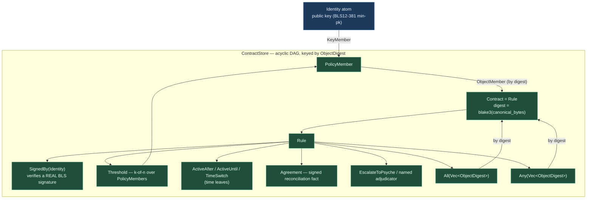
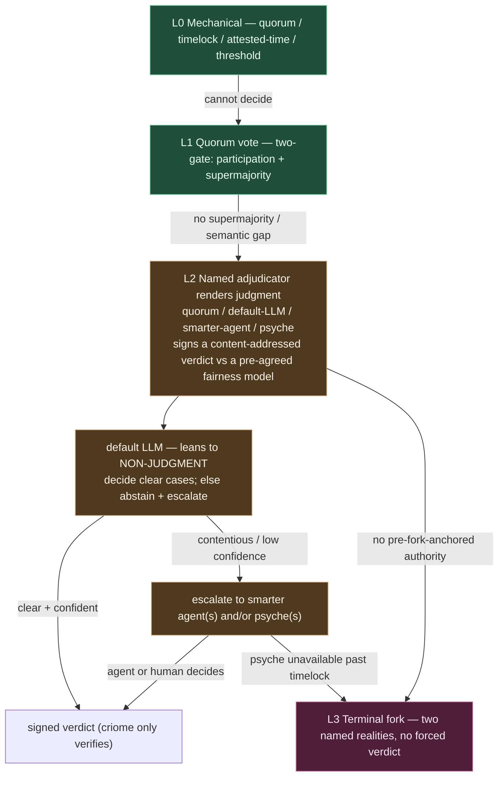
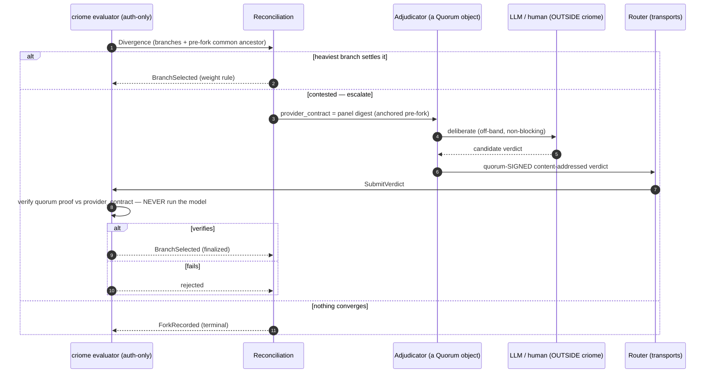

# 674.5 — criome's internal language: the consolidated design (visuals + code)

*This is the design keystone the Phase-2 agent never wrote (its API socket died
mid-run). Back-filled after the prototype `674.11` reconciled the two embodiments
onto the content-addressed shape — so this is not a speculative design, it is the
design as built and proven (15 green tests, real BLS) in
`~/wt/.../criome/language-content-addressed-bls`. It consolidates the object model,
the verb set, the escalation ladder, the clock, and the reconciliation path, with
the real schema and Rust, into one place.*

## 1. The vision and the fixed boundary

Per Spirit `vhs2` (Decision): [criome's internal language is a limited typed policy
language over public-key identity atoms - NOT a general-purpose virtual machine -
drawing its limited-operation discipline from the constrained VMs of Ethereum,
Tezos, and Solana ... signature quorums of k-of-n form and thresholds that increase
or decrease over elapsed time ... explicit divergence-reconciliation objects ...
conflict resolution mediated by an LLM-oracle call to a provider which itself
resolves through one of those identity contracts].

The lines that do not move: a **limited** policy language, not a VM (`vhs2`);
criome stays **auth-only** — signs and verifies, never transports (`wckt`); built
**on** content-addressed composable authorization objects (`z9d6`); criome
**verifies, Persona/psyche decides** (criome INTENT). The proof it stayed inside the
not-a-VM line is the **absence of a gas meter**: a closed, acyclic combinator
vocabulary gets guaranteed halting and bit-identical re-evaluation without metering.

## 2. The object model (as built)

Public keys are the irreducible atom. Everything composes above them into
content-addressed objects whose address *is* the `blake3` digest of the policy's
own bytes (reusing the deployed `signal_criome::ObjectDigest`). A quorum member is
either a key or **another object by digest** — the `z9d6` hinge that lets a panel be
defined once and shared by many parents.



`ContractStore::admit` enforces acyclicity: a contract may only reference digests
already present (a hash cannot name a not-yet-computed hash), so the graph is a
strict DAG and evaluation recursion is bounded by store size.

## 3. The verb / operation set (the limited built-ins)

The closed `Rule` combinator set — no loops, no gas, no user code; every leaf is
total and bounded, the only recursion is reference-following down the acyclic DAG.

| Combinator | Accepts | Total / bounded |
|---|---|---|
| `SignedBy` | one identity; verifies a real BLS signature over the operation digest | leaf — one verify |
| `Threshold` | k-of-n weighted over `PolicyMember`s (key or object-by-digest) | total — finite member set |
| `All` / `Any` | AND / OR over referenced contracts (by digest) | total — finite fan-out |
| `ActiveAfter` / `ActiveUntil` | inner rule gated on a time boundary | total — comparison only |
| `TimeSwitch` | two-phase quorum (before/after a boundary) | total — interval select |
| `Agreement` | a quorum-signed reconciliation fact | total — verify a signature |
| `EscalateToPsyche` (→ named adjudicator) | defers to a quorum / LLM-panel / smarter-agent / psyche | non-judgment as a first-class output |

## 4. The escalation / adjudicator ladder (`gc0n`)

Competence-gated, not failure-gated: a judge that is not confident renders a
**non-judgment** and escalates, rather than forcing a verdict. The default LLM is
trained to abstain toward escalation; the psyche is the highest-authority,
lowest-availability adjudicator. criome only ever *verifies* the signed verdict —
the judgment (including any LLM call) happens outside the evaluator.



## 5. The clock (`ay3y`)

Per Spirit `ay3y`: [criome's identity-policy-language clock is a decentralized
quorum-attested coarse time ... concerned parties periodically co-sign a
current-time-period attestation ... the accepted accuracy gap ... can be widened for
difficult or degraded network situations]. Time is therefore *another quorum-signed
attestation object* — a time authority is just another criome quorum — and time-locks
compare against the attested window, not a caller-supplied timestamp. (Deferred in
the prototype: `observed_at` is still caller-supplied; the attested clock is the next
foundational step, G3.)

## 6. Divergence reconciliation, including the LLM-oracle path

Tezos self-amendment in miniature: a weight-based winner, escalating to a
quorum-gated finalization, escalating to a named adjudicator, with a recorded
**fork** as the terminal state. The LLM never runs inside criome — the policy
verifies a quorum-signed, content-addressed verdict (the Chainlink pattern), and the
provider that signs is *itself* a criome quorum object, so the authority closes back
into the same vocabulary. The meta-divergence regress bottoms out by pinning the
resolver to a **pre-fork common ancestor** both sides accepted before the split.



## 7. The code (real, from prototype 674.11)

The content-addressed `Rule` and the z9d6 `PolicyMember` hinge:

```rust
pub enum Rule {
    SignedBy(Identity),                 // leaf — verifies a real BLS signature
    All(Vec<ObjectDigest>),             // AND over referenced contracts (by digest)
    Any(Vec<ObjectDigest>),             // OR  over referenced contracts (by digest)
    Threshold(Threshold),               // k-of-n over PolicyMembers
    ActiveAfter(TimedRule),
    ActiveUntil(TimedRule),
    TimeSwitch(TimeSwitch),
    Agreement(AgreementRule),           // quorum-signed reconciliation
    EscalateToPsyche,                   // non-judgment outcome (operator's rung)
}

pub enum PolicyMember {
    KeyMember(Identity),                // a key whose signature is verified
    ObjectMember(ObjectDigest),         // another admitted object, by digest
}
```

Acyclicity at admission (the strict-DAG guarantee, closes critic F2/F6):

```rust
pub fn admit(&mut self, contract: Contract) -> Result<ObjectDigest, AdmissionError> {
    for reference in contract.rule().referenced_digests() {
        if !self.contains(&reference) {
            return Err(AdmissionError::DanglingReference(reference));
        }
    }
    // insert keyed by contract.digest() = blake3(canonical_bytes)
}
```

Real BLS verification — no set-membership survives (closes critic F1):

```rust
pub fn has_valid_signature_from(&self, identity: &Identity, registry: &KeyRegistry) -> bool {
    let Some(admitted_key) = registry.public_key(identity) else { return false; };
    let statement = OperationStatement::new(identity, &self.operation).to_signing_bytes();
    self.signatures.iter().any(|envelope| {
        matches!(envelope.scheme, SignatureScheme::Bls12_381MinPk)
            && &envelope.public_key == admitted_key
            && admitted_key.verify_bls(&envelope.signature, &statement)  // deployed blst, ATTESTATION_DST
    })
}
```

## 8. The schema (NOTA, content-addressed shape)

```
Rule [
  (SignedBy IdentityHandle)
  (All (Vector ObjectDigest))        ;; references, not inline rules
  (Any (Vector ObjectDigest))
  (Threshold Threshold)
  (ActiveAfter TimedRule) (ActiveUntil TimedRule) (TimeSwitch TimeSwitch)
  (Agreement AgreementRule)
  EscalateToPsyche
]
PolicyMember [ (KeyMember IdentityHandle) (ObjectMember ObjectDigest) ]
Threshold { required_signatures RequiredSignatureThreshold  members (Vector PolicyMember) }
Evidence { operation OperationDigest  signatures (Vector SignatureEnvelope)  agreements (Vector AgreementFact) }
Decision [ Authorized (Rejected RejectionReason) EscalateToPsyche ]
```

## 9. Real test output (verbatim, prototype 674.11)

```
     Running tests/language.rs
running 15 tests
test acyclicity_enforced ... ok
test content_addressed_sharing ... ok
test object_member_composes_a_sub_contract_into_a_quorum ... ok
test digest_is_stable_and_distinguishes_contracts ... ok
test real_bls_authorizes ... ok
test forged_signature_rejected ... ok
test quorum_two_of_three_with_real_signatures ... ok
test timelock_release_with_real_signature ... ok
test time_switch_tightens_quorum_after_boundary ... ok
test agreement_requires_a_quorum_signed_reconciliation_fact ... ok
test explicit_policy_can_escalate_to_psyche ... ok
test escalation_composes_through_all_after_required_rules_authorize ... ok
test any_prefers_authorization_before_escalation ... ok
test missing_reference_during_evaluation_is_a_typed_error ... ok
test schema_sketch_names_every_construct ... ok
test result: ok. 15 passed; 0 failed; 0 ignored; 0 measured; 0 filtered out
```

(Plus the deployed crypto's 20 daemon + 2 actor + 11 lib tests still green;
`cargo build` + `cargo clippy --all-targets -- -D warnings` clean.)

## 10. Proven / deferred scorecard

| Mechanic | Status |
|---|---|
| Content-addressed `Contract` (blake3, deployed `ObjectDigest`) | **PROVEN** |
| Composition by digest + acyclic-at-admission DAG | **PROVEN** |
| Real BLS12-381 min-pk verification (deployed `VerifyBls`, `ATTESTATION_DST`) | **PROVEN** |
| Signature bound to the exact operation digest; forged/non-admitted/malformed rejected | **PROVEN** |
| k-of-n quorum, timelock, two-phase time-switch over real signatures | **PROVEN** (time comparison real; clock not) |
| `EscalateToPsyche` + typed `Decision` + All/Any propagation | **PROVEN** (operator + prototype) |
| `Identity → BlsPublicKey` resolution (`KeyRegistry`) | in-test stand-in for cluster-root admission; the verify it gates is real |
| Attested clock (`ay3y`) | **DEFERRED — G3, next foundational step** |
| Replay / branch binding | **DEFERRED — G4** |
| Signed reconciliation resolver-pinning + `Divergence`/`Fork` objects | **DEFERRED — G6** (signature real; pinning not) |
| Named-adjudicator ladder beyond psyche; abstaining-default | **DESIGNED — `gc0n`** (psyche rung built) |
| Wire / SEMA `criome-contract` family | **DEFERRED — G10** |

## 11. Path forward

Foundational gaps closed in prototype: **content-addressing (G1) + real BLS (G2)**.
Next foundational step: **G3+G4 — the attested clock (`ay3y`) + replay binding, as
one signed `(object-digest, branch, monotonic-version, attested-moment)` anchor**,
then G6 (signed reconciliation + resolver-pinning) and the named-adjudicator ladder,
then G10 (wire/SEMA). Lane: criome main is operator's; G1/G2 are the operator rebase
(diff-shape in `674.11`); designer carries the next prototype rungs in `~/wt`.
