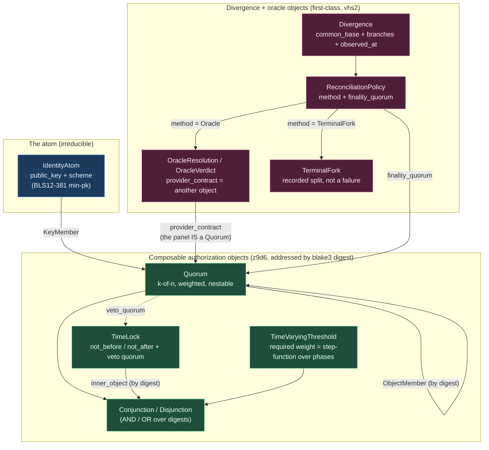

# 674.8 — criome's internal engine: a limited typed identity-policy language (psyche meta-report)

*Synthesis of the nine-agent session. Reads files 0–7 plus the adversarial
critique, and reports the definitive state of the design: what is proven, what
is designed-but-unbuilt, and what is genuinely unresolved and needs a psyche
decision. Honest framing up front: the **design-synthesis file `5` was never
written** — Phase 2 did not land before the Phase-3 agents ran. So this session
produced **two parallel embodiments of the design** instead of one design plus
its encodings: a content-addressed NOTA schema (file `6`) and a runnable Rust
PoC (file `7`), each independently reconstructed from the constraints and the
research. They do not fully agree, and that disagreement is the most important
finding in this report.*

## 1. The vision, restated — and the line that does not move

The psyche captured criome's internal language as Spirit `vhs2` (Decision,
Medium). Quoted literally:

> [criome's internal language is a limited typed policy language over public-key
> identity atoms - NOT a general-purpose virtual machine - drawing its
> limited-operation discipline from the constrained VMs of Ethereum, Tezos, and
> Solana. Public keys are the atomic unit of identity; above them it composes
> complex identity contracts from signature and time-lock mechanics: signature
> quorums of k-of-n form and thresholds that increase or decrease over elapsed
> time. It carries explicit divergence-reconciliation objects for when two
> networks split and how the reconciliation is determined, where conflict
> resolution may be mediated by an LLM-oracle call to a provider which itself
> resolves through one of those identity contracts - for example a paid expert
> panel adjudicating the fairest resolution model. This is criome's Nexus object
> and verb vocabulary, the objects and operations the identity world treats, to
> be researched, defined in schema, and prototyped.]

### The hard boundary (FIXED, not design choices)

| Line | Source | What it forbids |
|---|---|---|
| A **limited typed policy language**, NOT a general-purpose VM | `vhs2` | No Turing-complete execution, no user scripting, no gas-metered general computation, no unbounded loops. Evaluation total and terminating *by construction*. |
| criome stays **auth-only** — signs and verifies, never transports | `wckt` | No verb may move bytes, fetch, deliver, or version-control. Router transports; mirror version-controls. |
| Build **ON** z9d6 content-addressed composable authorization objects | `z9d6` | Objects reference each other by the digest of their bytes, never by name into mutable state. Threshold/majority/time-window policies *layer on* these objects; they are not primitives beside them. |
| **Triad-consistent** — this is criome's Nexus object/verb vocabulary | `a71r`/`3d5z` | Not a fourth engine. It extends the deployed criome identity model (BLS, `MasterKey`, cluster-root admission), it does not replace it. |

The whole research arc found one keystone framing for the boundary: criome is the
**validation half of ERC-4337's validate/execute split, promoted to the entire
language** (file `3`, the #1-ranked transfer). A criome policy is a pure,
side-effect-free, simulatable "may this act?" predicate. The "never transports"
line is the same line Ethereum draws between `validateUserOp` and execution —
made absolute. And by choosing a closed, acyclic combinator vocabulary, criome
gets the EVM's two prized properties (guaranteed halting + bit-identical
re-evaluation) **without a gas meter** — the absence of a gas meter is the proof
it stayed inside the not-a-VM line.

## 2. The object model

Public keys are the irreducible atom. Everything composes above them into
content-addressed authorization objects whose *address is the digest of their
own policy bytes* (the Solana-PDA insight from file `3`: a keyless identity whose
"signature" is the satisfaction of its rules, with no private key to steal).



The two crucial edges to notice, both grounded in z9d6:

- **A quorum member is itself an atom OR another object by digest.** A panel
  quorum can be defined once and referenced by both an oracle-authority object and
  a recovery object. This composition — object-references-object-by-digest — is
  what makes the language a language (constraint C1).
- **The oracle's authority closes back into the same object model.** `OracleResolution.provider_contract`
  is an `AuthorizationObjectDigest`: the paid expert panel *is* a `Quorum`. So
  "an LLM-oracle call to a provider which itself resolves through one of those
  identity contracts" is visible in the type, not a footnote.

## 3. The verb / operation set (the limited built-ins)

Two distinct surfaces emerged. The **wire verbs** (file `6`, the daemon's Nexus
operation heads) and the **policy combinators** (the closed `Policy` taxonomy
the evaluator computes over). Both are closed taxonomies — no `Unknown`, no user
code.

### Wire verbs (file `6` input roots)

| Verb | Input | Output | Deterministic? | Auth-only? |
|---|---|---|---|---|
| `ComposeObject` | `ObjectComposition` (object + composer) | `ObjectComposed` (digest) | yes (digest = blake3 of bytes) | mints an object; moves nothing |
| `EvaluateAuthorization` | `AuthorizationEvaluation` (object digest + evidence + requester) | `AuthorizationDecided` (`Authorized`/`Rejected` + satisfied members + active weight) | **yes — pure validate predicate** | the ERC-4337 validate half; no side effects |
| `ResolveDivergence` | `DivergenceResolution` (reconciliation policy) | `DivergenceResolved` (`BranchSelected`/`ForkRecorded`/`AwaitingOracle`) | yes per honest replica | adjudicates; transports nothing |
| `SubmitOracleVerdict` | `OracleVerdictSubmission` (signed verdict) | `OracleVerdictAccepted` | yes (verifies a quorum proof) | verifies; does NOT call the model |
| `VerifyAuthorizationProof` | `AuthorizationProofVerification` (object + proof) | `ProofVerified` | yes | pure verification |

### Policy combinators (the closed `Policy` enum — the whole limited language)

| Combinator | What it accepts | Total / bounded? |
|---|---|---|
| `Atom` | a single public-key signature | leaf — trivially total |
| `Reference` | another object by digest | bounded by the acyclic DAG |
| `Quorum` | k-of-n weighted over members (atoms or objects) | total — finite member set |
| `TimeLock` | inner object active only in `[not_before, not_after)`, with optional veto quorum | total — comparison only |
| `TimeVaryingThreshold` | required weight as a step-function over a phase schedule | total — interval selection, no arithmetic VM |
| `Conjunction` / `Disjunction` | AND / OR over referenced objects | total — finite fan-out |
| `Reconciliation` | a divergence policy (weight / quorum / oracle / fork) | total per the resolver's proof |

The VM-drift smell test (file `3`, critique F6): every leaf is bounded, total,
non-recursive. The only recursion is reference-following down the
content-address DAG. No operation loops, none meters gas, none is
Turing-complete. The single drift vector is **unbounded recursion-by-reference**,
which acyclicity-at-admission + a declared max depth/fan-out closes (see §8).

## 4. The schema (file `6`, the NOTA encoding)

File `6` authored the vocabulary in the deployed schema-next `field Type`
dialect and **validated it through the real deployed compiler**: it parses,
lowers, and every `signal-criome:lib:*` cross-import genuinely resolves against
the real deployed `signal-criome/schema/lib.schema` (with a negative control — a
bogus import name fails with `ImportedTypeNotFound` — proving the check is real,
not a no-op). The core of the schema (abridged to the load-bearing types; full
text in file `6`):

```schema
[(ComposeObject ObjectComposition)
 (EvaluateAuthorization AuthorizationEvaluation)
 (ResolveDivergence DivergenceResolution)
 (SubmitOracleVerdict OracleVerdictSubmission)
 (VerifyAuthorizationProof AuthorizationProofVerification)]

[(ObjectComposed ComposedObjectReceipt)
 (AuthorizationDecided AuthorizationDecision)
 (DivergenceResolved DivergenceReconciliation)
 (OracleVerdictAccepted OracleVerdictReceipt)
 (ProofVerified ProofVerificationResult)
 (ContractRejected ContractRejection)]

{
  IdentityAtom { public_key BlsPublicKey  scheme SignatureScheme }
  AuthorizationObjectDigest { value ObjectDigest }
  Moment { value TimestampNanos }
  BranchIdentity { value ObjectDigest }
  PolicyVersion { value Integer }
  ReplayBinding {
    object AuthorizationObjectDigest  branch BranchIdentity
    version PolicyVersion  nonce ReplayNonce
  }
  AuthorizationObject { policy Policy  binding ReplayBinding }

  Policy [
    (Atom IdentityAtom)
    (Reference AuthorizationObjectDigest)
    (Quorum Quorum)
    (TimeLock TimeLock)
    (TimeVaryingThreshold TimeVaryingThreshold)
    (Conjunction PolicyConjunction)
    (Disjunction PolicyDisjunction)
    (Reconciliation ReconciliationPolicy)
  ]

  PolicyMember [ (KeyMember IdentityAtom) (ObjectMember AuthorizationObjectDigest) ]
  WeightedMember { member PolicyMember  weight MemberWeight }
  Quorum { required_weight RequiredSignatureThreshold  members (Vector WeightedMember) }

  TimeLock {
    inner_object AuthorizationObjectDigest
    not_before (Optional Moment)  not_after (Optional Moment)
    veto_quorum (Optional AuthorizationObjectDigest)
  }
  ThresholdPhase { activates_at Moment  required_weight RequiredSignatureThreshold }
  TimeVaryingThreshold {
    members (Vector WeightedMember)
    initial_weight RequiredSignatureThreshold  phases (Vector ThresholdPhase)
  }

  Divergence { common_base AuthorizationObjectDigest  branches (Vector NetworkBranch)  observed_at Moment }
  ReconciliationMethod [
    (HeaviestBranch HeaviestBranchRule)
    (Quorum AuthorizationObjectDigest)
    (Oracle OracleResolution)
    (TerminalFork TerminalFork)
  ]
  ReconciliationPolicy { divergence Divergence  method ReconciliationMethod  finality_quorum AuthorizationObjectDigest }

  OracleVerdict {
    query OracleQuery  provider_contract AuthorizationObjectDigest
    model_measurement ModelMeasurement  decode_policy DecodePolicy
    chosen_branch BranchIdentity  quorum_proof QuorumProof
  }
  OracleResolution { provider_contract AuthorizationObjectDigest  query OracleQuery  challenge_window Moment }

  QuorumProof {
    discipline AggregationDiscipline  object AuthorizationObjectDigest
    binding ReplayBinding  signatures (Vector SignatureEnvelope)
  }
  Evidence { proof QuorumProof  evaluated_at Moment  oracle_verdicts (Vector OracleVerdict) }
  Verdict [Authorized Rejected]
}
```

The schema imports the *deployed wire identity types* (`BlsPublicKey`,
`SignatureEnvelope`, `ObjectDigest`, `ReplayNonce`, `TimestampNanos`,
`RequiredSignatureThreshold`) rather than forking them — satisfying "extend, do
not replace" (C14).

## 5. The Rust + PoC — proven vs stubbed, stated honestly

A standalone crate at `/tmp/criome-poc` (`cargo new --lib`, **zero external
dependencies**) implements the evaluation logic and was actually compiled and
run. I re-ran it while writing this report; the output below is current and
real, not pasted from memory.

### The key types

```rust
pub struct PublicKey(Vec<u8>);                 // the identity atom; signs, verifies
pub struct Contract { controller: PublicKey, rule: Rule }
pub enum Rule {
    SignedBy(PublicKey),
    Quorum(Quorum),                             // k-of-n
    Timelock(Timelock),                         // [not_before, not_after)
    TimeVaryingThreshold(TimeVaryingThreshold), // k = step-function over elapsed time
    All(Vec<Rule>),  Any(Vec<Rule>),            // AND / OR
    Agreement(Agreement),                       // divergence must be resolved
}
impl Contract { pub fn evaluate(&self, evidence: &Evidence) -> Authorization { ... } }
pub trait DivergenceReconciliation { fn resolve(&self, d: &Divergence) -> Resolution; }
```

The evaluator returns a typed `Authorization` (`Authorized | Denied(DenialReason)`),
never a bare boolean; a denial always names the failing rule
(`QuorumShort { required, satisfied }`, `OutsideTimeWindow`, …). Every function
is a method on a data-bearing type (verified by grep — no module-scope `fn` in
`src/`), the crate has one typed `Error` enum, no `anyhow`/`thiserror`,
clippy-clean under `all = "deny"`.

### The real cargo output (verbatim, re-run on writing this report)

```
running 13 tests
test composed_rule_reports_typed_reasons ... ok
test divergence_resolves_via_stub_oracle ... ok
test duplicate_signatures_do_not_satisfy_quorum ... ok
test oracle_panel_authority_is_a_quorum_contract ... ok
test public_key_is_the_identity_atom ... ok
test empty_schedule_is_a_construction_error ... ok
test quorum_two_of_three ... ok
test time_varying_threshold_can_tighten_over_time ... ok
test time_varying_threshold_relaxes_over_elapsed_time ... ok
test timelock_denies_before_and_allows_after ... ok
test resolution_from_wrong_signer_is_rejected ... ok
test timelock_window_closes ... ok
test unsatisfiable_quorum_is_a_construction_error ... ok

test result: ok. 13 passed; 0 failed; 0 ignored; 0 measured; 0 filtered out
```

### What is genuinely proven vs stubbed

| Mechanic | Status | Honest detail |
|---|---|---|
| k-of-n quorum (incl. denial reasons, duplicate-signature safety) | **PROVEN** | runnable, tested |
| Time-lock window (opens at `not_before`, closes at `not_after`) | **PROVEN** | tested both edges |
| Time-varying threshold (relaxing AND tightening over elapsed time) | **PROVEN** | the `vhs2`-specific ask, tested both directions |
| Typed composed evaluation (`All`/`Any`, first-failing-reason) | **PROVEN** | tested |
| Divergence → oracle → signed-verdict re-entry; impostor rejected | **PROVEN as logic** | the *shape* is real; the verdict is a fixed deterministic choice |
| Oracle panel authority IS a quorum contract | **PROVEN as logic** | the recursion closes in a test |
| **Real BLS signature verification** | **STUBBED** | `Signature::verifies` is pure equality, not `blst` min-pk over a digest |
| Content-addressed object references | **STUBBED in the PoC** | the PoC uses an inline `Rule` tree; the schema (file 6) uses digests |
| SEMA persistence / wire verb / NOTA parse | **NOT built** | named as integration steps |

The single most important honesty note: **the PoC (file `7`) and the schema
(file `6`) embody two different shapes of the same design.** The schema is
content-addressed (objects reference each other by `AuthorizationObjectDigest`,
carry a `ReplayBinding`, and carry a real `QuorumProof` of `SignatureEnvelope`s).
The PoC is an inline recursive `Rule` tree over bare `PublicKey`s with a
set-membership "verification." The PoC proves the *evaluation logic*; the schema
proves the *object structure*. Neither alone is the finished design, and
reconciling them is the first integration task (§7).

## 6. Divergence-reconciliation — including the LLM-oracle-via-identity-contract path

The reconciliation design is Tezos self-amendment in miniature: a tentative
weight-based winner, escalating to a quorum-gated finalization, escalating to an
oracle panel, with an explicit recorded fork as the terminal state when nothing
converges (Augur's fork-as-last-resort). The LLM never runs inside criome — the
policy language verifies a quorum-signed, content-addressed *verdict* (the
Chainlink off-chain-reporting template). The provider that signs the verdict is
itself a criome quorum object, so the authority closes back into the same
vocabulary.

```mermaid
sequenceDiagram
  autonumber
  participant Net as Two diverged networks
  participant Cri as criome evaluator (auth-only)
  participant Rec as ReconciliationPolicy
  participant Panel as Oracle panel<br/>(a Quorum object)
  participant LLM as LLM provider<br/>(OUTSIDE criome)
  participant Router as Router (transports)

  Net->>Cri: Divergence object<br/>(common_base + branches + weights)
  Cri->>Rec: ResolveDivergence(reconciliation policy)
  alt Heaviest branch settles it
    Rec-->>Cri: BranchSelected (weight rule, automatic)
  else Contested — escalate to oracle
    Rec->>Panel: needs a verdict; provider_contract = panel digest
    Note over Panel,LLM: The call happens OUTSIDE criome.<br/>Router transports the query; the panel<br/>runs the (possibly LLM-assisted) judgement.
    Panel->>LLM: deliberate (off-band, non-blocking)
    LLM-->>Panel: candidate verdict
    Panel->>Panel: k-of-n members sign the verdict<br/>(BLS-aggregated quorum proof)
    Panel->>Router: signed OracleVerdict (content-addressed)
    Router->>Cri: SubmitOracleVerdict(verdict)
    Cri->>Cri: verify quorum_proof against provider_contract<br/>(panel's own Quorum policy) — NEVER re-run the LLM
    alt proof verifies + provider authorized
      Cri-->>Rec: verdict admitted; chosen_branch selected
      Rec-->>Cri: BranchSelected (finalized by finality_quorum)
    else proof fails / provider unauthorized
      Cri-->>Rec: rejected (OracleVerdictUnverified / OracleProviderUnauthorized)
    end
  else Nothing converges
    Rec-->>Cri: ForkRecorded (TerminalFork — two named realities)
  end
```

How it stays verifiable, and inside the boundary:

- **criome never transports and never invokes the model.** The oracle call,
  including any LLM inference, happens *outside* criome; Router carries the query
  and the verdict; criome only *verifies* an already-present, out-of-band,
  content-addressed verdict object (C7, C10). This is the auth-only line held
  under the one feature that most tempts a violation.
- **Determinism is preserved by never doing the nondeterministic work inside
  the evaluator.** The verdict is an opaque input object verified by a quorum
  signature — the same discipline that lets Chainlink prices sit inside a
  deterministic contract. The verdict carries `model_measurement` + `decode_policy`
  to *permit* bit-reproducible re-execution as a dispute backstop, but the default
  posture is signed-verdict-only.
- **The provider's authority is itself an identity contract.** `provider_contract`
  is an object digest pointing at the panel's `Quorum`. The verdict is accepted
  iff that quorum proof verifies — the recursion `vhs2` asks for.

## 7. How this extends the existing criome, and what integration takes next

criome is **already partly built** (file `1`). The deployed model has: the
`Identity` enum (`Persona | Agent | Host | Developer | Cluster`), real `blst`
min-pk BLS (`MasterKey`, `VerifyBls` on `BlsPublicKey`), `SignatureEnvelope`,
`AttestationPreimage` binding content+caller+purpose, cluster-root admission
(`ClusterRoot::admits` over a `RegistrationStatement`), nine SEMA families, a
`ReplayNonce` + `put_new_authorization_state` replay guard, and a live
authorization machinery (`AuthorizeSignalCall` → `AuthorizationGrant` carrying an
`AuthorizationPolicySatisfaction` over a two-class `AuthorizationPolicyClass
[SimpleSelfSigned ComplexQuorum]`). It also has a **started in-tree policy POC**
(`criome/src/language.rs` + `criome.language.schema`) — the `Rule`/`Contract`
evaluator this work converges on and supersedes.

This vocabulary is the generalization of the deployed two-class policy: the
`Policy` combinator set is what `AuthorizationPolicyClass` grows into, and the
stored `Contract` evaluating over collected-signature `Evidence` is exactly the
policy-table lookup the `AuthorizationCoordinator` is currently missing
(ARCHITECTURE §9).

### What integrating it into criome proper takes next (ordered)

1. **Reconcile the schema and the PoC onto the content-addressed shape (file 6
   wins).** Replace the PoC's inline `Box<Rule>` tree with `AuthorizationObjectDigest`
   references; this is the one change that turns "a recursive predicate tree" into
   "z9d6 composable objects," and it is the critic's top blocker (F2).
2. **Swap the stub signature for real BLS.** The evaluator leaf must resolve an
   `Identity` to its cluster-root-admitted `BlsPublicKey` and `VerifyBls` a
   `SignatureEnvelope` over the exact 32-byte blake3 operation digest, under the
   criome attestation domain-tag. The deployed `admission.rs`/`master_key.rs`
   already do this; the language must call into it, not re-stub it (critic F1).
3. **Add the `criome-contract` SEMA family** keyed by `AuthorizationObjectDigest`,
   with acyclicity enforced at admission (a contract may only reference digests
   that already exist) — giving a strict DAG by construction (file `1` gap 1;
   critic F2/F6).
4. **Add the meta-plane define/amend-contract verb.** `meta-signal-criome` has
   only `Configure` today; minting and amending a contract is a meta-class,
   policy-gated, time-locked operation with no verb yet (file `1` gap 5; critic
   F7).
5. **Bind the replay/version anchor** (`ReplayBinding`: object digest + branch +
   version + nonce) into every proof — closing replay-across-forks, supplying the
   common-ancestor anchor for reconciliation, and giving a monotonic-version clock
   in one mechanism (critic F4/F5).
6. **Wire the verb dimension** (`Use` ≠ `ReKey` ≠ `Admit` ≠ `Revoke` ≠ `Amend`,
   each with its own quorum) and revocation-aware membership, then generate the
   Rust types from the file-6 NOTA schema so the methods attach to schema-emitted
   nouns (critic F7/F8).

## 8. Open questions for the psyche

These fold the adversarial critic's findings into genuine design forks. The
critic's headline caveat: it could not review file `5` (it was never written), so
it critiqued the in-tree `language.rs` POC instead — and its structural findings
bind whatever final shape the design takes. Several of its blockers are
**already answered by the file-6 schema** but **not yet in the file-7 PoC**;
the questions below are the ones that remain genuinely open after that
reconciliation.

1. **Time source — what is "now"?** (critic F4, the load-bearing open choice from
   file `4`.) Both the schema and the PoC let the *caller* supply the evaluation
   moment, so a decreasing-threshold recovery can be triggered early by lying
   about the time. The fix is an *attested* clock. Options: (a) a SEMA-stamped
   signed timestamp from a trusted clock identity (recommended default); (b) a
   monotonic version counter for ordering without a wall clock; (c) a VDF witness,
   reserved for the adversarial divergence case where time itself is contested.
   **Which time source, for the default path?**

2. **Oracle determinism strength.** Signed-verdict-only (verify a quorum-signed
   attestation, never re-run inference), or full bit-reproducible re-execution as
   a dispute backstop? This sets the entire cost of the reconciliation path. The
   research recommends attestation-first, re-execution-only-on-challenge; the
   schema carries `model_measurement` + `decode_policy` to *permit* re-execution
   but the design has not committed. **Attestation-first, or mandatory
   re-execution?**

3. **The meta-divergence regress — where does it bottom out?** (critic F3.2, the
   sharpest unresolved question.) If two diverged networks disagree on *which*
   oracle/identity-contract to consult, the resolver reference is itself
   contested. The proposed answer: the resolver authority must be pinned to a
   **pre-divergence common-ancestor object** both forks accepted before the split,
   and the no-common-ancestor case terminates in an explicit recorded `Fork`
   (two named realities), never a forced verdict. **Confirm: pin to common
   ancestor; terminate in an explicit fork when no ancestor exists?**

4. **Schema home — one module or two?** (file `6` open question 1.) The policy
   types are proposed as a second module `signal-criome:contract`. Alternative:
   fold them into `signal-criome:lib` and retire `criome.language.schema`. And:
   do the compose/amend verbs belong on the ordinary working contract or the meta
   plane? (Evaluation is ordinary trust traffic; mutation is meta-class.) **Which
   module layout?**

5. **Reconcile the two embodiments — does file 6's content-addressed shape win
   over the PoC's inline tree?** (critic F2, the top blocker, already resolved in
   the schema.) The schema references objects by digest; the PoC inlines them.
   z9d6/C1 mandate content-addressing, so the schema should win — but this means
   discarding the in-tree `language.rs` `Rule` tree the session converged on.
   **Confirm the inline `Rule` tree is replaced by content-addressed object
   references.**

6. **Verb-scoped quorums and revocation-aware membership.** (critic F7/F8.) The
   biggest vocabulary gap: altering a policy is itself a policy-gated, time-locked
   action, and a quorum should bind to a *verb* (use ≠ re-key ≠ admit ≠ revoke ≠
   amend), not to the identity as a whole. Should v1 include the full verb
   dimension + revocation-aware membership + a timelock veto quorum, or ship the
   evaluation core first and layer the meta-operations second?

7. **Weighted two-gate divergence voting — in v1 or deferred?** (critic F7, Tezos
   transfer.) A sound divergence vote needs *two* gates: participation (enough of
   the weighted identity set showed up) AND agreement (a supermajority of those
   agreed), or a small faction reconciles unilaterally during a split. The schema
   has weighted members but not the explicit two-gate. Include the two-gate in v1?

## 9. Proven / designed / unresolved scorecard

| Item | Proven (built + run) | Designed (specified, not built) | Unresolved (needs decision) |
|---|---|---|---|
| Public-key identity atom | ✅ PoC + deployed BLS | | |
| k-of-n quorum (typed denial, dup-safe) | ✅ PoC tests | weighted/nestable form in schema | |
| Time-lock window + veto quorum | ✅ PoC (window); | veto quorum schema-only | trusted clock source (Q1) |
| Time-varying threshold (both directions) | ✅ PoC tests | piecewise schedule in schema | clock source (Q1) |
| Content-addressed composable objects | | ✅ schema (file 6); validated through real compiler | PoC still inline-tree — reconcile (Q5) |
| Replay / branch binding | | ✅ `ReplayBinding` in schema | not in PoC; integration (§7.5) |
| Real BLS verification over a digest | deployed in `admission.rs` | | not wired into the language (§7.2) |
| Divergence object (first-class) | | ✅ schema | |
| Reconciliation: weight → quorum → oracle → fork | ✅ logic shape in PoC | ✅ schema | meta-divergence anchor (Q3) |
| LLM-oracle via identity contract (recursion) | ✅ closes in a PoC test | ✅ visible in schema type | determinism strength (Q2) |
| Terminal fork as recorded state | | ✅ schema `TerminalFork` | confirm semantics (Q3) |
| Auth-only line held | ✅ evaluator moves nothing | ✅ verbs all mint/evaluate/verify | guard the oracle-fetch boundary |
| Total/terminating by construction | ✅ today (value tree can't cycle) | acyclicity-at-admission designed | enforce depth/fan-out bound (§7.3) |
| Verb-scoped quorums (use/rekey/admit/revoke/amend) | | partial (single policy) | the biggest gap (Q6) |
| Weighted two-gate divergence vote | | weighted members in schema | two-gate not yet (Q7) |
| SEMA persistence / wire verb / NOTA parse | | named integration steps | |
| Design-synthesis file `5` | | **never written** — files 6 & 7 stand in | reconcile the two embodiments (Q5) |

**The bottom line.** The evaluation logic of the limited policy language is
*proven* (13 green tests, runnable today). The content-addressed object model
that satisfies z9d6 is *designed and compiler-validated* in the schema, but lives
in a different artifact than the runnable PoC — and reconciling those two onto
the content-addressed shape, then swapping the stubbed signature for the deployed
BLS, is the path into criome proper. The design honors every FIXED line (limited
not-a-VM, auth-only, build-on-z9d6, triad-consistent), and the hardest open
question is the meta-divergence regress — which the design answers by pinning the
resolver to a pre-fork common ancestor and making an explicit recorded fork the
honest terminal state.
