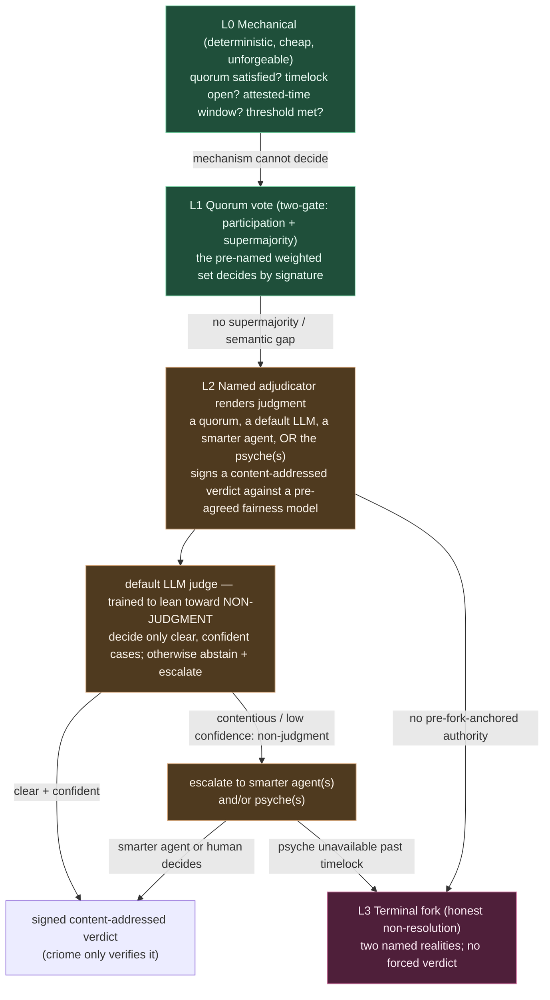

# 674.9 — Starting from the LLM: fair conflict resolution as genesis, and what breaks

*The psyche reframed the design: "I think we started with a reasonable, well
intentioned and fair LLM-based decision for conflict resolution." This file takes
that seriously as the GENESIS of criome's language — not a bolt-on at the end of
the divergence path — asks how it holds up, names the problems, and re-casts every
open question through that lens.*

## The reframe, stated plainly

The seed idea: when identities or networks conflict, you ask a fair, well-intentioned
LLM — or a panel that uses one — to adjudicate, where the LLM "resolves through one
of those identity contracts" (`vhs2`: a paid expert panel deciding the fairest
model). On this reading, the whole apparatus of public keys, quorums, time-locks
and contracts exists *in service of* producing and empowering a fair judgment. The
crypto is scaffolding; the judgment is the point.

## How I see it — the honest assessment

The intuition is **right about the domain and wrong about the foundation**, and
those can both be true at once because they live on different layers.

**Right about the domain (the telos).** criome is identity for personas and agents
in a world where "all spaces become smart" (`wckt`). The disputes that actually
matter there are *semantic*: who is the rightful controller after a key is lost;
which fork is legitimate; was this action within the spirit of the agreement.
**No cryptographic primitive can decide a semantic question.** Multisig, time-locks,
threshold schemes can only answer "did enough pre-named keys sign?" — never "which
outcome is fair?" So an LLM-assisted fair judge is not a gimmick; it is the only
thing in the toolkit that can address the class of dispute the domain is actually
made of. As a statement of *purpose* — criome exists to render fair judgments about
identity — the LLM-at-the-center is defensible and even clarifying.

**Wrong about the foundation (the architecture).** The LLM cannot be the *source
of trust* or the *base layer*, for one decisive reason: an LLM verdict is neither
deterministic nor unforgeable, and a policy language's verdicts must be both. The
moment you make the verdict authoritative, you have to ask "authoritative because
of what?" — and the answer can never be "because the model is neutral" (it isn't,
and can't be proven to be). It can only be "because a pre-agreed quorum signed off
on it." So the trust root is **the ratifying quorum plus the pre-agreed fairness
model, with the LLM as the deliberation aid** — not the LLM itself. The crypto is
not scaffolding around the judgment; it is what gives the judgment any force at all.

The resolution of the apparent tension: **the LLM is the philosophical center and
the architectural apex.** It is *why* the system exists (judgment about identity)
and it is invoked *last* (the top of an escalation ladder), ratified by a quorum,
anchored to a pre-fork agreement. Those are not in conflict; the telos and the
call-order are different layers.

## The problems, named

1. **Determinism / the trust-shift.** LLMs drift across temperature, version, and
   provider. A language needs reproducible ground truth. The only fix — sign the
   verdict, verify the signature, never re-run — *works*, but it relocates trust
   from "the computation is correct" to "whoever ran it is trusted." The fair LLM
   becomes a *suggestion engine*; the real authority is the signing quorum. Honest
   consequence: **"a fair LLM decided" is, mechanically, "a quorum decided, using
   an LLM."** The fairness lives in the quorum's legitimacy and the agreed spec,
   not in the model's neutrality.

2. **Who picks the model, the prompt, and the inputs?** The verdict is only as fair
   as the model chosen, the fairness-spec it is given, and the evidence it is shown
   — three attack surfaces. Whoever controls the prompt controls the verdict.
   "A panel that decides the fairest model" pushes this up a level: now you must
   fairly choose the panel, which is the same problem. This is a **regress of "who
   decides who decides,"** and it does not bottom out inside the system.

3. **Bootstrapping circularity.** The oracle "resolves through one of those identity
   contracts" — but during a divergence the identity contracts are exactly what is
   contested. A split system can disagree about *which contract names the legitimate
   oracle*, so the oracle cannot resolve a dispute about its own legitimacy. The
   pre-fork common-ancestor anchor (Q3) is necessary but reveals the ceiling:
   **the LLM can adjudicate only disputes that do not question the oracle's own
   authority.** Schisms about governance itself can only terminate in a fork.

4. **Manipulability.** A cryptographic check is unforgeable; an LLM judge is
   promptable. Adversarial framing, misleading "evidence," and known-reasoning
   exploits let a sophisticated party steer the verdict. The mechanical layer has
   no such surface; the judgment layer is built from the most manipulable component
   we have.

5. **Provider capture / liveness / censorship.** A single provider is a
   centralized dependency that can fail, be coerced, silently change models, or
   refuse. Decentralizing into a panel mitigates capture but adds collusion risk,
   latency, and cost.

6. **Cost and latency.** Panels and inference are slow and expensive next to a
   mechanical rule. This alone forces the LLM path to be the **rare exception**,
   not the common path — which is itself the argument for ladder-apex, not
   foundation.

7. **"Fair" is contested.** Disputes arise precisely in the gaps a pre-agreed
   fairness spec did not anticipate. An LLM applying a complete agreed spec is fine;
   the hard cases are exactly the ones the spec is silent on, where the LLM is
   improvising values no one ratified.

## The shape this forces: an escalation ladder

The LLM judge sits at the judgment tier near the top, not at the base. Each rung is
tried before the next; the cheap, deterministic, unforgeable rungs carry the routine
load, and judgment is summoned only when mechanism is exhausted. Crucially the tier
is **competence-gated, not failure-gated**: a judge that is not confident renders a
*non-judgment* and escalates, rather than forcing a verdict.

The key inversion: at the judgment tier the **adjudicator proposes, the gated quorum
(or the named human) disposes**, and the verdict's authority is the signature over a
*pre-agreed fairness-model object* — never the model's raw output. criome itself stays
at L0: it verifies the signed verdict and moves nothing (the auth-only line, `wckt`).

### The humble default and escalate-to-psyche (Spirit `gc0n`)

Two psyche refinements sharpen the judgment tier:

- **The psyche is a first-class adjudicator.** A contract can name the human owner as
  its adjudicator — the highest-authority, lowest-availability option, and the literal
  expression of *intent-is-primordial* in the language. A human verdict is treated
  exactly like any other: the psyche signs a content-addressed verdict criome only
  verifies. Because a human may be slow or absent, escalate-to-psyche is paired with a
  **timelock fallback** — if no verdict arrives within the window, control devolves to
  another adjudicator or to an explicit fork (the dead-man's-switch / social-recovery
  shape). The psyche(s) plural fits the quorum model: escalate to a quorum of humans.

- **Non-judgment is a first-class output, and the default LLM leans toward it.** Rather
  than forcing a verdict, the default LLM judge is *trained to abstain* — to decide only
  the clear, confident cases and render a **non-judgment** (escalate to smarter agent(s)
  and/or psyche(s)) on anything contentious or low-confidence. This is the single
  cleanest mitigation for the manipulability (problem 4) and false-confidence (problem 7)
  holes above: the cheap, promptable judge bows out of exactly the cases where it would
  be gamed, and scarce smart-agent and human attention is spent only where it is
  genuinely needed. The ladder becomes adaptive — competence-gated, not failure-gated.

## Every open question, re-cast through the LLM-genesis angle

| # | Original question | Re-cast through "fair LLM resolution is the heart" |
|---|---|---|
| Q1 time source (answered, `ay3y`) | who supplies trusted time? | The clock is L0 mechanical — quorum-attested coarse time, **independent of the LLM**. Its tolerance-widening trigger (degraded network) is the *same* trigger that escalates toward L2, so clock-slack and judgment-escalation are siblings, not the same mechanism. Good separation: time never needs the judge. |
| Q2 oracle determinism | signed-verdict-only vs re-execution? | Dissolves into the real question: **what does the quorum attest — the LLM transcript, or its own judgment (LLM as tool)?** Re-execution is theatre (LLM calls don't reproduce). Authority must be the *panel's ratified judgment*, with the transcript as optional evidence. So: signed-judgment-only; re-execution never load-bearing. |
| Q3 meta-divergence regress | which oracle do two forks consult? | Now the **foundational** question, not an edge case. The pre-fork common-ancestor anchor is mandatory, and its ceiling is explicit: **the judge cannot rule on its own legitimacy.** Governance schisms terminate in L3 fork. The regress is real and bounded only by "agree on the judge before you need it." |
| Q5 content-addressing | digest refs vs inline tree? | Reinforced, and extended: **the fairness model / prompt is itself a first-class content-addressed object**, agreed pre-fork, so everyone can verify *which* fairness spec produced a verdict. Verdict, panel, and fairness-spec are all addressable objects. |
| Q6 verb-scoped quorums | per-verb binding + revocation | `Adjudicate` is its own verb with its own quorum (the panel), distinct from Use/ReKey/Revoke. Panel members must be **revocable** and the provider **swappable** — but only via pre-agreed, anchored governance, or you reopen Q3. |
| Q7 two-gate divergence vote | participation + agreement | Applies to the *ratifying panel*: enough members present AND a supermajority ratify the LLM's proposal. The LLM proposes; the two-gated panel disposes. |
| **New A** | — | **Is the fairness model a first-class, content-addressed, pre-agreed object?** It must be, or "fair" is unverifiable. This is arguably the most important new object the reframe adds. |
| **New B** | — | **What exactly triggers each escalation rung, and who can pull it?** Escalation is itself an authority (you can grief the system by forcing expensive L2 calls), so the right to escalate is policy-gated. |
| **New C** | — | **Transcript vs judgment** (the heart of Q2): does the panel sign "the model output X" or "we, having consulted a model, judge X fair"? The latter is the only sound root. |
| **New D** | — | **Manipulation resistance:** structured evidence only, independent panel members each running their own model, adversarial cross-examination before ratification — how much of this is v1 vs later? |
| **New E** (`gc0n`) | — | **Psyche-as-adjudicator fallback:** escalate-to-psyche needs a timelock fallback for human unavailability (devolve to another adjudicator, or to a fork). What is the default window, and which contracts *reserve* human judgment versus merely permitting it? |
| **New F** (`gc0n`) | — | **Calibrating the humble default:** how is the default LLM's bias-toward-non-judgment trained/tuned, and what is the abstain→escalate target chain — who counts as a "smarter agent," how is that next rung chosen, and is the choice itself pre-fork-anchored (Q3 again)? |

## Bottom line

Starting from the fair LLM judgment was the *correct motivating instinct* — it
correctly identifies that identity disputes are semantic and that mechanism alone
can never resolve them. But as architecture it must be **inverted**: the LLM is the
apex of an escalation ladder, not its base; its verdicts have force only through a
pre-agreed fairness model and a ratifying quorum anchored before the split; and
criome itself never runs or trusts the model, only verifies the signed judgment.
The "fair LLM" is, mechanically and unavoidably, "a legitimate quorum deciding,
with an LLM as its deliberation aid." Naming that honestly is what keeps the
language deterministic, the auth-only line intact, and the regress bounded — and it
turns the hardest question (who is the judge?) into a concrete, answerable one:
*whoever both sides agreed to be the judge, before they had a reason to disagree.*
