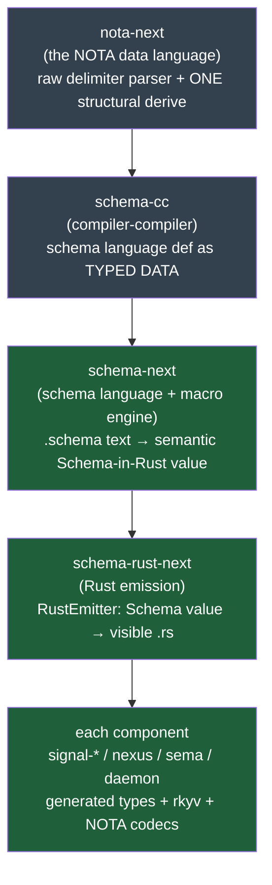

# Perspective 3 — The schema-codegen pipeline: the single source of truth

Grounded reading of the four-repo pipeline that turns one authored `.schema` file into a
component's complete structural surface — its Rust types **with** their rkyv and NOTA codecs —
so that types and their encodings cannot drift. Every claim below is checked against real
source (paths cited), not asserted from memory. Anchored in the schema arc reports
(`reports/designer/666`, `667`, with `662`/`665` context) and the INTENT of the four repos.

## The pipeline, stage by stage

The dependency order is strict and stated in `schema-cc/INTENT.md:56`:
`nota-next → schema-cc → schema-next → schema-rust-next → each component`.



### Stage 1 — `nota-next`: the NOTA data language (the irreducible seed)
NOTA is "the library that gives methods on raw delimiter structures: factual delimiter
predicates, root-object queries, source spans, and structural candidate classification. It
does not decide schema semantics" (`nota-next/INTENT.md:11-13`). The first pass breaks text
into delimiter-balanced object blocks and emits a structural-only header (delimiter/atom shape
+ child counts) so higher layers triage before semantic lowering (`:15-18`). It owns the Rust
value **codec shapes** through shared `NotaDecode`/`NotaEncode` traits — strings, integers,
booleans, vectors, ordered maps, options (`:47-55`) — and ships the `#[derive(StructuralMacroNode)]`
machinery (`:107-121`). This is the "Seed" tier in `schema-cc/INTENT.md:28`: hand-written,
context-free, ~2,400 lines (`source.rs`), the one thing that stays hand-written by design
(`667` finding 9 honestly flags the "tiny seed" framing as aspirational).

### Stage 2 — `schema-cc`: the compiler-compiler (definition-as-data)
`schema-cc` is "the definition of the schema language and its compiler, kept as inspectable
typed data, that **generates** the schema compiler rather than hand-writing it"
(`schema-cc/INTENT.md:3-6`). It exists because the compiler *itself* — reference-resolution
dispatch, the built-in head table, shape vocabulary, emission rules — was the one place that
escaped *a language is data*: precedence pinned by match-arm ordering and tests, unreadable as
a single artifact (`:11-17`). First inhabitant: `ReferenceGrammar`, the parenthesis-reference
dispatch precedence (built-in heads → declared macros → generic-application catch-all) reified
as an ordered typed value that **generates** the resolver, with a validator (`:38-44`). Source:
`schema-cc/src/{grammar,dispatch,validate}.rs`; the generated output already lands at
`schema-next/src/reference_resolver_generated.rs`. Discipline: build-time only, **generate not
interpret**, upstream of schema-next (`:46-58`).

### Stage 3 — `schema-next`: the schema language + semantic model (no Rust emission)
`schema-next` is "the schema macro engine and typed semantic schema data model … It does not
emit Rust source code" (`schema-next/INTENT.md:3-4`). Macros are position-aware structural
matching over NOTA objects; a macro invocation is data, a tagged node at a macro position
(`:8-13`). It reads `.schema` files as a known-root struct (`:15-18`), reserves the scalars
(`String`/`Integer`/`Boolean`/`Path`, `:20-23`), resolves cross-crate imports via
`crate:module:Type` single-colon syntax (`:25-29`), and lowers to `Schema` — the semantic
schema-in-Rust value (`src/schema.rs`, 84k) that is "rkyv-serializable, and Rust code is
lowered from that typed value" (`:84-91`). Crucially **Asschema is removed** (`:84-91`): no
intermediate text/`.asschema` artifact survives — the path is authored `.schema` → typed Rust
value → emitted Rust, nothing in between. The schema is **content-addressable**: `content_hash`
is blake3 over the canonical rkyv bytes of `Schema`, formatting-only edits don't move the
address (`:108-126`, Spirit `wrjl`/`x0ja`). Source files: `source.rs` (the source codec),
`engine.rs`, `macros.rs`, `declarative.rs`, `identity.rs`.

### Stage 4 — `schema-rust-next`: Rust emission (the visible artifact)
`schema-rust-next` "emits Rust interface source from typed schema data and powers the shared
build-driver orchestrator" (`schema-rust-next/INTENT.md:1-2`). Key disciplines, all grounded:
- **Source-visible, not OUT_DIR.** Generated Rust lands in the consumer's `src/schema/`,
  reviewable and freshness-checked (`:7-12`).
- **Tokens, not strings.** The emitter builds syntax with `proc_macro2`/`quote`, routed through
  a single `prettyplease` pass; the former `RustWriter` string god-struct is gone, replaced by
  `RustModuleRenderer`; only the `// @generated` header is written as raw text (`:96-121`).
- **Lowering is a trait surface on the schema nouns** (`RustEmitter`), implemented for
  `Schema`, `SchemaSource`, declarations, imports, newtypes, structs, fields, enums, variants —
  schema-next must not depend on Rust emission, so the trait lives here (`:87-94`). This obeys
  the workspace method-only rule: emission is methods/`ToTokens` on data-bearing nouns.
- **The build driver** (`GenerationDriver`, per-crate) owns load/lower/emit/freshness so
  `build.rs` files don't hand-roll it; `signal-*`/`meta-signal-*` contract crates use
  `ContractCrateBuild` and publish their `schema/` dir via Cargo metadata so daemons can import
  the contract roots (`:71-85`). Source: `src/lib.rs` (239k), `src/daemon_emit.rs` (86k),
  `src/build.rs`, `src/migration.rs`.

### Stage 5 — each component: generated types + wire codecs
The terminal output is each component's Rust nouns. Real generated fixture
`tests/fixtures/reaction_frame_generated.rs` shows the canonical derive stack on every emitted
type:
```rust
#[cfg_attr(feature = "nota-text", derive(nota_next::NotaDecode, nota_next::NotaEncode))]
#[derive(rkyv::Archive, rkyv::Serialize, rkyv::Deserialize, Clone, Debug, PartialEq, Eq)]
```
rkyv is always present (the daemon wire contract); NOTA-text is feature-gated and omitted for
binary-only daemons (`schema-rust-next/INTENT.md:131-136`). Wire-facing targets also emit the
real `signal-frame` surface — `Frame`, `Request`, `ReplyEnvelope`, `RequestBuilder`,
`Input::into_frame`, `Output::into_reply_frame` (`:21-27`).

## The source-of-truth discipline — why types and encodings cannot drift

This is the load-bearing gain, rated **large** in `667`'s honest gains table (lines 10-12):
"every schema type emits *with* its rkyv + NOTA codecs, so type and encoding cannot drift …
scales with the whole ~10k-line schema surface; makes the daemon's rkyv-contract discipline
mechanical." The mechanism that makes it *enforced* rather than aspirational:

1. **One authored origin.** The `.schema` file is the only hand-edited definition. Asschema's
   removal (`schema-next/INTENT.md:84-91`) means there is no parallel text IR that could
   diverge — the typed `Schema` value is the single in-memory truth.
2. **Codecs travel with the type.** Because the rkyv + NOTA derives are emitted onto the same
   struct/enum the schema defines, an encoding cannot be defined separately from the type it
   encodes. There is no hand-written codec to fall out of sync (`nota-next/INTENT.md:71-73`:
   generated Rust *derives* the codecs rather than hand-emitting them).
3. **Freshness gate.** Generated `.rs` is source-visible and freshness-checked by the build
   driver (`schema-rust-next/INTENT.md:7-12`, `71-79`); stale generated code is a hard build
   break, and an emitter change re-emits *all* consumers. `667` (lines 32-34) records the cost
   honestly: "an emitter regression breaks *all* components at once" — the price of one source.
4. **Content-address = version identity.** `Schema::content_hash` (blake3 over canonical rkyv
   bytes) is the version the version-control layer consumes; family closures get their own
   domain-separated hash pinned as a 32-byte constant in the generated `family_identity` module
   (`schema-next/INTENT.md:108-141`, `schema-rust-next/INTENT.md:148-168`, Spirit `wrjl`). So a
   schema edit that moves a stored family's shape is a *visible generated change*, and the
   version-checking pipeline derives migrations from the address diff.
5. **Wire-identity is the deployed-peer exception, not a virtue.** `667` finding 8 (lines
   88-92) corrects the framing: regeneration must round-trip the same rkyv bytes **only because
   deployed peers read those bytes** (the pinned-wire-contract exception to the no-backward-compat
   override), not as a general byte-stability selling point.

## The frame-expansion leverage (the genuine headline)

Both reports name this the real win. `667` finding 4 (lines 69-74) is blunt: "The genuine
leverage is **frame expansion**" — the sophisticated machinery (composition, capability
resolution) was the *least* necessary, the scalar-impl win touches <10% of newtypes, but
frame expansion carries the ~4,200-line leverage figure (`667:13`).

**How it works, grounded:**
- **Declare the frame once.** The Work/Action reaction frames are authored as generic
  declarations in the pipe-parenthesis form
  (`schema-rust-next/tests/fixtures/reaction/schema/reaction.schema:4-7`):
  ```
  (| Work Event WriteDone ReadDone EffectDone |) [(SignalArrived Event) ...]
  (| Action Reply Write Read Effect Continuation |) [(ReplyToSignal Reply) ...]
  ```
  These emit as generic Rust enums `Work<Event, WriteDone, ReadDone, EffectDone>` and
  `Action<Reply, Write, Read, Effect, Continuation>`
  (`tests/fixtures/reaction_frame_generated.rs:19-35`).
- **Bind in two lines.** A component imports the frame and applies it at its root positions
  (`666:64-68`): `(Work SignalInput SemaWriteOutput SemaReadOutput EffectOutcome)` etc.
- **The emitter monomorphizes.** Per `tests/spirit_frame_application.rs:1-17`, the emitter
  **expands** each applied root — binder→argument substitution over the frame's variants — into
  a **concrete** `pub enum Input`/`pub enum Output` named by the root position, with the
  recursive `Continue(Input)` leg re-aimed at the sibling enum. The concrete enums flow through
  the normal emitters, gaining auto-emitted constructors, `From` impls, and the rkyv+NOTA
  codecs. Verified in `tests/fixtures/spirit_nexus_generated.rs:556-572` — real `pub enum Input`
  with the four Work legs bound to spirit's payloads, `pub enum Output` with the five Action
  legs + `Continue(Input)`. The test asserts `!code.contains("pub type Input =")` — i.e. an
  alias is forbidden; it must be a concrete body.
- **Payoff.** `666:90-92`: "two lines of binding replace a hand-spelled `Input`/`Output`
  interface and all its conversions." This is the leverage that scales across every component.

**Live debt on this exact path** (`667` finding 5, lines 76-80, rated *real*): expansion still
keeps a dual codepath — an unresolved frame head silently falls back to a legacy
`type X = Head<Args>` alias "for rollback safety until expansion is proven." Two semantics for
one syntax, and pre-production rollback scaffolding the no-backward-compat override forbids. The
fix is on the `666` finishing plan: drop the alias fallback, make an unresolved head a typed
`SchemaError`.

## Positional records (the authoring grammar)

NOTA records are positional, not labeled (workspace override; `nota-next/INTENT.md:37-45`
retired the `@`-binding sigil). Type-kind is announced by the **value delimiter**, not position
(`schema-next/INTENT.md:38-46`): `{...}` a struct body, `[...]` an enum body, `(| |)` a generic
declaration, `{| |}` the trait/impl construct. A real component contract shows the whole
positional shape — `schema-next/schemas/spirit-min.schema`:
```
[Record Observe]            ;; root input header (variant names)
[RecordAccepted RecordsObserved]   ;; root output header
{ Record Entry  Observe Query  ...  Entry { Topics * Kind * Description * Magnitude * } ... }
```
Root headers list exported variant names directly; bare entries resolve to namespace
declarations carrying the same-named payload (`schema-next/INTENT.md:70-76`).
`667` finding 6 flags a smell: a single-field `{ field Type }` struct silently collapses to a
newtype (same output as `Name Type`), with the rule duplicated across four sites.

## The generated / hand-written boundary — Signal/Nexus/SEMA interfaces in schema, decide+validate hand-written

This is the discipline that the prompt names, and it is grounded in real generated code.
`schema-rust-next/INTENT.md:14-19`: "Schema-generated objects are the Rust nouns that carry
behavior. Signal, Nexus, and SEMA input/output roots become enums; runtime engines implement
generated traits with one method per reaction variant on data-bearing objects, not free helper
functions." The method-bearing framework traits emit their **surface only** — proven in
`tests/fixtures/runner_generated.rs:1747-1807`:
- `pub trait NexusEngine: Send` is **generated**, including the `execute` **default body** (the
  whole runner-drive loop: `Runner::new`, `NexusRunnerAdapter`, `runner.drive(...).await`,
  reply assembly — lines 1787-1806) and all wiring (`NexusRunnerAdapter`, the
  `RunnerEngines` impl, trace hooks, `apply_sema_write`/`observe_sema_read`/`run_effect`
  signatures).
- `fn decide(&mut self, input: nexus::Nexus<nexus::Work>) -> nexus::Nexus<nexus::Action>` is
  emitted as an **abstract signature with no body** (lines 1783-1786). The domain policy that
  fills it is hand-written.

`666`'s generated/hand-written line (lines 152-178) states the boundary exactly: GENERATED =
Input/Output via frame expansion, payload structs/newtypes/enums + standard impls, role+marker
trait impls, shape-computed role constants, the method-bearing trait **surface** (decide
*signature*), actor wiring, plane carriers, wire framing, opt-in mechanical Deref. HAND-WRITTEN
= `NexusEngine::decide`/`step_decide` (domain policy), `Input::validate` (per-variant business
rules), store/guardian/query/actor behavior. `667` (lines 13-14) rates this boundary **medium**
and calls it "a correctness/trust property" — codegen provably never touches `decide`/`validate`.
Generated nouns reach hand-written engine code only through typed bounds (markers like
`impl signal_frame::RequestPayload for Input {}`), which is the whole point of traits-in-schema
(`666:113-117`).

## Honest qualifications (from `667`, carried forward)

The pipeline is sound and the core win real, but `667` foregrounds doubts I keep visible here:
the "six-delimiter family" is really five delimiters + pipe-text (finding 1); the `{| |}`
trait/impl leg is the least-designed construct yet got the most consequential delimiter
(finding 2, and `schema-next/INTENT.md:46` itself says "still to be designed"); the "capability
resolution" framing is looser than the shipped three-arm `string_like/integer_like/boolean_like`
ladder (finding 7); ~16 emit-time panics/asserts surface malformed emits as `syn` panics deep
in the pipeline rather than typed errors at the schema line (the named merge blocker, finding in
costs §). All are integration-phase cleanups on the `666` plan, none architectural.

## Sources

- `reports/designer/666-have-what-we-need-and-the-port-plan.md` (the generated code shown
  real; generated/hand-written line; finish-and-port plan; Spirit `t5wx`/`d3r2`)
- `reports/designer/667-design-assessment-gains-costs-strange.md` (gains/costs table; the
  single-source-of-truth and frame-expansion magnitudes; the sharp findings)
- `nota-next/INTENT.md`, `schema-next/INTENT.md`, `schema-rust-next/INTENT.md`,
  `schema-cc/INTENT.md` (the four pipeline-repo intents)
- `schema-rust-next/tests/fixtures/reaction/schema/reaction.schema` +
  `reaction_frame_generated.rs` (generic frame declaration → generic enum emission)
- `schema-rust-next/tests/spirit_frame_application.rs` +
  `tests/fixtures/spirit_nexus_generated.rs:556-572` (frame expansion → concrete Input/Output)
- `schema-rust-next/tests/fixtures/runner_generated.rs:1747-1807` (NexusEngine: generated
  surface + `execute` body, abstract `decide`)
- `schema-next/schemas/spirit-min.schema` (positional-record component contract)
- `reports/designer/668-first-e2e-production-overview.md` (where the pipeline output is
  consumed: the spirit→mirror→criome→router e2e production chain)
