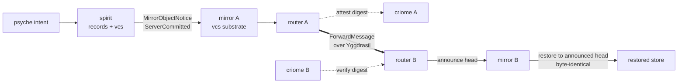

# Perspective 4 — the e2e production chain and deploy

*Grounding subagent report (designer lane), session 675. Wide-angle,
source-grounded view of the `d6he` production chain (spirit → vcs/mirror →
criome → router → mirror), what is proven vs gated, the physical layer, and
the two deploy stacks. Every claim below is anchored in a cited source read
this session.*

## The chain — who does what

The production e2e chain (`d6he`) is five components, each owning one verb. The
authoritative split is stated verbatim in system-designer 123 (lines 73-77) and
realized in designer 673:

| Stage | Component | What it does | Owns |
|---|---|---|---|
| 1 | **spirit** | Records psyche intent as durable Spirit records; version-controls the objects. Ships the unshipped suffix (leg-1 shipper) to mirror as a `MirrorObjectNotice`. | intent capture; the versioned operation log as authoritative truth |
| 2 | **mirror (vcs substrate)** | Accepts the shipped object suffix at `Durability::ServerCommitted`; later restores to exactly the router-announced head, byte-identical. | versioned object/log byte movement; the materialized SEMA store |
| 3 | **criome** | BLS-attests the forwarded payload digest under a **cluster-root-admitted** identity; on the inbound side verifies the attestation against the recomputed digest. | identity registry, sign/verify, replay guard, audit log |
| 4 | **router** | Forwards router-to-router over the tailnet/Yggdrasil fabric; stamps the **criome-verified** identity (not a wire-claimed sender); owns delivery state. Attestation replaces `SO_PEERCRED` for the cross-host leg. | typed routing facts + delivery state in `router.sema` |
| 5 | **remote mirror** | Fetches/restores precisely up to the router-announced head — nothing past it (the causal seam). | the restored store on the remote node |

The clean conceptual division (123 lines 73-77, mirror.nix, 673):

- **Yggdrasil** encrypts and routes the *bytes*.
- **Router** transports typed *routing facts* and owns delivery state.
- **Criome** authenticates the *sending router identity* (the `SO_PEERCRED`
  substitute that does not exist across hosts — local origin minting via
  `SO_PEERCRED` is a message-daemon concern, 123 lines 26-32).
- **Mirror** moves versioned *object/log bytes* (it is the vcs substrate:
  spirit's store is "a fold of its versioned log", `iir4`, spirit INTENT
  lines 163-176; mirror is where that log/object material lands and restores).
- **Spirit** records *intent* and ships mirror notices through the fabric.

The criome attestation is the cross-host trust primitive: outbound router asks
its local criome to sign the exact forwarded payload digest; inbound router asks
its local criome to verify against the recomputed digest, then stamps the
criome-verified identity (123 lines 109-118). This is what "attestation replacing
`SO_PEERCRED`" means — within one host the kernel proves the local caller's
identity via peer credentials; across hosts there is no kernel channel, so a BLS
attestation chained to the cluster root carries the proof instead.

## Proven vs gated (honest scope)

**PROVEN — the full offline chain (designer 673).** The harness
`tests/end_to_end_offline_full_chain.rs` passes: spirit records intent → ships
to mirror A (`Durability::ServerCommitted`) → router A→B forwards an
object-accepted notice (`ForwardedRemote`, delivered body == notice at a
`HarnessSocket`) → mirror B restores **exactly up to the router-announced head**,
byte-identical records (`[alpha=revised, gamma=third]`,
`current_commit_sequence == notice.sequence`, matching digest). Both
"networking through the router" and "spirit-with-vcs fetched by the mirror" are
demonstrated end-to-end (673 lines 3-11). The causal seam — mirror B restores
precisely the head announced, nothing more — is the proven invariant.

Also proven (123 lines 81-89): two in-process routers forward over loopback TCP
with a fixed offline identity; the receiver delivers locally (m2 done).

**STUBBED (offline, by psyche steer).** Criome attestation on the path is
`AcceptFixedTestIdentity` — no real BLS on the chain (673 lines 27-28). This is
exactly the psyche's "no key encryption for now" of 2026-06-16. Separately, the
criome admission gate itself **is** real `blst` BLS12-381 (33 green tests incl.
`cluster_root_gates_registration`, 669/3 lines 9-19) — but it is not yet wired
*onto the forwarding path*.

**HARNESS-LOCAL (not a shipped contract).** `MirrorObjectNotice { store, head }`
reuses signal-mirror's `HeadMark`; it seeds the production `MirrorObjectNotify`
(`5osd`'s router-triggers-the-mirror's-own-fetch shape, milestone two) (673
lines 29-31).

**GATED to the live/production track:**
- Real criome attestation on the path (m3): outbound sign / inbound verify, plus
  router-owned replay+freshness (`router-forward-replay` SEMA family, reject
  duplicate `(signer, nonce)`, skew tolerance) — must land *with* attestation,
  not later (123 lines 109-131).
- Cross-node live forward (m4): ouranos ↔ prometheus over Yggdrasil (123
  lines 132-141).
- Mirror-target persistence across daemon restart (store-axes slice, needed for
  self-resume); the real router-carried notify + mirror auto-fetch (673 lines
  32-34).
- The cluster-root **admission-signing ceremony**. Precise: the *gate* already
  verifies BLS admission envelopes and is tested (`admission.rs::ClusterRoot::admits`
  + `daemon_skeleton::cluster_root_gates_registration`: reject-unadmitted,
  accept-valid). What is missing is the tool that *mints* an admission envelope —
  nothing signs a `RegistrationStatement` outside tests. The Option-A one-shot
  signing CLI is that missing piece: the unblock is "make the signing ceremony usable
  from the CLI/tooling path," not "invent admission," and it is the single blocker
  between a verified gate and an operable gated e2e (669/3 lines 30-34, 271-296).

**The one offline gap to clean-checkout green (673 lines 36-47):** not a design
hole. `signal-router@router-network-transport` lags on an old schema-next
generator; unifying onto current HEAD makes the build reject its stale
`src/schema/lib.rs` with `StaleGeneratedArtifact`. Fix = one operator
regeneration (`SIGNAL_ROUTER_UPDATE_SCHEMA_ARTIFACTS=1`), committed on that
branch by the router operator lane — a designer must not carry it. The
five-branch stack (673 lines 13-21) then integrates onto code-repo main.

## The physical / network layer

**Hosts.** Four nodes in the `goldragon.criome` cluster carry Yggdrasil
addresses (live `/etc/hosts` read this session):

| Node | Yggdrasil address (200::/7) | Role notes |
|---|---|---|
| zeus | `200:17f7:4fad:e50b:...` | |
| prometheus | `200:ca41:6b12:fba:...` | also `nix.prometheus.goldragon.criome` (nix-cache) |
| ouranos | `201:6de1:5500:7cac:...` | the named live-bed peer with prometheus |
| tiger | `202:3895:9c1b:16:...` | |

ouranos ↔ prometheus is the designated m4 live two-node bed (123 lines 100-106,
340-351). Note prometheus/zeus are `200:`-prefixed and ouranos/tiger `201:`/`202:`
— all inside Yggdrasil's `200::/7` fabric range.

**Yggdrasil fabric (`network/yggdrasil.nix`).** Interface `yggTun`, multicast
beacon/listen on all interfaces, `NodeInfoPrivacy = true`, keys seeded on first
boot (`-genconf` → `PublicKey`/`PrivateKey`), `DynamicUser` + a hardened systemd
sandbox. The firewall here sets `trustedInterfaces = [ "yggTun" ]` — **broad**:
all Yggdrasil packets are host-trusted. 123 (line 278) flags this: for router m4
the stronger posture is a module-owned rule for *only* the router TCP port on
`yggTun`, plus a daemon bind to the node's exact Yggdrasil address.

**`.criome` host-name projection (`network/default.nix`).** Horizon node facts
generate `networking.hosts`: if a node has `yggAddress`, that address gets the
primary `<node>.<cluster>.criome` aliases (nix-cache nodes also get
`nix.<node>...`); WireGuard `wg.<node>...` aliases attach to `nodeIp`. NSS is
configured so glibc clients answer `.criome` from `/etc/hosts` locally
(`nss-resolve` ordering, `nscd` disabled) and do not route the exact name to
public DNS (123 lines 166-208). For router specifically this becomes a
**startup invariant** (123 lines 228-262): the config writer lowers the audited
`.criome` FQDN to a literal `[ygg-address]:port`, verifies it is Yggdrasil-range,
binds/dials only there, fails closed on mismatch. `.criome` proves *where*
router dials; criome proves *who* spoke (123 line 14).

**Transport choice.** Yggdrasil + plain length-prefixed TCP is the recommended
first live fabric (123 lines 143-156): already deployed cluster-wide, stable IPv6
from node keys, ordinary socket API, matches the existing m2 code. WireGuard,
Tailscale/Headscale (human/admin overlay only), Quinn/QUIC, Iroh, libp2p,
domain-criome are future pressure valves, not the immediate bed.

**Current mirror bind is Tailscale, not Yggdrasil (`mirror.nix`).** The deployed
mirror module binds `0.0.0.0:7474` and opens the port on `tailscale0`
(`networking.firewall.interfaces.tailscale0.allowedTCPPorts`), gated on Horizon
services `TailnetClient` + `PersonaDevelopment`. So today's live mirror is on the
Tailscale overlay; m4 open question 4 (123 line 358) is whether to move mirror to
Yggdrasil so the whole live chain rides one fabric. The daemon takes exactly one
generated NOTA→rkyv startup config (`mirror-write-configuration` →
`mirror-daemon <path>`), honoring the one-argument / binary-startup daemon rule.

**Missing modules (gated, designed in 123/669 — not yet in CriomeOS).**
`criome.nix` (service user, store, socket, binary startup config, cluster-root
public key, key custody) and `message-router.nix` (Unix sockets, `router.sema`,
Yggdrasil TCP bind, peer bootstrap, local criome socket). The router NixOS
module that exists today
(`modules/nixos/router/default.nix`) is the **WiFi/LAN router** (hostapd, kea
DHCP, nftables NAT) — unrelated to the message-router daemon; the name collision
is worth noting. A `MessageFabric` Horizon capability (not `PersonaDevelopment`)
should gate the message-router so prometheus can host the fabric without becoming
a dev node (123 lines 134-141).

## Cluster-root admission — the non-circular bootstrap

criome's admission gate is the trust spine (669/3 lines 121-256, anchored in
Spirit `ermr`/`psc6`/bead `kr40`). The cluster-root is a **distinct BLS keypair,
not any node's master key**, operator-custodied `0600` off the member nodes.
Acyclic order: **cluster-root keypair → node master keys → admissions →
cross-registration.** Public keys travel (root pub → every node as trust anchor;
member pub → root to be signed); secrets never move. The
`RegistrationStatement` canonical bytes
(`CRIOME-REGISTRATION-ADMISSION-V1 || ...`) are shared verbatim by signer and
verifier. The only missing primitive is the operator-run signing command
(Option A: a one-shot thin-CLI subcommand emitting a `SignatureEnvelope`); the
first live e2e should run **gated** (configured `cluster_root`), not via the
dev self-admit hatch (669/3 lines 271-296).

## The two deploy stacks (INTENT.md lines 90-98)

- **Production Stack A** — the old monolithic stack on `main` in the canonical
  checkouts. Fixes for live nodes go there. This is the only stack with
  compatibility obligations (the hard-override boundary: production Stack A +
  externally-consumed pinned wire contracts).
- **The restructuring stack** — the lean rewrite (new daemon, thin CLI, lean
  horizon) on rewrite/`next`/feature branches in `~/wt/...` worktrees. The whole
  `d6he` chain above lives here. It has **not** been cut over. The schemas have
  diverged; cutover is a coordinated multi-repo merge after the rewrite reaches
  parity — never deployed piecemeal as a fix, never folded into Stack A one repo
  at a time. This is why "no backward compatibility pre-production" holds for the
  chain: there is no production behind it to protect.

Branch discipline for the chain (673, INTENT.md lines 100-108): designers ship
`next`/feature branches in `~/wt/...`; operators own code-repo `main` and the
rebase/repin/regeneration. The five-branch stack (spirit
`mirror-shipper-reland`, meta-signal-spirit `mirror-target-reland`, mirror
`arc-shipper-mainline`, signal-router + router `router-network-transport`) is the
restructuring-stack integration unit.

## Sources

- `reports/designer/673-offline-first-e2e-proven-capstone.md`
- `reports/system-designer/123-router-vision-yggdrasil-criome-networking-2026-06-17.md`
- `reports/designer/669-first-e2e-offline-build/3-criome-integration-ceremony.md`
- `INTENT.md` (two-deploy-stack, primary-vs-code-repo branch discipline)
- `/git/github.com/LiGoldragon/CriomOS/modules/nixos/network/yggdrasil.nix`
- `/git/github.com/LiGoldragon/CriomOS/modules/nixos/network/default.nix`
- `/git/github.com/LiGoldragon/CriomOS/modules/nixos/network/resolver.nix`
- `/git/github.com/LiGoldragon/CriomOS/modules/nixos/mirror.nix`
- `/git/github.com/LiGoldragon/CriomOS/modules/nixos/router/default.nix` (the WiFi/LAN router, name-collision note)
- `/git/github.com/LiGoldragon/criome/INTENT.md` and `ARCHITECTURE.md` (BLS12-381/blst, attestation surface, cluster-root)
- `/git/github.com/LiGoldragon/spirit/INTENT.md` (`iir4` store-is-a-fold-of-its-log; mirror as vcs substrate)
- live host probe: `/etc/hosts` (four `goldragon.criome` Yggdrasil nodes)
