# 675 — The system map, with perspective

A wide-angle, multi-zoom view of the whole system the psyche is building — from
the far telos down to the policy-language detail just landed inside criome, then
back out to where everything stands right now. Each zoom carries a diagram and
prose; the *nesting between zooms* is the point. Every load-bearing claim traces
to one of the five ground files in this directory (`1`–`5`), cited inline.

The frame is a telescope. Zoom 0 is the universe the work is for; each step in
pulls one box from the prior diagram and opens it; Zoom 5 is a single noun
inside a single engine inside a single component; the closing zoom pulls all the
way back out and marks the cursor — what is proven, what is designed, what is
deferred.

## The whole map at a glance

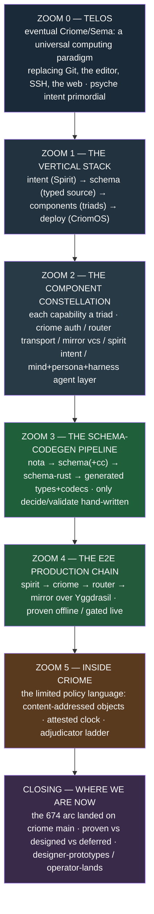

## Zoom 0 — The telos

The work has a far horizon and a present discipline, and the discipline exists
to protect the horizon from being faked.

The horizon is **eventual Criome / eventual Sema**: a universal computing
paradigm expressed in Sema that *replaces Git, the editor, SSH, and the web* —
programming, version control, network identity, validation, and auth/security in
one substrate, with Sema as "the universal medium for meaning… a self-hosting
computational substrate, a fully-typed human-language representation, a universal
interlingua" (`1-telos-and-layers.md` §telos, citing `criome/INTENT.md:20-23`
and `active-repositories.md`). The thing being built *now* on top of that
substrate is **Persona** — a meta-AI that organizes language models into a
structure emulating human intelligence, where the software components are *dumb
mechanism* and all the thinking lives in agent LLMs driving them over CLIs and
Spirit; no component works without an LLM on the wire (`1` §telos, citing
`INTENT.md:132-139`).

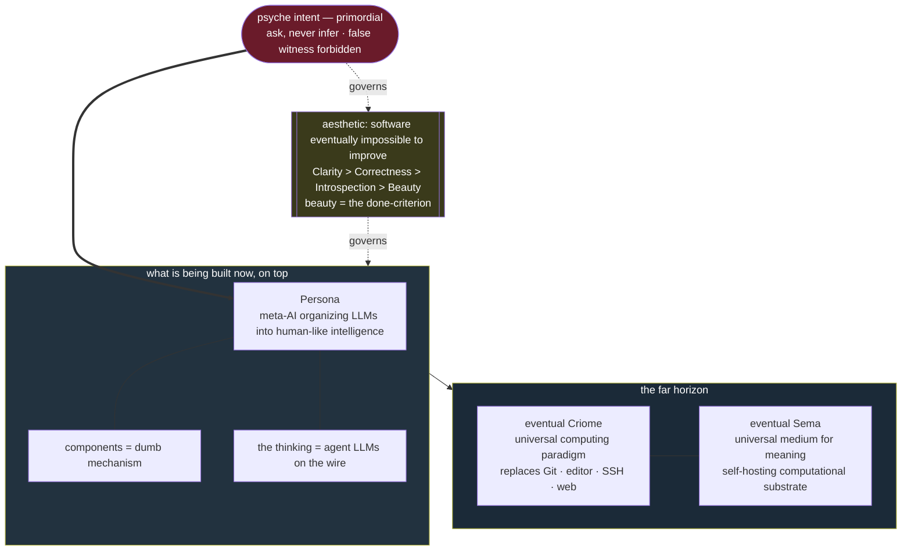

Two things sit *above* even the horizon. First, **psyche intent is primordial** —
the universal fallback when an agent is unsure, the one source of new meaning,
and inferring it is "bearing false witness, the most forbidden act," because a
false intent record corrupts a layer that every downstream agent treats as
load-bearing truth (`1` §primacy, citing `ESSENCE.md:8-45`). Capture is
conservative; missing intent is recoverable, over-extending is not. Second, the
governing aesthetic: **software eventually impossible to improve** — the right
shape chosen carefully, ranked Clarity > Correctness > Introspection > Beauty,
with beauty as the *done-criterion*: "if it isn't beautiful, it isn't done…
ugliness is evidence the problem is unsolved" (`1` §telos, citing
`ESSENCE.md:53-81`). Explicitly *not* optimized for speed, feature volume,
"minimum viable," estimates, or backward compatibility for systems being born.

The discipline that keeps the horizon honest is **today-is-not-eventually**:
today's component realizes *one slice* and must not carry eventual scope into its
present shape. The worked example is criome itself — today a "minimal Spartan BLS
authentication and attestation daemon," explicitly *not* yet the universal
paradigm above (`1` §scope, citing `criome/INTENT.md:12-33`). This is the seam
that makes the rest of the map readable: everything below is *today's slice*, not
the horizon.

## Zoom 1 — The vertical stack

Pull open the "what is being built now" box. The system is one top-down stack:
intent at the apex flows down through typed schema into running components onto
deployed metal, and the manifestation loops back as observation.

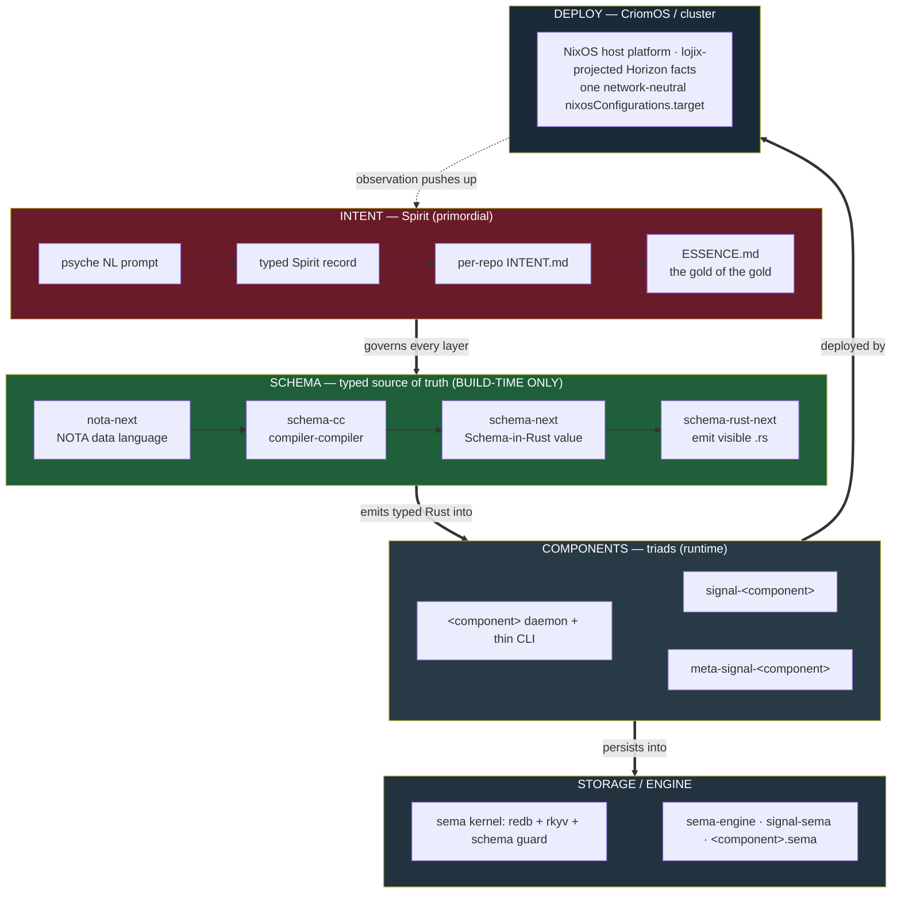

Top to bottom (`1` §vertical-stack):

1. **INTENT (Spirit)** — three surfaces of increasing distillation: the raw
   Spirit record log → per-repo `INTENT.md` prose → `ESSENCE.md` universal core.
   Outranks every agent-written surface; supersession is explicit and only the
   psyche can do it. Every essence/intent claim must be anchored in a real Spirit
   record — a distillation with a provenance obligation, not free-form docs.

2. **SCHEMA (typed source of truth)** — "a language is data; structural macros
   all the way down." The whole schema toolchain is **build-time only** — it
   emits each component's typed Rust and never links into the runtime binary
   (`1` §vertical-stack, citing `INTENT.md:142-162`). Zoom 3 opens this box.

3. **COMPONENTS (triads)** — every stateful capability is three repos plus, inside
   the daemon, three engines. Zoom 2 opens this box.

4. **STORAGE / ENGINE** — the `sema` kernel (redb + rkyv + schema guard) under
   `sema-engine`; each component owns its own `<component>.sema` store, and
   `sema-engine` is the *exclusive* database interface — no component touches redb
   directly (`2-component-constellation.md` §6, Spirit `fosp`).

5. **DEPLOY (CriomOS)** — a NixOS host platform that consumes lojix-projected
   Horizon facts and exposes one *network-neutral* `nixosConfigurations.target`;
   modules render projected facts and never branch on concrete node names (`1`
   §vertical-stack; Zoom 4 opens this box).

Two principles thread the whole column: **role is type** (a field's role is its
type; no struct has two fields of one type — newtype-per-role) and **push, not
poll** (producers push events, consumers subscribe; poll-only designs escalate
deeper until a real event surface exists) — `1` §vertical-stack, Spirit
`ov30`/`c5nq`. The manifestation loop closes upward: deployed components push
observation back toward intent, which is where the agent layer in Zoom 2 lives.

## Zoom 2 — The component constellation

Open the COMPONENTS box. Every stateful capability follows one shape twice over:
a **repo triad** (packaging) wrapping a **runtime triad** (logic).

### The triad shape (two senses)

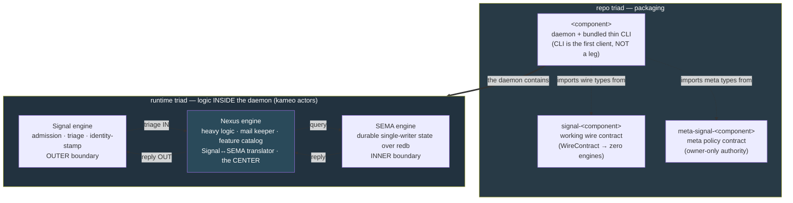

The repo triad is three repos: the runtime `<component>` (daemon + thin CLI), the
working `signal-<component>` contract, and the meta-policy
`meta-signal-<component>` contract — the CLI is the daemon's first client, *not* a
fourth leg, and the wire types are single-sourced from the contract repos (`2`
§1, Spirit `tb9h`). The runtime triad is three kameo-actor engines matching the
three schema types: **Signal** owns the outer cross-process boundary, **SEMA**
owns the inner durable-state boundary, and **Nexus** is the center that decides —
the flow is always Signal IN → Nexus → SEMA → Nexus → Signal OUT, with every
internal feature forced to be a visible Nexus verb (`2` §2). `spirit` is the
worked exemplar of the runtime triad.

### The live constellation and who does what

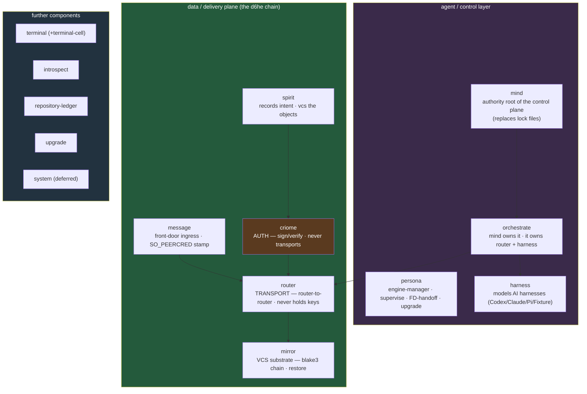

The division of labor is one verb per component, each grounded in its
`INTENT.md` (`2` §4):

| Component | Verb | Boundary that fixes it |
|---|---|---|
| **spirit** | records intent · version-controls objects | store is "a fold of its versioned log" (`iir4`) |
| **criome** | authenticates — signs/verifies | "Criome verifies; Persona decides"; never holds transport |
| **router** | transports — router-to-router | "transport-only and event-causal"; never holds keys |
| **mirror** | version-controls / moves object bytes | payload-blind; validates the blake3 chain; fsync-then-ack |
| **message** | front-door ingress | stamps SO_PEERCRED provenance, forwards; stateless |
| **mind** | control authority root | observes up-tree, orders down-tree; replaces lock files |
| **persona** | infrastructure supervision | supervise · upgrade · FD-handoff |
| **harness** | runs agents | models Codex/Claude/Pi/Fixture as runtime objects |

Two key chains run through the constellation. The **control-plane authority chain**
is top-down: mind → orchestrate → router/harness, correctness maintained by Mutate
chains with commit-first-success-record-divergence (not two-phase rollback);
observation flows *up* via push-Subscribe, authority *down* via Mutate (`2` §4).
The **data-plane spirit-vcs chain** is the cleanest worked relationship —
spirit → criome (auth) → router (transport) → remote criome + mirror →
mirror (restore) — over one cryptographic basis: blake3 content addressing +
criome BLS signing (`2` §4, Spirit `x0ja`). That data-plane chain is exactly what
Zoom 4 expands.

One named gap, not the target shape: spirit currently violates the meta
single-source rule (a local `schema/meta-signal.schema`, no dependency on
`meta-signal-spirit`) — flagged in `2` §1.

## Zoom 3 — The schema-codegen pipeline

Open the SCHEMA box from Zoom 1. The pipeline turns *one* authored `.schema` file
into a component's complete structural surface — its Rust types *with* their rkyv
and NOTA codecs — so that types and encodings cannot drift. The dependency order
is strict (`3-schema-codegen-pipeline.md` §pipeline, citing `schema-cc/INTENT.md:56`).

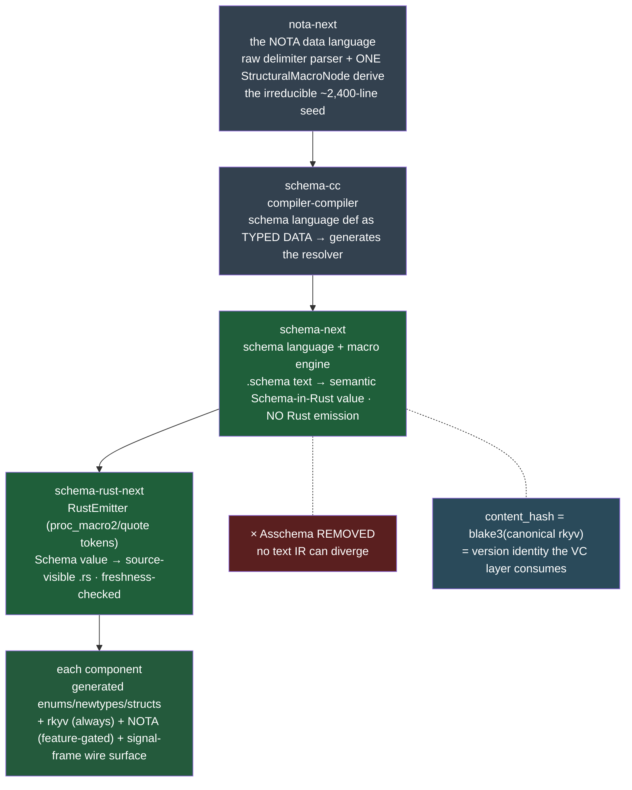

The stages (`3` §pipeline): **nota-next** is the NOTA data language — a raw
delimiter-balanced block parser, the single `StructuralMacroNode` derive, and the
shared `NotaDecode`/`NotaEncode` value codecs; it is the irreducible hand-written
seed and "does not decide schema semantics." **schema-cc** is the
compiler-compiler: the schema language and compiler kept as inspectable typed data
that *generates* the resolver/dispatch/emission rules (first inhabitant
`ReferenceGrammar`, already emitting into schema-next), build-time only,
generate-not-interpret. **schema-next** lowers `.schema` text into the semantic
`Schema`-in-Rust value (rkyv-serializable) and emits *no* Rust — Asschema is
removed so no intermediate text IR can diverge, and the schema is
content-addressable (`content_hash` = blake3 over canonical rkyv = version
identity). **schema-rust-next**'s `RustEmitter` lowers the `Schema` value to
source-visible `.rs` built as proc-macro2/quote tokens (not strings), freshness-
checked by the `GenerationDriver`. The terminal output: each component's generated
nouns carrying rkyv always + NOTA feature-gated + the `signal-frame` wire surface.

### The source-of-truth discipline and the frame-expansion leverage

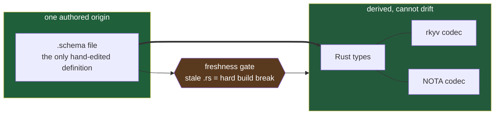

The load-bearing gain (rated *large* in 667): every schema type emits *with* its
codecs onto the same struct/enum, so an encoding cannot be defined separately from
the type it encodes; the freshness gate makes a stale generated `.rs` a hard build
break (an emitter change re-emits *all* consumers); the content-hash is the
version the VC layer consumes; byte-stability is required *only* as the
deployed-peer / pinned-contract exception, never sold as a virtue (`3`
§source-of-truth, 667 finding 8).

The genuine headline (the ~4,200-line leverage figure, 667 finding 4) is **frame
expansion**: the Work/Action reaction frames are declared *once* as generic enums;
a component binds them in two lines at its root positions; the emitter
*monomorphizes* each applied root into a concrete `pub enum Input`/`pub enum
Output` with codecs, constructors, and `From` — replacing a hand-spelled
interface (`3` §frame-expansion). Aliases are forbidden (the test asserts no
`pub type Input =`). Live debt on this exact path: a dual codepath still falls
back to a legacy `type X = Head<Args>` alias for unresolved heads, which violates
no-backward-compat; the fix (a typed error) is on the 666 plan.

### The generated / hand-written boundary

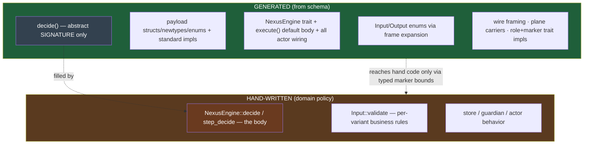

The boundary is grounded in real generated code (`3` §boundary, citing
`runner_generated.rs:1747-1807`): the `NexusEngine` trait, its `execute` default
body (the whole runner-drive loop), and all wiring are *generated*; `decide` is
emitted as an abstract signature with no body. Hand-written is only the domain
policy — `decide`/`step_decide`, `validate`, and store/guardian/actor behavior.
Generated nouns reach hand-written code through typed marker bounds. 667 rates
this a correctness/trust property: codegen *provably* never touches
decide/validate. This is the exact line that Zoom 5 lands on inside criome — its
SIGNAL types are generated, its NEXUS `decide` is the hand-written policy body.

## Zoom 4 — The e2e production chain

Open the spirit-vcs chain from Zoom 2 and the DEPLOY box from Zoom 1 together.
The `d6he` production chain is five components, one verb each, riding the cluster
fabric.

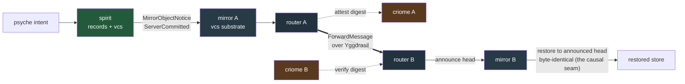

The clean conceptual division (`4-e2e-and-deploy.md` §chain): **Yggdrasil**
encrypts and routes the bytes; **router** transports typed routing facts and owns
delivery state; **criome** authenticates the sending-router identity; **mirror**
moves versioned object/log bytes; **spirit** records intent and ships mirror
notices. The criome attestation is the cross-host trust primitive — within one
host the kernel proves the local caller via `SO_PEERCRED`, but across hosts there
is no kernel channel, so a BLS attestation chained to the cluster root carries the
proof instead. This is what "attestation replacing `SO_PEERCRED`" means.

### Proven vs gated, and the physical bed

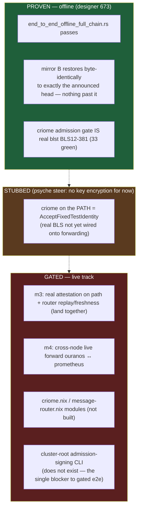

PROVEN (673): the full offline chain passes; mirror B restores byte-identically
to exactly the router-announced head and nothing more — the causal seam is the
proven invariant. STUBBED by the psyche's "no key encryption for now" steer:
criome on the forwarding path is `AcceptFixedTestIdentity`, even though the
admission gate itself is real `blst` BLS12-381 (33 green tests) — real BLS just
is not wired onto the path yet. GATED to the live track: real attestation on the
path plus router replay/freshness (m3, must land together); cross-node live
forward ouranos ↔ prometheus (m4); the `criome.nix` and `message-router.nix`
modules; and the cluster-root admission-signing CLI — which *does not exist* and
is the single blocker between a wired gate and an operable gated e2e (`4`
§proven-vs-gated).

The physical bed: four `goldragon.criome` Yggdrasil nodes (zeus, prometheus also
nix-cache, ouranos, tiger) all inside `200::/7`; ouranos ↔ prometheus is the m4
two-node bed. `network/default.nix` projects `<node>.<cluster>.criome` host names
from Horizon `yggAddress` facts, answered locally via NSS — `.criome` proves
*where* router dials, criome proves *who* spoke (`4` §physical). Two caveats worth
carrying: today's deployed mirror binds *Tailscale* (`0.0.0.0:7474` on
`tailscale0`), not Yggdrasil — open question 4 is whether to unify the live chain
on one fabric; and the existing `router/default.nix` is the *WiFi/LAN* router
(hostapd/kea/nftables), a name collision with the unbuilt message-router module.

Two deploy stacks coexist (`4` §two-stacks, `INTENT.md:90-98`): **production
Stack A** — the old monolith on `main`, the *only* compatibility boundary — and
the **restructuring stack** — the whole `d6he` chain, on `~/wt` branches, not cut
over (schemas have diverged; cutover is a coordinated multi-repo merge, never
piecemeal). This is why "no backward compatibility pre-production" holds for the
chain: there is no production behind it to protect.

## Zoom 5 — Inside criome

Open the criome box from the chain. criome is the triad's **Nexus authorization
layer** — the auth step that signs and verifies and nothing else — and the policy
language just landed on main (the 674 arc) is precisely that step made typed,
deterministic, content-addressed, and attested-time-stamped.

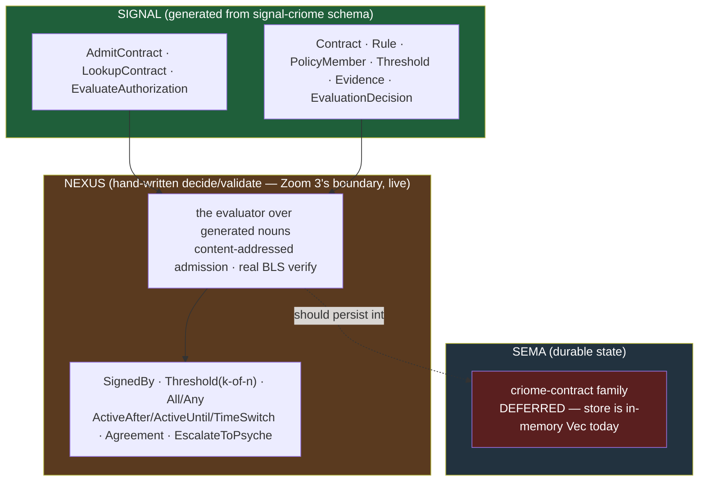

Three boundaries fix criome's place (`5-criome-language-in-context.md` §1):
**auth-only** (`wckt`: signs/verifies, never transports or moves objects, never
runs an LLM — it only verifies a signed verdict that one produced); **a limited
typed policy language, never a VM** (`vhs2`: a closed acyclic combinator
vocabulary — the proof it stayed in-line is the *absence of a gas meter*, since a
closed acyclic vocabulary buys guaranteed halting and bit-identical re-evaluation
for free); and **content-addressed composable objects** (`z9d6`: a `Contract`'s
identity *is* `blake3(canonical_bytes)`, composition by digest, a quorum member is
a key *or* another object by digest via `PolicyMember::{KeyMember, ObjectMember}`).

The three sub-structures (`5` §1), each mapping to one engine — the live
realization of Zoom 3's generated/hand-written line:

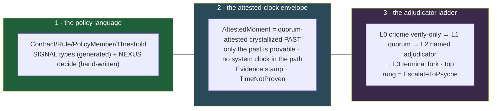

1. **The limited typed policy language** — SIGNAL owns the closed type vocabulary
   (schema-emitted), criome's NEXUS owns the hand-written `decide`/`validate`
   bodies that interpret it; the combinator set is `SignedBy` (one real BLS
   verify), `Threshold` (k-of-n), `All`/`Any`, the time leaves, `Agreement`, and
   `EscalateToPsyche`.

2. **The attested-clock stamped envelope** (`ay3y`) — "now" never comes from a
   system clock in the language path; an `AttestedMoment` is a quorum-attested
   *crystallized-past* lower bound proving `now >= closes_at`. Only the past is
   provable. Landed: `Evidence.stamp: AttestedMoment` (renamed from `observed_at`
   in the final `f10fb54d` "align naming" commit) and `TimeNotProven` as a
   rejection reason distinct from `OutsideTimeWindow`.

3. **The adjudicator / escalation ladder** (`gc0n`) — criome stays at L0
   (mechanical verify, moves nothing); above it L1 quorum vote, L2 named
   adjudicator signing a content-addressed verdict, L3 terminal fork as honest
   non-resolution; the psyche is the highest-authority lowest-availability rung,
   and escalate-to-psyche is the literal expression of intent-is-primordial.

Landed on main (`5` §2, verified verbatim in `signal-criome f10fb54d` /
`criome cd1de18f`): the schema-first public policy surface in signal-criome
(superseding the hand-Rust `language.rs` split); the criome NEXUS evaluator over
the generated nouns with *real* BLS; `Evidence.stamp` as the evaluator's only
source of "now"; `TimeNotProven`; replay binding to the attested-moment
proposition digest in `OperationStatement::to_signing_bytes`; and the daemon-root
request path. Deferred: the SEMA `criome-contract` family (the store is an
in-memory `Vec` today — the one genuine in-triad gap); the full
`(digest, branch, version, moment)` replay quad; output-side stamping (a shared
stamped-frame envelope so every Input/Output/Event carries the stamp — operator
409's next step); the full named-adjudicator ladder beyond `EscalateToPsyche`;
and the `meta-signal-criome` governance surface.

The plug-in point into the chain (`5` §3): criome is the *third* step of `d6he` —
Spirit asks the local criome to authenticate the exact content-addressed object
via `EvaluateAuthorization(AuthorizationEvaluation { contract, evidence })`, and
criome returns `AuthorizationEvaluated { Authorized | Rejected | EscalateToPsyche }`.
On `Authorized` the router transports; criome moves nothing.

## Closing — Where we are now

Pull all the way back out and mark the cursor.

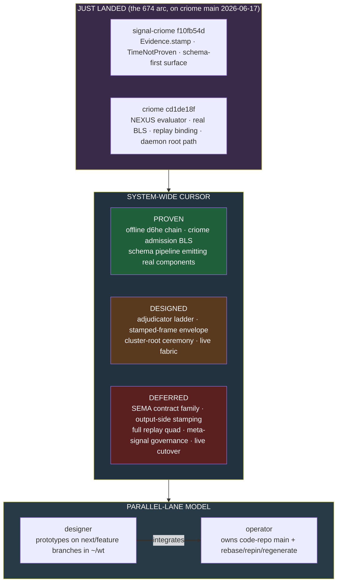

The just-landed milestone is the 674 arc on criome main: the policy language is
no longer a designer prototype — both `signal-criome f10fb54d` and
`criome cd1de18f` are on `origin/main`, with the schema-first surface,
attested-moment stamp, real BLS evaluator, and replay binding all verified
verbatim (`5` §0). The two lanes converged on the field name `stamp` (operator
409's report still shows the pre-rename `observed_at` — the report text lags the
landed schema).

System-wide, the cursor sits where the deep work is *proven offline and gated for
live*: the schema pipeline emits real components and the generated/hand-written
boundary is a live correctness property (Zoom 3); the offline `d6he` chain passes
with the byte-identical causal-seam invariant (Zoom 4); criome's authorization
step is landed on main with real BLS (Zoom 5). What is *designed but not built*
clusters at the live edge — the adjudicator ladder beyond psyche, the shared
stamped-frame envelope, the cluster-root provisioning ceremony, and the choice of
a single live fabric. What is *deferred* is mostly persistence and governance —
criome's SEMA contract family, output-side stamping, the full replay quad,
`meta-signal-criome` governance, and the production cutover itself.

The cadence that produces this is the **parallel-lane model**: designers prototype
on `next`/feature branches in `~/wt` worktrees, and operators own code-repo `main`
plus the rebase/repin/regeneration work — the 674 arc is the model in action, a
designer design arc landed by the operator lanes (`4` §branch-discipline, `5`
§0). The single nearest unblock for an *operable* live e2e is the one piece that
does not yet exist: the cluster-root admission-signing CLI (`4` §gated).

### One grounding fix worth flagging

`criome/INTENT.md:84-85` cites `primary/ESSENCE.md §"Today and eventually"`, but
`ESSENCE.md` has no such section (`1` §grounding-finding, verified via `^##`
grep). The today-vs-eventually scope discipline now lives in per-repo `INTENT.md`
files and `protocols/active-repositories.md`; the cross-reference is stale and
worth a one-line repair.

## Sources

The five ground files in this directory, each grounded in real source:
`1-telos-and-layers.md`, `2-component-constellation.md`,
`3-schema-codegen-pipeline.md`, `4-e2e-and-deploy.md`,
`5-criome-language-in-context.md`. Through them: `ESSENCE.md`, `INTENT.md`,
`AGENTS.md`, `protocols/active-repositories.md`, `skills/component-triad.md`; the
per-repo `INTENT.md` of criome / spirit / router / mirror / mind / persona /
harness / message and the four schema-pipeline repos; reports 666/667/668/669/673,
system-designer 123/126/128, operator 408/409, the 674 capstone; CriomeOS network
and service modules; and the landed commits `signal-criome f10fb54d` /
`criome cd1de18f` verified on `origin/main`.
