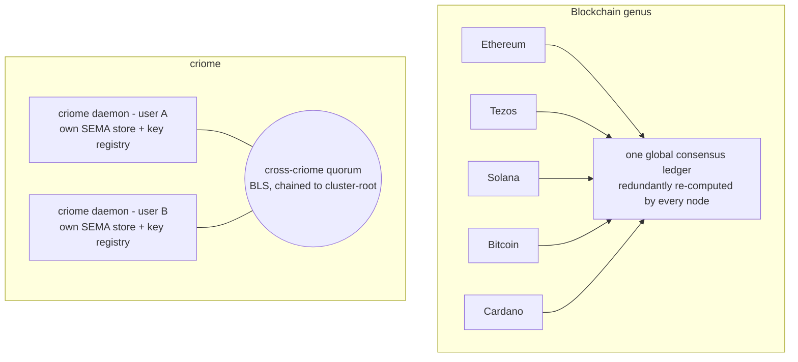

# 676.5 — criome's contract machinery vs. the chains: the synthesis

The comparison the psyche asked for: how criome's contract machinery — the
content-addressed policy language plus the SEMA-backed contract DAG operator is
landing — compares to how Ethereum/Solidity, Tezos, Solana, Bitcoin, and Cardano
do theirs. This file leads with the thesis, tests it against the four grounded
perspectives (`1`–`4`), lays out the comparison table across the architectural
forks, then walks each deep fork and closes on what the lineage gives criome and
what criome gives up.

## Thesis, and the test

**criome is in the predicate/validator family — Bitcoin Script, Cardano
EUTXO/Plutus, ERC-4337's `validateUserOp` phase — not the stateful-execution-VM
family — EVM, Tezos Michelson, Solana BPF.** A criome contract is a policy
*evaluated to a verdict*; it is never code that *runs and mutates state*.

The grounding confirms it on every axis that defines the family split. The
predicate family's three structural payoffs (file `3`) are: bounded halting
without gas, determinism / pre-flight knowability, and a state model of
immutability + content/hash/ID addressing rather than mutable global storage.
criome's landed code (file `4`) exhibits all three:

- **Verdict, not execution.** `Contract::evaluate → Rule::decide`
  (`src/language.rs:80-156`) returns three-valued
  `Decision::{Authorized | Rejected | EscalateToPsyche}` and mutates nothing —
  exactly Cardano's `(datum, redeemer, ScriptContext) -> Bool` shape, widened to
  three values. criome stays auth-only: it verifies signed verdicts and moves
  nothing (`wckt`). This is the decisive tell from file `3`: none of the family
  *runs code to change the world*; the protocol applies the mutation only on a
  yes.
- **No gas, halting structural.** `grep gas|loop|while` over `language.rs` finds
  zero loops and zero metering — only bounded folds over finite `Vec`s. Like
  Bitcoin Script ("no loops … predictable execution times"), the closed acyclic
  vocabulary halts *structurally*; there is nothing to meter. The EVM/Michelson/
  BPF family *must* meter precisely because their VMs are Turing-expressive.
- **Content-addressed immutable objects.** Identity = `blake3(canonical bytes)`;
  there is no `UpdateContract` verb anywhere in the surface (`lib.schema:7-23`);
  revocation is a new record, not an edit. Same shape as Bitcoin P2SH /
  Cardano `ValidatorHash` / Sui's `(ID, version, digest)` — addressing by content,
  not a mutable slot.

The one place the thesis needs care: criome sits *near* the execution family on a
single sub-axis — its `vhs2` Decision explicitly draws the *limited-operation
discipline* from "the constrained VMs of Ethereum, Tezos, and Solana." But
borrowing the discipline of restriction is the opposite of being a VM: criome
took the typed-restriction lesson (Michelson) and the closed-vocabulary lesson
without taking the execute-and-mutate engine. The thesis holds.

## The comparison table

Rows are the architectural forks; columns are the six systems plus criome.

| Fork | Ethereum / Solidity | Tezos (Michelson) | Solana (BPF) | Bitcoin Script | Cardano / Plutus | **criome** |
|---|---|---|---|---|---|---|
| **Execution vs validation** | execute & mutate world-state | execute & mutate | execute & mutate accounts | **validate** (stack → true) | **validate** `(d,r,ctx)→Bool` | **validate** → `Authorized\|Rejected\|EscalateToPsyche` |
| **Turing-completeness + halting** | quasi-Turing-complete; **gas** meters & bounds | Turing-expressive; **gas** | Turing-expressive; **compute units** | non-Turing-complete; **structural** halt, no gas | scripts metered but pure/deterministic | closed acyclic combinator enum; **structural** halt, **no gas** |
| **State: mutable slot vs content-addressed immutable** | `SSTORE` mutable storage at an address | mutable `big_map`/storage | mutable data accounts (owner-gated) | immutable UTXO | immutable UTXO + datum | immutable objects, identity = `blake3` digest; **no update verb** |
| **Composition** | runtime `CALL`/`DELEGATECALL` → **reentrancy** | inter-contract calls | cross-program invocation | none (single predicate) | references via tx inputs/outputs | **by-digest acyclic references** (strict DAG) → **no reentrancy** |
| **State location** | one global-consensus ledger / world-state | global-consensus ledger | global-consensus ledger | global UTXO set | global EUTXO set | **per-daemon SEMA (redb+rkyv), per-Unix-user + cross-party quorum** |
| **Time source** | `block.timestamp` (proposer-set) | block-clock | slot/block-clock | median-of-11 block time | slot/block-clock | **quorum-attested crystallized-PAST lower bound** (`ay3y`) |
| **Upgrade / governance** | immutable code + **proxy** (delegatecall→swappable impl); social hard-fork | **on-chain self-amendment** (hot-swap hash-identified protocol) | program upgrade authority; social fork | soft/hard fork (social) | hard fork (social) | **immutable + admit-new-object + adjudicated divergence** (`gc0n` ladder) |
| **Domain** | general computation | general computation | general computation | spend-authorization only | general (UTXO-shaped) | **identity / authorization specialized** (auth-only) |

## The deep forks

### 1. Execution vs validation — the family line

criome runs a pure judgment over a proposed change and lets the protocol apply
the mutation only on a yes. **Shares with:** Bitcoin Script (stack predicate),
Cardano Plutus (`(d,r,ctx)→Bool`), and — partially — ERC-4337's `validateUserOp`
phase, which separates "is this allowed and paid for?" from `execute`'s effect.
**Differs from:** EVM, Michelson, Solana BPF, all of which compute
`Y(S,T)=S'` — code that *runs to mutate* shared state. The three-valued
`Decision` is criome's one genuine widening of the binary family verdict: a
predicate that can route to a human/LLM judgment (`EscalateToPsyche`) without
rendering one — "criome verifies; Persona/psyche decides" (`wckt`).

### 2. Structural halting vs gas

Because the `Rule` vocabulary is closed and acyclic (`language.rs:15-26`) and
references are acyclic-at-admission (a hash cannot name a not-yet-computed hash),
evaluation is a bounded fold over a strict DAG. Termination and bit-identical
re-evaluation come for free — no fuel counter. **Shares with:** Bitcoin Script
(loop-free, no gas). **Differs from:** EVM/Solana/Michelson, which meter because
their machines could otherwise loop forever; even Cardano, though pure, still
prices script execution. criome's *absence of a gas meter* is the positive
evidence that the design stayed inside the "limited, not a VM" line (`vhs2`).

### 3. Content-addressed immutable objects vs mutable storage at an address

A criome contract's identity *is* its content (`blake3` of canonical bytes);
"change" means a different object with a different digest. **Shares with:**
Bitcoin (immutable UTXO, P2SH script hash), Cardano (immutable UTXO + datum,
`ValidatorHash`), Sui (`(ID, version, digest)`), and — partially — Ethereum's
`CREATE2` (init-code-hash + salt → deterministic address, "content-ish" but still
binds deployer + salt and still fronts a *mutable* storage trie). **Differs
from:** the EVM/Michelson/Solana `SSTORE`-style mutable-slot model where the
address is stable and the bytes behind it are overwritten in place. **Where
criome is NOT novel:** this is the Git/Nix/IPFS content-addressing lineage —
immutable objects keyed by hash, composition by reference — predating all the
chains. criome borrows it wholesale; the novelty is applying it to *authorization
policy* objects, not the addressing scheme itself.

### 4. By-digest acyclic references vs runtime calls + reentrancy

`decide` reads a referenced contract's *value* and folds it; it never invokes
another contract's *code* mid-evaluation. Combined with immutable referents, a
strict DAG, and zero side effects, the **entire reentrancy class is structurally
impossible** — no callback surface, no mutable balance to re-enter, no partial-
state interleaving. The DAO bug cannot be *expressed* in this vocabulary.
**Shares with:** the whole predicate family (none has runtime mutable-state
callbacks). **Differs sharpest from:** Solidity, where `CALL` hands control to
external code before state is finalized — the canonical footgun that
checks-effects-interactions, guards, and pull-over-push exist to patch. This is
the single cleanest distinction from the EVM mainline.

### 5. Per-daemon SEMA + cross-party quorum vs global-consensus ledger

This is the fork where criome **leaves the blockchain genus entirely.** Every
chain in files `1`–`3` — Ethereum, Tezos, Solana, Bitcoin, Cardano — is a single
global, redundantly-computed, consensus-ordered world: thousands of nodes
re-execute or re-validate to agree on one canonical history reducible to a root
hash. criome is **per-Unix-user**: each daemon holds its own contract store
(SEMA, redb+rkyv) and its own key registry; there is no shared world-state, no
miners/validators, no canonical chain. Multi-party trust is **cross-criome
quorum** — peers co-sign quorum objects under keys chained to a shared
cluster-root (`ermr`, `admission.rs:86-101`, real BLS min-pk over a domain-tagged
statement) — not all-writing-to-one-ledger. **Shares with:** Sui's owned-object
fast path is the nearest cousin (local conflict-free validation skipping global
consensus), but even Sui falls back to a global sequencer for shared objects;
criome has no global sequencer at all. *Honest gap (file `4` §5):* the
`criome-contract` SEMA family is the one genuine in-triad gap — the store is an
in-memory `Vec` stand-in today; "persisted DAG" is the designed target.

### 6. Quorum-attested crystallized time vs block-clock

criome has no block height standing in for time. An `AttestedMoment` is a forward
window `[start, end]` proposed under a `TimeQuorum`, addressed by
`blake3(window, quorum)`, BLS co-signed, that **crystallizes** when enough
distinct admitted authorities sign — yielding a non-forgeable monotonic *lower
bound* on now (`now >= end`). Only the past is provable; a time authority is "just
another criome quorum object" (`ay3y`). Time-lock leaves compare the operation's
*own* proof-of-when, never an ambient `SystemTime::now()`. **Differs from:** every
chain's block-clock — Ethereum's proposer-set `block.timestamp`, Bitcoin's
median-of-11. **Shares with:** nobody cleanly; the closest analog is that all
chains derive time from consensus artifacts, but criome derives it from a
*scoped* quorum signature rather than a global chain, and only ever as a proven
lower bound.

### 7. Upgrade / governance: immutable + admit-new + adjudicated divergence

Three distinct models across the field. Ethereum: immutable code with
upgradeability *rebuilt on top* via proxies (delegatecall → swappable impl,
EIP-1967), plus social hard-forks for protocol change. Tezos: the standout —
**on-chain self-amendment**, a fixed shell + a hot-swappable hash-identified
protocol core swapped in-band by a multi-period quorum + supermajority vote, no
restart, no manual fork. Bitcoin/Cardano/Solana: social forks / upgrade
authority. **criome's model is its own third thing:** objects are immutable so
nothing is upgraded in place; a "change" is admitting a *new* object; and genuine
*divergence* (network splits, "we disagree about the rules") is resolved by an
**adjudicator ladder** (`gc0n`) — L0 mechanical verify → L1 quorum vote → L2 named
adjudicator (a quorum, a non-judgment-leaning default LLM, a smarter agent, or
the psyche, signing a content-addressed verdict against a pre-agreed
fairness-model object; criome *verifies* the proof, never *runs* the model, the
Chainlink-oracle pattern) → L3 terminal honest fork. **Shares with:** Tezos the
*spirit* of in-band governed evolution and hash-identified policy; **differs**
in that Tezos bottoms out in economic-stake majority while criome's regress
bottoms out by pinning the resolver to a **pre-fork common ancestor** both sides
accepted before the split — a judge cannot rule on its own legitimacy, so schisms
terminate honestly at L3 rather than being decided by whoever has more stake or
hash power. The top rung, `EscalateToPsyche`, is the literal expression of
intent-is-primordial.

### 8. Domain: identity/authorization-specialized vs general computation

Every chain is general-purpose computation (Bitcoin deliberately narrowed to
spend-authorization, but still a general value-transfer ledger). criome is
**auth-only by design** (`wckt`): it signs and verifies identity and
authorization, and *structurally cannot* transport (router's job), move objects
(mirror's job), or run an LLM. The specialization is what licenses the closed
vocabulary: you only need a fixed combinator set because the domain is fixed.

## What the lineage gives criome, and what it gives up

**Gains (from the predicate/validator family + content-addressing lineage):**

- **No reentrancy** — no runtime calls, immutable referents, acyclic DAG; the
  DAO bug class is inexpressible.
- **No gas** — closed acyclic vocabulary halts structurally; nothing to meter,
  nothing to price.
- **Deterministic re-evaluation** — pure predicate over immutable inputs gives
  bit-identical results and pre-flight knowability, like Cardano's off-chain
  pre-validation that "costs you nothing" on failure.
- **Immutability + content addressing** — identity = digest, no mutate-in-place,
  no `SELFDESTRUCT`; permanent, shareable, composable-by-reference objects.
  (Inherited from Git/Nix/IPFS, not invented here — and that is the honest
  framing.)

**Gives up (the blockchain genus it deliberately left):**

- **No global consensus or total ordering** — there is no single canonical
  history, no world-state root, no Sybil-resistant agreement among mutually
  anonymous parties. criome is **not a blockchain** and does not try to be.
- **No native global double-spend prevention / value ledger** — it authorizes;
  it does not hold or move value across an untrusted global set.

**What it substitutes for what it gave up:** cross-party **quorum** (BLS
co-signature chained to a cluster-root) in place of miner/validator consensus;
**quorum-attested crystallized time** in place of a block-clock; and an
**adjudicated divergence ladder** ending in escalate-to-psyche / honest terminal
fork in place of stake/hash fork-choice. criome trades the blockchain's universal
trustless ordering for a *scoped, federated, intent-anchored* trust model — the
right trade for an identity/authorization layer serving a known cluster of
criome daemons rather than an open adversarial network.
