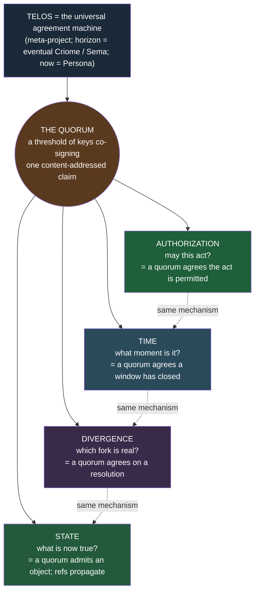
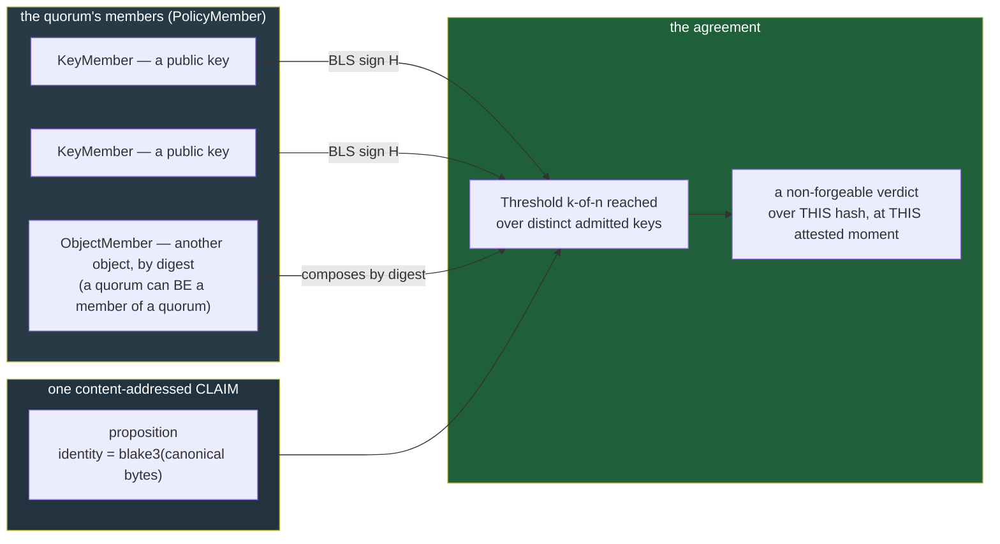
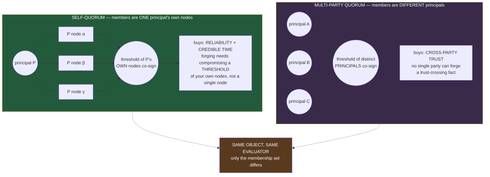
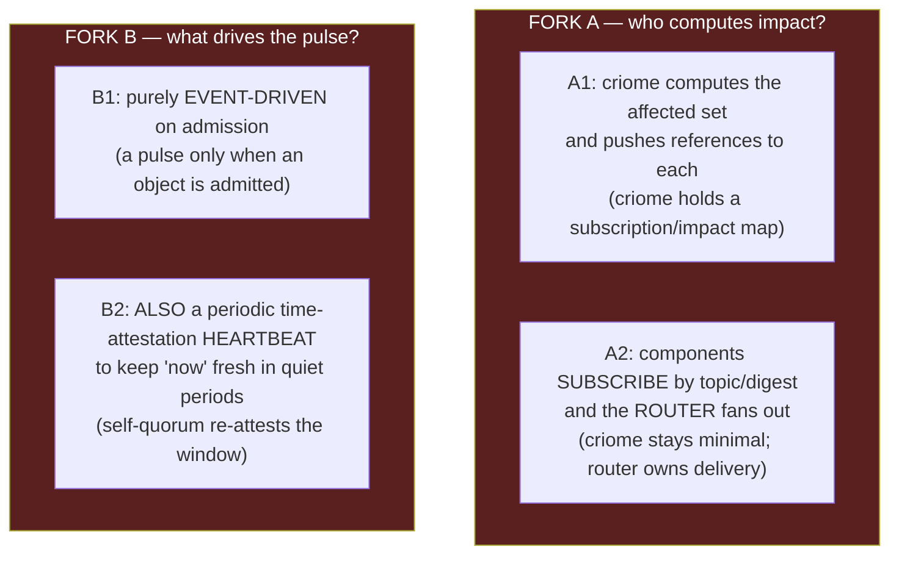
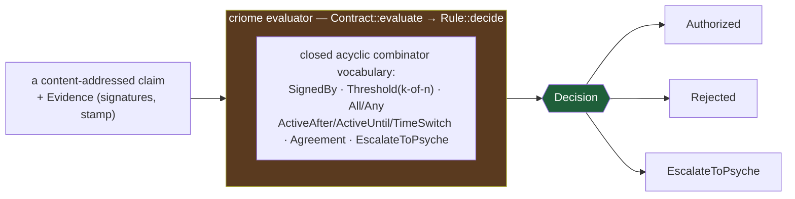
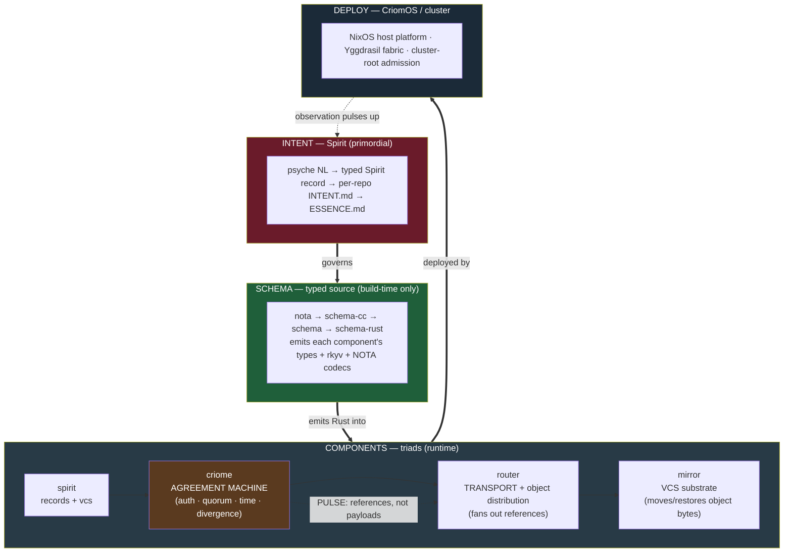
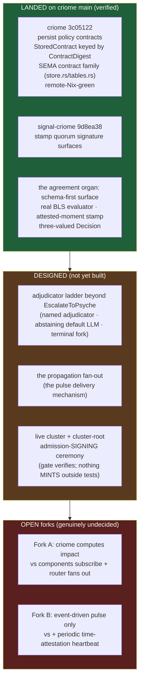

# 677 — criome, the agreement machine within Telos

*The vision, seen again. The psyche asked to see the system as a whole, with one
new framing folded into the centre: **Telos is a universal agreement machine, and
the quorum is its universal primitive.** Everything the prior arc described —
authorization, time, divergence resolution, propagated state — is one mechanism
wearing different clothes: a quorum agreeing on a content-addressed claim. This
document re-tells the system around that single primitive, carries the
whole-session decisions, and marks the cursor honestly: what is landed on main,
what is designed, what is still an open fork.*

Ground: reports `675/6-system-map.md` (the multi-zoom structure),
`674.15` (criome's policy language + binding constraints), `676/5-comparison.md`
(criome is the predicate/validator family, not a blockchain). Spirit records
`pviw` (Telos = the meta-project), `obuf` and `m0p2` (the agreement-machine
framing + the object-update pulse), `vhs2` (limited typed policy language),
`ay3y` (attested crystallized-past clock), `gc0n` (adjudicator ladder),
`z9d6` (content-addressed composable objects), `wckt` (criome auth-only).

## 0. The one sentence

Per `pviw`, [Telos is the name of the meta-project ... the overarching work and
design as a whole ... whose far horizon is eventual Criome and eventual Sema, the
universal computing paradigm, realized now as Persona]. Per `obuf`, [Telos is a
universal agreement machine for authorizations, and the quorum is its universal
primitive - everything is a quorum]. Put together: **Telos is a universal
agreement machine; the quorum is its universal primitive.** The rest of this
document is the unfolding of that sentence.



The collapse is the insight. Before this framing there appeared to be four
machines — an authorizer, a clock, a divergence resolver, a state propagator.
There is one. A clock is a quorum agreeing a time-window closed (`ay3y`). A
divergence resolution is a quorum agreeing which branch wins (`gc0n`, `vhs2`). An
authorization is a quorum agreeing an act is permitted (`m0p2`). Admitted state
is a quorum agreeing an object is real, after which its *reference* propagates
(`m0p2`, `z9d6`). criome is the daemon that runs this primitive; Telos is the
whole endeavour the primitive serves.

## 1. The quorum is the universal primitive

A quorum is the smallest complete unit of agreement: **a threshold of admitted
keys, each contributing a real BLS signature over the same content-addressed
proposition.** `obuf` states it as the load-bearing decision — [everything is a
quorum]. Everything Telos treats as *true* is true because a quorum said so over
a hash, and everything it treats as *false-or-forged* is so because the
signatures do not reach the threshold over that exact hash.



Three properties make it universal. First, the **claim is content-addressed**
(`z9d6`): its identity *is* `blake3(canonical_bytes)`, so a signature can only be
over an exact, immutable proposition — you cannot sign "the contract" and have it
mean a later-edited contract. Second, a **member may itself be a quorum**
(`z9d6`, `PolicyMember::ObjectMember`): quorums compose by digest into a strict
acyclic DAG, so a panel defined once is shared by many parents and there is no
mutable state to re-enter. Third, **every quorum signature carries an attested
moment** (`ay3y`): [a quorum signature is never timeless but is always over
content together with a crystallized moment], so agreement is always time-bound
for freshness and replay reasoning. One primitive — threshold of keys over a
hash, stamped with when — and the whole system is its iteration.

## 2. The quorum scoped by membership — self-quorum and multi-party quorum

The deepest move in `obuf` is that **one quorum primitive serves two purposes,
distinguished only by who its members are.** There are not two mechanisms (a
reliability mechanism and a trust mechanism); there is one mechanism scoped two
ways. [One quorum primitive serves both, scoped by membership - a principal's own
nodes for reliability and credible time, multiple principals for cross-party
trust.]



The self-quorum is the part that is easy to miss and load-bearing. `obuf`: [Each
principal runs more than one node and asks its own quorum to make its
attestations reliable and its timestamps credible: forging an attestation would
require compromising a threshold of the principal's own nodes rather than a
single node, so a self-quorum across one's own nodes is a reliability mechanism,
not only multi-party trust across different principals.] This is also why `m0p2`
sets the default to quorum-backed even for a single principal: [a lone node
signature has little value except narrow bootstrap or diagnostic cases, so the
practical design default is quorum authorization for meaningful objects and
trust-crossing state].

| Scope | Members | What it buys | Forgery cost |
|---|---|---|---|
| **Self-quorum** | one principal's own multiple nodes | reliability (no single point of failure) + credible timestamps | compromise a threshold of *your own* nodes |
| **Multi-party quorum** | several distinct principals | cross-party trust for trust-crossing state | compromise a threshold *across parties* |

The same `Threshold(k-of-n)` over the same `PolicyMember` set, the same BLS
verify, the same evaluator — the membership set is the only thing that changes.
This is the unification `obuf` makes: reliability and trust are not two features,
they are one quorum primitive aimed at two membership scopes.

## 3. The pulse and propagation — references, not payloads

Telos is the local source of authorization truth and the submit-point; once a
quorum agrees, the *fact* must reach the components that care. `m0p2` fixes the
shape: **the object-update pulse pushes references, never payloads.** [When a
content-addressed object or authorized state transition is admitted, criome
pushes an update to affected components. Criome pushes references, not object
payloads; components fetch or request the referenced rkyv object through the
routing/object-distribution layer.]

```mermaid
sequenceDiagram
  autonumber
  participant Sub as submitter (e.g. spirit)
  participant Cri as criome (auth — the agreement machine)
  participant Sema as criome SEMA (StoredContract DAG — LANDED)
  participant Aff as affected component
  participant Rtr as router / mirror (object distribution)
  Sub->>Cri: SubmitContract / EvaluateAuthorization (a content-addressed claim)
  Cri->>Cri: quorum evaluate — threshold of BLS sigs over the hash, at the attested moment
  Cri->>Sema: admit — persist StoredContract keyed by ContractDigest
  Note over Cri,Sema: criome is the LOCAL SOURCE OF AUTH TRUTH + the submit-point
  Cri-->>Aff: PULSE — a REFERENCE (digest), not the payload
  Aff->>Rtr: fetch the referenced rkyv object by digest
  Rtr-->>Aff: the rkyv object bytes
  Note over Aff: criome MOVES NOTHING — it authenticated; the router/mirror transports (wckt)
```

The division is the same `wckt` boundary the whole system rests on: criome
authenticates and emits the reference; the router transports and the mirror moves
the bytes; criome never carries a payload. The pulse carries the *minimum* — a
digest — and the heavyweight object travels the object-distribution layer on
demand. This keeps criome small, payload-blind, and auth-only even as it becomes
the spine of state propagation.

### Two open forks in the propagation design

This is the part of the vision that is genuinely undecided. Two questions are
open, and the design should not pretend otherwise:



**Fork A — does criome compute impact, or do components subscribe and the router
fans out?** Pushing references to *affected* components implies someone knows the
affected set. Either criome holds an impact/subscription map and computes it
(richer criome, more state), or criome only admits and the router fans out to
subscribers by topic/digest (criome stays minimal, consistent with `wckt`'s
auth-only line and the existing push-Subscribe pattern). The second leans with
the grain of the constellation; the first centralizes correctness in the
authorizer. Unresolved.

**Fork B — is the pulse purely event-driven on admission, or is there also a
periodic time-attestation heartbeat?** `ay3y` makes time a quorum object: a
window proposition co-signed and crystallized. In a quiet period with no
admissions, "now" goes stale — the newest provable lower bound recedes into the
past. A purely event-driven pulse (B1) never refreshes time on its own; a
periodic self-quorum heartbeat (B2) re-attests the window so freshness/replay
reasoning stays tight even when nothing is being authorized. B2 is the natural
home of the self-quorum from §2 (your own nodes keeping your own clock credible).
Unresolved, and it interacts with Fork A: a heartbeat is itself a pulse that must
fan out.

## 4. criome — the predicate that answers "may this act?"

Telos's agreement primitive is realized by criome, and `676` settles what kind of
machine criome is: **the predicate/validator family — Bitcoin Script, Cardano
EUTXO/Plutus, ERC-4337 `validateUserOp` — not the stateful-execution-VM family —
EVM, Michelson, Solana BPF.** A criome contract is a policy *evaluated to a
verdict*; it is never code that runs and mutates state. This is what lets the
quorum primitive be total, deterministic, and replayable.



The family properties, each grounded in `676` and `674.15`:

| Property | criome | Why it follows from "predicate, not VM" |
|---|---|---|
| **Verdict, not execution** | `evaluate → Decision::{Authorized\|Rejected\|EscalateToPsyche}`; mutates nothing (`wckt`) | a predicate returns a value; only the protocol applies a change on a yes |
| **No gas, structural halt** | closed acyclic vocabulary; no metered loop (`vhs2`) | nothing can loop, so there is nothing to meter — the *absence of a gas meter* is the proof it stayed a limited language |
| **No reentrancy** | reads a referenced contract's *value*, never invokes its *code* mid-eval; strict DAG | the DAO bug class is inexpressible in the vocabulary |
| **Content-addressed immutable objects** | identity = `blake3(canonical bytes)`; no `UpdateContract` verb; revoke = new record | change is a new digest, never an in-place slot write |
| **Durable per-daemon SEMA — REAL on main** | `StoredContract` keyed by `ContractDigest`, persisted (`3c05122`) | the contract DAG survives restart per daemon; not a global ledger |
| **Quorum-attested time** | every quorum-signed object carries an `AttestedMoment` (`ay3y`) | time is itself a quorum object, not a block-clock or wall-clock |

The decisive line from `676`: criome **leaves the blockchain genus entirely.**
There is no global consensus, no canonical chain, no miners — each daemon holds
its own contract store and key registry (per-Unix-user), and multi-party trust is
cross-criome quorum chained to a shared cluster-root. criome borrowed the
*limited-operation discipline* from Ethereum/Tezos/Solana (`vhs2`) without
borrowing the execute-and-mutate engine. It is a validator, and the quorum is
what it validates.

## 5. How it fits the whole stack

Zoom out to the `675` structure: Telos is one top-down column — intent governs
schema, schema emits components, components deploy onto metal — and the
agreement machine is the authorization organ within the data plane.



The end-to-end chain is `spirit → criome → router → mirror` (`675` Zoom 4,
`d6he`). Spirit records intent and version-controls the objects; criome runs the
agreement primitive and emits the admission reference; the router transports and
distributes objects; the mirror moves and restores bytes byte-identically to the
announced head (the proven causal-seam invariant). The agreement machine sits at
the *third* step — it is the gate that turns "someone proposed this" into "a
quorum agrees this," after which the reference propagates and the bytes follow.
Above it all, `intent is primordial`: the top rung of every escalation ladder is
`EscalateToPsyche`, the literal expression that the human's intent outranks every
machine verdict (`gc0n`).

## 6. Where we are now — landed, designed, open

The honest cursor. The big change since `675` is that the persisted contract DAG
is **no longer a designed gap — it is real on criome main.**



**Landed (verified on `origin/main`).** `criome 3c05122` ("persist policy
contracts and stamp quorum signatures") makes the contract DAG durable:
`StoredContract` keyed by `ContractDigest`, a SEMA contract family in
`src/actors/store.rs` and `src/tables.rs`, `contract_snapshot()` rebuilding the
pure evaluator's in-memory view from the SEMA records on load, remote-Nix-green.
`signal-criome 9d8ea38` ("stamp quorum signature surfaces") lands the stamped
quorum signature wire surfaces. So the in-memory `ContractStore` is now *only* the
pure evaluator's snapshot, reconstructed from durable SEMA — the persistence gap
`674.15` and `675` flagged is closed. The earlier arc (`cd1de18`–`92a703b`,
`signal-criome f10fb54`–`8459fb4`) already landed the schema-first policy surface,
the real-BLS evaluator, and the attested-moment stamp.

**Designed but not built.** The adjudicator ladder above `EscalateToPsyche`
(`gc0n`): named adjudicator rungs, the non-judgment-leaning default LLM, the
two-gate quorum, the terminal honest fork. The propagation fan-out itself — the
mechanism that delivers the `m0p2` pulse. The live cluster bring-up and the
cluster-root admission-**signing ceremony**: the admission *gate* exists and is
tested (`admission.rs::ClusterRoot::admits`), but nothing *mints* an admission
envelope outside tests — the single nearest unblock for an operable live e2e is
making that signing ceremony usable from the CLI/tooling path, not inventing
admission.

**Open (the propagation forks from §3).** Fork A — criome-computes-impact vs
subscribe-and-router-fans-out. Fork B — event-driven-only vs plus-a-heartbeat.
These are the genuinely undecided seams in the agreement-machine vision and the
right next thing for the psyche to steer.

## Sources

`reports/designer/675-system-with-perspective/6-system-map.md`,
`reports/designer/674-criome-internal-engine/15-implementation-architecture-and-constraints.md`,
`reports/designer/676-contract-machinery-comparison/5-comparison.md`; Spirit
records `pviw`, `obuf`, `m0p2`, `vhs2`, `ay3y`, `gc0n`, `z9d6`, `wckt`; landed
commits verified on `origin/main` — `criome 3c05122` and `signal-criome 9d8ea38`,
with the SEMA contract family read verbatim from `criome` `src/actors/store.rs` /
`src/tables.rs` / `src/actors/root.rs`.
