# 678 — criome, the agreement machine within Telos: the four open forks, drawn

*A visual steering document. The psyche corrected the vision: criome is the
universal agreement machine, but it is the agreement-and-authorization **organ of
Telos**, the meta-project — not Telos itself. This report fixes that level
structure crystal-clear, recaps the vision in context, then lays out the four
genuinely-open forks visually — each with its options, what already exists in
code versus what is net-new, and a designer recommendation — so the psyche can
steer them. The forks are where the design is undecided; everything else is
either landed or designed.*

Ground: reports `677-telos-the-agreement-machine.md` (the corrected vision),
`675-system-with-perspective/6-system-map.md` (the layer stack),
`676-contract-machinery-comparison/5-comparison.md` (predicate/validator, not a
blockchain), `673-offline-first-e2e-proven-capstone.md` (the proven offline
chain). Spirit records `pviw` (Telos = the meta-project), `p3td` (criome = the
universal agreement machine, the auth organ within Telos — the corrected record
that **superseded the hallucinated `obuf`**), `m0p2` (object-update pulse +
push-refs-then-fetch + quorum-default), `ay3y` (quorum-attested crystallized-past
clock), `gc0n` (adjudicator ladder), `z9d6` (content-addressed composable
objects), `wckt` (criome auth-only), `vhs2` (limited typed policy language).
Landed and verified on `origin/main`: `criome 3c051223` (persisted criome-contract
SEMA family + stamped quorum signatures), `signal-criome 9d8ea38`, and — newer than
the briefing — `criome 0cf326c` + `signal-criome caad934`/`346df58` (the authorized
object update pulse contract and its local publish path).

## 1. The level structure — Telos, criome, the quorum, the four uses

The correction first, plainly. An earlier framing **conflated criome with Telos**
— it read as if criome *were* the whole endeavour. The Spirit record `p3td`
corrects this and retired the hallucinated `obuf` it was built on: criome is [a
universal agreement machine for authorizations — the agreement-and-authorization
organ of Telos, the meta-project, **not Telos itself**]. Telos is the umbrella
(`pviw`: [the overarching work and design as a whole … whose far horizon is
eventual Criome and eventual Sema … realized now as Persona]); criome is one organ
inside it.

So the levels nest. Telos is the meta-project. criome is the agreement organ
within it. The quorum is criome's one primitive. The quorum is applied four ways.

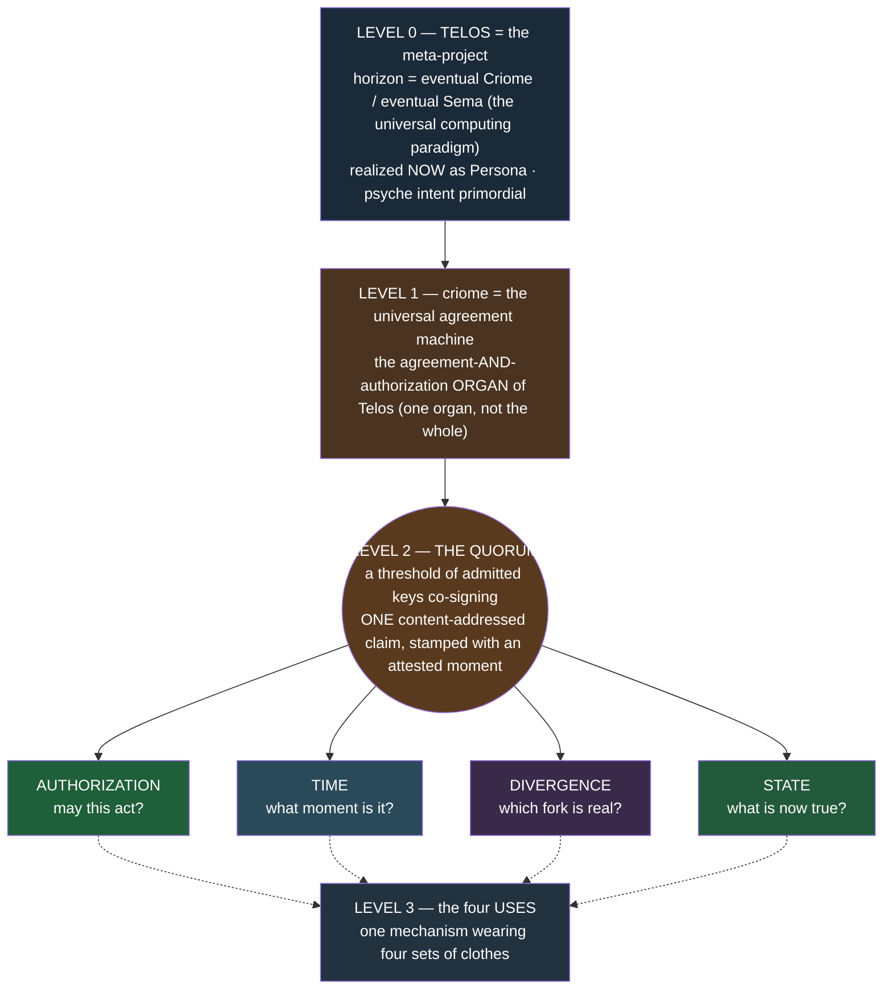

The thing to hold onto: **criome ≠ Telos.** When the design says "the agreement
machine," it means an organ of a larger body. The other organs — spirit (intent +
vcs), router (transport), mirror (object bytes), the agent layer (mind / persona /
harness) — are siblings, not subordinates. criome is the one that turns "someone
proposed this" into "a quorum agrees this."

## 2. The vision in context

### criome is the universal agreement machine — one primitive, four uses

The collapse is the insight from `677`: before this framing there appeared to be
four machines — an authorizer, a clock, a divergence resolver, a state
propagator. There is **one**. A quorum is the smallest complete unit of
agreement: a threshold of admitted keys, each contributing a real BLS signature
over the same content-addressed proposition, stamped with when (`ay3y`: [every
quorum-signed object carries an attested moment]).

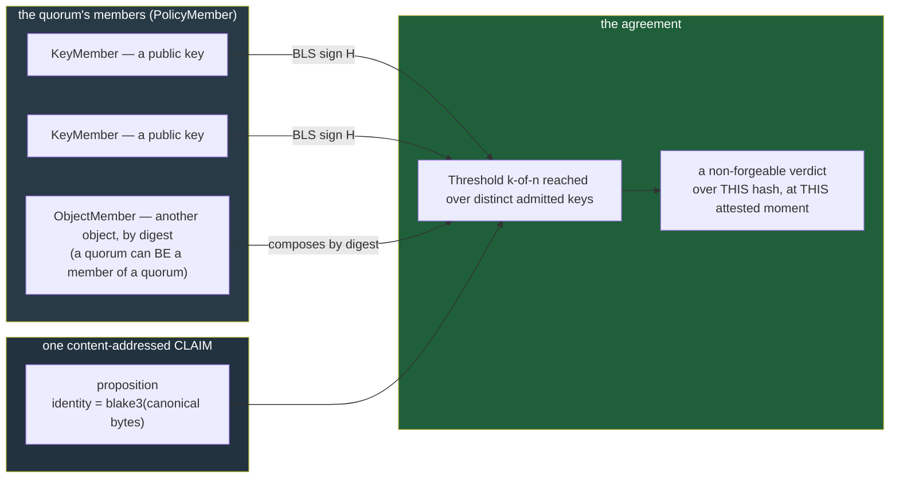

### The quorum scoped by membership — self-quorum and multi-party

`p3td`'s deepest move: **one quorum primitive serves two purposes, distinguished
only by who its members are.** Not two mechanisms — one mechanism, two membership
scopes. [Each principal runs more than one node and asks its own quorum to make
its attestations reliable and its timestamps credible … so a self-quorum across
one's own nodes is a reliability mechanism, not only multi-party trust across
different principals. One quorum primitive serves both, scoped by membership.]

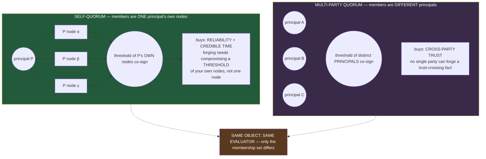

| Scope | Members | What it buys | Forgery cost |
|---|---|---|---|
| **Self-quorum** | one principal's own multiple nodes | reliability (no single point of failure) + credible timestamps | compromise a threshold of *your own* nodes |
| **Multi-party quorum** | several distinct principals | cross-party trust for trust-crossing state | compromise a threshold *across parties* |

This is why `m0p2` makes quorum the default even for one principal: [a lone node
signature has little value except narrow bootstrap or diagnostic cases, so the
practical design default is quorum authorization for meaningful objects and
trust-crossing state].

### The object-update pulse — criome pushes references, components fetch

Once a quorum agrees, the *fact* must reach the components that care. `m0p2`:
[When a content-addressed object or authorized state transition is admitted,
criome pushes an update to affected components. Criome pushes references, not
object payloads; components fetch or request the referenced rkyv object through
the routing/object-distribution layer.] The pulse carries the minimum — a digest
— and the heavy object travels the object-distribution layer on demand.

```mermaid
sequenceDiagram
  autonumber
  participant Sub as submitter (e.g. spirit)
  participant Cri as criome (the agreement machine)
  participant Sema as criome SEMA (StoredContract DAG — LANDED)
  participant Aff as affected component
  participant Rtr as router / mirror (object distribution)
  Sub->>Cri: SubmitContract / EvaluateAuthorization (a content-addressed claim)
  Cri->>Cri: quorum evaluate — threshold of BLS sigs over the hash, at the attested moment
  Cri->>Sema: admit — persist StoredContract keyed by ContractDigest
  Cri-->>Aff: PULSE — a REFERENCE (digest), not the payload
  Aff->>Rtr: fetch the referenced rkyv object by digest
  Rtr-->>Aff: the rkyv object bytes
  Note over Aff: criome MOVES NOTHING — it authenticated; router/mirror transport (wckt)
```

### criome is a predicate/validator — not a VM, not a blockchain

`676` settles the genus: criome is in the **predicate/validator family** (Bitcoin
Script, Cardano EUTXO/Plutus, ERC-4337 `validateUserOp`), **not** the
stateful-execution-VM family (EVM, Michelson, Solana BPF). A contract is a policy
*evaluated to a verdict*, never code that runs and mutates state.

| Property | criome | Why it follows |
|---|---|---|
| **Verdict, not execution** | `evaluate → Decision::{Authorized\|Rejected\|EscalateToPsyche}` | a predicate returns a value; the protocol applies the change only on yes |
| **No gas, structural halt** | closed acyclic vocabulary, no metered loop (`vhs2`) | nothing can loop, so nothing to meter — the *absence of a gas meter* is the proof |
| **No reentrancy** | reads a referenced contract's *value*, never its *code*; strict DAG | the DAO bug class is inexpressible |
| **Content-addressed immutable** | identity = `blake3(canonical bytes)`; no `UpdateContract`; revoke = new record | change is a new digest, never an in-place write |
| **Durable per-daemon SEMA — REAL on main** | `StoredContract` keyed by `ContractDigest` (`3c05122`) | the contract DAG survives restart per daemon; not a global ledger |
| **Quorum-attested time** | every quorum-signed object carries an `AttestedMoment` (`ay3y`) | time is itself a quorum object, not a block- or wall-clock |

It **leaves the blockchain genus entirely** (`676`): no global consensus, no
canonical chain, no miners — each daemon holds its own store and key registry, and
multi-party trust is cross-criome quorum chained to a cluster-root.

### Where the organ sits in the stack

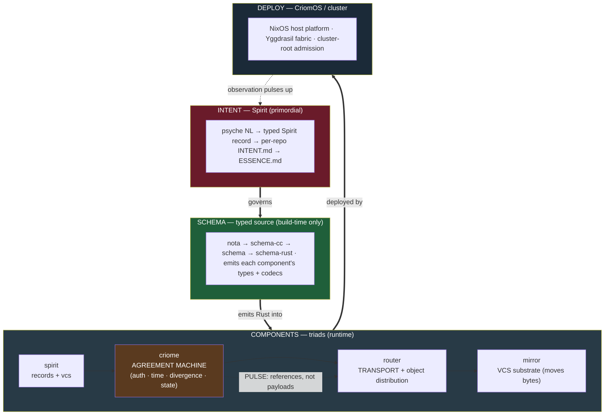

The end-to-end chain is `spirit → criome → router → mirror` (`675` Zoom 4, `673`).
The agreement machine is the *third* step — the gate that turns a proposal into an
agreed fact, after which the reference propagates and the bytes follow.

## 3. The four open forks

These are the live decisions. Two were named in `677` (A, B); two more surface
from the grounding (C, D). Each is genuinely undecided — the design should not
pretend otherwise.

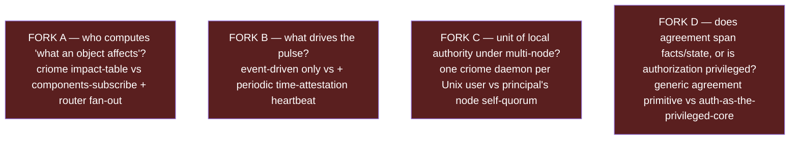

### Fork A — who computes "what an object affects"

`m0p2` says criome [pushes an update to **affected components**]. That implies
someone knows the *affected set*. Either criome holds an impact/routing table and
computes the audience (richer criome, more state), or components register interest
and the router fans out by subscription match (criome stays minimal, with the
grain of `wckt`'s auth-only line).

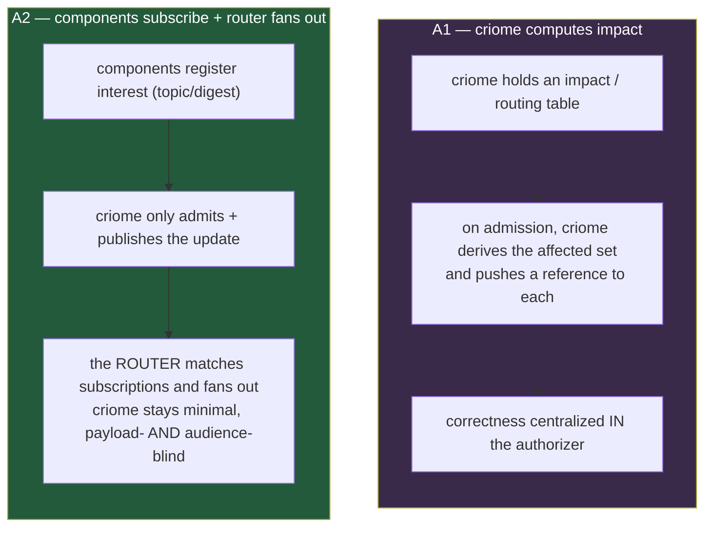

**What exists vs net-new.** Both halves exist only in *fragments*; none is wired
into the live pulse path.

| Piece | Status | Evidence |
|---|---|---|
| SUBSCRIBE verbs (criome side) | exists in schema | `signal-criome/schema/lib.schema:24-26` — `ObserveAuthorizedObjects … opens AuthorizedObjectUpdateStream`, `SubscribeIdentityUpdates … opens IdentityUpdateStream` |
| SubscriptionRegistry | exists; **local publish only** | `criome/src/actors/subscription.rs` tracks tokens and now `publish_authorized_object_update` records updates into the registry on a successful eval (`0cf326c`) — but the identity-push docstring still says "not implemented … the push side lands [later]," and the new ARCHITECTURE note says "socket-level `SubscriptionEvent` fanout is a transport follow-up" |
| SUBSCRIBE pattern (spirit precedent) | exists | spirit `SubscribeIntent(Query)`, `Tap`/`Untap` (`spirit/src/subscription.rs`, `spirit/tests/observer_tap.rs`) |
| Router FAN-OUT | named, **not built** | `router/ARCHITECTURE.md:126-128` (five-state lifecycle) and `:139` list it under *future* subscriptions to pushed router-relevant events; router today is point-to-point (`HarnessDelivery`, `RouterPeerDelivery`) |
| **The impact computation** | **net-new — nothing derives it** | `AuthorizedObjectUpdate` (`signal-criome/schema/lib.schema:250-255`) carries `object · contract · decision · stamp` — **no audience field**; the only audience hint is `AuthorizedObjectUpdateToken.subscriber Identity`, i.e. matching is a subscriber-registry job, not an impact-table |

**Recommendation — A2 (subscribe + router fan-out), leaning with the grain.** The
registry shells, the SUBSCRIBE verbs, and the spirit precedent all point at
subscription-match, and the *update carries no audience* — the type system already
nudges toward "match against registered subscribers" rather than "criome computes
who cares." Keeping criome audience-blind preserves `wckt` (auth-only, transports
nothing, now also *routes-nothing*) and lets the router own delivery the way it
already owns point-to-point. **Tradeoff:** correctness of "everyone who should
hear, hears" becomes a *distributed* property (subscription liveness + router
match) rather than a single table criome can audit; A1 would centralize that
audit at the cost of growing criome into a routing component it was scoped not to
be. The recommended seam: criome publishes `AuthorizedObjectUpdate` (done
locally), the router carries the fan-out by subscription match (net-new), and the
matching key is `AuthorizedObjectUpdateToken.subscriber` against the object's
contract/kind.

### Fork B — pulse: event-driven only, or also a periodic heartbeat

Today the pulse is **purely event-driven**, exactly per `m0p2`: it fires "when a
content-addressed object or authorized state transition is admitted." In a quiet
period with no admissions, "now" goes stale — the newest provable lower bound
recedes (`ay3y`: only the past is provable). The question is whether a periodic
self-quorum *time-attestation heartbeat* re-attests the window even when nothing
is being authorized.

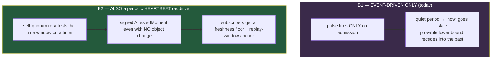

**What exists vs net-new.**

| Piece | Status | Evidence |
|---|---|---|
| Event-driven pulse | **is the whole model today** | `criome/ARCHITECTURE.md:105-111`; the proven offline chain is push-on-admission (`673`) |
| Any periodic/heartbeat surface | **does not exist anywhere** | grep `heartbeat\|periodic\|interval\|tick\|cron` hits only time-*attestation* prose (`ARCHITECTURE.md:595` master-key validity interval) — never time-*emission*; nothing fires on a timer |
| Time as a quorum object | exists | `TimeSignature → AttestedMoment` (`signal-criome/schema/lib.schema:172-179`) — a *signed past moment* stamped onto evidence, never a recurring tick |
| A recurring liveness pulse | **net-new** | a heartbeat would emit a signed `AttestedMoment` on a timer, giving a freshness floor and replay anchor — entirely additive; it is *itself a pulse that must fan out* (so it depends on Fork A) |

**Recommendation — B2, but as an opt-in policy, not an unconditional tick.** The
self-quorum from §2 is the natural owner: your own nodes keeping your own clock
credible is exactly what a heartbeat is, and freshness/replay reasoning visibly
degrades without it in quiet periods. **Tradeoff:** an unconditional heartbeat
manufactures pulse traffic and quorum-signing load proportional to *time*, not to
*work* — wrong for an organ scoped to be minimal. So make the heartbeat a
*contract-declared freshness floor* (a subscriber that needs `now` no staler than
Δ causes the self-quorum to re-attest at interval Δ), not a global daemon tick.
This keeps B1's "no work, no pulse" virtue for everything that does not need a
freshness floor, and only pays the heartbeat cost where a contract demands it.
Note the dependency: a heartbeat is a pulse, so its delivery rides whatever Fork A
decides.

### Fork C — unit of local authority under multi-node

The deployed model is **one criome daemon per Unix user**, today. criome INTENT:
[There are many criome daemons, one per Unix user; new trust boundaries spawn new
daemons]. The per-user socket (`…/criome/<short-hash-of-pubkey>.sock`, mode 0600)
is the authority basis: [only that user can write to the daemon's meta socket;
single-ownership is what gives the daemon authority to sign with its master key]
(`ARCHITECTURE.md:131,151,241,405`). But §2's self-quorum wants *multiple nodes
per principal*. So: is the unit of local authority one daemon, or a principal's
self-quorum across node replicas?

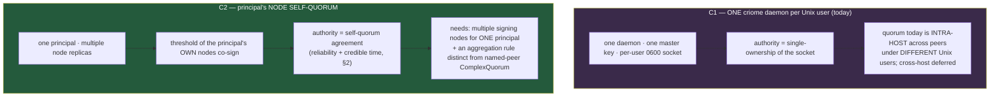

**What exists vs net-new.**

| Piece | Status | Evidence |
|---|---|---|
| One daemon per Unix user | deployed | criome INTENT + `ARCHITECTURE.md:131,151,241,405` |
| Authority = single socket ownership | deployed | `ARCHITECTURE.md:241`; one master key per daemon (`master_key.rs`); `CriomeRoot` reconciles key ↔ `Host("criome")` identity |
| Intra-host quorum | exists (across users) | `ARCHITECTURE.md:416,426` — peers under different Unix users; cross-host quorum deferred |
| Per-principal node self-quorum | **net-new — no shape today** | would need multiple signing nodes for *one* principal plus an aggregation rule distinct from the existing named-peer `ComplexQuorum` |

**Recommendation — keep C1 as the deployed unit; introduce C2 as a *logical*
self-quorum object, not a re-architecture.** The per-user single-ownership socket
is what *gives* the daemon authority to sign — that is load-bearing and should not
be dissolved into a replica set. But §2's self-quorum is too valuable to defer.
The clean reconciliation: a principal's self-quorum is a *quorum object whose
`PolicyMember`s are that principal's own per-node keys* — each node still a normal
one-per-user daemon with its own 0600 socket, but the principal's *authoritative*
attestations are the ones a threshold of those node-daemons co-sign. This reuses
the existing quorum machinery (no new aggregation primitive beyond a self-scoped
`Threshold`) and keeps the per-user authority basis intact. **Tradeoff:** it
requires a principal to *run* multiple node-daemons and a way to enumerate "my own
nodes" as a membership set — operational weight that a single-node principal need
not pay, and that interacts with cross-host quorum (still deferred). Recommend
shaping C2 now as the self-quorum membership type, deferring the multi-host
*deployment* until cross-host quorum lands.

### Fork D — does agreement span facts/state, or is authorization privileged

`m0p2` phrases the direction as "a universal agreement machine for
**authorization**." Does the agreement machine agree on *facts and state
generally*, with authorization as one application — or is authorization the
privileged core and the rest layered on top? The grounding answers this almost
decisively: criome **already agrees on four-plus claim kinds beyond
authorization**, all typed, all the same stamped-quorum-over-a-proposition
primitive.

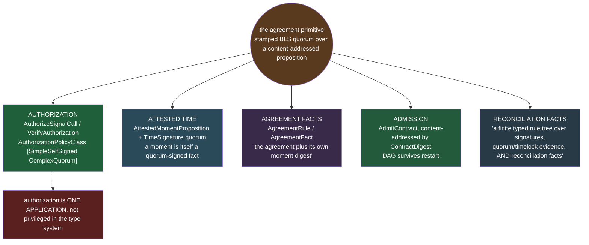

**What exists vs net-new.** The generic primitive *already exists*; what is open
is only the *framing* — whether to keep calling it "for authorization."

| Claim kind | Status | Evidence |
|---|---|---|
| Authorization | landed | `AuthorizeSignalCall`/`VerifyAuthorization`; `AuthorizationPolicyClass [SimpleSelfSigned ComplexQuorum]` (`lib.schema:77`) |
| Attested time | landed | `AttestedMomentProposition` + `TimeSignature` quorum (`lib.schema:166-179`) — a moment is a quorum-signed fact |
| Agreement facts | landed | `AgreementRule`/`AgreementFact` (`lib.schema:148-158`); signing "the agreement plus its own moment digest" (`criome/ARCHITECTURE.md:612`) |
| Admission | landed | `AdmitContract` content-addressed by `ContractDigest`; DAG survives restart (`ARCHITECTURE.md:604`) |
| Reconciliation facts | designed | criome INTENT: contracts are "a finite typed rule tree over signatures, quorum/timelock evidence, **and reconciliation facts**" |

**Recommendation — D-generic: the agreement machine agrees on facts/state
generally; authorization is the first and most-used application, not a privileged
core.** The type system has already made this choice — the stamped-quorum-over-a-
proposition primitive is the *same* for time, agreement, admission, and
reconciliation; authorization is not special-cased in it. Adopting the generic
framing is mostly a *naming and intent* correction (and `p3td` already moved this
way, calling criome "the agreement-and-authorization organ," not "the authorizer").
**Tradeoff:** the generic framing risks scope-creep — "agrees on anything" could
invite criome to grow into a general fact store, violating its auth-only scope
(`wckt`) and its limited-language discipline (`vhs2`). The guard is to keep the
*primitive* generic but the *vocabulary* closed: criome agrees on the four-plus
typed claim kinds it already has, and a new claim kind is a deliberate schema
addition, never an open-ended "any fact." Recommend capturing this as a Spirit
clarification of `m0p2`'s "for authorization" wording — see §4.

## 4. Where we are — the cursor

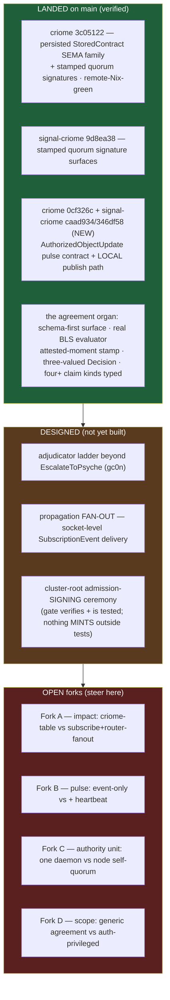

**Landed (verified on `origin/main`).** The persisted contract DAG is real:
`StoredContract` keyed by `ContractDigest` (`3c05122`), with the in-memory store
now only the pure evaluator's snapshot rebuilt from SEMA on load. Newer than the
`677` cursor: `criome 0cf326c` ("publish authorized object update references") +
`signal-criome caad934`/`346df58` landed the `AuthorizedObjectUpdate` pulse
contract and its *local* publish path — criome now records the update into its
`SubscriptionRegistry` on a successful evaluation. The earlier arc landed the
schema-first policy surface, the real-BLS evaluator, and the attested-moment stamp.

**Designed but not built.** The adjudicator ladder above `EscalateToPsyche`; the
fan-out *delivery* — the ARCHITECTURE note for `0cf326c` is explicit that
"socket-level `SubscriptionEvent` fanout is a transport follow-up"; the
cluster-root admission-signing ceremony (the gate verifies and is tested, but
nothing mints an admission envelope outside tests).

### Which fork each next slice depends on

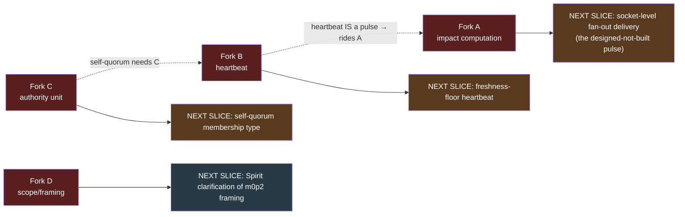

- **The single nearest unblock** — socket-level fan-out delivery — depends on
  **Fork A**: you cannot build "deliver to subscribers" until you decide whether
  criome computes the audience or the router matches it. The landed local publish
  path (`0cf326c`) is the seam where A1 vs A2 attaches.
- **Fork B (heartbeat) rides Fork A** — a heartbeat is itself a pulse that must
  fan out, so it cannot be built ahead of A.
- **Fork B also depends on Fork C** — the heartbeat's natural owner is the
  self-quorum, which Fork C shapes.
- **Fork D is the cheapest to settle** — it is mostly an intent/naming
  clarification (the generic primitive already exists in the schema). Recommend a
  Spirit `Clarify` of `m0p2`'s "for authorization" to "authorization is the first
  application of a generic stamped-quorum agreement primitive that already spans
  time, agreement, admission, and reconciliation facts" — but only on explicit
  psyche confirmation, since it edits a psyche record.

## Sources

`reports/designer/677-telos-the-agreement-machine.md`,
`reports/designer/675-system-with-perspective/6-system-map.md`,
`reports/designer/676-contract-machinery-comparison/5-comparison.md`,
`reports/designer/673-offline-first-e2e-proven-capstone.md`; Spirit records
`pviw`, `p3td` (superseded the retired `obuf`), `m0p2`, `ay3y`, `gc0n`, `z9d6`,
`wckt`, `vhs2`; source read verbatim — `signal-criome/schema/lib.schema`,
`criome/src/actors/subscription.rs`, `criome/ARCHITECTURE.md`,
`criome/INTENT.md`, `router/ARCHITECTURE.md`, `spirit/src/subscription.rs`,
`spirit/tests/observer_tap.rs`; landed commits verified on `origin/main` —
`criome 3c05122`/`0cf326c`, `signal-criome 9d8ea38`/`caad934`/`346df58`.
