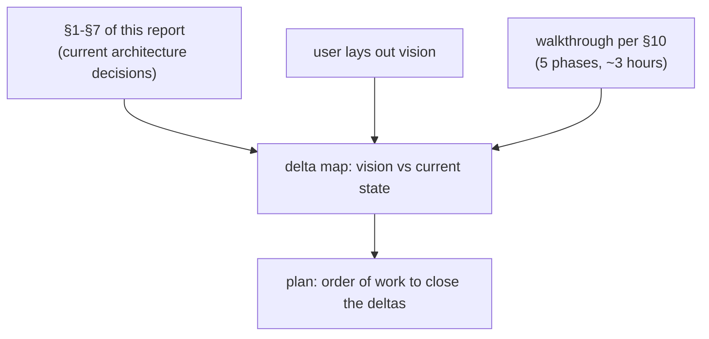

# 68 · Architecture amalgamation + implementation review plan

Status: comprehensive synthesis of all architecture decisions
taken in the workspace to date, status of each, open questions
that need user input, drift register from recent audits, and
the plan for our clean-context implementation review.

This report is **the index**. Read it once to load the state of
the architecture into memory. After this lands, the older
decision-record reports (50, 51, 53, 55, 56, 60) get retired —
their substance is captured here or in the surviving primary
sources (designer/4, 12, 19, 26, 31, 40, 45, 46 + 63, 64, 66
and operator/67).

Author: Claude (designer)
Builds on: every prior designer + operator + system-specialist
report through 2026-05-09.

---

## 0 · TL;DR

```mermaid
flowchart TB
    subgraph layers["Six architectural layers"]
        ws["§1 Workspace structure<br/>(roles, locks, beads, skills, micro-components)"]
        not["§2 Notation<br/>(nota + nexus + reserved heads + 12 verbs)"]
        wire["§3 Wire<br/>(signal-core kernel + signal-&lt;consumer&gt; layers)"]
        state["§4 State<br/>(sema kernel + &lt;consumer&gt;-sema layers)"]
        runtime["§5 Persona runtime<br/>(message/router/system/harness/wezterm/sema/orchestrate)"]
        sys["§6 System layer<br/>(CriomOS + chroma + chronos + lojix-cli + horizon-rs + goldragon)"]
        disc["§7 Cross-cutting discipline<br/>(beauty, no-pull, types-not-strings, ractor, jj)"]
    end

    layers -.- "drift register" -.- gaps["§9 17 beads open<br/>load-bearing: persona-sema typed Tables (P1)<br/>+ message off polling (P1)"]

    layers -.- "review plan" -.- review["§10 5-phase walkthrough<br/>kernels first, runtime second, system third"]

    layers -.- "open questions" -.- q["§8 Decisions awaiting user<br/>(channel granularity, harness text language, ZST exception)"]
```

| Decision-status counts | Count |
|---|---:|
| ✅ Shipped (landed in code, working) | 31 |
| 📋 Designed (report exists, no implementation) | 5 |
| 🔄 In-flight (partial implementation) | 7 |
| ⚠️ Drifted (impl diverged from design) | 8 |
| ❓ Open (unresolved question for user) | 7 |
| ⛔ Deprecated (superseded) | 11 |

| Surface | Reports kept | Reports retired this commit |
|---|---:|---:|
| Designer | 11 (4, 12, 19, 26, 31, 40, 45, 46, 63, 64, 66, 68) | 6 (50, 51, 53, 55, 56, 60) |
| Operator | 4 (52, 54, 61, 67) | 1 (59) |
| System-specialist | 6 (1, 2, 28, 49, 65) | 3 (52, 58, 65 — wait, 65 stays) |
| Poet | 3 (62, 64, 65) | 0 |

(Final cleanup tabulated in §12.)

---

## 1 · Workspace structure

### 1.1 · Four coordination roles

| Decision | Status | Source |
|---|---|---|
| Four roles (operator / designer / system-specialist / poet) | ✅ shipped | `protocols/orchestration.md`, `skills/{operator,designer,system-specialist,poet}.md` |
| Operator implements; designer designs; system-specialist deploys; poet writes | ✅ shipped | per-role skill files |
| Critical-analysis as a fifth role | ❓ open — `primary-9h2` | bead open |
| Each role writes only its own `reports/<role>/` | ✅ shipped | `protocols/orchestration.md` §"Reports" |
| Lock files: plain text, one scope per line, optionally `# reason` | ✅ shipped | `protocols/orchestration.md` §"Lock-file format" |
| **Brackets `[primary-f99]` for task-locks** (just landed) | ✅ shipped | `tools/orchestrate` (commit `b3491e74`); `skills/beads.md` §"Taking on a bead" |

**Still relevant?** Yes. Four-role + path-or-task locks is
working. Critical-analysis role design (primary-9h2) is the only
open evolution.

### 1.2 · BEADS as transitional tracking substrate

| Decision | Status | Source |
|---|---|---|
| BEADS is for short-tracked items; not a lock | ✅ shipped | `AGENTS.md`, `skills/beads.md` |
| Destination is Persona's typed messaging | 📋 designed | `AGENTS.md` §"BEADS is transitional" + designer/4 |
| Don't bridge BEADS to Persona; don't deepen BEADS investment | ✅ shipped (rule), 📋 (replacement) | same |
| Bead discipline rules (when to file, when to close, anti-patterns) | ✅ shipped | `skills/beads.md` (just landed) |

**Still relevant?** Yes. The BEADS-as-transitional framing
holds; replacement (Persona messaging) is years off.

### 1.3 · Reports as durable decision records

| Decision | Status | Source |
|---|---|---|
| Reports go in `reports/<role>/`; soft cap 12 per subdir | ✅ shipped | `skills/reporting.md` §"Hygiene" |
| Workspace-wide numbering (no per-role) | ✅ shipped | `skills/reporting.md` §"Filename convention" |
| No leading zeros, no date prefix | ✅ shipped | same |
| Numbers retire on deletion (don't reuse) | ✅ shipped (rule) | same |
| Supersession deletes the older report in the same commit | ✅ shipped (rule) | `skills/reporting.md` §"Supersession" |
| Inline-summary on every cross-reference | ✅ shipped (rule) | `skills/reporting.md` §"Inline-summary" |
| Reports as visuals (mermaid + tables) | ✅ shipped (rule) | `lore/AGENTS.md` |

**Still relevant?** Yes. The retire-on-supersession rule is
what this report is doing right now.

### 1.4 · Workspace-level skills

| Decision | Status | Source |
|---|---|---|
| Skills at `~/primary/skills/<name>.md` are workspace-cross-cutting | ✅ shipped | `skills/skill-editor.md` |
| Per-repo skills at `<repo>/skills.md` are project-specific | ✅ shipped | same |
| One capability per skill (just-landed framing, replacing 150-line cap) | ✅ shipped | `skills/skill-editor.md` (after audit 55 fix) |
| 21 skills cover roles + disciplines + cross-cutting | ✅ shipped | `~/primary/skills/` |
| New skill: `skills/beads.md` (BEADS discipline) | ✅ shipped | landed this session |

**Still relevant?** Yes.

### 1.5 · Micro-components

| Decision | Status | Source |
|---|---|---|
| One capability, one crate, one repo | ✅ shipped (rule) | `skills/micro-components.md` |
| Repos are independently buildable | ✅ shipped (rule) | same |
| Cross-repo Cargo deps via `git = "..."`, never `path = "../..."` | ✅ shipped | `skills/micro-components.md` (just landed §"Cargo.toml dependencies") |
| `path = "src/lib.rs"` etc. inside same Cargo.toml is fine | ✅ shipped | same |
| Intra-repo `path = "lib"` for cargo-workspace members is fine | ✅ shipped | same (workspace pattern in horizon-rs) |
| ARCHITECTURE.md per repo | ✅ shipped (rule) | `skills/architecture-editor.md` |

**Drift:** persona-message had `path = "../nota-codec"` etc. — fixed in `primary-2pj`-adjacent operator work. Persona-system also had one. Audit 57 caught both; operator landed fixes.

**Still relevant?** Yes.

### 1.6 · ~/git → /git/github.com layout (just done)

| Decision | Status | Source |
|---|---|---|
| Single canonical layout: `/git/github.com/<owner>/<repo>` (ghq) | ✅ shipped | this session — closed `primary-77l` |
| `~/git` retired (87 entries → 0; 4 archive entries went to `~/git-archive`) | ✅ shipped | this session |
| `/git/github.com/{LiGoldragon,Criome}/` canonical case (matches GitHub's API) | ✅ shipped | this session |

**Still relevant?** Yes; cleanup is done. Drift will reappear if agents `git clone` into ~/git/ — discipline rule lives in the closing note of `primary-77l`.

---

## 2 · Notation

### 2.1 · Nota — the canonical positional text format

| Decision | Status | Source |
|---|---|---|
| Positional records, no field names in text | ✅ shipped | `nota/README.md`, `skills/language-design.md` §14 |
| First-character case dispatch (PascalCase=type, camelCase=instance) | ✅ shipped | `skills/language-design.md` §4 |
| No keywords beyond `true`, `false`, `None` | ✅ shipped | `skills/language-design.md` §2 |
| Whitespace is token separator only | ✅ shipped | `skills/language-design.md` §7 |
| All fields explicit (no implicit-None for missing trailing fields) | ✅ shipped | `nota-codec/src/traits.rs` `Option<T>` impl |
| One text codec workspace-wide (`nota-codec`) | ✅ shipped | `skills/rust-discipline.md` §"NOTA" |

**Still relevant?** Yes. Nota is mature.

### 2.2 · Reserved record heads + delimiters

| Decision | Status | Source |
|---|---|---|
| `(Bind)` and `(Wildcard)` as reserved record heads | ✅ shipped | `skills/contract-repo.md` §"It owns" + `signal_core::PatternField<T>` |
| `(Tuple a b)` and `(Entry k v)` reserved by codec | ✅ shipped | `nota-codec/src/traits.rs` |
| Curly brackets `{}` permanently dropped | ✅ shipped | designer/31 (decision); `nota-codec/src/lexer.rs` |
| `@` sigil permanently dropped | ✅ shipped | designer/45+46; `nota-codec/src/lexer.rs` |
| `_` is a normal bare identifier (not wildcard) | ✅ shipped | designer/46; codec dispatches on record-head ident |
| Delimiters earn their place rule | ✅ shipped | `skills/language-design.md` §18 |

**Still relevant?** Yes. The grammar is locked at 12 token variants; further additions need a defended reason (per `skills/language-design.md` §18).

**Open question (operator/67 §12 #1):** Are `(Bind)` and `(Wildcard)` ZST records OK, or should they be promoted to data-bearing types? See §8 below.

### 2.3 · Twelve verbs (zodiacal)

| Decision | Status | Source |
|---|---|---|
| 12 verbs: Assert, Subscribe, Constrain, Mutate, Match, Infer, Retract, Aggregate, Project, Atomic, Validate, Recurse | ✅ shipped | designer/26; `signal_core::SemaVerb` enum |
| Mapped onto Young's geometry of meaning (zodiacal order) | ✅ shipped | designer/26 |
| Persona's operations all decompose into the 12 verbs | ✅ shipped (design); ⚠️ partial impl | designer/40 — `signal-persona` request enum maps to most, not all |
| `signal_core::PatternField<T>` is the universal pattern type | ✅ shipped | designer/46; signal-persona uses 24 sites |

**Still relevant?** Yes. The 12-verb closure is foundational.

### 2.4 · Nexus = nota (no separate parser)

| Decision | Status | Source |
|---|---|---|
| Nexus needs no grammar of its own; parse with nota's lexer/parser | ✅ shipped | designer/45+46 |
| `nexus-codec` extraction is moot (designer/44 retired) | ✅ shipped | per cleanup |
| Reserved heads + PatternField<T> are the only "nexus" concepts | ✅ shipped | designer/46 |

**Still relevant?** Yes. The nota+nexus collapse is a load-bearing simplification.

### 2.5 · Nota derives

| Decision | Status | Source |
|---|---|---|
| `NotaRecord`, `NotaEnum`, `NotaSum`, `NotaTransparent`, `NotaTryTransparent` | ✅ shipped | `nota-derive/src/` |
| `NexusVerb` renamed to `NotaSum` | ✅ shipped | designer/46 §6 |
| `NexusPattern` derive deleted (codec dispatches on head ident) | ✅ shipped | designer/46 §6 |
| `NotaTryTransparent` for validating newtypes | ✅ shipped | session research with user |

**Still relevant?** Yes.

---

## 3 · Wire (signal-family)

### 3.1 · Signaling — the verb

| Decision | Status | Source |
|---|---|---|
| "To signal" = send length-prefixed rkyv archive between Rust components | ✅ shipped | `skills/rust-discipline.md` §"rkyv on the wire (signaling)" |
| One Frame per channel | ✅ shipped (rule) | same |
| Length-prefixed framing (4-byte big-endian) | ✅ shipped | same |
| Same rkyv feature set both ends (canonical: std + bytecheck + little_endian + pointer_width_32 + unaligned) | ✅ shipped | `lore/rust/rkyv.md` |
| `rkyv::access` on the read path (zero-copy + bytecheck) | ✅ shipped | same |

### 3.2 · `signal-core` (kernel)

| Decision | Status | Source |
|---|---|---|
| signal-core extracted from signal when signal-persona arrived | ✅ shipped | per kernel-extraction trigger in `skills/contract-repo.md` |
| Owns: Frame, SemaVerb, PatternField<T>, Slot, Revision, ProtocolVersion, AuthProof | ✅ shipped | `signal-core/src/` |
| Universal verb spine | ✅ shipped | `signal_core::SemaVerb` |

### 3.3 · `signal-<consumer>` (layered)

| Decision | Status | Source |
|---|---|---|
| Each ecosystem gets its own layered crate atop signal-core | ✅ shipped (pattern) | designer/19 + `skills/contract-repo.md` |
| `signal-persona` layered atop signal-core | ✅ shipped | `signal-persona/src/` (916 LoC, 12 modules) |
| `signal-forge`, `signal-arca` for criome's effects | ✅ shipped | `signal-forge/`, `signal-arca/` |
| Closed enums; no `Unknown` variants | ✅ shipped (rule) | `skills/contract-repo.md` |
| Examples-first round-trip discipline | ✅ shipped (rule) | same |

**Drift in signal-persona** (carried from audit 60):
- ⚠️ `PersonaRequest`/`PersonaReply` violate no-crate-prefix rule (`primary-tlu`)
- ⚠️ FocusObservation/InputBufferObservation duplicated in persona-system (`primary-3fa`)

### 3.4 · Channel repo granularity

❓ **Open question** (operator/67 §12 #2): does each channel get its own physical `signal-persona-*` repo, or does `signal-persona` own per-channel modules until a second concrete consumer forces a split?

Tracked in `primary-kxb`.

### 3.5 · Cross-machine signaling

📋 **Designed only** (`primary-uea`): handshake + transport (TCP+TLS / QUIC / mTLS) + back-pressure + cross-machine version-skew + AuthProof variants. No code.

---

## 4 · State (sema-family)

### 4.1 · Sema as workspace database kernel (just decided + landed)

| Decision | Status | Source |
|---|---|---|
| Sema is the workspace database kernel (was: criome's store) | ✅ shipped | designer/63 (decision); commit `01a21939` |
| `sema::Sema` handle + `Schema { version }` + `Table<K, V: Archive>` + `read`/`write` closures + version-skew guard | ✅ shipped | designer/64 + `sema/src/lib.rs` |
| Lazy table creation (per redb's typed-tables model) | ✅ shipped | audit 66 fix; commit `01a21939` |
| Version-skew guard refuses legacy files (no silent retro-stamp) | ✅ shipped | audit 66 fix |
| `SchemaVersion(u32)` field private (no-pub-newtype rule) | ✅ shipped | audit 66 fix |
| Legacy slot-store kept as utility (`Slot`, `store`, `iter`) | ✅ shipped | `sema/src/lib.rs` |

**Drift carried from audit 66 (open beads):**
- ⚠️ `reader_count`/`DEFAULT_READER_COUNT` still in sema as deprecated (`primary-4zr`)
- ⚠️ Internal `META`/`RECORDS` table names not namespaced (`primary-4zr`)
- ⚠️ open_inner mixes filesystem + slot policy + schema policy (`primary-4zr`)
- ⚠️ Module split (lib.rs > 300 LoC threshold) (`primary-4zr`)
- ⚠️ `Table::iter` API gap (`primary-nyc`)

### 4.2 · `<consumer>-sema` layered crates

| Decision | Status | Source |
|---|---|---|
| Naming convention `<consumer>-sema` mirrors `signal-<consumer>` | ✅ shipped | designer/63 |
| `persona-store` renamed `persona-sema` | ✅ shipped | this session (gh repo rename + local + symlink + Cargo.toml) |
| `persona-sema` consumes sema kernel via `git = "..."` | ✅ shipped | `persona-sema/Cargo.toml` |
| **persona-sema typed Tables** | ⚠️ MISSING | `primary-0p5` P1 — load-bearing |
| Future: `forge-sema`, `chronos-sema` | 📋 designed | designer/64 §0 |

**Critical gap:** persona-sema today is just an open-handle.
The typed `Table<&str, signal_persona::Message>` etc. constants
that ARE the typed-storage layer don't exist yet. Until they
land, persona-sema doesn't earn its name.

### 4.3 · Two-stores (sema + arca)

| Decision | Status | Source |
|---|---|---|
| Sema for typed records (slot-as-handle, content-hash-as-identity) | ✅ shipped | criome ARCH §5 |
| Arca for content-addressed artifact bytes | ✅ shipped | `arca` repo |
| Sema records reference arca by hash | ✅ shipped | per criome ARCH |

**Still relevant?** Yes. Two-stores model is criome-specific
(sema-family inherits the typed-records side).

### 4.4 · `persona-orchestrate` design (just designed)

| Decision | Status | Source |
|---|---|---|
| Typed successor to bash `tools/orchestrate` | 📋 designed | designer/64 §4 |
| Uses sema (CLAIMS, TASKS, CLAIM_LOG, TASK_LOG tables) | 📋 designed | same |
| Atomic claim-and-overlap-check inside one txn | 📋 designed | same |
| Iterate `claims` table (not hard-coded role list) | 📋 designed | designer/64 §4.4 (audit 66 fix) |
| Implementation | 🔄 awaiting `Table::iter` (`primary-nyc`) + persona-sema typed Tables (`primary-0p5`) |

---

## 5 · Persona runtime

Designer/4 is the apex design. The current state is a partial
implementation, with several drifts from the design.

### 5.1 · Component map

| Crate | Role | LoC | Status |
|---|---|---:|---|
| `persona` | Meta repo, daemon composition | ~150 | 🔄 in-flight |
| `signal-persona` | Wire contract | 916 | ✅ shipped (drift in naming) |
| `persona-message` | Typed message records + CLI | 1572 | 🔄 in-flight (polling tail; off-design) |
| `persona-router` | Delivery routing actor + queue | 457 | 🔄 in-flight (not ractor; not contract-typed) |
| `persona-sema` | Typed storage (was persona-store) | ~120 | 🔄 in-flight (no typed Tables yet) |
| `persona-system` | OS facts (Niri focus source) | 740 | ✅ shipped (operator/54 design) |
| `persona-harness` | Harness actor model | 88 | 📋 skeleton |
| `persona-wezterm` | PTY + terminal capture | 1053 | ✅ shipped (transport works) |
| `persona-orchestrate` | Workspace coordination | ~75 | 🔄 stub (designer/64 §4 design) |

Total: ~5400 LoC.

### 5.2 · Three planes

| Plane | Status | Source |
|---|---|---|
| Control plane (HarnessDeclaration, HarnessStartRequest, HarnessStopRequest, HarnessInterruptRequest) | 📋 designed | designer/4 §5.4 |
| Message plane (MessageProposal, AuthorizationDecision, DeliveryQueueing, DeliveryObserved) | 🔄 partial — Message yes; AuthorizationDecision missing | designer/4 §5.4 |
| Stream plane (HarnessObservation, InteractionResolution) | 🔄 FocusObservation only | designer/4 §5.4 |

### 5.3 · Reducer + adapter

| Decision | Status | Source |
|---|---|---|
| Reducer accepts Commands → Transitions + Effects | 📋 designed | designer/4 §5.5 |
| Adapter contract (the boundary between persona and the harness) | 📋 designed | designer/4 §5.6 |
| Push-only subscriptions (no polling) | 📋 designed | designer/4 §5.9 + designer/12 |
| Authorization gate before delivery | 📋 designed | designer/4 §5.8 |

### 5.4 · Safety property (the live concern)

| Decision | Status | Source |
|---|---|---|
| Never inject into a focused human prompt | 📋 designed | operator/59 |
| FocusObservation push from Niri | ✅ shipped | persona-system |
| InputBufferObservation push from harness | 📋 designed (operator/67) — not implemented | operator/59, /67 |
| Delivery state machine | 🔄 partial | persona-router/src/router.rs (struct, not actor) |

**Drift register** (carried from operator/67 + audit 60):
- ⚠️ Two FocusObservation types (`primary-3fa`)
- ⚠️ persona-router invented `PromptObservation` instead of `InputBufferObservation` (`primary-3fa`)
- ⚠️ persona-message has 200ms polling tail (`primary-2w6`)
- ⚠️ persona-store stub didn't ship redb (now persona-sema; `primary-0p5`)
- ⚠️ RouterActor is plain struct, not ractor (`primary-186`)
- ⚠️ endpoint.kind: String dispatched via `match as_str()` (`primary-0cd`)
- ⚠️ Persona* crate-prefix violations across persona-* (`primary-tlu`)

### 5.5 · Open questions for the runtime

❓ **Channel repo granularity** (`primary-kxb` #2)
❓ **Harness boundary text language** — Nexus / NOTA / projection (`primary-kxb` #3)
❓ **Terminal adapter protocol** — internal PTY vs Signal at boundary (`primary-kxb` #4)

### 5.6 · Operator/67's framing — Signal+actor everywhere

Operator's recent audit (`reports/operator/67-signal-actor-messaging-gap-audit.md`)
restates the destination:
- Every component-to-component message is typed.
- Components communicate through Signal (length-prefixed rkyv).
- Each communication channel has a contract repo.
- Components use the actor model.
- Behavior lives on data-bearing types.
- ZSTs only for actor markers.

Most of these are existing rules; operator/67 makes them
concrete for Persona's surface and identifies the layering
inversion (text/files/terminal-bytes/routing currently touch
each other directly; the design inserts typed Signal +
actors between every concern).

---

## 6 · System layer

### 6.1 · Host platform

| Component | Status | Notes |
|---|---|---|
| CriomOS (NixOS host) | ✅ shipped | per-cluster deploys via lojix-cli |
| CriomOS-home (Home Manager) | ✅ shipped | per-user profile |
| chroma daemon (theme + warmth + brightness; replaces darkman + nightshift) | ✅ shipped | system-specialist/28 design + chroma repo |
| chronos daemon (zodiacal time, sunrise/sunset, twilight events) | ✅ shipped | system-specialist/49 design + chronos repo |
| lojix-cli (cluster deploy CLI; one Nota record argv) | ✅ shipped | per `skills/system-specialist.md` |
| horizon-rs (typed projection — node config from goldragon) | ✅ shipped | per skills + repo |
| goldragon (cluster proposal — node datom) | ✅ shipped | per repo |

### 6.2 · Nix discipline

| Decision | Status | Source |
|---|---|---|
| `github:` flake inputs by default | ✅ shipped (rule) | `skills/nix-discipline.md` |
| `git+file://` forbidden in committed flakes | ✅ shipped (rule) | same |
| `--override-input path:...` for local dev iteration | ✅ shipped (rule) | same |
| `nix flake check` is the canonical pre-commit runner | ✅ shipped (rule) | same |
| Don't reference raw `/nix/store/...` paths in commits/docs | ✅ shipped (rule) | same |
| `nix run nixpkgs#<pkg>` for missing tools (not `cargo install`) | ✅ shipped (rule) | same |

### 6.3 · Cluster signing

The cluster-Nix-signing setup (system-specialist.md §"Cluster Nix
signing") is half-shipped — daemon-attached signing only on cache
nodes. The pending architectural fix is on system-specialist's
queue.

---

## 7 · Cross-cutting discipline

| Discipline | Source | Status |
|---|---|---|
| Beauty as criterion | `skills/beauty.md` + ESSENCE | ✅ shipped (rule) |
| Verb belongs to noun | `skills/abstractions.md` | ✅ shipped (rule) |
| Names are full English words | `skills/naming.md` | ✅ shipped (rule) |
| **No crate-name prefix on types** (just landed) | `skills/naming.md` + `skills/rust-discipline.md` | ✅ shipped (rule) |
| **Wrapped fields are private** | `skills/abstractions.md` + `skills/rust-discipline.md` | ✅ shipped (rule) |
| Push not pull (polling forbidden) | `skills/push-not-pull.md` | ✅ shipped (rule) — drift in persona-message |
| Errors as typed enums per crate (thiserror); never anyhow/eyre | `skills/rust-discipline.md` | ✅ shipped (rule) |
| Ractor for actors with state + message protocol | `skills/rust-discipline.md` | ✅ shipped (rule) — drift in persona-router |
| Tests in separate `tests/<name>.rs` files | `skills/rust-discipline.md` | ✅ shipped (rule) |
| jj for VCS; `jj describe @` forbidden; use `jj commit -m` | `skills/jj.md` | ✅ shipped (rule) |
| Always push immediately after commit | `skills/jj.md` | ✅ shipped (rule) |
| Infrastructure mints identity, time, sender | ESSENCE + designer/40 | ✅ shipped (rule) |
| Domain values are types, not primitives | `skills/rust-discipline.md` | ✅ shipped (rule) — drift in endpoint.kind |
| One-object-in/one-object-out at boundaries | `skills/rust-discipline.md` | ✅ shipped (rule) |
| One Rust crate per repo | `skills/rust-discipline.md` | ✅ shipped (rule) |
| Cross-crate Cargo.toml deps via `git =`, never `path = "../"` | `skills/micro-components.md` (just landed) | ✅ shipped (rule) |
| Domains come from data, never hand-maintained | `skills/language-design.md` §15 | ✅ shipped (rule) — drift in persona-sema's prior schema list |

---

## 8 · Open questions awaiting user

These questions can't be resolved by an agent alone:

| # | Question | Bead | Source |
|---|---|---|---|
| 1 | Is the critical-analysis role a fifth role, or designer's existing critic mode? | `primary-9h2` | user request 2026-05-08 |
| 2 | Channel repo granularity: single `signal-persona` or split per channel? | `primary-kxb` | operator/67 §12 #2 |
| 3 | Harness boundary text language: Nexus, NOTA, or named projection? | `primary-kxb` | operator/67 §12 #3 |
| 4 | Terminal adapter protocol: persona-wezterm internal PTY vs Signal at the boundary? | `primary-kxb` | operator/67 §12 #5 |
| 5 | ZST exception for schema marker records (Bind, Wildcard) — keep ZST or promote to data-bearing? | `primary-kxb` | operator/67 §12 #1 |
| 6 | When does signal-network design begin? (persona doesn't need cross-machine yet) | `primary-uea` | designer/uea |
| 7 | When does persona-orchestrate ship? (gates tools/orchestrate replacement) | `primary-jwi` | designer/jwi |

---

## 9 · Drift register (the actionable list)

17 beads open, ranked by load-bearing severity:

### Critical (P1)

| Bead | What |
|---|---|
| `primary-0p5` | persona-sema typed Tables (the missing layer; blocks every persona daemon's typed storage) |
| `primary-2w6` | persona-message off polling-tail onto persona-sema (blocks the safe-delivery work) |

### High (P2)

| Bead | What |
|---|---|
| `primary-2pj` | lojix-cli RouterInterfaces field ahead of horizon-rs (deploys broken) |
| `primary-3fa` | FocusObservation/InputBufferObservation contract convergence |
| `primary-186` | Persona daemons adopt ractor |
| `primary-tlu` | Persona* prefix sweep |
| `primary-0cd` | endpoint.kind closed enum |
| `primary-4zr` | sema kernel hygiene batch (split + namespace + reader_count + OpenMode) |
| `primary-nyc` | Table::iter in sema kernel |
| `primary-9h2` | Critical-analysis role design |
| `primary-kxb` | Open architectural decisions (channel granularity / harness language / ZST exception / terminal protocol) |
| `primary-obm` | Lore review + Nix migration |
| `primary-lt0` | Reinforce nix-based testing in skills |

### Deferred (P3)

| Bead | What |
|---|---|
| `primary-6nf` | Refactor orchestrator/state.rs onto sema |
| `primary-jwi` | Harden orchestrate as Persona component |
| `primary-oba` | Integration after 9h2 + obm |
| `primary-uea` | Signal-network design |

---

## 10 · Implementation review plan

The plan for our **clean-context walkthrough** of all current
implementation. Five phases, ordered kernels-first so each
phase's vocabulary is established before the layer above is
read.

### Phase 1 — Notation primitives (~30 min)

Read the foundation that every wire and storage type
ultimately uses.

| Path | Why |
|---|---|
| `repos/nota-codec/src/{traits.rs,lexer.rs,decoder.rs,encoder.rs,error.rs}` | The text codec |
| `repos/nota-derive/src/` | The derives (NotaRecord, NotaEnum, NotaSum, NotaTransparent, NotaTryTransparent) |
| `repos/signal-core/src/{semaverb.rs,pattern.rs,frame.rs}` | The 12 verbs + PatternField + Frame |
| `repos/signal-core/tests/pattern.rs` | The falsifiable spec for PatternField |

**Questions to ask:**
- Are the 12 verbs in zodiacal order in the SemaVerb enum?
- Does PatternField<T> match designer/46?
- Does the Frame match designer/4 §5.6?

### Phase 2 — Wire contract (signal-persona) (~45 min)

The typed wire vocabulary persona's components share.

| Path | Why |
|---|---|
| `repos/signal-persona/src/lib.rs` | Module map |
| `repos/signal-persona/src/request.rs` | PersonaRequest enum + Record/Mutation/Retraction/Atomic/Query/Validation |
| `repos/signal-persona/src/{message.rs,lock.rs,harness.rs,delivery.rs,authorization.rs,binding.rs,observation.rs,deadline.rs,stream.rs,transition.rs}` | The typed records |
| `repos/signal-persona/src/reply.rs` | PersonaReply enum |

**Questions to ask:**
- Do all records derive Archive? (needed for Issue G fix)
- Are the records' fields private (per the no-pub-newtype rule)?
- Does the Record enum have all 12 verbs covered? Designer/40 says yes.
- Do the type names violate the no-crate-prefix rule? (We know yes — `primary-tlu`.)

### Phase 3 — State kernel + persona-sema (~30 min)

The just-landed sema work + the missing persona-sema typed
Tables.

| Path | Why |
|---|---|
| `repos/sema/src/lib.rs` | The kernel surface (Schema, Table, txn helpers, version-skew guard, slot-store utility) |
| `repos/sema/tests/{sema.rs,kernel.rs}` | 22 tests (12 legacy + 10 kernel) |
| `repos/persona-sema/src/{lib.rs,schema.rs,store.rs,error.rs}` | The PersonaSema handle (the missing piece is the typed Tables) |
| `repos/orchestrator/src/state.rs` | The second crystallized redb usage (refactor target) |

**Questions to ask:**
- What table layouts SHOULD persona-sema declare? (Mirrors signal-persona's Record enum.)
- Should persona-sema also expose the audit log helpers (CLAIM_LOG-style)?
- Should the kernel's slot store be opt-in (Issue K)?

### Phase 4 — Persona runtime current state (~60 min)

The biggest phase. Operator/67's gap audit is the reading
companion.

| Path | Why |
|---|---|
| `reports/operator/67-signal-actor-messaging-gap-audit.md` | Read first as the lens |
| `repos/persona-message/src/{schema.rs,command.rs,delivery.rs,daemon.rs,resolver.rs,store.rs}` | The CLI + the polling store |
| `repos/persona-router/src/{router.rs,delivery.rs,message.rs}` | The router actor (not ractor) + delivery gate |
| `repos/persona-system/src/{niri.rs,target.rs,event.rs,command.rs}` | Niri focus source + commands |
| `repos/persona-wezterm/src/{pty.rs,terminal.rs}` | PTY + terminal capture |
| `repos/persona-harness/src/{harness.rs,transcript.rs}` | Skeleton |
| `repos/persona-orchestrate/src/{role.rs,claim.rs}` | Stub |

**Questions to ask** (from operator/67 §12 + audits 60, 66):
- Where exactly does the polling tail live? (`persona-message/src/store.rs:235`.)
- What are the failure paths for the FocusObservation type duplication?
- What's the blast radius of the Persona* prefix sweep? (Number of call sites.)

### Phase 5 — System layer + tooling (~30 min)

| Path | Why |
|---|---|
| `repos/chroma/src/` | Visual daemon (replaces darkman + nightshift) |
| `repos/chronos/src/` | Zodiacal time daemon |
| `repos/lojix-cli/src/` | Cluster deploy CLI |
| `repos/horizon-rs/lib/src/` | Typed projection |
| `repos/goldragon/datom.nota` | Cluster proposal |
| `tools/orchestrate` | Bash orchestrator (with the bracket-task-lock extension just landed) |
| `~/primary/skills/` | All 22 workspace skills |
| `~/primary/protocols/orchestration.md` | Coordination protocol |
| `~/primary/AGENTS.md` + `ESSENCE.md` | The contract + intent |

**Questions to ask:**
- Are CriomOS deploys building cleanly?
- Is the chroma+chronos pair stable?
- Are skills internally consistent (per the audit 55 fixes)?

### Total: ~3 hours of focused walking-through

After each phase, we mark the gap state against this report's
status table. By the end, we have a clear current-state map
and the user's vision can be compared against it directly.

---

## 11 · BEADS inventory (load this into context for review)

| ID | Pri | Title |
|---|---|---|
| `primary-0p5` | P1 | persona-sema typed Tables |
| `primary-2w6` | P1 | persona-message off polling onto persona-sema |
| `primary-2pj` | P2 | lojix-cli RouterInterfaces field ahead of horizon-rs |
| `primary-3fa` | P2 | FocusObservation/InputBufferObservation contract convergence |
| `primary-186` | P2 | Persona daemons adopt ractor |
| `primary-tlu` | P2 | Persona* prefix sweep |
| `primary-0cd` | P2 | endpoint.kind closed enum |
| `primary-4zr` | P2 | sema kernel hygiene batch |
| `primary-nyc` | P2 | Table::iter in sema kernel |
| `primary-9h2` | P2 | Critical-analysis role design |
| `primary-kxb` | P2 | Open architectural decisions surfaced by operator/67 |
| `primary-obm` | P2 | Lore review + Nix migration |
| `primary-lt0` | P2 | Reinforce nix-based testing in skills |
| `primary-6nf` | P3 | Refactor orchestrator/state.rs onto sema |
| `primary-jwi` | P3 | Harden orchestrate as Persona component |
| `primary-oba` | P3 | Integration after 9h2 + obm |
| `primary-uea` | P3 | Signal-network design |

---

## 12 · Cleanup record

Reports retired in the same commit that lands this report
(per `skills/reporting.md` §"Supersession"):

| Path | Why |
|---|---|
| `reports/designer/50-operator-implementation-audit-45-46-47.md` | Audit landed; substance carried into surviving designer reports + ARCH docs |
| `reports/designer/51-operator-implementation-audit-followup.md` | Follow-up of 50; same retirement |
| `reports/designer/53-session-handover.md` | Earlier session handover; this report is the new index |
| `reports/designer/55-skills-audit.md` | Audit fixes landed in current skills |
| `reports/designer/56-beads-audit.md` | Beads cleanup happened; substance in `skills/beads.md` |
| `reports/designer/60-persona-audit-and-critique-of-59.md` | Superseded by operator/67 (deeper audit with stronger framing) + this amalgamation |
| `reports/operator/59-safe-harness-delivery-implementation-vision.md` | Superseded by operator/67 |
| `reports/system-specialist/52-whisrs-feedback-and-improvements.md` | Historical feedback; substance shipped |
| `reports/system-specialist/58-chronos-skeleton-audit.md` | Audit fixes shipped; chronos is current |

**Surviving reports after this commit:**
- Designer (12): 4, 12, 19, 26, 31, 40, 45, 46, 57, 63, 64, 66, 68 (this one)
- Operator (4): 52, 54, 61, 67
- System-specialist (5): 1, 2, 28, 49, 65
- Poet (3): 62, 64, 65
- Stray top-level (1): 1-gas-city-fiasco — needs role assignment; not retired here

(Note designer/57 stays because the audit-with-fixes pattern is
referenced from `skills/micro-components.md`'s new section; it
serves as the source-of-record for that rule's origin.)

(Designer report 65 number is taken by system-specialist/65;
poet/65; the workspace-wide rule means designer/68 is correct
next free number.)

---

## 13 · Setup for the user's vision

After this report lands and the cleanup commit pushes, the
user has agreed to lay out their vision. The comparison
flow:



The walkthrough (§10) is what gives the user-vision-vs-current
delta its concreteness — without it, the comparison would be
vibes-shaped. With it, every gap has a path-line attached.

After the user lays out the vision, the comparison can either:

1. **Affirm the current direction** — the existing 17 beads
   become the punch list, ordered by the vision's priorities.
2. **Pivot in some areas** — new design reports land for the
   pivots; some current work pauses; some current work
   accelerates.
3. **Surface a gap I haven't thought of** — new beads file;
   new walkthrough phase added.

All three are valid outcomes. The point is that the comparison
is *grounded* in the same map the agent is reading from.

---

## 14 · See also

**Surviving designer reports:**
- `~/primary/reports/designer/4-persona-messaging-design.md` — apex Persona design
- `~/primary/reports/designer/12-no-polling-delivery-design.md` — no-polling principle
- `~/primary/reports/designer/19-persona-parallel-development.md` — parallel-crate organisation
- `~/primary/reports/designer/26-twelve-verbs-as-zodiac.md` — 12-verb scaffold
- `~/primary/reports/designer/31-curly-brackets-drop-permanently.md` — grammar lock-in
- `~/primary/reports/designer/40-twelve-verbs-in-persona.md` — verbs in Persona's surface
- `~/primary/reports/designer/45-nexus-needs-no-grammar-of-its-own.md` — drop @
- `~/primary/reports/designer/46-bind-and-wildcard-as-typed-records.md` — current pattern wire
- `~/primary/reports/designer/57-cross-repo-cargo-path-audit.md` — kept for the rule's origin reference
- `~/primary/reports/designer/63-sema-as-workspace-database-library.md` — sema-as-kernel decision
- `~/primary/reports/designer/64-sema-architecture.md` — sema architecture (post-audit)
- `~/primary/reports/designer/66-skeptical-audit-of-sema-work.md` — kept for the open Issues G + Issue I context

**Surviving operator reports:**
- `~/primary/reports/operator/52-naive-persona-messaging-implementation.md` — first slice record
- `~/primary/reports/operator/54-niri-focus-source-vision.md` — focus source design
- `~/primary/reports/operator/61-router-trained-relay-test-implementation.md` — in-flight relay test
- `~/primary/reports/operator/67-signal-actor-messaging-gap-audit.md` — current Persona gap framing

**Surviving system-specialist reports:**
- `~/primary/reports/system-specialist/{1,2,28,49,65}-*.md`

**Surviving poet reports:**
- `~/primary/reports/poet/{62,64,65}-*.md`

**Workspace docs:**
- `~/primary/ESSENCE.md` — workspace intent
- `~/primary/AGENTS.md` — agent contract
- `~/primary/protocols/orchestration.md` — role coordination
- `~/primary/skills/` — 22 skills

---

*End report. Cleanup commit retires 9 superseded reports in
the same change.*
