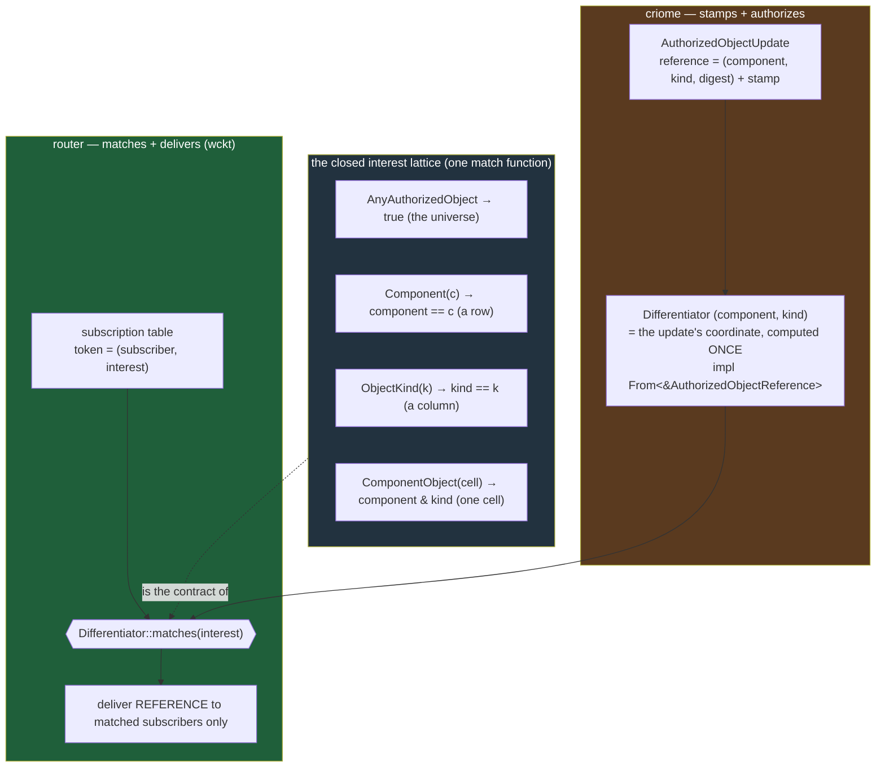
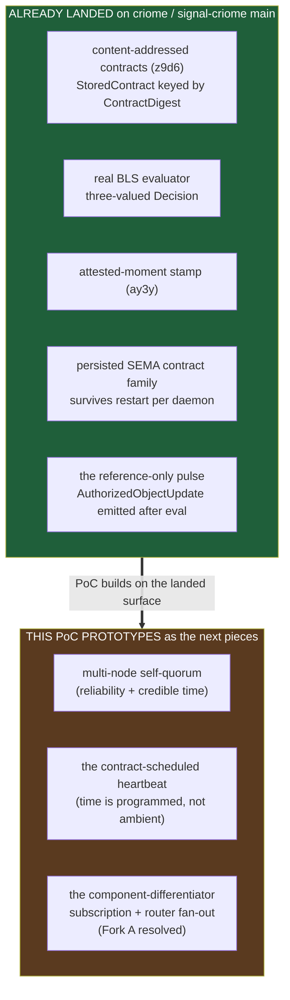

# 680 · The integrated agreement machine — PoC report

*The psyche asked to see criome whole, and asked specifically for "a more
universal contract which is mostly an enum with all the components ... a
differentiator for all the different components." This is the answer, built and
tested: a self-contained Rust crate that runs the entire agreement loop end to
end. Admit a contract, evaluate it under a membership-scoped quorum, stamp it
with a crystallized-past moment, pulse the **reference** (never the payload), and
fan that reference to subscribed components by a single shared
**component-differentiator** vocabulary — plus the contract-scheduled heartbeat.
The differentiator the psyche wanted turned out to be already half-built in the
deployed schema; this PoC names it, wires it, and proves it.*

Design in `1-design.md`; build log in `2-poc.md`; vision frame in
`677-telos-the-agreement-machine.md`. Spirit grounding: `p3td` ([everything is a
quorum], scoped by membership), `m0p2` (the object-update pulse pushes
references; the heartbeat), `ay3y` ([a quorum signature is never timeless]),
`z9d6` (content-addressed composable objects), `gc0n` (the adjudicator ladder),
`wckt` (criome authenticates; the router transports). No Spirit capture is
warranted — this is design synthesis grounding an existing idea-request; `p3td`
and `m0p2` already carry the durable intent.

## 1 · What this PoC demonstrates

Five mechanisms that were separate in the vision now run as one loop. The
collapse `677` named — authorization, time, divergence, and state are one quorum
agreeing on a content-addressed claim — is now executable, not just diagrammed.

- **The quorum, scoped by membership.** One `Threshold` evaluator, one match
  rule, never branching on self-vs-multi. Self-quorum is a threshold of one
  principal's own nodes (reliability + credible time); multi-party quorum spans
  distinct principals (cross-party trust). Only the membership set differs.
- **The attested moment.** A quorum-signed time window proves a lower bound on
  "now" — the crystallized past of `ay3y`. A sub-quorum window is not a proof;
  signatures over the wrong window do not attest.
- **The contract-scheduled heartbeat.** Time is not ambient. A heartbeat is a
  contract whose after-condition matured with no contradicting event: the clock
  advancing past T with no intervening matching update fires a quorum-signed
  `(Criome, Time)` pulse; an intervening matching event suppresses it.
- **The component-differentiator subscription / fan-out** — the elegant core the
  psyche asked for (§2 below). criome stamps and authorizes; the router matches
  and delivers by one shared vocabulary.
- **End to end.** Admit → evaluate (quorum + stamp) → emit the reference → fan by
  differentiator → only the matching component fetches the body by digest.

```mermaid
sequenceDiagram
  autonumber
  participant Sub as submitter (e.g. spirit)
  participant Cri as criome — the agreement machine (auth only)
  participant Q as quorum + moment
  participant Store as content-addressed store (z9d6)
  participant Rtr as router — match + deliver (wckt)
  participant CompM as component: matching interest
  participant CompN as component: non-matching interest
  Sub->>Cri: admit Contract (content-addressed claim)
  Cri->>Q: evaluate — threshold of sigs over the hash
  Q-->>Cri: Authorized + AttestedMoment stamp (ay3y)
  Cri->>Store: store body, keyed by digest
  Cri-->>Rtr: PULSE — AuthorizedObjectUpdate (a REFERENCE: differentiator + digest + stamp)
  Note over Rtr: router computes the update's Differentiator ONCE
  Rtr->>Rtr: filter open subscriptions by Differentiator::matches(interest)
  Rtr-->>CompM: deliver the reference (interest matched)
  Rtr--xCompN: nothing (interest did not match)
  CompM->>Store: fetch the rkyv body by digest (pull, not push)
  Store-->>CompM: the object bytes
  Note over Cri,Rtr: criome MOVED NOTHING — it authenticated; the router transported (wckt)
```

## 2 · The differentiator-contract design (Fork A, resolved)

`677` left Fork A open: does criome compute impact, or do components subscribe
and the router fan out? This PoC resolves it the elegant way — and the resolution
costs almost no new schema, because **the differentiator is already in the
deployed `signal-criome/schema/lib.schema`; it simply was never named as the
fan-out key.** `ComponentKind [Spirit Criome Router Mirror Lojix Persona Agent]`
(line 86) is literally "the enum with all the components." The cross-product
`(ComponentKind, AuthorizedObjectKind)` is the `ComponentObjectInterest` struct
under its true name, and `AuthorizedObjectReference.{component,kind}` already
projects to it — so the differentiator rides the wire with no new field.

The subscription's interest is a **closed lattice over the differentiator** — the
four-variant `AuthorizedObjectInterest` enum, which is why it is elegant rather
than a flat topic list: one variant matches the whole universe, a row, a column,
or one cell.



The one load-bearing change: move the interest **into** the subscription token.
Today `AuthorizedObjectUpdateToken { subscriber Identity }` carries no interest,
so the router fans to everyone (`subscriber_count = subscriptions.len()`). Adding
`interest AuthorizedObjectInterest` turns the table into a matchable one, and
`publish` becomes a one-line filter — `differentiator.matches(token.interest())`.
criome never computes per-object impact; the router owns match-and-deliver. That
is Fork A resolved toward `wckt`'s auth-only line, with the grain of the
deployed constellation.

## 3 · The real test output — proven vs stubbed, honestly

Clean rebuild from scratch (`cargo clean` first), profile toolchain `cargo
1.96.0` / `clippy 0.1.96`. **15 tests pass, 0 fail, 0 ignored; clippy clean
under `-D warnings`.** Verbatim per file:

```
test result: ok. 4 passed; 0 failed   (quorum_membership.rs)
test result: ok. 3 passed; 0 failed   (attested_moment.rs)
test result: ok. 4 passed; 0 failed   (heartbeat.rs)
test result: ok. 3 passed; 0 failed   (differentiator_fanout.rs)
test result: ok. 1 passed; 0 failed   (end_to_end.rs)
```

| # | Demand | Tests that prove it |
|---|---|---|
| 1 | Quorum scoped by membership | self-quorum 2-of-3 of one principal authorizes; multi-party 2-of-3 distinct principals authorizes; one signature falls short; a non-member signature does not count |
| 2 | Attested moment | quorum-signed window proves a lower bound on now; a sub-quorum window is not a proof; wrong-window signatures do not attest |
| 3 | Contract-scheduled heartbeat | clock past T, no event, fires; intervening matching event suppresses; not-yet-due is retained; a non-matching event does not suppress |
| 4 | Differentiator fan-out | match rule total over the lattice; reference delivered to matching subscribers only; closing a subscription stops its deliveries |
| 5 | End-to-end | admit → evaluate(quorum+stamp) → emit reference → fan → matching component fetches; non-matching gets nothing |

**Real and load-bearing** (no logic the design turns on is faked): the
membership-scoped quorum evaluator counting distinct satisfied members; the
attested-moment lower-bound proof; the heartbeat fire/suppress logic; the
`impl From<&AuthorizedObjectReference> for Differentiator` (no new wire field);
the one-function `Differentiator::matches` lattice rule; the FNV content digest
(equal bodies share a digest, so push-reference / pull-body is genuine).

**Stubbed, and named as such:**

- **Signatures** — deterministic, not cryptographic; mirrors the router's own
  `AcceptFixedTestIdentity` test signer. A signature still binds a specific
  signer to a specific message, which is all the quorum count needs. Production
  swaps in real BLS (already landed on criome main — §4).
- **Store** — in-memory `HashMap`, not redb + rkyv; the content address is real.
- **Router / fan-out** — in-process `Vec<Delivery>`, not a socketed daemon; the
  match-and-deliver logic is the deployed shape, only the transport is collapsed.
- **CriomeCore** — a data-bearing struct, not a kameo actor (the PoC is
  zero-dependency); same logical shape an actor would carry, one method per verb.

## 4 · Map to reality — landed vs prototyped-next

The honest cursor. A surprising amount of the agreement machine is **already on
criome main** — this PoC mostly prototypes the *delivery* and *time-driver*
slices that remain, and resolves Fork A in code as design pressure.



**Already real on main** (verified in `677`): content-addressed contracts with
`StoredContract` keyed by `ContractDigest`; the real-BLS evaluator with the
three-valued `Decision`; the attested-moment stamp; the persisted SEMA contract
family that survives restart per daemon; and the reference-only pulse —
`signal-criome` carries `ObserveAuthorizedObjects` / `AuthorizedObjectUpdate` /
retraction, and criome publishes an authorized-object update after evaluation
with subscription storage at `subscription.rs:23`.

**What this PoC prototypes as the next pieces:** multi-node self-quorum (the
reliability-and-credible-time mode of `p3td`); the contract-scheduled heartbeat
(`m0p2`'s "a heartbeat is programmed, not ambient"); and the
component-differentiator subscription / fan-out — the matchable router table that
turns today's fan-to-everyone into the lattice match (Fork A resolved toward
subscribe-and-router-fans-out).

**Lane note.** This is a designer prototype: throwaway crate at `/tmp/telos-poc`,
committed nowhere, built to exert *design pressure* and prove the shape compiles
and the seams close. It is not a landing. Per the worktree contract, the operator
lane lands the schema and code changes on criome / signal-criome main — moving
`interest` into `AuthorizedObjectUpdateToken`, naming the `Differentiator`, and
wiring `publish` to match instead of fan-to-everyone.

## 5 · Open questions for the psyche

Three seams, now grounded by concrete tests rather than left abstract:

1. **Differentiator granularity.** The PoC is built coarse —
   `(ComponentKind, AuthorizedObjectKind)`. Is that the whole differentiator, or
   does it need a third named-function axis within a component (e.g. Spirit
   `intent-log` vs Spirit `marker`)? Adding it is one field plus one match arm.
2. **Token identity / retraction.** Moving `interest` into the token makes one
   identity hold many tokens; the PoC implements per-(identity, interest)
   retraction (test `closing_a_subscription_stops_its_deliveries` confirms).
   Confirm that is the intended granularity.
3. **Heartbeat "intervening event" scope.** The PoC reads "no intervening event"
   as "no update matching the check's `absent` interest" (test
   `a_non_matching_event_does_not_suppress` confirms a different-class event does
   not suppress). Confirm versus a narrower per-contract event match.

## Sources

`reports/designer/680-telos-integrated-poc/1-design.md` and `2-poc.md`;
`reports/designer/677-telos-the-agreement-machine.md`; the crate at
`/tmp/telos-poc` (15 tests green, clippy clean, committed nowhere); deployed
shapes in `signal-criome/schema/lib.schema` and `criome` `subscription.rs` /
`root.rs`; Spirit records `p3td`, `m0p2`, `ay3y`, `z9d6`, `gc0n`, `wckt`.
