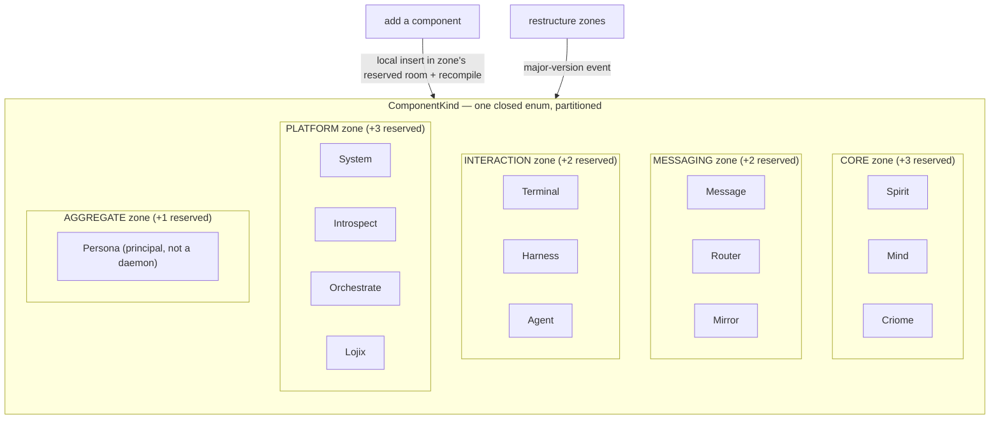
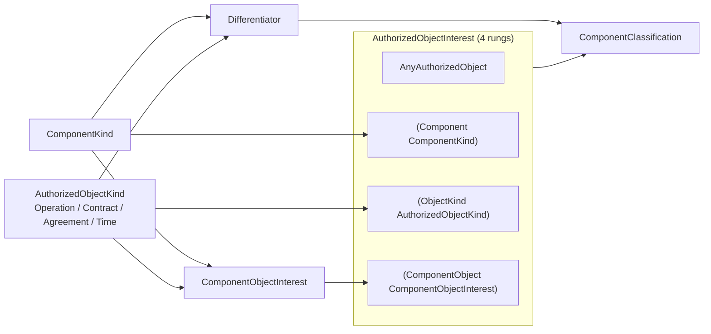
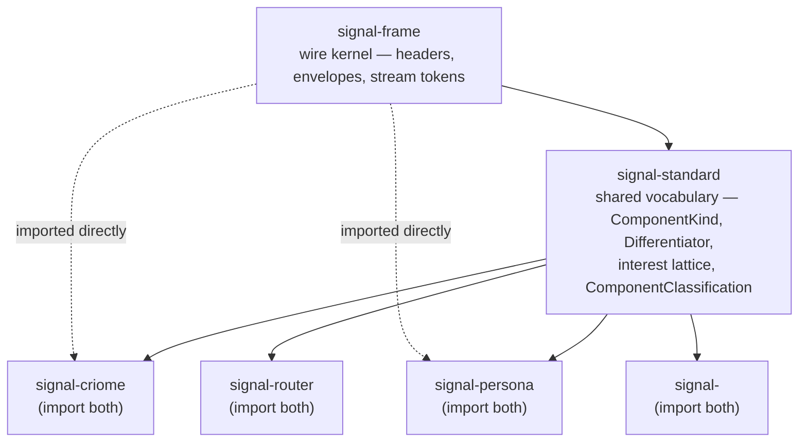

# 681 — signal-standard: the shared vocabulary for cross-component standards

Companion to the design at
`reports/designer/681-signal-standard/1-design.md`. This is the
psyche-facing read: what the new library is, why it is closed-but-
partitioned, the mechanism it absorbs from signal-criome, where it sits
in the layering, and the migration that retires three divergent local
rosters into one.

Per Spirit `eeeo`: [a second non-component shared `signal-` library, for
genuine cross-component standards, alongside `signal-frame`]. The design
realises that decision.

## 1. What signal-standard is — and is not

`signal-standard` is the **second non-component shared `signal-` library**.
The first, `signal-frame`, owns domain-free **wire mechanics**: short
headers, exchange/stream identifiers, request/reply/stream envelopes, rkyv
archive helpers. `signal-standard` owns the other domain-free layer —
**cross-component standards**: the vocabulary every component conforms to,
starting with the classification of what a component *is*.

The scope discipline is the whole point of `eeeo`. Three lines must not
blur:

| Library | Charter | Has a daemon? |
|---|---|---|
| `signal-frame` | domain-free wire mechanics (the kernel) | no — shared lib |
| `signal-standard` | domain-free cross-component vocabulary | no — shared lib |
| `signal-system` | the **System component's** own contract | yes — System daemon |
| `signal-<component>` | one component's working signal tree | yes — that daemon |

`signal-standard` is **not** `signal-system`: that is one component's
contract and would be overloaded by hosting cross-component types. It is
**not** `signal-frame`: frame's charter is mechanics, not vocabulary. Only
genuine cross-component standards belong here — not a grab-bag of
conveniences. The crate is a **pure vocabulary library**: its Input and
Output root sections are empty; component contracts import its types and
reference them inside their own roots.

## 2. The closed-but-partitioned ComponentKind roster

The central content is `ComponentKind` — the authoritative roster of every
component the engine knows. Today that roster is declared **locally and
divergently** in more than one contract. The two we found overlap on only
two names:

- signal-persona: `Mind Router Message System Harness Terminal Introspect Orchestrate Spirit` (9)
- signal-criome: `Spirit Criome Router Mirror Lojix Persona Agent` (7)

Reconciling the union against `protocols/active-repositories.md` yields one
authoritative roster of **14 variants** — no variant dropped, the two
shared names (`Spirit`, `Router`) collapse. The key resolution: **`Persona`
is not a daemon.** In the criome roster it names the engine-as-principal (a
trust subject), so it is placed in its own Aggregate zone and documented as
such — nobody should hunt for a `persona` daemon.

The structure is modeled on Spirit `t312`, the signal-namespace partition
that splits one 64-bit space into a system-types zone and a
component-specific zone with **pre-allocated room**, where repartitioning
is the major-version event. `ComponentKind` does the same as **one closed
enum** whose zones are documented allocations with reserved room. Closed
means it still type-checks every consumer; partitioned means adding a
component is a **local insert in its zone's reserved room plus a
recompile** — not a workspace-wide rebuild. Restructuring the zones
themselves is the major-version event.

## 3. The differentiator, interest lattice, and embeddable classifier

This is the Fork-A mechanism — born **local** inside `signal-criome`
(lines 214–232) and lifted, intact, into the shared library so every
component shares one classification grammar instead of criome owning it.

- `AuthorizedObjectKind [Operation Contract Agreement Time]` — verbatim.
- `Differentiator { component ComponentKind, kind AuthorizedObjectKind }` —
  a component is distinguished cross-system by which kind it is and which
  object kind it acts over. (criome had this implicitly; named here.)
- `AuthorizedObjectInterest` — a four-rung lattice every subscriber narrows
  against: any object, by component, by object-kind, or by the
  component-object pair.
- `ComponentObjectInterest` and `AuthorizedObjectReference` — carried over
  so the lattice and its references are complete.
- `ComponentClassification { differentiator, advertises }` — the new small
  embeddable classifier: the minimal standard nameplate a daemon stamps
  onto its frames so peers classify it **without a lookup**.

## 4. The layering

Three tiers, each strictly narrower in scope going up. `signal-frame` is
the wire kernel; `signal-standard` is the shared vocabulary built atop it;
each `signal-<component>` imports **both** and adds only its own working
signal tree.

## 5. The migration — import-and-retire

The reconciliation is a **breaking change by design**: per the
no-backward-compatibility override, divergent local rosters collapse into
one shared enum in a coordinated all-consumers rebuild, not a wire-stable
bump. Old variant ordinals do not carry over.

**Lane note.** `signal-standard` touches code-repo `main`, so the edits are
**operator** work (operators own main + rebase). The **designer**
contribution is the prototype and this design — the schema lives at
`/tmp/signal-standard/schema/lib.schema` (canonical positional form) and a
validated name-value variant alongside it.

1. **Create** the `signal-standard` crate — second shared lib after
   `signal-frame`, same Cargo shape as `signal-criome` (frame dependency,
   `nota-text` feature).
2. **signal-criome** — delete its 5 local types; add the import brace
   `{ ComponentKind signal-standard:lib:ComponentKind ... }`. Its own
   `ObjectDigest` stays local.
3. **signal-persona** — delete local `ComponentKind`, import it.
4. **signal-router** and any other declarers — grep confirms only criome
   and persona currently declare a local `ComponentKind`; router imports
   the shared one going forward.

Because the enum only **grows** to the union and every old name maps 1:1
to an identically-named reconciled variant, existing match arms stay valid;
the rebuild surfaces the new required arms wherever code matches
exhaustively.

### Resolved: ComponentPrincipal collapses into ComponentKind

signal-persona's `ComponentPrincipal` is currently the same set as
`ComponentKind`. **Psyche decision: collapse it into the imported
`ComponentKind` — no persona-local alias.** Both persona fields that referenced
`ComponentPrincipal` reference the imported `ComponentKind` directly; the
`ComponentPrincipal` name is retired.

### Validation caveat (honest)

The buildable schema-next checkout is `main` (`abae95f`), which uses the
older **name-value** struct-field form, not the **positional dot-
differentiator** form from `skills/structural-forms.md` (that engine lives
on the unbuilt epic branch). The name-value variant was lowered cleanly
through the real engine — all seven types resolve. The canonical positional
file is **not** machine-validated; its correctness rests on the skill plus
equivalence to the validated variant. The operator should build against
whichever form `main` carries at landing time.
