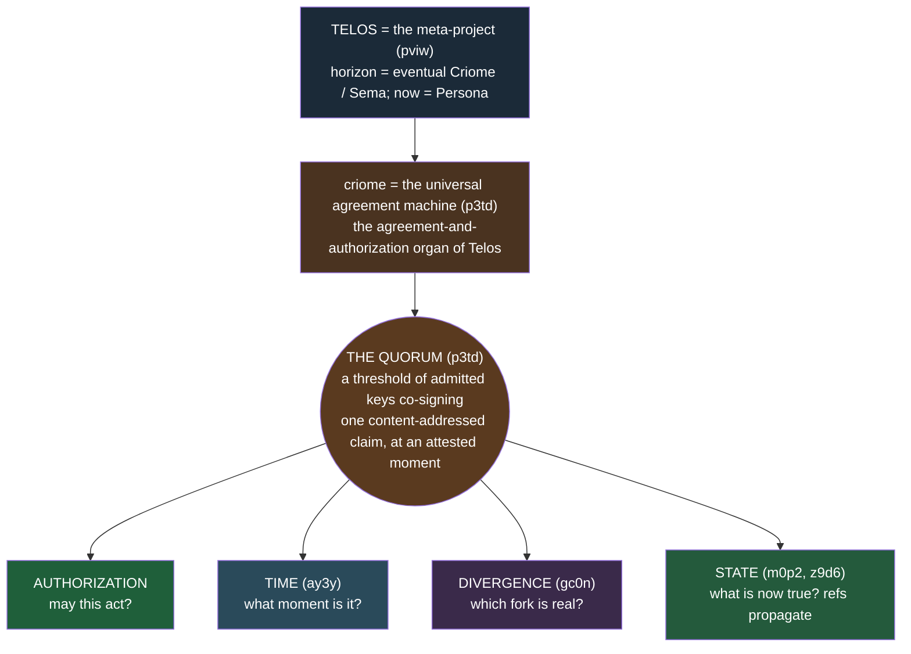
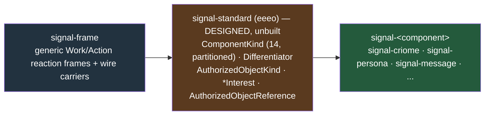
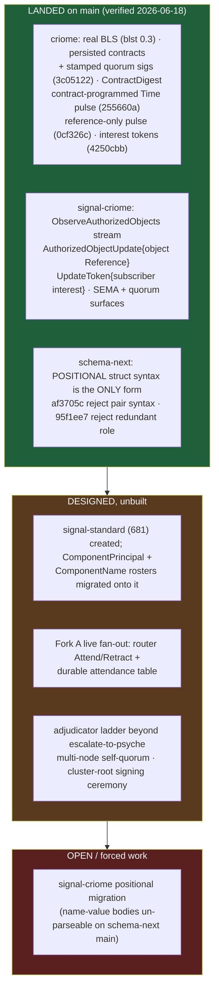

# 682 · Overview again + context maintenance — the synthesis

Where the system stands now, built on the 675 seven-zoom map and the 677
agreement-machine framing rather than re-deriving them; plus an actionable
context-maintenance ledger the orchestrator can apply. Grounded in
`0-frame-and-method.md`, the `1-intent-audit.md` and `2-state-and-staleness.md`
grounding passes, and reports 677 / 675.6.

## Part A — the refreshed overview

### A.0 The one sentence, with the forks now closed

Per `pviw`, [Telos is the name of the meta-project ... whose far horizon is
eventual Criome and eventual Sema]; per `m0p2`, [Criome's system direction is a
universal agreement machine for authorization]. **criome is the universal
agreement machine — the quorum is its universal primitive — and it is the
agreement-and-authorization organ of Telos, the meta-project.** The change since
677 is that the two propagation forks the vision left open are now *resolved* in
the intent layer, and the persisted-contract / reference-pulse substance is
*landed on criome main*.



The collapse from 677 holds: one primitive — a threshold of keys over a hash,
stamped with when — wearing four sets of clothes. What is new is the propagation
half of the picture is no longer two open questions.

### A.1 The pulse and propagation — both forks resolved

677 §3 named two genuinely-undecided forks. Both are now answered in the intent
layer and partly on main.

- **The pulse pushes references, never payloads** (`m0p2`): on admission criome
  publishes an `AuthorizedObjectUpdate` carrying an `AuthorizedObjectReference`
  (a digest); affected components *fetch* the rkyv object through the
  routing/object-distribution layer. Landed on `signal-criome` main
  (`AuthorizedObjectUpdate { object AuthorizedObjectReference }`,
  `ObserveAuthorizedObjects opens AuthorizedObjectUpdateStream`) and on criome
  main (`0cf326c` reference-only publish).
- **Fork A resolved → subscribe + router fan-out** (`l2ha`): not
  criome-computes-impact. Components subscribe by interest; the router fans out
  via the shared *differentiator* coordinate. Landed: the interest-bearing token
  (`AuthorizedObjectUpdateToken { subscriber interest }`, criome `4250cbb`).
  Unbuilt: router `Attend`/`Retract` + the durable attendance table keyed by the
  standard interest coordinate (live fan-out delivery).
- **Fork B resolved → the contract-scheduled heartbeat** (`m0p2`): not an
  ambient global heartbeat — a contract-programmed after-time condition. Time
  pulses are themselves contract-scheduled (`AuthorizedObjectKind` includes
  `Time`; criome `255660a`). The self-quorum re-attests the window on schedule
  so "now" stays fresh in quiet periods without an always-on tick.

```mermaid
sequenceDiagram
  autonumber
  participant Sub as submitter (e.g. spirit)
  participant Cri as criome (agreement machine)
  participant Sub2 as subscriber component
  participant Rtr as router (fan-out + object distribution)
  Sub->>Cri: submit a content-addressed claim
  Cri->>Cri: quorum evaluate (BLS over the hash, at the attested moment)
  Cri->>Cri: admit + persist StoredContract by ContractDigest
  Note over Cri: Fork B — a contract-scheduled Time pulse re-attests "now"
  Sub2->>Rtr: subscribe by interest (Fork A: differentiator coordinate)
  Cri-->>Rtr: PULSE — an AuthorizedObjectReference (digest), never the payload
  Rtr-->>Sub2: fan out the reference to attending subscribers
  Sub2->>Rtr: fetch the referenced rkyv object by digest
  Rtr-->>Sub2: the rkyv bytes
  Note over Cri,Rtr: criome MOVES NOTHING — it authenticated; the router transports (wckt)
```

### A.2 The shared vocabulary — signal-standard and the differentiator

681 / `eeeo` designed the cross-component vocabulary that makes Fork A's fan-out
typed: **signal-standard**, a closed-but-partitioned 14-variant `ComponentKind`
roster plus the `Differentiator` (the interest coordinate the router fans out
on), `AuthorizedObjectKind`, the `*Interest` types, `AuthorizedObjectReference`,
and `ComponentClassification`. It layers between the generic frame and each
component contract.



### A.3 The cursor — landed / designed / open



| Item | Status | Note |
|---|---|---|
| Persisted policy contracts + stamped quorum sigs | LANDED criome `3c05122` | `StoredContract` by `ContractDigest`; closes the 675 SEMA gap |
| Real BLS evaluator | LANDED criome | `blst 0.3`; "Spartan BLS-signature auth + attestation daemon" |
| Reference-only object pulse | LANDED criome `0cf326c` / signal-criome | criome pushes references; components fetch |
| Interest-bearing tokens (Fork A primitive) | LANDED criome `4250cbb` | `UpdateToken { subscriber interest }` |
| Contract-scheduled Time pulse (Fork B) | LANDED criome `255660a` | `AuthorizedObjectKind` `Time`; not an ambient tick |
| **Positional dot-differentiator struct syntax** | **LANDED schema-next main** `af3705c` / `95f1ee7` | the *only* accepted form; both retired forms reject loudly |
| signal-standard library | DESIGNED 681 | not created |
| Roster migration (`ComponentPrincipal`, `ComponentName`) | DESIGNED | onto signal-standard's `ComponentKind` |
| Fork A live router fan-out | DESIGNED | `Attend`/`Retract` + attendance table unbuilt |
| Adjudicator ladder / multi-node quorum / cluster-root ceremony | DESIGNED | single-node, escalate-to-psyche only in practice |
| signal-criome positional migration | OPEN (forced) | name-value bodies no longer parse on schema-next main |

### A.4 What the struct-syntax fix unblocks

This is the headline correction to the operator-416 premise. SO landed the
positional dot-differentiator struct body on **schema-next main** (not epic-only)
on 2026-06-18: `af3705c` removes `FieldPairs` from both `src/source.rs` and
`src/declarative.rs`, adds `RetiredStructFieldSyntax`, and migrates the core /
root / spirit-min schemas + all fixtures to positional form; `95f1ee7` adds
`RedundantExplicitFieldRole`. Consequences:

- **The 681 caveat is void.** operator-416 line 71 ("build against name-value
  because positional isn't buildable on main") is now backwards: positional *is*
  main, and name-value *fails to parse*. signal-standard and any new contract
  must be authored positional; designer 681's positional sketch is the buildable
  one.
- **`i3p0` closes.** `topic.Topic` (redundant explicit role) is now rejected;
  use `Topic`.
- **It forces the signal-criome migration** (A.3 open row): signal-criome main
  landed ~2h after `af3705c` still carrying name-value bodies, so the criome
  contract repos are now stale against schema-next main — a real, trackable
  coordinated break needing a positional migration + regenerate.

## Part B — the context-maintenance ledger

### B.1 Verified coherent (no action)

The intent audit looked up all 15 named session records and the two referent
extras. **All 15 are current, internally coherent, mutually consistent, and form
one connected arc with no contradictions and no duplicates needing a merge:**
`pviw p3td m0p2 ay3y gc0n z9d6 wckt l2ha eeeo cx2m 2st7 w2g3 d6he ermr psc6`.
Specifics worth carrying:

- **obuf is fully gone.** `(Lookup obuf)` → record not found; text search → no
  match; no dangling supersede lineage. `p3td` carries the substance that
  superseded it and stands alone. No action.
- **All cross-references resolve to live records:** `2st7`→`w2g3`,
  `wckt`→`i99x`/`l3k4`/`a4i6` (`i99x` active). No orphaned supersede chains.
- **`gc0n` correctly lowest-certainty** (`Low`), matching its still-forming
  adjudicator-ladder status.
- **`m0p2` / `p3td` shared opener is framing, not duplication** (p3td = organ +
  quorum primitive; m0p2 = pulse/heartbeat). **`eeeo` is orthogonal**
  (signal-standard schema crate). Noted so a future sweep does not re-flag.
- **Empty-by-design referents:** "Crayome" (read as criomos/CriomOS, covered by
  `cx2m` + `wckt`) and "Fork B" both return no match — `l2ha`'s "Fork A
  resolved" has no dangling sibling. No orphan.

### B.2 Flagged for intent-layer fixes (orchestrator applies, guardian-gated)

| # | Record | Action | Why |
|---|---|---|---|
| 1 | `w2g3` | **Clarify** (one line) | Records the criome-auth envelope as "still open" at `Medium`; `2st7` "settles the envelope design left open by w2g3" at `High`. Not a contradiction (w2g3 is the question 2st7 answered) but a fresh reader hits an active "open" record beside its resolution. Add a one-line Clarify noting it is now settled by `2st7` — keeps lineage. Do **not** retire: the pilot-consumer intent still stands. The only fix worth doing soon. |
| 2 | `p3td` | **BumpImportance** (optionally `pviw` too) | p3td is the canonical "what criome IS" definition (obuf supersessor, root of the other 14) yet sits at `Importance Minimum` like its downstream details. Importance drives retrieval order; the root out-ranking its elaborations is the ladder's intended use. Importance only, **not** certainty. Low stakes. |
| 3 | `m0p2`/`p3td` | **No action, monitor** | Shared framing, not duplication (see B.1). Logged to prevent a future re-flag. |
| 4 | `eeeo` | **No action** | Orthogonal to agreement-machine semantics. |

### B.3 Report / skill staleness flags

| Target | Action |
|---|---|
| `skills/structural-forms.md` | **Stale vs schema-next main.** Line 154 points code at "(epic branch `next/structural-forms`)" and line 47 frames `adnn` as forward design; the positional dot-differentiator syntax is now **landed on schema-next main** (`af3705c`/`95f1ee7`). Drop the epic-branch qualifier, reframe `adnn` as landed, and add the `RedundantExplicitFieldRole` / `i3p0` reject (`topic.Topic` rejected). The `skills.nota` index entry itself is fine. |
| signal-criome (contract repos) | **Stale vs schema-next main.** Main still uses name-value struct bodies (`AuthorizedObjectUpdateToken { subscriber Identity interest ... }`), landed ~2h after `af3705c` made that form un-parseable. Needs a positional-form migration + regenerate — an operator-owned coordinated break (also tracked as A.3's open row). |
| designer 674–681 | **Clean.** No obuf slips; no Telos-as-agreement-machine mislabel — 677/678/680 consistently frame *criome* as the agreement machine and *Telos* as the meta-project, grounded in `pviw`/`p3td`/`m0p2`. `/tmp/telos-poc` correctly flagged throwaway. No action. |

## Sources

`reports/designer/682-overview-and-context-maintenance/0-frame-and-method.md`,
`1-intent-audit.md`, `2-state-and-staleness.md`;
`reports/designer/677-telos-the-agreement-machine.md`,
`reports/designer/675-system-with-perspective/6-system-map.md`. Spirit records
`pviw p3td m0p2 ay3y gc0n z9d6 wckt l2ha eeeo cx2m 2st7 w2g3 d6he ermr psc6`
(plus `i99x`, `i3p0`). Landed commits verified on `origin/main`: criome
`3c05122`/`255660a`/`0cf326c`/`4250cbb`, signal-criome `e33ea04`, schema-next
`af3705c`/`95f1ee7`.
