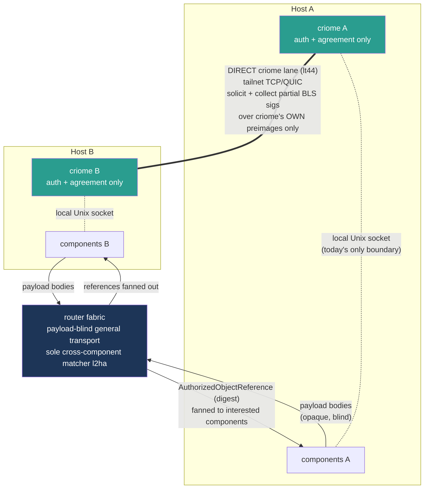

# 683 — design review (piece by piece) and the direct criome networking lane

This is one report in two arcs. Part 1 reviews the agreement-machine design
**most-important piece first**, grounding each against current main with a true
landed / partial / designed / open state. Part 2 designs the **direct
criome-to-criome networking lane** (Spirit `lt44`) — protocol, auth, discovery,
the RTT-to-attested-moment relationship, partition behaviour, and what it would
take to build — and folds the adversarial critique in honestly rather than
hiding it. Part 3 carries the operator-417 corrections. Part 4 is the
intent-hygiene ledger.

The frame and method for the session is in `0-frame-and-method.md`.

## Part 1 — the design, piece by piece

### Summary

| Piece | State | One line | Key tension |
|---|---|---|---|
| Quorum primitive | landed | k-of-n of keys or sub-quorums signing one content-addressed proposition over an attested moment; evaluator on main | Built in isolation but divorced from system-scope visibility until the Fork-A pulse decision lands |
| Content-addressed contracts (`z9d6`) | landed | Immutable blake3-identified contracts whose composition arms reference sub-contracts by digest | Quorum-member distinctness not enforced in the persisted version: a duplicate key can satisfy 2-of-2 |
| Policy-language vocabulary | landed | Schema-first typed policy language over public-key atoms: quorums, time-locks, divergence-reconciliation | Router registry-owner fork unsettled (sole matcher vs double filter) |
| Attested clock | landed | Every operation carries its own AttestedMoment; evaluator reads no ambient `SystemTime::now()` | The subscription-delivery owner fork blocks pulse integration, not the clock itself |
| Pulse and fan-out (`m0p2` / `l2ha`) | partial | Pushes references (not payloads) to affected components after authorization | Who owns the fan-out matcher — criome-computed impact vs router-only delivery; registry currently counts, delivers nothing |
| Transport two-lanes (`lt44`) | partial | General router fabric plus a direct criome-to-criome peer lane for time-sensitive quorum signing | Registry ownership and cross-component delivery; router half entirely unbuilt |
| Adjudicator ladder | partial | Contracts escalate to a named adjudicator whose signed verdict criome only verifies | Three-valued decision landed; named rungs, verdict-verification surface unbuilt — `EscalateToPsyche` is a dead letter |
| signal-standard | designed | Shared library consolidating ComponentKind / Differentiator / interest lattice across components | Cannot land until signal-criome and signal-persona move to current positional schema syntax |
| Trust bootstrap | landed | Cluster-root BLS signature gates key admission into the identity registry | Cryptographic gate built; the cross-node provisioning ceremony (an op step, not code) is the open edge |

The top four pieces are all **landed and real on main**, and they are not four
independent wins — they are one win seen from four angles. The quorum primitive
is the load-bearing decision; content-addressing is how its members compose;
the policy language is its vocabulary; the attested clock is the time axis it
evaluates over. The recurring tension across all of them is the **same single
fork** (who owns the subscription/fan-out matcher), which is why it dominates
the partial pieces too.

### 1. Quorum primitive — landed

A universal quorum: a threshold k-of-n of admitted keys (`KeyMember`) or
composable sub-quorums (`ObjectMember`), each signing the same
content-addressed proposition over an attested moment. The evaluator is fully
landed: `criome/src/language.rs:370-395` (`ThresholdEvaluation::decide` over
member satisfaction) and `:455-468` (`KeyMember` / `ObjectMember` evaluation),
with the union and `Threshold` struct at `signal-criome/schema/lib.schema:132-140`.
Landed by criome `3c05122` + signal-criome `9d8ea38`; 67 tests in
`criome/tests/language.rs` cover threshold semantics, replica binding, time
locks, and shortfall rejection.

This is the load-bearing design decision of the whole agreement-machine framing
(Spirit `p3td`, designer/677, system-designer/133). It is what unifies
authorization, time, divergence resolution, and state propagation into one
mechanism — and the evaluator being real on main with real BLS and
content-addressed `ObjectMember` composition proves it is not a fantasy.

Key tension: the evaluator works, but the **pulse propagation layer** that makes
quorum decisions visible at system scope is suspended on Fork A
(system-designer/135 §3). Neither the router's Attend/Withdraw surface nor its
attendance table exist; criome's internal `SubscriptionRegistry` only counts
matchers and delivers nothing. The primitive is coherent in isolation but
divorced from its end-to-end meaning until the fork is decided.

### 2. Content-addressed contracts (`z9d6`) — landed

Authorization contracts are immutable, content-addressed objects (blake3 digest
identity) whose composition arms reference sub-contracts by digest rather than
inline — reusable policy DAGs with quorum members that are either keys or
sub-objects. Landed at criome `3c05122` (worktree
`language-content-addressed-bls`) + signal-criome `9d8ea38`; durable via SEMA
contract families, restored on daemon restart.

Without content-addressed composition every policy is a flat tree copied at every
reference point, losing reuse and making quorum panels non-durable. With it, a
time-authority quorum or release-panel policy defined once is referenced by many
parents, and its admission to the store is an immutable fact.

Key tension: **quorum-member distinctness is not enforced** in the persisted
version (`3c05122`). A duplicate key can satisfy a 2-of-2 quorum once. This was
flagged as a blocker in operator/407 but has not been corrected. It is a hygiene
gap in distinctness checking, not a shape problem.

### 3. Policy-language vocabulary — landed

Criome's internal language: schema-first, limited, typed, over public-key
identity atoms, composing identity contracts from signature quorums (k-of-n),
time-locks (thresholds that vary over elapsed time), and explicit
divergence-reconciliation objects. criome main `4250cbb`;
`signal-criome/schema/lib.schema:116-193`; 51 passing tests on real BLS + SEMA
persistence.

This is the core agreement machine of Telos, now built rather than sketched.
Key tension is the same registry-owner fork: sole matcher vs double filter.

### 4. Attested clock — landed

Quorum-attested crystallized-past time: every operation carries its own
`AttestedMoment` stamp and the evaluator reads no ambient `SystemTime::now()`.
Time-locks evaluate against the operation's own proven stamp, not the machine
clock. criome main `4250cbb`; `tests/language.rs` 16 passing tests;
`signal-criome schema/lib.schema:166-185`; `src/language.rs:296-316`
(`ActiveAfter` / `ActiveUntil`); commit `cd1de18f`.

This eliminates the ambient-clock misfit that let daemons read
`SystemTime::now()` as a non-deterministic side-input. Every authorization
carries proof-of-when as a first-class verifiable object; crystallized-past
semantics keep time from becoming an oracle. Load-bearing for the
quorum-decision model and the divergence machinery.

Key tension: the subscription-delivery owner fork (system-designer/135 §3)
blocks the pulses integration and leaves the intent layer contradictory — but it
does not break the attested clock itself.

### 5. Pulse and fan-out (`m0p2` / `l2ha`) — partial

Criome's object-update pulse pushes **references, not payloads**, to affected
components after authorization. `AuthorizedObjectUpdateToken` landed
(signal-criome `e33ea04a` + criome `4250cbb3`, operator/415), and
`criome/src/actors/subscription.rs` carries a reference-only pulse with a
subscriber-filtered interest lattice — but delivery is still in-memory snapshot
only.

This is the operational spine: it turns "a quorum agreed" into "the system saw
the decision." It sits directly on the lean-vs-rich fork.

Key tension: **the registry counts matchers but delivers nothing.**
System-Designer 135 frames the gating fork — either the router is the sole
operational matcher (criome emits unfiltered references; router holds the
attendance table and delivers) or criome keeps its internal registry and the
router gets its own (dual-filter risk). This is the one decision that reconciles
the `m0p2` ("criome pushes updates to affected components") vs `l2ha` ("router
matches subscriptions and fans references out") contradiction. It cascades into
whether `m0p2` gets a Supersede, and into the heartbeat design (a heartbeat is a
pulse that must fan out somewhere, so the matcher owner determines how).

### 6. Transport two-lanes (`lt44`) — partial

Two distinct transport lanes: a general-purpose router (cross-sandbox,
cross-network, payload-blind, carrying references and routing metadata) plus a
direct criome-to-criome peer lane for time-sensitive quorum signing and
crystallized-time agreement. Criome stays auth/agreement-only; the router moves
bytes and manages delivery. This piece is the subject of Part 2.

State: the criome lane (LHS) has the subscription registry, interest filtering,
and authorized-object pulse published — but it only counts subscribers and does
not deliver (operator/410, operator/415). The router lane (RHS) is entirely
unbuilt: `signal-router/schema/lib.schema` carries zero Attend/Withdraw/Subscribe
verbs and no ComponentKind/Differentiator types, and `router` has no
subscription/attendance surface (operator/416-417).

Key tension: registry ownership and cross-component delivery — the same gating
fork as piece 5. The current code implements only criome-side filtering and no
router-side delivery table. The separation itself (auth/quorum plane vs
general-routing plane) is mostly decided; the implementation fork is a single
binary choice the psyche must steer.

### 7. Adjudicator ladder — partial

Criome contracts can escalate a decision to a named adjudicator (mechanical
quorum, LLM panel, smarter agent, or psyche) whose signed verdict criome only
**verifies**. Non-judgment is first-class; the default LLM leans toward
abstaining/escalating; the psyche is highest-authority lowest-availability. The
three-valued `EvaluationDecision` enum (signal-criome
`src/schema/lib.rs:108-111`, including `EscalateToPsyche`) and its evaluation
(`criome/src/language.rs:318`) are landed (criome `9719703`). The full ladder —
named rungs, mechanical-quorum variants, terminal psyche authority, the signed
verdict-verification surface — is unbuilt (designer/677 §6).

This is the architectural expression of "intent-is-primordial": the system must
say explicitly who can override the criome verdict and on what grounds. It
enforces the verifies-not-decides boundary — criome records and verifies
adjudicator verdicts, never issues them outside the local three-valued surface.

Key tension: the current `EscalateToPsyche` has no mechanism to name **which**
adjudicator should handle it, nor to verify a later signed verdict. As built,
escalations go nowhere — `EscalateToPsyche` is a dead-letter outcome.

### 8. signal-standard — designed

A new non-component shared library (alongside `signal-frame`) consolidating the
divergent ComponentKind rosters from signal-criome (7 variants) and
signal-persona (9 variants) into one authoritative closed-but-partitioned enum
of 14 variants across 5 zones (Core / Messaging / Interaction / Platform /
Aggregate). It lifts the Differentiator, AuthorizedObjectInterest lattice, and
ComponentClassification types up from signal-criome to make them cross-component
standards. Prototype at `/tmp/signal-standard/schema/lib.schema`, validated
through schema-next main `abae95f` (designer/681). The repo does not exist on
main yet.

signal-standard is the foundation for Fork A: without it, signal-router cannot
import the shared ComponentKind and cannot implement its Attend/Withdraw table
and interest-lattice filtering. The design itself is solid (Census reconciled,
zones documented, prototype validated).

Key tension: signal-criome and signal-persona still use the old name-value
struct syntax, which predates schema-next's current positional/explicit-role
grammar. The migration to positional syntax plus moving imports from local to
shared ComponentKind is the blocking prerequisite (operator/417, steps 1-2).
See Part 3.

### 9. Trust bootstrap — landed

A cryptographic trust root that admits keys into criome's identity registry via
cluster-root BLS signature verification over registration statements. Each
criome daemon holds a master keypair (BLS12-381 min-pk, generated on first run,
persisted `0600`); a configured cluster-root key gates registration by verifying
new identities are signed by the cluster authority. `RegisterIdentity` rejects
`UnauthorizedRegistration` when the admission envelope is absent or invalid.
criome `9e261e5`; `src/master_key.rs`, `src/admission.rs`,
`src/actors/registry.rs:96-106`; all 5 admission + 16 language + 21 daemon tests
green.

This closes the self-asserted-registry gap that system-operator audits
225/226/227 flagged. Without it, any socket caller could register arbitrary
identity-key bindings and forge `Valid` attestations.

Key tension: the cryptographic gate is built and tested, but the **cross-system
trust edge** is open — the cluster-root provisioning ceremony where the
cluster-root authority signs each node's master public key before bootstrap. That
is an operational deployment step, not code. Without it the trust root is
self-asserted within a single node and does not yet bridge to the cluster
authority; the circular-trust gap remains open at the cross-node level. This is
exactly what the direct lane's peer-admission flow (Part 2) chains to.

## Part 2 — the direct criome lane (Spirit `lt44`)

### What the lane is for

The direct lane is criome's **quorum-assembly ceremony channel**: the transport
over which a coordinating criome *solicits* partial signatures from peer criomes
and *collects* them back, for exactly two object families that are inherently
multi-party and time-sensitive:

1. **AttestedMoment time-quorum** (`ay3y`) — a `Vec<TimeSignature>` over one
   `AttestedMomentProposition`.
2. **Operation / agreement quorum** (`z9d6`) — a `Vec<StampedSignatureEnvelope>`
   over one `OperationStatement`, plus `AgreementFact` reconciliation.

It exists because today these vectors are caller-assembled and intra-daemon:
`language.rs` verifies a `Vec` it is handed, and
`authorization.rs RouteSignatureRequest` / `SubmitSignature` are in-memory
queues, not network endpoints. There is no cross-host collection path. The
lane's job is to turn the single-node signer (`signer.rs`: one
`master_key.sign`) into a multi-node quorum **without routing any third-party
payload**: every byte on the lane is a criome statement, a partial BLS signature
over it, or a peer-registry/handshake control message.

Criome stays auth/agreement-only because the only thing that crosses is
signatures over criome's own canonical preimages
(`CRIOME-OPERATION-AUTHORIZATION-V1`, `CRIOME-ATTESTED-MOMENT-V1`,
`CRIOME-REGISTRATION-ADMISSION-V1`). The lane never delivers
`AuthorizedObjectUpdate` to components — that stays local-audit-only and is the
router's job per `l2ha`.

### The two-lane architecture

The split is **by cargo, not by topology**. The router forwards arbitrary
component bodies (`peer_delivery.rs ForwardMessage` over TCP), is the sole
cross-component matcher and reference fan-out owner (`l2ha`,
system-designer/135 Fork A2), and never inspects or signs criome semantics. The
direct lane carries only criome's own canonical statements and partial BLS
signatures over them — it *cannot* carry a component payload because its verb
family has no payload-bearing noun. The two lanes meet **at the digest**: the
router fans out an `AuthorizedObjectReference`; if acting on it needs a fresh
quorum-attested moment, the local criome uses the direct lane to assemble that
quorum, then hands the resulting `AttestedMoment` / `AuthorizationGrant` back to
its local client. The heavy payload never touches criome.

### Protocol shape

A new signal-criome verb family on a **new peer codec**
(`CriomePeerFrameCodec`, sibling of `transport.rs`'s `CriomeFrameCodec`) over a
tailnet TCP/QUIC stream, length-prefixed like the existing 4-byte-BE frame. Peer
frames are **not** the local `CriomeFrame`: they carry a `PeerAttestation`
envelope (mirror of `RouterPeerAttestation`: signer Identity, scheme, public
key, signature, content digest, issued-at, nonce) wrapping a `PeerBody`, kept
structurally separate from the local request/reply tables so daemons route them
to a different handler.

| Direction | Verb | Body | Carries |
|---|---|---|---|
| Solicit | `SolicitTimeSignature` | `TimeSignatureSolicitation` | proposition, requester, nonce |
| Solicit | `SolicitOperationSignature` | `OperationSignatureSolicitation` | operation digest, stamp, contract, requester, nonce |
| Solicit | `SolicitAgreement` | `AgreementSolicitation` | rule, stamp, requester, nonce |
| Submit | `TimeSignatureContribution` | `TimeSignature` | one partial sig |
| Submit | `OperationSignatureContribution` | `StampedSignatureEnvelope` | one partial sig |
| Submit | `AgreementContribution` | `AgreementFact` | reconciliation fact |
| Submit | `SolicitationDeclined` | `SolicitationDecline` | nonce + `PeerDeclineReason` |
| Handshake | `PeerHello` | `PeerGreeting` | self, master pubkey, cluster-root fingerprint, schemes, nonce |
| Handshake | `PeerWelcome` | `PeerAcceptance` | self, master pubkey, nonce |

`PeerDeclineReason` enumerates `ClockOutsideWindow`, `NotAnAuthority`,
`UnknownContract`, `ReplayAttempted`, `ClusterRootMismatch`, `PolicyRefused`.
Each `PeerHello` / `PeerWelcome` is itself signed in the `PeerAttestation`
envelope over a `CRIOME-PEER-HELLO-V1` preimage binding both nonces, so the
handshake proves master-key custody, not just possession of the address.

The crucial property: a solicitation preimage is **exactly** the existing
canonical statement (`AttestedMomentStatement` / `OperationStatement`), so a
peer's contribution is a partial signature the coordinator drops straight into
the `AttestedMoment.signatures` / `Evidence.signatures` vector and feeds to the
**unmodified** `language.rs` verifier. The coordinator assembles k contributions,
builds the `AttestedMoment` / `Evidence`, and runs `EvaluateAuthorization`
locally exactly as today. The lane is request/reply per partial signature — no
streaming consensus rounds, no leader election, no view change. Per the BFT
research the lane explicitly **avoids** total-order consensus: criome does
k-of-n attestation, not a replicated state machine, so it needs no mempool, no
view sync, no liveness proofs (the research's "AVOID overkill" list).

### Auth model — two independent layers

The auth model matches the constraint split and reuses what exists rather than
rolling new crypto.

**Layer 1 — confidentiality + reachability = tailnet.** The peer lane only
binds/dials over the tailnet interface. `SO_PEERCRED` is intra-host only and is
not used for peer auth (cross-host peers share no kernel). The tailnet gives the
encrypted, identity-pinned pipe; criome does **not** roll its own Noise/TLS
handshake — it rides the tailnet the way the local lane rides the Unix socket.
(The BFT research would also accept libp2p Noise/TLS 1.3; riding the tailnet is
the cheaper choice given it already exists and the sentry-style "keep validators
off the public network" pattern maps onto tailnet ACLs.)

**Layer 2 — per-frame authenticity + admission = criome BLS.** Every peer frame
carries a `PeerAttestation` BLS signature over its body+nonce under the peer's
master key. A peer is admitted into the local `RemoteCriomeRegistry` only if its
master public key chains to the **same cluster-root** (`ermr`): the coordinator
verifies a cluster-root admission envelope over a `CRIOME-PEER-ADMISSION-V1`
statement exactly as `admission.rs ClusterRoot::admits` verifies registration
today. No full key-distribution — a peer presents its cluster-root-signed
admission, the local criome verifies it against its own configured cluster-root,
and thereafter trusts BLS signatures from that master key.

The two checks compose into **necessary-not-sufficient**: lane admission gates
*who can talk*; policy membership gates *whose signature counts*. Each
contribution's signature is also verified by the normal `language.rs` path (the
authority/signer must be in `AttestedMomentProposition.authorities` or the
contract's `PolicyMembers` AND admitted in the `KeyRegistry`). Replay: every
solicitation and contribution binds a `ReplayNonce` plus the
attested-moment/operation digest into the preimage; a durable seen-nonce SEMA
family keyed `(signer, nonce)` with a skew window rejects cross-window replay,
unifying with the router `m3` forward-replay family (system-designer/133).

### Discovery and membership

Membership (who is an authority) and addressing (where to reach them now) are
**separate problems** — the critique flagged that the original framing conflated
them.

- **Membership** is a cluster-root-signed roster in the binary startup message
  (peers as cluster-root-signed entries, never flags). A virgin daemon may start
  with no peers and accept an authenticated binary config later. Roster changes
  should be quorum-attested and versioned, and intersection should be computed
  over a roster version both daemons agree on, or the change is rejected — this
  keeps the partition-safety argument from breaking while two daemons disagree on
  n.
- **Addressing** rides the tailnet's own name resolution (dial peers by stable
  tailnet identity / MagicDNS name, not pinned IP), so the tailnet handles
  address churn and criome inherits no router-style address-resolution path. This
  honours the no-router-dependency goal: criome owns its sockets for the data
  path; addressing is the tailnet's job.

### RTT and the attested-moment window

This is where the design's flagship claim needed correction, and the corrected
version is below.

`ay3y` is window-closes-at-last-signature in spirit, but every time-attestation
system shares one **physical lower bound**: you cannot prove a timestamp in an
interval shorter than the round-trip to the attesting party (Roughtime's
`t1..t2`, NTP root-distance, TrueTime epsilon). The lane's genuine win is
collapsing the network term: today every quorum hop traverses the general router
fabric (~5-10 ms); a single tailnet hop is ~0.5-1 ms intra-cluster, a 5-10x cut
in the network term, with parallel fan-out to all authorities over persistent
connections so wall-time to k contributions is the **k-th fastest peer RTT**, not
the sum.

But the original "mint `closes_at` = the time the k-th contribution lands, and
report that as the crystallization instant" mechanism is **structurally
impossible**, and this is the strongest objection against the design (verified in
code, see below). Every authority signs `CRIOME-ATTESTED-MOMENT-V1 ||
AttestedMomentProposition.digest()` (`criome/src/language.rs:583`, via
`AttestedMomentStatement::to_signing_bytes` at `master_key`'s
`:226-233`), and `AttestedMomentProposition.digest()` rkyv-serializes the
**whole** proposition including `window { opens_at, closes_at }`
(`signal-criome/src/lib.rs:112-118`; the `window: TimeWindow` field is at
`schema/lib.rs:464-465`, `opens_at`/`closes_at` at `:457-458`). The window is
therefore inside the signed preimage. `closes_at` must be fixed **before** the
first authority signs, because editing the window changes the digest and
invalidates every partial signature already collected. The design's own line
"`closes_at` is itself signed by k authorities" is precisely why
mint-at-collection-time cannot work.

So `ay3y`'s real semantics: the coordinator proposes a window **a-priori**, each
authority attests "my clock agrees this window is valid," and a quorum of k means
k clocks agreed. The width `(closes_at - opens_at)` is a **proposed tolerance**,
not a measured collection latency. The corrected design:

- The window is and remains a-priori-proposed and signed.
- The lane's honest win is that a tighter network term lets the coordinator
  propose a **tighter a-priori window with confidence it will still close** —
  more authorities reachable inside a smaller proposed `[opens_at, closes_at]`
  because RTT shrank.
- Achieved collection latency (k-th contribution arrival minus solicit) is a
  **separate, out-of-band coordinator metric** that informs how tight the *next*
  proposition's window can be — never `closes_at`. If a measured crystallization
  instant is genuinely wanted, it needs a second signed object (a post-hoc
  "quorum-completed-at" attestation over the assembled `AttestedMoment` digest),
  which is a schema addition this design does not currently make.

A second correction on the RTT story: the local verifier
(`language.rs:597`) does **n sequential, non-aggregated `verify_bls` calls** —
one full BLS12-381 verification per `TimeSignature` (~1-2 ms each, pairing plus
hash-to-curve). For k=5 that is ~5-10 ms of pure post-collection verification, on
the same order as the fabric latency the lane removes. Because all k signatures
cover the **identical** preimage, this is the easy same-message aggregation case
(aggregate public keys, one pairing check) — so **BLS aggregate verification
should be a v1 feature, not a deferred optimization**. Without it the lane
optimizes a network term that is co-dominant with an unoptimized verify term it
leaves serial, and the headline "5-10x" is realistically closer to ~1.5-2x for
small quorums and worse as k grows.

The tightening only holds if quorum authorities are tailnet-colocated; a
geographically split quorum is dominated by inter-region latency and the direct
lane gives little. Confirm `ay3y` quorum topology is intra-cluster before
claiming the win (open question below).

### Partition behaviour

Safety-over-liveness by construction, inherited from BLS quorum mechanics — no
new consensus protocol. With `k > n/2` (quorum-intersection: any two k-subsets of
n overlap in ≥1 member), at most **one** partition can ever assemble k
contributions; the other simply stalls (no signature reaches threshold) and does
not fork. This is the content-addressed advantage (`z9d6`): the same proposition
is the same digest, and two partitions signing different propositions produce
different digests the verifier treats as different objects, never a merge
conflict. Divergence at the consensus layer is **mechanically prevented, not
reconciled**. On heal, the stalled partition replays its pending solicitations,
reaches the rejoined authorities, and crystallizes — late, but correct.

The lane must **never auto-merge**: it either reaches k mechanically or
escalates. It has no CRDT / 3-way-merge layer because objects are immutable
content-addressed facts. The only residual divergence is two valid quorums
legitimately deciding different agreement-resolutions across a long partition —
which is exactly the `AgreementRule` / `AgreementFact` path already in the
schema (divergence digest, resolution digest, resolver Identity). The lane
carries `SolicitAgreement` to the named resolver; if judgment is needed,
`Rule::EscalateToPsyche` / `EvaluationDecision::EscalateToPsyche` routes it out of
the mechanical path to the named adjudicator (`gc0n`), logged with which quorums
diverged and why.

**The caveat the critique exposed:** the whole safety argument is conditional on
`k > n/2`, and **nothing in the verifier enforces it.** `language.rs:574-578`
rejects only `required == 0`, `required > authorities.len()`, and duplicate
authorities — it happily accepts `required = 2` of `authorities.len() = 5`, which
permits two disjoint quorums `{A,B}` and `{C,D}` to each mint a valid
`AttestedMoment` over different windows in two partitions: a fork. The design
named this as "misconfiguration" but treated it as out of scope. The fix is to
make `k > n/2` a **typed verifier-enforced invariant**: reject propositions with
`required_signatures <= authorities.len() / 2` at `language.rs:574-578`. If
sub-majority quorums are ever intentionally allowed for some object family (open
question 4 floats different k per family), the design must then **drop** the
unconditional fork-prevention claim for those families and lean on the
`AgreementRule` reconciliation path. You cannot both allow configurable
`k <= n/2` and claim mechanical fork-prevention.

### How it reconciles with the router

The invariant test (the critique's target): if a component wants criome to ship
its object to a peer, that is **refused** — the component sends its payload via
router; criome only ever exchanges signatures attesting to that object's digest.
The largest noun on the lane is an `AttestedMomentProposition` + signatures; the
verb family has no payload-bearing noun, so the auth-only invariant **holds by
construction**. A criome may dial peers over the tailnet directly (not through
router) precisely so the time-sensitive path is not behind the general fabric's
queue — but it dials only other criomes, only for signatures. Reference/payload
propagation (`m0p2` pulse) stays the router's; criome's `SubscriptionRegistry`
stays local-audit-only (do not add `ObserveAuthorizedObjects` delivery to
criome).

### Where the lane's types live (library placement)

The peer-lane shapes do **not** all belong in signal-criome. They split across
three libraries by charter — a split operator proposed this session and the
designer refines here. The boundary operator named — *the shared layer must not
become "router but direct"* — is satisfied by construction: the shared layer adds
**zero** delivery logic.

- **signal-frame (wire kernel) — the peer-frame mechanics.** Length-prefixed
  framing, session/stream open-close, retry, timeout/deadline, sequencing. Most of
  this already exists, and the decisive point is that **router already rides
  signal-frame** (`57f9`'s router envelope is built on it). The direct criome lane
  reuses signal-frame exactly as router does. *That reuse is the structural
  guarantee against "router but direct"*: there is no new transport library, only
  signal-frame plus a criome contract riding inside. If routing / delivery /
  fan-out logic ever appears in a shared peer layer, that is the smell that router
  has been rebuilt.
- **signal-standard (cross-component standards) — `AttestedMoment`, and maybe the
  signature envelope.** `AttestedMoment` is **not** per-lane mechanics: `ay3y`
  makes it a system-wide universal (every quorum-signed object carries one), so it
  is a cross-component standard belonging beside `ComponentKind` / `Differentiator`
  / the interest lattice per `eeeo` — likely lifted out of signal-criome the same
  way those types were. The `(signer, nonce)` replay skew-window family (open
  question 6) is another signal-standard candidate, shared with router `m3`. **The
  one genuinely undecided seam:** the per-frame BLS signature envelope
  (`PeerAttestation` / `RouterPeerAttestation`). `lt44` makes per-frame BLS
  authenticity a transport property → leans signal-frame; but it is equally a
  standard every component's frames conform to → could be signal-standard. This
  needs an explicit decision rather than defaulting (it is build-need 1's
  `PeerAttestation` home).
- **signal-criome (the agreement protocol) — only the verbs.** The `Solicit*` /
  `*Contribution` / `SolicitationDecline` / `PeerHello` / `PeerWelcome` family and
  their solicitation nouns. That is the genuinely criome-specific part — build
  need 1.

So the criome-specific shared surface is *smaller* than "a peer-lane library near
signal-frame": criome ships no transport code, it reuses the kernel router uses
and owns only its agreement verbs.

**Macro: second, not first.** A "this component has a direct peer lane" macro could
generate the open/close/session/error/retry scaffolding, but the discipline (and
operator's lean) is to land one clean explicit criome peer schema first, prove the
shape, then abstract the boring repetition — and per the codegen discipline
(reports 661–663) the macro emits into impl blocks, never free helpers.

### Build needs

In dependency order:

1. **signal-criome `lib.schema`** — add the peer verb family (the three
   `Solicit*` requests, the four contribution/decline replies, `PeerHello` /
   `PeerWelcome`) plus new nouns `TimeSignatureSolicitation`,
   `OperationSignatureSolicitation`, `AgreementSolicitation`,
   `SolicitationDecline`, `PeerDeclineReason`, `PeerGreeting`, `PeerAcceptance`,
   `PeerAttestation` (mirror `RouterPeerAttestation`), and a
   `RemoteCriomeIdentity` newtype. All reuse the existing verification nouns —
   no change to `AttestedMomentProposition` / `AttestedMoment` / `TimeSignature`
   / `StampedSignatureEnvelope` / `AgreementRule` / `AgreementFact`. Positional
   NOTA records, full-English identifiers. (This rides the schema-syntax
   migration in Part 3.)
2. **signal-criome** — regenerate rkyv + NOTA codecs; the peer verbs ride a new
   peer envelope kept structurally separate from the local `CriomeFrame` tables.
3. **criome `src/peer_transport.rs`** — `CriomePeerFrameCodec` (length-prefixed
   peer frames, sibling of `transport.rs`), reading/writing `PeerAttestation`-
   wrapped `PeerBody` over a tailnet `TcpStream` (QUIC later); persistent
   connection pool keyed by `RemoteCriomeIdentity`.
4. **criome `src/remote_criome.rs`** — `RemoteCriomeRegistry` (analogue of
   `router/src/remote_router.rs`) holding admitted peers; admission via a new
   `admission.rs PeerAdmissionStatement` (`CRIOME-PEER-ADMISSION-V1`) verified by
   the existing `ClusterRoot::admits` pattern; peer roster from the binary
   startup message as cluster-root-signed entries.
5. **criome `src/actors/peer_coordinator.rs`** — owns the quorum-assembly
   ceremony: parallel fan-out to authorities, collect first-k contributions with
   a per-ceremony timeout, drop them into `AttestedMoment.signatures` /
   `Evidence.signatures`, then drive the existing `EvaluateAuthorization`. Async
   under the actor no-blocking rule (evaluate under cached moment, freshen in
   background near expiry).
6. **criome `src/actors/peer_responder.rs`** (or extend `authorization.rs`) —
   handle inbound `Solicit*`: verify the requester is admitted, check this daemon
   is in `proposition.authorities` / contract `PolicyMembers`, sign with
   master_key, reply with the contribution or a `SolicitationDecline`.
7. **criome `master_key.rs`** — add `CRIOME-PEER-HELLO-V1` and
   `CRIOME-PEER-ADMISSION-V1` preimage builders (same length-delimited
   domain-tagged style as the existing statements); reuse `master_key.sign` and
   `VerifyBls` unchanged.
8. **criome durable replay SEMA family** keyed `(signer, nonce)` with a skew
   window, shared design with router `m3` (system-designer/133); survives restart.
9. **criome daemon binary startup** (`meta-signal-criome` config, rkyv, no
   flags) — extend `CriomeDaemonConfiguration` with the peer-lane tailnet bind
   address and the cluster-root-signed peer roster; virgin daemon may start with
   no peers.

Two further v1 items the critique adds:
10. **BLS aggregate verification** in `language.rs` for the same-message case
    (aggregate public keys, one pairing check) — promoted from "later" to v1.
11. **`k > n/2` verifier invariant** at `language.rs:574-578`.

### Open questions — including the surviving critique concerns

The critique concluded the design **survives** with corrections; the strongest
objection is a metric/justification error, not a fatal architecture flaw. Folded
honestly:

- **(HIGH, must redesign the metric) The crystallization-instant claim is
  incoherent against the preimage.** The window is part of the signed digest and
  must precede the signatures. Replace the "`closes_at` = k-th-contribution
  instant" reported metric with an out-of-band coordinator collection-latency
  metric, or add a separate post-hoc quorum-completed-at attestation object (a
  schema addition not currently made). Open-question "is it acceptable for the
  soliciting criome to mint the window" is mis-framed: coordinator-proposed is
  the *only* option (it is a preimage fact), and a flattering `opens_at` is
  bounded by each authority refusing to sign a window its own clock rejects (the
  `ClockOutsideWindow` decline path).
- **(MEDIUM) BLS verification cost may co-dominate the window.** Make aggregate
  verification v1, and instrument sign + sequential-verify latency on
  representative hardware vs measured fabric/tailnet RTT before building — only
  build the lane if the network term is empirically dominant for the target
  quorum sizes.
- **(MEDIUM) New unauthenticated-until-verified inter-host listener = new attack
  surface + DoS asymmetry.** A flood of `Solicit*` frames forces BLS verify
  (~1-2 ms) and sign (~1 ms) per frame, cheap to send, expensive to answer; an
  admitted-but-compromised peer can pin the signer. Fixes: rate-limit per
  admitted peer per window; run peer signing at lower priority than local
  signing; cheap-reject on the cleartext envelope header
  (signer Identity, issued-at, nonce-skew) **before** the pairing. Also
  reconsider key separation — the peer lane reuses the single master key that
  previously only touched a local Unix socket, so opening this listener changes
  that key's threat model from local-only to tailnet-reachable; at minimum
  document it, ideally use a derived sub-key. The tailnet ACL is the first DoS
  perimeter, so it is a hard prerequisite, not an aside.
- **(MEDIUM) `k > n/2` is not enforced** — see partition behaviour above. Make it
  a verifier invariant or drop the unconditional fork-prevention claim for any
  sub-majority family.
- **(LOW) Bootstrap/discovery chicken-and-egg.** Separate membership (static-ish,
  cluster-root-signed config) from addressing (volatile, tailnet DNS). Resolved
  in the discovery section above: criome owns its sockets for the data path;
  addressing rides tailnet DNS, not router.
- **(LOW) Soft metadata leak channel.** Solicited authorities necessarily learn
  the timing and digest-identity of operations they co-authorize (they cannot
  sign what they cannot see) — irreducible to k-of-n attestation, not a transport
  violation; document "do not place an untrusted party in an authority set."
  Optionally collapse externally-visible decline reasons to a coarse
  `PolicyRefused` for non-admitted callers to limit the enumeration-oracle
  surface, reserving fine-grained reasons for admitted peers.

Steering questions for the psyche:

- `ay3y` quorum topology: are the time-authority criomes always tailnet-colocated
  (intra-cluster), or can a quorum span regions? The RTT win only materializes
  intra-cluster.
- Time-authority identity: are `AttestedMomentProposition.authorities` per-host
  criome identities, dedicated Cluster time-authority identities, or a mix? This
  decides whether the peer roster *is* the time-quorum set or a superset.
- Quorum threshold per lane: confirm `k > n/2`, and whether different object
  families want different k (a fast 3-authority time lane vs a 7-authority
  operation lane) — i.e. do we run multiple lanes with distinct authority sets?
- Transport: TCP-over-tailnet for v1 (simplest, reuses the length-prefixed
  framing) vs QUIC for 0-RTT reconnection. Recommend TCP v1, revisit QUIC if
  reconnection latency shows up in measurements.
- Resolver/escalation wiring: for the `AgreementRule` long-partition path, is the
  resolver always a single named Identity or can it be a quorum, and does
  `EscalateToPsyche` (`gc0n`) need a transport on this lane or is it a
  local-out-of-band signal?
- Replay SEMA unification: should criome's `(signer, nonce)` skew-window family
  literally share the router `m3` implementation (a signal-standard home) or be a
  criome-local family with the same shape? Shared reduces drift; separate keeps
  criome self-contained.

## Part 3 — operator 417 corrections (`reports/operator/417-designer-682-passthrough-feedback.md`)

Four corrections from operator 417 are carried into this design:

- **Router verbs are `Attend` / `Withdraw`, not `Attend` / `Retract`.**
  `Retract` is a forbidden SEMA word; system-designer 135 corrected the router
  surface to `Attend` / `Withdraw`. Any reference to the router attendance
  surface (including the heartbeat/pulse discussion in pieces 5-6) uses
  `Attend` / `Withdraw`.
- **Current schema-next struct grammar** is positional with three field-role
  forms (commits `1de72dde`, `95f1ee7`, `af3705c`): bare type for a derived role
  (`Entry { Topics Kind Description }`), dot explicit role for a plain reference
  (`ImportDeclaration { Name source.TypeReference }`), and parenthesized explicit
  role for composite references
  (`Query { (Topics (Vector Topic)) (Limit (Optional Integer)) }`). The
  signal-criome peer-verb additions in Part 2 must target this grammar, not the
  older dot-only mental model.
- **signal-criome is stale against schema-next main but not red under its own
  lock.** Its `Cargo.lock` pins schema-next `e7216260` / schema-rust-next
  `6e04d70f`, which predate strict positional enforcement, so
  `cargo test --features nota-text --test round_trip` still passes today. It
  fails only once its schema dependencies are refreshed to current main. The
  migration is therefore **dependency-refresh-gated**, not currently-broken — but
  it is still the prerequisite that blocks both signal-standard (piece 8) and the
  peer-verb additions (Part 2 build need 1).
- **The live registry-owner fork** gating router work: router-sole-matcher
  (criome emits unfiltered references; router holds attendance, matches,
  delivers) vs criome-also-keeps-a-local-observation-registry (router still owns
  inter-component delivery). **Operator leans router-sole.** Criome may keep its
  own `ObserveAuthorizedObjects` registry as a criome-local observation surface,
  but it should not decide which components are affected in the universal fan-out
  path — that keeps `lt44`'s auth-only invariant clean (criome authenticates and
  emits references; router transports) and makes criome's existing `SubscriptionRegistry` safe as a
  local observation stream rather than a cross-component delivery table.

Operator 417's implementation sequence stands: migrate signal-criome (and
signal-persona / signal-message) to positional syntax, create signal-standard,
move the differentiator/interest types into it, migrate consumers onto the shared
ComponentKind, then build router `Attend` / `Withdraw` plus the durable
attendance table.

## Part 4 — intent hygiene ledger

Three items. The first two are **flags for the operator lane to act on**, not
edits to make here; the third is already done.

**(a) `wckt` has been superseded into `lt44` — done (operator lane).** The
predicted hygiene item resolved during this session. `lt44` [CriomOS communication
architecture has two transport lanes … criome also has a direct criome-to-criome
peer lane for time-sensitive agreement operations … that direct lane carries criome
agreement and authorization messages, not arbitrary component payload transport, so
criome remains auth/agreement-only while router remains the general transport
fabric] keeps `wckt`'s "criome stays auth/agreement-only, router is the general
fabric" core and adds the second lane. Operator first tried a Clarify; the guardian
correctly rejected it (it would have changed the old "criome never transports"
arrow into a new one), so operator used **Supersede**. `wckt` is now retired —
`(Lookup wckt)` returns not-found. Cite `lt44` going forward; bare `wckt` citations
dangle, so this report's earlier-draft `wckt` references were repointed to `lt44`.

**(b) `m0p2` vs `l2ha` phrasing tension on who fans out.** `m0p2` [criome pushes
object-update references to the affected components] and `l2ha` [router matches
subscriptions and fans references out to interested components] phrase the
fan-out owner differently. This is the registry-owner fork surfacing in the
intent layer. To be **clarified or superseded once the registry-owner fork
settles** (operator leans router-sole, which would favour `l2ha` and a Supersede
of `m0p2`). **Do not add a sibling clarification record** — a clarification is an
edit of the target record, not a new record explaining the old one.

**(c) `eeeo` was Clarified to fold in the ComponentPrincipal collapse — anchor
gap closed.** Operator 417 flagged that the ComponentPrincipal collapse was
described as "psyche-decided" in designer 681 but lacked a Spirit anchor. That
gap is now **closed**: `eeeo` was Clarified this turn to fold in the
ComponentPrincipal-collapse detail (see `0-frame-and-method.md`), so the reports
no longer rely on a bare "psyche-decided" as a durable source. No further action.
