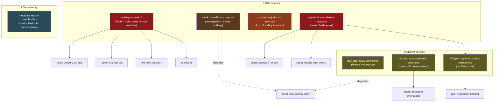
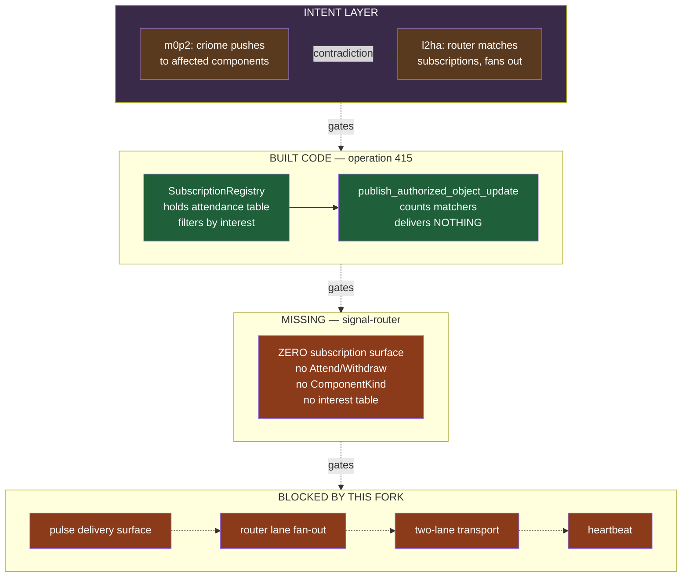
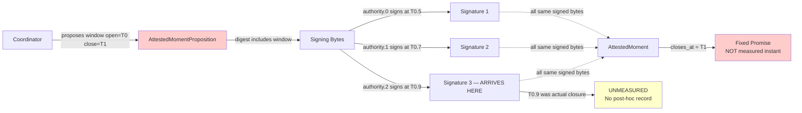
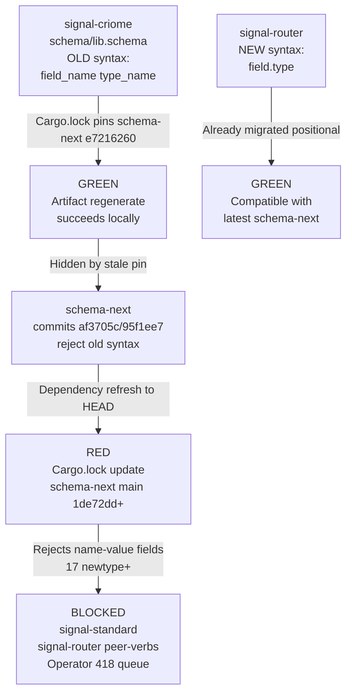
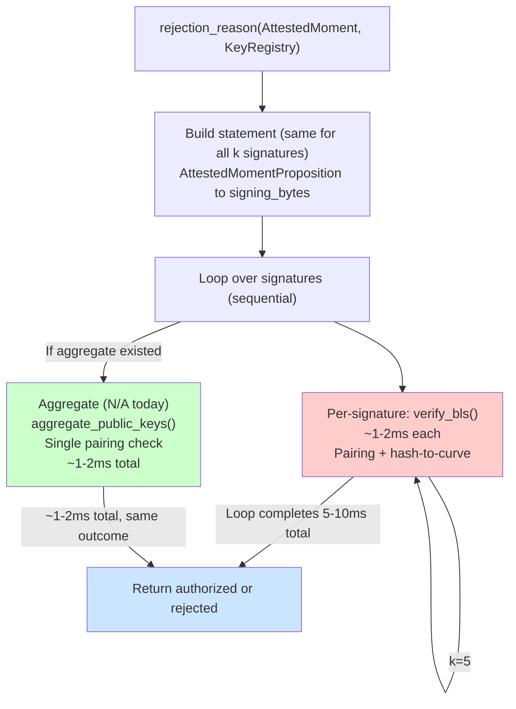
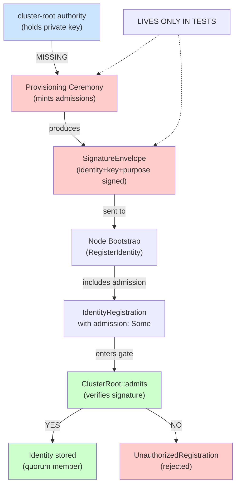
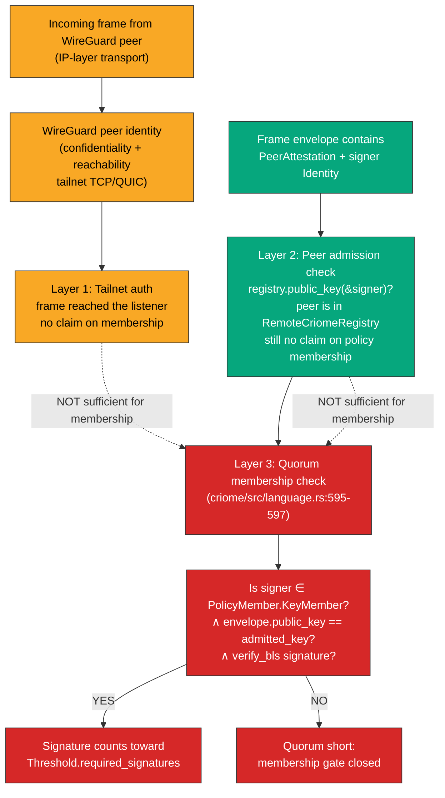
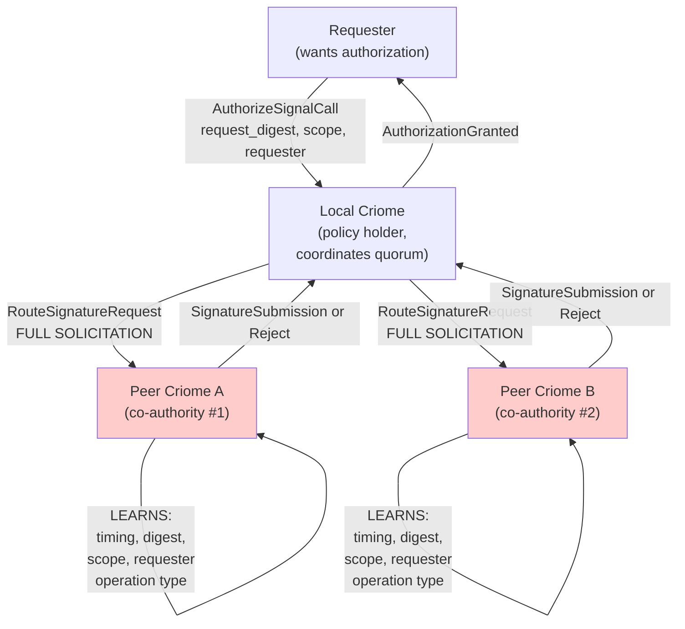

# Design Woes — the open edges of the criome agreement machine

These are the open tensions of the criome agreement-machine design — not
failures. The spine is landed and real on `main`: the **quorum primitive**
(k-of-n BLS over a content-addressed statement), **content-addressed
contracts** (operations keyed by digest), the **attested clock**
(AttestedMoment over a proposed window signed by a threshold of
time-authorities), and the **policy language** (the evaluator in
`criome/src/language.rs`). All of that compiles, runs, and is tested.

What follows are the edges — the places where intent and built code
disagree, where a capability is gated behind one undecided fork, where a
value-prop claim outruns the implementation, or where a safety invariant
is implied but not enforced. Each woe carries its real context, the
actual code that grounds it, a visual, the unblocker, and the lane that
owns the next move. Several need a psyche decision; those are distilled at
the end.

## Top-level woe dependency map

The shape of the blockage matters more than any single woe. Three facts:
the **registry-owner fork** is the hub — it gates the entire pulse/router
fan-out lane. The **schema-syntax migration** gates signal-standard and
all peer-verb additions to signal-criome. The **clock-crystallization**
woe is conceptual — it shapes the value-prop framing but blocks no other
work.



## High severity

### Woe 1 — registry-owner-fork: who owns the object-update fan-out matcher?

The object-update pulse is the mechanism by which authorized state reaches
affected components. The design intent **m0p2** says criome pushes
references to affected components; the design intent **l2ha** (Fork A) says
the router matches subscriptions and fans out references. The built code
contradicts both: criome's `SubscriptionRegistry` (operation 415, criome
commit 4250cbb) holds the attendance table and filters by interest, but
its `publish_authorized_object_update` method only counts matchers
(`subscriber_count`) and delivers nothing. Signal-router has zero
subscription surface — no Attend/Withdraw verbs, no ComponentKind, no
interest table.

This unresolved fork blocks the pulse delivery surface, the entire router
lane's fan-out capability, two-lane transport delivery, and the heartbeat.
It manifests at the intent layer as the m0p2-vs-l2ha contradiction: m0p2
says criome emits and pushes to affected components; l2ha says the router
owns the attendance table and delivers. The designer leans l2ha (keeps
criome cleanest: authenticate and emit, router transports); the operator
built halfway to m0p2 (registry inside criome, but no delivery). Neither
design is currently realized in code.

```rust
// /git/github.com/LiGoldragon/criome/src/actors/subscription.rs:142-152
fn publish_authorized_object_update(
    &mut self,
    update: AuthorizedObjectUpdate,
) -> AuthorizedObjectPublication {
    let subscriber_count = self
        .authorized_object_subscriptions
        .iter()
        .filter(|token| token.interest.matches_update(&update))
        .count();
    self.authorized_object_updates.push(update);
    AuthorizedObjectPublication { subscriber_count }
}
```



**Unblocker.** Decide between two shapes:

1. **Router is sole matcher** (l2ha-faithful): criome emits unfiltered
   references; router holds the attendance table, matches interest, and
   delivers. Keeps criome authentication-only (the wckt boundary).
2. **Criome keeps its internal registry AND router gets one** (double
   filter): criome's registry serves auth-audit/observation; router's
   serves operational delivery.

Then: (1) if l2ha, edit m0p2 via `Clarify`/`Supersede` to reflect router
ownership; (2) design the signal-router Attend/Withdraw surface plus a
durable attendance table keyed by signal-standard `Differentiator`; (3)
implement the match-and-deliver step in the router daemon; (4) specify
socket-level reference delivery plus the pull path; (5) retire the
count-only publish and replace it with an actual delivery mechanism.

**Lane.** designer (psyche-decision) — **RESOLVED: router-sole (psyche-decided):
"use the router for all non-direct message passing."** criome stays
authentication-only and keeps **no operational delivery registry** — any
criome-local subscription surface is observation/audit only; the router is the
**sole operational matcher** for all non-direct passing, with the direct
criome-to-criome agreement lane the only non-router path. Captured: `m0p2`
clarified to the router-sole pulse; `l2ha` and `lt44` were already consistent. The
router `Attend`/`Withdraw` surface + the durable attendance table (keyed by
signal-standard `Differentiator`) and the retirement of criome's count-only
`publish_authorized_object_update` are now **unblocked** (operator lane).

### Woe 2 — clock crystallization a-priori: window fixed before any authority signs

The `AttestedMomentProposition`'s time window `{opens_at, closes_at}` is
part of the signed proposition digest. When `AttestedMomentStatement`
computes its signing bytes, it calls `self.proposition.digest()`, which
serializes the entire proposition including the window fields. This means
the window boundaries are fixed and immutable before the first authority
signs.

The actual woe: there is no measured crystallization instant — the
"closes at" time is a fixed promise made a-priori, not a measured moment
when the k-th required signature actually arrived. If genuine measured
closure is desired ("this moment closed when the 3rd authority signed at
12:34:56.789"), it requires a separate post-hoc attestation object that
does not currently exist in the schema. The current architecture only
supports propose-window-then-k-clocks-attest-it, not
measure-when-it-actually-closed.

The design stakes: the direct lane's real win is that a tighter a-priori
window lets the coordinator propose confident closure boundaries before
signatures arrive, knowing the network term is tight enough that the
window will still close within that interval. This is a capability gain,
not a loss. However, operators expecting measured closure will be
surprised to find only a fixed promise, and any use case requiring
post-hoc closure measurement (audit trails with precise sign-off times) is
blocked. This woe blocks nothing in code — it reframes the value-prop.

```rust
// criome/src/language.rs:226-232 — AttestedMomentStatement signing
pub fn to_signing_bytes(&self) -> Result<Vec<u8>, StatementError> {
    let mut bytes = b"CRIOME-ATTESTED-MOMENT-V1".to_vec();
    self.proposition
        .digest()?           // serializes the entire proposition
        .object_digest()
        .encode_into(&mut bytes);
    Ok(bytes)
}

// signal-criome/src/lib.rs:112-117 — digest serializes window fields
impl AttestedMomentProposition {
    pub fn digest(&self) -> Result<AttestedMomentDigest, AttestedMomentDigestError> {
        rkyv::to_bytes::<rkyv::rancor::Error>(self)  // includes window: {opens_at, closes_at}
            .map(|bytes| AttestedMomentDigest::from_bytes(bytes.as_ref()))
    }
}

// signal-criome/src/schema/lib.rs:456-468 — the struct that gets serialized
pub struct TimeWindow {
    pub opens_at: TimestampNanos,
    pub closes_at: TimestampNanos,
}

pub struct AttestedMomentProposition {
    pub window: TimeWindow,            // fixed in digest before ANY signature
    pub required_signatures: RequiredSignatureThreshold,
    pub authorities: Vec<Identity>,
}
```



**Unblocker.** Keep the a-priori window as the authoritative closure
instant (operator 418 confirmed). The real gain is coordinator-proposed
tighter windows with confidence they close within network latency. If
post-hoc measured closure is genuinely wanted for audit trails or
retro-analysis, add an optional `CrystallizationMoment` schema object that
records `{attested_moment_digest, actual_k_th_signature_arrival_time,
signer_identity}` separately. This is a schema extension, not a core
change.

**Lane.** designer (schema design choice: a-priori vs measured closure) +
operator (who confirms the a-priori lane, not measured).

### Woe 3 — quorum-majority not enforced: sub-majority thresholds enable fork attacks

In partition-tolerant systems, quorum intersection is a fundamental safety
property: any two quorum-sized subsets of participants must share at least
one member, so at most one partition can reach threshold and achieve
consensus. This requires `k > n/2` for a k-of-n quorum.

Criome's AttestedMoment verification (`language.rs:572-607`) accepts any
required signature count that passes three checks: `required > 0`,
`required <= authorities.len()`, and no duplicates. It does NOT enforce
`required > authorities.len()/2`. This allows a malicious operator to
construct a 2-of-5 quorum. In a network partition, partition A `{A, B, C}`
and partition B `{D, E}` can each form a 2-signature quorum and
independently mint valid AttestedMoment timestamps over different
content/windows. The system forks without cryptographic detection,
violating the timestamp monotonicity contract that dependent policies rely
on.

```rust
// /git/github.com/LiGoldragon/criome/src/language.rs:574-578
    fn rejection_reason(&self, registry: &KeyRegistry) -> Option<EvaluationRejectionReason> {
        let authorities = &self.proposition.authorities;
        let required = self.proposition.required_signatures.into_u16();
        if self.proposition.window.opens_at.into_u64()
            >= self.proposition.window.closes_at.into_u64()
            || required == 0
            || required > authorities.len() as u16
            || DuplicateIdentityScan::new(authorities).has_duplicates()
        {
            return Some(EvaluationRejectionReason::TimeNotProven);
        }
```

```
Five authorities: A, B, C, D, E
Configuration: required = 2 (sub-majority; 2 < 5/2.5)

PARTITION A           PARTITION B
  {A, B, C}            {D, E}
    A signs              D signs
    B signs              E signs
  (2 >= 2 OK)          (2 >= 2 OK)
   VALID mint          VALID mint
  Window [10-20]      Window [10-20]
  Content: Hash_X     Content: Hash_Y

FORK: Two disjoint quorums each satisfy the 2-of-5 threshold
and mint AttestedMoment timestamps over different content.
Both pass rejection_reason() check because:
  - required (2) > 0 OK
  - required (2) <= authorities.len() (5) OK
  - no duplicates OK
  - MISSING: required > authorities.len()/2  [2 > 2.5? FALSE]

Dependent policies that assume "any valid AttestedMoment
means a unique canonical timestamp" now face fork exposure.
```

**Unblocker.** Add a majority check: reject AttestedMoment if `required <=
authorities.len() / 2`, OR explicitly annotate the family as fork-unsafe
in schema/docs and reject it during contract admission. The fix is a
one-line validation in `rejection_reason()` (an additional OR condition at
line 577) or an admission-time check ensuring quorum-majority before
storing. Design choice: either a typed invariant (`k > n/2` at
compile/admission time) or a runtime guard (runtime rejection of
sub-majority proposals).

**Lane.** designer.

### Woe 4 — signal-criome schema migration: retired name-value field syntax blocks dependency refresh

signal-criome's schema (`schema/lib.schema`) uses the retired named-field
struct syntax (`DaemonPath { value String }`,
`AuthorizedObjectUpdateToken { subscriber Identity interest
AuthorizedObjectInterest }`), which was explicitly rejected by schema-next
commits af3705c ("reject retired struct field pair syntax") and 95f1ee7
("reject redundant explicit field roles"). The positional/explicit-role
grammar landed in commit 1de72dd ("support explicit structural field
roles") and is now the only accepted syntax (e.g.,
`EndpointTransport { kind.EndpointKind target.String (Auxiliary (Optional
String)) }` as seen in signal-router).

signal-criome currently pins schema-next to e7216260 (before af3705c) via
Cargo.lock, which masks the failure. A dependency refresh to current main
will immediately fail during schema artifact regeneration. This blocks
both signal-standard (which imports signal-criome wire contracts) and
direct-lane peer-verb additions to signal-criome's verb suite.

```
# /git/github.com/LiGoldragon/signal-criome/schema/lib.schema:57-72, 266-269

Lines 57-72 (old syntax — name-value pairs):
  DaemonPath { value String }
  PrincipalName { value String }
  PrincipalId { value String }
  PublicKeyFingerprint { value String }
  BlsPublicKey { value String }
  BlsSignature { value String }
  ObjectDigest { value String }
  ContractDigest { value ObjectDigest }
  OperationDigest { value ObjectDigest }
  AttestedMomentDigest { value ObjectDigest }
  ReplayNonce { value String }
  ContractName { value String }
  AuthorizationRequestSlot { value String }
  AuthorizationScope { value String }
  ContractOperationHead { value String }

Lines 266-269 (multi-field newtype):
  AuthorizedObjectUpdateToken {
    subscriber Identity
    interest AuthorizedObjectInterest
  }
```



**Unblocker.** Migrate signal-criome schema to positional/explicit-role
syntax: convert all 17 newtype definitions from `{ name type }` to
`{ name.type }` form (e.g., `DaemonPath { value.String }`,
`AuthorizedObjectUpdateToken { subscriber.Identity
interest.AuthorizedObjectInterest }`). Apply the same grammar as
signal-router (already done), regenerate Rust artifacts via
schema-rust-next, verify the build is green, then unpin Cargo.lock to
schema-next main. This unblocks dependency refresh and clears the operator
418 critical path.

**Lane.** operator / designer — operator prepares the syntax migration
(systematic field rename + validation), designer validates semantic
equivalence under the new grammar and certifies regenerated artifacts for
wire stability (rkyv layout unchanged).

## Medium severity

### Woe 5 — BLS12-381 signature verification not aggregated on same-message quorum check

In criome's policy-language evaluation, when a quorum collection arrives
(e.g., k=5 signatures from 5 time-authority signers to authorize a
moment), the verifier processes all k signatures in a sequential loop,
performing a full individual BLS12-381 verification per signature (~1-2ms
each, dominated by pairing and hash-to-curve operations). Because all k
signatures cryptographically bind to the identical preimage (the same
`AttestedMomentProposition` serialized once as the statement),
BLS12-381's aggregate verification capability is applicable: the public
keys can be aggregated, a single combined pairing check executed, and the
cost amortized to ~1-2ms total instead of k×(1-2ms).

Without aggregation, post-collection verification becomes a co-dominant
latency source (5-10ms for k=5) that undermines the "direct lane"
architecture's headline latency win. For typical authorization paths
claimed to be 5-10x faster on RTT, the realized win degrades to ~1.5-2x
for small quorums (k=3-5) and worse as k grows, because the verification
stalls gate the final authorization decision. This is not a deferred
optimization — it is a v1 feature that must exist for the architecture's
latency claims to hold.

```rust
// /git/github.com/LiGoldragon/criome/src/language.rs:588-601
        let mut satisfied: Vec<Identity> = Vec::new();
        for signature in &self.signatures {
            if !authorities.contains(&signature.signer) || satisfied.contains(&signature.signer) {
                continue;
            }
            let Some(admitted_key) = registry.public_key(&signature.signer) else {
                continue;
            };
            if matches!(signature.envelope.scheme, SignatureScheme::Bls12_381MinPk)
                && &signature.envelope.public_key == admitted_key
                && admitted_key.verify_bls(&signature.envelope.signature, &statement)
            {
                satisfied.push(signature.signer.clone());
            }
        }
```



**Unblocker.** Implement BLS12-381 aggregate verification as a v1
primitive in the verifier: add an `aggregate_verify_bls(public_keys:
&[BlsPublicKey], signature: &BlsSignature, message: &[u8]) -> bool` method
to the `VerifyBls` trait (or as an associated function on the aggregation
noun), call the underlying blst library's aggregate batch verification,
and refactor the quorum-signature loop in `rejection_reason()` to collect
public keys, then call aggregate verification once. This requires: (1)
reading the blst crate's aggregate verification interface; (2) adding a
wrapper in `master_key.rs` alongside the existing single-signature
`verify_bls`; (3) calling it from the loop to replace sequential calls;
(4) benchmarking the win (target: <2ms for k=5 quorum, vs current
5-10ms). This is not future-work — it must ship with the v1 direct-lane
claim.

**Lane.** designer.

### Woe 6 — cross-node-provisioning-ceremony: cluster-root admission gate built but never minted in production

The cluster-root admission gate (`ClusterRoot::admits` in `admission.rs`)
is fully implemented and tested: it verifies that a registration's
admission envelope is a valid BLS signature from the configured
cluster-root key over the registration statement (identity+key+purpose).
The gate is wired into RegisterIdentity (`registry.rs:96-106`) and rejects
any registration lacking a valid admission when `cluster_root` is
configured.

However, no production code path exists that mints these admission
envelopes. The only place `SignatureEnvelope` admissions are created is in
test fixtures (`daemon_skeleton.rs:930-935`, the
`cluster_root_gates_registration` test). This is a design gap: the gate
verifies a contract that nobody signs in the live system. Every node
bootstrapping into a cluster must have its master public key signed by the
cluster-root authority before registering, but there is no ceremony or
out-of-band mechanism to produce and deliver those admissions. Without
this provisioning path, the cluster-root gate cannot be enabled in
production; enabling it would reject all registration attempts (except
criome's self-registration). This blocks enforcement of the WHO COUNTS
quorum membership decision (from Spirit ermr) at the cluster bootstrap
boundary.

```rust
// admission.rs: the gate verifies (lines 86-101)
pub fn admits(
    &self,
    registration: &IdentityRegistration,
    admission: &SignatureEnvelope,
) -> bool {
    if !matches!(admission.scheme, SignatureScheme::Bls12_381MinPk) {
        return false;
    }
    if admission.public_key != self.public_key {
        return false;
    }
    let statement = RegistrationStatement::from_registration(registration).to_signing_bytes();
    self.public_key.verify_bls(&admission.signature, &statement)
}

// registry.rs: the gate is enforced (lines 96-106)
async fn register(&self, registration: IdentityRegistration) -> CriomeReply {
    if let Some(root) = &self.cluster_root {
        match &registration.admission {
            Some(admission) if root.admits(&registration, admission) => {}
            _ => return rejection(RejectionReason::UnauthorizedRegistration),
        }
    }
    // ... proceed to store registration
}

// But only tests create admissions (daemon_skeleton.rs:930-935)
let statement = RegistrationStatement::from_registration(&admitted).to_signing_bytes();
admitted.admission = Some(SignatureEnvelope {
    scheme: SignatureScheme::Bls12_381MinPk,
    public_key: cluster_root.public_key(),
    signature: cluster_root.sign(&statement),
});
```



**Unblocker.** Design and implement a cluster-root provisioning ceremony:
either (1) an out-of-band Criome CLI command that a cluster operator runs
on a trusted machine holding the cluster-root key to mint and save
admissions (one per node identity), or (2) a pre-bootstrap registration
API that accepts a claim (identity+key+purpose) and returns a signed
admission on behalf of the cluster-root (requires secure delivery of the
signed admission back to the requestor). This ceremony bridges the gap
between the cluster-root authority and node bootstrap, making the gate
enforceable without being a universal gate lock.

**Lane.** designer.

### Woe 7 — IP-layer crypto vs quorum membership: conflation risk in direct peer lane auth

The new design direction from the psyche (Spirit lt44) shifts
transport-layer authentication to the IP level: the tailnet+WireGuard
provides an authenticated, encrypted, identity-pinned pipe that gates
which WireGuard peers can reach the listener. This is cheaper and simpler
than rolling per-frame application-layer TLS/Noise.

However, this creates a **conceptual load-bearing distinction that the
implementation must not blur**: being a valid WireGuard peer (transport
auth) is categorically different from being a member of a quorum
(membership auth for threshold decisions). The code at
`criome/src/language.rs:595-597` shows the real quorum check: each
signature must come from an admitted Identity
(`registry.public_key(&signature.signer)`), and that key must satisfy the
BLS signature verification. This is content-addressed to the operation's
proposal and cannot move to the IP layer.

The woe is twofold: (1) the design's auth model splits cleanly (tailnet
for reachability; BLS for content), but a WireGuard peer identity does not
directly map to a criome-admitted Identity, and (2) nothing yet prevents
conflating "this frame arrived from a WireGuard peer" (transport fact)
with "this signer counts toward k-of-n" (membership fact). The
cluster-root admission gate (`admission.rs` lines 86-100) gates peer
registration into RemoteCriomeRegistry, but the schema and the
peer-response handler (not yet built) must keep the two checks separate:
peer-admission gates *who can talk*; policy membership + BLS verification
gates *whose signature counts*. These are necessary-not-sufficient; both
must hold.

```rust
// Quorum membership check (content-addressed, BLS-based)
// criome/src/language.rs:595-597
if matches!(signature.envelope.scheme, SignatureScheme::Bls12_381MinPk)
    && &signature.envelope.public_key == admitted_key
    && admitted_key.verify_bls(&signature.envelope.signature, &statement)
{
    satisfied.push(signature.signer.clone());
}

// Cluster-root peer admission gate (IP-layer, identity registration)
// criome/src/admission.rs:86-100
pub fn admits(
    &self,
    registration: &IdentityRegistration,
    admission: &SignatureEnvelope,
) -> bool {
    if !matches!(admission.scheme, SignatureScheme::Bls12_381MinPk) {
        return false;
    }
    if admission.public_key != self.public_key {
        return false;
    }
    let statement = RegistrationStatement::from_registration(registration).to_signing_bytes();
    self.public_key.verify_bls(&admission.signature, &statement)
}
```

Design-level distinction from report 683 (three separate checks that
compose `necessary-not-sufficient` — lane admission does not imply
membership):

- Transport auth: `WireGuard/tailnet peer-key gating at L3 (cross-host)` — SO_PEERCRED is intra-host only and does not apply across hosts; under the IP-layer-crypto direction there is **no per-frame transport signature** (the `PeerAttestation` envelope is dropped), the channel itself is authenticated at the IP layer, and peer admission (layer 2) is a one-time cluster-root check recorded in `RemoteCriomeRegistry`, not a per-frame check
- Quorum membership: `BLS signature over PolicyMember.Identity ∈ Threshold.members ∧ admitted in KeyRegistry`
- Peer admission: `cluster-root-signed CRIOME-PEER-ADMISSION-V1 statement into RemoteCriomeRegistry`



The three-layer stack shows the **non-implication**: passing layer 1 or 2
does not grant layer 3. The WireGuard identity is a transport artifact; it
must not be mistaken for a policy-membership identity. The peer-responder
handler (build-need 6, not yet written) must verify all three before
incrementing the satisfied-member count.

**Unblocker.** Explicitly document and enforce the three-check boundary in
the signal-criome schema and the peer-responder handler. Specifically: (1)
name the transport-layer peer identity separately from the quorum-member
Identity in PeerAttestation and the SolicitOperationSignature envelope, to
make the distinction syntactic; (2) in the peer-responder handler
(`criome/src/actors/peer_responder.rs`), perform all three checks in
sequence and reject early if any fails, with distinct rejection reasons
(`NotAnAdmittedPeer` vs `NotAPolicyMember` vs `InvalidSignature`); (3) add
a test case that verifies an admitted peer whose master key is valid at
layer 2 but not in the contract's PolicyMembers is correctly rejected. The
clause from report 683 (section "Auth model — two independent layers",
lines 361-364) is the authoritative design; codify it into the handler's
control flow so the distinction cannot be accidentally conflated later.
This is a code clarity + testing task, not a design change.

**Lane.** operator-op (handler implementation + test coverage + schema
clarity).

## Low severity

### Woe 8 — metadata leak to coauthorities in quorum-signature routing

Quorum authorization policies require signatures from peer criome daemons.
When a local criome invokes RouteSignatureRequest to solicit a peer's
signature, it transmits the complete `SignatureSolicitationRoute`
containing request_slot, request_digest, contract name, operation, scope,
requester identity, and required_signer identity. A peer criome receiving
this solicitation necessarily learns the exact timing, digest-identity,
scope, and caller of every operation it is asked to co-authorize.

This is an irreducible architectural consequence: the peer cannot
cryptographically validate or sign what it cannot see. It is not a
transport violation (the signaling path is correctly gated), but a
design-level information leakage inherent to the k-of-n quorum model. A
malicious or compromised peer criome can enumerate the request patterns
its co-authorities encounter, correlate timing with external events, or
build an oracle of approved/denied patterns. Trusted peers can deduce
operation timing and success rates even if they sign conservatively. This
is low severity because mitigation exists: documentation requiring trust
discipline, and optional collapsing of fine-grained decline reasons to a
coarse PolicyRefused for untrusted callers.

```rust
// From signal-criome schema: full solicitation transmitted to peer
pub struct SignatureSolicitation {
    pub request_slot: AuthorizationRequestSlot,      // Operation identity
    pub request_digest: ObjectDigest,                 // Content hash (reveals what is being authorized)
    pub contract: ContractName,                       // Policy contract being evaluated
    pub operation: ContractOperationHead,             // Operation type and timing
    pub scope: AuthorizationScope,                    // Permission scope requested
    pub requester: Identity,                          // Which entity is asking
    pub required_signer: Identity,                    // Which peer must sign
}

pub struct SignatureSolicitationRoute {
    pub solicitation: SignatureSolicitation,          // All above fields
    pub routed_to: Identity,                          // Peer identity receiving this
}

// From criome authorization.rs: solicitation stored durably after receipt
async fn route_signature_request(&self, route: SignatureSolicitationRoute) -> CriomeReply {
    let request_slot = route.solicitation.request_slot.clone();
    let routed_to = route.routed_to.clone();
    if self.store_signature_solicitation(route).await.is_err() {
        return rejection(RejectionReason::MalformedRequest);
    }
    CriomeReply::SignatureRouteReceipt(SignatureRouteReceipt {
        request_slot,
        routed_to,
    })
}

// Solicitation is persisted durably in sema-engine tables
fn store_signature_solicitation(
    &self,
    route: SignatureSolicitationRoute,
) -> crate::Result<StoredSignatureSolicitation> {
    let stored = StoredSignatureSolicitation::new(route);  // Stores entire solicitation
    self.tables.put_signature_solicitation(&stored)?;
    Ok(stored)
}
```

Citations: `/git/github.com/LiGoldragon/signal-criome/src/schema/lib.rs`
(SignatureSolicitation struct);
`/git/github.com/LiGoldragon/criome/src/actors/authorization.rs:172-182`
(route_signature_request method).



Information exposure layers:

1. **Immediate visibility** — peer receives complete SignatureSolicitation in the RouteSignatureRequest frame.
2. **Durable store leak** — solicitation persisted in the peer's criome.sema (survives daemon restart, forensic inspection).
3. **Attestation correlation** — peer observes request_digest (what was authorized), timestamp (when), requester identity (who), scope (how much access).
4. **Enumeration oracle** — malicious peer correlates multiple solicitations to build approval/denial patterns without submitting valid signatures.
5. **Timing side-channel** — peer observes how long the local criome deliberates (escalation-to-approve flow) before responding to their signature submission.

**Unblocker.** Two moves: (1) **Document trust discipline** (operator
decision): require that quorum peers be in the same administrative domain
and subject to the same operational security posture. Policy decision: "Do
not place untrusted parties in a coauthority set," documented in criome
`ARCHITECTURE.md` under "Trust model and coauthority selection" with an
explicit threat warning. (2) **Collapse decline reasons for untrusted
peers** (designer work): implement a classification distinguishing
admitted-peers (receive fine-grained AuthorizationDenialReason:
RequestDigestMismatch, PolicyViolation, etc.) from external/untrusted
callers (receive only coarse PolicyRefused). Requires (a) a
peer-trust-level table (operator-configured), (b) conditional-reason
wrapping in the AuthorizationDenied reply, (c) test witnesses asserting
reason hiding for untrusted peers. This limits the enumeration-oracle
surface without blocking legitimate cross-domain quorum (both parties must
opt into a peer-trust declaration).

**Lane.** designer.

## Resolved this session

Three items that were prior open questions are now closed.

### Quorum-member distinctness

Operator 418 confirms current criome rejects duplicate quorum members
(`DuplicateIdentityScan::new(authorities).has_duplicates()` in
`rejection_reason()`) and duplicate operation signatures do not count
twice (the loop guards with `satisfied.contains(&signature.signer)`). The
operator/407 blocker is closed — a single signer cannot pad a quorum by
submitting the same signature twice or appearing twice in the authority
set.

### Signature-envelope placement

Operator 418 holds the signal-frame crypto-agnostic, and the psyche's
IP-layer-crypto direction (Spirit lt44) removes the per-frame transport-BLS
envelope entirely — there is no PeerAttestation transport signature to
place. BLS stays only for quorum content, criome-local now, and lifts to
signal-standard only once a second component proves the shape. The "where
does the envelope live in the frame" question dissolves: nothing
transport-signed travels in the frame.

### EscalateToPsyche — reclassified NOT a woe

This is intentionally an inert dead-letter until a psyche-facing UI
exists. Spirit gc0n was `Clarify`-ed this session to record exactly this:
the terminal human rung is UI-gated by design. An authorization that
escalates to the psyche has nowhere to surface until there is a surface;
the inert handler is correct, not a gap. Removed from the woe list.

## Recommended next order

From operator 418, the queue that clears the most blockage with the least
churn:

1. **Positional schema hygiene** — migrate signal-criome to the
   explicit-role grammar (Woe 4). Unpins the schema-next dependency and
   clears the critical path.
2. **signal-standard** — refresh against the migrated signal-criome wire
   contracts.
3. **router Attend/Withdraw** — build the router subscription surface,
   contingent on the registry-owner fork decision (Woe 1).
4. **The majority invariant** — add the `k > n/2` check (Woe 3), a
   one-line safety fix.
5. **The direct criome peer-lane schema** — name the three auth layers
   syntactically (Woe 7) and stand up the peer-responder handler.

## Open decisions for the psyche

Distilled from the high and medium woes — these need a psyche call before
the dependent work can land cleanly:

1. **Who owns the fan-out matcher** (Woe 1, hub): **DECIDED — router-sole**
   (psyche: "use the router for all non-direct message passing"). The router is
   the sole operational matcher; criome keeps no operational delivery registry
   (observation/audit only); the direct criome lane is the only non-router path.
   `m0p2` was clarified to match; `l2ha`/`lt44` already consistent. The router
   `Attend`/`Withdraw` + attendance-table work is unblocked (operator).

2. **Attested clock: a-priori window vs measured closure** (Woe 2): keep
   the fixed a-priori window as authoritative (operator 418's lean, gains
   coordinator-proposed tight windows) — and if measured closure is wanted
   for audit trails, authorize the optional `CrystallizationMoment`
   extension.

3. **Quorum-majority invariant** (Woe 3): enforce `k > n/2` always
   (typed-or-runtime), or permit sub-majority families with an explicit
   fork-unsafe annotation. Safety versus flexibility.

4. **BLS aggregate verification as a v1 gate** (Woe 5): confirm aggregate
   verification ships with the v1 direct-lane latency claim rather than
   being deferred — the headline 5-10x degrades to ~1.5-2x without it.

5. **Cluster-root provisioning ceremony shape** (Woe 6): out-of-band CLI
   minting on a trusted machine, versus a pre-bootstrap registration API
   that returns signed admissions. Required before the cluster-root gate
   can be enabled in production at all.
