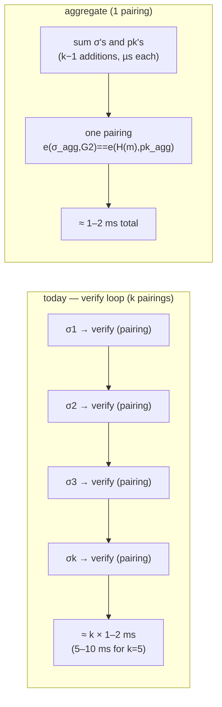

# Why BLS aggregate verification is a v1 requirement, not an optimization

Companion to Woe 5 in `3-woes.md`. The psyche leaned "yes, ship it in v1" and
asked for the explanation. Here it is, ground-up.

## 1. What one BLS signature verification actually costs

criome uses BLS12-381 (min-pk variant, per Spirit `psc6`). A BLS signature is a
single point on an elliptic curve; verifying one signature `σ` by public key `pk`
over message `m` is the pairing equation

```
e(σ, G2) == e(H(m), pk)
```

where `H(m)` hashes the message onto the curve (hash-to-curve) and `e(·,·)` is a
**pairing** — a bilinear map computed by the Miller loop plus a final
exponentiation. The pairing is the expensive primitive in pairing-based crypto:
on commodity hardware one verification is roughly **1–2 ms**, almost all of it in
the two pairings and the hash-to-curve. Everything else (point comparisons,
deserialization) is microseconds.

The number to hold onto: **one BLS verify ≈ one hash-to-curve + a pairing ≈
1–2 ms**, and that cost is *per signature* when you verify them one at a time.

## 2. How criome verifies a quorum today — k pairings in a loop

When a k-of-n quorum arrives, the evaluator walks the signature vector and
verifies each one independently:

```rust
// criome/src/language.rs:588-601 (the quorum-satisfaction loop)
let mut satisfied: Vec<Identity> = Vec::new();
for signature in &self.signatures {
    if !authorities.contains(&signature.signer) || satisfied.contains(&signature.signer) {
        continue;
    }
    let Some(admitted_key) = registry.public_key(&signature.signer) else { continue };
    if matches!(signature.envelope.scheme, SignatureScheme::Bls12_381MinPk)
        && &signature.envelope.public_key == admitted_key
        && admitted_key.verify_bls(&signature.envelope.signature, &statement)  // <-- one pairing, EVERY iteration
    {
        satisfied.push(signature.signer.clone());
    }
}
```

`verify_bls` is called once per signature. k signatures ⇒ **k pairings** ⇒
`k × (1–2 ms)`. For a 5-authority quorum that is **5–10 ms** of pure verification,
serial, after all the signatures are already in hand.

## 3. The fact that makes aggregation possible: one shared message

Every authority in a criome quorum signs the **identical** preimage — the same
content-addressed statement (`CRIOME-ATTESTED-MOMENT-V1 ‖ proposition.digest()`
for a time quorum; the `OperationStatement` for an operation quorum). They are not
signing k different things; they are each signing the same one thing. This is the
**same-message** case, which is the easy and cheap case for BLS aggregation — the
exact pattern Ethereum's consensus uses to verify thousands of attestations over
one block root with a single check.

## 4. How aggregate verification collapses k pairings to one

BLS signatures are **homomorphic**: points add. Because all k signatures cover the
same `m`, their sum verifies against the sum of the public keys with a *single*
pairing:

```
σ_agg = σ_1 + σ_2 + … + σ_k          (k−1 curve additions — microseconds each)
pk_agg = pk_1 + pk_2 + … + pk_k       (k−1 curve additions — microseconds each)
verify once:  e(σ_agg, G2) == e(H(m), pk_agg)     (ONE pairing)
```

The expensive primitive — the pairing — drops from **k to 1**. The added work
(summing points) is linear in k but each addition is ~microseconds, three to four
orders of magnitude cheaper than a pairing. So total verification goes from
`k × (1–2 ms)` to `≈ 1–2 ms + negligible`.



The accept/reject outcome is **identical** to the loop — this is not a different
trust model, it is the same verification computed once instead of k times.

## 5. Why this is load-bearing for the direct lane (Amdahl, basically)

The direct criome lane (`lt44`) exists to cut the **network term** of
time-sensitive quorum signing: routing each signing round through the general
fabric is ~5–10 ms; a direct tailnet hop is ~0.5–1 ms, and with parallel fan-out
to all authorities the wall-time to k contributions is the *k-th fastest peer
RTT*, not the sum. That is the headline "5–10×."

But after collection the coordinator must **verify** the k contributions before it
can assemble the `AttestedMoment` and run `EvaluateAuthorization`. If verification
is the serial loop (~5–10 ms for k=5), then you have shaved the network term and
left an equal-sized, unoptimized verify term sitting right behind it:

```
end-to-end ≈ network_term + verify_term

  today (loop):       ~1 ms (direct net) + ~5–10 ms (k pairings)  → verify dominates
  with aggregate:     ~1 ms (direct net) + ~1–2 ms (one pairing)  → both small
```

Optimizing the network term while leaving a co-dominant verify term is the classic
Amdahl trap: the realized speedup collapses from ~5–10× to **~1.5–2×** for small
quorums, and *worse* as k grows (the network term stays ~flat with parallel
fan-out while the verify loop grows linearly). So the latency claim that justifies
building the direct lane **only holds if verification is aggregated**. That is why
it is a v1 gate, not a "later" optimization — it is part of the same value
proposition.

## 6. The one caveat — and why it is cheap for criome

Naive same-message aggregation has a known weakness, the **rogue-key attack**: an
adversary who can choose a public key after seeing the others can craft a key that
cancels honest signers, forging an aggregate. The two standard defenses:

- **Proof-of-possession (PoP):** each key proves it owns its secret at
  registration time; then `FastAggregateVerify` (the blst/Ethereum same-message
  path) is safe.
- **Randomized aggregation:** combine with per-key scalar coefficients derived
  from a hash, so no key can cancel another.

criome gets the PoP defense **almost for free**, because keys are not
adversarially injected — registration is gated by the **cluster-root admission**
(`ermr`, `admission.rs ClusterRoot::admits`). The cluster-root only signs a key
into the registry after the holder demonstrates possession, so the admission
ceremony *is* the proof-of-possession hook. With admitted-only authorities and
PoP-on-admission, `FastAggregateVerify` is the correct, safe primitive.

## What "ship it in v1" concretely means

1. Add an `aggregate_verify` path beside the existing single `verify_bls` in
   `criome/src/master_key.rs`, calling blst's min-pk same-message aggregate
   verification (the `FastAggregateVerify` shape).
2. Fold proof-of-possession into the cluster-root admission flow (a key is only
   admitted with a PoP), so the fast path is sound.
3. Refactor the `language.rs` quorum loop: collect the admitted public keys, sum,
   and verify once instead of per-signature. Keep the distinctness and
   authority-membership guards exactly as they are.
4. Benchmark on representative hardware: target < ~2 ms for k=5 versus today's
   5–10 ms, and confirm the verify term sits *below* the direct-lane network term
   before claiming the latency win.

It is not a new cryptographic scheme — it is the library's aggregate path plus a
PoP hook criome's admission flow already wants — so the risk is low and the win is
exactly the difference between the direct lane delivering its headline speedup or
delivering ~2×.
