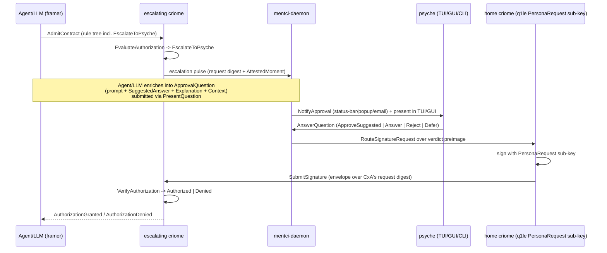
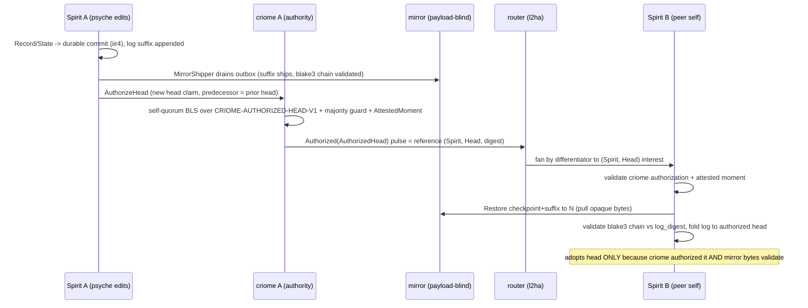

# 685.3 — The cross-machine self: Mentci, criome tiers + keystore, and criome-holds-the-head

A designer review of the psyche's brain-dump against the proof-of-concept and
the landed main, plus the design that gets the PoC further. Written for the
psyche to read after a break. Companion files in this directory:
`0-frame-and-method.md` (the frame) and the sub-agent grounding/critique that
fed this synthesis.

## 1. The throughline

One picture connects every record from this session. **The mirror is the
psyche's cross-machine self** (nfvm): Spirit on each of the owner's machines is
the *same* intent store, and **criome is the authorizing organ** that decides
which head is canonical — so a cross-machine edit is "a criome-authorized
cluster-propagated change," and the self cannot fork. Around that spine sit the
other three records:

- **Mentci** (7x5z) is the human approval surface that finally fills criome's
  one architecturally-complete-but-dead-lettered hole: the `EscalateToPsyche`
  outcome. criome can decide "I can't authorize this alone — ask the human,"
  but today that decision is returned to the caller and dropped. Mentci is the
  organ that catches it, frames it for the psyche, and turns the human answer
  into a signed verdict criome can verify.
- **criome tiers** (9qm8, Low/exploratory) let one host run a privileged
  *system criome* and a per-user *home criome* — two deployment profiles of one
  component, not a contract split.
- **The encrypted multi-key store** (q1le) is the production successor to
  today's single 0600 master-key file: a self-start home key plus per-purpose
  sub-keys, rotation, hardware later. It is what lets the home criome be both
  the head-authority's signing key (nfvm) and the holder of Mentci's
  `PersonaRequest` sub-key (7x5z).

The unifying noun is **criome's signing authority**. Mentci asks criome to
sign a verdict; the head loop asks criome to sign "head N is canonical"; the
keystore is where those signing keys live; the tiers are which criome owns
which keys. Four records, one organ.

## 2. State of play — landed vs designed vs absent

Bracketed text summarises the captured intent record; it is not a verbatim
quote.

| Decision | Current state | Maps to on main | Key implication |
|---|---|---|---|
| **7x5z Mentci** — [psyche-facing criome approval component: daemon + TUI + NOTA CLI; presents escalated questions with LLM-proposed answer + explanation + context; returns the psyche answer as the human adjudication rung] | **Partial.** Data model + MVU **landed**; transport + daemon + verdict path **absent** | mentci-lib `approval.rs` (full `ApprovalQuestion/Decision/State` state machine, tests green), `cmd.rs` (`NotifyApproval`/`SubmitApproval`), `event.rs` (`ApprovalQuestionArrived`). criome `EscalateToPsyche` landed + tested (language.rs:318, composition 645-680). **No** `signal-mentci`, **no** mentci daemon, **no** verdict egress | The approval model is production-ready data with zero transport. criome can escalate; nothing receives it. Mentci is the missing receiver — and it must return a **signature**, not trusted UI text |
| **9qm8 criome tiers** — [criome MAY run as >1 deployment instance: privileged system criome + per-user home criome any local client connects to; per-deployment not per-contract; Low/exploratory; psyche sole owner] | **Absent as code; concept only.** Realizable today with **zero** schema change | criome ARCHITECTURE already states "many criome daemons, one per Unix user." Tiers = two systemd-unit profiles of the one binary, differing in Unix owner + paths + cluster-root anchor in `CriomeDaemonConfiguration` | No new component machinery. The risk is over-building it: a typed `DeploymentTier` field would leak a privilege distinction into the **contract**, which 9qm8 explicitly does not want |
| **q1le keystore** — [encrypted multi-key store: self-start key readable by owning user = home private key, plus sub-keys; rotation; hardware later; extends psc6] | **Absent.** Today is **single** unencrypted-at-rest master key | criome `src/master_key.rs` (`MasterKey`, bare blst secret, raw 0600 file, `load_or_generate`). `KeyPurpose [CriomeRoot PersonaRequest AgentRequest ReleaseAuthorization HostPublication]` already exists (signal-criome lib.schema:77) — it **is** the sub-key partition | The `KeyPurpose` enum is the keystore's pre-existing skeleton. q1le turns one secret into a per-purpose custodian. This is a net security **improvement** over the 0600 plaintext, not a regression |
| **nfvm cross-machine head** — [the mirror is the psyche cross-machine self; criome is authority on the latest authorized head Spirit fetches; cross-machine editing is a criome-authorized cluster-propagated change; mirror aspect may fold into the Spirit daemon] | **Designed here; absent as code.** Every **ingredient** is landed | criome quorum (language.rs, 680 PoC, 15 tests), `AttestedMoment` (ay3y), `AuthorizedObjectReference` + differentiator fan-out (680), direct lane (lt44/683), Spirit `DatabaseMarker {CommitSequence StateDigest}` (signal-spirit signal.schema:126), Spirit `MirrorShipper`, the mirror's `HeadForked`/`SequenceGap`/`DigestMismatch` walls. **No** `AuthorizedObjectKind::Head`, **no** `MirrorAdopter` | The head loop is mostly **composition** of landed parts: add `Head` to the closed kind sum, a `CRIOME-AUTHORIZED-HEAD-V1` preimage, and a `MirrorAdopter` (the inverse of the shipper). The no-fork guarantee is the load-bearing new constraint |

Three cross-cutting facts the grounding confirmed against source:

- **criome's escalation surface is architecturally complete and dead-lettered.**
  `EscalateToPsyche` is the third variant of `EvaluationDecision`
  (lib.schema:200-204), produced at language.rs:318, and correctly bubbled
  through `all`/`any` composition (language.rs:645-680, verified). The root
  actor returns it to the caller with no downstream handler. This is the gap
  Mentci fills.
- **The cluster-root admission gate is real and is load-bearing.**
  `src/admission.rs` admits an identity into the registry only when the
  cluster-root signed `CRIOME-REGISTRATION-ADMISSION-V1` over
  identity+key+purpose. A persona key is **not** verifiable by a criome that
  has not admitted it. The provisioning ceremony that does this admission is
  grounded as **not implemented** — this is the strongest open risk (§6).
- **The Woe-3 majority guard is partially present.** The quorum-majority check
  (`required > authorities.len()`) exists for `AttestedMomentStatement`
  (language.rs:578) and the membership-scoped quorum guards `required >
  members().len()` (line 414) — but both use `>` against the **full** member
  count, i.e. "not more than everyone," **not** the fork-safe `k > n/2`
  majority. The cross-machine head needs the true majority invariant, and it is
  not yet there.

## 3. Mentci — the human-adjudication rung as a real signing principal

### 3.1 The shape in one sentence

Mentci is a normal component triad whose daemon turns one escalating criome's
`EscalateToPsyche` outcome into a psyche-authored, BLS-signed verdict the
escalating criome verifies — making the human-adjudication rung (gc0n) a
signing principal rather than a dead letter.

Canonical spelling: the component/daemon is `mentci` (the `mentci-egui` /
`mentci-lib` repos already use it); **Mentci** is the human-facing product
name; the policy component is `criome` (domain
`prometheus.goldragon.criome`).

### 3.2 Why a whole component, not a mentci-egui pane

The grounded gaps are decisive. A pane cannot (a) own a long-lived subscription
across many escalations — the very reason the TUI exists per criome's
ARCHITECTURE; (b) hold a signing key to mint a verdict; (c) be the meta
authority of its own criome (9qm8). So Mentci is a daemon with two contracts,
and `mentci-egui` / `tui-mentci` / the `mentci` CLI / notification clients
become **thin clients** of it. mentci-lib stays the heavy shared library — its
MVU surface is reused verbatim.

The triad (honoring two-contracts-per-component):

```
mentci/                         runtime daemon (NEW)
  src/bin/mentci-daemon.rs       long-lived daemon, one binary rkyv startup arg
  src/bin/mentci.rs              thin NOTA CLI (one record in, one out)
  src/lib.rs                     re-uses mentci-lib approval model + MVU
signal-mentci/                  working wire contract (NEW)
  schema/lib.schema              ApprovalQuestion delivery + verdict return + subscription
meta-signal-mentci/             meta authority/configuration (NEW)
  schema/lib.schema              MentciDaemonConfiguration + persona/home-criome binding
```

The **escalating criome side needs no new repo**: it already emits
`EscalateToPsyche` and already has the authorized-object pulse
(`ObserveAuthorizedObjects` / `AuthorizedObjectUpdate`) and routed-signature
surfaces (`RouteSignatureRequest` / `SubmitSignature`) in signal-criome. The
new `signal-mentci` contract is the *psyche-presentation* layer (a question
carrying suggested-answer + explanation + context, richer than criome's
reference-only pulse).

### 3.3 The boundary that makes this correct

Per "Criome verifies; Persona decides" — **Mentci IS the decider surface.**
The escalating criome does NOT call Mentci directly; that would put delivery
policy inside criome and break the boundary. Instead the escalation flows OUT of
criome as a typed outcome; Mentci (running its own criome) subscribes, frames
it for the psyche, collects the human answer, asks its home criome to sign a
verdict over the escalating criome's exact request digest, and the escalating
criome verifies that signature like any other quorum signature. **The escalating
criome never trusts Mentci's UI — only Mentci's BLS signature over the
canonical digest.** That is the gc0n crux: the human's answer is delivered as a
signature, not as text.

### 3.4 The round trip



"Approve the suggested answer" signs the suggested-answer preimage; "Answer X"
signs a verdict carrying X; "Reject" submits an `AuthorizationRejection`;
"Defer" submits nothing and keeps the question pending. `EscalateToPsyche` is
the top rung of the ladder, and the persona's signed verdict satisfies it.

### 3.5 The two new contracts (sketched)

`signal-mentci` (working surface — presentation + verdict return):

- Requests: `(PresentQuestion ApprovalQuestion)`, `(AnswerQuestion ApprovalVerdict)`,
  `(ObservePendingQuestions QuestionObservation opens PendingQuestionStream)`,
  `(RetractQuestion QuestionToken)`.
- Replies: `QuestionPresented`, `VerdictAccepted`, `PendingQuestionSnapshot`,
  `QuestionRetracted`, `Rejection`.
- Core types mirror the landed mentci-lib model as wire types:
  `ApprovalQuestion { identifier source prompt suggested_answer explanation context }`;
  `ApprovalSource [CriomeEscalation AgentQuestion LocalSystemPrompt]`;
  `ApprovalVerdict { identifier decision }`;
  `ApprovalDecision [ApproveSuggestedAnswer Reject (Answer ApprovalAnswer) Defer]`.
  Each escalation-sourced question carries the escalating criome's
  `request_digest` + `AttestedMoment` so the verdict signs the right preimage.
  Cross-import the criome digest/stamp types from `signal-criome:lib:` rather
  than re-declaring (the same single-source rule meta-signal-criome already
  uses).

`meta-signal-mentci` (meta authority — startup + reconfiguration):

- `MentciDaemonConfiguration { socket_path home_criome_socket persona_identity notification_clients }`
  — names which criome to ask for verdict signing, which persona `Identity` is
  the signing principal, which notification clients are enabled.
- `(Configure MentciDaemonConfiguration)` -> `Configured` / `ConfigurationRejected`
  / `RequestUnimplemented`, mirroring meta-signal-criome exactly.

### 3.6 How it maps onto mentci-lib (minimal new surface)

mentci-lib is reused almost wholly: `approval.rs` state machine, the
`Cmd::NotifyApproval` / `Cmd::SubmitApproval` variants,
`EngineEvent::ApprovalQuestionArrived`, `UserEvent::SelectApproval` /
`AnswerApproval` — all landed and tested. What changes:

- `Cmd::SubmitApproval` is wired to a `RouteSignatureRequest` to the home
  criome (not a fabricated direct submit).
- A new `EngineEvent` source — the `signal-mentci` `PendingQuestionStream` —
  feeds `ApprovalQuestionArrived`.
- The clean split: **mentci-daemon owns the criome links and verdict-signing
  orchestration; the GUI/TUI clients hold only a `signal-mentci` link to
  mentci-daemon.** Heavy MVU logic stays in mentci-lib; clients stay thin,
  exactly as mentci-lib's INTENT demands. `mentci-egui`'s `todo!()` approval
  render bodies fill in against the already-typed `ApprovalView`.

## 4. criome tiers (exploratory, Low) + the encrypted multi-key store

Two coupled additions to today's daemon, one design because they share one noun
(the daemon's key custody) and one boundary (single Unix-user authority).

### 4.1 Tiers — two deployment profiles of one binary (9qm8, exploratory)

The observation that keeps this cheap: **a criome instance is already nothing
but a daemon + its socket + its key custody + its meta authority,** and "many
criome daemons, one per Unix user" is already the topology. So "system vs home
criome" is not new machinery — it is two named profiles of the existing single
component, differing only in (i) which Unix user owns the meta socket, (ii)
where socket/store/key paths live, (iii) what the cluster-root grants that
instance.

- **Home criome** — runs as the login user; socket/store/key under
  `${XDG_RUNTIME_DIR}/criome/` + `${XDG_DATA_HOME}/criome/`; its self-start key
  IS "his home private key" (q1le), decryptable only by that user. This is the
  instance every local client (Mentci, mind, spirit, router) connects to by
  default. The psyche's personal trust boundary on that machine.
- **System criome** — runs as a privileged service user under a system path
  (`/run/criome/system.sock`, `/var/lib/criome/`); holds host-scoped
  identities (Host/Cluster purposes); chains to the cross-machine cluster-root.
  A home criome that needs a host-level fact routes to the system criome as a
  **peer** over the already-designed cross-criome routing — no new transport.

Both are the same binary speaking the same two contracts, so "any local client
connects to" is satisfied by socket discovery (home first, system as named
peer). The tier lives entirely in the binary startup config — no flag, no third
contract, no code fork.

**Recommendation, given Low certainty:**

- **Option A (recommended)** — ship the keystore now; treat tiers as pure
  deployment profiles realizable today with **zero** schema change (two systemd
  units of one binary).
- **Option B (do NOT adopt)** — a typed `DeploymentTier { Home, System }`
  config field so a home instance refuses host-scoped purposes. This is the one
  sub-option that **risks contradicting 9qm8** ("per-deployment/privilege not
  per-contract") by leaking the distinction into the contract. If a home
  instance must refuse host purposes, enforce it by **which `KeyPurpose`
  sub-keys are provisioned** into that instance's keystore — a deployment fact,
  not a contract discriminator.
- **Option C** — do nothing until a client actually needs a privileged fact a
  home criome cannot give (the cleanest reading of "Low/exploratory").

### 4.2 The keystore (q1le — the real build)

Replace `MasterKey` (a bare `SecretKey`) with a layered `KeyStore`:

- **`KeyStore`** is the custody noun. It holds the decrypted **self-start key**
  (the home private key) in `mlock`'d, zero-on-drop memory, plus a map of
  derived/wrapped **sub-keys** keyed by `KeyPurpose`. Every operation today on
  `MasterKey` (sign, public_key, fingerprint) becomes a method selecting a key
  by purpose: `KeyStore::sign(purpose, message)`. The existing `KeyPurpose`
  enum (`CriomeRoot`, `PersonaRequest`, `AgentRequest`, `ReleaseAuthorization`,
  `HostPublication`) **is** the sub-key partition — so Mentci can hold a
  `PersonaRequest`-scoped sub-key without the `CriomeRoot` secret.
- **At-rest encryption.** The on-disk artifact is no longer 32 raw secret
  bytes; it is a sealed `KeyStoreFile`. The self-start key is sealed under a KEK
  derived (HKDF-blake3) from a unit the owning user controls — either a
  passphrase submitted over the encrypted `meta-signal-criome` session
  (interactive unlock each boot) or a user-readable wrap-key the login session
  already unlocks (true self-start). Sub-keys are sealed under the self-start
  key; sub-key plaintext never touches disk.
- **Sub-key derivation.** Labeled HKDF from the self-start seed with a
  domain-separated label per `KeyPurpose` (`CRIOME-SUBKEY-DERIVE-V1` + purpose
  tag) — derive-on-load (nothing stored) or store-sealed (rotation
  independence). Deterministic; a method on the seed-bearing type, never a free
  function.
- **Rotation.** A `RotateKey` typed operation on the **meta** contract (custody
  is meta-authority-owned): rotate the self-start key (re-wrap all sub-keys) or
  one sub-key (advance its generation). Each key carries a `KeyGeneration`;
  attestations record it so a verifier can pin "signed under generation N."
  This is the gate the current design explicitly lacks ("Key rotation
  orchestration — out of scope for the Spartan first cut").
- **Hardware later.** Custody sits behind a `SigningKey` trait (`sign`,
  `public_key`, `fingerprint`); today's impl is the in-memory blst secret; a
  TPM/HSM/YubiKey impl swaps in behind the same trait. q1le says "hardware
  later" — explicitly deferred.

**Honest framing of what at-rest encryption buys** (the security model is
unambiguous: "a same-UID process can already do anything criome can do"): q1le's
sealing targets **different-UID observers and offline disk theft** — the threats
the landed model says encryption-at-rest is for. It does **not** and cannot
defend against same-UID compromise (unwinnable per the Unix-user boundary). It
is strictly **better** than today's 0600 plaintext, because the owning user can
already read the 0600 file today — readability-by-owner is the current state,
not a new exposure. The user-readable wrap-key is acceptable precisely because
it is no weaker than today against the same-UID threat.

### 4.3 Engine-library question: each-own-daemon, not an embeddable engine

The brain-dump raised whether a shared **criome engine library** that
components embed is warranted vs each running its own daemon.
**Recommendation: each its own daemon; do NOT introduce an embeddable criome
engine library.** Grounded reasons:

1. The security boundary criome rests on is single-Unix-user ownership of the
   daemon's meta socket. An embedded library inside another component's process
   erases that boundary — the host process can read the `mlock`'d key pages, so
   custody collapses to the host's trust.
2. "Many criome daemons, one per Unix user; new trust boundaries spawn new
   daemons" is already the topology. A separate daemon **is** the trust
   boundary.
3. Two-contracts-per-component makes the socket the only sanctioned surface; an
   embed creates an in-process API that is neither contract.

The one legitimate shared library is the existing `signal-criome` contract crate
(types/wire) plus possibly a thin client helper — the runtime/custody stays a
daemon. Note: report 674 explored a criome *internal engine* (the policy
evaluator) — that is a module **inside** the daemon, not something other
components embed; no contradiction.

## 5. The cross-machine self — criome holds the head

### 5.1 The core object: AuthorizedHead

Today `AuthorizedObjectKind [Operation Contract Agreement Time]` is the closed
sum of what criome can authorize. The piece adds **`Head`** as a fifth kind. A
head is a reference, not a payload — exactly criome's grain. The
authorized-head object lifts Spirit's existing head coordinate
(`DatabaseMarker {CommitSequence StateDigest}`, signal-spirit signal.schema:126)
into a content-addressed, quorum-attested claim:

```
StoreName { value.String }
LogDigest  { value.ObjectDigest }
AuthorizedHead {
  store.StoreName
  marker.DatabaseMarker
  log_digest.LogDigest
  predecessor.(Optional DatabaseMarker)
  attested_moment.AttestedMoment
}
HeadAuthorizationStatement { head.AuthorizedHead }
```

criome authorizes a head exactly as it authorizes any content-addressed claim:
a k-of-n BLS quorum over the canonical statement (preimage tag
`CRIOME-AUTHORIZED-HEAD-V1`), stamped with an `AttestedMoment`. For the
single-owner self-quorum (one psyche, several machines) this is a
threshold-of-one-principal's-own-nodes — the membership-scoped quorum already
built in the 680 PoC. No new evaluation logic; a new kind + a new preimage +
guarded admission.

New criome verbs (closed `CriomeRequest`/`CriomeReply`):

```
(AuthorizeHead AuthorizedHead)            ;; request: admit a head claim for quorum eval
HeadAuthorized AuthorizedObjectReference  ;; reply: reference (component=Spirit, kind=Head, digest)
HeadAuthorizationRejected HeadRejection   ;; reply: typed reason
HeadRejection [SubMajorityQuorum HeadForked PredecessorMismatch TimeNotProven UnknownStore]
```

`SubMajorityQuorum` makes the Woe-3 majority invariant a named typed rejection,
not a silent admission. The authorized-head reference rides the **existing**
pulse machinery unchanged: `AuthorizedObjectReference {component digest kind}`
projects `(Spirit, …, Head)`; `AuthorizedObjectInterest::ComponentObject(Spirit,
Head)` is the subscription a peer Spirit opens. No new fan-out wire — the
differentiator lattice (680) covers it.

### 5.2 The loop (one machine writes, peers adopt)



Two lanes, cleanly separated (lt44):

- **Head-authorization rides the direct criome lane + the router reference
  pulse.** "N is canonical" is a criome statement (BLS quorum over criome's own
  preimage); it travels the direct lane to assemble the quorum, and the
  `Authorized(AuthorizedHead)` pulses as a **reference** through the router
  (l2ha: router is the sole non-direct matcher). criome moves no bytes.
- **The object bytes ride the mirror.** The versioned-log suffix + checkpoint is
  payload-blind mirror traffic over tailnet TCP. Spirit B pulls bytes by the
  digest in the authorized-head reference. The two lanes meet only at the
  digest.

A peer adopts a head only with **both** (a) a criome-authorized reference AND
(b) matching bytes whose blake3 chain validates against `log_digest`. Neither
alone suffices.

### 5.3 Why this cannot fork (the load-bearing constraint)

nfvm says the cross-machine self "mirrors into Spirit on the owner's other
machines" — if two machines could each declare a different head, the self forks.
Three walls, defense in depth:

1. **Majority quorum (Woe 3).** A k-of-n quorum is fork-safe only when
   `k > n/2`: any two quorum-sized subsets then share a member, so at most one
   partition reaches threshold. `AuthorizeHead` admission must reject a
   head-quorum with `required <= authorities.len()/2`, scoped at minimum to
   `kind == Head`. **This is the new constraint** — the landed guards
   (language.rs:414, :578) only check `required > len()` ("not more than
   everyone"), not the majority `k > n/2`. The cross-machine head needs the real
   majority guard added.
2. **The mirror's chain rejection.** The mirror already rejects `HeadForked` /
   `SequenceGap` / `DigestMismatch` on the byte chain. A divergent suffix is
   refused at ingest. A fork must defeat BOTH criome's quorum AND the mirror's
   chain.
3. **Monotonic head.** criome accepts `AuthorizedHead(N+1)` only if it carries
   the prior authorized head `N` as its expected `predecessor` — the same
   expected-head discipline the mirror uses on bytes, lifted to the
   authorization layer. The authorized-head sequence is one content-addressed
   chain criome attests, not independent claims.

**Critical caveat (resolve before building the adopter): for the common
single-owner case, are the quorum "nodes" one-criome-per-machine, or does a
single home criome self-authorize (n=1)?** These are very different safety
stories. If n=1, the majority invariant is **vacuous** and the no-fork
guarantee rests entirely on walls 2 + 3 (mirror chain + monotonic predecessor),
NOT on quorum. The "defense in depth, neither layer alone is trusted" framing
only holds when n > 1. If n=1 is the model, the monotonic-predecessor check
(wall 3) is the criome-side wall doing the real anti-rollback work and **must**
be implemented. Either way, keep the `k > n/2` guard (Step 0) as the safety
floor for genuine multi-node deployments — it costs one OR clause.

### 5.4 Mirror folding into Spirit (nfvm "may fold")

The leaning, marked as a recommendation not a settled call:

- **Keep the mirror a separate daemon** for the server-side remote (0yx5
  stands): one payload-blind mirror on a tailnet host serves every component
  store. That is the durable backup/VC remote and should not dissolve.
- **What folds into Spirit is the adoption half**, not the mirror daemon: a
  `MirrorAdopter` in the Spirit daemon (sibling of the existing `MirrorShipper`)
  that (1) subscribes to criome `(Spirit, Head)` pulses, (2) validates the
  authorization, (3) pulls bytes from the mirror by digest, (4) folds its log to
  the authorized head. Symmetric with the shipper, behind the same off-by-default
  meta gate.

This keeps the triad honest (two contracts): the adopter speaks signal-criome
(subscribe) and signal-mirror (pull) as a **client**; it adds no third contract
to Spirit. **Guard note for spirit INTENT.md: Spirit must never become its own
byte-transport mirror peer** — a future "fold the mirror" reading of nfvm must
not erase the auth/transport separation lt44 and 0yx5 require.

### 5.5 The first real node: Spirit on Prometheus

The first non-test node is Spirit in the psyche's home user session on
Prometheus (`prometheus.goldragon.criome`, the 9qm8 home-criome tier). Today
the mirror deploys on ouranos but not prometheus; criome/router deploy nowhere.
The deliberately minimal, single-node first step:

1. Deploy `spirit` as a systemd **user** service in the psyche's Prometheus home
   session — the first production Spirit that is the actual intent store, not a
   test fixture.
2. Deploy a **home criome** (9qm8) as a user daemon alongside it, self-starting
   with the owner's home key (q1le self-start key). criome holds authority on
   Spirit's head.
3. Point Spirit's `MirrorShipper` at the existing ouranos mirror — Prometheus
   ships its head there. Proves the ship + criome-authorize half on one real
   node.
4. **Defer the adoption half** (`MirrorAdopter` on a second machine) to
   milestone two. The first step is "Prometheus is a real Spirit node whose head
   criome authorizes and the mirror backs up" — it exercises the whole
   authorization path without needing two machines online.

This puts the d6he chain (spirit -> criome -> router -> mirror) on a production
host rather than a loopback bed.

### 5.6 Branches in the DB engine (exploratory, later)

Flagged "later" in the brain-dump and genuinely downstream. Once the authorized
head is a criome-attested chain, the versioned log can carry more than one head:
a `branch` is a named secondary authorized-head chain over the same store.
criome would authorize `AuthorizedHead { store branch marker … }` (branch
defaults to trunk). The minority side of a partition advances a local branch
head; rejoining becomes a criome-authorized merge. This is the natural home for
"cross-machine editing as a criome-authorized change" when concurrent
multi-machine editing is wanted — but it is **NOT** the first cut. First cut is
single-trunk, majority-quorum, no concurrent branches. Recorded only so the head
object's shape accepts a `branch` field later without a wire break.

## 6. Open risks — the coherence critique, folded in honestly

The design coheres with the landed spine. Five risks, two medium, three low.
None is fatal; all are sequencing/documentation fixes, not redesigns.

### Risk 1 (medium) — Mentci's verdict verifies against nothing without the cluster-root admission ceremony

The escalating criome verifies Mentci's `PersonaRequest` verdict **only if**
that persona Identity↔key↔purpose binding has been admitted into the escalating
criome's `KeyRegistry` under a cluster-root signature (admission.rs,
`CRIOME-REGISTRATION-ADMISSION-V1`). When the escalating criome is a privileged
system-criome and the home criome is per-user (9qm8), these are **distinct trust
boundaries** — the design never states who provisions the persona key into the
escalating criome or that they share a cluster-root. The grounding lists the
cluster-root provisioning ceremony as **not implemented**. Without it, the BLS
verdict verifies against an absent key and the escalation **fails closed** — the
dead letter moves one hop, not resolved. This is **not** a trust break:
multiplying criomes is the landed topology and a single-signer persona verdict
cannot fork. **Fix:** make "the persona signing identity is admitted into the
ESCALATING criome's registry under the shared cluster-root" an explicit named
precondition before "wire the verdict egress"; state which cluster-root anchors
both criomes; note that same-daemon escalation (home criome escalating to its
own owner) collapses to a local self-signature where the key is trivially
in-registry; defer the cross-trust-boundary case behind the absent ceremony
rather than presenting cross-criome verification as automatic.

### Risk 2 (medium) — single-owner fork story depends on an unresolved n=1-vs-n-per-machine question

Covered in §5.3. If a single home criome self-authorizes (n=1), the majority
invariant is vacuous and the only fork wall is the mirror chain (which the
grounding notes has "mirror notify integration absent") plus the monotonic
predecessor. **Fix:** resolve with the psyche before building the adopter; if
n=1, state plainly the no-fork guarantee comes from mirror monotonic-chain
rejection + the criome predecessor check, NOT quorum majority; keep Step 0
regardless; ensure the predecessor check is implemented since in the n=1 case it
does the real anti-rollback work.

### Risk 3 (low) — Option B's typed DeploymentTier could leak privilege into the contract

Covered in §4.1. **Fix:** adopt Option A; do not add the typed field; if a home
instance must refuse host purposes, enforce via provisioned `KeyPurpose`
sub-keys, not a contract tier discriminator.

### Risk 4 (low) — design slightly overstates the self-start key's protection

Covered in §4.2. **Fix:** state explicitly that q1le's sealing targets
different-UID and offline-theft threats, not same-UID (unwinnable per the
Unix-user boundary); prefer passphrase-over-meta-session for strongest at-rest
posture, accept user-readable wrap-key for true self-start because it is no
weaker than today's 0600 plaintext.

### Risk 5 (low) — a future "fold the mirror" reading could erase the auth/transport split

Covered in §5.4. The current design is careful — it folds only the adopter (a
client), not the mirror daemon. **Fix:** lock the recommendation in spirit
INTENT.md so a later step cannot collapse the mirror daemon into Spirit.

## 7. PoC-advancement plan — concrete ordered slices

Each slice is independently landable on a feature branch from latest main
(designers work on `next`/feature branches under `~/wt`; operators own
main + rebase). Ordered so the safety floor and the contracts come first.

**Slice 0 — no-fork safety floor (criome).** In criome `language.rs`, add the
true majority guard `required > authorities.len()/2` (reject `required <=
len()/2`) and the typed `HeadRejection::SubMajorityQuorum`. This is the floor
every head step depends on; it costs one OR clause and is independently
testable. Confirm with the psyche whether to scope it to `Head` first or all
kinds (recommend Head first).

**Slice 1 — signal-mentci + meta-signal-mentci contracts.** Author the two new
contracts (positional NOTA, full-English, closed enums) mirroring the landed
mentci-lib model as wire types; cross-import criome digest/stamp types. Generate
artifacts, round-trip test (rkyv + NOTA). No runtime yet — this unblocks every
Mentci client.

**Slice 2 — AuthorizedHead schema (signal-criome).** Add `Head` to the closed
`AuthorizedObjectKind` sum; add `StoreName`, `LogDigest`, `AuthorizedHead`,
`HeadAuthorizationStatement`, `HeadRejection`, and the `AuthorizeHead` /
`HeadAuthorized` / `HeadAuthorizationRejected` verbs. Regenerate; break-and-fix
all signal-criome consumers in the same change (no backward compat). Reuses
`DatabaseMarker`, `AttestedMoment`, `ObjectDigest` as-is.

**Slice 3 — criome head-authorization runtime.** Add
`HeadAuthorizationStatement::to_signing_bytes` (`CRIOME-AUTHORIZED-HEAD-V1`);
route `AuthorizeHead` through the existing membership-scoped quorum with the
majority guard (Slice 0) and the predecessor==prior-head monotonicity check.
Tests: self-quorum authorize, sub-majority reject, predecessor mismatch reject,
fork-on-partition reject. Reuses the 680 quorum + `AttestedMoment` verbatim.

**Slice 4 — KeyStore (criome, q1le).** Define the `SigningKey` trait
(`sign`/`public_key`/`fingerprint` by `KeyPurpose`, preserving
`ATTESTATION_DST`); build `KeyStore` (mlock'd zero-on-drop self-start key,
per-purpose sub-key map, labeled HKDF-blake3 derivation); define the sealed
`KeyStoreFile`; replace `MasterKey::load_or_generate` with `KeyStore::open`;
swap `AttestationSigner` to hold `KeyStore` and sign by purpose. No old-format
migration. Closes the SO-audit-227 mlock/zeroize residual. Resolve passphrase
vs wrap-key with the psyche first.

**Slice 5 — mentci-daemon + ingress/egress.** Create the `mentci` runtime crate;
daemon takes one binary rkyv `MentciDaemonConfiguration` (no flags); owns a
signal-mentci server socket + a signal-criome client link to the home criome.
Wire ingress (subscribe to the escalation pulse and/or accept agent-framed
`PresentQuestion` -> `ApprovalQuestionArrived`) and egress (`Cmd::SubmitApproval`
-> `RouteSignatureRequest` to the home criome -> `SubmitSignature` to the
escalating criome). **Precondition (Risk 1): the persona identity is admitted
into the escalating criome's registry under the shared cluster-root** — name it
as a hard prerequisite; for v1 prefer the same-daemon (home criome escalates to
its own owner) collapse to a local self-signature.

**Slice 6 — MirrorAdopter (spirit).** Implement `MirrorAdopter` (sibling of
`MirrorShipper`, same off-by-default meta gate): subscribe to criome
`(Spirit, Head)` pulses, validate authorization + attested moment, pull
checkpoint+suffix from the mirror by `log_digest`, validate the blake3 chain,
fold the engine log to the authorized head. Resolve n=1-vs-n-per-machine
(Risk 2) before this.

**Slice 7 — clients.** `tui-mentci` (long-running `ObservePendingQuestions`
subscriber), the `mentci` NOTA CLI (one record in/out), fill `mentci-egui`'s
`todo!()` approval render bodies against `ApprovalView`. Notification clients
(status-bar/popup/email) as pure-display subscribers that deep-link into an
interactive client — EXPLORATORY; they alert, never carry the verdict.

**Slice 8 — intent + docs.** Reflect nfvm into criome INTENT (criome is the head
authority; the head is `AuthorizedObjectKind::Head`) and spirit INTENT (the
`MirrorAdopter` + the guard note that Spirit must never become its own mirror
peer); write `mentci`/`signal-mentci`/`meta-signal-mentci` INTENT +
ARCHITECTURE reflecting 7x5z/9qm8/q1le/gc0n; note the home-criome tier and the
Prometheus first node in `protocols/active-repositories.md`.

**Deferred / exploratory (do not build in first cut):** `RotateKey` meta
operation + `KeyGeneration`-stamped attestations (q1le rotation); hardware
`SigningKey` impl; branches in the DB engine (the `branch` field on
`AuthorizedHead`); the typed `DeploymentTier` field (Option B).

## 8. Ops to relay to the system-operator lane

These are deployment/host tasks, not designer code — recommend handing them to
the system-operator lane, which owns OS/platform/deploy:

- **VM host + VM testing.** The cross-machine adoption half (Slice 6, milestone
  two) needs a second node. A VM host and VM testing bed for the two-node
  Spirit↔criome↔mirror loop belongs in the system-operator lane — provisioning
  the VM(s), the systemd-user service units, and the tailnet wiring.
- **Prometheus first-real-node plan (Slice 5 deployment of §5.5).** Deploy
  `spirit` + a **home criome** as systemd **user** services in the psyche's home
  user session on `prometheus.goldragon.criome`; the home criome self-starts
  with the owner's home key; point Spirit's `MirrorShipper` at the existing
  ouranos mirror. This is the single-node first cut — no second machine needed —
  and is the right scope for the system-operator lane to stand up once Slices
  4-5 land.
- **Unresolved transport for the two-node bed:** the Tailscale-vs-Yggdrasil
  interface question (668 D-item) is not blocking the single-node Prometheus
  step but blocks the eventual second-machine adoption — flag it to
  system-operator for the VM bed.

## 9. Open questions for the psyche

1. **Single-owner self-quorum membership (the load-bearing one, §5.3):** are the
   "nodes" of your own head-quorum one criome per machine (a 3-machine self =
   3-node quorum, 2 online to advance), or does a single home criome
   self-authorize (n=1) with the cross-machine guarantee resting on the mirror
   chain + monotonic predecessor? This decides whether the majority invariant
   bites in the common case. Intent unclear — I won't infer.

2. **Verdict preimage binding (the gc0n crux):** does a free-text `Answer(X)`
   sign a NEW preimage the escalating criome must re-admit as a contract, or
   does criome support only `ApproveSuggestedAnswer` + `Reject` as signatures
   over the already-admitted suggested-answer preimage? Recommend phase 1 =
   `ApproveSuggestedAnswer` + `Reject` (clean); free-text `Answer` exploratory.

3. **Who owns the escalation enrichment step?** Does the question arrive as a
   criome authorized-object pulse (Mentci subscribes to `EscalateToPsyche`) or
   as a direct agent/LLM `PresentQuestion`? Likely both: criome emits the bare
   reference; an agent/LLM enriches it into the full `ApprovalQuestion`. Confirm
   who owns enrichment.

4. **q1le scope for Mentci v1:** is the encrypted multi-key store +
   `PersonaRequest` sub-key derivation a prerequisite for Mentci, or can it
   ship on psc6's single master key signing the persona verdict directly (treat
   the home criome's master key AS the persona key), with q1le as later
   hardening? Recommend the latter to unblock the round trip.

5. **Tiers — Option A or C?** 9qm8 is Low/exploratory and you are sole owner.
   Ship the keystore now and treat tiers as deployment profiles (A), or defer
   tiers entirely until a client needs a privileged fact a home criome cannot
   serve (C)? Either way, NOT Option B (the typed `DeploymentTier` field).

6. **Self-start unlock mechanism:** passphrase over the encrypted meta-session
   (interactive unlock each boot, strongest at-rest) vs a user-readable wrap-key
   the login session unlocks (true self-start, custody = login-session
   security)? q1le's "readable by the owning user" leans wrap-key — confirm.

7. **Does the mirror fold into Spirit?** Leaning: keep the mirror daemon
   separate (0yx5); fold only the adoption half (`MirrorAdopter`) as a client.
   Confirm this reading of nfvm's "may fold" before building.
