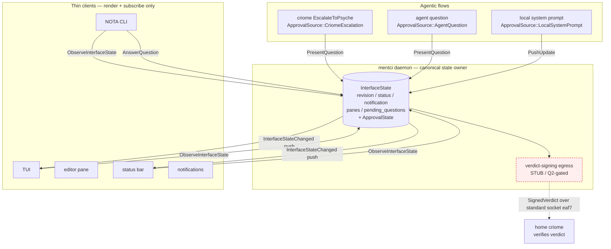

# 686.3 — Furthering the mentci PoC: the state-bearing programmable-UI daemon

A designer PoC-furthering pass. The psyche directed: further the PoC, rebase
on latest main, adapt prior relevant work to the new architecture. This report
records the design as it now stands (685 updated with the 7x5z expansion), the
working proof-of-concept built at `/tmp/mentci-poc`, the eaf7 socket-location
type, the prior-work adaptation plan, the ordered next slices, and the open
psyche questions. It is honest throughout about what is a landed/validated
artifact versus a prototype standing in for production machinery.

## 1. The mentci programmable-UI daemon — design updated for 7x5z

### 1.1 The expansion over 685

Report 685 framed mentci (7x5z) as "the human approval surface that fills
criome's dead-lettered `EscalateToPsyche` hole" — a component triad whose
daemon turns a criome escalation into a psyche-authored signed verdict. The
7x5z record as captured this session widens that framing decisively: mentci is
not only the approval surface, it is a **state-bearing programmable-UI daemon**.

The widened shape, stated as one rule: **the daemon holds the canonical UI
state, and the UI changes if and only if the daemon's state changes.** Three
consequences follow, and they reorganize the whole component:

- **Clients are thin.** The TUI, the NOTA CLI, the editor pane, the status bar,
  and notifications are renderers and subscribers — none of them holds
  authoritative state. They render exactly what the daemon last pushed and
  nothing else.
- **Agentic flows push in.** Questions, interface updates, and subscriptions
  flow *into* mentci from agentic flows over the wire. An agent does not draw
  on a screen; it mutates the daemon's canonical state, and the change fans out
  to every thin subscriber.
- **The criome approval is one use, not the whole.** `EscalateToPsyche` (gc0n,
  the dead-lettered hole mentci fills) becomes one `ApprovalSource` among
  several. The same daemon serves agent questions and local system prompts
  through the identical present/observe/answer surface.

So the noun reorganizes from "approval modal" to "canonical interface state."
Approval questions are one kind of content the canonical state holds;
status lines, notifications, and panes are others. The verdict-signing egress
(the criome leg) sits downstream of the answer path and is the only part gated
by the open psyche questions.

### 1.2 The signal-mentci contract (what validated)

The programmable-UI wire surface is prototyped as a standalone `signal-mentci`
schema at `/tmp/mentci-poc/signal-mentci/schema/lib.schema`. It was authored in
current positional / explicit-role NOTA and **validated by lowering through
`schema_next::SchemaEngine` on current schema-next main (abae95f)** —
`SchemaEngine::default().lower_source(text, SchemaIdentity::new("signal-mentci:lib", "0.1.0"))`
returned `Ok(Schema)`. A path-dep harness in `/tmp/mentci-schema-validate`
asserts the structure and passes; no real repo was touched (the schema-next
working tree shows only pre-existing flake churn).

The validated surface:

| Roster | Verbs / payloads |
|---|---|
| Requests (input root) | `PresentQuestion ApprovalQuestion`, `PushUpdate InterfaceUpdate`, `ObserveInterfaceState … opens InterfaceStateStream`, `AnswerQuestion ApprovalVerdict`, `RetractInterfaceObservation InterfaceObservationToken` |
| Replies (output root) | `QuestionPresented`, `UpdateAccepted`, `InterfaceStateSnapshot InterfaceState`, `VerdictAccepted`, `InterfaceObservationRetracted`, `Rejection` |
| Canonical state | `InterfaceState { revision status notification panes pending_questions }` — what thin clients render |
| Stream | `InterfaceStateStream` opens with an `InterfaceState` snapshot and pushes `MentciEvent::InterfaceStateChanged` on every revision |

Validated assertions (verbatim from the build result): 0 imports (standalone);
input verbs and output replies as above; `ApprovalQuestion` / `InterfaceState`
/ `ApprovalVerdict` lower as Structs; `SocketPath` is a Newtype; `ApprovalSource
= [CriomeEscalation AgentQuestion LocalSystemPrompt]`; **`ApprovalDecision =
exactly [ApproveSuggestedAnswer Reject Defer]` with free-text `Answer` absent**;
`InterfaceStateStream` registered as a stream; 35 namespace declarations.

The Q2 boundary is encoded *structurally*. The phase-1 `ApprovalDecision` is
the closed set `ApproveSuggestedAnswer + Reject + Defer`. The free-text carrier
is declared as `PendingAnswer { text }` but is deliberately **not** a variant —
with an in-schema comment to promote it as `(Answer PendingAnswer)` if and only
if the psyche resolves Q2 toward free-text preimage binding. The schema itself
draws the gate: the daemon-facing surface is ungated; only what the egress can
sign is held provisional.

### 1.3 The picture

The load-bearing invariant — UI changes iff state changes — is enforced
mechanically: every daemon mutation returns the deliveries to fan out, and the
only path to a client render is through a delivery. There is no client-side
state to drift.

## 2. The PoC at `/tmp/mentci-poc` — what is real, what is stubbed

A self-contained three-crate cargo workspace (`mentci-poc-lib` +
`mentci-daemon` + `mentci` CLI) demonstrating the 7x5z core. It builds fully
offline. I re-ran it firsthand for this report.

### 2.1 Verified status (run firsthand)

- `cargo test --offline`: **12 passing** — 10 wire-codec round-trips in
  `crates/mentci-poc-lib/tests/codec.rs`, 2 e2e over a real Unix socket in
  `crates/mentci-daemon/tests/end_to_end.rs`. Confirmed green just now.
- `cargo clippy --offline`: clean (`Finished dev profile`; the production bin
  build is 0 warnings — the prior 2 clippy notes were only in the e2e test
  target, which re-includes `server.rs` via `#[path]`).
- `bash demo.sh`: runs the full flow with real daemon + CLI processes.
  Confirmed firsthand — the subscribed thin client renders the canonical state
  pushed to it (question received, then question answered → `ApproveSuggestedAnswer`),
  and the daemon prints the stubbed signed verdict
  (`preimage=VERDICT/7/ApproveSuggestedAnswer signature=fake-sig:… q2_gated=false`).

### 2.2 What is real and tested

The 7x5z core itself is real. The daemon (`crates/mentci-daemon/src/daemon.rs`)
holds one canonical `ApprovalState` behind the `Daemon` owner; clients are thin
renderers that subscribe; agentic flows push in over a typed Unix-domain-socket
protocol. The e2e test and the live demo both show the full loop: a thin client
subscribes (empty snapshot) → an agent pushes a criome-escalation question →
canonical state changes → the subscriber observes the new render-state via push
→ the psyche answers → the subscriber observes the answered update. Interest
filters work (an `AnsweredResponses` subscriber does not see `QuestionReceived`).
Per-client subscription cleanup happens on disconnect (`Daemon::drop_client`).

The eaf7 typed connection point (`ConnectionPoint::standard_mentci(base)` →
`<dir>/mentci.socket`) is resolved identically by both sides; neither hard-codes
a raw path literal. The criome `EscalateToPsyche` is modeled as
`ApprovalSource::CriomeEscalation`.

Rust discipline holds: typed newtypes throughout, a typed per-crate `Error`
enum via `thiserror`, every `fn` a method on a data-bearing type or trait impl
(the wire codec lives on the `Line` / `LineReader` / `FieldText` nouns, not on
a ZST namespace holder), full-English identifiers. The daemon takes exactly one
startup argument and rejects flags / extra args.

### 2.3 What is stubbed (cited verbatim from the build result)

Five deliberate stubs, each carrying an in-source TODO:

1. **Verdict signer egress** — `crates/mentci-poc-lib/src/signer.rs`
   `FakeSigner` emits a deterministic non-crypto pseudo-signature (FNV-folded
   digest, not cryptography). `TODO(q1le)`: the real sub-key is decrypted by
   criome at login from the encrypted multi-key store. `TODO(Q2, STILL OPEN)`:
   signs all decision variants but tags free-text `Answer` as `q2_gated=true`
   since the signable set is undecided.
2. **criome login / decrypt** — not performed; the signer is fabricated with a
   label standing in for the persona sub-key identity.
3. **Binary startup** — the one filesystem-path arg stands in for the production
   pre-generated rkyv startup message. The single-arg / zero-flag shape is
   honored, but it parses a path, not an rkyv blob.
4. **Codec framing** — flat tab-delimited line framing (record framing, no
   recursive grammar) stands in for the production rkyv `signal::Frame` + NOTA
   nota-codec. The typed `Request` / `Reply` / `PushUpdate` enums are the
   load-bearing contract; the framing is the legible placeholder.
5. **Concurrency** — `Mutex<Daemon>` across per-connection threads instead of
   the production kameo actor. Identical state-ownership shape, different
   delivery mechanism; chosen to stay offline.

No work was done on Q1 (head) or the real verdict-signing egress beyond the
stub, per the brief's gating.

### 2.4 One honest divergence between the PoC and the validated schema

The PoC's local `ApprovalDecision`
(`crates/mentci-poc-lib/src/approval.rs:185`) **still carries the free-text
`Answer(ApprovalAnswer)` variant** (commented "Q2-gated for signing"), because
the PoC reproduces mentci-lib's existing pure-`std` approval module verbatim so
it builds offline. The validated `signal-mentci` schema, by contrast, holds
`Answer` out of the closed set (`PendingAnswer` declared but not a variant).
This is intentional and consistent: the PoC keeps the existing in-memory model
shape (so the signer can demonstrate the `q2_gated` tagging on a free-text
answer), while the *wire contract* already draws the phase-1 boundary. When the
real port lands, the in-memory decision set and the wire decision set converge
on whatever Q2 decides — the signer boundary is exactly where that decision
lands.

## 3. The eaf7 typed connection point

eaf7 (Low priority) makes standard socket locations / ports a **signal-standard
schema type** — a typed Unix-socket-path connection point (plus a port for
network cases) — so components discover each other through the shared schema
rather than ad-hoc path strings. The motivating case is the mentci → criome
standard socket.

The PoC sketches the local leg in two places, designed to converge:

- **Rust:** `crates/mentci-poc-lib/src/connection.rs` —
  `ConnectionPoint::UnixSocket(SocketPath)` with `standard_mentci(base) ->
  <base>/mentci.socket`. A `Network(Host, Port)` variant is noted as the
  off-box extension, deliberately out of scope for this Low-priority slice. The
  daemon listens on the typed value and the CLI dials the same typed value.
- **Schema:** the `signal-mentci` schema declares `SocketPath Path` and
  `StandardSocket { path SocketPath }` locally, each tagged with its eventual
  cross-import target — `signal-standard`, the standard connection-point type.

**Where it should live:** in the `signal-standard` crate (681), as a typed
connection-point type alongside `ComponentKind`. The sum is two variants — a
Unix-socket path for the local case and a host+port for the network case — and
the standard mentci → criome socket is the first consumer. It is declared
locally in `signal-mentci` only because `signal-standard` does not yet exist as
a crate; the local newtype is the temporary stand-in.

## 4. Prior-work adaptation plan

Four prior artifacts were assessed against the 7x5z architecture and current
main. The verdicts:

| Prior artifact | Verdict | Rationale |
|---|---|---|
| **telos-poc (680)** — 1730-LOC zero-dep crate | **RETIRE the crate; keep the patterns** | All load-bearing logic is either landed on criome / signal-criome main (content-addressed contracts, real BLS three-valued decision, AttestedMoment + ay3y, persisted SEMA, reference-only pulse, interest-bearing token, SubscriptionRegistry, SubscriptionPush) or designed-but-not-critical for mentci. Keep `differentiator.rs::matches()` as the canonical lattice-match design for the router; reference `quorum.rs`/`moment.rs`/`heartbeat.rs` tests when validating future refinements. |
| **content-addressed-bls criome branch** (`b97db6b`, `79367ce`) | **RETIRE the branch** | Main has landed better-integrated signal-criome work (4250cbb, 0cf326c) that subsumes the policy-object pattern; the attested-clock work (ay3y) is integrated differently on main via AttestedMoment + SubscriptionRegistry. The branch is 11 commits behind main's better path. If any attested-moment refinement is genuinely needed, cherry-pick it as a focused commit, not a wholesale rebase. |
| **signal-standard (681)** — 14-variant ComponentKind + lattice + connection point (eaf7) | **ADAPT — create the crate** | Design validated; crate not yet created. Import the 14-variant ComponentKind union reconciliation; add the eaf7 typed connection point; retire the divergent local rosters in signal-criome / signal-persona. Blocking the router lane (component-differentiator fan-out) and the mentci meta-configuration. The `/tmp/signal-standard/schema/lib.schema` still uses stale dot-fields and must be migrated to positional NOTA on creation. |
| **mentci-lib / mentci-egui approval model (7x5z)** | **ADAPT — reuse verbatim as the thin-client layer** | `approval.rs` is GUI-agnostic, MVU-structured, tested, and pure-`std` (zero GUI deps). Reuse it verbatim as the daemon model and the thin-client rendering surface. The PoC reproduced it locally to stay offline; the real port replaces the local copy with the shared module. |

The rebase shape that follows: the PoC is re-authored on a feature branch in
the real `mentci-egui` / `mentci-lib` repos (operator owns main), replacing the
local approval copy with the shared `mentci-lib::approval` module and the
tab-codec with rkyv `signal::Frame` + the nota-codec. signal-standard is
created first (it gates the meta-configuration and the router), then
signal-criome is migrated off its stale dot-notation so signal-mentci can
cross-import the criome escalation origin instead of declaring it locally.

## 5. Next slices on the feature branch, ordered

Designer furthers the PoC on a feature branch from latest main; operator owns
main. Slices ordered by dependency, with gating marked.

1. **Land signal-mentci as a real crate** (UNGATED). Move the validated
   `/tmp/mentci-poc/signal-mentci/schema/lib.schema` into a real
   `signal-mentci` repo, regenerate artifacts, build. Standalone, zero imports
   — already proven to lower on main.
2. **Create the signal-standard crate** (UNGATED, but blocks 4 and the router).
   Import the 14-variant ComponentKind reconciliation (681 § 2); add the eaf7
   typed connection point (§ 3 here); migrate `/tmp/signal-standard` off
   dot-fields to positional NOTA.
3. **Migrate signal-criome to positional NOTA** (UNGATED — Woe 4). Convert
   dot-field syntax (`socket_path.DaemonPath`) to positional
   (`socket_path DaemonPath`) and `(Vec …)` to `(Vector …)`; regenerate.
   Unblocks signal-mentci cross-importing the criome escalation origin and
   signal-standard's ComponentKind migrating out of signal-criome.
4. **Author meta-signal-mentci** (`MentciDaemonConfiguration`) — **GATED on
   slice 2** (needs `ComponentKind` from signal-standard for the component
   field). UNGATED by Q1/Q2.
5. **Port the daemon to the real repos** (UNGATED). Re-author the PoC daemon in
   `mentci-egui` / `mentci-lib`: replace the local approval copy with shared
   `mentci-lib::approval`, replace the tab-codec with rkyv `signal::Frame` +
   nota-codec, replace `Mutex<Daemon>` with a kameo actor (one `Message` impl
   per verb, per `skills/actor-systems.md`). The daemon UI core is ungated.
6. **Add subscription persistence / reconnect** (UNGATED). Client re-subscribe
   without state loss, client-crash cleanup, queue-overflow handling. The
   library types are ready; this is daemon-specific runtime integration. The
   PoC currently does drop-on-disconnect cleanup only.
7. **Resolve the verdict signable set at the signer boundary** — **GATED on Q2**.
   If free-text wins, promote `PendingAnswer` into `ApprovalDecision` as
   `(Answer PendingAnswer)`; otherwise delete `PendingAnswer` and keep the
   closed `ApproveSuggestedAnswer + Reject` set. The signer's `q2_gated` flag is
   exactly where this lands.
8. **Wire the real verdict egress** — **GATED on q1le and Q2**. criome login /
   decrypt (q1le keystore) to obtain the persona sub-key, then
   `RouteSignatureRequest` to home-criome over the eaf7 standard socket. Depends
   on slice 7 (what may be signed) and the q1le keystore landing (the custodied
   key).
9. **Head-loop composition** — **GATED on Q1**. Out of scope for the mentci UI
   core; the daemon does not depend on it. Listed for completeness so the gating
   is visible: `AuthorizedObjectKind::Head`, `MirrorAdopter`, the true-majority
   guard (`k > n/2`, not the current `required > members.len()`).

Slices 1, 2, 3, 5, 6 are entirely ungated and can proceed now. Slice 4 waits
only on slice 2. Slices 7–9 wait on psyche decisions.

## 6. Open questions for the psyche

Two questions gate the egress and the head; the build surfaced a third
boundary-shape question and confirmed one operational blocker.

- **Q1 — self-quorum head membership.** One-criome-per-machine quorum vs a
  single home criome at n=1? The mentci programmable-UI daemon core is **ungated**
  by Q1. Only the head loop (slice 9) depends on it. Carried forward unresolved.

- **Q2 — verdict preimage binding.** Free-text `Answer` vs `ApproveSuggested +
  Reject` only? The daemon-facing surface is **ungated**; only the verdict-signing
  egress (slices 7–8) depends on Q2. The signal-mentci schema already encodes
  the conservative phase-1 default (closed `ApproveSuggestedAnswer + Reject +
  Defer`, free-text held out as `PendingAnswer`), so resolving Q2 toward
  free-text is a one-line promotion and resolving it toward the closed set is a
  deletion. The PoC's in-memory model still carries free-text `Answer` (§ 2.4),
  tagged `q2_gated` at the signer — convergence with the wire set waits on this
  answer.

- **Q3 (surfaced by this build) — does the InterfaceState revision counter
  carry an attested moment, or a plain monotonic counter?** The PoC uses a plain
  `RevisionCounter Integer` so subscribers detect staleness. If cross-machine
  thin clients ever subscribe to one daemon's state, the revision may need the
  same `AttestedMoment` (ay3y) treatment the head loop uses, so two clients can
  agree on ordering without trusting wall-clock. For a single-machine daemon
  with local thin clients, a plain counter is sufficient — which is the assumed
  scope. Confirm the scope (single-machine UI daemon) so the counter can stay
  plain.

- **Operational blocker (not a psyche question, but it gates the egress):
  signal-criome is on stale dot-field notation** (Woe 4). It will not lower
  under current main's positional grammar (also uses `(Vec …)` where main wants
  `(Vector …)`), so signal-mentci cannot yet cross-import the criome escalation
  origin or the standard socket — both are declared locally in the prototype.
  Slice 3 clears this. signal-spirit (task #422) and meta-signal-spirit (task
  #423) are the migration precedent.
