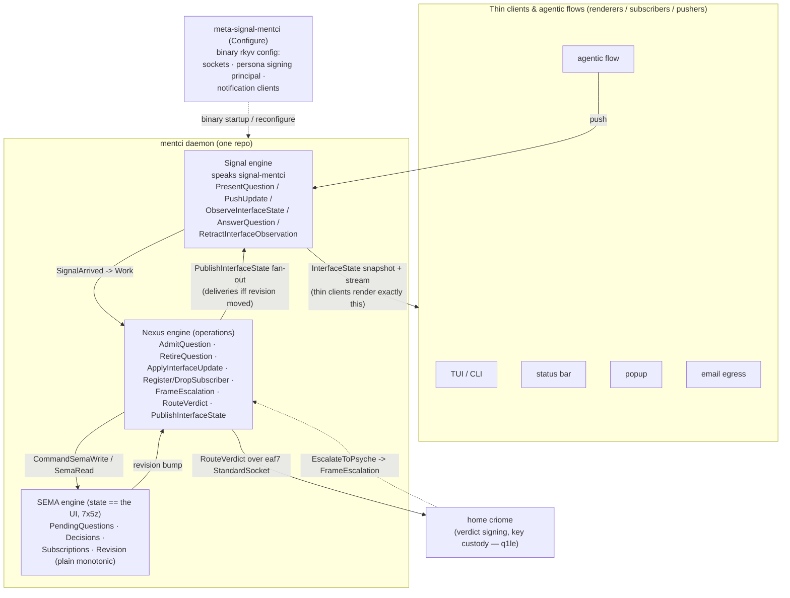

# 687 / 3 — mentci as a full first-class component

The psyche directed making mentci a full component: a daemon repo plus
its two contract repositories `signal-mentci` (working signal) and
`meta-signal-mentci` (meta policy signal), its internal Nexus schema for
operations, and its internal SEMA schema for state. This spec lays out
the whole component shape, states honestly what this build produced and
validated versus what is stubbed or declared-local, shows how it reuses
the operator's landed `mentci-lib` model (report 420) and the
`/tmp/mentci-poc` prototype, names the coordination needs and lane split,
gives ordered build slices marked gated/ungated, and records the now-
RESOLVED psyche questions (section 6: Q1 per-Unix-user via `9s52`; Q2
CLOSED verdict + edit-creates-a-new-typed-proposal via the psyche
correction + operator 421; Q3 plain monotonic counter) plus the
daemon-minted-ids and filtered-subscriptions fixes from operator 421. All
four schemas lower on current schema-next main and the Rust PoC is green.

The established model is fixed (Spirit `7sx6`): `signal-<c>` and
`meta-signal-<c>` are the TWO external contracts of a component;
Signal / Nexus / SEMA are the runtime ENGINES that live inside the
daemon. mentci is a state-bearing programmable-UI daemon (Spirit `7x5z`):
the daemon holds canonical interface state (the SEMA), the UI changes if
and only if SEMA state changes, clients are thin renderers/subscribers,
and agentic flows push questions / updates / subscriptions in. The criome
`EscalateToPsyche` approval (Spirit `gc0n`) is one use of this surface.

## 1. The full component layout

A component is one daemon repo over two contract repos, with three
engines inside the daemon. For mentci:

| Repo | Role | Kind | Status |
|---|---|---|---|
| `signal-mentci` | working wire contract | contract (schema-only) | MIGRATED to current main's field grammar + Q2 closed-verdict reshape; lowers cleanly on current schema-next main (43 declarations, 1 stream) |
| `meta-signal-mentci` | meta policy signal contract | contract (schema-only) | authored + validated this build (current main) |
| `mentci` | daemon repo (Signal + Nexus + SEMA engines, bundled thin CLI) | daemon + CLI | engine schemas authored + validated (Nexus 61 declarations, SEMA 47 declarations / 5 families); Rust PoC at `/tmp/mentci-poc` updated to the resolved design and green |

Inside the daemon repo, three engines compose. Signal is the wire edge
(it speaks `signal-mentci` to clients and agentic flows). Nexus is the
internal operations vocabulary (what the daemon DOES when a signal
arrives). SEMA is the canonical state (what the daemon STORES, and per
`7x5z` what IS the UI). The two contracts bracket the daemon: the working
signal carries traffic, the meta signal carries the policy that
configures who the daemon trusts and how it surfaces itself.

The load-bearing `7x5z` invariant is mechanical in the schema, not a
convention: a client render exists only via an `InterfaceDelivery`, a
delivery exists only inside an `InterfaceFanOut`, and a fan-out is
produced only when the SEMA revision moved. No revision move, no
deliveries, no render. The criome link is the verdict egress: a psyche
verdict on a pending question is routed home over the eaf7
`StandardSocket` for signing; criome custodies the signing sub-key
(q1le), the daemon never holds the raw key.

## 2. What this build produced and validated (honest scope)

Two artifacts were authored and lowered cleanly through
`schema_next::SchemaEngine::default().lower_source(...)` on current
schema-next main (HEAD `b3be7d0`, which has `abae95f` as an ancestor).
No real repo was touched; everything is under `/tmp/mentci-poc`. The
validation path is the report 681/686 path: lower a standalone schema
through the engine and assert the lowered shape.

### meta-signal-mentci (VALIDATED, current main)

`/tmp/mentci-poc/meta-signal-mentci/schema/lib.schema`. One meta verb
`(Configure MentciDaemonConfiguration)` mirroring meta-signal-criome;
three replies `[Configured ConfigurationRejected RequestUnimplemented]`;
15 namespace declarations; 0 imports; 0 streams. The harness at
`/tmp/mentci-poc/meta-signal-mentci/validate` prints ALL ASSERTIONS
PASSED. `MentciDaemonConfiguration` carries `socket_path`,
`home_criome_socket`, `persona_identity`, and `notification_clients`;
`PersonaIdentity` is the signing principal (persona, speaks_for,
signing_key); `ConfigurationGeneration` is a plain monotonic Integer
counter (Q3 recommendation honored — no AttestedMoment on a
single-machine config counter).

Two honest deviations from a naive meta-signal-criome mirror, both forced
by current main and documented in-schema:

- Grammar moved past `abae95f`. Current main retired the two-atom
  `field Type` struct-field syntax (commits af3705c / 95f1ee7 / 1de72dd,
  all after `abae95f`). The schema uses the current explicit-field-role
  grammar: `field.Type` dot form where name differs from type, bare
  `PersonaIdentity` where name equals snake(type) (writing `field.Type`
  there is a `RedundantExplicitFieldRole` error), and
  `(NotificationClients (Vector NotificationClient))` Type-cased role for
  the named collection field.
- Single-field brace lowers as a Newtype, not a Struct. So
  `StandardSocket`, `Configured`, and `ConfigurationRejected` lower as
  Newtypes over their one field; only the multi-field
  `MentciDaemonConfiguration`, `PersonaIdentity`, and
  `RequestUnimplemented` stay Structs. The harness asserts the actual
  lowered kinds.

Declared-local (cross-import deferred, Woe 4): `ComponentKind` (the 681
closed 14-variant roster) and `StandardSocket` (the eaf7 connection
point) are declared local with `;; (cross-import target:
signal-standard:lib:...)` tags. `MentciDaemonConfiguration` is defined
LOCALLY in the meta contract by design (not cross-imported from
signal-mentci as criome does from signal-criome), because the brief
specifies this configuration belongs to the meta signal and the
signal-criome-style cross-import is blocked.

### mentci internal Nexus + SEMA (both VALIDATED, current main)

`/tmp/mentci-poc/mentci/schema/nexus.schema` — the operations engine,
structured as the standard Work/Action reaction frame (empty imports,
`Work` input root, `Action` output root, namespace). The internal
operations vocabulary is `NexusEffectCommand`: `AdmitQuestion` (admits a
`QuestionProposal`, MINTING its id — 421 §2), `RetireQuestion`,
`AdmitAnswerProposal` (admits an edited-answer `AnswerProposal` as a new
object on the normal authorization path — Q2 resolution),
`ApplyInterfaceUpdate`, `RegisterSubscriber` (MINTS the subscription
token — 421 §3), `DropSubscriber`, `FrameEscalation` (criome escalation ->
`QuestionProposal`, so the daemon mints the question id on admit),
`RouteVerdict` (psyche verdict -> home criome over the eaf7 socket),
`PublishInterfaceState` (fan-out of the PROJECTED state per subscriber
interest — 421 §4). `NexusEffectResult` is the matching result roster
(`QuestionAdmitted` carries the minted id, `AnswerProposalAdmitted`
carries the minted proposal id + digest). Lowers Ok: 0 imports, 61
namespace declarations, 0 families, 0 streams.

`/tmp/mentci-poc/mentci/schema/sema.schema` — the state engine,
structured as the four-roster shape (imports, `[WriteInput ReadInput]`
input root, `[WriteOutput ReadOutput]` output root, namespace). The
persisted state is now FIVE families, all `key Identified`:
`PendingQuestionsFamily`, `DecisionsFamily`, `AnswerProposalsFamily` (the
edited-answer proposals admitted on the normal authorization path — Q2
resolution), `SubscriptionsFamily` (now carrying a daemon-minted token +
`InterfaceInterest` per 421 §3/§4), and `RevisionFamily` (the single
InterfaceState revision head). The revision is a plain monotonic
`RevisionCounter` per the Q3 recommendation; `AttestedMoment` +
`AttestedRevision` are declared-but-unused to mark exactly where the
cross-machine attested-clock upgrade would land. Lowers Ok: 0 imports, 47
namespace declarations, 5 families, 0 streams. The validation harness is
at `/tmp/mentci-poc/schema-validate` — extended this turn to lower ALL
FOUR schemas (the two contracts + Nexus + SEMA), probe their key types,
and assert `PendingAnswer` is absent; path-dep on schema-next, builds +
runs, prints "ALL SCHEMAS LOWERED OK"; schema-next was consumed, never
modified.

Schema-mechanics notes captured: Family `key` accepts only the literal
keywords `Domain` or `Identified` (not arbitrary newtypes) — the four
SEMA families use `key Identified` (each record carries its own identity
field), distinct from spirit's `key Domain`.

### signal-mentci MIGRATED + Q2-reshaped (VALIDATED, current main)

`/tmp/mentci-poc/signal-mentci/schema/lib.schema`. Two changes landed
together this turn and the contract now lowers cleanly on current
schema-next main (43 namespace declarations, 1 stream, 0 imports), checked
by the extended `/tmp/mentci-poc/schema-validate` harness which lowers ALL
FOUR schemas and prints `ALL SCHEMAS LOWERED OK`.

1. Field-syntax migration. The retired two-atom `field Type` struct-field
   form was migrated to current main's explicit-field-role grammar
   (confirmed against `schema-next/src/source.rs`): `field.Type` dot form
   where the name differs from `snake(Type)`; bare PascalCase `Type` where
   the name equals `snake(Type)` (a redundant explicit role is a
   `RedundantExplicitFieldRole` error); `(FieldRole (Vector X))` /
   `(FieldRole (Optional X))` Type-cased role for composite/optional named
   fields. This is the same grammar the Nexus/SEMA schemas already used; it
   resolved the prior `RetiredStructFieldSyntax {found: "label"}`.

2. Q2 closed-verdict reshape (psyche correction + operator 421). The
   verdict is CLOSED — `ApprovalDecision = [ApproveSuggestedAnswer Reject
   Defer]`. The held-out free-text `PendingAnswer` / `Answer` carrier is
   DELETED from signal-mentci, the Nexus schema, the SEMA schema, and the
   Rust PoC (it was only ever a PoC stub for the fake signer). Editing the
   suggested answer is now the `ProposeEditedAnswer` request carrying a
   typed `AnswerProposal` that re-enters the NORMAL authorization path:
   the daemon admits it as a new object, mints a `ProposalIdentifier`, and
   computes the `ProposalDigest` that the SAME closed verdict later
   approves — never a loose answer string. See section 6, Q2.

Two further fix-before-main corrections from operator 421 landed in the
same pass across all relevant schemas and the Rust PoC:

- Daemon-minted identifiers (421 §2/§3). `PresentQuestion` carries a
  `QuestionProposal` with NO id; the daemon mints the `QuestionIdentifier`
  and returns it in `QuestionPresented`. `ObserveInterfaceState` returns a
  daemon-minted `SubscriptionToken` (not a subscriber name). External
  agents never choose local SEMA row identity.
- Filtered subscriptions (421 §4). `InterfaceStateObservation` carries an
  `InterfaceInterest` (`FullInterfaceState` / `StatusOnly` /
  `Notifications` / `PendingQuestions`); subscribers receive a
  `ProjectedInterfaceState` (the revision plus exactly the selected slice,
  via `InterfaceProjection`) — a status bar / popup / email client never
  receives full question context unless it asked for `FullProjection`.

### What is stubbed or declared-local (not yet real)
- All cross-imports are declared local, not imported. The
  signal-mentci payload mirrors, the criome escalation origin, and the
  eaf7 `StandardSocket` are declared locally in every engine schema
  (tagged `;; (engine boundary: ...)` / `;; (cross-import target: ...)`),
  pending signal-standard becoming a crate and signal-criome migrating
  off stale dot-fields (Woe 4).
- No daemon Rust exists yet. These are schemas only. The in-daemon Rust
  nouns (the Nexus reaction loop, the SEMA family registrations) are a
  future operator slice via schema-rust-next.
- The verdict signer egress is a fake in the prototype (no cryptography,
  no real criome routing); the `RouteVerdict` operation carries only the
  routing envelope.

## 3. Reuse of the operator's landed model and the prototype

This is not a greenfield design. Two prior efforts ground it.

Operator report 420 (commit `81e852b1`,
`/git/github.com/LiGoldragon/mentci-lib`) landed the daemon-state /
subscription MODEL on main: `mentci-lib` was reshaped from a UI-local
model into the reusable state machine a daemon hosts. It carries
`ApprovalState` with subscription state and publish-on-change, plus
daemon-style subscription nouns (`ApprovalSubscription`,
`ApprovalSubscriptionReceipt`, `ApprovalUpdate`, `ApprovalDelivery`,
`ApprovalAnswerOutcome`) and publish/confirm commands
(`PublishApprovalUpdates`, `ConfirmApprovalSubscription`,
`ConfirmApprovalUnsubscription`). The SEMA families and the Nexus
publish/fan-out operations in this spec are the schema-level expression
of exactly that ownership shift — the SEMA `SubscriptionsFamily` and the
Nexus `PublishInterfaceState` / `InterfaceFanOut` correspond directly to
`mentci-lib`'s subscription registry and `ApprovalDelivery` publishing.
The real daemon should host the schema-emitted SEMA over `mentci-lib`'s
state machine rather than re-implementing the approval semantics.

The `/tmp/mentci-poc` prototype (offline, dependency-free, never touches
a real repo) proved the live shape end to end: `mentci-poc-lib` (the
canonical `ApprovalState`, a miniature `signal-mentci` codec, the eaf7
typed connection point, a framed transport), `mentci-daemon` (one
canonical state behind a `Daemon` owner over a Unix socket, fanning to
subscribers, one startup arg and no flags), and `mentci-cli` (the thin
first client holding no state, rendering exactly what the daemon sends).
The PoC was updated this turn to the resolved design and is green
(`cargo test --offline`: 3 daemon e2e tests + 12 codec round-trips pass;
only the two pre-existing `connection_point` dead-code warnings remain):

- The `ApprovalState` now MINTS question and proposal identifiers and
  subscription tokens (clients supply none); `receive` takes a
  `QuestionProposal` and returns a `QuestionAdmission` carrying the minted
  question. The new e2e test
  `edited_answer_is_a_new_typed_proposal_then_closed_verdict_approves_it`
  exercises the full edit -> `ProposeEditedAnswer` -> admit (mint id +
  digest) -> closed-verdict-approves flow.
- The free-text `ApprovalDecision::Answer` variant is DELETED; the verdict
  is the closed three-variant set. The fake signer no longer carries a
  `q2_gated` flag — the preimage is always a closed enumeration value.
- The CLI `present` no longer takes an id (daemon mints); `answer` drops
  the free-text arm; a new `propose <question-id> <body>` subcommand drives
  the edited-answer path.

It honestly flags its remaining stubs: the fake verdict signer (TODO q1le
only — Q2 is now resolved), the filesystem-path argument standing in for
the binary rkyv startup message, and the flat tab-delimited framing
standing in for rkyv `signal::Frame` + NOTA. The typed `Request` /
`Reply` / `PushUpdate` enums are the load-bearing contract that the real
`signal-mentci` formalizes. The prototype's `Mutex<Daemon>` is an offline
stand-in; production mentci is a kameo actor (one owner, typed message
protocol, no shared lock) — the state-ownership shape is identical, only
the delivery mechanism differs.

## 4. Coordination needs and lane split

Standing up the real component creates three NEW real repos and depends
on two operator-lane prerequisites. This is a coordination point with
operator and system-operator.

New real repos to create (coordination point):

- `signal-mentci` — contract repo. The prototype schema exists and was
  validated at `abae95f`; it needs the field-syntax migration before it
  lowers on current main, then a real crate.
- `meta-signal-mentci` — contract repo. The schema is authored and
  validated on current main this build; ready to become a crate.
- `mentci` — the daemon repo hosting the Signal/Nexus/SEMA engines and
  the bundled thin CLI (the daemon's first client, not a triad leg). The
  Nexus + SEMA schemas are authored and validated this build.

Repo creation, crate scaffolding, the kameo actor runtime, transport, and
deploy/bootstrap (the tool that encodes typed NOTA config into the binary
rkyv message the daemon accepts) are operator / system-operator work.
Designer authors and validates the schemas on a `next` branch; operator
owns main and rebases.

Operator-lane prerequisites that unblock the cross-imports (Woe 4):

- Create `signal-standard` as a crate (681). This unblocks importing
  `ComponentKind` and the eaf7 `StandardSocket` instead of declaring them
  local in all three mentci schemas.
- Migrate `signal-criome` off stale dot-field notation (Woe 4). The
  meta-signal-criome reference in `/git` also uses the retired two-atom
  struct-field syntax and will not lower on current main — flag for the
  same migration pass so the criome triad matches current grammar. This
  unblocks importing the criome escalation origin instead of declaring
  `CriomeEscalationRequest` local.

When both land, the local declarations collapse into import braces with
no change to the verb rosters or the configuration / state shapes — the
swap is mechanical and the contracts are stable across it.

## 5. Ordered build slices

With Q1/Q2/Q3 all RESOLVED (section 6), the only remaining gate is q1le
(criome key custody) on real verdict signing. Every other slice is
UNGATED.

1. DONE — Migrate `signal-mentci`'s lib.schema struct fields to current
   main's field syntax (`field.Type` + `(FieldRole (Optional/Vector X))`)
   AND apply the Q2 closed-verdict reshape. The contract now lowers on one
   schema-next main alongside the other three (validated this turn; section
   2). The prior `RetiredStructFieldSyntax` is resolved.
2. UNGATED — Create the three real repos (`signal-mentci`,
   `meta-signal-mentci`, `mentci`) with crate scaffolding. Coordination
   point with operator / system-operator.
3. UNGATED — Lower all four schemas (the two contracts + Nexus + SEMA)
   through schema-rust-next to emit the in-daemon Rust nouns: the Signal
   wire types, the Nexus reaction loop, and the SEMA family
   registrations.
4. UNGATED — Build the daemon over `mentci-lib`'s state machine (report
   420): host the schema-emitted SEMA, wire the Nexus operations, serve
   `signal-mentci` over the eaf7 socket as a kameo actor. One startup
   arg, binary rkyv config via meta-signal-mentci, no flags. The daemon
   mints question/proposal ids and subscription tokens (421 §2/§3) and
   fans the PROJECTED state per subscriber interest (421 §4).
5. UNGATED — Re-implement the prototype's thin CLI and a thin subscriber
   surface against the real wire (the prototype's flat framing replaced
   by rkyv `signal::Frame` + NOTA codec).
6. UNGATED-but-deferred — When signal-standard lands and signal-criome
   migrates, collapse the local `ComponentKind` / `StandardSocket` /
   `CriomeEscalationRequest` declarations into real cross-imports.
   Depends on the two operator prerequisites in section 4.
7. UNGATED (Q2 RESOLVED) — Wire the verdict egress: `RouteVerdict` carries
   the signed CLOSED verdict to the home criome. The verdict set is
   `[ApproveSuggestedAnswer Reject Defer]`; there is no authored-answer
   verdict variant. Editing the suggested answer is the separate
   `ProposeEditedAnswer` request carrying a typed `AnswerProposal` that the
   daemon admits as a new object (minting id + digest) on the normal
   authorization path; the SAME closed verdict then approves that object's
   digest. `PendingAnswer` is DELETED everywhere. (The egress's real
   SIGNING is still gated by q1le, slice 8.)
8. GATED (q1le) — Real verdict signing: criome decrypts the persona
   signing sub-key at login from the encrypted multi-key store and signs;
   the daemon never holds the raw key. Replaces the prototype's fake
   signer.
9. UNGATED (Q1 RESOLVED) — No cross-machine head loop. Q1 is settled by
   Spirit `9s52`: criome is per-Unix-user, not a shared multi-user daemon.
   The single-machine UI daemon keeps the plain monotonic `RevisionCounter`
   (Q3 resolved); the AttestedMoment upgrade is only relevant if mentci
   ever participates in a cross-machine head, which `9s52` rules out for
   the per-user case.

## 6. Open questions for the psyche — all RESOLVED

All three questions that gated parts of this component are now resolved.
The component core, both contracts, and the verdict-egress shape are
fully settled; only the cryptographic verdict SIGNING remains gated by
q1le (criome key custody), which is a key-management dependency, not an
open design question.

- Q1 — self-quorum head membership. RESOLVED by Spirit `9s52`: criome is
  PER-UNIX-USER. There is no shared multi-user system criome with
  in-process user lanes (a privileged system criome exists only for
  host-scoped system services under a service user — not a shared daemon).
  So mentci is a per-Unix-user single-machine UI daemon; there is no
  cross-machine head loop to join. This removes the only thing Q1 gated.
  Operator 421 concurs.

- Q2 — verdict shape / authored answers. RESOLVED by the psyche
  correction (the criome authorization model is settled) with operator
  421 concurring. Criome only authorizes objects submitted FOR
  authorization; it never mints objects from a verdict side-channel; a
  contract's answers are within a CLOSED SET. Therefore the mentci verdict
  is CLOSED: `ApprovalDecision = [ApproveSuggestedAnswer Reject Defer]`,
  exactly three variants. The held-out free-text `PendingAnswer` / `Answer`
  variant is DELETED from signal-mentci, the Nexus schema, the SEMA schema,
  and the Rust PoC — it was only ever a PoC stub for the fake signer and
  does not belong in the contract. Editing the suggested answer is NOT a
  verdict variant; it is the separate `ProposeEditedAnswer` request
  carrying a typed `AnswerProposal` (schema-represented, projected as NOTA
  for the human) that re-enters the NORMAL authorization path: the daemon
  admits it as a new object, mints a `ProposalIdentifier`, and computes the
  `ProposalDigest` that the SAME closed verdict later approves — never a
  loose answer string. This is "author your own answer" done correctly
  (operator 421). The Rust PoC proves the flow end to end (the
  `edited_answer_is_a_new_typed_proposal_then_closed_verdict_approves_it`
  e2e test).

- Q3 — InterfaceState revision counter. RESOLVED to a PLAIN MONOTONIC
  counter (the designer recommendation, confirmed; operator 421 concurs).
  A single-machine per-user UI daemon needs no AttestedMoment on its
  render-revision counter: subscribers detect staleness by comparing
  counters; no shared clock is needed. The same applies to the meta
  contract's `ConfigurationGeneration`. The SEMA keeps `AttestedMoment` /
  `AttestedRevision` declared-but-unused to mark exactly where the
  cross-machine attested-clock upgrade would land if it ever became
  cross-machine — which `9s52` rules out for the per-user case.
