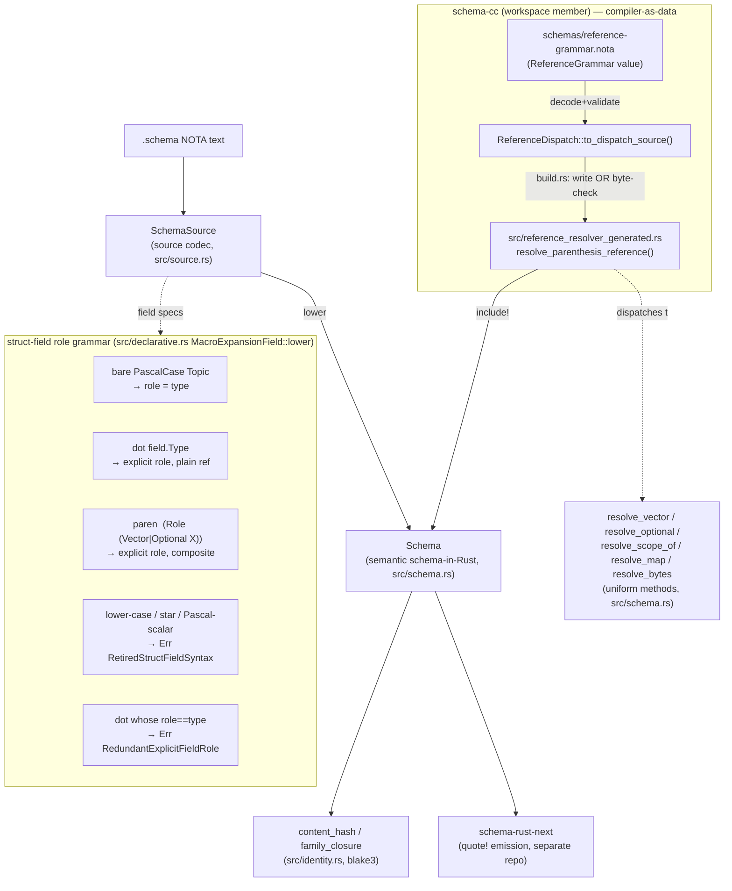

# 690.1 — engine audit: `schema-next` (codegen, schema semantics + resolver)

**TL;DR — the load-bearing finding.** Every claimed change on `schema-next`
main at `b3be7d0` is **Real and observed green** — I ran `cargo build
--offline` (deps cached, succeeded) and `cargo test --offline` once:
**176 passed / 0 failed** in schema-next, **20 passed / 0 failed** in the
co-located `schema-cc` workspace member. The two strongest claims hold at
**artifact** strength, not merely capability: (1) schema-cc *replaced* the
hand-written `from_parenthesis_objects` match — the identifier survives only
in `ARCHITECTURE.md` prose, nowhere in `.rs` source — with a build-time
freshness-gated generated file (`src/reference_resolver_generated.rs`) that
`build.rs` byte-compares against a fresh schema-cc emission on every compile
and **fails the build on drift**; and (2) the three struct-field reject
paths each have real reject tests asserting the actual error strings. The
one drift worth a bead: **`skills/structural-forms.md` is stale on the
family form** — it shows a *positional* family `(Family StoredRecord records
Domain)` (line 100), but the code, `INTENT.md`, and every fixture use a
*labeled map* `(Family { record Entry table entries key Domain })` that is
hand-parsed by field-name string match. Trait/impl `{| |}` bodies remain
documented-as-future, not implemented (consistent with Spirit `bpyu`/`d3r2`).

## What the engine is

`schema-next` turns authored `.schema` NOTA into the typed,
rkyv-serializable schema-in-Rust image (`Schema`). It does **not** emit Rust
source (that is `schema-rust-next`). Its resolver — inline-decl hoisting,
visibility tagging, ordering, symbol paths, parenthesis-reference dispatch —
lives as **methods on schema-in-Rust source types** (`TypeReference`,
`SchemaSource`, `MacroExpansionField`). Asschema is gone: `grep -i asschema
src/` returns nothing.

## Verified changes

### Structural field-role grammar (af3705c → 95f1ee7 → 1de72dd)

The three commits landed in this chronological order (af3705c 11:18 →
95f1ee7 13:14 → 1de72dd 13:58 on 2026-06-18) — the "support explicit roles"
commit is **last**, layering acceptance on top of the two rejects.

The current dispatch in `MacroExpansionField::lower`
(`src/declarative.rs:1768-1816`) is, in order:

1. `is_explicit_field_pair()` (parenthesis, 2 objects, **lowercase**-led
   first object) → `Err(RetiredStructFieldSyntax)` — `declarative.rs:1773`.
2. `explicit_structural_field()` (parenthesis, 2 objects, **PascalCase**
   first object, second object **not** a bare string i.e. a composite) →
   accepted explicit role — `declarative.rs:1782`, body at `1850-1886`.
3. non-string object → native type-reference (`(Vector T)` etc.) —
   `declarative.rs:1785`.
4. string containing `.` → `explicit_dot_field` — `declarative.rs:1793`,
   body `1818-1848`.
5. string that is `*` or lower-case-led → `Err(RetiredStructFieldSyntax)` —
   `declarative.rs:1796-1804`.
6. reserved scalar name (`String`/`Integer`/`Boolean`/`Path`/`Bytes`) bare
   → `Err(RetiredStructFieldSyntax)` — `declarative.rs:1807`.
7. otherwise bare PascalCase → role IS type — `declarative.rs:1812`.

The redundant-role reject fires inside `explicit_dot_field` when
`name.field_name() == reference.field_name()` and the type is not a reserved
scalar (`declarative.rs:1837-1843`).

The two error variants are typed on `SchemaError`
(`src/engine.rs:70-74`): `RetiredStructFieldSyntax { found }` and
`RedundantExplicitFieldRole { found, type_name }`.

**Reject tests are real** (not name-only — they assert the rendered/typed
error):
- `tests/source_codec.rs:511-525` `duplicate_inline_and_namespace_declarations_are_errors`
  asserts the error contains `"retired struct field syntax topic"`.
- `tests/source_codec.rs:527-541` `duplicate_inline_declarations_are_errors`
  asserts `"retired struct field syntax String"` (Pascal-scalar path).
- `tests/source_codec.rs:543-555` `redundant_dot_field_roles_are_errors`
  asserts `"redundant explicit field role topic.Topic"` **and** `"just use
  Topic"`.
- `tests/lowering.rs:199-214` `redundant_dot_field_roles_are_rejected`
  asserts the exact typed `SchemaError::RedundantExplicitFieldRole { found:
  "topic.Topic", type_name: "Topic" }`.

**Accept tests are real, at round-trip + canonical-text strength:**
- `tests/collections.rs:99-117` `explicit_structural_field_roles_lower_recursively`
  — `(Topics (Vector Topic))` → name `topics`, `Vector<Topic>`;
  `(Limit (Optional Integer))` → `limit`, `Optional<Integer>`.
- `tests/source_codec.rs:84-109` `schema_source_explicit_structural_fields_round_trip`
  — asserts the **canonical text is byte-stable** through decode→to_schema_text→re-decode,
  i.e. the parenthesized composite form survives source projection, not just lowering.

**Single-field brace → Newtype** verified at `tests/lowering.rs:180-197`
(`single_field_brace_declarations_lower_to_newtypes`): both `Entry { Topic }`
and `Wrapper { value.Topic }` lower to `TypeDeclaration::Newtype`, not
`Struct`. Matches structural-forms.md.

**Family `key` accepts only `Domain | Identified`** — `FamilyKey` is a
closed structural-macro enum of two `#[shape(keyword=...)]` variants
(`src/schema.rs:1415-1419`); `SourceFamilyFields::insert` routes the `key`
slot through `FamilyKey::from_structural_block` (`src/source.rs:1340-1342`),
so any other atom is a structural decode error. Test
`tests/family_declarations.rs` (in the green run) exercises both `Domain`
and `Identified`.

### schema-cc resolver integration (aa13b4b, 1a93aad, caa7797)

- **aa13b4b** co-located schema-cc as a `[workspace] members = ["schema-cc"]`
  build-only `path` dependency (`Cargo.toml` build-dependencies), Spirit
  `vpbx` ("schema-cc generates the schema compiler from typed data").
- **1a93aad** is the real retirement. `git show 1a93aad -- src/schema.rs`
  shows the entire hand-written `from_parenthesis_objects` match deleted and
  its body split into uniform `resolve_vector / resolve_optional /
  resolve_scope_of / resolve_map / resolve_bytes` methods
  (`src/schema.rs`, lifted verbatim per the doc-comments), the call site
  changed to `Self::resolve_parenthesis_reference(...)`
  (`src/schema.rs:1827`), and `include!("reference_resolver_generated.rs")`
  appended (`src/schema.rs` tail). **`grep from_parenthesis_objects src/
  schema-cc/` hits only `schema-cc/ARCHITECTURE.md` prose** — the function is
  gone from all Rust source. This is **replacement, not addition.**
- **caa7797** wired the build.rs generation + freshness gate and the
  schema-cc dispatch/validate tests.

**The dispatch is genuinely data.** `schemas/reference-grammar.nota` holds
the single line `(ReferenceGrammar (Builtin Vector 1) (Builtin Optional 1)
(Builtin ScopeOf 1) (Builtin Map 2) (Builtin Bytes Atom) DeclaredMacro
Application)`. `build.rs:68-79` decodes it via
`ReferenceGrammar::from_structural_nota`, validates
(`ValidatedReferenceGrammar::try_from`), emits
(`ReferenceDispatch::from(&validated).to_dispatch_source()`). The generated
`resolve_parenthesis_reference` (`src/reference_resolver_generated.rs:19-56`)
preserves the old match exactly: same five heads at the same arities, the
same `RESERVED_BUILTIN_HEADS` wrong-arity guard
(`reference_resolver_generated.rs:42-54`), the same
`from_macro_or_application` fallback.

**Artifact discipline (the strong claim):** `build.rs:83-101`
`write_or_check` either writes (when `SCHEMA_NEXT_UPDATE_RESOLVER` is set) or
**byte-compares the committed file against the fresh emission and fails the
build on any mismatch**. Since `cargo build --offline` **succeeded**, the
committed `reference_resolver_generated.rs` is provably fresh against
schema-cc's emission at audit time. schema-cc's own
`emitted_dispatch_matches_golden_source` test (green) pins the emission to a
golden. So the generated dispatch **cannot silently diverge** from the
grammar — this is artifact discipline, satisfying Spirit `549v` (reify
dispatch precedence as a typed value) and `v0n6` (no hand-parsing above the
seed). `build.rs` itself respects the free-function override: `fn main()`
plus a data-bearing `struct GeneratedResolver` whose freshness gate is a
method on it.

### Nested namespace POC (61aa1bf)

Real and tested. `tests/source_codec.rs:111`
`nested_namespace_router_envelope_round_trips_and_lowers` exercises
`tests/fixtures/source-codec/nested-router-namespace.schema`, a
`router:routed_object { ... }` scoped sub-namespace whose inner `Envelope {
Destination Contract Operation Exchange ... }` uses the new positional
field forms. Green. Marked **Real (POC scope)** — the commit message and
single-fixture coverage frame it as a proof-of-concept, not the general
nested-namespace surface.

### Generics / applied-frame expansion (f130937, e721626)

- **f130937** expands applied frame roots from pipe-generic `(| [T] body |)`
  declarations into concrete roots. The `(|...|)` PipeParenthesis generic
  declaration is implemented and consumed (`src/schema.rs:1549,1562`).
  Tests: `tests/reaction.rs` `migrated_input_frame_expands_to_the_concrete_input_root`,
  `migrated_output_frame_expands_to_the_concrete_output_root`,
  `spirit_binds_every_frame_leg_full_frame`, plus the
  `tests/generics.rs` application-root suite — all green. This is the
  **proven generics-and-expansion leg** of Spirit `d3r2`.
- **e721626** is a doc-only commit (INTENT.md +11, ARCHITECTURE.md +65)
  documenting the generics/traits/component-codegen constraints; it adds the
  "type kind announced by delimiter; `{| |}` trait/impl shape still to be
  designed" paragraph. Consistent with `bpyu` and `d3r2`.

### Toolchain (7318654, b3be7d0)

Build-infra only, no engine logic. **7318654** moves `flake.nix` to the
shared `rust-build` flake input (`github:LiGoldragon/rust-build`, providing
crane + toolchain). **b3be7d0** pins rust-build to a revision with custom
toolchain support (`flake.lock` 3-line bump). Note: `rust-toolchain.toml`
pins channel `1.85.0`; the ambient cargo is 1.96.0, so the canonical build
is the nix/crane path — I verified the **cargo offline path** green, which
is the engine-logic witness; the nix toolchain pin is the CI witness I did
not execute (no network for the flake input).

## Drift and gaps

**DRIFT — `skills/structural-forms.md` family form is stale.** Line 100
shows a *positional* family `RecordsFamily (Family StoredRecord records
Domain)` and line 104-106 describes "slot 1 record type, slot 2 lowercase
table literal, slot 3 key kind." But the **code, INTENT.md, and every
fixture** use a *labeled map*: `EntryFamily (Family { record Entry table
entries key Domain })`
(`tests/fixtures/source-codec/family-declarations.schema:13`,
`INTENT.md:133`). The implementation
(`SourceFamilyFields::from_block`/`insert`, `src/source.rs:1321-1350`)
matches on the literal field-names `"record"/"table"/"key"`. So the skill
documents a form the engine does not accept. Either the skill must be
updated to the labeled form, or the code re-aligned to positional — the
skill currently misleads an author.

**GAP — family declaration is hand-parsed above the seed (v0n6 violation).**
`SourceFamilyFields::from_block` reads the brace body with a manual
`chunks_exact(2)` + string-name `match` (`src/source.rs:1321-1350`) rather
than a typed structural-macro node. INTENT.md's own v0n6 clarification calls
surviving hand-parsing sites "design violations to fix." This predates the
audited commits but is live debt on the family surface.

**GAP — trait/impl `{| |}` bodies are documented-as-future, not
implemented.** PipeBrace is recognized as a delimiter
(`src/schema.rs:2007,2527,2537`) but rejected at type-reference position;
INTENT.md and structural-forms.md both say the shape "is still to be
designed." Consistent with Spirit `bpyu`/`d3r2` (the open piece), so this is
an expected gap, not drift — flag only so the audit's completeness critic
sees it.

**NOTE — governing record id.** The prompt cites "Spirit vez8" as governing;
`(PublicTextSearch vez8)` returned no match. The records that actually govern
this surface are `549v` (reify dispatch precedence), `vpbx` (schema-cc
generates the compiler), `v0n6` (no hand-parsing above the seed), `bpyu`
(pipe-brace impl shape), `d3r2` (component-codegen direction, LOW certainty),
and `wrjl`/`x0ja` (content-address + blake3). The "Asschema removed" claim
the prompt attributes to vez8 is independently confirmed in code (no
`asschema` in `src/`). Recommend the orchestrator confirm the intended id.
