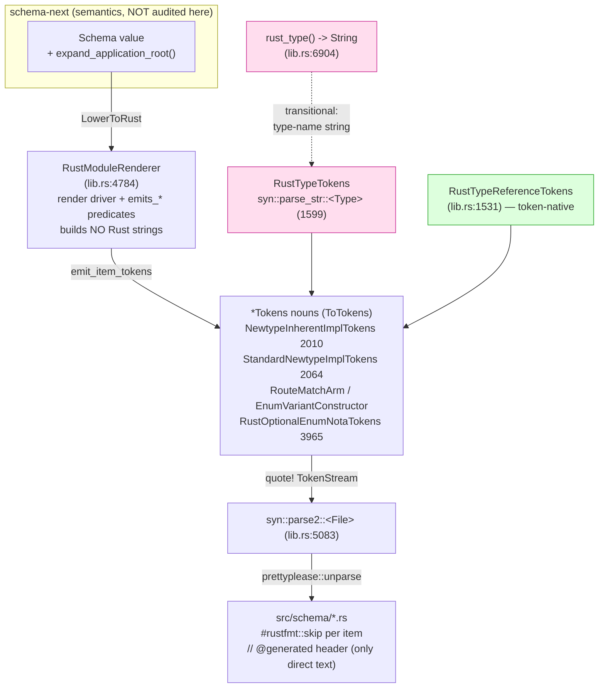

# 690/2 — schema-rust-next: the Rust emission engine (audit)

**TL;DR — load-bearing finding:** Every audited change in `schema-rust-next`
(HEAD `bb4dfe2`) is **real, token-based, and test-green** — 92 tests pass
across all 10 test binaries (observed this session), the emitter crate is
`cargo clippy --lib`-clean (observed, 37s), and the new surfaces are built
with `quote!`/`ToTokens` exactly as Spirit `4np2`/`e6v5` demand. The
INTENT.md claim that the hand-rolled string emitter is *fully retired* holds:
`RustWriter` and `self.line` have **zero** references; `RustModuleRenderer`
replaced them and builds no Rust as strings. The one nuance: a residual
String-typed type-syntax path (`rust_type()` → `syn::parse_str`) coexists
beside the token-native `RustTypeReferenceTokens` — type *names* are still
assembled as strings and re-parsed, not held as tokens end-to-end. The
load-bearing **drift from design report 663**: the standard-newtype-impl
landing is *narrower than 663 recommended* — impls are enabled **only on the
WireContract build path** (not flipped to a global default, the opt-in flag
was kept), and 663's slices 1/3/4 (shape-derived `Capability` resolution +
typed `SchemaError` for the ~8 generator `panic!`s, the `*deref` marker, and
struct/enum `is_/as_` accessors) are **not landed**. The shipped subset is
correct and matches 663's Bucket-1/Bucket-2 policy byte-for-byte.

## What this engine is

`schema-rust-next` is the **Rust emission layer** of the codegen engine. It
lowers a semantic `schema_next::Schema` into Rust *source* via Rust's real
macro substrate (`proc_macro2::TokenStream` + `quote!` + `ToTokens`), parsed
once through `syn`/`prettyplease` into pretty-printed `src/schema/*.rs`. It
owns emission only; it depends on `schema-next` for semantics and must not
re-define them (INTENT.md:87-94). `expand_application_root` — the frame
monomorphizer used below — lives in `schema-next` (`schema.rs:654`), called
from here via `self.` in `lib.rs:392`, so the layering holds.

## Verified changes

### Standard newtype impls — `cad9ec2` + `f265aad` (Partial vs report 663)

`f265aad` ("demonstrate schema-implied newtype trait impls") introduced two
emitter nouns; `cad9ec2` ("enable … for wire contracts") turned them on for
the contract-crate build path.

- **`NewtypeInherentImplTokens` (`lib.rs:2010-2057`)** — Bucket 1 inherent
  surface, **unconditional**: `new`, `payload(&self) -> &Inner`,
  `into_payload`, `From<Inner>`. Refinement beyond 663: string-backed
  newtypes take `pub fn new(payload: impl Into<String>)` (`lib.rs:2027-2032`)
  so `&str` literals pass without `.to_string()`. **Real.**
- **`StandardNewtypeImplTokens` (`lib.rs:2064-2158`)** — Bucket 2,
  **gated on `scalar_like()`** (`lib.rs:2088-2090`): returns early and emits
  nothing for non-scalar inners (`lib.rs:2095-2097`). String/Path →
  `Display` + `AsRef<str>` + `PartialEq<&str>`; Integer → `PartialEq<u64>` +
  `PartialOrd<u64>`; Boolean → `PartialEq<bool>`. This is 663's policy
  (report lines 164-167) exactly. **Real.** The generated fixture proves
  `WrappedName` (newtype over schema-type `NameText`) gets ONLY the inherent
  surface and NO scalar impls (`tests/fixtures/standard_newtype_impls_generated.rs:186-203`),
  matching the test assertion at `tests/standard_newtype_impls.rs:58-61`.
- **Enum unique-payload `From`** also lands: the fixture emits
  `impl From<NameText> for Input` / `for Output`
  (`standard_newtype_impls_generated.rs:220-231`) — 663's Bucket-2
  unique-payload-variant `From`.
- **Default policy DRIFT.** 663 recommendation #2 said *flip
  `standard_newtype_impls` to default-ON and remove the opt-in flag*. The
  implementation kept the flag `false` in all three constructors
  (`lib.rs:498/514/527`) and enabled it **only** for the WireContract path
  via `build.rs:159` (`wire_contract_module().with_standard_newtype_impls()`).
  Declaration / Nexus / SEMA / daemon emission do NOT get the impls. This is
  a deliberately narrower landing than 663 — correct for published
  `signal-*`/`meta-signal-*` contracts (which is where the wire-facing
  newtypes live), but it means the policy is *per-target*, not *global*.
- **Evidence:** `cargo test --test standard_newtype_impls` → **3 passed**
  (observed). `generated_standard_impls_compile_and_delegate_to_payloads`
  (`tests/standard_newtype_impls.rs:69-89`) compiles the checked-in fixture
  AND exercises `.to_string()`, `.as_ref()`, `== "schema"`, `count > 10` —
  artifact discipline, not just capability.

### What report 663 specified but did NOT land (gaps)

- **Slice 1 — shape-derived `Capability` resolution + typed errors.** No
  `Capability`, no `UnresolvedComposition`, no `receiver_shape`
  (`grep` returns nothing in `src/`). The emitter still has **~8 internal
  `panic!` paths** for schema-shape misalignments: `lib.rs:3629, 3635, 3647,
  3657, 3813` (scope/payload, several added by `a526405`) and `6260, 6356,
  6367, 6378` (nexus projection). `SchemaError` exists and is the public
  emit-boundary type (`lib.rs:92`), but these were not converted — a
  malformed schema yields a generator panic, not a typed error. This is
  663's operator-finding-1, unlanded.
- **Slice 3 — `Deref` `*deref` marker.** No `Deref` emission and no marker
  anywhere (the only `as_deref` hits are `Option::as_deref`). 663 Bucket 3
  unimplemented; the ~24 hand-written Deref wrappers in the real code remain.
- **Slice 2 sub-case — transitive scalar.** No transitive-scalar chain
  following; `Statement(StatementText(String))` would still be skipped as
  non-scalar. Unimplemented.
- **Slice 4 — struct field accessors + enum `is_/as_<variant>`.** No
  `FieldAccessor`/`VariantPredicate` emitters. Bucket 1 completion for
  struct/enum shapes unimplemented (enum `route` IS emitted — fixture
  `:304-363`).

### Frame expansion — `71838fa` (Real) + `9ffa588` (Real)

- **`71838fa`** monomorphizes applied frame roots: `LowerToRust for Schema`
  (`lib.rs:372-396`) now calls `self.expand_application_root(application)`;
  a resolvable head produces a CONCRETE empty-parameter `EnumDeclaration`
  that lowers through the same concrete-enum path (constructors, `From`,
  accessors, nota, wire), and an unresolvable head falls back to the legacy
  type-alias path — an explicit documented rollback that "stays until the
  expansion is proven" (`lib.rs:375-381`). **Transitional surface flagged**:
  the legacy `application.lower_to_rust` alias path coexists. Evidence:
  `spirit_frame_application` → **35 passed** (observed); fixture
  `spirit_nexus_generated.rs` grew +155 lines in the commit.
- **`9ffa588`** adds `NexusDaemonShape::with_working_streams()`
  (`daemon_emit.rs:62-66`) so a dependency-hosted working contract — whose
  stream declarations aren't in the local Nexus schema — still emits stream
  support: `emits_stream = shape.working_streams() || !schema.streams().is_empty()`
  (`daemon_emit.rs:306`). Method-on-data-bearing-type, clean. Evidence:
  `daemon_emission` → **6 passed** (observed).

### Emission quality — `a526405`, `660d350`, `e6d1394` (all Real, token-based)

- **`a526405` (terminal domain scopes):** adds `scope_payload_source_name`
  + a `terminal_payload` discriminant and emits `Self::Variant(#scope::All)`
  for terminal scope variants. **1 `quote!`, 0 `format!`/`self.line`** added
  for source. Note: introduced two of the `panic!` paths above
  (`lib.rs:3635/3647`). Evidence: `emission` → **12 passed** (observed); new
  fixture `domain-terminal-scope.schema` + `tests/emission.rs` assertions.
- **`660d350` (optional-enum terminal variants):** introduces
  `RustOptionalEnumNotaTokens` (`lib.rs:3965`) — a `ToTokens` noun, **8
  `quote!`, 0 `format!`** for source. Encodes `Option<T>` enum payloads as
  terminal variants in the NOTA decoder.
- **`e6d1394` (clippy-clean optional decoders):** the precise
  `clippy::collapsible_if` fix — nested `if … { if let … }` collapsed to
  `if … && let …` (edition-2024 let-chains, `Cargo.toml:4`). Token-based
  (inside the `RustOptionalEnumNotaTokens` `quote!`). **Capability claim**
  for "clippy-clean *generated decoder*": verified by reading the lint-fix
  diff + edition; NOT observed as clippy-green output (no checked-in fixture
  currently exercises `demote_to_string`, and I did not run clippy over a
  generated decoder). The **emitter crate itself** is clippy-clean
  (`cargo clippy --lib` → no warnings, observed).

## String-emission migration: is it really complete?

INTENT.md:106-121 claims the migration is **complete** and `RustWriter` is
**gone**. Verified true in the strong sense:

| Probe | Result |
|---|---|
| `RustWriter` references in `src/` | **0** |
| `self.line(` references | **0** |
| `RustModuleRenderer` (replacement) | present (`lib.rs:4784`), builds no Rust strings |
| `quote!` blocks | 185 (lib) + 132 (daemon_emit) + 28 (migration) |
| `impl ToTokens` | 50 (lib) + 11 (daemon_emit) + 2 (migration) |
| `format!` building Rust **source** | only the `// @generated` header (3 emitters) — prettyplease drops comments, so it can't route through tokens |

**One soft edge (low severity).** `rust_type()` (`lib.rs:6904`) still
assembles type *syntax* as a `String` (`Vec<{}>`, `BTreeMap<{}, {}>`,
`{}Scope`) and `EnumConstructorPayload` builds `"{}::new(payload)"`
(`lib.rs:5450`); both are re-parsed into real `syn::Type`/`syn::Expr` via
`RustTypeTokens`/`syn::parse_str` (`lib.rs:1599, 4871`). This is a
String-typed intermediate, not "Rust source built by `format!`," so the
migration claim stands — but the token-native `RustTypeReferenceTokens`
(`lib.rs:1531`, 9 call sites) is the cleaner path and `rust_type()` (12 call
sites) is the residual transitional surface that could be folded into it.

## Governing intent

Spirit `4np2` (VeryHigh — emit via Rust's real macro infra, not string
codegen), `e6v5`/`de8i` (High — lowering as methods/`ToTokens` on the nouns),
`vez8` (Maximum — hand-rolled string emitter replaced entirely), and the
migration-debt records `0bw0`/`o7a3` (High) are all honored by the current
emitter. The standard-newtype work is co-signed psyche+operator direction
`d3r2` (Clarified) as analyzed in nota-designer report 663 — the audited
landing is the conservative subset of that report.

## Coherence with the other engines

`schema-rust-next` consumes `schema-next` semantics (`expand_application_root`
lives there; this engine only emits) — the codegen-tier layering the 690
frame describes is intact. The WireContract-scoped standard-newtype-impl
landing means published `signal-*`/`meta-signal-*` contract crates (criome,
spirit, mentci, standard) get the inherent + scalar surface in their
generated `src/schema/lib.rs`; the cross-cutting critic should confirm those
consumers actually regenerated against this emitter (the spirit/signal-spirit
audits will show `876c272` "generated standard newtype impls" downstream).
